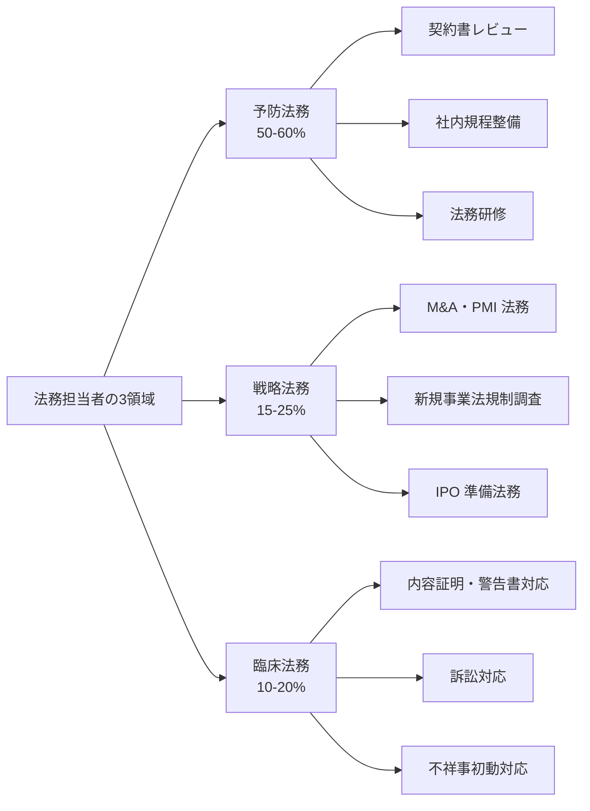
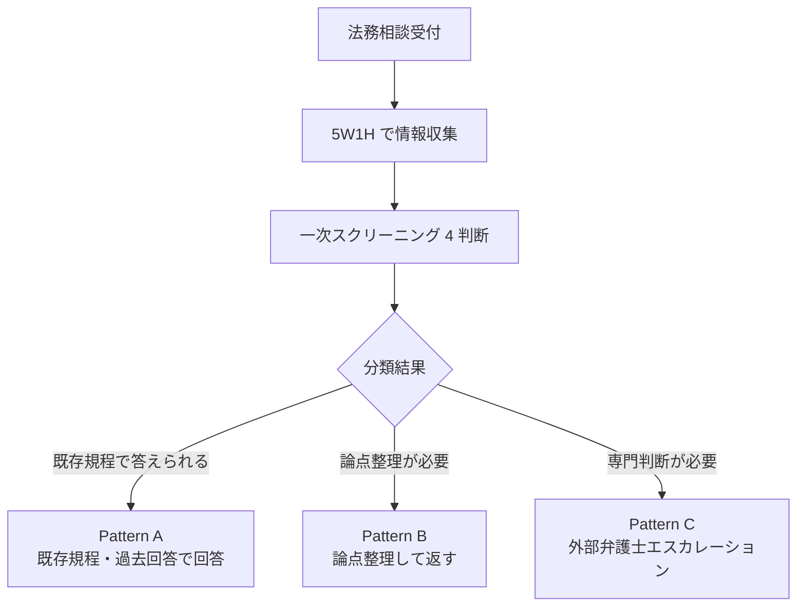
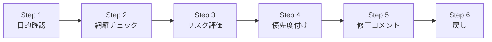
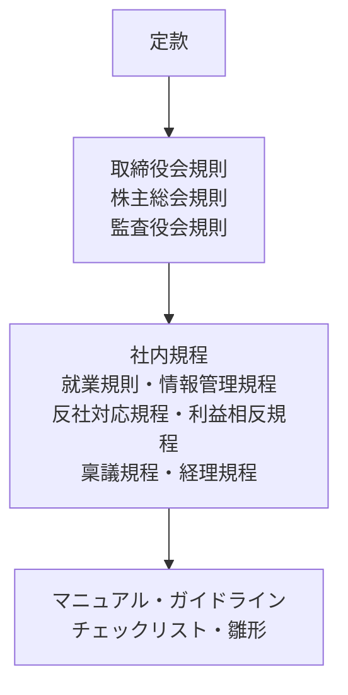
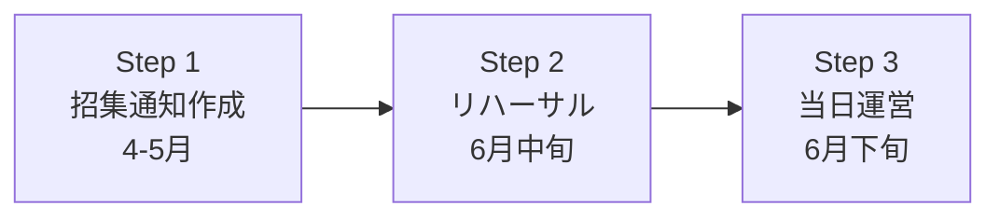
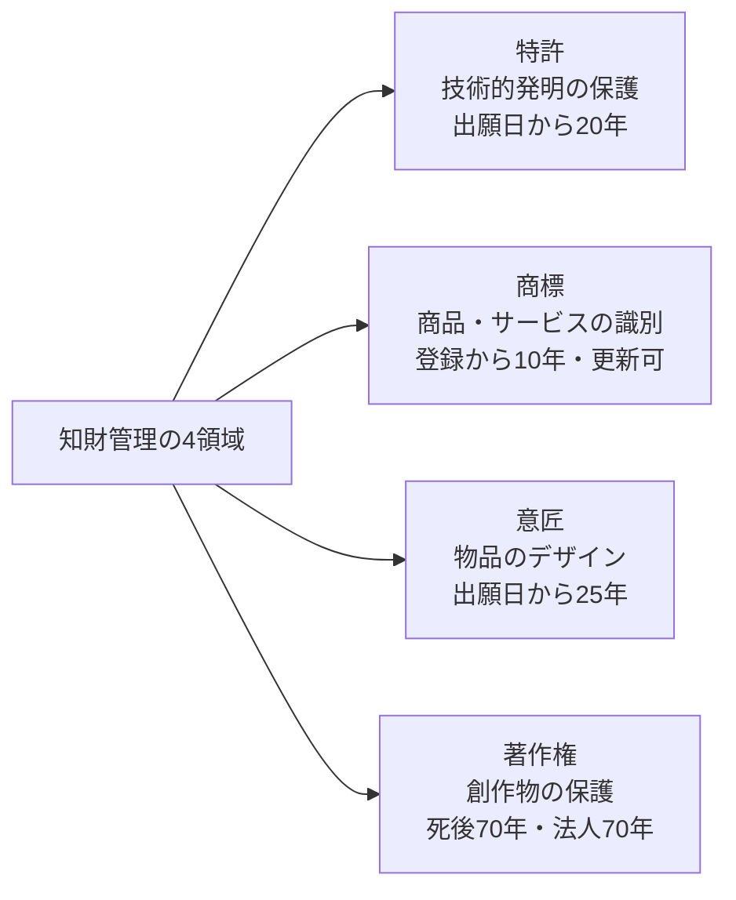
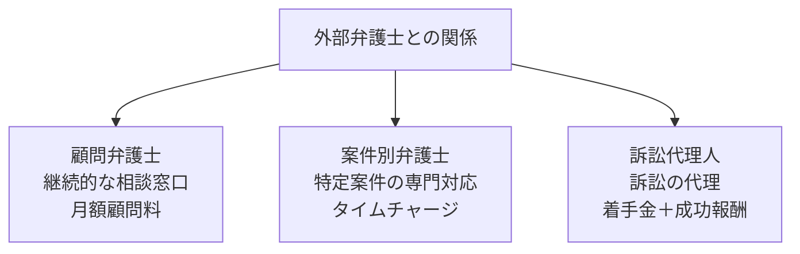

# 法務担当者入門

「予防・戦略・臨床」の 3 領域で読み解く企業法務——事業部相談・契約書レビュー・社内規程・株主総会・外部弁護士連携を 2026 年 7 月時点の実務で体系化

| 項目 | 内容 |
|---|---|
| カテゴリー | 法務・契約実務 |
| 難易度 | 中級 |
| 所要時間 | 約200分（全8レッスン） |
| 公開日 | 2026-07-17 |
| 最終更新日 | 2026-07-17 |
| コースURL | https://skillup.college/courses/legal/legal-department-basics/ |

## 対象者

中堅企業（従業員 100〜1,000 名規模）の法務担当者 1〜3 年目、法務未経験で異動配属された方、一人法務・少人数法務のマネジャー、事業部で法務相談を出す立場の企画・営業担当者、法務体制の立ち上げを検討している経営企画・総務担当者。

## 前提知識

ビジネス法務の基本用語（契約書・NDA・株主総会）を耳にしたことがある程度。司法試験の資格は不要（本コースは資格対策ではなく実務スキル）。

## 学習目標

- 法務の 3 領域（予防・戦略・臨床）と年間業務サイクルを俯瞰できる
- 事業部からの法務相談への一次対応と論点整理の型を持てる
- 契約書レビューの 6 ステップと優先度付けの作法を持ち帰れる
- 社内規程の体系と整備・改訂サイクルを組み立てられる
- 株主総会・変更登記・IPO 準備法務の入口を扱える
- 知財管理と紛争・訴訟対応の初動 5 ステップを回せる
- 外部弁護士との連携・法務予算・レポーティングの型を持てる
- 法務担当者のキャリアパスと修了後の学び方を持ち帰れる

## コース概要

法務担当者は、事業部の相談を受け止め、論点を整理し、必要に応じて外部弁護士に橋渡しし、社内規程と契約書で会社を守る仕事です。ただし、その実務は条文の解釈に詳しくなることではなく、事業部との対話能力・論点整理のスピード・優先順位付けの判断力が中心を占めます。本コースは、中堅企業（従業員 100〜1,000 名規模）の法務担当者 1〜3 年目、法務未経験で異動配属された方、一人法務・少人数法務のマネジャーを対象に、法務の 3 領域・年間業務マップ・事業部相談の一次対応・契約書レビュー・社内規程・株主総会・知財・紛争対応・外部弁護士連携までを 8 レッスンで体系化します。個別法律の詳細解釈や資格試験対策は既刊コンプライアンス基礎や司法試験教材に譲り、本コースは「法務担当者が業務サイクルを回す実務」に軸足を置きます。

## 学習の流れ

前半 3 レッスンで法務の全体像と日常業務の中核を扱います。レッスン 1 で法務の 3 領域と年間業務マップ、レッスン 2 で事業部からの相談への一次対応、レッスン 3 で契約書レビューの型を扱います。中盤のレッスン 4 で社内規程の整備と運用、レッスン 5 で株主総会・登記・IPO 準備法務を扱い、会社法まわりの節目業務を組み立てます。後半のレッスン 6 で知財管理と紛争・訴訟対応の初動、レッスン 7 で外部弁護士との連携・法務予算・レポーティング、レッスン 8 で法務担当者のキャリアと修了後の学び方までを扱います。全 8 レッスン・約 200 分の構成です。

## レッスン一覧

| No. | タイトル | 概要 | 所要時間 |
|---|---|---|---|
| 1 | 法務担当者とは何か——3 領域と年間業務マップ | 法務の 3 領域（予防・戦略・臨床）、年間業務カレンダー、コース守備範囲・境界明示（全社員向けコンプラ意識・個別法律の詳細解釈は既刊譲り／弁護士業務との境界）を学ぶ | 25分 |
| 2 | 事業部からの相談を受ける——一次対応と論点整理 | 相談受付の型（5W1H）、一次スクリーニング 4 判断、法務相談の 3 パターン（既存規程で答える／論点整理して返す／外部弁護士へエスカレーション）、社内向け法務ポータル設計、レスポンス SLA を学ぶ | 25分 |
| 3 | 契約書レビューの型 | 契約書レビュー 6 ステップ（目的確認→網羅チェック→リスク評価→優先度付け→修正コメント→戻し）、契約 4 分類（取引基本・業務委託・NDA・SaaS）の共通論点、修正マーカー運用、リーガルテックの位置づけを学ぶ | 25分 |
| 4 | 社内規程の整備と運用 | 規程体系 3 階層（定款→取締役会規則→社内規程）、規程ドラフト起草 5 ステップ、就業規則・情報管理・反社対応・利益相反・稟議規程の位置づけ、規程改訂サイクル、規程が運用されない 5 パターンと対策を学ぶ | 25分 |
| 5 | 株主総会・登記・IPO 準備の入口 | 株主総会 3 段階（招集通知作成→リハーサル→当日運営）、招集通知・議案・想定問答、株主提案対応、変更登記（本店移転・役員変更・増資）のタイミングと司法書士連携、IPO 準備法務の全体像を学ぶ | 25分 |
| 6 | 知財管理と紛争・訴訟対応の初動 | 知財管理の 4 領域（特許・商標・意匠・著作権）と発明報奨制度、商標調査発注、内容証明受領時の初動 3 判断、訴状受領時の 5 ステップ、和解交渉の入口、警告書の枠組み、社内エスカレーションを学ぶ | 25分 |
| 7 | 外部弁護士との連携・法務予算・レポーティング | 外部弁護士 3 分類（顧問・案件別・訴訟代理）、依頼書 5 要素、費用体系（顧問料・タイムチャージ・成功報酬）、法務予算 3 分類、法務 KPI 4 軸、経営会議・取締役会での法務説明を学ぶ | 25分 |
| 8 | 法務担当者のキャリアと修了後の学び方 | 法務担当者のキャリアパス（法務部長・GC・企業内弁護士・総務／IR 兼務・独立）、6 か月・1 年・3 年の学習ロードマップ、修了後の情報源、非弁行為境界の毎日の点検を学ぶ | 25分 |

---

## レッスン1：法務担当者とは何か——3 領域と年間業務マップ

（所要時間：25分）

### このレッスンで学ぶこと

- 法務担当者の役割を「予防・戦略・臨床」の 3 領域で俯瞰できる
- 法務部門の年間業務カレンダー（4 月新年度から翌年 3 月まで）を描ける
- 会社の成熟度（立ち上げ期・拡大期・成熟期）ごとの時間配分の変化を理解できる
- 本コースの守備範囲と、既刊コースや弁護士業務との境界を持ち帰れる

---

法務担当者と聞くと、多くの方は「条文を読み解く仕事」「難解な法律用語を扱う仕事」を思い浮かべます。しかし、実際の中堅企業の法務担当者が毎日していることは、条文の解釈ではなく、事業部からの相談を受け止め、論点を整理し、契約書に修正コメントを入れ、社内規程を更新し、外部弁護士に依頼書を書き、株主総会の招集通知を作ることです。本レッスンでは、法務担当者の 3 つの役割領域、年間業務の流れ、会社の成熟度に応じた時間配分、そして本コース全体で扱う範囲と扱わない範囲を整理します。

### 法務担当者の 3 領域

企業法務の教科書では、法務担当者の役割を「予防法務」「戦略法務」「臨床法務」の 3 領域で整理するのが古典的な枠組みです。この 3 分類は日本弁護士連合会や日本組織内弁護士協会などが継続して用いてきた考え方で、担当者の時間配分と業務内容を捉える基本となります。

#### 予防法務（Preventive）

事件・トラブルが起こる前に、契約書レビュー・社内規程整備・法務研修などで会社を守る領域です。中堅企業の法務担当者の時間の 50〜60 % はここに使われます。

- 契約書レビュー（取引基本契約・業務委託契約・NDA・SaaS 契約・利用規約）
- 社内規程の整備と改訂（就業規則・情報管理規程・反社対応規程・利益相反規程）
- 法務研修（新入社員向け・管理職向け・営業向け）
- コンプライアンス啓発と社内相談窓口

#### 戦略法務（Strategic）

事業戦略・投資判断・組織再編に法務の視点から関与する領域です。時間比率は 15〜25 % 程度ですが、経営陣の意思決定に直結するため付加価値は非常に大きい領域です。

- M&A の法務デューデリジェンス（DD）と PMI 法務
- 新規事業立ち上げ時の法規制調査（薬機法・金商法・電気通信事業法などの業法確認）
- 資本政策・株主対応（種類株式・優先株式）
- 上場準備法務（IPO 準備）と関連当事者取引の整理

#### 臨床法務（Curative）

事件・トラブルが起きた後の対応領域です。頻度は低いですが、一度発生すると集中的に時間を投入する必要があります。

- 内容証明・警告書の受領対応
- 訴訟対応（民事・行政・刑事）
- 労働紛争・ハラスメント案件の調査
- 情報漏洩・不祥事発生時の初動対応

3 領域の比率は会社の状況で変わります。M&A や上場準備が走っている時期は戦略法務が 40 % を超えることもあり、大型訴訟が発生した年は臨床法務が 50 % を占めることもあります。しかし、平時のベースラインとしては予防法務が過半を占めるのが標準です。

### 年間業務マップ

法務担当者の年間業務は、決算期・株主総会・新年度・上半期報告のリズムに強く連動します。3 月決算・6 月定時株主総会の上場企業を例に、年間の主要業務を整理します。

#### 4 月（新年度・規程改訂）

- 前年度末に整備した規程改訂の 4 月 1 日施行対応
- 新入社員向け法務・コンプライアンス研修（数時間〜半日）
- 前年度契約書レビュー実績の集計と KPI レポーティング
- 新任役員・管理職向け法務ブリーフィング

#### 5 月〜6 月（株主総会）

- 5 月末〜 6 月上旬：招集通知ドラフト完成、事業報告・計算書類の法務チェック
- 6 月上旬：招集通知発送（会社法 299 条 1 項により総会日の 2 週間前までに発送）
- 6 月中旬：株主総会リハーサル、想定問答の詰め
- 6 月下旬：定時株主総会当日（会社法 296 条 1 項により事業年度終了後 3 か月以内）
- 総会後：新任役員の就任登記（商業登記法により 2 週間以内）

#### 7 月〜 9 月（上半期業務）

- 契約書レビューの通年業務が本格化
- M&A 案件がある場合は法務 DD が最も稼働する時期
- 経営会議・取締役会での法務トピック説明
- サステナビリティ情報開示（有価証券報告書の記載範囲）に関する法務チェック

#### 10 月〜 12 月（中間報告・年末対応）

- 中間決算に伴う開示書類（半期報告書）の法務レビュー
- 年末に向けた反社チェック更新
- 翌年度の法務予算策定
- 翌年 4 月施行予定の規程改訂ドラフト起草開始

#### 1 月〜 3 月（決算・年度末）

- 決算に伴う開示書類の法務レビュー（有価証券報告書・計算書類・事業報告）
- 3 月 15 日：確定申告関連の税務書類の関連確認（税務は税理士主管）
- 規程改訂の取締役会付議・社内周知
- 翌年度の年間法務計画策定

### 会社の成熟度別の時間配分

法務担当者の時間の使い方は、会社の成熟度で大きく変わります。

#### 立ち上げ期（社員 30 〜 200 名・一人法務）

- 契約書レビュー：70 %
- 社内規程整備：15 %
- 事業部相談・その他：15 %
- 特徴：契約書の量が最大の負荷。規程は最低限を用意して随時追加。外部弁護士への依存度が高い

#### 拡大期（社員 200 〜 1,000 名・少人数法務チーム 2 〜 5 名）

- 契約書レビュー：40 %
- 社内規程整備・改訂：20 %
- 事業部相談・研修：20 %
- 戦略法務・臨床法務：20 %
- 特徴：契約書レビューを分担しつつ、規程整備と研修が本格化。IPO 準備が入る場合は戦略法務が跳ね上がる

#### 成熟期（上場企業・法務部として組織化 6 名以上）

- 契約書レビュー：25 %（担当分担）
- 社内規程整備・改訂：15 %
- 事業部相談・研修：15 %
- 戦略法務（M&A・新規事業）：20 %
- 臨床法務（訴訟・紛争）：15 %
- ガバナンス・株主総会・IR 支援：10 %
- 特徴：領域ごとに担当が区分され、専門化が進む。企業内弁護士が複数在籍することが一般的

### コースの守備範囲と境界

本コースは法務担当者を「業務サイクルを回す担当者」の視点で扱います。既刊コースや関連する専門領域と明確に区別して学ぶ必要があります。

**本コースで扱う領域**：法務の 3 領域・年間業務マップ・事業部相談の一次対応・契約書レビューの型・社内規程の整備と運用・株主総会と登記・知財管理と紛争対応の初動・外部弁護士連携・法務予算とレポーティング・法務担当者のキャリア

**本コースで扱わない領域**（別の入門コースや専門教材で扱う）：

- 全社員向けのコンプライアンス意識（ハラスメント防止・個人情報保護・独禁法・下請法・著作権・営業秘密・反社・インサイダー取引・公益通報者保護法・内部統制の詳細）は、全社員向けコンプライアンス基礎コースで完全網羅されているため、そちらを参照してください
- 会社法の取締役会運営（付議基準・招集手続・議事録）と定時株主総会の経営陣視点は、経営企画実務入門で詳述しています
- 電子帳簿保存法・インボイス制度の税務詳細は、月次決算実務で扱います
- コーポレートガバナンス・コードや ESG 情報開示の詳細は、ESG 経営入門で扱います
- 特定業法の詳細（薬機法・金商法・建設業法・宅建業法など）は、各業種別実務コースを参照してください
- 個別事案の法律相談・条文解釈の断定・判例分析・訴訟戦略の具体的な策定は、弁護士法 72 条により弁護士の独占業務であるため、本コースでは扱いません

> **⚠️ 注意**
> 本コースは資格試験対策コースではありません。司法試験・司法書士試験・行政書士試験・ビジネス実務法務検定の合格を目的とする方は、それぞれの資格専門の予備校教材を参照してください。本コースは資格ではなく実務で使える知識・型・思考の体系化に集中します。

### 弁護士業務との境界——非弁行為の毎日の点検

法務担当者にとって、弁護士業務との境界線は毎日引くべきラインです。弁護士法 72 条は「弁護士でない者は、報酬を得る目的で、訴訟事件、非訟事件その他一般の法律事件に関して、鑑定、代理、仲裁もしくは和解その他の法律事務を取り扱うことを業とすることができない」と定めています。この「非弁行為」を法務担当者が犯すことは、担当者本人だけでなく会社の信用と存続にも影響します。

法務担当者が日常的に判断すべき境界の例：

- 事業部から「この契約書のこの条項は違法ですか」と聞かれた場合、事実関係と条文の対応関係を整理して伝えることは業務範囲。しかし、個別具体の事案について「違法／適法」の断定的な結論を出すことは弁護士業務にあたるため、顧問弁護士に確認を取る
- 取引先から警告書が届いた場合、社内で事実関係を整理することは業務範囲。しかし、警告書への回答書ドラフトを作成して発信することは、内容によっては訴訟対応の一環として弁護士業務にあたるため、外部弁護士に依頼する
- 社員から個人的な相続や離婚の相談を受けた場合、会社の法務担当者として応じることは非弁行為にあたる可能性があるため、社外の法テラスや弁護士会法律相談センターを紹介する

この境界線を毎日引き続けることが、法務担当者の信用の源泉です。

### 次のステップ

本レッスンでは法務担当者の 3 領域と年間業務マップを俯瞰しました。次のレッスンでは、日常業務の中で最も頻度が高い「事業部からの相談を受ける」場面を掘り下げ、相談受付の型と論点整理の作法を扱います。

### 確認クイズ

このレッスンで学んだ内容を確認しましょう。

#### Q1. 法務担当者の 3 領域として、本レッスンで挙げていないものはどれか。

- [x] 立法法務——国会議員に法律案を提案する領域
- [ ] 予防法務——契約書レビュー・社内規程整備・法務研修で会社を守る領域
- [ ] 戦略法務——M&A・新規事業・IPO 準備に法務視点で関与する領域
- [ ] 臨床法務——内容証明・訴訟対応・不祥事初動などトラブル後の対応領域

> **解説**
> 法務担当者の 3 領域は「予防法務」「戦略法務」「臨床法務」です。立法法務は、法制度そのものを設計する国会・省庁・審議会の役割であり、企業法務担当者の日常業務ではありません。企業の法務担当者が最も時間を使うのは予防法務（50〜60 %）で、契約書レビュー・社内規程整備・法務研修が中心となります。

#### Q2. 中堅企業（拡大期・社員 200〜1,000 名）の法務担当者の時間配分として、本レッスンで示している最大割合の業務はどれか。

- [ ] 戦略法務（M&A・新規事業）
- [x] 契約書レビュー（40 %）
- [ ] 臨床法務（訴訟・紛争）
- [ ] 株主総会運営

> **解説**
> 拡大期の法務担当者の時間配分は、契約書レビュー 40 %・社内規程整備 20 %・事業部相談と研修 20 %・戦略法務と臨床法務 20 % が目安です。契約書レビューは全成熟度を通じて予防法務の中核業務であり、立ち上げ期では 70 %、拡大期でも 40 % を占めます。株主総会運営は年間業務のうち集中する時期がありますが、通年比率としては最大にはなりません。

#### Q3. 定時株主総会の招集通知の発送期限について、本レッスンで示している会社法の規定はどれか。

- [ ] 総会日の 1 週間前まで
- [ ] 総会日の 10 日前まで
- [x] 総会日の 2 週間前まで（公開会社の場合）
- [ ] 総会日の 3 週間前まで

> **解説**
> 会社法 299 条 1 項により、公開会社の株主総会の招集通知は総会日の 2 週間前までに発送する必要があります。上場企業のほとんどは公開会社であるため、6 月末の定時株主総会に向けて 6 月上旬までに招集通知を発送するのが標準的なスケジュールです。なお、非公開会社（譲渡制限会社）の場合は原則 1 週間前まで、書面投票を採用する場合は公開・非公開を問わず 2 週間前までとなります。

#### Q4. 弁護士法 72 条が定める「非弁行為」の禁止について、本レッスンで挙げている法務担当者の判断として正しいものはどれか。

- [ ] 顧問弁護士に確認せず、事業部からの相談に対して「違法」「適法」を断定的に回答する
- [ ] 取引先からの警告書に対する回答書を、社内担当者だけで起案して発信する
- [ ] 社員の個人的な相続や離婚の相談に、会社の法務担当者として詳細な法律アドバイスを行う
- [x] 事業部からの相談で事実関係と条文の対応関係を整理して伝えつつ、断定的な結論は顧問弁護士に確認する

> **解説**
> 弁護士法 72 条は「弁護士でない者が報酬を得る目的で、法律事件に関して法律事務を取り扱うことを業とすること」を禁じており、これを「非弁行為」と呼びます。法務担当者は事実関係と条文の対応関係を整理して事業部に伝えることは業務範囲ですが、個別事案の断定的な結論、警告書への回答書作成、社員の個人事案への詳細な法律アドバイスは、いずれも弁護士業務にあたる可能性があります。境界線を毎日引き続けることが、法務担当者の信用と会社の信用を守ります。

---

## レッスン2：事業部からの相談を受ける——一次対応と論点整理

（所要時間：25分）

### このレッスンで学ぶこと

- 法務相談を受け止める際の 5W1H フレームを持てる
- 一次スクリーニングの 4 判断（緊急度・複雑度・機密度・事業インパクト）で相談を分類できる
- 法務相談の 3 パターン（既存規程で答える／論点整理して返す／外部弁護士へエスカレーション）を使い分けられる
- 社内向け法務ポータルの設計方針とレスポンス SLA の考え方を持ち帰れる

---

前レッスンでは法務担当者の 3 領域と年間業務マップを俯瞰しました。本レッスンでは、法務担当者の日常業務で最も頻度が高い「事業部からの相談を受ける」場面を掘り下げます。相談を受ける瞬間こそが法務の最大の付加価値を出す場面であり、ここで「はい／いいえ」の断定的な回答を返すのではなく、論点を整理して返せるかどうかが、法務担当者の力量を決めます。

### なぜ相談受付の型が必要か

事業部の担当者が法務に相談を持ち込むとき、多くの場合、次のような聞き方をしてきます。「この契約書、大丈夫ですか」「これって法的に OK ですか」「この案件で気をつけることはありますか」——いずれも情報が圧倒的に不足しています。この状態で回答しようとすると、担当者は自分の想定で前提を補って答えてしまい、後で「実は違う条件でした」と判明したときに回答がひっくり返ります。

法務相談は情報戦です。事業部が持っている情報を漏れなく引き出し、論点を整理してから回答することが、質の高い法務業務の第一歩です。

> **💡 ポイント**
> 法務担当者の付加価値は「答えを出す」ことではなく「論点を整理する」ことにあります。事業部が自ら判断できる形で論点を返せば、事業部の判断力も鍛えられ、法務は本当に法的判断が必要な案件に集中できます。

### 相談受付の 5W1H

法務相談を受けた際、次の 5W1H を最初に確認します。

#### When（いつ・いつまでに）

- 発生時期：契約締結前・契約締結後・トラブル発生後
- 対応期限：本日中・今週中・今月中・時期未定
- 期限の背景：取引先の返答期限・社内の意思決定タイミング・訴訟の応答期限

#### Who（誰から・誰との案件）

- 相談元：どの部署・どの担当者・どのマネジャー
- 相手方：どの取引先・どの官公庁・どの個人
- 取引関係：新規取引・継続取引・過去に紛争のあった相手

#### What（何が起きている・何をしたい）

- 事実関係：時系列で何が起きたか
- 契約書の有無：既存契約書がある場合はどの契約か
- 金額規模：取引額・想定損害額
- 想定リスクとその根拠

#### Where（どの範囲・どの管轄）

- 対象事業・対象製品・対象サービス
- 準拠法・裁判管轄（国内・海外）
- 官公庁が関わる場合はどの官庁

#### Why（なぜ相談したいか）

- 事業部の懸念点：法的リスク・契約違反・レピュテーション
- 法務に期待する役割：判断・助言・レビュー・エスカレーション

#### How（どういう対応を望んでいるか）

- 期待するアウトプット：口頭回答・書面回答・修正案・弁護士見解
- 予算感：社内対応で完結か・外部弁護士費用を許容するか
- 相談後の意思決定者：現場判断・部門長判断・経営判断

この 5W1H を最初の 10 分で埋めるだけで、その後の対応時間が半分以下になります。

### 一次スクリーニング 4 判断

5W1H で情報を揃えた後、次の 4 軸で案件を分類します。

#### 緊急度

- 高：本日中の対応が必要（訴訟応答期限・取引停止のリスク）
- 中：数日〜 1 週間以内の対応が必要
- 低：期限がない、または 1 か月以上先

#### 複雑度

- 高：複数の法領域が絡む、判例がわかれる論点、業法規制が絡む
- 中：契約書の解釈や標準的な論点整理で対応可能
- 低：既存の規程・雛形・過去回答で対応可能

#### 機密度

- 高：M&A・人事・不祥事など極少人数でしか扱えない
- 中：一般的な取引情報として社内共有可能
- 低：公開情報の範囲

#### 事業インパクト

- 大：判断を誤ると事業継続・業績・レピュテーションに致命的
- 中：金額・時間・信頼への相応の影響
- 小：軽微な影響で済む

### 法務相談の 3 パターン

一次スクリーニングの結果、相談は次の 3 パターンに分類できます。

#### Pattern A：既存規程・過去回答で答える

- 対象：既存の社内規程・契約書雛形・過去の類似案件回答で答えられる案件
- 対応時間：数分〜 30 分
- 例：NDA 雛形の適用可否、稟議規程の金額基準の確認、既存契約書の条項解釈の再確認

Pattern A の案件は、社内向け FAQ やナレッジベースを整備しておくことで、事業部が自己解決できる範囲を広げられます。

#### Pattern B：論点整理して返す

- 対象：条文と事実の対応関係を整理すれば、事業部が意思決定できる案件
- 対応時間：数時間〜数日
- 例：新規取引の相手方が反社チェックで疑義があった場合の判断材料、SaaS 契約のデータ返還条項の交渉方針、業務委託契約と請負契約の区分整理

Pattern B の回答は「論点マップ」の形で返します。断定的な結論ではなく、「A の場合はこう考えられる／B の場合はこう考えられる／したがって事業部の判断は次の 3 パターンから選ぶことになる」という構造で提示します。

#### Pattern C：外部弁護士へエスカレーション

- 対象：断定的な法的判断が必要な案件、訴訟・紛争案件、業法規制の解釈が必要な案件
- 対応時間：外部弁護士との調整含めて数日〜数週間
- 例：警告書への回答、訴状受領対応、公取委による立入検査への対応、新規事業が特定業法（薬機法・金商法・電気通信事業法など）の規制対象になるかの判断

Pattern C にする判断基準：

- 弁護士法 72 条の非弁行為の境界に近い
- 判例の解釈が対立している論点
- 業法規制が絡み、監督官庁の解釈が必要
- 訴訟に発展する可能性がある
- 経営判断に直結する規模の案件

### 社内向け法務ポータル設計

事業部からの相談を効率化するには、社内向けの法務ポータルを整備することが有効です。

#### ポータルの 5 コンテンツ

1. **契約書雛形集**：NDA・業務委託契約・取引基本契約・SaaS 契約の会社標準雛形と、利用時の注意点
2. **社内規程集**：現行の全社内規程と改訂履歴、条項ごとの適用範囲
3. **FAQ**：過去の相談で頻出したもの、事業部で判断可能な範囲の明確化
4. **相談フォーム**：5W1H を必須項目として設計し、法務担当者が受付時に情報不足に悩まないようにする
5. **法務担当窓口案内**：担当領域別（契約・M&A・労務・知財）の連絡先と一次受付ルール

#### FAQ 整備の考え方

FAQ は法務が「答える回数を減らす」ためではなく、事業部が「自ら判断できる範囲を広げる」ために整備します。したがって、質問文は事業部の言葉で書き、回答は法務用語を避けて実務的に書きます。

例：

- Q「取引先から NDA を送られてきましたが、そのままサインしても良いですか」
- A「まず 3 点を確認してください。①秘密情報の定義が広すぎないか（会社の全情報が対象になっていないか）②秘密保持期間が過剰に長くないか（5 年を超える場合は要相談）③一方的な秘密保持義務になっていないか（相互 NDA が原則）。この 3 点に問題があれば法務相談フォームからご相談ください」

### レスポンス SLA と KPI

法務相談のレスポンス時間は、事業部からの満足度と法務業務の見える化に直結します。

#### レスポンス SLA の設定例

- 緊急案件（本日中対応）：受付から 2 時間以内に一次返答
- 通常案件：受付から 1 営業日以内に一次返答、3〜 5 営業日以内に確定回答
- 契約書レビュー：受付から 3 営業日以内に返却（緊急時は 24 時間以内）
- 外部弁護士エスカレーション案件：受付から 2 営業日以内に弁護士依頼開始

一次返答は「受付を確認しました。次の 5W1H の追加情報をいただければ、○日までに回答します」という受付通知でも十分です。事業部が「相談が届いているかわからない」状態を作らないことが最優先です。

#### 法務 KPI 4 軸

- 相談件数（部署別・案件種別）
- レビュー期間（契約書のレビュー完了までの平均営業日）
- レスポンス率（SLA を満たした一次返答の割合）
- 事業部満足度（半期に 1 回のアンケート）

これらを月次で集計し、経営会議・取締役会で報告することで、法務業務の可視化と改善が回ります。

### 確認クイズ

このレッスンで学んだ内容を確認しましょう。

#### Q1. 法務相談を受けた際の 5W1H として、本レッスンで挙げていないものはどれか。

- [x] Whether（Yes か No か）
- [ ] When（いつ・いつまでに）
- [ ] Who（誰から・誰との案件）
- [ ] What（何が起きている・何をしたい）

> **解説**
> 本レッスンで挙げている 5W1H は「When／Who／What／Where／Why／How」の 6 要素です。Whether（Yes か No か）は含まれません。法務相談の付加価値は「Yes／No の断定」ではなく「論点整理」にあるため、Whether ではなく Why（なぜ相談したいか）と How（どういう対応を望むか）を確認することが重要です。

#### Q2. 一次スクリーニングの 4 判断のうち、複数の法領域が絡む・判例が対立する・業法規制が絡む案件を「高」と判定する軸はどれか。

- [ ] 緊急度
- [x] 複雑度
- [ ] 機密度
- [ ] 事業インパクト

> **解説**
> 複雑度は「複数の法領域が絡む」「判例が対立する」「業法規制が絡む」といった論点の難度で判断します。緊急度は対応期限、機密度は情報共有範囲、事業インパクトは判断を誤った際の影響の大きさで、それぞれ別軸として整理します。4 軸で分類することで、Pattern A（既存規程で答える）・B（論点整理して返す）・C（外部弁護士エスカレーション）の振り分けが機能します。

#### Q3. 法務相談の 3 パターンのうち、Pattern B（論点整理して返す）の回答の作り方として、本レッスンで示している考え方はどれか。

- [ ] 断定的な結論を 1 行で返す
- [ ] 事業部の希望する結論を優先して回答する
- [x] 「A の場合はこう、B の場合はこう、したがって事業部の判断は次の 3 パターンから選ぶ」という論点マップの形で返す
- [ ] 常に外部弁護士に確認してから回答する

> **解説**
> Pattern B の回答は論点マップの形で返します。断定的な結論ではなく、条件分岐と選択肢を整理することで、事業部が自ら意思決定できる材料を提供します。事業部の希望する結論を優先することは事実誤認や見落としを招き、逆に常に外部弁護士に確認することは Pattern C に該当する案件だけで十分です。3 パターンを使い分けることが、法務担当者の判断力を鍛えます。

#### Q4. 法務相談のレスポンス SLA の設定例として、本レッスンで示している緊急案件の一次返答期限はどれか。

- [ ] 受付から 30 分以内
- [ ] 受付から 1 時間以内
- [ ] 受付から 4 時間以内
- [x] 受付から 2 時間以内

> **解説**
> 緊急案件（本日中対応）の一次返答は受付から 2 時間以内が本レッスンで示す標準です。通常案件は 1 営業日以内、契約書レビューは 3 営業日以内、外部弁護士エスカレーション案件は 2 営業日以内に弁護士依頼開始が目安です。一次返答は「受付を確認しました。追加情報をいただければ○日までに回答します」という受付通知でも十分で、事業部が相談の到達を把握できることが最優先です。

---

## レッスン3：契約書レビューの型

（所要時間：25分）

### このレッスンで学ぶこと

- 契約書レビューを 6 ステップの型で回せる
- 契約書 4 分類（取引基本・業務委託・NDA・SaaS）ごとの共通論点を持ち帰れる
- 修正マーカーとトラック変更の運用ルールを組み立てられる
- リーガルテック（契約審査支援ツール・電子契約サービス）の位置づけを理解できる

---

前レッスンでは事業部からの相談を受ける場面の型を扱いました。本レッスンでは、法務担当者の時間の 40〜70 % を占める中核業務である契約書レビューを取り上げます。契約書レビューは、網羅性を追求するとキリがなく、優先順位を付けなければ全案件が同じ品質で終わりません。「網羅より優先順位」の発想を持てるかどうかが、契約書レビューの型を身につけたかどうかを分けます。

### なぜ契約書レビューに型が必要か

契約書レビューは、突き詰めれば「1 文字ずつ全条項を疑う」作業になります。しかし、一人の法務担当者が 1 日に受ける契約書は複数本、月に数十本になる会社もあります。すべてを同じ深度で見ることは不可能で、優先度を付けずに見ると次のいずれかが起きます。

- 網羅を追求し、レビューが数日〜数週間かかる。事業部から遅いと不満が出る
- 表面的に流し、リスクを見落として後で問題化する
- 案件ごとの品質にムラが出て、法務チーム内の判断基準が揃わない

したがって、契約書レビューには「どこを重点的に見るか」を決める型が必要です。

### 契約書レビュー 6 ステップ

契約書レビューを次の 6 ステップで回します。

#### Step 1：目的確認

契約書を受け取ったら、まず事業部と次の 5 点を確認します。

- どういう取引か（契約書のタイトルだけでは判断できないことが多い）
- 相手方はどういう会社か（規模・信用力・過去取引の有無・海外か国内か）
- 金額規模と契約期間
- 締結期限（相手方の都合か自社の都合か）
- 交渉余地の有無（相手方が雛形として一切修正を受け付けないケースもある）

事業部が急いでいても、この 5 分を惜しむと後で全体をひっくり返す修正が必要になります。

#### Step 2：網羅チェック（必須条項の有無）

契約書に含まれるべき必須条項を機械的にチェックします。抜けている条項は、リスク評価の前に事業部に照会が必要です。

- 契約当事者と代表者
- 契約の目的
- 対価（金額・支払方法・支払時期）
- 契約期間と更新条項
- 秘密保持義務
- 損害賠償の範囲と上限
- 契約解除条項
- 準拠法と裁判管轄
- 反社会的勢力排除条項（反社条項）

#### Step 3：リスク評価

各条項について、次の観点でリスクを評価します。

- **経済的リスク**：損害賠償の上限、支払遅延の利息、契約解除時の違約金
- **法的リスク**：業法規制への該当性、独占禁止法・下請法との整合性
- **オペレーションリスク**：自社の履行能力（納期・仕様変更対応）、二次委託の可否
- **レピュテーションリスク**：知財侵害、個人情報漏洩、労働紛争
- **紛争リスク**：紛争発生時の裁判管轄と準拠法

#### Step 4：優先度付け

リスク評価に基づき、修正コメントを次の 3 優先度に分けます。

- **必須修正（Must）**：この修正が受け入れられなければ契約締結不可
- **強く要望（Should）**：交渉次第で撤退可能だが、原則として修正したい
- **参考コメント（Nice to Have）**：修正されなくても致命的ではない

一つの契約書で Must を 3 個以上出すと、相手方は「難しい相手だ」と警戒します。したがって、Must は本当に譲れないものに絞り、Should と Nice to Have で温度感を分けて伝えます。

#### Step 5：修正コメント

修正コメントを付ける際は、次の 3 要素を明確にします。

- **修正案（テキスト）**：具体的にどう書き換えたいか
- **理由（背景）**：なぜこの修正が必要か
- **代替案**：相手方が受け入れない場合の落としどころ

「削除希望」だけを書いて理由を書かないコメントは、相手方の弁護士に「何を懸念しているかわからない」と受け取られ、交渉が長引きます。

#### Step 6：戻し

修正コメントを事業部に返す際は、次の 3 点を添えます。

- Must・Should・Nice to Have の温度感を明確に伝える
- 交渉の想定シナリオ（相手方がここを拒否したらどうするか）
- 事業部への確認事項（法務判断ではなく事業判断が必要な項目）

### 契約書 4 分類の共通論点

契約書の種類は数十種類ありますが、頻度の高い 4 分類の共通論点を押さえておくと、日常業務の 8 割はカバーできます。

#### 分類 1：取引基本契約（マスター・アグリーメント）

継続的な取引関係を規律する基本契約です。個別注文書（Purchase Order）で個別取引を定め、取引基本契約で共通条項をまとめます。

- 個別契約との優劣関係（矛盾時にどちらが優先するか）
- 支払条件（月末締め翌月末払い・振込手数料負担者）
- 検収条件と検収期限
- 契約不適合責任（旧・瑕疵担保責任、2020 年 4 月民法改正）
- 損害賠償の上限と免責事項
- 契約期間と自動更新条項

#### 分類 2：業務委託契約

サービス提供を委託する契約です。準委任か請負かで法律関係が大きく変わります。

- 準委任契約か請負契約か（成果物の完成義務の有無）
- 成果物の権利帰属（著作権・特許を受ける権利）
- 二次委託の可否と事前承諾要否
- 個人情報の取扱い（個人情報保護法上の委託先管理）
- 労働者派遣法との整合性（偽装請負にならないか）
- 中途解約時の清算方法

#### 分類 3：NDA（秘密保持契約）

秘密情報を交換する際の契約です。取引開始前の段階で最初に締結されることが多く、法務の窓口業務としても頻度が高い契約です。

- 秘密情報の定義（すべての情報が対象か、書面で秘密指定したものだけか）
- 秘密保持期間（3 年・5 年が標準、10 年以上は要交渉）
- 目的外使用の禁止範囲
- 一方的か相互かの区分
- 派生情報・派生成果物の取扱い
- 契約終了時の返却・破棄義務

#### 分類 4：SaaS 契約・利用規約

クラウドサービスの利用契約です。自社が買い手（利用者）の立場か、売り手（提供者）の立場かで論点が変わります。

- サービスレベル合意（SLA）の稼働率・障害時対応・違約金
- データの所有権とサブプロセッサーの明示
- 契約終了時のデータ返還・削除義務
- 個人情報保護法上の委託先管理と国際的な越境移転
- 自動更新条項と解約通知期限
- 責任制限条項の適法性
- 準拠法と裁判管轄（海外事業者との契約時）

> **📖 もっと詳しく**
> 契約書 4 分類の詳細な条項別チェックポイントは、本コースでは全体像の把握に留めます。各条項の具体的な修正例・雛形の作り方は、司法試験・司法書士試験の教材や、契約書実務の専門書を参照してください。本コースは「担当者としての優先度付けと戻しの型」に集中します。

### 修正マーカー運用（トラック変更・カラーコード）

契約書レビューは Word のトラック変更機能を使って行うのが業界標準です。Word の校閲タブから「変更履歴の記録」をオンにして修正すると、追加・削除・コメントが色分け表示されます。

#### 修正マーカーの標準ルール

- **本文の修正**：トラック変更で追加・削除を記録
- **コメント**：Word コメント機能で、Must（赤）・Should（黄）・Nice to Have（青）に色分け
- **相手方への戻し**：コメントの温度感を保ったまま、トラック変更をオン状態で送付
- **確定版**：交渉完了後、すべての変更履歴を承諾して確定版として保存

#### 電子契約サービスとの連携

契約締結段階では、電子署名法（2001 年 4 月施行）に基づく電子契約サービスが標準となっています。DocuSign・Adobe Sign・クラウドサイン・GMO サイン・freee サインなどが主要な選択肢で、選定時は次の観点で評価します。

- 電子署名の類型（当事者署名型・立会人型）と電子帳簿保存法との整合性
- 相手方が同じサービスを持っている必要があるか
- API 連携で契約管理システムと繋げられるか
- 契約書検索・保管の機能
- 費用体系（従量課金・定額）

### リーガルテックの位置づけ

契約審査支援ツール（リーガルテック）は 2020 年代に本格普及しました。国内主要サービスとして LegalOn Cloud（リーガルオンテクノロジーズ、旧 LegalForce）・LegalForce・ContractS CLM・Hubble・GMO 契約レビュー・OLGA などがあります。

#### リーガルテックが担う 3 領域

- **雛形チェック支援**：契約書を自動解析し、雛形との差分・欠落条項を検知
- **契約管理（CLM）**：契約書のライフサイクル管理（作成→レビュー→締結→更新→終了）
- **AI レビュー**：生成 AI による条項ドラフト・修正案の提案

#### リーガルテック活用の注意点

- ツールは「網羅チェックの補助」であり「判断そのもの」ではない
- AI レビューの提案をそのまま採用せず、必ず人間の法務担当者が判断する
- 個別事案の断定的な法的判断は弁護士業務にあたるため、AI ツールで完結させない
- 秘密情報の取り扱いに関するツール側のプライバシーポリシーを確認する

リーガルテックは、契約書レビューの 6 ステップのうち Step 2（網羅チェック）を効率化する補助ツールとして位置づけるのが実務的です。Step 3〜 5（リスク評価・優先度付け・修正コメント）は、事業と会社の文脈を持つ法務担当者にしかできません。

### 次のステップ

本レッスンでは契約書レビューの 6 ステップと契約 4 分類の共通論点を扱いました。次のレッスンでは、契約書の背後にある社内規程の整備と運用を取り上げます。契約書と社内規程は「対外的な守り」と「対内的な守り」の両輪であり、両者の整合性が法務の品質を決めます。

### 確認クイズ

このレッスンで学んだ内容を確認しましょう。

#### Q1. 契約書レビュー 6 ステップの Step 1（目的確認）で、事業部に確認すべき 5 点として本レッスンで挙げていないものはどれか。

- [ ] どういう取引か
- [ ] 相手方はどういう会社か
- [x] 相手方の代表取締役の学歴と業界経験
- [ ] 金額規模と契約期間

> **解説**
> Step 1 で確認すべき 5 点は「どういう取引か／相手方はどういう会社か（規模・信用力・過去取引の有無・海外か国内か）／金額規模と契約期間／締結期限／交渉余地の有無」です。相手方の代表取締役の学歴は契約書レビューの目的確認には該当しません。反社チェックや与信管理の観点で相手方会社の情報は確認しますが、それは Step 1 の 5 点とは別の作業になります。

#### Q2. 契約書レビューの優先度付けで、契約締結不可となる修正コメントの分類として本レッスンで示している用語はどれか。

- [x] 必須修正（Must）
- [ ] 強く要望（Should）
- [ ] 参考コメント（Nice to Have）
- [ ] 情報提供（For Your Information）

> **解説**
> 修正コメントの優先度は「必須修正（Must）」「強く要望（Should）」「参考コメント（Nice to Have）」の 3 段階です。Must はこの修正が受け入れられなければ契約締結不可、Should は交渉次第で撤退可能だが原則として修正したい、Nice to Have は修正されなくても致命的ではない、という温度感の使い分けになります。Must を 3 個以上出すと相手方に「難しい相手だ」と警戒されるため、本当に譲れないものに絞る必要があります。

#### Q3. 契約書 4 分類のうち、準委任か請負かで法律関係が大きく変わり、二次委託の可否や偽装請負との関係を検討する必要がある契約はどれか。

- [ ] 取引基本契約
- [x] 業務委託契約
- [ ] NDA（秘密保持契約）
- [ ] SaaS 契約・利用規約

> **解説**
> 業務委託契約は、準委任契約か請負契約かで成果物の完成義務や責任の範囲が大きく変わります。準委任は成果物の完成義務を負わず、請負は完成義務を負います。また、二次委託の可否・偽装請負にならないかの労働者派遣法との整合性は業務委託契約特有の論点です。取引基本契約は継続取引の共通条項、NDA は秘密情報の交換、SaaS 契約はクラウドサービスの利用契約が主題となります。

#### Q4. リーガルテック（契約審査支援ツール）の位置づけとして、本レッスンで示している考え方はどれか。

- [ ] AI レビューの提案をそのまま採用して人間の判断を省略する
- [ ] 個別事案の断定的な法的判断を AI ツールで完結させる
- [ ] 秘密情報のプライバシーポリシー確認を省略する
- [x] 6 ステップのうち Step 2（網羅チェック）の効率化に位置づけ、Step 3〜 5 は人間の法務担当者が判断する

> **解説**
> リーガルテックは「網羅チェックの補助」であり「判断そのもの」ではありません。契約書レビュー 6 ステップのうち Step 2（網羅チェック）の効率化に位置づけ、Step 3〜 5（リスク評価・優先度付け・修正コメント）は事業と会社の文脈を持つ法務担当者にしかできません。AI レビューの提案をそのまま採用することは判断の放棄であり、個別事案の断定的な法的判断を AI で完結させることは弁護士法 72 条の非弁行為の観点からも避けるべきです。秘密情報のプライバシーポリシー確認はツール選定時の必須項目です。

---

## レッスン4：社内規程の整備と運用

（所要時間：25分）

### このレッスンで学ぶこと

- 規程体系の 3 階層（定款・取締役会規則・社内規程）を俯瞰できる
- 主要な社内規程の位置づけと関係部署の分担を持てる
- 規程ドラフト起草の 5 ステップと改訂サイクルを組み立てられる
- 規程が運用されない 5 パターンと対策を持ち帰れる

---

前レッスンでは契約書レビューの型を扱いました。契約書が「対外的な守り」だとすれば、社内規程は「対内的な守り」です。本レッスンでは、社内規程の体系と主要規程の位置づけ、ドラフト起草の手順、そして「書いて終わりではなく回して機能させる」ための考え方を扱います。規程は書いた瞬間から陳腐化が始まる文書であり、運用不能な条項は書かないという発想が重要です。

### なぜ社内規程が必要か

社内規程は、次の 3 つの機能を持ちます。

- **意思決定基準の明文化**：どの意思決定を誰が行うか、どの金額から取締役会付議が必要か、稟議はどう回すか
- **業務の標準化**：契約書のレビュー依頼手順、経費精算のルール、情報管理の分類基準
- **リスク管理**：反社対応、利益相反、個人情報取扱い、内部通報の運用

規程が整備されていない会社では、案件ごとに判断がぶれ、属人化が進み、事故発生時に「なぜこう判断したのか」を後追いできない状態になります。したがって、法務担当者にとって規程整備は契約書レビューと並ぶ中核業務です。

### 規程体系 3 階層

社内規程は、上位法規範から下位運用基準までの階層構造で整理されます。

#### 第 1 階層：定款

会社の基本的な組織と運営に関する根本規則です。会社法により作成が義務付けられ、変更には株主総会の特別決議（会社法 466 条・309 条 2 項）が必要になります。

- 商号・事業目的・本店所在地
- 発行可能株式総数・株式の種類
- 機関設計（取締役会・監査役・会計監査人の設置）
- 事業年度
- 公告方法

#### 第 2 階層：取締役会規則・株主総会規則・監査役会規則

各機関の運営ルールです。取締役会規則は、取締役会の付議基準・招集手続・議事進行・議事録作成を定めます。会社法 362 条 4 項の必置事項（重要な財産の処分、多額の借財、支配人の選任、支店の設置など）を取締役会規則に組み込みます。

#### 第 3 階層：社内規程

日常業務のルールを定める規程群です。法務担当者の中核業務がこの階層です。

#### 第 4 階層：マニュアル・ガイドライン

規程を具体的な業務手順に落とし込んだ運用文書です。契約書レビュー依頼フォーム、経費精算マニュアル、反社チェック手順書などが該当します。法務担当者は規程を書くだけでなく、この階層まで整備して初めて規程が現場で回るようになります。

### 主要な社内規程

規程の名称は会社ごとに異なりますが、標準的な社内規程セットは次のとおりです。

#### 就業規則

労働基準法 89 条により、常時 10 人以上の労働者を使用する事業場では作成と労働基準監督署への届出が義務付けられます。人事部が主管し、法務は労働法との整合性をチェックする関係です。

- 労働時間・休憩・休日
- 賃金・退職金
- 服務規律
- 懲戒
- 育児休業・介護休業

> **📝 補足**
> 就業規則の起草・改訂実務は、労働基準法・労働契約法・育児介護休業法など労働法の詳細を要するため、社内は人事部主管、社外は社会保険労務士・弁護士が担うのが一般的です。法務担当者は労働法との整合性チェックと、経営判断が絡む重大な改訂の際に関与します。

#### 情報管理規程

情報資産の分類・取扱い・アクセス権限を定めます。情報セキュリティ部門と法務が共同で主管することが多い規程です。

- 情報分類（公開・社外秘・機密・極秘）
- 情報の取扱い基準（アクセス権限・複製・持ち出し）
- 個人情報の取扱い
- 情報漏洩時の対応フロー

#### 反社対応規程

反社会的勢力（暴力団・特殊詐欺グループなど）との取引を排除するための規程です。金融庁の「反社会的勢力による被害を防止するための指針」（2007 年）を受けて、多くの企業で整備されています。

- 反社チェックの対象範囲（新規取引先・継続取引先・雇用時）
- チェック手順（社内データベース・外部データベース・帝国データバンク・東京商工リサーチ）
- 反社と判明した場合の取引解消フロー
- 反社対応窓口（総会屋・要求行為者への対応）

#### 利益相反規程

役員・従業員個人の利害と会社の利害が対立する可能性がある取引を管理する規程です。特に会社法 356 条の競業避止義務・利益相反取引の承認手続きを実装します。

- 役員の競業取引・利益相反取引の事前承認
- 従業員の副業・兼業と会社の利害調整
- 親族関係のある取引先との取引の開示
- 監査役への報告義務

#### 稟議規程

社内の意思決定手続きを定めます。金額基準・種類基準で誰が決裁するか（担当者・課長・部長・役員・社長・取締役会）を明文化します。

- 決裁権限マトリクス（金額別・案件種別）
- 稟議書の必須項目
- 起案から決裁までの日数目安
- 事後報告・事後承認のルール

#### 経理規程・購買規程・情報開示規程 ほか

会社の規模と業種に応じて、経理規程・購買規程・情報開示規程・内部監査規程・内部通報規程・接待贈答規程・海外出張規程などが加わります。法務単独で整備するのではなく、経理・情報システム・IR・監査室と役割分担して整備します。

### 規程ドラフト起草 5 ステップ

新規規程の起草または既存規程の大幅改訂を行う際は、次の 5 ステップで進めます。

#### Step 1：目的と適用範囲の明確化

- なぜこの規程が必要か（法令改正・不祥事発生・業務標準化・上場準備）
- 適用対象（全従業員・特定部門・役員のみ）
- 適用開始時期と経過措置

#### Step 2：既存規程との整合性チェック

- 上位規程（定款・取締役会規則）との整合性
- 関連する既存規程との重複・矛盾
- 削除・改訂が必要な既存条項の特定

#### Step 3：ドラフト作成

- 他社の同種規程を参考にしつつ、自社の実態に合わせる
- 法令引用は正確に（法令改正で条番号が変わることがあるため注意）
- 「〜することができる」と「〜しなければならない」の使い分けを明確に
- 定義規定を冒頭に置き、以降の条文で用語を統一

#### Step 4：関連部署との調整

- 人事・経理・情報システム・監査室・事業部との事前調整
- 労働条件の変更を含む場合は労働組合・従業員代表への説明
- 経営陣（取締役会付議前）への根回し

#### Step 5：承認と施行

- 承認機関（社長決裁・取締役会付議）を規程の性質で選ぶ
- 施行日を明示（施行前に社内周知期間を設ける）
- 施行後の運用モニタリング体制を先に決める

### 規程改訂サイクル

規程は書いた瞬間から陳腐化が始まります。次のトリガーで改訂を検討します。

- **法令改正**：会社法・個情法・下請法・労働関連法など。年 1 回の総点検を推奨
- **不祥事・トラブル発生**：発生後の再発防止として規程改訂が求められる
- **業務プロセスの変化**：DX 化・組織再編・新規事業立ち上げ
- **上場審査対応**：IPO 準備で規程整備が必須になる
- **他社事例の参照**：業界内の他社改訂事例から学ぶ

年間サイクルとしては、10 月〜 12 月に翌年 4 月 1 日施行の改訂ドラフトを起草し、1 月〜 3 月に取締役会付議と社内周知、4 月 1 日施行という流れが一般的です。

### 規程が運用されない 5 パターンと対策

規程を書いても運用されない状態は、法務担当者が最も避けたい事態です。運用されない代表的な 5 パターンと、それぞれの対策を整理します。

#### パターン 1：現場が規程の存在を知らない

- 対策：規程集の社内ポータル公開、新入社員研修・管理職研修での定期周知、規程改訂時の全社通知

#### パターン 2：規程を読んでも意味がわからない

- 対策：規程本文と別に「実務ガイドライン」「Q&A」「チェックリスト」を用意。法務用語を避けた業務者向けの説明を添える

#### パターン 3：規程どおりに運用すると業務が回らない

- 対策：規程起草時に業務プロセスを実地で確認し、運用不能な条項は書かない。運用開始後 3 か月・半年でヒアリングを行い、実態と乖離があれば改訂する

#### パターン 4：規程違反があってもチェックされない

- 対策：内部監査による定期チェック、業務システムでの自動チェック（決裁権限マトリクスをワークフローシステムに反映）

#### パターン 5：規程改訂が長期間行われず、法令や業務実態と乖離する

- 対策：年 1 回の総点検、法令改正情報の追跡ルーチン化、規程管理台帳による改訂履歴の記録

### 次のステップ

本レッスンでは社内規程の体系と整備・運用の考え方を扱いました。次のレッスンでは、社内規程の中でも特に重要な株主総会・登記・IPO 準備法務を取り上げ、会社法まわりの節目業務を扱います。

### 確認クイズ

このレッスンで学んだ内容を確認しましょう。

#### Q1. 規程体系 3 階層の第 1 階層として、本レッスンで示しているものはどれか。

- [x] 定款——会社の基本的な組織と運営に関する根本規則
- [ ] 取締役会規則——取締役会の付議基準・招集手続・議事進行を定める
- [ ] 就業規則——労働時間・賃金・服務規律を定める
- [ ] 経費精算マニュアル——経費精算の具体的な手順を定める

> **解説**
> 規程体系の第 1 階層は定款で、会社の基本的な組織と運営に関する根本規則です。会社法により作成が義務付けられ、変更には株主総会の特別決議が必要になります。第 2 階層が取締役会規則・株主総会規則・監査役会規則、第 3 階層が就業規則をはじめとする社内規程、第 4 階層がマニュアル・ガイドラインという構造です。経費精算マニュアルは第 4 階層に位置します。

#### Q2. 就業規則の作成・届出義務について、本レッスンで示している労働基準法の規定はどれか。

- [ ] 常時 5 人以上の労働者を使用する事業場
- [x] 常時 10 人以上の労働者を使用する事業場
- [ ] 常時 30 人以上の労働者を使用する事業場
- [ ] 常時 50 人以上の労働者を使用する事業場

> **解説**
> 労働基準法 89 条により、常時 10 人以上の労働者を使用する事業場では、就業規則の作成と労働基準監督署への届出が義務付けられます。人事部が主管し、法務は労働法との整合性チェックと重大改訂時の関与を行う関係です。就業規則の起草・改訂実務は労働法の詳細を要するため、社内は人事部主管、社外は社会保険労務士・弁護士が担うのが一般的です。

#### Q3. 規程ドラフト起草 5 ステップの Step 1 として、本レッスンで示しているものはどれか。

- [ ] 他社の同種規程をコピーして貼り付ける
- [ ] 施行日を先に決めてから逆算する
- [x] 目的と適用範囲の明確化——なぜこの規程が必要か、適用対象、適用開始時期
- [ ] 労働組合との交渉を最初に行う

> **解説**
> 規程ドラフト起草の Step 1 は「目的と適用範囲の明確化」です。なぜこの規程が必要か（法令改正・不祥事発生・業務標準化・上場準備）、適用対象（全従業員・特定部門・役員のみ）、適用開始時期と経過措置を明確にすることが起点になります。他社規程のコピーは Step 3 のドラフト作成段階での参考であり、Step 1 ではありません。施行日決定は Step 5、労働組合との調整は Step 4 に該当します。

#### Q4. 規程が運用されない 5 パターンのうち、「規程どおりに運用すると業務が回らない」の対策として本レッスンで示しているものはどれか。

- [ ] 罰則を厳しくする
- [ ] 社長名で全社周知を行う
- [ ] 内部監査で違反者を厳しく処分する
- [x] 起草時に業務プロセスを実地で確認し、運用不能な条項は書かない。運用開始後 3 か月・半年でヒアリングを行い、実態と乖離があれば改訂する

> **解説**
> 「規程どおりに運用すると業務が回らない」パターンの対策は、起草時に業務プロセスを実地で確認して運用不能な条項を書かないことと、運用開始後のヒアリングによる継続改訂です。罰則の強化や周知の徹底では、そもそも業務が回らない状況は解決しません。規程は書いて終わりではなく、書く前に運用を検証し、書いた後もモニタリングして改訂し続けることが、規程を機能させる本質です。

---

## レッスン5：株主総会・登記・IPO 準備の入口

（所要時間：25分）

### このレッスンで学ぶこと

- 株主総会運営の 3 段階（招集通知作成・リハーサル・当日運営）を俯瞰できる
- 招集通知・議案・想定問答・株主提案対応の実務を持てる
- 変更登記の対象・期限・司法書士連携の型を持ち帰れる
- IPO 準備法務の全体像（上場審査・内部統制・関連当事者取引）を扱える

---

前レッスンでは社内規程の整備と運用を扱いました。本レッスンでは、社内規程の中でも会社法に基づく節目業務である株主総会・変更登記・IPO 準備法務を取り上げます。これらは頻度こそ低いものの、失敗した際の影響が大きく、期限管理と手続きの正確性が最重要となる業務領域です。

### 株主総会の 3 段階

上場企業の定時株主総会は、6 月末に集中して開催されます。定時株主総会は事業年度終了後 3 か月以内に開催する必要があり（会社法 296 条 1 項）、3 月期決算の会社は 6 月末までの開催が事実上の期限となります。株主総会運営は次の 3 段階で進めます。

#### Step 1：招集通知作成（4 月〜 5 月）

- 事業報告・計算書類・監査報告書の法務チェック
- 議案の整理と決議要件（普通決議・特別決議）の確認
- 招集通知本文の作成
- 監査役・監査等委員・会計監査人の意見聴取
- 発送期限：総会日の 2 週間前まで（会社法 299 条 1 項、公開会社）

#### Step 2：リハーサル（6 月中旬）

- 議案別の想定問答（Q&A リスト）の作成
- 議長役（多くは代表取締役社長）とのリハーサル
- 事務局体制（マイク・議事進行・議事録係）の確認
- 動議・株主提案対応の想定訓練

#### Step 3：当日運営（6 月下旬）

- 受付・議決権行使書の集計
- 議事進行と質疑応答
- 議決権行使の集計と決議宣言
- 議事録作成（会社法 318 条により本店に 10 年間保存）
- 変更登記の準備（新任役員の就任登記など）

### 招集通知の主要記載事項

招集通知には、会社法 298 条・299 条・会社法施行規則 63 条に基づき、次の事項を記載します。上場企業では、これに東京証券取引所の開示規則も加わります。

- 総会の日時・場所・議事の目的事項
- 議決権行使書面・電子行使に関する事項
- 招集の決定機関（取締役会決議・会社法 298 条 4 項）
- 事業報告・計算書類・監査報告書
- 議案および参考書類（会社法 301 条）
- 株主提案がある場合の株主提案議案

上場企業の招集通知は、100 ページを超えることも珍しくありません。法務は、事業報告の記載内容が会社法・会社法施行規則の求める事項を網羅しているか、計算書類の連結財務諸表・単体財務諸表が適切に開示されているかをチェックします。

### 想定問答の作り方

株主総会の質疑応答は、事前の想定問答の質で結果が決まります。想定問答は次の 3 層構造で作成します。

- **第 1 層（一問一答）**：株主が直接聞いてくる質問に対する回答文
- **第 2 層（掘り下げ）**：第 1 層の回答に対する追加質問への回答
- **第 3 層（背景データ）**：質疑の中で数字や事実を確認したいときに参照する社内資料

想定問答の作成は、法務担当者だけでなく、経営企画・IR・広報・事業部門から意見を吸い上げ、200〜 500 問規模になることもあります。特にアクティビスト株主が存在する会社では、想定問答の作り込みが数か月単位の準備を要します。

### 株主提案対応

株主提案権は会社法 303 条〜 305 条により、6 か月以上・議決権 300 個以上または議決権の 1 % 以上を保有する株主に認められます（公開会社の場合）。上場企業に対する株主提案は近年増加しており、法務担当者は次の対応が求められます。

- 提案書面の受領と要件確認（保有期間・保有割合）
- 招集通知への記載（会社法 305 条による記載請求権）
- 会社側の意見（賛成・反対・意見なし）の付記
- 総会当日の議事進行と提案株主への発言機会確保
- 決議結果の集計と開示

株主提案は、会社側が受理を拒否できるケース（法令・定款違反、実質的に同一の議題を過去 3 年以内に否決、権利濫用など）もありますが、判断を誤ると訴訟リスクが生じるため、必ず外部弁護士の意見を得るのが実務です。

### 変更登記の実務

登記事項に変更が生じた場合、商業登記法により変更登記が求められます。原則として変更発生から 2 週間以内（本店所在地の管轄内での変更登記）に申請する必要があります。

#### 主要な変更登記

- **役員変更登記**：株主総会での選任・退任・辞任があった場合。総会後 2 週間以内
- **本店移転登記**：本店所在地を変更した場合。管轄内は 2 週間以内、管轄外は 3 週間以内
- **増資登記**：新株発行、第三者割当増資、株式分割などがあった場合
- **目的変更登記**：定款変更で事業目的を追加・変更した場合
- **商号変更登記**：会社名を変更した場合
- **資本金の額の変更登記**：資本準備金の資本組入れなど

#### 司法書士連携

変更登記の申請書作成・法務局への提出は司法書士の独占業務（司法書士法 3 条）です。法務担当者は次のように連携します。

- 変更事項の発生を司法書士に事前通知
- 総会議事録・取締役会議事録・株主総会招集通知などの登記添付書類の作成
- 登記完了後の登記事項証明書の取得と社内保管

登記申請期限を過ぎると過料（会社法 976 条により 100 万円以下）の対象になります。特に役員変更の登記漏れは監査法人の指摘事項となるため、法務担当者にとって期限管理は最重要です。

### IPO 準備法務の全体像

IPO 準備は上場申請の 2〜 3 年前から本格化します。法務担当者の関与範囲は広く、次の領域を扱います。

#### 領域 1：上場審査対応

東京証券取引所の上場審査基準（グロース市場・スタンダード市場・プライム市場）と、主幹事証券会社の引受審査に対応します。法務論点として、事業の適法性、係争案件、行政処分歴などが問われます。

#### 領域 2：内部統制（J-SOX）

金融商品取引法により、上場企業は財務報告に係る内部統制報告書の提出が義務付けられます（金商法 24 条の 4 の 4）。COSO フレームワークに基づく統制環境・リスク評価・統制活動・情報伝達・モニタリングの 5 要素を整備し、監査法人による内部統制監査を受ける必要があります。

#### 領域 3：関連当事者取引の整理

上場前に、役員個人・親族・関連会社との取引を洗い出し、条件の妥当性を検証します。上場審査で最も指摘が多い領域の一つです。

- 役員報酬の妥当性
- 役員個人との貸借取引
- 関連会社との取引の独立当事者間価格
- 親族が代表を務める会社との取引

#### 領域 4：コーポレートガバナンス・コード対応

プライム市場では全原則、スタンダード市場では基本原則が適用されます。独立社外取締役の選任、指名・報酬委員会の設置、政策保有株式の見直しなどが求められます。詳細な開示制度の全体像は、ESG 経営を扱う既刊コースで詳述されています。

#### 領域 5：規程・機関設計の整備

上場企業水準の規程整備、機関設計（監査役会設置会社／監査等委員会設置会社／指名委員会等設置会社）の選択、株式事務代行機関との契約、株主名簿管理人の選定などを進めます。

> **💡 ポイント**
> IPO 準備法務は、法務単独ではなく主幹事証券・監査法人・上場コンサル・弁護士事務所・司法書士事務所と協働するプロジェクト業務です。法務担当者は「社内窓口」として複数の外部専門家を束ねる役割を担います。

### 確認クイズ

このレッスンで学んだ内容を確認しましょう。

#### Q1. 定時株主総会の開催期限について、本レッスンで示している会社法の規定はどれか。

- [x] 事業年度終了後 3 か月以内
- [ ] 事業年度終了後 1 か月以内
- [ ] 事業年度終了後 2 か月以内
- [ ] 事業年度終了後 6 か月以内

> **解説**
> 会社法 296 条 1 項により、定時株主総会は事業年度終了後 3 か月以内（正確には「一定の時期」と規定されていますが、上場企業の実務では 3 か月以内が標準）に開催する必要があります。3 月期決算の会社では 6 月末までの開催が事実上の期限となり、招集通知の発送期限（総会日の 2 週間前まで、会社法 299 条 1 項）から逆算して 6 月上旬までに招集通知を確定させる必要があります。

#### Q2. 株主提案権が認められる株主の要件について、本レッスンで示している会社法の規定はどれか（公開会社の場合）。

- [ ] 3 か月以上・議決権 100 個以上または議決権の 0.5 % 以上を保有する株主
- [x] 6 か月以上・議決権 300 個以上または議決権の 1 % 以上を保有する株主
- [ ] 1 年以上・議決権 500 個以上または議決権の 3 % 以上を保有する株主
- [ ] 2 年以上・議決権 1,000 個以上または議決権の 5 % 以上を保有する株主

> **解説**
> 会社法 303 条〜 305 条により、公開会社における株主提案権は「6 か月以上・議決権 300 個以上または議決権の 1 % 以上を保有する株主」に認められます。上場企業への株主提案は近年増加しており、法務担当者は提案書面の受領と要件確認、招集通知への記載、会社側の意見付記、総会当日の運営、決議結果の集計と開示までを扱う必要があります。要件を満たさない株主提案でも判断を誤ると訴訟リスクが生じるため、外部弁護士の意見を得るのが実務です。

#### Q3. 変更登記の申請期限として、本レッスンで示している商業登記法の原則はどれか。

- [ ] 変更発生から 1 週間以内
- [ ] 変更発生から 10 日以内
- [x] 変更発生から 2 週間以内（本店所在地の管轄内での変更登記）
- [ ] 変更発生から 1 か月以内

> **解説**
> 商業登記法および会社法 915 条により、変更登記の申請期限は原則として変更発生から 2 週間以内です。本店移転で管轄外に移動する場合は 3 週間以内など、種別により細かい規定があります。変更登記の申請書作成・法務局への提出は司法書士の独占業務（司法書士法 3 条）であるため、法務担当者は司法書士との連携が基本になります。登記申請期限を過ぎると過料（会社法 976 条により 100 万円以下）の対象になるため、期限管理が最重要です。

#### Q4. IPO 準備法務の 5 領域として、本レッスンで挙げていないものはどれか。

- [ ] 上場審査対応
- [ ] 内部統制（J-SOX）
- [ ] 関連当事者取引の整理
- [x] 従業員の TOEIC スコアと英語研修計画の整備

> **解説**
> 本レッスンで挙げている IPO 準備法務の 5 領域は「上場審査対応／内部統制（J-SOX）／関連当事者取引の整理／コーポレートガバナンス・コード対応／規程・機関設計の整備」です。従業員の TOEIC スコアや英語研修計画は人材開発の領域で、IPO 準備法務ではありません。IPO 準備法務は主幹事証券・監査法人・上場コンサル・弁護士事務所・司法書士事務所と協働するプロジェクト業務であり、法務担当者は社内窓口として複数の外部専門家を束ねる役割を担います。

---

## レッスン6：知財管理と紛争・訴訟対応の初動

（所要時間：25分）

### このレッスンで学ぶこと

- 知財管理の 4 領域（特許・商標・意匠・著作権）と主な業務を俯瞰できる
- 発明報奨制度と商標調査発注の実務を持てる
- 内容証明受領時の初動 3 判断と訴状受領時の 5 ステップを回せる
- 警告書の枠組みと社内エスカレーションの型を持ち帰れる

---

前レッスンでは株主総会・登記・IPO 準備法務を扱いました。本レッスンでは、頻度は低いが発生時のインパクトが大きい「知財管理」と「紛争・訴訟対応の初動」を取り上げます。知財も紛争も、専門性は弁護士・弁理士に委ねるべき領域ですが、法務担当者は「社内窓口」として初動を組み立て、外部専門家に橋渡しする役割を担います。

### 知財管理の 4 領域

企業の知的財産権は、特許・商標・意匠・著作権の 4 領域で管理します。それぞれ登録の要否・保護期間・侵害時の対応が異なります。

#### 領域 1：特許

技術的発明を保護する権利です。特許庁に出願し、審査を経て登録されます。存続期間は出願日から 20 年です（特許法 67 条 1 項）。

- 発明の掘り起こし（研究開発部門との連携）
- 出願前の先行技術調査
- 出願書類（明細書・請求項）のドラフト——弁理士主管
- 中間対応（拒絶理由通知への応答）——弁理士主管
- 登録後の年金納付と維持
- 侵害対応（自社特許の侵害訴訟・他社特許への非侵害鑑定）

法務担当者は、発明の出願判断（費用対効果の検討）、弁理士との連携、社内発明報奨制度の運用を担います。

#### 領域 2：商標

商品・サービスに使用する識別標識（マーク・ブランド名）を保護する権利です。登録から 10 年間有効で、更新により無期限で維持できます（商標法 19 条・20 条）。

- 新商品・新サービスのブランド名検討時の商標調査
- 出願前の類似商標検索（J-PlatPat、TMview）
- 出願書類のドラフト——弁理士主管
- 登録後の使用実態管理（不使用取消審判のリスク）
- 侵害対応（不正競争防止法・商標法違反への警告書）

商標法は 2024 年 4 月にコンセント制度（他人の登録商標と類似する商標でも、権利者の同意があれば登録できる制度）が導入されました。この改正により、既存商標との調整の選択肢が広がっています。

#### 領域 3：意匠

物品のデザインを保護する権利です。存続期間は出願日から 25 年です（意匠法 21 条 1 項、2020 年 4 月改正で 20 年→ 25 年に延長）。

- 製品デザインの意匠出願判断
- 出願書類のドラフト——弁理士主管
- 部分意匠・関連意匠・組物意匠の使い分け
- 侵害対応

#### 領域 4：著作権

思想または感情を創作的に表現した著作物を保護する権利です。登録は不要で、著作物を創作した瞬間に発生します。保護期間は著作者の死後 70 年（法人著作は公表後 70 年、著作権法 51 条・53 条）です。

- 著作物の権利帰属整理（従業員著作・法人著作・委託著作）
- ライセンス契約のドラフトとレビュー
- 侵害対応
- 生成 AI と著作権の論点整理

### 発明報奨制度

特許法 35 条に基づき、従業員が職務発明を行った場合、会社と発明者との間で対価の取り扱いを定める必要があります。2015 年改正により、事前に社内規程で対価を定めることが原則となりました。

#### 発明報奨規程の主要項目

- 職務発明の帰属（会社帰属または発明者帰属を規程で定める）
- 出願時報奨金・登録時報奨金・実施報奨金の金額基準
- 発明者の申請手続きと審査プロセス
- 対価の算定基準（実施料収入の一定割合、貢献度評価など）

大手製造業を中心に、発明報奨規程は長年運用されており、青色 LED 訴訟（2001 年〜 2005 年、日亜化学工業対中村修二氏）以降、規程の見直しが進みました。

### 商標調査発注

新商品・新サービスの命名段階では、商標の事前調査が必須です。事業部から名称の相談を受けたら、次の順序で対応します。

- Step 1：J-PlatPat（特許庁の無料検索）で類似商標を粗く検索
- Step 2：候補案が絞れた段階で弁理士に類似性の詳細調査を依頼
- Step 3：グローバル展開する場合は各国での商標調査を追加発注（TMview・USPTO・EUIPO など）
- Step 4：弁理士の調査結果を事業部にフィードバックし、命名の最終決定
- Step 5：決定した名称の商標出願を弁理士に依頼

事業部が発売直前まで命名を確定させず、発売直前に商標調査を依頼すると、類似商標との衝突が発覚しても回避策を検討する時間がなく、発売延期またはリスク承知の発売を迫られます。命名決定の意思決定サイクルに、法務・商標調査の時間を組み込むことが重要です。

### 内容証明受領時の初動 3 判断

取引先・元従業員・消費者などから内容証明郵便が届いた場合、次の 3 判断で初動を決めます。

#### 判断 1：緊急度

- 応答期限が指定されているか（例：本書面到達後 7 日以内に回答されたい）
- 期限内に応答しない場合の相手方の予告（法的措置・訴訟提起・行政通報など）

#### 判断 2：内容の性質

- 事実誤認による誤発信の可能性
- 契約違反・不法行為の主張
- 損害賠償請求・差止請求・信用回復請求

#### 判断 3：エスカレーション先

- 社内対応可能な範囲（過去の類似事案・既存規程で対応可能）
- 外部弁護士への即時依頼が必要（訴訟に直結する内容、業法規制違反の主張）
- 経営陣への報告が必要（レピュテーションリスク・多額の請求）

内容証明の受領日は「郵便物配達証明書」の日付として証拠になるため、封筒と本文をスキャンして保管し、社内で共有します。回答書の起案は、原則として外部弁護士に依頼します。

### 訴状受領時の 5 ステップ

裁判所から訴状が届いた場合、次の 5 ステップで初動を進めます。

#### Step 1：受領日の記録と応答期限の確認

- 訴状受領日と第 1 回口頭弁論期日の確認
- 答弁書提出期限の把握（通常は口頭弁論期日の 1 週間前まで）

#### Step 2：訴状の全文精読と論点整理

- 請求の趣旨（何を求められているか）
- 請求の原因（なぜ求めるか）
- 添付証拠の確認

#### Step 3：外部弁護士への即時依頼

- 訴訟代理人となる弁護士の選定
- 訴訟委任契約の締結
- 弁護士費用の見積もり取得

#### Step 4：社内での事実確認と証拠収集

- 関係部署（事業部・営業・経理・情報システム）からの事実ヒアリング
- 関連メール・議事録・契約書・設計書などの保全
- 訴訟対応チームの立ち上げ（法務・当該事業部・広報・経理）

#### Step 5：経営陣への報告と広報対応

- 経営陣への一次報告（規模・論点・想定リスク）
- 適時開示の要否判断（東証適時開示規則）
- 広報対応の準備（メディアからの問い合わせ想定）

訴状受領後の初動は、外部弁護士との協働で進みます。法務担当者の役割は、社内の情報収集と弁護士への橋渡し、経営陣への説明、広報・IR との連携で、訴訟戦略そのものの立案は弁護士の業務範囲です。

### 和解交渉の入口

訴訟提起前でも、内容証明を契機に和解交渉が進むことがあります。和解交渉は法務担当者だけで進めず、必ず弁護士と連携します。和解の主要論点：

- 金銭賠償の金額
- 将来の再発防止措置
- 守秘義務条項の内容
- 訴訟の取り下げ・不起訴の合意

和解書のドラフトは弁護士に作成を依頼し、法務担当者は社内での合意形成と決裁手続きを担います。

### 警告書の枠組み

自社の権利が侵害されている場合、相手方に警告書を送付することがあります。警告書には次の要素が含まれます。

- 差出人と受取人
- 侵害の事実関係（時期・場所・態様）
- 侵害されている権利（特許番号・商標登録番号・著作物の特定）
- 相手方への要求（使用停止・在庫廃棄・損害賠償）
- 回答期限と応答方法

警告書の起案は弁護士に依頼します。法務担当者が独自に警告書を送付することは、内容によっては弁護士法 72 条の非弁行為に該当する可能性があります。

### 社内エスカレーション

紛争・訴訟対応で最も重要なのは、社内エスカレーションの型です。

- 発生から 24 時間以内：法務部内での事案共有、直属上長への一報
- 発生から 48 時間以内：経営陣（社長・法務担当役員）への一報、外部弁護士への相談開始
- 発生から 1 週間以内：取締役会への報告要否判断、広報対応方針の決定
- 継続的：週次または月次で進捗を経営陣に報告

エスカレーションの遅れは、経営陣が事案を把握しないまま重要な意思決定（新商品発表・株主総会・M&A クロージング）を行ってしまうリスクにつながります。早めの一報が原則です。

### 次のステップ

本レッスンでは知財管理と紛争・訴訟対応の初動を扱いました。次のレッスンでは、法務担当者にとって最も重要なパートナーである外部弁護士との連携、法務予算、経営会議・取締役会への法務説明の型を取り上げます。

### 確認クイズ

このレッスンで学んだ内容を確認しましょう。

#### Q1. 特許の存続期間について、本レッスンで示している特許法の規定はどれか。

- [x] 出願日から 20 年
- [ ] 出願日から 10 年
- [ ] 出願日から 15 年
- [ ] 出願日から 25 年

> **解説**
> 特許の存続期間は出願日から 20 年です（特許法 67 条 1 項）。医薬品などの一部の分野では延長登録により最大 5 年の延長が認められる場合もあります。商標は登録から 10 年（更新可）、意匠は出願日から 25 年（2020 年 4 月改正で延長）、著作権は著作者の死後 70 年（法人著作は公表後 70 年）と、それぞれ異なる保護期間になります。存続期間の違いを頭に入れておくことで、権利管理と維持年金の予算計画が立てられます。

#### Q2. 商標法の 2024 年 4 月改正で新設された制度として、本レッスンで挙げているものはどれか。

- [ ] 商標登録の有効期間の 20 年への延長
- [x] コンセント制度——他人の登録商標と類似する商標でも権利者の同意があれば登録できる
- [ ] 商標の国際出願制度（マドリッド協定議定書）
- [ ] 音商標・色彩商標の新設

> **解説**
> 2024 年 4 月施行の改正商標法により、コンセント制度が導入されました。他人の登録商標と類似する商標でも、権利者の同意があれば登録できる制度で、既存商標との調整の選択肢が広がりました。有効期間の延長は行われておらず現行 10 年（更新可）のままです。国際出願制度（マドリッド協定議定書）は 1999 年に日本が加盟済み、音商標・色彩商標は 2015 年 4 月に導入済みで、いずれも 2024 年改正ではありません。

#### Q3. 訴状受領時の 5 ステップのうち、Step 4 として本レッスンで示しているものはどれか。

- [ ] 受領日の記録と応答期限の確認
- [ ] 訴状の全文精読と論点整理
- [x] 社内での事実確認と証拠収集——関係部署からの事実ヒアリング、関連メール・議事録・契約書の保全、訴訟対応チームの立ち上げ
- [ ] 経営陣への報告と広報対応

> **解説**
> 訴状受領時の 5 ステップは「Step 1 受領日の記録と応答期限の確認／Step 2 訴状の全文精読と論点整理／Step 3 外部弁護士への即時依頼／Step 4 社内での事実確認と証拠収集／Step 5 経営陣への報告と広報対応」です。Step 4 は関係部署からの事実ヒアリング、関連メール・議事録・契約書・設計書などの保全、訴訟対応チーム（法務・事業部・広報・経理）の立ち上げが中心となります。訴訟戦略そのものの立案は弁護士の業務範囲で、法務担当者は社内情報収集と弁護士への橋渡しに集中します。

#### Q4. 警告書の起案について、本レッスンで示している考え方はどれか。

- [ ] 法務担当者が独自に起案して即時発送する
- [ ] 事業部の営業担当者が起案する
- [ ] 相手方の弁護士に直接電話で連絡する
- [x] 弁護士に起案を依頼する——法務担当者が独自に警告書を送付することは、内容によっては弁護士法 72 条の非弁行為に該当する可能性がある

> **解説**
> 警告書の起案は弁護士に依頼します。法務担当者が独自に警告書を送付することは、内容によっては弁護士法 72 条の非弁行為に該当する可能性があるため、実務では弁護士の起案または弁護士名義での送付が標準です。事業部の営業担当者が起案することは、法的判断の性質から避けるべきです。相手方への直接連絡（特に紛争になっている状態での連絡）は、証拠化されにくく後で不利になるため、書面（内容証明・弁護士名義の書面）による対応が原則になります。

---

## レッスン7：外部弁護士との連携・法務予算・レポーティング

（所要時間：25分）

### このレッスンで学ぶこと

- 外部弁護士の 3 分類（顧問・案件別・訴訟代理）と使い分けを持てる
- 依頼書 5 要素と費用体系（顧問料・タイムチャージ・成功報酬）を理解できる
- 法務予算 3 分類と法務 KPI 4 軸を組み立てられる
- 経営会議・取締役会での法務説明の型を持ち帰れる

---

前レッスンでは知財管理と紛争・訴訟対応の初動を扱いました。本レッスンでは、法務担当者にとって最も重要なパートナーである外部弁護士との連携、それを支える法務予算、そして経営陣への法務説明の型を取り上げます。外部弁護士は「答え」ではなく「選択肢」を求める窓口と考え、依頼書の粒度で回答の質を決める、という発想が中核です。

### なぜ外部弁護士との連携が重要か

企業内の法務担当者は、社内の事情と業務プロセスを深く理解できる強みがある一方で、次の限界があります。

- 訴訟代理は弁護士法により弁護士のみが行える
- 個別事案の断定的な法的判断は弁護士業務にあたる
- 特定分野（税法・知財訴訟・国際取引・独禁法）の深い専門性を全て社内で持つのは非現実的
- 外部の第三者としての客観的視点（社内の意向に流されない判断）

したがって、法務担当者は外部弁護士との連携を前提に業務を組み立てます。連携の質は、依頼書の書き方と外部弁護士の選び方で大きく変わります。

### 外部弁護士の 3 分類

外部弁護士との関係は、次の 3 分類で整理します。

#### 分類 1：顧問弁護士

継続的な法律相談・契約書レビューを月額顧問料で受ける関係です。中堅企業では 1〜 3 事務所の顧問契約を結ぶのが一般的です。

- 月額顧問料の目安：5 万円〜 50 万円（月次の相談量・レビュー本数で変動）
- 主な対応範囲：一般的な法律相談、簡易な契約書レビュー、社内規程改訂の助言
- 顧問料の範囲を超える案件は別途タイムチャージで請求されることが多い

#### 分類 2：案件別弁護士

特定分野の専門性を要する案件を、その分野の専門弁護士に個別依頼する関係です。

- M&A・大型案件はコーポレート系大手事務所
- 特許訴訟・知財鑑定は知財専門事務所
- 労働紛争は労働法専門弁護士
- 独禁法違反調査は独禁法専門弁護士
- 国際取引・海外訴訟は国際系事務所
- 費用体系はタイムチャージが基本

#### 分類 3：訴訟代理人

訴訟が提起された場合の訴訟代理人です。事案によっては顧問弁護士がそのまま代理することもあれば、大型・専門訴訟では別途選任することもあります。

- 着手金：訴訟提起時に発生（訴額に応じた定率、または固定額）
- 成功報酬：判決・和解の結果に応じて発生
- 実費：裁判所への印紙・送達費・鑑定費用など

### 依頼書の 5 要素

外部弁護士に依頼する際、依頼書（またはメール）に次の 5 要素を盛り込みます。粒度が細かいほど、返ってくる回答の質が高くなります。

#### 要素 1：背景

- 会社の事業内容と当該案件の位置づけ
- 相手方の情報（社名・業種・過去の取引関係）
- 案件の発生経緯（時系列）

#### 要素 2：質問（求める回答の内容）

- 法的判断を求める論点を具体的に
- 「〜は違法か」ではなく「〜の場合、次の 3 つの選択肢のうちどれが法的にリスクが低いか」という問いの立て方
- 前提条件を明示（「〜という事実を前提とする」）

#### 要素 3：期限

- 回答期限（社内の意思決定タイミングから逆算）
- 中間報告の要否

#### 要素 4：予算感

- 費用の上限イメージ
- 見積もり提示を求めるか

#### 要素 5：資料

- 契約書・議事録・メール・報告書などの関連資料
- タイムライン表
- 相手方からの受領書面

「依頼書に何を書けばよいかわからない」状態で相談すると、弁護士から追加質問が繰り返し来て時間もコストもかさみます。5 要素を最初にきっちり揃えることが、外部連携の生産性を決めます。

### 弁護士の選び方

顧問弁護士・案件別弁護士を新たに選ぶ際は、次の観点で評価します。

- **専門分野**：M&A・労働・知財・独禁・国際など、事務所の得意領域
- **企業規模との相性**：大手事務所は大型案件向き、中堅・個人事務所は中小案件向き
- **業界知識**：自社業界の経験があるか
- **レスポンス速度**：初回相談時のレスポンス速度と回答の質
- **費用感**：顧問料・タイムチャージ単価・案件別固定報酬の目安
- **相性**：担当パートナー・アソシエイトとの人的相性

初回相談は 1 時間程度の無料相談または 3〜 5 万円程度の有料相談で実施し、複数事務所を比較します。

### 法務予算 3 分類

法務予算は次の 3 分類で経営陣に説明すると理解を得やすくなります。

#### 分類 1：守り（コンプライアンス・訴訟対応・規程整備）

- 顧問弁護士料
- 訴訟対応費用
- コンプライアンス研修費
- 社内規程改訂費用（弁護士レビュー含む）

#### 分類 2：攻め（M&A・新規事業・IPO 準備）

- M&A の法務 DD 費用
- 新規事業の業法規制調査費
- IPO 準備の弁護士費用
- 海外進出時の現地法対応費

#### 分類 3：維持（既存業務の運用・研修）

- リーガルテック・契約管理システムの利用料
- 商標維持年金・特許維持年金
- 法務担当者の研修・書籍・データベース購読料
- 法律事務所主催セミナー参加費

3 分類で予算配分することで、経営陣は「守りだけでなく攻めに投資している」「維持コストが適切に管理されている」ことを理解しやすくなります。

### 法務 KPI 4 軸

法務業務の可視化には、次の 4 軸の KPI が有効です。

#### KPI 軸 1：相談件数

- 月次相談件数（部署別・案件種別）
- 前年比・前月比の推移
- 事業成長との相関（売上高比・従業員数比）

#### KPI 軸 2：レビュー期間

- 契約書レビューの平均営業日
- SLA 達成率（3 営業日以内返却の割合）
- 契約書タイプ別のレビュー時間

#### KPI 軸 3：訴訟件数

- 係属中の訴訟件数と請求額
- 新規提起・和解・判決の件数
- 訴訟対応にかかった内部工数と外部弁護士費用

#### KPI 軸 4：費用

- 法務予算総額と実績
- 外部弁護士費用の内訳（顧問・案件別・訴訟）
- 1 案件あたり平均費用

これらを月次で集計し、四半期ごとに経営会議で報告します。

### 経営会議・取締役会での法務説明の型

法務担当者が経営会議・取締役会で説明する機会は、次のようなタイミングで訪れます。

- 新規事業立ち上げ時の業法規制調査結果の報告
- M&A 案件の法務 DD 結果の報告
- 大型契約締結時のリスク説明
- 訴訟提起・訴訟結果の報告
- 社内規程改訂の付議
- 株主総会運営体制の報告
- 年次の法務業務総括

説明の型は次の 3 ブロック構造が有効です。

#### ブロック 1：結論ファースト

- 「本件は〜と判断します」「〜のリスクが最も高いと考えます」
- 経営陣が意思決定に必要な結論を最初の 1 文で示す

#### ブロック 2：論点と選択肢

- 論点の整理（3〜 5 点）
- 各論点に対する選択肢と、それぞれのメリット・リスク
- 選択肢間の比較表

#### ブロック 3：法務からの推奨と次のアクション

- 法務としての推奨（複数選択肢がある場合はその根拠）
- 経営陣に判断してほしい事項
- 次のアクション（誰が・いつまでに・何をする）

「難解な法律用語を並べて説明する」のではなく、「経営陣が意思決定できる形で論点と選択肢を提示する」のが、法務担当者の説明の型です。

### 次のステップ

本レッスンでは外部弁護士との連携、法務予算、経営陣への法務説明の型を扱いました。次の最終レッスンでは、法務担当者のキャリアパスと修了後の学び方を扱い、本コースの締めとします。

### 確認クイズ

このレッスンで学んだ内容を確認しましょう。

#### Q1. 外部弁護士の 3 分類として、本レッスンで挙げていないものはどれか。

- [x] 社内弁護士（インハウスローヤー）——企業内で雇用契約により働く弁護士
- [ ] 顧問弁護士——継続的な相談窓口として月額顧問料で契約する弁護士
- [ ] 案件別弁護士——特定分野の専門性を要する案件を個別依頼する弁護士
- [ ] 訴訟代理人——訴訟が提起された場合の訴訟代理人

> **解説**
> 本レッスンで挙げている外部弁護士の 3 分類は「顧問弁護士」「案件別弁護士」「訴訟代理人」です。社内弁護士（インハウスローヤー、企業内弁護士）は、企業内で雇用契約により働く弁護士で、本レッスンで扱う「外部」弁護士とは区別されます。企業内弁護士は法務部の一員として社内から法務業務を主導する役割で、外部弁護士とは連携する関係になります。

#### Q2. 弁護士への依頼書の 5 要素として、本レッスンで示している「質問（求める回答の内容）」の書き方はどれか。

- [ ] 「〜は違法か」と一問一答形式で書く
- [x] 「〜の場合、次の 3 つの選択肢のうちどれが法的にリスクが低いか」と問いを立て、前提条件を明示する
- [ ] 「弁護士の意見を全面的に採用したい」と丸投げする
- [ ] 「弁護士の判断に任せる」と質問を書かない

> **解説**
> 依頼書の「質問」は、選択肢を提示して比較を求める形式が有効です。「〜は違法か」という一問一答は白黒判断を求めることになり、弁護士側からすると回答に条件を付ける必要が生じます。「〜の場合、次の 3 つの選択肢のうちどれが法的にリスクが低いか」と問いを立て、前提条件を明示することで、実務に使える具体的な回答が返ってきます。丸投げや質問を書かないことは、弁護士から追加質問が繰り返し来て時間もコストもかさむ原因となります。

#### Q3. 法務予算 3 分類として、本レッスンで示している「攻め」に含まれる項目はどれか。

- [ ] 顧問弁護士料
- [ ] 訴訟対応費用
- [x] M&A の法務 DD 費用・新規事業の業法規制調査費・IPO 準備の弁護士費用・海外進出時の現地法対応費
- [ ] 商標維持年金・特許維持年金

> **解説**
> 法務予算 3 分類の「攻め」には、M&A の法務 DD 費用、新規事業の業法規制調査費、IPO 準備の弁護士費用、海外進出時の現地法対応費が含まれます。「守り」はコンプライアンス・訴訟対応・規程整備（顧問弁護士料・訴訟対応費用など）、「維持」はリーガルテック利用料・商標維持年金・特許維持年金・研修費です。3 分類で予算配分することで、経営陣は「守りだけでなく攻めに投資している」「維持コストが適切に管理されている」ことを理解しやすくなります。

#### Q4. 経営会議・取締役会での法務説明の型として、本レッスンで示しているブロック 1 はどれか。

- [ ] 難解な法律用語を並べて説明する
- [ ] 論点と選択肢を最初に並べる
- [ ] 過去の類似判例を最初に紹介する
- [x] 結論ファースト——「本件は〜と判断します」「〜のリスクが最も高いと考えます」を最初の 1 文で示す

> **解説**
> 経営会議・取締役会での法務説明の型はブロック 1「結論ファースト」・ブロック 2「論点と選択肢」・ブロック 3「法務からの推奨と次のアクション」の 3 ブロック構造です。ブロック 1 は経営陣が意思決定に必要な結論を最初の 1 文で示し、その後にブロック 2 で論点整理と選択肢比較、ブロック 3 で法務推奨と次のアクションを提示します。難解な法律用語を並べる説明や、論点・判例を先に出して結論が最後になる説明は、経営陣の意思決定を遅らせるため避けます。

---

## レッスン8：法務担当者のキャリアと修了後の学び方

（所要時間：25分）

### このレッスンで学ぶこと

- 法務担当者のキャリアパス 5 方向（法務部長／GC・企業内弁護士・総務／IR 兼務・社外取締役／独立・他業界法務）を語れる
- 6 か月・1 年・3 年の学習ロードマップを組める
- 修了後の情報源（法律実務誌・法律家コミュニティ・公的機関）を持ち帰れる
- 非弁行為境界の毎日の点検を持続的に行える
- 本コース全体で扱った 6 中核メッセージを整理し直せる

---

前レッスンまでで、法務担当者の 3 領域から契約書レビュー・社内規程・株主総会・知財・紛争対応・外部弁護士連携までを扱いました。本レッスンでは、法務担当者のキャリア展望と修了後の学び方をまとめて、本コースの締めとします。

### 法務担当者のキャリアパス

法務担当者のキャリアは、次の 5 方向に展開します。

#### 方向 1：法務部長／GC（ゼネラルカウンセル）

社内で法務部門の長として、法務・コンプライアンス・リスク管理を統括するキャリアです。上場企業では執行役員クラスに位置づけられることもあります。

- 法務部門のマネジメント
- 取締役会・経営会議への法務報告
- 外部弁護士との関係構築
- 全社リスクマップの整備
- 法務予算の策定と執行

#### 方向 2：企業内弁護士（インハウスローヤー）

司法試験に合格し弁護士登録した上で、企業内で法務業務を主導するキャリアです。日本組織内弁護士協会（JILA）に登録される企業内弁護士は、2001 年時点で 66 名だったところから増加を続けており、2020 年代には 3,000 名を超えています（日本組織内弁護士協会「企業内弁護士に関する統計」）。

- 契約書レビューの高度化
- 訴訟の主任担当（会社側代理人として法廷立会いも可能）
- 業法規制の詳細解釈
- 経営陣への直接的な法務助言

#### 方向 3：総務／IR 兼務

法務部門を総務部・IR 部・人事部と兼務するキャリアです。中堅企業では法務が独立部署ではなく総務部の中に置かれることも多く、この兼務が実質的なキャリアパスになります。

- 総務との兼務：株主総会・登記・内部統制の一貫対応
- IR との兼務：適時開示・投資家対応・IR 資料の法務レビュー
- 人事との兼務：労務・ハラスメント対応・就業規則整備

#### 方向 4：社外取締役・独立コンサルタント

40 代後半〜 50 代からのキャリアとして広がっています。企業内で法務部長を経験した後、複数社の社外取締役や独立法務コンサルタントとして活動します。

- 業界横断の視点（複数社の取締役会に出席）
- コーポレートガバナンス・監督機能
- 中堅企業への法務体制構築支援
- スタートアップの法務アドバイザリー

#### 方向 5：他業界法務への転職

法務担当者の実務能力は業界横断の汎用性が高く、同業界内の転職だけでなく、異業界への転職も一般化しています。特に SaaS・スタートアップ・金融業界では法務人材の需要が旺盛です。

- 上場企業間の法務転職
- スタートアップの初代法務責任者への転職
- 業界特化型（金融・医療・エネルギー）の法務転職

### 6 か月・1 年・3 年の学習ロードマップ

法務は継続学習が必須の職種です。修了後の学びを 3 段階に分けて示します。

#### 6 か月目標：本コースで扱った基本を実務で回す

- 事業部からの相談を 5W1H と 3 パターンで捌けるようになる
- 契約書レビュー 6 ステップを NDA・業務委託契約で独力で回す
- 主要な社内規程の位置づけを俯瞰し、改訂の入口を経験する
- 顧問弁護士との連携を主体的にリードする

#### 1 年目標：中堅業務を独力で担う

- 取引基本契約・SaaS 契約など、複雑な契約書のレビューを独力で完了
- 株主総会運営の事務局を担当（招集通知・想定問答・議事録）
- 内容証明・警告書の初動を経験
- 法務 KPI の月次集計と経営陣への報告を主体的に運営

#### 3 年目標：法務部門の中核として立ち位置を確立

- M&A・IPO 準備・大型訴訟のいずれかを経験
- 社内規程の全体設計と大幅改訂をリード
- 若手法務担当者の育成・OJT
- 経営陣・取締役会に対する提案を独力で構築

### 修了後の情報源

法務の情報源は幅広く、日常的な情報収集の習慣が実力を左右します。

#### 情報源 1：一次情報（法令・判例・公式ガイドライン）

- **e-Gov 法令検索**：現行法令の無料閲覧
- **裁判所ウェブサイト**：判例検索
- **法務省・経産省・金融庁・公取委の公式ガイドライン**
- **個人情報保護委員会・消費者庁の公表資料**
- 自社が関わる業法（薬機法・金商法・電気通信事業法など）の所管官庁の Web サイト

#### 情報源 2：法律実務誌

- **Business Law Journal**（レクシスネクシス・ジャパン）：企業法務の実務誌
- **NBL**（新・商事法務）：会社法・M&A の実務
- **旬刊 商事法務**（商事法務研究会）：ガバナンス・上場企業実務
- **ジュリスト**（有斐閣）：法律家一般向け専門誌
- **法律のひろば**（ぎょうせい）：官公庁実務者向け

#### 情報源 3：法律家コミュニティ

- **日本弁護士連合会・各弁護士会**の研修・シンポジウム
- **日本組織内弁護士協会（JILA）**：企業内弁護士のコミュニティ
- **経営法友会**：企業法務担当者のコミュニティ（1970 年設立）
- **一般社団法人 GBL 研究所**：企業法務研究のシンクタンク
- **法務担当者向けオンラインコミュニティ**

#### 情報源 4：継続学習の場

- **企業法務セミナー**（法律事務所・法律出版社主催）
- **ロースクール社会人向けコース**（LL.M. プログラム）
- **経営大学院（MBA）**：戦略・組織・財務の体系学習
- **各分野の専門書**：会社法・契約法・労働法・知財法・国際取引法

#### 情報源 5：外部専門家との対話

- 顧問弁護士との月次ミーティング
- 弁理士・司法書士との定例
- 監査法人のパートナー
- 業界団体の法務担当者との情報交換

外部専門家との日常的な対話が、社内では得られない知見の源になります。

### 非弁行為境界の毎日の点検

本コースを通じて繰り返してきた最も重要な習慣が、非弁行為境界の毎日の点検です。弁護士法 72 条の境界線を毎日引き続けることが、法務担当者の信用と会社の信用を守ります。

日々の業務で境界を意識するポイント：

- 事業部からの相談で「違法」「適法」を断定的に答えていないか
- 警告書・回答書のドラフトを社内だけで起案していないか
- 個別事案の判断で顧問弁護士への確認を省略していないか
- 社員の個人事案への法律アドバイスを行っていないか
- 対価を得て社外の法律事務を引き受けていないか

境界の判断に迷うときは、顧問弁護士に相談する、または日本弁護士連合会・日本組織内弁護士協会が公表する非弁行為に関する解説を参照します。境界を守り続けることは、法務担当者としての誇りの源泉でもあります。

### 中核メッセージ 6 個の総括

本コース全体を通じて、6 個のメッセージを繰り返してきました。

1. **法務は「予防・戦略・臨床」の 3 領域——役割ごとに時間を配分する**
2. **相談を受ける瞬間が法務の最大の付加価値——「はい／いいえ」ではなく論点整理を返す**
3. **契約書レビューは網羅性より優先順位——直せない条項と直したい条項を分ける**
4. **社内規程は書いて終わりではなく回して機能する——運用不能な条項は書かない**
5. **外部弁護士は「答え」ではなく「選択肢」を求める窓口——依頼書の粒度が回答の質を決める**
6. **法務担当者は非弁行為の境界を毎日引く——弁護士業務との棲み分けは組織を守る**

これらは、法務担当者として日々の業務を回すためだけでなく、事業部・経営陣・外部専門家との関係を長期的に築くための思想でもあります。法律の内容は改正のたびに更新されますが、この 6 つの視点は変わりません。

### 次のステップ

本コース修了後は、まず総復習テストで理解度を確認してください。そのうえで、自社の法務業務を「予防・戦略・臨床」の 3 分類で棚卸ししてみてください。「今、時間をどこに使っているか」「どこが不足しているか」を可視化することが、業務改善の第一歩です。

法務担当者は、事業部の相談を受け止め、契約書に修正コメントを入れ、社内規程を更新し、外部弁護士に依頼書を書き、株主総会の招集通知を作る——地味な作業の積み重ねが、経営陣の意思決定の質と会社の信用を支えます。誇りを持って続けてください。

### 確認クイズ

このレッスンで学んだ内容を確認しましょう。

#### Q1. 法務担当者のキャリアパスとして、本レッスンで挙げていない方向はどれか。

- [x] CTO（最高技術責任者）
- [ ] 法務部長／GC（ゼネラルカウンセル）
- [ ] 企業内弁護士（インハウスローヤー）
- [ ] 総務／IR 兼務

> **解説**
> 法務担当者のキャリアパスの 5 方向は「法務部長／GC」「企業内弁護士」「総務／IR 兼務」「社外取締役・独立コンサルタント」「他業界法務への転職」です。CTO は技術系のキャリアパスで、法務担当者からの一般的な次のキャリアではありません。法務担当者は法律実務と社内コミュニケーションを主軸とするため、法務・ガバナンス・コンプライアンス方向のキャリアが典型的です。

#### Q2. 修了後の一次情報として、本レッスンで挙げているものはどれか。

- [ ] 業界ゴシップサイト
- [x] e-Gov 法令検索（現行法令の無料閲覧）・裁判所ウェブサイト（判例検索）・法務省・経産省・金融庁・公取委の公式ガイドライン
- [ ] 個別従業員の給与明細
- [ ] 経営陣個人の SNS

> **解説**
> 一次情報として本レッスンで挙げているのは「e-Gov 法令検索」「裁判所ウェブサイト」「法務省・経産省・金融庁・公取委の公式ガイドライン」「個人情報保護委員会・消費者庁の公表資料」「自社業界の所管官庁 Web サイト」です。法令・判例・公式ガイドラインは、法解釈の出発点として最も信頼性が高い情報源です。業界ゴシップサイトや個別従業員の情報、経営陣個人の SNS は、法務担当者の情報源としては不適切です。

#### Q3. 修了後の学習ロードマップとして、本レッスンで挙げている 3 年目標はどれか。

- [ ] 事業部からの相談を 5W1H と 3 パターンで捌けるようになる
- [ ] 取引基本契約・SaaS 契約など、複雑な契約書のレビューを独力で完了
- [x] M&A・IPO 準備・大型訴訟のいずれかを経験、社内規程の全体設計と大幅改訂をリード、若手法務担当者の育成、経営陣・取締役会への提案を独力で構築
- [ ] 顧問弁護士との連携を主体的にリードする

> **解説**
> 学習ロードマップの 3 年目標は「M&A・IPO 準備・大型訴訟のいずれかの経験／社内規程の全体設計と大幅改訂／若手法務担当者の育成・OJT／経営陣・取締役会への提案を独力で構築」です。事業部相談の 5W1H と 3 パターン、顧問弁護士との連携は 6 か月目標、複雑な契約書のレビューは 1 年目標に相当します。段階的にレベルを上げていくことで、法務担当者として持続的な成長ができます。

#### Q4. 本コースの中核メッセージ 6 個として、本レッスンで挙げていないものはどれか。

- [ ] 法務は「予防・戦略・臨床」の 3 領域
- [ ] 相談を受ける瞬間が法務の最大の付加価値
- [ ] 契約書レビューは網羅性より優先順位
- [x] マーケティングは 4P で組み立てる

> **解説**
> 本コースの中核メッセージ 6 個は「法務は 3 領域」「相談を受ける瞬間が最大の付加価値」「契約書レビューは網羅性より優先順位」「社内規程は運用主義」「外部弁護士は選択肢を求める窓口」「非弁行為境界を毎日引く」です。マーケティングの 4P は別コースの主題で、本コースの中核メッセージには含まれません。中核メッセージは、法律の内容が改正のたびに更新されても変わらない、法務担当者としての思想の柱となります。

---

## 総復習テスト

本コース全 8 レッスンで学んだ内容の理解度を確認するテストです。全 20 問、80 点以上で合格です。各問題の末尾には該当レッスンを明記しているので、間違えた問題は該当レッスンに戻って復習してください。

### Q1. 法務担当者の 3 領域として、契約書レビュー・社内規程整備・法務研修などで事件・トラブルが起こる前に会社を守る領域はどれか。【レッスン 1】

- [x] 予防法務（Preventive）
- [ ] 戦略法務（Strategic）
- [ ] 臨床法務（Curative）
- [ ] 立法法務（Legislative）

> **解説**
> 予防法務は、契約書レビュー・社内規程整備・法務研修・コンプライアンス啓発などで、事件・トラブルが起こる前に会社を守る領域です。中堅企業の法務担当者の時間の 50〜60 % はここに使われます。戦略法務は M&A・新規事業・IPO 準備、臨床法務は内容証明・訴訟対応・不祥事初動が中心です。

### Q2. 拡大期（社員 200〜1,000 名）の法務担当者の時間配分として、本コースで示している契約書レビューの比率はどれか。【レッスン 1】

- [ ] 20 %
- [x] 40 %
- [ ] 60 %
- [ ] 80 %

> **解説**
> 拡大期の時間配分は、契約書レビュー 40 %・社内規程整備 20 %・事業部相談と研修 20 %・戦略法務と臨床法務 20 % が目安です。立ち上げ期では 70 %、成熟期では 25 % と、成熟度が上がるほど比率は下がりますが、契約書レビューは全成熟度を通じて予防法務の中核業務です。

### Q3. 弁護士法 72 条が定める「非弁行為」の禁止について、本コースで示している法務担当者の判断として正しいものはどれか。【レッスン 1】

- [ ] 顧問弁護士に確認せず、事業部からの相談に対して「違法」「適法」を断定的に回答する
- [ ] 取引先からの警告書に対する回答書を、社内担当者だけで起案して発信する
- [x] 事業部からの相談で事実関係と条文の対応関係を整理して伝えつつ、断定的な結論は顧問弁護士に確認する
- [ ] 社員の個人的な相続や離婚の相談に、会社の法務担当者として詳細な法律アドバイスを行う

> **解説**
> 事実関係と条文の対応関係を整理して伝えることは業務範囲ですが、個別事案の断定的な結論、警告書への回答書作成、社員の個人事案への詳細アドバイスは、いずれも弁護士業務にあたる可能性があります。非弁行為の境界を毎日引き続けることが、法務担当者の信用と会社の信用を守ります。

### Q4. 法務相談のレスポンス SLA の設定例として、本コースで示している緊急案件の一次返答期限はどれか。【レッスン 2】

- [ ] 受付から 30 分以内
- [ ] 受付から 1 時間以内
- [ ] 受付から 4 時間以内
- [x] 受付から 2 時間以内

> **解説**
> 緊急案件（本日中対応）の一次返答は受付から 2 時間以内が標準です。一次返答は「受付を確認しました。追加情報をいただければ○日までに回答します」という受付通知でも十分で、事業部が相談の到達を把握できることが最優先です。

### Q5. 法務相談を受けた際の 5W1H として、本コースで挙げていないものはどれか。【レッスン 2】

- [x] Whether（Yes か No か）
- [ ] When（いつ・いつまでに）
- [ ] Who（誰から・誰との案件）
- [ ] What（何が起きている・何をしたい）

> **解説**
> 本コースで挙げている 5W1H は「When／Who／What／Where／Why／How」の 6 要素です。法務相談の付加価値は「Yes／No の断定」ではなく「論点整理」にあるため、Whether ではなく Why（なぜ相談したいか）と How（どういう対応を望むか）を確認することが重要です。

### Q6. 一次スクリーニングの 4 判断のうち、複数の法領域が絡む・判例が対立する・業法規制が絡む案件を「高」と判定する軸はどれか。【レッスン 2】

- [ ] 緊急度
- [x] 複雑度
- [ ] 機密度
- [ ] 事業インパクト

> **解説**
> 複雑度は「複数の法領域が絡む」「判例が対立する」「業法規制が絡む」といった論点の難度で判断します。緊急度は対応期限、機密度は情報共有範囲、事業インパクトは判断を誤った際の影響の大きさで、4 軸で分類することで Pattern A（既存規程で答える）・B（論点整理して返す）・C（外部弁護士エスカレーション）の振り分けが機能します。

### Q7. 契約書レビューの優先度付けで、契約締結不可となる修正コメントの分類として本コースで示している用語はどれか。【レッスン 3】

- [ ] 参考コメント（Nice to Have）
- [ ] 情報提供（For Your Information）
- [x] 必須修正（Must）
- [ ] 強く要望（Should）

> **解説**
> 修正コメントの優先度は「必須修正（Must）」「強く要望（Should）」「参考コメント（Nice to Have）」の 3 段階です。Must はこの修正が受け入れられなければ契約締結不可、Should は交渉次第で撤退可能だが原則として修正したい、Nice to Have は修正されなくても致命的ではない、という温度感の使い分けになります。Must を 3 個以上出すと相手方に警戒されるため、本当に譲れないものに絞ります。

### Q8. リーガルテック（契約審査支援ツール）の位置づけとして、本コースで示している考え方はどれか。【レッスン 3】

- [ ] AI レビューの提案をそのまま採用して人間の判断を省略する
- [ ] 個別事案の断定的な法的判断を AI ツールで完結させる
- [ ] 秘密情報のプライバシーポリシー確認を省略する
- [x] 6 ステップのうち Step 2（網羅チェック）の効率化に位置づけ、Step 3〜 5 は人間の法務担当者が判断する

> **解説**
> リーガルテックは「網羅チェックの補助」であり「判断そのもの」ではありません。契約書レビュー 6 ステップのうち Step 2（網羅チェック）の効率化に位置づけ、Step 3〜 5（リスク評価・優先度付け・修正コメント）は事業と会社の文脈を持つ法務担当者にしかできません。AI レビュー提案の丸投げや、個別事案の断定判断を AI で完結させることは避けます。

### Q9. 契約書 4 分類のうち、準委任か請負かで法律関係が大きく変わり、二次委託の可否や偽装請負との関係を検討する必要がある契約はどれか。【レッスン 3】

- [x] 業務委託契約
- [ ] 取引基本契約
- [ ] NDA（秘密保持契約）
- [ ] SaaS 契約・利用規約

> **解説**
> 業務委託契約は、準委任か請負かで成果物の完成義務や責任の範囲が大きく変わります。準委任は成果物の完成義務を負わず、請負は完成義務を負います。二次委託の可否・偽装請負にならないかの労働者派遣法との整合性は業務委託契約特有の論点です。取引基本契約は継続取引の共通条項、NDA は秘密情報の交換、SaaS 契約はクラウドサービスの利用契約が主題となります。

### Q10. 就業規則の作成・届出義務について、本コースで示している労働基準法の規定はどれか。【レッスン 4】

- [ ] 常時 5 人以上の労働者を使用する事業場
- [x] 常時 10 人以上の労働者を使用する事業場
- [ ] 常時 30 人以上の労働者を使用する事業場
- [ ] 常時 50 人以上の労働者を使用する事業場

> **解説**
> 労働基準法 89 条により、常時 10 人以上の労働者を使用する事業場では、就業規則の作成と労働基準監督署への届出が義務付けられます。人事部が主管し、法務は労働法との整合性チェックと重大改訂時の関与を行います。就業規則の起草・改訂実務は労働法の詳細を要するため、社内は人事部主管、社外は社会保険労務士・弁護士が担うのが一般的です。

### Q11. 規程ドラフト起草 5 ステップの Step 1 として、本コースで示しているものはどれか。【レッスン 4】

- [ ] 他社の同種規程をコピーして貼り付ける
- [ ] 施行日を先に決めてから逆算する
- [x] 目的と適用範囲の明確化——なぜこの規程が必要か、適用対象、適用開始時期
- [ ] 労働組合との交渉を最初に行う

> **解説**
> Step 1 は「目的と適用範囲の明確化」です。なぜこの規程が必要か（法令改正・不祥事発生・業務標準化・上場準備）、適用対象、適用開始時期と経過措置を明確にすることが起点になります。他社規程のコピーは Step 3 のドラフト作成段階の参考、施行日決定は Step 5、労働組合との調整は Step 4 に該当します。

### Q12. 規程体系 3 階層の第 1 階層として、本コースで示しているものはどれか。【レッスン 4】

- [ ] 取締役会規則——取締役会の付議基準・招集手続・議事進行を定める
- [ ] 就業規則——労働時間・賃金・服務規律を定める
- [ ] 経費精算マニュアル——経費精算の具体的な手順を定める
- [x] 定款——会社の基本的な組織と運営に関する根本規則

> **解説**
> 規程体系の第 1 階層は定款で、会社の基本的な組織と運営に関する根本規則です。会社法により作成が義務付けられ、変更には株主総会の特別決議が必要になります。第 2 階層が取締役会規則・株主総会規則・監査役会規則、第 3 階層が就業規則をはじめとする社内規程、第 4 階層がマニュアル・ガイドラインという構造です。

### Q13. 定時株主総会の開催期限について、本コースで示している会社法の規定はどれか。【レッスン 5】

- [x] 事業年度終了後 3 か月以内
- [ ] 事業年度終了後 1 か月以内
- [ ] 事業年度終了後 2 か月以内
- [ ] 事業年度終了後 6 か月以内

> **解説**
> 会社法 296 条 1 項により、定時株主総会は事業年度終了後 3 か月以内に開催する必要があります。3 月期決算の会社では 6 月末までの開催が事実上の期限となり、招集通知の発送期限（総会日の 2 週間前まで、会社法 299 条 1 項）から逆算して 6 月上旬までに招集通知を確定させる必要があります。

### Q14. 変更登記の申請期限として、本コースで示している商業登記法の原則はどれか。【レッスン 5】

- [ ] 変更発生から 1 週間以内
- [x] 変更発生から 2 週間以内（本店所在地の管轄内での変更登記）
- [ ] 変更発生から 1 か月以内
- [ ] 変更発生から 3 か月以内

> **解説**
> 商業登記法および会社法 915 条により、変更登記の申請期限は原則として変更発生から 2 週間以内です。変更登記の申請書作成・法務局への提出は司法書士の独占業務（司法書士法 3 条）であるため、法務担当者は司法書士との連携が基本になります。登記申請期限を過ぎると過料（会社法 976 条により 100 万円以下）の対象になります。

### Q15. 商標法の 2024 年 4 月改正で新設された制度として、本コースで挙げているものはどれか。【レッスン 6】

- [ ] 商標登録の有効期間の 20 年への延長
- [ ] 商標の国際出願制度（マドリッド協定議定書）
- [x] コンセント制度——他人の登録商標と類似する商標でも権利者の同意があれば登録できる
- [ ] 音商標・色彩商標の新設

> **解説**
> 2024 年 4 月施行の改正商標法により、コンセント制度が導入されました。有効期間の延長は行われておらず現行 10 年（更新可）のままです。国際出願制度は 1999 年に日本が加盟済み、音商標・色彩商標は 2015 年 4 月に導入済みで、いずれも 2024 年改正ではありません。

### Q16. 訴状受領時の 5 ステップのうち、Step 4 として本コースで示しているものはどれか。【レッスン 6】

- [ ] 受領日の記録と応答期限の確認
- [ ] 訴状の全文精読と論点整理
- [ ] 経営陣への報告と広報対応
- [x] 社内での事実確認と証拠収集——関係部署からの事実ヒアリング、関連メール・議事録・契約書の保全、訴訟対応チームの立ち上げ

> **解説**
> 訴状受領時の 5 ステップは「Step 1 受領日の記録／Step 2 全文精読と論点整理／Step 3 外部弁護士への即時依頼／Step 4 社内での事実確認と証拠収集／Step 5 経営陣への報告と広報対応」です。Step 4 は関係部署のヒアリング、証拠保全、訴訟対応チーム（法務・事業部・広報・経理）の立ち上げが中心です。訴訟戦略の立案は弁護士の業務範囲で、法務担当者は社内情報収集と橋渡しに集中します。

### Q17. 外部弁護士の 3 分類として、本コースで挙げていないものはどれか。【レッスン 7】

- [x] 社内弁護士（インハウスローヤー）——企業内で雇用契約により働く弁護士
- [ ] 顧問弁護士——継続的な相談窓口として月額顧問料で契約する弁護士
- [ ] 案件別弁護士——特定分野の専門性を要する案件を個別依頼する弁護士
- [ ] 訴訟代理人——訴訟が提起された場合の訴訟代理人

> **解説**
> 本コースで挙げている外部弁護士の 3 分類は「顧問弁護士」「案件別弁護士」「訴訟代理人」です。社内弁護士（インハウスローヤー）は、企業内で雇用契約により働く弁護士で、本コースで扱う「外部」弁護士とは区別されます。企業内弁護士は法務部の一員として社内から法務業務を主導する役割で、外部弁護士とは連携する関係になります。

### Q18. 経営会議・取締役会での法務説明の型として、本コースで示しているブロック 1 はどれか。【レッスン 7】

- [ ] 難解な法律用語を並べて説明する
- [x] 結論ファースト——「本件は〜と判断します」「〜のリスクが最も高いと考えます」を最初の 1 文で示す
- [ ] 過去の類似判例を最初に紹介する
- [ ] 論点と選択肢を最初に並べる

> **解説**
> 法務説明の型はブロック 1「結論ファースト」・ブロック 2「論点と選択肢」・ブロック 3「法務からの推奨と次のアクション」の 3 ブロック構造です。ブロック 1 は経営陣が意思決定に必要な結論を最初の 1 文で示し、その後にブロック 2 で論点整理と選択肢比較、ブロック 3 で法務推奨と次のアクションを提示します。

### Q19. 修了後の学習ロードマップとして、本コースで挙げている 3 年目標はどれか。【レッスン 8】

- [ ] 事業部からの相談を 5W1H と 3 パターンで捌けるようになる
- [ ] 取引基本契約・SaaS 契約など、複雑な契約書のレビューを独力で完了
- [x] M&A・IPO 準備・大型訴訟のいずれかを経験、社内規程の全体設計と大幅改訂をリード、若手法務担当者の育成、経営陣・取締役会への提案を独力で構築
- [ ] 顧問弁護士との連携を主体的にリードする

> **解説**
> 3 年目標は「M&A・IPO 準備・大型訴訟のいずれかの経験／社内規程の全体設計と大幅改訂／若手法務担当者の育成・OJT／経営陣・取締役会への提案を独力で構築」です。事業部相談の 5W1H と 3 パターン、顧問弁護士との連携は 6 か月目標、複雑な契約書のレビューは 1 年目標に相当します。

### Q20. 本コースの中核メッセージ 6 個として、本コースで挙げていないものはどれか。【レッスン 8】

- [ ] 法務は「予防・戦略・臨床」の 3 領域
- [ ] 相談を受ける瞬間が法務の最大の付加価値
- [ ] 契約書レビューは網羅性より優先順位
- [x] マーケティングは 4P で組み立てる

> **解説**
> 本コースの中核メッセージ 6 個は「法務は 3 領域」「相談を受ける瞬間が最大の付加価値」「契約書レビューは網羅性より優先順位」「社内規程は運用主義」「外部弁護士は選択肢を求める窓口」「非弁行為境界を毎日引く」です。マーケティングの 4P は別コースの主題で、本コースの中核メッセージには含まれません。

## 総復習テストを終えて

お疲れさまでした。80 点以上で合格ですが、点数以上に「間違えた問題がどのレッスンに紐づいているか」を確認し、該当レッスンに戻って復習することが重要です。法務担当者としての日々の業務は、条文の暗記よりも、事業部との対話・論点整理・優先順位付けの判断力に支えられます。本コースで得た型を、明日からの業務でぜひ試してみてください。

---

## 用語集

本コースで扱った法務・企業法務・契約実務の用語を五十音順・A-Z 順に整理しています。各用語には該当レッスンを示していますので、詳細はそちらを参照してください。

### あ行

**案件別弁護士（あんけんべつべんごし）**：特定分野の専門性を要する案件を、その分野の専門弁護士に個別依頼する関係の弁護士。M&A・特許訴訟・労働紛争・独禁法違反調査・国際取引などで、それぞれの専門事務所に依頼する。費用体系はタイムチャージが基本。（レッスン 7）

**一次スクリーニング（いちじすくりーにんぐ）**：法務相談を受けた際に、緊急度・複雑度・機密度・事業インパクトの 4 軸で案件を分類する初動判断。分類結果に基づき、Pattern A（既存規程で答える）・B（論点整理して返す）・C（外部弁護士エスカレーション）の振り分けを行う。（レッスン 2）

**意匠（いしょう）**：物品のデザインを保護する知的財産権。存続期間は出願日から 25 年（意匠法 21 条 1 項、2020 年 4 月改正で 20 年から 25 年に延長）。部分意匠・関連意匠・組物意匠の使い分けがある。（レッスン 6）

**意匠法（いしょうほう）**：意匠権について規定する法律。2020 年 4 月の改正で存続期間が延長された。（レッスン 6）

**依頼書（いらいしょ）**：外部弁護士に依頼する際に、背景・質問・期限・予算感・資料の 5 要素を明示した書面。依頼書の粒度が細かいほど、返ってくる回答の質が高くなる。（レッスン 7）

**インハウスローヤー**：企業内で雇用契約により働く弁護士。企業内弁護士とも呼ぶ。日本組織内弁護士協会（JILA）に登録される企業内弁護士は 2020 年代に 3,000 名を超えた。（レッスン 8）

**越境移転（えっきょういてん）**：個人情報を国境を越えて移転すること。個人情報保護法上、越境移転には本人同意または基準適合体制の整備が求められる。SaaS 契約で外国事業者にデータを預ける場合の主要論点の一つ。（レッスン 3）

### か行

**会社法（かいしゃほう）**：会社の設立・機関・株式・組織再編などを規定する法律。2005 年成立、2006 年施行。取締役会運営・株主総会・変更登記など、法務担当者の実務全般に関わる基本法。（レッスン 1）

**会社法 356 条（かいしゃほうさんびゃくごじゅうろくじょう）**：取締役の競業取引・利益相反取引について、事前に取締役会の承認を得ることを求める規定。利益相反規程の根拠となる条文。（レッスン 4）

**過料（かりょう）**：行政上の秩序罰の一種。会社法 976 条により、変更登記の申請期限を過ぎた場合など、100 万円以下の過料が科される。（レッスン 5）

**株式事務代行機関（かぶしきじむだいこうきかん）**：上場企業の株式事務（株主名簿管理・配当支払・株主総会関連事務）を代行する信託銀行等の機関。（レッスン 5）

**株主総会規則（かぶぬしそうかいきそく）**：株主総会の招集・議事進行・議決に関する運営ルールを定める社内規程。（レッスン 4）

**株主提案権（かぶぬしていあんけん）**：6 か月以上・議決権 300 個以上または議決権の 1 % 以上を保有する株主が、株主総会に議案を提案できる権利（公開会社の場合、会社法 303 条〜 305 条）。（レッスン 5）

**株主名簿管理人（かぶぬしめいぼかんりにん）**：株主名簿の作成・備置き事務を代行する機関。上場企業では信託銀行等が担う。（レッスン 5）

**監査役会規則（かんさやくかいきそく）**：監査役会の招集・議事進行・監査計画に関するルールを定める社内規程。（レッスン 4）

**関連当事者取引（かんれんとうじしゃとりひき）**：役員個人・親族・関連会社との取引。上場前の整理で最も指摘が多い領域の一つで、条件の妥当性検証と開示が求められる。（レッスン 5）

**企業内弁護士（きぎょうないべんごし）**：企業内で法務業務を主導する弁護士。インハウスローヤーと同義。（レッスン 8）

**議決権行使書（ぎけつけんこうししょ）**：株主総会に出席できない株主が、書面で議決権を行使する際に使用する書面。招集通知に同封される。（レッスン 5）

**偽装請負（ぎそううけおい）**：形式上は請負契約でありながら、実質的には労働者派遣に該当する契約形態。労働者派遣法違反となる可能性があるため、業務委託契約のレビュー時に重要な論点。（レッスン 3）

**業務委託契約（ぎょうむいたくけいやく）**：サービス提供を委託する契約。準委任か請負かで法律関係が大きく変わり、成果物の権利帰属・二次委託の可否・偽装請負との関係が主要論点。（レッスン 3）

**経営法友会（けいえいほうゆうかい）**：1970 年設立の企業法務担当者のコミュニティ。研究会・セミナー・出版活動を通じて実務情報を提供する。（レッスン 8）

**経理規程（けいりきてい）**：経理業務の手続き・会計処理・決算スケジュールを定める社内規程。（レッスン 4）

**警告書（けいこくしょ）**：自社の権利が侵害されている相手方に対して、使用停止・在庫廃棄・損害賠償を求める書面。起案は弁護士に依頼するのが原則。（レッスン 6）

**契約書レビュー（けいやくしょれびゅー）**：契約書の内容を法的観点から確認し、リスクを評価して修正コメントを付す業務。目的確認・網羅チェック・リスク評価・優先度付け・修正コメント・戻しの 6 ステップで進める。（レッスン 3）

**契約不適合責任（けいやくふてきごうせきにん）**：売主等が契約の内容に適合しない目的物を引き渡した場合の責任。2020 年 4 月民法改正で旧・瑕疵担保責任から改称された。（レッスン 3）

**決裁権限マトリクス（けっさいけんげんまとりくす）**：社内の意思決定について、金額基準・案件種別で誰が決裁するかを整理した一覧表。稟議規程の中核となる。（レッスン 4）

**結論ファースト（けつろんふぁーすと）**：経営会議・取締役会での法務説明で、判断結論を最初の 1 文で示す型。ブロック 1「結論ファースト」・ブロック 2「論点と選択肢」・ブロック 3「法務からの推奨と次のアクション」の 3 ブロック構造の起点。（レッスン 7）

**顧問弁護士（こもんべんごし）**：継続的な法律相談・契約書レビューを月額顧問料で受ける関係の弁護士。中堅企業では 1〜 3 事務所の顧問契約を結ぶのが一般的。（レッスン 1）

**個人情報保護法（こじんじょうほうほごほう）**：個人情報の適正な取り扱いを規定する法律。契約書レビューでは委託先管理・越境移転などの論点で頻繁に登場する。（レッスン 3）

**コーポレートガバナンス・コード**：上場企業に適用される企業統治の原則集。プライム市場では全原則、スタンダード市場では基本原則が適用される。（レッスン 5）

**コンセント制度（こんせんとせいど）**：他人の登録商標と類似する商標でも、権利者の同意があれば登録できる制度。2024 年 4 月の改正商標法で導入された。（レッスン 6）

**コンプライアンス**：法令遵守を中心とした企業行動規範。法務担当者は予防法務の一環としてコンプライアンス啓発と社内相談窓口を担う。（レッスン 1）

### さ行

**差止請求（さしとめせいきゅう）**：権利侵害の停止を求める請求。特許権侵害・商標権侵害・不正競争防止法違反などで用いられる。（レッスン 6）

**3 領域（さんりょういき）**：法務担当者の役割を「予防法務・戦略法務・臨床法務」の 3 分類で整理した枠組み。日本弁護士連合会や日本組織内弁護士協会などが継続して用いてきた考え方。（レッスン 1）

**司法書士（しほうしょし）**：不動産登記・商業登記の申請書作成・法務局への提出を独占業務とする国家資格者。法務担当者は変更登記で司法書士と連携する。（レッスン 5）

**司法書士法（しほうしょしほう）**：司法書士の業務範囲・資格・義務を定める法律。3 条で登記申請書作成等の独占業務が定められている。（レッスン 5）

**就業規則（しゅうぎょうきそく）**：労働時間・賃金・服務規律・懲戒などを定める規程。労働基準法 89 条により、常時 10 人以上の労働者を使用する事業場では作成と労働基準監督署への届出が義務付けられる。（レッスン 4）

**主幹事証券（しゅかんじしょうけん）**：IPO 準備において、上場申請の中心的な役割を担う証券会社。引受審査を実施する。（レッスン 5）

**準委任契約（じゅんいにんけいやく）**：法律行為以外の事務の委託を受ける契約。成果物の完成義務を負わず、善管注意義務を負う点で請負契約と異なる。（レッスン 3）

**招集通知（しょうしゅうつうち）**：株主総会の開催を株主に通知する書面。公開会社では総会日の 2 週間前までに発送する必要がある（会社法 299 条 1 項）。（レッスン 5）

**商業登記法（しょうぎょうとうきほう）**：会社の商業登記に関する手続きを定める法律。変更登記の申請期限（原則 2 週間以内）などを規定する。（レッスン 5）

**商号変更登記（しょうごうへんこうとうき）**：会社名を変更した際に必要な変更登記。定款変更の株主総会決議後、2 週間以内に申請する。（レッスン 5）

**職務発明（しょくむはつめい）**：従業員が職務として行った発明。特許法 35 条により、対価の取り扱いを社内規程で定めることが原則となる。（レッスン 6）

**商標（しょうひょう）**：商品・サービスに使用する識別標識（マーク・ブランド名）を保護する権利。登録から 10 年間有効で、更新により無期限で維持できる。（レッスン 6）

**商標法（しょうひょうほう）**：商標権について規定する法律。2024 年 4 月改正でコンセント制度が導入された。（レッスン 6）

**商標調査（しょうひょうちょうさ）**：新商品・新サービスの命名前に、類似商標の有無を調査する業務。J-PlatPat での粗検索を経て、弁理士に詳細調査を依頼する。（レッスン 6）

**情報管理規程（じょうほうかんりきてい）**：情報資産の分類（公開・社外秘・機密・極秘）と取扱い基準を定める社内規程。情報セキュリティ部門と法務が共同で主管することが多い。（レッスン 4）

**上場審査（じょうじょうしんさ）**：東京証券取引所と主幹事証券会社が実施する、上場申請企業の適格性を確認する審査。事業の適法性・係争案件・行政処分歴などが問われる。（レッスン 5）

**信用回復請求（しんようかいふくせいきゅう）**：名誉毀損・信用毀損等により棄損された信用の回復を求める請求。謝罪広告の掲載などが認められることがある。（レッスン 6）

**成功報酬（せいこうほうしゅう）**：訴訟の判決・和解の結果に応じて発生する弁護士報酬。訴訟代理人への支払形態の一つ。（レッスン 7）

**戦略法務（せんりゃくほうむ）**：事業戦略・投資判断・組織再編に法務の視点から関与する領域。M&A の法務 DD・新規事業の業法規制調査・IPO 準備が代表例。中堅企業の法務担当者の時間の 15〜25 % 程度を占める。（レッスン 1）

**相談件数（そうだんけんすう）**：法務 KPI 4 軸の一つ。月次で部署別・案件種別に集計し、事業成長との相関を分析する。（レッスン 7）

**想定問答（そうていもんどう）**：株主総会の質疑応答に備えて事前に作成する Q&A リスト。第 1 層（一問一答）・第 2 層（掘り下げ）・第 3 層（背景データ）の 3 層構造で作成する。（レッスン 5）

**訴訟件数（そしょうけんすう）**：法務 KPI 4 軸の一つ。係属中の訴訟件数と請求額、新規提起・和解・判決の件数を集計する。（レッスン 7）

**訴訟代理人（そしょうだいりにん）**：訴訟が提起された場合に、当事者に代わって訴訟行為を行う弁護士。着手金と成功報酬で費用が構成される。（レッスン 6）

**訴状（そじょう）**：民事訴訟を提起する原告が裁判所に提出する書面。被告に送達され、答弁書提出期限が指定される。（レッスン 6）

**損害賠償請求（そんがいばいしょうせいきゅう）**：違法行為または契約違反により生じた損害の賠償を求める請求。金銭賠償が原則。（レッスン 6）

**サブプロセッサー**：SaaS 事業者が個人情報等の処理を委託する第三者。契約書レビューでは、サブプロセッサーの明示と個人情報保護法上の再委託承諾の確認が必要。（レッスン 3）

### た行

**着手金（ちゃくしゅきん）**：訴訟代理人に訴訟提起時に支払う弁護士報酬。訴額に応じた定率、または固定額で設定される。（レッスン 7）

**知的財産権（ちてきざいさんけん）**：特許・商標・意匠・著作権など、人間の知的創作活動により生み出されるものについての権利。（レッスン 6）

**著作権（ちょさくけん）**：思想または感情を創作的に表現した著作物を保護する権利。登録は不要で、創作した瞬間に発生する。保護期間は著作者の死後 70 年（法人著作は公表後 70 年）。（レッスン 6）

**著作権法（ちょさくけんほう）**：著作権について規定する法律。従業員著作・法人著作の帰属整理、ライセンス契約、生成 AI と著作権の論点などが実務論点となる。（レッスン 6）

**適時開示（てきじかいじ）**：上場企業が投資判断に重要な影響を与える会社情報を、東京証券取引所の規則に基づき速やかに開示する制度。訴訟提起・M&A の合意などで法務が関与する。（レッスン 5）

**定款（ていかん）**：会社の基本的な組織と運営に関する根本規則。会社法により作成が義務付けられ、変更には株主総会の特別決議が必要（会社法 466 条・309 条 2 項）。（レッスン 4）

**定時株主総会（ていじかぶぬしそうかい）**：毎事業年度の終了後 3 か月以内に開催される株主総会（会社法 296 条 1 項）。事業報告・計算書類の承認、剰余金の配当、役員の選任などを決議する。（レッスン 1）

**電子契約（でんしけいやく）**：電子データによる契約締結。電子署名法（2001 年 4 月施行）を根拠とし、当事者署名型・立会人型のサービス形態がある。（レッスン 3）

**電子署名法（でんししょめいほう）**：電子署名の法的効力を認める法律。2001 年 4 月施行。電子契約サービスの法的基盤となっている。（レッスン 3）

**特別決議（とくべつけつぎ）**：株主総会において、議決権を行使できる株主の議決権の過半数を有する株主が出席し、出席株主の議決権の 3 分の 2 以上の賛成で成立する決議。定款変更・組織再編などで求められる。（レッスン 4）

**特許（とっきょ）**：技術的発明を保護する権利。特許庁に出願し、審査を経て登録される。存続期間は出願日から 20 年（特許法 67 条 1 項）。（レッスン 6）

**特許法（とっきょほう）**：特許権について規定する法律。職務発明制度（35 条）も規定する。（レッスン 6）

**トラック変更（とらっくへんこう）**：Word の校閲機能で、追加・削除・コメントを色分け表示する機能。契約書レビューの業界標準の運用方法。（レッスン 3）

**動議（どうぎ）**：株主総会の場で、株主が議案の修正や新たな決議を求める提案。事前の株主提案とは別に、当日提起されることがある。（レッスン 5）

**答弁書（とうべんしょ）**：訴状に対して、被告が請求の趣旨・請求の原因に対する認否と反論を記載する書面。通常は第 1 回口頭弁論期日の 1 週間前までに提出する。（レッスン 6）

**取締役会規則（とりしまりやくかいきそく）**：取締役会の付議基準・招集手続・議事進行・議事録作成を定める社内規程。会社法 362 条 4 項の必置事項が組み込まれる。（レッスン 4）

**取引基本契約（とりひききほんけいやく）**：継続的な取引関係を規律する基本契約。個別注文書と組み合わせて使用され、支払条件・検収条件・契約不適合責任・損害賠償上限などの共通条項をまとめる。（レッスン 3）

**タイムチャージ**：弁護士報酬の一形態で、業務に要した時間に単価を乗じて計算する方式。案件別弁護士や顧問料の範囲を超える案件で用いられる。（レッスン 7）

### な行

**内容証明（ないようしょうめい）**：郵便物の内容と受領日を郵便局が証明する郵便制度。契約解除通知・請求書・警告書などで用いられ、証拠として利用される。（レッスン 6）

**内部監査（ないぶかんさ）**：社内の業務プロセスや規程遵守状況を独立的に評価する部門または活動。規程が現場で運用されているかの定期チェックを担う。（レッスン 4）

**内部通報規程（ないぶつうほうきてい）**：不正・違法行為の社内通報窓口と対応プロセスを定める規程。公益通報者保護法との整合性が求められる。（レッスン 4）

**日本組織内弁護士協会（JILA）（にほんそしきないべんごしきょうかい）**：企業内弁護士（インハウスローヤー）のコミュニティ。研修・調査・情報発信を通じて企業内弁護士の実務を支える。（レッスン 8）

### は行

**発明報奨制度（はつめいほうしょうせいど）**：従業員が職務発明を行った際に、対価を支払う社内制度。特許法 35 条に基づき、事前に社内規程で対価を定めることが原則。（レッスン 6）

**反社対応（はんしゃたいおう）**：反社会的勢力との取引を排除するための業務。反社チェック・取引解消・要求行為者への対応を含む。（レッスン 1）

**反社対応規程（はんしゃたいおうきてい）**：反社会的勢力との取引排除のための規程。金融庁の「反社会的勢力による被害を防止するための指針」（2007 年）を受けて多くの企業で整備されている。（レッスン 4）

**反社会的勢力排除条項（はんしゃかいてきせいりょくはいじょじょうこう）**：契約書に含まれる、契約当事者が反社会的勢力でないことを表明保証し、違反時に契約解除できる条項。取引基本契約の必須条項の一つ。（レッスン 3）

**秘密保持契約（ひみつほじけいやく）**：秘密情報を交換する際の契約。NDA（Non-Disclosure Agreement）とも呼ぶ。秘密情報の定義・秘密保持期間・目的外使用禁止範囲が主要論点。（レッスン 3）

**非弁行為（ひべんこうい）**：弁護士でない者が報酬を得る目的で法律事務を取り扱うこと。弁護士法 72 条により禁止されている。法務担当者は毎日境界を意識する必要がある。（レッスン 1）

**引受審査（ひきうけしんさ）**：主幹事証券会社が上場申請企業に対して行う審査。上場申請前に完了させる必要がある。（レッスン 5）

**変更登記（へんこうとうき）**：登記事項に変更が生じた場合に必要な登記。原則として変更発生から 2 週間以内に申請する。（レッスン 5）

**弁護士法 72 条（べんごしほうななじゅうにじょう）**：弁護士でない者が報酬を得る目的で法律事務を取り扱うことを禁じる規定。非弁行為の根拠条文。（レッスン 1）

**弁護士報酬（べんごしほうしゅう）**：弁護士に支払う報酬。顧問料・タイムチャージ・着手金・成功報酬・案件別固定報酬の各形態がある。（レッスン 7）

**弁理士（べんりし）**：特許・商標・意匠の出願手続きや権利化を代理する国家資格者。法務担当者は知財管理で弁理士と連携する。（レッスン 6）

**法務 KPI（ほうむけいぴーあい）**：法務業務の可視化のための指標。相談件数・レビュー期間・訴訟件数・費用の 4 軸で構成する。（レッスン 7）

**法務部長（ほうむぶちょう）**：法務部門の長として法務・コンプライアンス・リスク管理を統括する職位。上場企業では執行役員クラスに位置づけられることもある。（レッスン 8）

**法務ポータル（ほうむぽーたる）**：社内向けに契約書雛形・社内規程・FAQ・相談フォーム・法務担当窓口を集約したポータル。事業部からの相談を効率化する。（レッスン 2）

**法務予算（ほうむよさん）**：法務業務にかかる費用の予算。守り（コンプライアンス・訴訟対応・規程整備）・攻め（M&A・新規事業・IPO 準備）・維持（既存業務の運用・研修）の 3 分類で構成すると経営陣の理解を得やすい。（レッスン 7）

**法務相談（ほうむそうだん）**：事業部から法務担当者に持ち込まれる相談。5W1H で情報収集し、Pattern A・B・C に振り分ける。（レッスン 2）

**本店移転登記（ほんてんいてんとうき）**：会社の本店所在地を変更した際に必要な変更登記。管轄内移転は 2 週間以内、管轄外移転は 3 週間以内に申請する。（レッスン 5）

**普通決議（ふつうけつぎ）**：株主総会において、議決権を行使できる株主の議決権の過半数を有する株主が出席し、出席株主の議決権の過半数の賛成で成立する決議。役員の選任・剰余金の配当などで用いられる。（レッスン 4）

### ま行

**目的変更登記（もくてきへんこうとうき）**：定款の事業目的を追加・変更した際に必要な変更登記。株主総会の特別決議後、2 週間以内に申請する。（レッスン 5）

### や行

**役員変更登記（やくいんへんこうとうき）**：株主総会での選任・退任・辞任があった場合の変更登記。総会後 2 週間以内に申請する。監査法人の指摘事項となるため期限管理が重要。（レッスン 5）

**有価証券報告書（ゆうかしょうけんほうこくしょ）**：金融商品取引法に基づき上場企業が事業年度ごとに提出する開示書類。事業内容・財務状況・コーポレートガバナンス情報・サステナビリティ情報などを記載する。（レッスン 1）

**予防法務（よぼうほうむ）**：事件・トラブルが起こる前に、契約書レビュー・社内規程整備・法務研修などで会社を守る領域。中堅企業の法務担当者の時間の 50〜60 % が費やされる中核業務。（レッスン 1）

### ら行

**リーガルテック**：契約審査支援ツール・契約管理システム（CLM）・AI レビューなどの法務業務支援 IT サービスの総称。契約書レビュー 6 ステップのうち Step 2（網羅チェック）の効率化に位置づける。（レッスン 3）

**利益相反規程（りえきそうはんきてい）**：役員・従業員個人の利害と会社の利害が対立する取引を管理する社内規程。会社法 356 条の競業避止義務・利益相反取引の承認手続きを実装する。（レッスン 4）

**稟議規程（りんぎきてい）**：社内の意思決定手続きを定める規程。金額基準・種類基準で誰が決裁するかを明文化する。（レッスン 4）

**臨床法務（りんしょうほうむ）**：事件・トラブルが起きた後の対応領域。内容証明・警告書対応、訴訟対応、労働紛争・ハラスメント案件の調査、情報漏洩・不祥事初動が中心。（レッスン 1）

**労働者派遣法（ろうどうしゃはけんほう）**：労働者派遣事業の適正な運営と派遣労働者の保護を定める法律。業務委託契約のレビューでは、偽装請負にならないかの整合性チェックで参照する。（レッスン 3）

**労働基準法 89 条（ろうどうきじゅんほうはちじゅうきゅうじょう）**：常時 10 人以上の労働者を使用する事業場に、就業規則の作成と労働基準監督署への届出を義務付ける規定。（レッスン 4）

**論点整理（ろんてんせいり）**：法務相談への回答で、「A の場合はこう考えられる／B の場合はこう考えられる／したがって事業部の判断は次の 3 パターンから選ぶ」という条件分岐と選択肢の形式で提示する作業。法務担当者の付加価値の中核。（レッスン 2）

**レスポンス SLA**：法務相談への一次返答・確定回答までの目標時間。緊急案件は 2 時間以内、通常案件は 1 営業日以内が標準的な設定。（レッスン 2）

**レビュー期間（れびゅーきかん）**：法務 KPI 4 軸の一つ。契約書レビューの平均営業日と SLA 達成率（3 営業日以内返却の割合）で測定する。（レッスン 7）

### わ行

**和解交渉（わかいこうしょう）**：訴訟の途中または訴訟前に、当事者間で金銭賠償・再発防止措置・守秘義務などを合意する交渉。和解書のドラフトは弁護士に依頼する。（レッスン 6）

### A-Z

**Business Law Journal**：レクシスネクシス・ジャパンが発行する企業法務の実務誌。（レッスン 8）

**CLM（Contract Lifecycle Management）**：契約書のライフサイクル管理（作成→レビュー→締結→更新→終了）を行うシステム。ContractS CLM・LegalForce Cabinet などが該当する。（レッスン 3）

**e-Gov 法令検索（いーがばほうれいけんさく）**：総務省が提供する現行法令の無料検索サービス。法務担当者の一次情報の起点。（レッスン 8）

**FAQ**：事業部が自己解決できるように、頻出質問と回答を集約した資料。法務担当者は法務用語を避けた実務的な回答を掲載する。（レッスン 2）

**GC（ゼネラルカウンセル）**：General Counsel の略。法務部門の長として、法務・コンプライアンス・リスク管理を統括する職位。米国由来の呼称で、日本でも上場企業を中心に導入が進んでいる。（レッスン 8）

**IPO 準備（あいぴーおーじゅんび）**：株式公開（Initial Public Offering）に向けた準備活動。上場審査対応・内部統制（J-SOX）・関連当事者取引整理・コーポレートガバナンス・コード対応・規程整備を含む。（レッスン 5）

**J-PlatPat（じぇーぷらっとぱっと）**：特許庁が提供する特許・商標・意匠の無料検索サービス。商標調査の一次スクリーニングで用いる。（レッスン 6）

**J-SOX（内部統制報告制度）（じぇーそっくす）**：金融商品取引法により、上場企業に義務付けられる財務報告に係る内部統制報告制度。COSO フレームワークに基づく 5 要素を整備する。（レッスン 5）

**Must / Should / Nice to Have**：契約書レビューの修正コメントの優先度分類。Must は契約締結不可、Should は交渉次第で撤退可、Nice to Have は修正されなくても致命的でない、という温度感の使い分け。（レッスン 3）

**NBL**：新・商事法務が発行する会社法・M&A の実務誌。（レッスン 8）

**NDA（秘密保持契約）**：Non-Disclosure Agreement。秘密情報を交換する際の契約。取引開始前の段階で最初に締結されることが多い。（レッスン 3）

**SaaS 契約**：クラウドサービスの利用契約。買い手（利用者）と売り手（提供者）で論点が変わる。SLA・データ返還・サブプロセッサー・自動更新などが主要論点。（レッスン 3）

**SLA（サービスレベル合意）**：Service Level Agreement。サービス提供の稼働率・障害時対応・違約金などを定めた合意。SaaS 契約の主要論点。（レッスン 3）

**5W1H**：When・Who・What・Where・Why・How の 6 要素。法務相談の情報収集の型として、相談受付の最初の 10 分で埋める。（レッスン 2）

---

## 参考資料

本コースの執筆にあたって参照した資料と、修了後の継続学習のための情報源を整理しています。

### 書籍・技術記事

- 阿部・井窪・片山法律事務所（編）『契約書作成の実務と書式——企業実務家視点の雛形と留意点』（有斐閣、第 3 版、2019 年）
- 田中亘『会社法』（東京大学出版会、第 4 版、2023 年）
- 江頭憲治郎『株式会社法』（有斐閣、第 8 版、2021 年）
- 森・濱田松本法律事務所（編）『M&A 法大系』（有斐閣、第 2 版、2022 年）
- 森・濱田松本法律事務所（編）『新・会社法実務問題シリーズ』（中央経済社、シリーズ全巻）
- 大杉謙一・伊藤靖史・田中亘・松井秀征『会社法 判例百選』（有斐閣、第 4 版、2021 年）
- 島岡聖也・淵邊善彦『新任法務担当者のための会社法実務入門』（中央経済社、2020 年）
- 中西和幸『企業法務の基本』（第一法規、2020 年）
- 一般社団法人日本組織内弁護士協会（編）『新・企業法務入門』（商事法務、2021 年）
- 太田洋・野澤大和（編）『上場審査・上場後の実務対応』（商事法務、2023 年）
- 髙桑幸一・木俣由美（編著）『事業会社の法務担当者のためのリーガル・オペレーションズ入門』（第一法規、2023 年）
- 契約書式集『契約書式・雛形マスター』（各法律出版社刊）
- 経営法友会『企業法務入門テキスト』（商事法務、シリーズ）
- 週刊 Business Law Journal（レクシスネクシス・ジャパン、月刊）
- NBL（新・商事法務、月刊）
- 旬刊 商事法務（商事法務研究会、月 3 回発行）
- ジュリスト（有斐閣、月刊）
- リーガル・オペレーションズ関連の実務書（各出版社、2020 年代以降複数刊行）

### 公式ドキュメント

- 法務省「e-Gov 法令検索」https://elaws.e-gov.go.jp/ ——現行法令の無料検索
- 裁判所「裁判例検索」https://www.courts.go.jp/app/hanrei_jp/search1 ——判例の検索
- 特許庁「J-PlatPat 特許情報プラットフォーム」https://www.j-platpat.inpit.go.jp/ ——特許・商標・意匠の検索
- 日本弁護士連合会「弁護士職務基本規程」および関連する会内規則
- 日本弁護士連合会「弁護士法第 72 条に関する解説と実務」
- 個人情報保護委員会「個人情報保護法ガイドライン」および Q&A
- 消費者庁「景品表示法・特定商取引法・特商法 Q&A」
- 公正取引委員会「独占禁止法・下請法・優越的地位濫用ガイドライン」
- 金融庁「コーポレートガバナンス・コード」（2015 年制定、2018 年改訂、2021 年改訂）
- 東京証券取引所「上場審査基準」および有価証券上場規程
- 経済産業省「CGS ガイドライン」（2018 年 9 月改訂、2022 年 7 月改訂）
- 経済産業省「事業再編ガイドライン」「M&A ガイドライン」
- 法務省「商業登記関連の手続きと様式」
- 日本組織内弁護士協会（JILA）公式ウェブサイトおよび刊行物
- 経営法友会（1970 年設立）刊行物およびセミナー教材

### 論文・公的資料

- 日本組織内弁護士協会「企業内弁護士に関する統計」——2001 年時点で 66 名から 2020 年代に 3,000 名超への推移を継続調査
- 法制審議会「会社法制部会」議事録および答申
- 内閣府「知的財産推進計画」各年度版
- 特許庁「産業財産権制度説明書」各年度版
- 労働政策研究・研修機構（JILPT）「労働法研究レポート」各号
- 金融審議会「金融審議会報告書」（コーポレートガバナンス・情報開示・電子商取引関連）
- 総務省「情報通信白書」および総務省法令解説各種
- 日本内部監査協会「内部監査基準」
- 公益社団法人 日本監査役協会「監査役監査基準」
- 国税庁「電子帳簿保存法一問一答」および「インボイス制度 Q&A」
- 経済産業省「電子契約・電子署名に関する実務ガイド」
- 公正取引委員会「フリーランス・事業者間取引適正化等に関する法律ガイドライン」（2024 年 11 月施行）
- 特許庁「商標審査基準」（2024 年 4 月改正コンセント制度対応版）
- 各法律事務所刊行の年次レビュー（Anderson Mori & Tomotsune・Nishimura & Asahi・Nagashima Ohno & Tsunematsu・森・濱田松本法律事務所・TMI 総合法律事務所ほか）
- 大学法学部および法科大学院の授業録・講義資料（有償・無償で公開されているもの）

---

最終閲覧日：2026 年 7 月 17 日

---

## 利用規約・二次創作ルール・著作権

- **コース掲載元**: [スキルアップカレッジ](https://skillup.college/)
- **このコースのURL**: https://skillup.college/courses/legal/legal-department-basics/
- **利用規約・二次創作ルール**: https://skillup.college/terms
- **著作権**: © 2026 株式会社エレファンキューブ. All rights reserved.

本コースは [スキルアップカレッジ](https://skillup.college/)（運営：株式会社エレファンキューブ）で公開されている学習コンテンツの原稿です。コース本体は上記URLでオンライン受講できます（確認クイズの即時採点、用語集の自動リンクなど、Webならではの学習体験を提供しています）。
