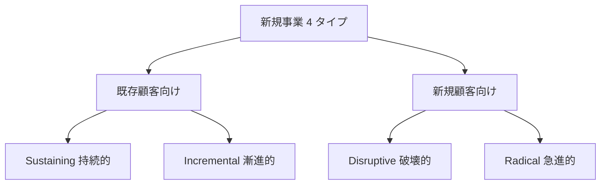
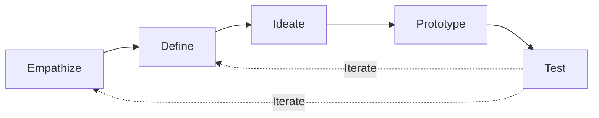

# 新規事業開発フレームワーク実践

「大企業・中小・スタジオ側で 0 → 1 を走らせる」——リーンキャンバス・VPC・Stage-Gate・3 ホライズン・出島／CVC・社内起業・ピッチ設計まで、新規事業 PM の実務フレームワークを体系化

| 項目 | 内容 |
|---|---|
| カテゴリー | 経営企画・新規事業開発 |
| 難易度 | 中級 |
| 所要時間 | 約200分（全8レッスン） |
| 公開日 | 2026-07-25 |
| 最終更新日 | 2026-07-25 |
| コースURL | https://skillup.college/courses/corporate-planning/new-business-development-practical/ |

## 対象者

東証プライム／スタンダード上場企業の新規事業 PM・イントラプレナー・出島責任者・CVC 担当・スタートアップスタジオ担当・中小企業の第二創業を検討する経営者・M&A で買収した会社の PMI 責任者。

## 前提知識

KPI ／OKR ・MVP ・PMF ・ピボットの基本用語を耳にしたことがある程度。中小企業診断士・PMP の資格は不要（本コースは資格対策ではなく実務スキル）。

## 学習目標

- 新規事業 4 タイプと 3 ホライズンで新規事業の位置づけを俯瞰できる
- デザインシンキング・JTBD を大企業内応用で扱える
- リーンキャンバスとビジネスモデルキャンバスを使い分けられる
- Stage-Gate プロセスと PoC 設計・Kill Criteria を扱える
- 社内起業・出島・CVC・カーブアウトの構造の選択を扱える
- 大企業内の新規事業予算・KPI ・カニバリ対応を扱える
- 3 種類のピッチと社内承認プロセスを設計できる
- アクセラレーター・スタジオ・M&A ・新規事業 PM のキャリアを持ち帰れる

## コース概要

新規事業開発の仕事は、ゼロからスタートアップを立ち上げることではなく、既存の大企業・中小企業の中で、既存事業のリソース・稟議・社内政治と戦いながら 0 → 1 の事業を走らせることです。姉妹コース スタートアップ起業入門が「社外の創業者が法人設立・資金調達・ガバナンス・出口を生き抜く」実務教材であるのに対し、本コースは「大企業・中小・スタジオ側で新規事業 PM ／CVC 担当者が既存組織の資源・稟議・カニバリと戦いながら 0 → 1 を走らせる」実務に振り切ります。東証プライム／スタンダード上場企業の新規事業 PM ・イントラプレナー・出島責任者・CVC 担当・スタートアップスタジオ担当・中小企業の第二創業を検討する経営者を対象に、新規事業 4 タイプと 3 ホライズン・デザインシンキング／JTBD ・リーンキャンバス／BMC ／VPC ・Stage-Gate プロセスと PoC 設計・社内起業／出島／CVC ／カーブアウト・大企業内の新規事業予算／KPI ／カニバリ対応・ピッチ設計と社内承認・アクセラレーター／スタジオ／M&A ／キャリアまでを 8 レッスンで体系化します。姉妹コース経営企画実務入門が「事業ポートフォリオを評価・付議する側」を扱うのに対し、本コースは「評価される側・実行する側」に振り切ります。

## 学習の流れ

前半 4 レッスンで新規事業開発の全体像とフレームワークを扱います。レッスン 1 で新規事業 4 タイプと 3 ホライズン、レッスン 2 で顧客と課題の発見（JTBD ・デザインシンキング）、レッスン 3 でリーンキャンバスとビジネスモデルキャンバス、レッスン 4 で Stage-Gate と PoC の設計を扱います。中盤のレッスン 5 で社内起業・出島・CVC ・カーブアウト（構造の選択）、レッスン 6 で大企業内での新規事業予算・KPI ・カニバリ対応を扱い、大企業内での実装の型を確立します。後半のレッスン 7 でピッチ設計と社内承認、レッスン 8 でアクセラレーター・スタジオ・M&A ・キャリアと修了後の学び方までを扱います。全 8 レッスン・約 200 分の構成です。

## レッスン一覧

| No. | タイトル | 概要 | 所要時間 |
|---|---|---|---|
| 1 | 新規事業開発とは何か——4 タイプと 3 ホライズン | 姉妹コース スタートアップ起業入門・経営企画実務入門との棲み分け明示、新規事業 4 タイプ（Sustaining ／Disruptive ／Radical ／Incremental）、Christensen『Innovator's Dilemma』1997、McKinsey ／Baghai 3 ホライズン 1999 を学ぶ | 25分 |
| 2 | 顧客と課題の発見——JTBD 再入門とデザインシンキング | Jobs to be Done 再訪（姉妹コース L2 の callback を土台に大企業内応用）、デザインシンキング 5 段階、ダブルダイヤモンド（英国デザイン協議会 2005）、IDEO 1991 年設立・d.school 2005 年開設、大企業内でのペルソナ設計を学ぶ | 25分 |
| 3 | リーンキャンバスとビジネスモデルキャンバス | Ash Maurya『Running Lean』2010 リーンキャンバス 9 ブロック、Alex Osterwalder & Yves Pigneur『Business Model Generation』2010 BMC 9 ブロック、Value Proposition Canvas 2014、ブルーオーシャン戦略（Kim & Mauborgne 2005）ERRC グリッドを学ぶ | 25分 |
| 4 | Stage-Gate と PoC の設計 | Robert Cooper『Winning at New Products』1986 Stage-Gate プロセス 5 ステージ・6 ゲート、ゲートで確認する 4 要素、PoC 設計 5 要素、Kill Criteria の事前合意、姉妹コース L7 の pre-mortem との接続を学ぶ | 25分 |
| 5 | 社内起業・出島・CVC・カーブアウト——構造の選択 | イントラプレナーの 4 パターン、出島戦略（オープン・イノベーション 3 型）、CVC 5 目的、スピンオフ／スピンイン／カーブアウト、Compound Startup（Parker Conrad 2022）、2024-2026 年の日本の CVC 動向を学ぶ | 25分 |
| 6 | 大企業内での新規事業予算・KGI／KPI・カニバリ対応 | 3 ホライズン別の予算配分（H1: 70% / H2: 20% / H3: 10% 目安）、新規事業 KPI 3 階層（North Star Metric ・Leading KPI ・Lagging KPI）、カニバリゼーション対応 4 パターン、PL 型 vs ROIC 型 vs キャッシュ型の判定 KPI を学ぶ | 25分 |
| 7 | ピッチ設計と社内承認 | 3 種類のピッチ（エレベーターピッチ 30 秒／投資家ピッチ 10 分／社内稟議ピッチ 30 分）、Guy Kawasaki 10 スライドルール、社内稟議の 6 要素、Reid Hoffman『Blitzscaling』2018 の 5 ステージ、社内政治とステークホルダー・マップ 3 象限を学ぶ | 25分 |
| 8 | アクセラレーター・スタジオ・M&A・キャリア | 2026 年 7 月時点の大企業アクセラレーター（三菱商事 MC Digital ／KDDI ∞ Labo 2011 ／SoftBank Ventures Asia ／トヨタ Woven Planet 2020 ／パナソニック Aug Lab）、スタートアップスタジオ 3 型（Rocket Internet 2007 ／Betaworks 2007 ／Atomic 2012）、日本のスタートアップスタジオ、新規事業 PM のキャリア 5 方向、修了後の情報源を学ぶ | 25分 |

---

## レッスン1：新規事業開発とは何か——4 タイプと 3 ホライズン

（所要時間：25分）

### このレッスンで学ぶこと

- 姉妹コースとの棲み分けと本コースの守備範囲を把握できる
- 新規事業 4 タイプ（Sustaining ／Disruptive ／Radical ／Incremental）を扱える
- Christensen『Innovator's Dilemma』1997 の破壊的イノベーション理論を持てる
- McKinsey ／Baghai の 3 ホライズン（1999）を扱える
- 既刊姉妹コース callback 一覧を持ち帰れる

---

新規事業開発は、既存企業の中で新しい事業を立ち上げる仕事です。姉妹コース スタートアップ起業入門が「社外の創業者」を扱ったのに対し、本コースは「大企業・中小・スタジオ側の新規事業 PM ／CVC 担当者」に振り切ります。まず本レッスンで、本コースの守備範囲を明示し、新規事業 4 タイプと 3 ホライズンで新規事業の位置づけを俯瞰します。

### 本コースの守備範囲と姉妹コースとの棲み分け

本コースは新規事業開発を「大企業・中小・スタジオ側で 0 → 1 を走らせる新規事業 PM」の視点で扱います。次の 3 領域は他コースに譲ります。

- **社外の創業者として法人設立・資金調達・ガバナンス・出口を扱う視点**：経営者・起業家向けの入門コースを参照してください
- **事業ポートフォリオを評価・付議する経営企画側の視点**：経営企画関連の入門コースを参照してください
- **PMF ・MVP ・JTBD ・ピボットの基本概念**：姉妹コース L2 を土台に、本コースでは大企業内応用に振り切ります

本コースは、これら 3 コースが扱わない「大企業・中小・スタジオ側で新規事業 PM ／CVC 担当者が既存組織の資源・稟議・カニバリと戦いながら 0 → 1 を走らせる」実務に振り切ります。

> **💡 ポイント**
> 新規事業の教科書は、社外スタートアップ向けの本や記事が中心です。ただし大企業内応用の視点で見ると、フレームワークの適用の仕方が異なります。本コースは「大企業内の制約と武器を両方使いこなす新規事業 PM」の視点で、フレームワークを再解釈します。

### 新規事業 4 タイプ

新規事業は、次の 4 タイプに分類できます。この分類は、Clayton M. Christensen の『The Innovator's Dilemma』（1997）とその後の研究で体系化されました。

#### タイプ 1：Sustaining（持続的イノベーション）

既存事業の性能を継続的に向上させる新規事業。既存顧客のニーズを深掘りし、より高い性能・機能を提供します。

- **特徴**：既存顧客向け、既存流通、既存の競争軸で優位性を追求
- **例**：iPhone のカメラ性能向上、自動車の燃費改善、SaaS の機能追加

#### タイプ 2：Disruptive（破壊的イノベーション）

既存市場では性能が劣るが、シンプルさ・価格・アクセシビリティで新しい顧客層を開拓する新規事業。既存企業が見落としがちな新しい市場を作り出します。

- **特徴**：新規顧客向け（既存企業が対応してない層）、シンプルさ・低価格・使いやすさで差別化
- **例**：Wikipedia（Britannica に対して）、Netflix（レンタルビデオに対して）、Uber（タクシーに対して）

#### タイプ 3：Radical（急進的イノベーション）

既存の技術・ビジネスモデルとは根本的に異なる新規事業。市場そのものを作り出します。

- **特徴**：既存企業が持たない技術・能力が必要、市場自体が新しい
- **例**：iPhone（スマートフォン市場の創造）、Amazon Web Services（クラウド市場の創造）、Tesla（EV 市場の再創造）

#### タイプ 4：Incremental（漸進的イノベーション）

既存事業の小さな改善を積み重ねる新規事業。カイゼン活動に近い。

- **特徴**：既存事業の枠内、小さな効率化・機能追加
- **例**：製造業のプロセス改善、SaaS の UI 改善、小売店の陳列改善

#### 4 タイプの選択軸

- **既存企業の強みを活かせるか**：Sustaining ／Incremental は既存の強みを活かしやすい
- **既存事業とのカニバリのリスク**：Disruptive は既存事業を破壊するリスクあり
- **リターンとリスクのバランス**：Radical はリターン大だがリスク大

大企業内での新規事業は、Sustaining ／Incremental が最も多く、Disruptive ／Radical は少数です。本コースでは 4 タイプすべてを扱いますが、大企業内での実装の難易度は Disruptive ／Radical の方が高いことを意識します。

### Christensen『Innovator's Dilemma』1997

Clayton M. Christensen（1952-2020）が 1997 年に発表した『The Innovator's Dilemma』は、破壊的イノベーション理論を体系化した名著です。要点は次の 3 点です。

#### 要点 1：優良企業が失敗するパラドックス

「顧客の声を聞く」「利益率を追求する」「既存事業を強化する」——優良企業ほどこれらの合理的な経営判断を行いますが、その結果として破壊的イノベーションを見落とし、後発の新興企業に市場を奪われます。

#### 要点 2：破壊的イノベーションの構造

破壊的イノベーションは次の構造で進みます。

- **初期段階**：既存市場の顧客から見ると性能が劣る新製品が、新興企業から登場
- **成長段階**：新興企業は「性能不足でも受け入れる顧客層」（ローエンド・ノンユーザー）を獲得
- **突破段階**：新興企業の技術が急速に進化し、既存市場の顧客の期待を満たすようになる
- **既存企業の敗北**：既存企業は破壊的イノベーションに対応できず、市場シェアを失う

#### 要点 3：既存企業の対応策

Christensen は、既存企業が破壊的イノベーションに対応するために「独立した事業部・子会社」を設立することを推奨しました。既存事業の指標（利益率・売上規模）で新規事業を評価すると、常に負けるためです。

- 既存事業と物理的・組織的に分離
- 独立した意思決定権限を持たせる
- 既存事業の指標ではなく、新規事業向けの指標で評価
- 経営陣直下で保護

これが本コースのレッスン 5 で扱う「出島戦略」の理論的基礎です。

### McKinsey ／Baghai の 3 ホライズン（1999）

Mehrdad Baghai・Stephen Coley・David White（McKinsey パートナー）が 1999 年に『The Alchemy of Growth』で提唱した「3 ホライズン」フレームワークは、企業の成長ポートフォリオを 3 つの時間軸で整理します。

#### ホライズン 1：既存事業（Extend & Defend Core Businesses）

- **時間軸**：現在〜 1-2 年
- **内容**：既存事業の改善・拡大・深耕
- **投資比重**：全体の 70% 程度
- **リターン**：短期的な安定収益

#### ホライズン 2：隣接事業（Build Emerging Businesses）

- **時間軸**：2-5 年
- **内容**：既存事業の隣接領域への拡大（地域拡大・製品拡大・顧客拡大）
- **投資比重**：全体の 20% 程度
- **リターン**：中期的な成長

#### ホライズン 3：新規事業（Create Genuinely New Businesses）

- **時間軸**：5-10 年
- **内容**：既存事業とは異なる新しい事業の創出
- **投資比重**：全体の 10% 程度
- **リターン**：長期的な成長ポテンシャル

#### 3 ホライズンの実務活用

- **予算配分**：3 ホライズン別に予算を配分し、H3 への投資を確保
- **人員配分**：H3 には別チームを組成し、H1 の指標で評価しない
- **時間軸別 KPI**：H1 は営業利益、H2 は売上成長、H3 は仮説検証件数など
- **経営陣の関与**：H3 は経営陣直下で保護

多くの日本企業は H1（既存事業）に 90% 以上の資源を投入し、H2 ／H3 が不足しがちです。3 ホライズンの視点は、経営陣と新規事業 PM が共通言語として使うのに有効です。

### 既刊姉妹コース callback 一覧

本コースは、姉妹コース スタートアップ起業入門・経営企画実務入門で扱った内容を土台にします。次の内容は既刊コースを参照してください。

#### スタートアップ起業入門 L2 参照（本コースでは深掘りしない）

- **Lean Startup（Ries 2011）・Build-Measure-Learn**：仮説検証サイクルの基本
- **MVP 4 形式**：ランディングページ／コンシェルジュ／Wizard of Oz ／単機能
- **Customer Discovery（Blank 2003）・The Mom Test**：顧客インタビューの型
- **Jobs to be Done（Christensen 2003・2016）**：ミルクシェイク事例（本コース L2 で大企業内応用を深掘り）
- **PMF（Andreessen 2007）・Sean Ellis Test 40%**：Product-Market Fit の測定
- **ピボット 10 パターン（Ries）**：方向転換の型
- **TAM ／SAM ／SOM**：市場規模の推定

#### 経営企画実務入門 L7 参照（本コースでは深掘りしない）

- **PPM（BCG）／9 セル（GE / McKinsey）**：事業ポートフォリオ管理の基本
- **新規事業評価 3 段階**：アイデア→事業計画→投資判断
- **投資判断稟議 4 要素**：背景／内容／期待効果／リスク・撤退基準
- **M&A DD 4 領域・PMI 4 論点・100 日プラン**

本コースは、これらを土台にして「大企業内で新規事業 PM が実装する」実務に振り切ります。

### 中核メッセージ 6 個

本コースを通じて反復する 6 個のメッセージを、L1 の締めとして提示します。

- **新規事業は既存組織の身体を借りて走る**——制約を敵にせず武器にする
- **フレームワークは思考の型**——キャンバスは埋めるためではなく問うため
- **Stage-Gate は撤退のためではなく前進のため**——ゲートは信号ではなく合意点
- **社内政治は否定しない**——ステークホルダー・マップこそ最強の武器
- **カニバリは避けるものではなく設計するもの**——時期・領域・ブランドで切り分ける
- **CVC ・出島・カーブアウトは戦略の選択肢**——構造が新規事業の速度を決める

### 次のステップ

本レッスンでは新規事業 4 タイプと 3 ホライズンを扱いました。次のレッスンでは、新規事業の出発点となる「顧客と課題の発見——JTBD 再入門とデザインシンキング」を大企業内応用の視点で深掘りします。

### 確認クイズ

このレッスンで学んだ内容を確認しましょう。

#### Q1. 本コースと姉妹コース スタートアップ起業入門・経営企画実務入門の棲み分けについて、本レッスンで示している内容として正しいものはどれか。

- [x] 姉妹コース スタートアップ起業入門は「社外の創業者が法人設立・資金調達・ガバナンス・出口を生き抜く」実務教材、姉妹コース経営企画実務入門は「事業ポートフォリオを評価・付議する側」（PPM ・稟議・DD ・PMI）を扱う。本コースは「大企業・中小・スタジオ側で新規事業 PM ／CVC 担当者が既存組織の資源・稟議・カニバリと戦いながら 0 → 1 を走らせる」実務および「評価される側・実行する側」に振り切る
- [ ] 本コースはスタートアップ創業者向けの資格対策コースである
- [ ] 本コースと姉妹コースの内容はほぼ同じである
- [ ] 姉妹コースの内容は本コースで完全に置き換わる

> **解説**
> 本コースは、姉妹コース スタートアップ起業入門（社外の創業者向け）・経営企画実務入門（事業ポートフォリオを評価する側）の 2 つが扱わない「大企業・中小・スタジオ側で 0 → 1 を走らせる新規事業 PM」の実務に振り切ります。PMF ・MVP ・JTBD ・ピボットの基本概念は姉妹コース L2 を土台にし、PPM ／9 セル・新規事業評価 3 段階・投資判断稟議 4 要素は姉妹コース L7 を参照。本コースは既刊姉妹コースが扱わない「大企業内での新規事業実装」に軸足を置きます。

#### Q2. 新規事業 4 タイプについて、本レッスンで示している内容として正しいものはどれか。

- [ ] 新規事業は 1 タイプしかない
- [x] Sustaining（持続的、既存顧客向けの性能向上）・Disruptive（破壊的、新規顧客向けにシンプルさ・低価格・使いやすさで差別化）・Radical（急進的、既存の技術・ビジネスモデルと根本的に異なる、市場そのものを作り出す）・Incremental（漸進的、既存事業の小さな改善）の 4 タイプ。大企業内では Sustaining ／Incremental が最も多い
- [ ] 新規事業タイプは Christensen が 1980 年代に提唱した
- [ ] 大企業では Disruptive が最も多い

> **解説**
> 新規事業 4 タイプは、Sustaining（持続的イノベーション、既存事業の性能を継続的に向上、既存顧客向け・既存流通・既存の競争軸、例：iPhone のカメラ性能向上・SaaS の機能追加）、Disruptive（破壊的イノベーション、既存市場では性能が劣るがシンプルさ・価格・アクセシビリティで新しい顧客層を開拓、例：Wikipedia ・Netflix ・Uber）、Radical（急進的イノベーション、既存の技術・ビジネスモデルとは根本的に異なる、市場そのものを作り出す、例：iPhone スマートフォン市場・AWS クラウド市場・Tesla EV 市場）、Incremental（漸進的イノベーション、既存事業の小さな改善、例：製造業のプロセス改善・SaaS の UI 改善）です。大企業内での新規事業は Sustaining ／Incremental が最も多く、Disruptive ／Radical は少数ですが、本コースでは 4 タイプすべてを扱います。

#### Q3. Christensen『Innovator's Dilemma』1997 について、本レッスンで示している内容として正しいものはどれか。

- [ ] Christensen は 1980 年代に破壊的イノベーション理論を発表した
- [ ] 破壊的イノベーションは大企業が有利な理論である
- [x] Clayton M. Christensen（1952-2020）が 1997 年に発表した『The Innovator's Dilemma』は破壊的イノベーション理論を体系化した名著。優良企業ほど「顧客の声を聞く」「利益率を追求する」「既存事業を強化する」という合理的経営判断の結果として破壊的イノベーションを見落とし、後発の新興企業に市場を奪われるパラドックスを解明。既存企業の対応策として「独立した事業部・子会社」の設立を推奨（本コース L5 の出島戦略の理論的基礎）
- [ ] 破壊的イノベーション理論は経済学の理論であり実務では使えない

> **解説**
> Clayton M. Christensen（1952-2020）が 1997 年に発表した『The Innovator's Dilemma』は、破壊的イノベーション理論を体系化した名著です。要点 3 点は、優良企業が失敗するパラドックス（優良企業ほど「顧客の声を聞く」「利益率を追求する」「既存事業を強化する」という合理的な経営判断を行うが、その結果として破壊的イノベーションを見落とし後発の新興企業に市場を奪われる）、破壊的イノベーションの構造（初期は既存市場から見ると性能が劣る新製品が新興企業から登場→成長段階で「性能不足でも受け入れる顧客層」ローエンド・ノンユーザーを獲得→突破段階で新興企業の技術が急速に進化し既存市場の顧客の期待を満たす→既存企業の敗北）、既存企業の対応策として「独立した事業部・子会社」の設立を推奨（既存事業の指標＝利益率・売上規模で新規事業を評価すると常に負けるため、既存事業と物理的・組織的に分離・独立した意思決定権限・新規事業向けの指標で評価・経営陣直下で保護）です。これが本コース L5 の「出島戦略」の理論的基礎です。

#### Q4. McKinsey ／Baghai の 3 ホライズン（1999）について、本レッスンで示している内容として正しいものはどれか。

- [ ] 3 ホライズンは Michael Porter が提唱した
- [ ] 3 ホライズンは投資比重を H1 30% ／H2 30% ／H3 40% が実務標準
- [ ] 3 ホライズンは大企業のみが使うフレームワーク
- [x] Mehrdad Baghai ・Stephen Coley ・David White（McKinsey パートナー）が 1999 年に『The Alchemy of Growth』で提唱。ホライズン 1（既存事業、時間軸 1-2 年、投資比重 70% 程度）／ホライズン 2（隣接事業、時間軸 2-5 年、投資比重 20%）／ホライズン 3（新規事業、時間軸 5-10 年、投資比重 10%）。多くの日本企業は H1 に 90% 以上の資源を投入し H2 ／H3 が不足しがち。時間軸別 KPI（H1 は営業利益・H2 は売上成長・H3 は仮説検証件数）で運営

> **解説**
> McKinsey ／Baghai の 3 ホライズンは、Mehrdad Baghai ・Stephen Coley ・David White（McKinsey パートナー）が 1999 年に『The Alchemy of Growth』で提唱した企業の成長ポートフォリオを 3 つの時間軸で整理するフレームワークです。ホライズン 1（Extend & Defend Core Businesses、既存事業、時間軸 現在〜 1-2 年、既存事業の改善・拡大・深耕、投資比重 全体の 70% 程度、短期的な安定収益）、ホライズン 2（Build Emerging Businesses、隣接事業、時間軸 2-5 年、既存事業の隣接領域への拡大、投資比重 全体の 20% 程度、中期的な成長）、ホライズン 3（Create Genuinely New Businesses、新規事業、時間軸 5-10 年、既存事業とは異なる新しい事業の創出、投資比重 全体の 10% 程度、長期的な成長ポテンシャル）の 3 ホライズンで構成されます。実務活用は予算配分（H3 への投資確保）、人員配分（H3 には別チーム、H1 の指標で評価しない）、時間軸別 KPI（H1 は営業利益・H2 は売上成長・H3 は仮説検証件数など）、経営陣の関与（H3 は経営陣直下で保護）です。多くの日本企業は H1（既存事業）に 90% 以上の資源を投入し、H2 ／H3 が不足しがちです。

---

## レッスン2：顧客と課題の発見——JTBD 再入門とデザインシンキング

（所要時間：25分）

### このレッスンで学ぶこと

- Jobs to be Done（JTBD）を大企業内応用の視点で再訪できる
- デザインシンキング 5 段階（Empathize ／Define ／Ideate ／Prototype ／Test）を扱える
- ダブルダイヤモンド（英国デザイン協議会 2005）と IDEO ／d.school の系譜を持てる
- 大企業内でのペルソナ設計とインタビュー 5 原則を扱える
- Innovator's Dilemma の応用として「自社にとっての破壊的顧客」を扱える

---

前レッスンでは新規事業 4 タイプと 3 ホライズンを扱いました。本レッスンでは、新規事業の出発点となる「顧客と課題の発見」を、JTBD とデザインシンキングの 2 大フレームワークで扱います。姉妹コース L2 で扱った基本を土台に、大企業内応用に振り切ります。

### Jobs to be Done（JTBD）再訪

Jobs to be Done（JTBD）は、Clayton M. Christensen が 2003 年に『イノベーションのジレンマ』の応用として提唱し、2016 年『Competing Against Luck』で体系化したフレームワークです。「顧客は商品を買うのではなく、片付けたい仕事（ジョブ）を進めるために雇う」という視点で顧客ニーズを捉え直します。

#### JTBD の基本

- **顧客は商品ではなくジョブを買う**：ドリルを買う顧客は「穴を開けたい」というジョブを片付けるためにドリルを雇う
- **ジョブは変わらない、雇う手段（商品）が変わる**：「穴を開けたい」というジョブは百年変わらない、ドリル・レーザー・接着剤などの手段が変わる
- **ジョブは 3 種類**：機能的ジョブ（何かを達成する）、社会的ジョブ（他者からどう見られたい）、感情的ジョブ（どう感じたい）

#### Christensen の Milkshake 事例（2016）

McDonald's のミルクシェイクの売上を伸ばすため、Christensen の研究チームは顧客の「ジョブ」を調査しました。

- 朝の通勤客は「長い運転を退屈しない相棒」というジョブでミルクシェイクを雇っていた
- 午後の親子連れは「子供の機嫌を取る」というジョブで雇っていた
- 朝と午後で「ジョブ」が異なるため、商品設計・販売戦略も異なるべき

このように、JTBD の視点で顧客を分析すると、従来のデモグラフィック（年齢・性別・職業）とは異なる顧客セグメンテーションが見えてきます。

#### 大企業内応用の 5 ポイント

姉妹コース L2 は「社外の創業者が JTBD で顧客を発見する」視点でしたが、本コースでは「大企業内で JTBD を実装する」5 ポイントを扱います。

- **既存事業の顧客の「未片付けジョブ」を探す**：既存製品では片付けきれていないジョブを新規事業の起点にする
- **既存事業と競合するジョブは慎重に**：既存事業のシェアを奪う可能性を経営陣と事前合意
- **社内のジョブと社外のジョブを区別**：社内向け新規事業（業務効率化）と社外向け新規事業（顧客向け）でアプローチが異なる
- **JTBD インタビューは事業部と協業**：既存顧客との関係を活かして、事業部の営業と協業してインタビュー
- **JTBD 分析結果は経営陣にわかりやすく可視化**：ジョブ一覧・雇われる手段の変化・市場規模を経営陣が理解できるフォーマットで整理

### デザインシンキング 5 段階

デザインシンキング（Design Thinking）は、IDEO と Stanford d.school が体系化した創造的問題解決の方法論です。5 段階のプロセスで、顧客理解から解決策の実装までを進めます。

#### 5 段階のプロセス

- **段階 1：Empathize（共感）**——顧客の状況・感情・行動を深く観察・理解する
- **段階 2：Define（定義）**——観察から得た洞察を明確な課題文（Problem Statement）として定義
- **段階 3：Ideate（発想）**——課題に対する多様な解決アイデアを大量に発想
- **段階 4：Prototype（試作）**——アイデアを素早く形にする（スケッチ・モックアップ・動画）
- **段階 5：Test（検証）**——プロトタイプを顧客に見せてフィードバックを得る

#### 5 段階のイタレーション

デザインシンキングは 5 段階を 1 回で完結せず、複数回イタレーションを回します。特に Test で得たフィードバックを Empathize ／Define に戻すサイクルが重要です。

### ダブルダイヤモンド（英国デザイン協議会 2005）

英国デザイン協議会（Design Council UK）が 2005 年に提唱した「ダブルダイヤモンド」は、デザインシンキングと並ぶ創造的問題解決の代表的なフレームワークです。

#### ダブルダイヤモンドの 4 段階

- **段階 1：Discover（発散：問題を発見）**——顧客・市場・環境の観察で幅広く問題を発見
- **段階 2：Define（収束：問題を定義）**——観察から核心的な問題を絞り込む
- **段階 3：Develop（発散：解決策を発想）**——絞り込んだ問題に対して多様な解決策を発想
- **段階 4：Deliver（収束：解決策を実装）**——最適な解決策を選び、実装

「発散→収束→発散→収束」の 2 つのダイヤモンド形状から「ダブルダイヤモンド」と呼ばれます。デザインシンキングとの違いは、「発散と収束の 2 モード」を明示的に区別する点です。

### IDEO ／d.school の系譜

デザインシンキングの普及に貢献した 2 大機関を扱います。

#### IDEO（1991 年設立）

- 米国カリフォルニア州パロアルトに本拠を置くデザイン・イノベーション・コンサルティング会社
- 1991 年に David Kelley、Bill Moggridge、Mike Nuttall によって設立
- Apple のマウス（Apple Mouse）、Palm V などの著名なプロダクトデザインを担当
- 「Design Thinking」の名称と方法論を体系化

#### Stanford d.school（Hasso Plattner Institute of Design at Stanford、2005 年開設）

- Stanford 大学が 2005 年に開設した学際的デザインスクール
- 創設者は David Kelley（IDEO 創設者）
- 学生・教員・企業パートナーが協業してデザインシンキングを学び・実践
- 世界中の企業がデザインシンキング研修に活用

### 大企業内でのペルソナ設計

新規事業の顧客理解では、ペルソナ（Persona）と呼ばれる仮想の顧客像を設計します。ペルソナは、実在の顧客インタビューから抽出した典型的な人物像です。

#### ペルソナに含める 8 項目

- 氏名・年齢・職業・年収
- 家族構成・居住地
- 職務内容・組織での立場
- 抱えている課題・不安・目標
- 情報収集手段（メディア・SNS）
- 購買行動の意思決定プロセス
- 現在使っている代替手段
- 支払い意思額

#### ペルソナ設計の実務手順

- **顧客インタビュー 15-30 名**：既存顧客・潜在顧客・過去に検討したが購入しなかった顧客の 3 分類でインタビュー
- **共通点の抽出**：15-30 名から共通する 3-5 タイプのペルソナを抽出
- **ペルソナドキュメント化**：8 項目をフォーマット化してドキュメント化
- **経営陣・事業部と共有**：ペルソナを社内共有し、新規事業の意思決定に活用

### インタビュー 5 原則

新規事業の顧客インタビューでは、次の 5 原則を守ります。姉妹コース L2 で扱った「The Mom Test」（Rob Fitzpatrick）を土台に、大企業内応用のポイントを加えます。

#### 原則 1：仮説を検証するのではなく発見する

「私たちの製品を買いますか？」ではなく「あなたの 1 日をどう過ごしていますか？」と聞き、顧客の実生活からジョブを発見します。

#### 原則 2：意見ではなく行動を聞く

「〜だと便利ですか？」ではなく「実際に〜した経験を教えてください」と聞き、意見（未来の予測）ではなく行動（過去の事実）を集めます。

#### 原則 3：具体例を掘り下げる

「なぜ？」を 5 回繰り返して、抽象的な回答から具体的な行動・感情・意思決定に降りていきます（トヨタ生産方式のなぜなぜ 5 回分析の応用）。

#### 原則 4：営業目線を排除する

新規事業 PM は自社製品を売り込むのではなく、顧客の課題を理解する立場に徹します。営業目線でインタビューすると、顧客は「買います」というリップサービスを返します。

#### 原則 5：大企業内の既存顧客との関係を活かす

既存顧客との関係を活かせるのは大企業内の新規事業の強みです。事業部の営業と協業して、既存顧客に「新規事業の仮説検証にご協力ください」と依頼できます。ただし、既存製品を売り込む場ではないことを明確に伝えます。

### Innovator's Dilemma の応用：自社にとっての破壊的顧客

Christensen の破壊的イノベーション理論の応用として、「自社にとっての破壊的顧客」を発見する視点があります。

#### 破壊的顧客の 3 特徴

- **既存事業の顧客ではない**：既存製品を購入していない層
- **既存製品を「オーバースペック」と感じている**：性能過多で価格が高すぎると感じている
- **シンプルさ・低価格・使いやすさを求めている**：既存事業の競争軸とは異なる価値観

#### 破壊的顧客の発見手順

- 既存事業の顧客セグメントを整理
- 各セグメントの周辺で「使っていない層」「離脱した層」を特定
- 離脱理由・使わない理由をインタビュー
- 「シンプルさ・低価格・使いやすさ」を求めている層を破壊的顧客候補として特定

破壊的顧客に対するアプローチは、既存事業のカニバリリスクを伴います。本コース L6 で扱う「カニバリゼーション対応 4 パターン」を参照してください。

### 次のステップ

本レッスンでは JTBD 再入門とデザインシンキングを扱いました。次のレッスンでは、顧客と課題を発見した後の「事業構想を可視化する」ツールとして、リーンキャンバスとビジネスモデルキャンバスを深掘りします。

### 確認クイズ

このレッスンで学んだ内容を確認しましょう。

#### Q1. Jobs to be Done（JTBD）と大企業内応用について、本レッスンで示している内容として正しいものはどれか。

- [x] Christensen が 2003 年に提唱し 2016 年『Competing Against Luck』で体系化。「顧客は商品を買うのではなく、片付けたい仕事（ジョブ）を進めるために雇う」視点で、Milkshake 事例（朝の通勤客は「長い運転を退屈しない相棒」、午後の親子連れは「子供の機嫌を取る」）が有名。大企業内応用の 5 ポイントは、既存事業の「未片付けジョブ」を探す・既存事業と競合するジョブは慎重に・社内と社外のジョブを区別・事業部と協業してインタビュー・経営陣にわかりやすく可視化
- [ ] JTBD は 1990 年代に提唱されたフレームワークである
- [ ] JTBD は大企業内では使えない
- [ ] JTBD は商品を買う理由ではなく年齢・性別で顧客を分ける手法である

> **解説**
> Jobs to be Done（JTBD）は Clayton M. Christensen が 2003 年に『イノベーションのジレンマ』の応用として提唱し、2016 年『Competing Against Luck』で体系化したフレームワークです。「顧客は商品を買うのではなく、片付けたい仕事（ジョブ）を進めるために雇う」視点で顧客ニーズを捉え直します。ジョブは 3 種類（機能的ジョブ・社会的ジョブ・感情的ジョブ）で、McDonald's のミルクシェイクの Milkshake 事例（朝の通勤客は「長い運転を退屈しない相棒」というジョブ、午後の親子連れは「子供の機嫌を取る」というジョブでミルクシェイクを雇う）が有名です。大企業内応用の 5 ポイントは、既存事業の顧客の「未片付けジョブ」を探す・既存事業と競合するジョブは慎重に扱う・社内のジョブと社外のジョブを区別・JTBD インタビューは事業部と協業・JTBD 分析結果は経営陣にわかりやすく可視化です。

#### Q2. デザインシンキング 5 段階について、本レッスンで示している内容として正しいものはどれか。

- [ ] デザインシンキングは 1 段階で完結する
- [x] 段階 1（Empathize、共感、顧客の状況・感情・行動を深く観察）／段階 2（Define、定義、観察から得た洞察を明確な課題文として定義）／段階 3（Ideate、発想、多様な解決アイデアを大量に発想）／段階 4（Prototype、試作、アイデアを素早く形にする）／段階 5（Test、検証、プロトタイプを顧客に見せてフィードバック）の 5 段階。複数回イタレーションを回すことが重要
- [ ] デザインシンキングは大企業では使えない
- [ ] デザインシンキングは IDEO が 1970 年代に体系化した

> **解説**
> デザインシンキング（Design Thinking）は IDEO と Stanford d.school が体系化した創造的問題解決の方法論で、5 段階のプロセスで顧客理解から解決策の実装までを進めます。段階 1（Empathize＝共感、顧客の状況・感情・行動を深く観察・理解）、段階 2（Define＝定義、観察から得た洞察を明確な課題文＝ Problem Statement として定義）、段階 3（Ideate＝発想、課題に対する多様な解決アイデアを大量に発想）、段階 4（Prototype＝試作、アイデアを素早く形にする＝スケッチ・モックアップ・動画）、段階 5（Test＝検証、プロトタイプを顧客に見せてフィードバックを得る）です。5 段階を 1 回で完結せず、複数回イタレーションを回します。特に Test で得たフィードバックを Empathize ／Define に戻すサイクルが重要です。

#### Q3. ダブルダイヤモンドと IDEO ／d.school の系譜について、本レッスンで示している内容として正しいものはどれか。

- [ ] ダブルダイヤモンドは日本で 2005 年に提唱された
- [ ] IDEO は 1970 年代に設立された
- [x] ダブルダイヤモンドは英国デザイン協議会（Design Council UK）が 2005 年に提唱、4 段階（Discover 発散＝問題発見／Define 収束＝問題定義／Develop 発散＝解決策発想／Deliver 収束＝解決策実装）で「発散と収束の 2 モード」を明示的に区別。IDEO は 1991 年設立（David Kelley・Bill Moggridge・Mike Nuttall）、Stanford d.school は 2005 年開設（創設者は David Kelley）
- [ ] d.school は Harvard 大学が開設した

> **解説**
> ダブルダイヤモンドは英国デザイン協議会（Design Council UK）が 2005 年に提唱した創造的問題解決の代表的なフレームワークで、4 段階（Discover 発散＝顧客・市場・環境の観察で幅広く問題を発見／Define 収束＝観察から核心的な問題を絞り込む／Develop 発散＝絞り込んだ問題に対して多様な解決策を発想／Deliver 収束＝最適な解決策を選び実装）で構成されます。「発散→収束→発散→収束」の 2 つのダイヤモンド形状から「ダブルダイヤモンド」と呼ばれ、デザインシンキングとの違いは「発散と収束の 2 モード」を明示的に区別する点です。IDEO は 1991 年設立の米国カリフォルニア州パロアルトに本拠を置くデザイン・イノベーション・コンサルティング会社で、David Kelley ・Bill Moggridge ・Mike Nuttall によって設立され Apple のマウス・Palm V などをデザイン、「Design Thinking」の名称と方法論を体系化しました。Stanford d.school（Hasso Plattner Institute of Design at Stanford）は Stanford 大学が 2005 年に開設した学際的デザインスクールで、創設者は David Kelley（IDEO 創設者）です。

#### Q4. 大企業内での顧客インタビュー 5 原則について、本レッスンで示している内容として正しいものはどれか。

- [ ] インタビューでは仮説を確認することが重要である
- [ ] インタビューでは顧客の意見（未来の予測）を集めることが重要である
- [ ] 新規事業 PM は自社製品を売り込む姿勢が重要である
- [x] 原則 1（仮説を検証するのではなく発見する、「あなたの 1 日をどう過ごしていますか？」と聞く）／原則 2（意見ではなく行動を聞く、「実際に〜した経験を教えてください」）／原則 3（具体例を掘り下げる、なぜを 5 回繰り返す）／原則 4（営業目線を排除する、自社製品を売り込むのではなく顧客の課題を理解する立場）／原則 5（大企業内の既存顧客との関係を活かす、事業部の営業と協業）

> **解説**
> 新規事業の顧客インタビュー 5 原則は、姉妹コース L2 で扱った Rob Fitzpatrick『The Mom Test』を土台に、大企業内応用のポイントを加えたものです。原則 1（仮説を検証するのではなく発見する、「私たちの製品を買いますか？」ではなく「あなたの 1 日をどう過ごしていますか？」と聞き顧客の実生活からジョブを発見）、原則 2（意見ではなく行動を聞く、「〜だと便利ですか？」ではなく「実際に〜した経験を教えてください」と聞き意見ではなく行動＝過去の事実を集める）、原則 3（具体例を掘り下げる、「なぜ？」を 5 回繰り返して抽象的な回答から具体的な行動・感情・意思決定に降りていく、トヨタ生産方式のなぜなぜ 5 回分析の応用）、原則 4（営業目線を排除する、新規事業 PM は自社製品を売り込むのではなく顧客の課題を理解する立場に徹する、営業目線でインタビューすると顧客は「買います」というリップサービスを返す）、原則 5（大企業内の既存顧客との関係を活かす、事業部の営業と協業して既存顧客に新規事業の仮説検証を依頼、ただし既存製品を売り込む場ではないことを明確に伝える）です。

---

## レッスン3：リーンキャンバスとビジネスモデルキャンバス

（所要時間：25分）

### このレッスンで学ぶこと

- リーンキャンバス 9 ブロックの記入方法を扱える
- ビジネスモデルキャンバス 9 ブロックの記入方法を扱える
- リーンキャンバス vs BMC の使い分けを持てる
- Value Proposition Canvas（VPC）2014 の使い方を扱える
- ブルーオーシャン戦略 ERRC グリッドを扱える
- キャンバスの落とし穴（埋めることが目的化する 5 パターン）を持ち帰れる

---

前レッスンでは顧客と課題の発見（JTBD ・デザインシンキング）を扱いました。本レッスンでは、顧客と課題を発見した後の「事業構想を可視化する」ツールとして、リーンキャンバスとビジネスモデルキャンバスを深掘りします。姉妹コース経営企画実務入門の中期経営計画とは異なる、新規事業の初期構想の可視化ツールです。

### リーンキャンバス 9 ブロック

リーンキャンバス（Lean Canvas）は、Ash Maurya が 2010 年に『Running Lean』で提唱した、スタートアップ向けの事業構想キャンバスです。1 ページ 9 ブロックで、事業の全体像を素早く可視化できます。

#### 9 ブロックの内容

- **ブロック 1：問題（Problem）**——顧客が抱える 3 つの主要な問題
- **ブロック 2：顧客セグメント（Customer Segments）**——ターゲット顧客の具体的な層
- **ブロック 3：独自の価値提案（Unique Value Proposition）**——自社製品が提供する明確な価値
- **ブロック 4：ソリューション（Solution）**——問題を解決する製品・サービス
- **ブロック 5：チャネル（Channels）**——顧客にリーチする手段
- **ブロック 6：収益の流れ（Revenue Streams）**——どのように収益を得るか
- **ブロック 7：コスト構造（Cost Structure）**——どのようなコストが発生するか
- **ブロック 8：主要指標（Key Metrics）**——事業の成否を測る指標
- **ブロック 9：圧倒的な優位性（Unfair Advantage）**——競合が簡単に真似できない優位性

#### リーンキャンバスの記入順序

Ash Maurya は次の順序で記入することを推奨しています。

1. 顧客セグメント（ブロック 2）
2. 問題（ブロック 1）
3. 独自の価値提案（ブロック 3）
4. ソリューション（ブロック 4）
5. チャネル（ブロック 5）
6. 収益の流れ（ブロック 6）
7. コスト構造（ブロック 7）
8. 主要指標（ブロック 8）
9. 圧倒的な優位性（ブロック 9）

#### リーンキャンバスの特徴

- スタートアップ向けに設計されている（Alex Osterwalder の BMC を Ash Maurya がスタートアップ向けに改造）
- 1 ページで完結する
- 素早く記入・修正できる
- 初期構想の可視化と仮説検証の起点として活用

### ビジネスモデルキャンバス（BMC）9 ブロック

ビジネスモデルキャンバス（Business Model Canvas、BMC）は、Alex Osterwalder & Yves Pigneur が 2010 年に『Business Model Generation』で提唱した、事業モデルの可視化キャンバスです。既存企業・新規事業・スタートアップの各シーンで幅広く使われます。

#### 9 ブロックの内容

- **ブロック 1：顧客セグメント（Customer Segments）**——ターゲット顧客
- **ブロック 2：価値提案（Value Propositions）**——顧客に提供する価値
- **ブロック 3：チャネル（Channels）**——顧客にリーチする手段
- **ブロック 4：顧客との関係（Customer Relationships）**——顧客との関係性の型
- **ブロック 5：収益の流れ（Revenue Streams）**——収益源
- **ブロック 6：主要リソース（Key Resources）**——事業に必要な主要資源
- **ブロック 7：主要活動（Key Activities）**——事業に必要な主要活動
- **ブロック 8：主要パートナー（Key Partners）**——事業を支える主要パートナー
- **ブロック 9：コスト構造（Cost Structure）**——事業のコスト構造

#### BMC とリーンキャンバスの違い

| 項目 | BMC | リーンキャンバス |
|---|---|---|
| 対象 | 既存事業を含む幅広いビジネス | スタートアップ／新規事業に特化 |
| 「問題」ブロック | なし（Value Propositions のみ） | あり（Problem） |
| 「主要リソース／活動／パートナー」 | あり | なし（コスト構造で吸収） |
| 「圧倒的な優位性（Unfair Advantage）」 | なし | あり |
| 「主要指標（Key Metrics）」 | なし | あり |

#### 使い分けの実務標準

- **既存事業の見直し・M&A 検討時**：BMC が適している（既存事業のリソース・パートナーを可視化）
- **新規事業の初期構想・スタートアップ**：リーンキャンバスが適している（問題・優位性・指標を明示）
- **大企業内の新規事業 PM**：初期はリーンキャンバス、事業化段階で BMC に移行

### Value Proposition Canvas（VPC、2014）

Value Proposition Canvas（VPC）は、Alex Osterwalder が 2014 年に『Value Proposition Design』で提唱した、価値提案と顧客の適合を可視化するキャンバスです。

#### VPC の 2 側面

- **顧客プロフィール（Customer Profile）**——顧客のジョブ・ペイン・ゲインを可視化
- **価値マップ（Value Map）**——製品・ペインリリーバー・ゲインクリエイターを可視化

#### 顧客プロフィールの 3 要素

- **ジョブ（Customer Jobs）**：顧客が片付けたい仕事（JTBD の応用）
- **ペイン（Pains）**：顧客が抱える不満・困難・不安
- **ゲイン（Gains）**：顧客が得たい成果・喜び

#### 価値マップの 3 要素

- **製品・サービス（Products & Services）**：提供する製品・サービス
- **ペインリリーバー（Pain Relievers）**：顧客のペインを取り除く仕組み
- **ゲインクリエイター（Gain Creators）**：顧客のゲインを生み出す仕組み

#### 適合（Fit）の 3 段階

- **問題と解決策の適合（Problem-Solution Fit）**：顧客の問題に対して解決策が有効
- **プロダクト・マーケット・フィット（PMF）**：市場が製品を求めている
- **ビジネスモデル・フィット（Business Model Fit）**：事業として持続可能

VPC は BMC ／リーンキャンバスと組み合わせて使うのが実務標準です。BMC ／リーンキャンバスの「価値提案」ブロックを、VPC で詳細化します。

### ブルーオーシャン戦略 ERRC グリッド

ブルーオーシャン戦略（Blue Ocean Strategy）は、W. Chan Kim & Renée Mauborgne が 2005 年に発表した戦略論で、既存市場（レッドオーシャン）ではなく未開拓の新市場（ブルーオーシャン）を作り出すことを提唱します。

#### ERRC グリッド

ブルーオーシャン戦略の中核ツールが「ERRC グリッド」（Eliminate ／Reduce ／Raise ／Create の 4 象限）です。

- **Eliminate（排除）**：業界標準の要素で不要なものを排除
- **Reduce（減らす）**：業界標準以下に減らす要素
- **Raise（増やす）**：業界標準以上に増やす要素
- **Create（創造）**：業界に存在しない要素を創造

#### ブルーオーシャン戦略の実務事例

- **Cirque du Soleil**：伝統的なサーカスから「動物・スター芸人」を排除し、「テーマ性・音楽・演劇性」を創造
- **Yellow Tail（オーストラリアワイン）**：ワインの「専門用語・熟成期間・種類」を減らし、「親しみやすさ・楽しさ」を創造
- **QB House**：伝統的な理髪店から「洗髪・肩たたき・お茶」を排除し、「10 分・1,000 円」を創造

#### 新規事業構想での使い方

- 既存市場の業界標準要素をリストアップ
- ERRC グリッドの 4 象限に振り分け
- 特に「Eliminate」と「Create」に注力し、差別化を明確にする
- リーンキャンバス／BMC の「独自の価値提案」ブロックの根拠として活用

### キャンバスの落とし穴——埋めることが目的化する 5 パターン

キャンバスは強力なツールですが、次の 5 パターンの落とし穴に注意します。

#### パターン 1：埋めることが目的化する

- キャンバスの全ブロックを埋めることに満足し、内容の妥当性を検証しない
- **対策**：埋めた後、必ず顧客インタビューでブロックの内容を検証

#### パターン 2：仮説と事実の区別が曖昧

- キャンバスの内容が「仮説」なのか「顧客インタビューで確認した事実」なのか区別されていない
- **対策**：仮説には「仮説」の注記、事実には「N=5 で確認」など根拠を注記

#### パターン 3：ブロックの整合性が取れていない

- 「顧客セグメント」と「価値提案」がずれている、「収益の流れ」と「顧客セグメント」が一致していない
- **対策**：ブロック間の関係性を意識し、レビュー会で整合性を検証

#### パターン 4：既存事業の延長線で書いてしまう

- 大企業内で書くと、既存事業のパターンをそのままキャンバスに転記してしまう
- **対策**：JTBD ・デザインシンキングで顧客起点に立ち戻る

#### パターン 5：キャンバスを 1 回書いて終わる

- キャンバスは 1 回で完成せず、複数回イタレーションを回す
- **対策**：バージョン管理し、Rev.1 → Rev.5 と修正履歴を残す

> **💡 ポイント**
> 「フレームワークは思考の型——キャンバスは埋めるためではなく問うため」が本コースの中核メッセージです。キャンバスは埋めた瞬間から検証の対象となり、顧客インタビュー・PoC で内容を検証し、修正するプロセスの起点です。

### 大企業内でキャンバスを使う 3 場面

大企業内での新規事業 PM がキャンバスを使う場面は、次の 3 つが実務標準です。

#### 場面 1：初期構想のワークショップ

- 事業部・企画部・技術部・営業部から 5-10 名を集めた 1 日ワークショップ
- リーンキャンバス／BMC を集団で記入
- 複数バージョンを並べて比較

#### 場面 2：経営陣への初期提案

- リーンキャンバス／BMC の完成版を 1 ページで経営陣に提示
- 「独自の価値提案」「圧倒的な優位性」「主要指標」を強調
- 経営陣からのフィードバックを得て次のバージョンへ

#### 場面 3：Stage-Gate の各ゲートでの見直し

- 本コース L4 で扱う Stage-Gate プロセスの各ゲートで、リーンキャンバス／BMC を再度見直す
- 顧客インタビュー・PoC の結果を反映
- 経営陣・事業部の合意を得てゲートを通過

### 次のステップ

本レッスンではリーンキャンバスとビジネスモデルキャンバスを扱いました。次のレッスンでは、事業構想を実装に進める意思決定フレームワークとして、Robert Cooper の Stage-Gate プロセスと PoC 設計を深掘りします。

### 確認クイズ

このレッスンで学んだ内容を確認しましょう。

#### Q1. リーンキャンバス 9 ブロックについて、本レッスンで示している内容として正しいものはどれか。

- [x] Ash Maurya が 2010 年に『Running Lean』で提唱。9 ブロックは、問題／顧客セグメント／独自の価値提案／ソリューション／チャネル／収益の流れ／コスト構造／主要指標／圧倒的な優位性。記入順序は顧客セグメント→問題→独自の価値提案→ソリューション→チャネル→収益の流れ→コスト構造→主要指標→圧倒的な優位性。スタートアップ／新規事業に特化した設計
- [ ] リーンキャンバスは 1990 年代に提唱された
- [ ] リーンキャンバスは既存事業の見直しに最適である
- [ ] リーンキャンバスは Alex Osterwalder が提唱した

> **解説**
> リーンキャンバス（Lean Canvas）は Ash Maurya が 2010 年に『Running Lean』で提唱した、スタートアップ向けの事業構想キャンバスです。1 ページ 9 ブロックで事業の全体像を素早く可視化できます。9 ブロックは、問題（Problem＝顧客の 3 つの主要問題）、顧客セグメント（Customer Segments）、独自の価値提案（Unique Value Proposition）、ソリューション（Solution）、チャネル（Channels）、収益の流れ（Revenue Streams）、コスト構造（Cost Structure）、主要指標（Key Metrics）、圧倒的な優位性（Unfair Advantage）です。Ash Maurya が推奨する記入順序は、顧客セグメント→問題→独自の価値提案→ソリューション→チャネル→収益の流れ→コスト構造→主要指標→圧倒的な優位性です。Alex Osterwalder の BMC をスタートアップ向けに改造した設計です。

#### Q2. ビジネスモデルキャンバス（BMC）とリーンキャンバスの使い分けについて、本レッスンで示している内容として正しいものはどれか。

- [ ] BMC とリーンキャンバスは同じ内容である
- [x] BMC（Osterwalder & Pigneur 2010）は 9 ブロック（顧客セグメント／価値提案／チャネル／顧客との関係／収益の流れ／主要リソース／主要活動／主要パートナー／コスト構造）で既存事業を含む幅広いビジネスに、リーンキャンバス（Maurya 2010）はスタートアップ／新規事業に特化。大企業内の新規事業 PM は初期はリーンキャンバス、事業化段階で BMC に移行するのが実務標準
- [ ] BMC は日本発のフレームワークである
- [ ] リーンキャンバスは M&A 検討時に最適である

> **解説**
> BMC（Business Model Canvas、Alex Osterwalder & Yves Pigneur 2010『Business Model Generation』）は 9 ブロック（顧客セグメント／価値提案／チャネル／顧客との関係／収益の流れ／主要リソース／主要活動／主要パートナー／コスト構造）で構成され、既存企業・新規事業・スタートアップの各シーンで幅広く使われます。リーンキャンバスは Ash Maurya が BMC をスタートアップ向けに改造したもので、「問題」「圧倒的な優位性」「主要指標」ブロックがあり、「主要リソース／活動／パートナー」ブロックがない点が異なります。使い分けは、既存事業の見直し・M&A 検討時は BMC が適している（既存事業のリソース・パートナーを可視化）、新規事業の初期構想・スタートアップはリーンキャンバスが適している（問題・優位性・指標を明示）、大企業内の新規事業 PM は初期はリーンキャンバス、事業化段階で BMC に移行するのが実務標準です。

#### Q3. Value Proposition Canvas（VPC、2014）とブルーオーシャン戦略 ERRC グリッドについて、本レッスンで示している内容として正しいものはどれか。

- [ ] VPC は BMC と組み合わせて使ってはいけない
- [ ] ブルーオーシャン戦略は 1990 年代に提唱された
- [x] VPC は Alex Osterwalder が 2014 年に『Value Proposition Design』で提唱、顧客プロフィール（Jobs ／Pains ／Gains）と価値マップ（Products & Services ／Pain Relievers ／Gain Creators）の 2 側面で構成、BMC ／リーンキャンバスの価値提案ブロックを詳細化するのに使う。ブルーオーシャン戦略（W. Chan Kim & Renée Mauborgne 2005）の ERRC グリッド（Eliminate ／Reduce ／Raise ／Create）で既存市場の業界標準要素を差別化
- [ ] ERRC グリッドは 5 象限である

> **解説**
> Value Proposition Canvas（VPC）は Alex Osterwalder が 2014 年に『Value Proposition Design』で提唱した、価値提案と顧客の適合を可視化するキャンバスです。2 側面（顧客プロフィール＝ Customer Profile と価値マップ＝ Value Map）で構成され、顧客プロフィールの 3 要素はジョブ（Customer Jobs、JTBD の応用）・ペイン（Pains、顧客が抱える不満）・ゲイン（Gains、顧客が得たい成果）、価値マップの 3 要素は製品・サービス（Products & Services）・ペインリリーバー（Pain Relievers）・ゲインクリエイター（Gain Creators）です。適合（Fit）の 3 段階は問題と解決策の適合・プロダクト・マーケット・フィット・ビジネスモデル・フィットで、VPC は BMC ／リーンキャンバスと組み合わせて価値提案ブロックを詳細化するのが実務標準です。ブルーオーシャン戦略（Blue Ocean Strategy）は W. Chan Kim & Renée Mauborgne が 2005 年に発表した戦略論で、既存市場（レッドオーシャン）ではなく未開拓の新市場（ブルーオーシャン）を作り出すことを提唱。ERRC グリッド（Eliminate 排除／Reduce 減らす／Raise 増やす／Create 創造の 4 象限）で既存市場の業界標準要素を差別化します。事例は Cirque du Soleil ・Yellow Tail ・QB House などです。

#### Q4. キャンバスの落とし穴——埋めることが目的化する 5 パターンについて、本レッスンで示している内容として正しいものはどれか。

- [ ] キャンバスは 1 回書けば完成する
- [ ] キャンバスは埋めることが最終目的である
- [ ] キャンバスの仮説と事実の区別は重要ではない
- [x] パターン 1（埋めることが目的化する、対策は顧客インタビューで検証）／パターン 2（仮説と事実の区別が曖昧、対策は仮説には注記・事実には根拠を注記）／パターン 3（ブロックの整合性が取れていない、対策はレビュー会で検証）／パターン 4（既存事業の延長線で書いてしまう、対策は JTBD で顧客起点に立ち戻る）／パターン 5（キャンバスを 1 回書いて終わる、対策はバージョン管理で修正履歴を残す）

> **解説**
> キャンバスの落とし穴 5 パターンは、パターン 1（埋めることが目的化する、キャンバスの全ブロックを埋めることに満足し内容の妥当性を検証しない、対策は埋めた後必ず顧客インタビューでブロックの内容を検証）、パターン 2（仮説と事実の区別が曖昧、キャンバスの内容が仮説なのか顧客インタビューで確認した事実なのか区別されていない、対策は仮説には「仮説」の注記・事実には「N=5 で確認」など根拠を注記）、パターン 3（ブロックの整合性が取れていない、顧客セグメントと価値提案がずれている・収益の流れと顧客セグメントが一致していない、対策はブロック間の関係性を意識しレビュー会で整合性を検証）、パターン 4（既存事業の延長線で書いてしまう、大企業内で書くと既存事業のパターンをそのままキャンバスに転記してしまう、対策は JTBD ・デザインシンキングで顧客起点に立ち戻る）、パターン 5（キャンバスを 1 回書いて終わる、キャンバスは 1 回で完成せず複数回イタレーションを回す、対策はバージョン管理で Rev.1 → Rev.5 と修正履歴を残す）です。「フレームワークは思考の型——キャンバスは埋めるためではなく問うため」が本コースの中核メッセージです。

---

## レッスン4：Stage-Gate と PoC の設計

（所要時間：25分）

### このレッスンで学ぶこと

- Robert Cooper『Winning at New Products』1986 の Stage-Gate プロセスを扱える
- 5 ステージ・6 ゲートの構造を持てる
- ゲートで確認する 4 要素（戦略適合・技術妥当性・市場妥当性・ビジネス妥当性）を扱える
- PoC 設計 5 要素と Kill Criteria の事前合意を扱える
- pre-mortem（姉妹コース L7）との接続を持ち帰れる

---

前レッスンではリーンキャンバスとビジネスモデルキャンバスを扱いました。本レッスンでは、事業構想を実装に進める意思決定フレームワークとして、Robert Cooper の Stage-Gate プロセスと PoC 設計を深掘りします。

### Stage-Gate プロセスとは

Stage-Gate プロセスは、Robert G. Cooper が 1986 年に『Winning at New Products』（初版）で提唱した新規事業開発の段階的意思決定フレームワークです。事業開発を「複数のステージ（開発活動）」と「その間のゲート（意思決定点）」に分けることで、段階的にリスクを削減しながら意思決定を進めます。

#### Stage-Gate の哲学

- **段階的リスク削減**：新規事業のリスクは、各ステージで仮説検証を進めることで削減される
- **ゲートは合意点**：ゲートは「撤退の判断点」ではなく「経営陣と現場が次のステージへ進む合意を形成する点」
- **各ゲートで投資額を段階的に増やす**：初期ステージは少額、後期ステージは大額の投資
- **失敗の早期発見**：後期ステージで大きな失敗が起きないよう、初期ステージで失敗リスクを見つける

> **💡 ポイント**
> 「Stage-Gate は撤退のためではなく前進のため——ゲートは信号ではなく合意点」が本コースの中核メッセージです。ゲートで撤退することが目的ではなく、経営陣と現場の合意形成を通じて安心して次のステージへ進むことが目的です。

### 5 ステージ・6 ゲートの構造

Cooper の標準的な Stage-Gate プロセスは、5 ステージと 6 ゲートで構成されます。

#### 全体構造

#### 5 ステージの内容

- **Stage 1: Scoping**（スコーピング、1-2 週間）：市場と技術の初期調査、事業機会の粗い評価
- **Stage 2: Build Business Case**（事業計画の策定、1-3 か月）：詳細な市場調査、事業計画、投資対効果分析
- **Stage 3: Development**（開発、3-12 か月）：製品・サービスの開発、プロトタイプ完成
- **Stage 4: Testing & Validation**（テストと検証、1-6 か月）：顧客テスト、市場テスト、生産テスト
- **Stage 5: Launch**（本格ローンチ、3-12 か月）：市場投入、販売開始、事業拡大

#### 6 ゲートの内容

- **Gate 0: Idea Screen**（アイデアスクリーン）：アイデアの初期選別
- **Gate 1: Second Screen**（セカンドスクリーン）：スコーピング結果の評価と Stage 2 への Go / Kill 判断
- **Gate 2: Go to Development**（開発へのゴー）：事業計画の評価と開発への Go / Kill 判断
- **Gate 3: Go to Testing**（テストへのゴー）：開発結果の評価とテストへの Go / Kill 判断
- **Gate 4: Go to Launch**（ローンチへのゴー）：テスト結果の評価と本格ローンチへの Go / Kill 判断
- **Gate 5: Post-Launch Review**（ローンチ後レビュー）：ローンチ後の実績評価と継続投資判断

### ゲートで確認する 4 要素

各ゲートでは、次の 4 要素を確認して Go / Kill 判断を行います。

#### 要素 1：戦略適合（Strategic Fit）

- 会社の中期経営計画・戦略方針と整合しているか
- 3 ホライズンのどこに位置づけられるか
- 既存事業とのシナジー・カニバリの想定

#### 要素 2：技術妥当性（Technical Feasibility）

- 技術的に実現可能か
- 必要な技術・特許・人材が確保できるか
- 開発期間・コストは現実的か

#### 要素 3：市場妥当性（Market Attractiveness）

- 市場規模（TAM ／SAM ／SOM）は十分か
- 競合状況と参入障壁は
- 顧客インタビュー・PoC の結果は肯定的か

#### 要素 4：ビジネス妥当性（Business Feasibility）

- 収益モデルは持続可能か
- 投資対効果（NPV ／IRR ／Payback）は基準を満たすか
- リスクと撤退基準は明確か

#### ゲート会議の運営

- **参加者**：経営陣（CEO ／CFO ／CTO）、事業部門長、新規事業 PM、外部専門家
- **時間**：60-90 分
- **判定基準**：Go（次のステージへ）／Kill（撤退）／Hold（保留、追加情報を待つ）／Recycle（見直し、前のステージへ戻る）
- **記録**：判定理由と次のステージの目標・KPI を記録

### PoC 設計 5 要素

PoC（Proof of Concept、概念実証）は、Stage 3-4 で行う仮説検証活動です。本コースでは、新規事業の PoC 設計で重要な 5 要素を扱います。

#### 要素 1：目的（Purpose）

- **技術検証**：技術的に実現可能かを検証
- **業務適合検証**：業務プロセスに組み込めるかを検証
- **顧客価値検証**：顧客がお金を払う価値があるかを検証
- **ビジネスモデル検証**：収益モデルが成立するかを検証

多くの PoC は 4 目的の複数を同時に検証しますが、最重要目的を 1 つに絞ります。

#### 要素 2：期間（Duration）

- **短期 PoC**：2-4 週間（技術検証・業務適合検証中心）
- **中期 PoC**：1-3 か月（顧客価値検証・ビジネスモデル検証中心）
- **長期 PoC**：3-6 か月（複合検証・パイロット導入中心）

#### 要素 3：参加者（Participants）

- 事業部門（既存事業の顧客・営業）
- 技術部門（技術検証・システム構築）
- 新規事業 PM（全体調整）
- 外部パートナー（必要に応じて）

#### 要素 4：検証範囲（Scope）

- 対象顧客数（10-100 社）
- 対象機能（フルスコープではなく最小限）
- 対象地域（限定した地域でのテスト）
- 期間中の使用回数

#### 要素 5：評価基準（Success Criteria）

- **定量指標**：使用率、CV 率、購入額、NPS
- **定性指標**：顧客フィードバック、営業からの評価、経営陣の評価
- **合格基準**：全項目を数値化し、事前に合格基準を設定

> **⚠️ 注意**
> PoC 設計で最も重要なのは「事前に合格基準を数値化する」ことです。PoC の結果を見てから「合格」「不合格」を判断すると、都合の良い解釈になりがちです。PoC 前に合格基準を数値化し、経営陣と合意しておきます。

### Kill Criteria（撤退基準）の事前合意

Kill Criteria（撤退基準）は、Stage-Gate プロセスの中核で、事業を撤退する基準を事前に定義しておくものです。

#### Kill Criteria 3 パターン

- **パターン A：定量的 Kill Criteria**：売上・利益・顧客数などが特定の値を下回った場合
- **パターン B：定性的 Kill Criteria**：戦略適合性が失われた・技術的に実現不可能になった場合
- **パターン C：時間軸 Kill Criteria**：特定の期日までに特定のマイルストーンを達成できない場合

#### Kill Criteria の運営

- 各ゲート通過時に、次のステージの Kill Criteria を経営陣と合意
- Kill Criteria に該当した場合は、次のゲートを待たず即時撤退判断
- 撤退時のリソース処理（人員異動・資産処分）も事前に計画

#### 姉妹コース経営企画実務入門 L7 の pre-mortem との接続

姉妹コース経営企画実務入門 L7 で扱った Gary Klein の pre-mortem は、Stage-Gate の Kill Criteria 設計と密接に関連します。

- **pre-mortem**：事業開始前に「この事業が失敗した」と仮定し、失敗の原因を事前に洗い出す手法
- **Stage-Gate の Kill Criteria**：pre-mortem で洗い出した失敗要因を、定量的な撤退基準に落とし込む

pre-mortem → Kill Criteria の順で組み立てると、撤退基準に納得性が生まれます。

### 大企業内での Stage-Gate 運営の落とし穴

大企業内で Stage-Gate を運営する際には、次の落とし穴に注意します。

#### 落とし穴 1：ゲート会議が形骸化する

- ゲート会議が「儀式」になり、実質的な議論が行われない
- **対策**：ゲートの合格基準を数値化、事前資料の配布、経営陣の必ず出席

#### 落とし穴 2：Kill 判断ができない

- 経営陣・現場が Kill 判断に踏み切れず、ずるずると事業を継続
- **対策**：Kill Criteria の事前合意、経営陣が Kill 判断を評価する文化

#### 落とし穴 3：ステージ期間が長すぎる

- 各ステージが半年〜 1 年と長くなり、市場変化に追いつけない
- **対策**：ステージ期間の目安を短くする（Stage 1-2 週間、Stage 2-3 か月など）

#### 落とし穴 4：ゲート後のリソース確保が不明確

- ゲートを通過してもリソース（人員・予算）が確保されない
- **対策**：ゲート通過時に次のステージのリソースも同時に承認

### 次のステップ

本レッスンでは Stage-Gate と PoC の設計を扱いました。次のレッスンでは、新規事業の推進方法として「社内起業・出島・CVC ・カーブアウト——構造の選択」を深掘りします。

### 確認クイズ

このレッスンで学んだ内容を確認しましょう。

#### Q1. Robert Cooper の Stage-Gate プロセスについて、本レッスンで示している内容として正しいものはどれか。

- [x] Robert G. Cooper が 1986 年に『Winning at New Products』（初版、現在第 5 版 2017）で提唱した新規事業開発の段階的意思決定フレームワーク。5 ステージ（Scoping ／Build Business Case ／Development ／Testing & Validation ／Launch）と 6 ゲート（Gate 0 Idea Screen ／Gate 1 Second Screen ／Gate 2 Go to Development ／Gate 3 Go to Testing ／Gate 4 Go to Launch ／Gate 5 Post-Launch Review）で構成
- [ ] Stage-Gate プロセスは 1990 年代に提唱された
- [ ] Stage-Gate プロセスはスタートアップのみが使う
- [ ] Stage-Gate プロセスは 10 ステージで構成される

> **解説**
> Stage-Gate プロセスは Robert G. Cooper が 1986 年に『Winning at New Products』（初版、現在第 5 版 2017）で提唱した新規事業開発の段階的意思決定フレームワークで、事業開発を「複数のステージ（開発活動）」と「その間のゲート（意思決定点）」に分けます。5 ステージは Stage 1（Scoping、1-2 週間、市場と技術の初期調査）、Stage 2（Build Business Case、1-3 か月、詳細な市場調査・事業計画・投資対効果分析）、Stage 3（Development、3-12 か月、製品・サービスの開発・プロトタイプ完成）、Stage 4（Testing & Validation、1-6 か月、顧客テスト・市場テスト・生産テスト）、Stage 5（Launch、3-12 か月、市場投入・販売開始・事業拡大）です。6 ゲートは Gate 0（Idea Screen）／Gate 1（Second Screen）／Gate 2（Go to Development）／Gate 3（Go to Testing）／Gate 4（Go to Launch）／Gate 5（Post-Launch Review）です。

#### Q2. ゲートで確認する 4 要素について、本レッスンで示している内容として正しいものはどれか。

- [ ] ゲートで確認するのは技術面のみである
- [x] 要素 1（戦略適合 Strategic Fit、会社の中期経営計画・戦略方針と整合しているか・3 ホライズンのどこに位置づけられるか・既存事業とのシナジー・カニバリの想定）／要素 2（技術妥当性 Technical Feasibility、技術的に実現可能か・必要な技術・特許・人材の確保・開発期間・コストの現実性）／要素 3（市場妥当性 Market Attractiveness、市場規模 TAM ／SAM ／SOM ・競合状況と参入障壁・顧客インタビュー・PoC の結果）／要素 4（ビジネス妥当性 Business Feasibility、収益モデルの持続可能性・投資対効果 NPV ／IRR ／Payback ・リスクと撤退基準）
- [ ] ゲートで確認するのは市場面のみである
- [ ] ゲートは撤退判断のためだけの場である

> **解説**
> 各ゲートで確認する 4 要素は、要素 1（戦略適合 Strategic Fit、会社の中期経営計画・戦略方針と整合しているか・3 ホライズンのどこに位置づけられるか・既存事業とのシナジー・カニバリの想定）、要素 2（技術妥当性 Technical Feasibility、技術的に実現可能か・必要な技術・特許・人材が確保できるか・開発期間・コストは現実的か）、要素 3（市場妥当性 Market Attractiveness、市場規模 TAM ／SAM ／SOM は十分か・競合状況と参入障壁・顧客インタビュー・PoC の結果は肯定的か）、要素 4（ビジネス妥当性 Business Feasibility、収益モデルは持続可能か・投資対効果 NPV ／IRR ／Payback は基準を満たすか・リスクと撤退基準は明確か）です。ゲート会議の参加者は経営陣（CEO ／CFO ／CTO）・事業部門長・新規事業 PM ・外部専門家、時間は 60-90 分、判定基準は Go（次のステージへ）／Kill（撤退）／Hold（保留）／Recycle（見直し、前のステージへ戻る）です。

#### Q3. PoC 設計 5 要素について、本レッスンで示している内容として正しいものはどれか。

- [ ] PoC は事業立ち上げ後にのみ行う
- [ ] PoC の合格基準は結果を見てから決めればよい
- [x] 要素 1（目的、技術検証／業務適合検証／顧客価値検証／ビジネスモデル検証の 4 目的から最重要 1 つを絞る）／要素 2（期間、短期 2-4 週間・中期 1-3 か月・長期 3-6 か月）／要素 3（参加者、事業部門・技術部門・新規事業 PM ・外部パートナー）／要素 4（検証範囲、対象顧客数 10-100 社・対象機能は最小限・対象地域を限定）／要素 5（評価基準、定量指標＋定性指標を事前に数値化・経営陣と合意）
- [ ] PoC は 1 か月以上かけてはいけない

> **解説**
> PoC（Proof of Concept、概念実証）は Stage 3-4 で行う仮説検証活動で、新規事業の PoC 設計 5 要素は、要素 1（目的、技術検証／業務適合検証／顧客価値検証／ビジネスモデル検証の 4 目的、多くの PoC は複数目的を同時に検証するが最重要目的を 1 つに絞る）、要素 2（期間、短期 PoC 2-4 週間＝技術検証・業務適合検証中心／中期 PoC 1-3 か月＝顧客価値検証・ビジネスモデル検証中心／長期 PoC 3-6 か月＝複合検証・パイロット導入中心）、要素 3（参加者、事業部門＝既存事業の顧客・営業／技術部門＝技術検証・システム構築／新規事業 PM ＝全体調整／外部パートナー＝必要に応じて）、要素 4（検証範囲、対象顧客数 10-100 社／対象機能はフルスコープではなく最小限／対象地域は限定／期間中の使用回数）、要素 5（評価基準、定量指標＝使用率・CV 率・購入額・NPS ＋定性指標＝顧客フィードバック・営業評価・経営陣評価、合格基準は全項目を数値化し事前に合格基準を設定・経営陣と合意）です。「事前に合格基準を数値化する」ことが最重要です。

#### Q4. Kill Criteria（撤退基準）と pre-mortem の接続について、本レッスンで示している内容として正しいものはどれか。

- [ ] Kill Criteria は事業開始後に決めればよい
- [ ] pre-mortem は事業成功後に行う手法である
- [ ] Kill Criteria と pre-mortem は無関係である
- [x] Kill Criteria 3 パターン（定量的 Kill Criteria ／定性的 Kill Criteria ／時間軸 Kill Criteria）は各ゲート通過時に次のステージの Kill Criteria を経営陣と合意。姉妹コース経営企画実務入門 L7 で扱った Gary Klein の pre-mortem（事業開始前に「この事業が失敗した」と仮定し失敗原因を事前に洗い出す手法）で失敗要因を洗い出し、それを定量的な撤退基準に落とし込む。pre-mortem → Kill Criteria の順で組み立てると撤退基準に納得性が生まれる

> **解説**
> Kill Criteria（撤退基準）は Stage-Gate プロセスの中核で、事業を撤退する基準を事前に定義しておくものです。3 パターンは、パターン A（定量的 Kill Criteria、売上・利益・顧客数などが特定の値を下回った場合）、パターン B（定性的 Kill Criteria、戦略適合性が失われた・技術的に実現不可能になった場合）、パターン C（時間軸 Kill Criteria、特定の期日までに特定のマイルストーンを達成できない場合）です。運営は、各ゲート通過時に次のステージの Kill Criteria を経営陣と合意、Kill Criteria に該当した場合は次のゲートを待たず即時撤退判断、撤退時のリソース処理（人員異動・資産処分）も事前に計画します。姉妹コース経営企画実務入門 L7 で扱った Gary Klein の pre-mortem（事業開始前に「この事業が失敗した」と仮定し、失敗の原因を事前に洗い出す手法）は、Stage-Gate の Kill Criteria 設計と密接に関連します。pre-mortem で洗い出した失敗要因を Kill Criteria の定量的な撤退基準に落とし込むと、pre-mortem → Kill Criteria の順で組み立てることで撤退基準に納得性が生まれます。

---

## レッスン5：社内起業・出島・CVC・カーブアウト——構造の選択

（所要時間：25分）

### このレッスンで学ぶこと

- イントラプレナー（社内起業家）の 4 パターンを扱える
- 出島戦略（オープン・イノベーション 3 型）を持てる
- CVC（コーポレート・ベンチャー・キャピタル）5 目的を扱える
- スピンオフ／スピンイン／カーブアウトの違いを持ち帰れる
- Compound Startup（Parker Conrad 2022）を扱える
- 2024-2026 年の日本の CVC 動向を持てる

---

前レッスンでは Stage-Gate と PoC の設計を扱いました。本レッスンでは、新規事業をどのような構造で推進するかを選択する「社内起業・出島・CVC ・カーブアウト」を深掘りします。この構造選択が、新規事業の速度を決めます。

### イントラプレナー（社内起業家）の 4 パターン

イントラプレナー（Intrapreneur、社内起業家）は、既存企業の中で新規事業を立ち上げる社員を指します。1970 年代に Gifford Pinchot III が提唱した概念です。日本では 2010 年代以降、大企業でイントラプレナー制度が本格化しました。

#### 4 パターン

- **パターン A：本業兼務型**：既存事業の担当を続けながら新規事業を立ち上げ
- **パターン B：出向型**：既存事業から新規事業チームに専任出向
- **パターン C：分社型**：新規事業を子会社化し、イントラプレナーが子会社の経営者に転じる
- **パターン D：スピンオフ型**：新規事業を独立させ、イントラプレナーが独立起業家となる

#### 4 パターンの選択軸

- **事業の独立性**：既存事業に近い → A ／B、遠い → C ／D
- **社員のリスク許容度**：低い → A ／B、高い → C ／D
- **経営陣の関与度**：強い → A ／B、弱い → C ／D
- **報酬設計**：既存事業と同じ → A ／B、業績連動が強い → C ／D

多くの日本企業は「本業兼務型」から始めますが、事業が本格化すると「出向型」→「分社型」へと移行するのが実務標準です。

### 出島戦略（オープン・イノベーション 3 型）

出島戦略（Deshima Strategy）は、既存事業から物理的・組織的に切り離した拠点で新規事業を推進する戦略です。江戸時代の長崎「出島」（外国との交易拠点）から名付けられました。オープン・イノベーションの実装形態として整理されます。

#### オープン・イノベーション 3 型

- **型 1：連携型**：既存組織内で新規事業を立ち上げ、外部組織と連携
- **型 2：出島型**：既存組織から物理的・組織的に切り離した拠点で新規事業を推進
- **型 3：分社型**：新規事業を子会社化・別法人化

#### 出島型の 4 特徴

- **物理的な分離**：既存本社と離れた場所（別ビル・別地域）に拠点を設ける
- **組織的な分離**：既存事業とは別のレポーティングライン、経営陣直下
- **人材の分離**：既存事業の指標で評価しない別の人事制度
- **文化の分離**：スタートアップ的な文化を許容（自由な服装・柔軟な勤務時間）

#### 出島型の実務事例

- **リクルート「Ring」**（1980 年代〜）：新規事業提案制度、多くの子会社を生み出した
- **サイバーエージェント「あした会議」**（2003 年〜）：役員合宿での新規事業立ち上げ制度
- **DMM.com「デミプロジェクト」**：新規事業立ち上げ制度

#### 出島型の落とし穴

- **本社との断絶**：出島が孤立し、既存事業のリソースを活用できなくなる
- **リソース不足**：予算・人員が本社に比べて少なく、事業拡大が困難
- **本社帰任時の摩擦**：出島から本社に戻る際のキャリアパスが不明確

対策として、経営陣・本社との定期対話、明確なリソース確保、キャリアパスの事前設計が実務標準です。

### CVC（コーポレート・ベンチャー・キャピタル）

CVC（Corporate Venture Capital）は、大企業がスタートアップに投資するファンド形態です。1980 年代に米国で始まり、日本では 2010 年代以降、本格化しました。

#### CVC の 5 目的

- **目的 1：戦略シナジー**：投資先スタートアップの技術・顧客・人材を既存事業に活用
- **目的 2：財務リターン**：投資利回りを目指す（通常の VC 同様）
- **目的 3：情報収集**：スタートアップエコシステムの動向把握、技術トレンドの早期察知
- **目的 4：新規事業の種**：投資先スタートアップとの協業から新規事業を創出
- **目的 5：レピュテーション**：スタートアップ支援企業としてのブランディング

#### CVC 投資判断の 3 軸

- **戦略シナジー**：既存事業とのシナジーが強いか（弱い場合は投資見送り）
- **財務リターン**：投資利回りが目標を満たすか
- **情報収集**：投資しない場合でもエコシステムとの繋がりが必要か

戦略シナジーと財務リターンのバランスは、CVC の運営方針で異なります。「戦略投資中心」（Google Ventures ／Salesforce Ventures）と「財務投資中心」（Intel Capital ／SBI Investment）の 2 極があります。

#### CVC の組織形態 3 パターン

- **本体内 CVC 部門型**：親会社内に CVC 部門を設置（Sony Innovation Fund など）
- **子会社型 CVC**：CVC を独立子会社として設立（KDDI ∞ Labo 出資機能など）
- **外部運用委託型**：既存 VC に投資を委託する（LP 投資として参加）

### スピンオフ／スピンイン／カーブアウト

新規事業を法人として分離する 3 手法を扱います。

#### スピンオフ（Spin-Off）

- 既存事業の一部を分社化・独立させる
- 分社後の資本関係：親会社が過半数保有または少数保有
- 事業例：株式売却・上場（IPO）・独立運営

#### スピンイン（Spin-In）

- 一度独立した事業・子会社を親会社に再取り込む
- スピンオフ→事業成長→スピンインという流れ
- 事業例：親会社が子会社を完全買収して吸収合併

#### カーブアウト（Carve-Out）

- 既存事業の一部を切り出して独立させ、外部からも出資を受け入れる
- スピンオフとの違い：外部投資家（VC ・PE ・戦略パートナー）が参加
- 事業例：非中核事業を成長させるための独立、PE の資本参加

#### カーブアウトの実務事例

- **東芝メモリ（現キオクシア）**：2018 年に東芝メモリ事業を切り出し、Bain Capital 主導のコンソーシアムに売却
- **富士フイルム・富士ゼロックス**：富士フイルムが完全子会社化（2019 年、旧 Xerox 分）
- **ソニー、パナソニックの半導体事業カーブアウト**（複数年にわたる整理）

### Compound Startup（Parker Conrad 2022）

Compound Startup（コンパウンドスタートアップ）は、Parker Conrad（Rippling CEO）が 2022 年頃に提唱した新しい事業モデルで、1 社が複数の関連プロダクトを同時に開発・提供します。従来の「1 社 1 プロダクト」のスタートアップとは異なります。

#### Compound Startup の 3 特徴

- **1 社複数プロダクト**：初期から複数のプロダクトを同時開発
- **共通データ基盤**：全プロダクトが同じデータ基盤を共有
- **クロスセル効率**：1 顧客に複数プロダクトを販売しやすい

#### Compound Startup の事例

- **Rippling**：HR ・IT ・財務を統合した統合基盤（Parker Conrad 2016 年設立）
- **Ramp**：法人カード・経費精算・請求管理を統合
- **Brex**：法人カード・銀行・貸付を統合
- **Deel**：グローバル人事・給与を統合
- **HubSpot**：Marketing ／Sales ／Service ／CMS を統合（Compound の先駆け）

#### 大企業内応用

Compound Startup の思想は、大企業の新規事業にも応用できます。既存事業と関連する複数の新規事業を同時に立ち上げ、共通データ基盤・クロスセルで事業間シナジーを生み出す設計です。

### 2024-2026 年の日本の CVC 動向

2024-2026 年時点の日本の CVC 動向を整理します。

#### 主要 CVC（時価総額の大きい親会社）

- **三菱商事系**：MC Digital（2019 年設立）、Mitsubishi Corporation Innovation
- **KDDI 系**：KDDI ∞ Labo（2011 年開設）、KDDI Open Innovation Fund
- **電通系**：Dentsu Ventures
- **SBI 系**：SBI Investment（多分野展開）
- **GMO 系**：GMO VenturePartners
- **Sony 系**：Sony Innovation Fund
- **NTT ドコモ系**：NTT DOCOMO Ventures
- **ソフトバンク系**：SoftBank Ventures Asia（2000 年設立、Rebooted 後は Trove Capital など）
- **トヨタ系**：Toyota Ventures、Woven Capital
- **富士通系**：Fujitsu Ventures
- **キヤノン系**：Canon Ventures

#### CVC の投資動向

- **AI ／生成 AI 分野**：2023 年以降、投資額が急増（OpenAI・Anthropic 系スタートアップへの投資）
- **サステナビリティ**：CO2 削減技術・カーボンクレジット系への投資
- **ヘルスケア**：デジタルヘルス・DTx への投資
- **モビリティ**：EV ・自動運転・MaaS への投資

#### 日本の CVC 課題

- 意思決定スピードが遅い（親会社の稟議プロセスを経る）
- 投資後の親会社との協業が進みにくい
- CVC 担当者のキャリアパスが不明確
- 投資リターンより戦略シナジーを優先しすぎる

### 確認クイズ

このレッスンで学んだ内容を確認しましょう。

#### Q1. イントラプレナー（社内起業家）の 4 パターンについて、本レッスンで示している内容として正しいものはどれか。

- [x] パターン A（本業兼務型、既存事業の担当を続けながら新規事業を立ち上げ）／パターン B（出向型、既存事業から新規事業チームに専任出向）／パターン C（分社型、新規事業を子会社化しイントラプレナーが子会社経営者に転じる）／パターン D（スピンオフ型、新規事業を独立させイントラプレナーが独立起業家となる）。多くの日本企業は本業兼務型から始まり、事業本格化で出向型→分社型へ移行
- [ ] イントラプレナーは 1 パターンしかない
- [ ] イントラプレナーは 1980 年代に大企業で本格化した
- [ ] イントラプレナー制度は日本では普及していない

> **解説**
> イントラプレナー（Intrapreneur、社内起業家）は既存企業の中で新規事業を立ち上げる社員を指し、1970 年代に Gifford Pinchot III が提唱した概念です。日本では 2010 年代以降、大企業でイントラプレナー制度が本格化しました。4 パターンは、パターン A（本業兼務型、既存事業の担当を続けながら新規事業を立ち上げ）、パターン B（出向型、既存事業から新規事業チームに専任出向）、パターン C（分社型、新規事業を子会社化しイントラプレナーが子会社の経営者に転じる）、パターン D（スピンオフ型、新規事業を独立させイントラプレナーが独立起業家となる）です。選択軸は事業の独立性・社員のリスク許容度・経営陣の関与度・報酬設計で、多くの日本企業は本業兼務型から始めますが事業が本格化すると出向型→分社型へと移行するのが実務標準です。

#### Q2. 出島戦略（オープン・イノベーション 3 型）について、本レッスンで示している内容として正しいものはどれか。

- [ ] 出島戦略は 1 型のみである
- [x] オープン・イノベーション 3 型は連携型（既存組織内で新規事業を立ち上げ外部組織と連携）／出島型（既存組織から物理的・組織的に切り離した拠点で新規事業を推進）／分社型（新規事業を子会社化・別法人化）。出島型の 4 特徴は物理的な分離／組織的な分離／人材の分離／文化の分離。落とし穴は本社との断絶・リソース不足・本社帰任時の摩擦
- [ ] 出島戦略の名称の由来は米国のシリコンバレーである
- [ ] 出島戦略で本社との連携は不要である

> **解説**
> 出島戦略（Deshima Strategy）は既存事業から物理的・組織的に切り離した拠点で新規事業を推進する戦略で、江戸時代の長崎「出島」（外国との交易拠点）から名付けられました。オープン・イノベーション 3 型は、型 1（連携型、既存組織内で新規事業を立ち上げ外部組織と連携）、型 2（出島型、既存組織から物理的・組織的に切り離した拠点で新規事業を推進）、型 3（分社型、新規事業を子会社化・別法人化）です。出島型の 4 特徴は、物理的な分離（既存本社と離れた場所に拠点）、組織的な分離（既存事業とは別のレポーティングライン・経営陣直下）、人材の分離（既存事業の指標で評価しない別の人事制度）、文化の分離（スタートアップ的な文化を許容）です。実務事例はリクルート「Ring」（1980 年代〜）、サイバーエージェント「あした会議」（2003 年〜）、DMM.com「デミプロジェクト」など。落とし穴は本社との断絶・リソース不足・本社帰任時の摩擦で、対策は経営陣・本社との定期対話・明確なリソース確保・キャリアパスの事前設計が実務標準です。

#### Q3. CVC の 5 目的と組織形態 3 パターンについて、本レッスンで示している内容として正しいものはどれか。

- [ ] CVC は財務リターンのみを目的とする
- [ ] CVC は日本では 2000 年代に始まった
- [x] 5 目的は戦略シナジー／財務リターン／情報収集／新規事業の種／レピュテーション。投資判断の 3 軸は戦略シナジー／財務リターン／情報収集。組織形態 3 パターンは本体内 CVC 部門型／子会社型 CVC ／外部運用委託型。戦略投資中心と財務投資中心の 2 極がある
- [ ] CVC は 1 目的しかない

> **解説**
> CVC（Corporate Venture Capital）は大企業がスタートアップに投資するファンド形態で、1980 年代に米国で始まり日本では 2010 年代以降本格化しました。5 目的は、目的 1（戦略シナジー、投資先スタートアップの技術・顧客・人材を既存事業に活用）、目的 2（財務リターン、投資利回りを目指す、通常の VC 同様）、目的 3（情報収集、スタートアップエコシステムの動向把握・技術トレンドの早期察知）、目的 4（新規事業の種、投資先スタートアップとの協業から新規事業を創出）、目的 5（レピュテーション、スタートアップ支援企業としてのブランディング）です。投資判断の 3 軸は戦略シナジー・財務リターン・情報収集で、「戦略投資中心」（Google Ventures ／Salesforce Ventures）と「財務投資中心」（Intel Capital ／SBI Investment）の 2 極があります。組織形態 3 パターンは、本体内 CVC 部門型（Sony Innovation Fund など）、子会社型 CVC（KDDI ∞ Labo 出資機能など）、外部運用委託型（既存 VC に投資を委託する LP 投資）です。

#### Q4. スピンオフ／スピンイン／カーブアウトと Compound Startup について、本レッスンで示している内容として正しいものはどれか。

- [ ] スピンオフとカーブアウトは同じ意味である
- [ ] Compound Startup は 1 社 1 プロダクトの事業モデルである
- [ ] スピンインは新規事業を外部投資家に売却することである
- [x] スピンオフ（既存事業の一部を分社化・独立、親会社が過半数または少数保有）／スピンイン（一度独立した事業・子会社を親会社に再取り込む）／カーブアウト（既存事業の一部を切り出して独立させ外部からも出資を受け入れる、スピンオフとの違いは外部投資家 VC ・PE ・戦略パートナーが参加）。Compound Startup は Parker Conrad（Rippling CEO）が 2022 年頃提唱、1 社複数プロダクト・共通データ基盤・クロスセル効率が特徴、事例は Rippling ／Ramp ／Brex ／Deel ／HubSpot

> **解説**
> 新規事業を法人として分離する 3 手法は、スピンオフ（Spin-Off、既存事業の一部を分社化・独立、分社後の資本関係は親会社が過半数保有または少数保有、事業例は株式売却・上場・独立運営）、スピンイン（Spin-In、一度独立した事業・子会社を親会社に再取り込む、スピンオフ→事業成長→スピンインという流れ、事業例は親会社が子会社を完全買収して吸収合併）、カーブアウト（Carve-Out、既存事業の一部を切り出して独立させ外部からも出資を受け入れる、スピンオフとの違いは外部投資家 VC ・PE ・戦略パートナーが参加、事業例は非中核事業を成長させるための独立・PE の資本参加、東芝メモリ→キオクシア 2018 年 Bain Capital 主導コンソーシアムに売却など）です。Compound Startup（コンパウンドスタートアップ）は Parker Conrad（Rippling CEO）が 2022 年頃に提唱した新しい事業モデルで、1 社が複数の関連プロダクトを同時に開発・提供します。3 特徴は 1 社複数プロダクト・共通データ基盤・クロスセル効率で、事例は Rippling（HR ・IT ・財務を統合、Parker Conrad 2016 年設立）・Ramp（法人カード・経費精算・請求管理）・Brex（法人カード・銀行・貸付）・Deel（グローバル人事・給与）・HubSpot（Marketing ／Sales ／Service ／CMS の統合、Compound の先駆け）です。

---

## レッスン6：大企業内での新規事業予算・KGI／KPI・カニバリ対応

（所要時間：25分）

### このレッスンで学ぶこと

- 3 ホライズン別の予算配分（H1: 70% / H2: 20% / H3: 10% 目安）を扱える
- 新規事業 KPI 3 階層（North Star Metric ・Leading KPI ・Lagging KPI）を持てる
- 姉妹コース L3 の BSC ・OKR を新規事業に適用できる
- カニバリゼーション対応 4 パターン（時期・領域・ブランド・顧客層で切る）を扱える
- PL 型 vs ROIC 型 vs キャッシュ型の判定 KPI を持ち帰れる

---

前レッスンでは社内起業・出島・CVC ・カーブアウトの構造選択を扱いました。本レッスンでは、大企業内で新規事業を運営する上での「新規事業予算・KGI ／KPI ・カニバリ対応」を深掘りします。

### 3 ホライズン別の予算配分

McKinsey ／Baghai の 3 ホライズン（L1 で扱った）を土台に、実務での予算配分の目安を扱います。

#### 予算配分の目安

- **ホライズン 1（既存事業、時間軸 1-2 年）**：全体の 70% 程度
- **ホライズン 2（隣接事業、時間軸 2-5 年）**：全体の 20% 程度
- **ホライズン 3（新規事業、時間軸 5-10 年）**：全体の 10% 程度

多くの日本企業は H1 に 90% 以上、H2 に 8%、H3 に 2% 程度しか配分せず、H2 ／H3 が不足しています。3 ホライズンの視点で「H3 を 5-10% に確保する」ことが、新規事業予算の実務論点です。

#### 予算確保の 3 手法

- **手法 1：経営陣直下の別枠予算**：既存事業の予算とは別に H3 用の予算枠を設ける
- **手法 2：既存事業の 1-3% を H3 に振り替え**：既存事業の予算から一定比率を H3 に強制配分
- **手法 3：CVC による外部投資**：本業予算とは別に CVC ファンドで外部投資を実行

#### 予算執行の柔軟性

新規事業の予算執行は、既存事業と異なるルールが必要です。

- **少額でスピード決裁**：500 万円以下は事業部長の権限で即決
- **失敗許容の文化**：投資額の 30-50% は失敗しても許容
- **KPI 未達時の柔軟な追加投資**：初期 KPI 未達でもピボットして継続投資

### 新規事業 KPI 3 階層

新規事業の KPI は、次の 3 階層で設計するのが実務標準です。

#### 階層 1：North Star Metric（NSM）

- **定義**：事業全体の成否を示す 1 つの最重要指標
- **例**：Airbnb は「予約された宿泊夜数」、Facebook は「MAU（月間アクティブユーザー）」、Slack は「有料チームの週間アクティブユーザー数」
- **選び方**：顧客価値と事業価値の交点を測る指標

#### 階層 2：Leading KPI（先行指標）

- **定義**：North Star Metric に先行して変化する指標
- **例**：新規登録数、初回利用率、機能利用率、リテンション率
- **役割**：North Star Metric の改善のために日々モニタリング

#### 階層 3：Lagging KPI（遅行指標）

- **定義**：North Star Metric の結果として変化する指標
- **例**：売上高、営業利益、顧客数、市場シェア
- **役割**：事業の最終的な健全性を測定

#### KPI ツリーの設計

- North Star Metric を頂点に、Leading KPI と Lagging KPI をツリー構造で整理
- 各 KPI が North Star Metric にどう影響するかを明示
- 経営陣・事業部・新規事業チームで共有

### 姉妹コース L3 の BSC ・OKR を新規事業に適用

姉妹コース経営企画実務入門 L3 で扱った BSC（Balanced Scorecard）と OKR（Objectives and Key Results）を、新規事業に適用する視点を扱います。

#### BSC の 4 視点を新規事業に適用

- **財務視点**：新規事業では初期は赤字許容、成長性・投資対効果を測定
- **顧客視点**：顧客数・顧客満足度・NPS を測定
- **業務プロセス視点**：Stage-Gate の進捗・PoC 成功率を測定
- **学習・成長視点**：チームの学習量・仮説検証件数を測定

新規事業では「財務視点」の優先度を下げ、「学習・成長視点」を最重要とする設計が実務標準です。

#### OKR を新規事業に適用

- **Objective**：新規事業の中期目標を野心的に設定（例：「業界の新市場を創造する」）
- **Key Results**：Objective の達成度を測る 3-5 個の指標（例：「有料顧客 1,000 社獲得」「NPS 50 以上」「ARR 5 億円」）
- **サイクル**：四半期ごとに Objective ／Key Results を見直し
- **難易度**：野心的な目標を設定し、達成度 60-70% を成功とする

新規事業では OKR の「野心性」が特に重要です。既存事業の KPI と同じ達成率 100% を目指すと、新規事業らしいイノベーションが生まれにくくなります。

### カニバリゼーション対応 4 パターン

カニバリゼーション（Cannibalization、共食い）は、新規事業が既存事業のシェアを奪う現象です。大企業内での新規事業では、カニバリを避けるのではなく設計するのが実務標準です。

#### 4 パターンでの切り分け

- **パターン 1：時期で切る**：既存事業の顧客が減退する時期に合わせて新規事業を投入
- **パターン 2：領域で切る**：既存事業が対応していない領域（地域・機能・価格帯）を新規事業でカバー
- **パターン 3：ブランドで切る**：既存事業と異なるブランドで新規事業を運営（親会社は同じでもブランドは別）
- **パターン 4：顧客層で切る**：既存事業の顧客とは異なる顧客層（若年層・低価格層・海外）を新規事業でターゲット

#### カニバリ設計の 3 原則

- **カニバリを完全に避けることは不可能**：優れた新規事業ほど既存事業と一部重なる
- **カニバリの範囲を事前に想定・合意**：経営陣・事業部・新規事業チームで想定を共有
- **カニバリよりも「新市場創造」を評価**：既存事業のシェアを奪っても、新市場全体を拡大していれば OK

#### 実務事例

- **Sony PlayStation**：既存の家電ブランドとは別のブランドとしてゲーム市場を開拓
- **Toyota Prius**：ハイブリッド車という新カテゴリで既存 Corolla とすみ分け
- **Suntory Boss**：既存の Suntory ブランドとは別位置づけで缶コーヒー市場を開拓

### PL 型 vs ROIC 型 vs キャッシュ型の判定 KPI

新規事業の評価 KPI は、事業の性質・時期によって次の 3 型を使い分けます。

#### PL 型（Profit and Loss）

- **測定指標**：売上高、粗利、営業利益、EBITDA
- **適した事業**：成熟事業、既存事業のカイゼン、Sustaining ／Incremental イノベーション
- **時期**：Stage-Gate の後期（Stage 4-5）
- **メリット**：会計上の理解しやすさ、経営陣への説明しやすさ
- **デメリット**：初期の赤字投資期には適さない

#### ROIC 型（Return on Invested Capital）

- **測定指標**：ROIC = NOPAT / 投下資本
- **適した事業**：成長期の事業、資本効率が重要な事業
- **時期**：Stage-Gate の中期（Stage 3-4）
- **メリット**：資本効率を測定できる、資本コスト経営との整合性
- **デメリット**：初期は投下資本の測定が困難

#### キャッシュ型（Cash Flow）

- **測定指標**：フリーキャッシュフロー、キャッシュバーンレート、Runway
- **適した事業**：スタートアップ的な新規事業、赤字投資期の事業
- **時期**：Stage-Gate の初期（Stage 1-3）
- **メリット**：初期の赤字投資期に適している、実態が可視化される
- **デメリット**：会計上の営業利益と乖離することがある

#### 実務での使い分け

- **Stage 1-2**：キャッシュ型（Runway 12-18 か月を確保）
- **Stage 3-4**：ROIC 型（資本効率を測定）
- **Stage 5**：PL 型（営業利益を測定）

### 本業のリソースとの綱引きを制する 5 原則

大企業内での新規事業 PM は、本業のリソース（人員・予算・工場・営業チャネル）を活用する場面で本業との綱引きが発生します。この綱引きを制する 5 原則を扱います。

#### 原則 1：経営陣の後ろ盾を明示

- 新規事業は経営陣直下で保護されていることを本業側に明示
- 経営陣からの明文化された指示を得る

#### 原則 2：本業側のメリットを明確化

- 新規事業と本業の協業で、本業側にどんなメリットがあるか明示
- 本業側の KPI 達成に貢献する構造を作る

#### 原則 3：既存プロセスを尊重

- 本業のリソースを活用する際、既存のプロセス・ルールを可能な限り尊重
- 特別扱いを要求しすぎない

#### 原則 4：Give & Take を意識

- 本業側から支援を受けたら、新規事業側からも技術・ノウハウを還元
- 一方的な依存関係にならない

#### 原則 5：透明性を保つ

- 新規事業の進捗・失敗・撤退判断を本業側にも透明に共有
- ブラックボックス化しない

### 次のステップ

本レッスンでは大企業内での新規事業予算・KGI ／KPI ・カニバリ対応を扱いました。次のレッスンでは、新規事業を経営陣・投資家に伝えるための「ピッチ設計と社内承認」——3 種類のピッチ・社内稟議・社内政治とステークホルダー・マップ——を深掘りします。

### 確認クイズ

このレッスンで学んだ内容を確認しましょう。

#### Q1. 3 ホライズン別の予算配分について、本レッスンで示している内容として正しいものはどれか。

- [x] ホライズン 1（既存事業、時間軸 1-2 年）に全体の 70% 程度、ホライズン 2（隣接事業、時間軸 2-5 年）に 20%、ホライズン 3（新規事業、時間軸 5-10 年）に 10% が目安。多くの日本企業は H1 に 90% 以上、H2 に 8%、H3 に 2% しか配分せず H2 ／H3 が不足。予算確保 3 手法は経営陣直下の別枠予算・既存事業の 1-3% 振り替え・CVC 外部投資
- [ ] 3 ホライズンの予算配分は H1 30% ／H2 30% ／H3 40% が実務標準
- [ ] 新規事業予算は既存事業予算と同じルールで執行する
- [ ] H3 の予算は 0% で問題ない

> **解説**
> 3 ホライズン別の予算配分の目安は、ホライズン 1（既存事業、時間軸 1-2 年）に全体の 70% 程度、ホライズン 2（隣接事業、時間軸 2-5 年）に 20% 程度、ホライズン 3（新規事業、時間軸 5-10 年）に 10% 程度です。多くの日本企業は H1 に 90% 以上、H2 に 8%、H3 に 2% 程度しか配分せず、H2 ／H3 が不足しています。「H3 を 5-10% に確保する」ことが新規事業予算の実務論点です。予算確保 3 手法は、手法 1（経営陣直下の別枠予算、既存事業の予算とは別に H3 用の予算枠を設ける）、手法 2（既存事業の 1-3% を H3 に振り替え、既存事業の予算から一定比率を H3 に強制配分）、手法 3（CVC による外部投資、本業予算とは別に CVC ファンドで外部投資を実行）です。予算執行は既存事業と異なり、少額でスピード決裁・失敗許容の文化・KPI 未達時の柔軟な追加投資が実務標準です。

#### Q2. 新規事業 KPI 3 階層について、本レッスンで示している内容として正しいものはどれか。

- [ ] 新規事業 KPI は 1 種類しかない
- [x] 階層 1（North Star Metric ／NSM、事業全体の成否を示す 1 つの最重要指標、Airbnb は予約された宿泊夜数・Facebook は MAU ・Slack は有料チームの週間アクティブユーザー数）／階層 2（Leading KPI ／先行指標、NSM に先行して変化する新規登録数・初回利用率・リテンション率）／階層 3（Lagging KPI ／遅行指標、NSM の結果として変化する売上高・営業利益・顧客数・市場シェア）
- [ ] 新規事業 KPI は既存事業と同じでよい
- [ ] North Star Metric は複数設定する

> **解説**
> 新規事業の KPI は 3 階層で設計するのが実務標準です。階層 1（North Star Metric ／NSM、事業全体の成否を示す 1 つの最重要指標、例：Airbnb は予約された宿泊夜数・Facebook は MAU 月間アクティブユーザー・Slack は有料チームの週間アクティブユーザー数、選び方は顧客価値と事業価値の交点を測る指標）、階層 2（Leading KPI ／先行指標、North Star Metric に先行して変化する指標、例：新規登録数・初回利用率・機能利用率・リテンション率、役割は NSM の改善のために日々モニタリング）、階層 3（Lagging KPI ／遅行指標、North Star Metric の結果として変化する指標、例：売上高・営業利益・顧客数・市場シェア、役割は事業の最終的な健全性を測定）です。KPI ツリーは North Star Metric を頂点に Leading KPI と Lagging KPI をツリー構造で整理し、各 KPI が NSM にどう影響するかを明示、経営陣・事業部・新規事業チームで共有します。

#### Q3. カニバリゼーション対応 4 パターンについて、本レッスンで示している内容として正しいものはどれか。

- [ ] カニバリゼーションは避けるべきである
- [ ] 新規事業と既存事業は完全にすみ分けなければならない
- [x] パターン 1（時期で切る、既存事業の顧客が減退する時期に合わせて新規事業を投入）／パターン 2（領域で切る、既存事業が対応していない領域＝地域・機能・価格帯を新規事業でカバー）／パターン 3（ブランドで切る、既存事業と異なるブランドで新規事業を運営）／パターン 4（顧客層で切る、既存事業の顧客とは異なる顧客層＝若年層・低価格層・海外を新規事業でターゲット）。カニバリを完全に避けることは不可能、範囲を事前に想定・合意、新市場創造を評価
- [ ] カニバリゼーションは新規事業では絶対に発生してはいけない

> **解説**
> カニバリゼーション（Cannibalization、共食い）は新規事業が既存事業のシェアを奪う現象で、大企業内での新規事業ではカニバリを避けるのではなく設計するのが実務標準です。4 パターンは、パターン 1（時期で切る、既存事業の顧客が減退する時期に合わせて新規事業を投入）、パターン 2（領域で切る、既存事業が対応していない領域＝地域・機能・価格帯を新規事業でカバー）、パターン 3（ブランドで切る、既存事業と異なるブランドで新規事業を運営、親会社は同じでもブランドは別）、パターン 4（顧客層で切る、既存事業の顧客とは異なる顧客層＝若年層・低価格層・海外を新規事業でターゲット）です。カニバリ設計の 3 原則は、カニバリを完全に避けることは不可能（優れた新規事業ほど既存事業と一部重なる）、カニバリの範囲を事前に想定・合意（経営陣・事業部・新規事業チームで想定を共有）、カニバリよりも「新市場創造」を評価（既存事業のシェアを奪っても新市場全体を拡大していれば OK）です。「カニバリは避けるものではなく設計するもの」が本コースの中核メッセージです。

#### Q4. PL 型 vs ROIC 型 vs キャッシュ型の判定 KPI について、本レッスンで示している内容として正しいものはどれか。

- [ ] 新規事業 KPI はすべての段階で PL 型で測定する
- [ ] キャッシュ型 KPI は既存事業のみで使う
- [ ] ROIC 型 KPI は新規事業では使えない
- [x] PL 型（売上高・粗利・営業利益・EBITDA、成熟事業や Sustaining ／Incremental イノベーションに適し、Stage-Gate の後期 Stage 4-5 で使う）／ROIC 型（ROIC ＝ NOPAT / 投下資本、成長期の事業や資本効率が重要な事業に適し、Stage-Gate の中期 Stage 3-4 で使う）／キャッシュ型（フリーキャッシュフロー・キャッシュバーンレート・Runway、スタートアップ的な新規事業や赤字投資期の事業に適し、Stage-Gate の初期 Stage 1-3 で使う）。Stage の進捗に合わせて使い分ける

> **解説**
> 新規事業の評価 KPI は、事業の性質・時期によって 3 型を使い分けます。PL 型（Profit and Loss）は測定指標が売上高・粗利・営業利益・EBITDA、適した事業は成熟事業や既存事業のカイゼン・Sustaining ／Incremental イノベーション、時期は Stage-Gate の後期 Stage 4-5、メリットは会計上の理解しやすさ・経営陣への説明しやすさ、デメリットは初期の赤字投資期には適さない。ROIC 型（Return on Invested Capital）は測定指標が ROIC ＝ NOPAT / 投下資本、適した事業は成長期の事業や資本効率が重要な事業、時期は Stage-Gate の中期 Stage 3-4、メリットは資本効率を測定できる・資本コスト経営との整合性、デメリットは初期は投下資本の測定が困難。キャッシュ型（Cash Flow）は測定指標がフリーキャッシュフロー・キャッシュバーンレート・Runway、適した事業はスタートアップ的な新規事業や赤字投資期の事業、時期は Stage-Gate の初期 Stage 1-3、メリットは初期の赤字投資期に適している・実態が可視化される、デメリットは会計上の営業利益と乖離することがある。実務での使い分けは、Stage 1-2 はキャッシュ型（Runway 12-18 か月を確保）、Stage 3-4 は ROIC 型、Stage 5 は PL 型です。

---

## レッスン7：ピッチ設計と社内承認

（所要時間：25分）

### このレッスンで学ぶこと

- 3 種類のピッチ（エレベーターピッチ 30 秒／投資家ピッチ 10 分／社内稟議ピッチ 30 分）を扱える
- Guy Kawasaki 10 スライドルールを持てる
- Sequoia Capital「Writing a Business Plan」10 項目と Ycombinator の指針を扱える
- 社内稟議の 6 要素（背景・課題・解決案・市場・ROI ・撤退基準）を設計できる
- Reid Hoffman『Blitzscaling』2018 の 5 ステージを扱える
- 社内政治とステークホルダー・マップ 3 象限を持ち帰れる

---

前レッスンでは大企業内での新規事業予算・KGI ／KPI ・カニバリ対応を扱いました。本レッスンでは、新規事業を経営陣・投資家に伝えるための「ピッチ設計と社内承認」を深掘りします。

### 3 種類のピッチ

新規事業 PM がプレゼンする場面は、大きく次の 3 種類に整理されます。

#### 種類 1：エレベーターピッチ（30 秒〜 1 分）

- **場面**：エレベーター・立ち話・イベント懇親会・偶然の経営陣との遭遇
- **目的**：相手の関心を惹きつけ、次の会話に繋げる
- **構成**：問題→解決策→独自性→次のアクション
- **文字数**：150-300 文字

**エレベーターピッチの型**：
「（顧客）が（問題）に困っています。私たちは（解決策）を提供します。競合と違うのは（独自性）です。ぜひ次回 30 分お時間をいただき、詳しくご説明させてください」

#### 種類 2：投資家ピッチ（10 分）

- **場面**：VC 投資家プレゼン・スタートアップアクセラレータープログラム・社内ピッチイベント
- **目的**：投資家・審査員に事業投資判断を促す
- **構成**：Guy Kawasaki 10 スライドルール
- **時間**：プレゼン 10 分＋ Q&A 20 分が実務標準

#### 種類 3：社内稟議ピッチ（30 分）

- **場面**：経営会議・取締役会での新規事業投資稟議
- **目的**：経営陣に投資判断（Go / Kill / Hold）を促す
- **構成**：社内稟議 6 要素
- **時間**：プレゼン 30 分＋ Q&A 30-60 分

### Guy Kawasaki 10 スライドルール

Guy Kawasaki（元 Apple エバンジェリスト、ベンチャー投資家）が提唱した「10-20-30 ルール」に基づくピッチ資料の型です。

#### 10-20-30 ルール

- **10 スライド**：スライド数は 10 枚以内
- **20 分**：発表時間は 20 分以内
- **30 ポイント**：フォントサイズは 30 ポイント以上

#### 10 スライドの構成

- **スライド 1：タイトル**——事業名、発表者、日付
- **スライド 2：問題**——顧客が抱える問題
- **スライド 3：解決策（価値提案）**——問題への解決策
- **スライド 4：ビジネスモデル**——収益構造
- **スライド 5：技術（Secret Sauce）**——独自の技術・優位性
- **スライド 6：マーケティング・営業**——顧客獲得方法
- **スライド 7：競合分析**——競合状況と自社の位置づけ
- **スライド 8：チーム**——経営陣・キーメンバー
- **スライド 9：財務予測**——3-5 年の売上・利益予測
- **スライド 10：現状と次のアクション**——現時点の進捗、必要な支援

#### 10 スライドを使う場面

- 投資家ピッチ（VC ）
- 社内新規事業ピッチイベント
- パートナー企業への提案
- 経営会議での 20-30 分プレゼン

### Sequoia Capital「Writing a Business Plan」10 項目

Sequoia Capital（米国トップ VC の 1 つ、1972 年設立）が公開している「Writing a Business Plan」は、投資家向け事業計画の実務標準です。

#### 10 項目

- 項目 1：Company Purpose（会社の目的、1 文で表現）
- 項目 2：Problem（顧客の問題）
- 項目 3：Solution（解決策）
- 項目 4：Why Now?（なぜ今か、タイミングの正当性）
- 項目 5：Market Size（市場規模 TAM ／SAM ／SOM）
- 項目 6：Competition（競合分析）
- 項目 7：Product（製品の詳細）
- 項目 8：Business Model（収益モデル）
- 項目 9：Team（経営チーム）
- 項目 10：Financials（財務予測）

#### Guy Kawasaki との違い

- Sequoia は「Why Now?」を含む（タイミングの正当性を重視）
- Guy Kawasaki は「Marketing & Sales」を含む（顧客獲得方法を重視）
- どちらも 10 項目前後で構成する点は共通

### Y Combinator「How to Not Fail at Your Startup」

Y Combinator（米国トップアクセラレーター、2005 年設立、Paul Graham・Jessica Livingston 創設）は、スタートアップの成功と失敗を数多く見てきた経験から「How to Not Fail at Your Startup」（Sam Altman）などの指針を公開しています。

#### 主要な指針

- **ローンチする**：完璧を待たず、まずローンチする
- **ユーザーと話す**：ユーザーと話し続ける
- **速く動く**：スピードは競合優位性
- **単純化する**：機能を追加するのではなく削減する
- **1 つに集中する**：複数のことを同時にやらない
- **良いチームを作る**：Co-Founder との相性、キーメンバーの採用
- **ランウェイを長く**：資金調達のタイミング、バーンレート管理

大企業内の新規事業 PM も、これらの原則を応用できます。特に「速く動く」「単純化する」「1 つに集中する」は、大企業内で忘れがちな原則です。

### 社内稟議の 6 要素

大企業内の新規事業投資稟議では、次の 6 要素で稟議書を構成するのが実務標準です。姉妹コース経営企画実務入門 L7 の「投資判断稟議 4 要素」の応用です。

#### 6 要素

- **要素 1：背景（Background）**——市場・顧客・競合の状況、なぜこの事業なのか
- **要素 2：課題（Problem）**——顧客の問題、既存事業では解決できない理由
- **要素 3：解決案（Solution）**——新規事業の内容、独自性
- **要素 4：市場（Market）**——TAM ／SAM ／SOM、成長性、参入障壁
- **要素 5：ROI（Return on Investment）**——投資額、回収期間、NPV ／IRR ／Payback
- **要素 6：撤退基準（Kill Criteria）**——事業を撤退する基準、pre-mortem 結果

#### 稟議書の構成例（20-30 ページ）

- エグゼクティブサマリー（1 ページ）
- 背景（3-5 ページ）
- 課題（2-3 ページ）
- 解決案（5-8 ページ）
- 市場（3-5 ページ）
- ROI（3-5 ページ）
- 撤退基準（2-3 ページ）
- 添付：財務予測・想定 Q&A ・関連資料

#### 稟議書レビュー会

- **参加者**：経営陣（CEO ／CFO ／CTO）、事業部門長、新規事業 PM 、外部弁護士・監査法人（必要に応じて）
- **時間**：60-90 分
- **判定**：Go / Kill / Hold / Recycle

### Reid Hoffman『Blitzscaling』2018 の 5 ステージ

Reid Hoffman（LinkedIn 共同創業者、Greylock Partners パートナー）が 2018 年に『Blitzscaling』で提唱した、スタートアップの急速拡大戦略の 5 ステージを扱います。

#### 5 ステージ

- **ステージ 1：Family**（家族段階、社員 1-9 名）：Co-Founder と少数のメンバー
- **ステージ 2：Tribe**（部族段階、社員 10-99 名）：初期チームの拡大
- **ステージ 3：Village**（村段階、社員 100-999 名）：組織構造の構築
- **ステージ 4：City**（都市段階、社員 1,000-9,999 名）：本格的な組織運営
- **ステージ 5：Nation**（国家段階、社員 10,000 名以上）：グローバル大企業

#### Blitzscaling の原則

- **効率よりスピード**：完璧を待たず速く動く
- **反直感的な戦略**：業界の常識に反する戦略を取る（例：赤字を許容してでも成長を優先）
- **市場占有優先**：先行者利益を取るためシェア獲得を最優先
- **投資家との共犯**：急速拡大のための大量の資金調達

#### 大企業内応用

大企業内の新規事業でも、Blitzscaling の思想は応用できます。ただし、大企業内では「効率よりスピード」の思想が経営陣に理解されにくいことがあります。事前に経営陣と「新規事業では効率よりスピードを優先する」ことを合意しておくのが実務標準です。

### 社内政治とステークホルダー・マップ 3 象限

大企業内の新規事業 PM が最も苦戦するのが「社内政治」です。社内政治を否定するのではなく、ステークホルダー・マップで可視化し戦略的に対応します。

#### ステークホルダー・マップ 3 象限

- **象限 1：協力者（Champions）**：新規事業を積極的に支援する経営陣・事業部門長
- **象限 2：中立者（Neutrals）**：新規事業に対して肯定も否定もしていない層
- **象限 3：反対者（Blockers）**：新規事業に反対する経営陣・事業部門長

#### 各象限への対応

- **協力者への対応**：定期的な進捗共有、成果の可視化、感謝の表明
- **中立者への対応**：協力者に転換するための説明・情報提供・小さな成功の共有
- **反対者への対応**：反対理由の把握、可能な範囲での懸念解消、経営陣を通じた調整

#### 反対者への対応 3 パターン

- **パターン A：説得する**：反対理由が誤解であれば情報提供で解消
- **パターン B：迂回する**：反対者を通さずに経営陣・別部門を経由
- **パターン C：味方につける**：反対者にとってのメリットを設計し、味方に転換

反対者を「敵」とみなすのではなく、「まだ味方になっていないステークホルダー」と捉え直します。

> **💡 ポイント**
> 「社内政治は否定しない——ステークホルダー・マップこそ最強の武器」が本コースの中核メッセージです。大企業内の新規事業では、社内政治は避けられないため、可視化し戦略的に対応するのが実務標準です。

### 次のステップ

本レッスンではピッチ設計と社内承認を扱いました。次の最終レッスンでは、新規事業の高度応用として「アクセラレーター・スタジオ・M&A ・キャリア」をまとめて本コースの締めとします。

### 確認クイズ

このレッスンで学んだ内容を確認しましょう。

#### Q1. 3 種類のピッチについて、本レッスンで示している内容として正しいものはどれか。

- [x] 種類 1（エレベーターピッチ、30 秒〜 1 分、150-300 文字、問題→解決策→独自性→次のアクション）／種類 2（投資家ピッチ、10 分、Guy Kawasaki 10 スライドルール、VC 投資家向け）／種類 3（社内稟議ピッチ、30 分、社内稟議 6 要素、経営会議・取締役会）の 3 種類
- [ ] ピッチは 1 種類のみである
- [ ] ピッチは投資家向けだけで十分である
- [ ] ピッチは 60 分以上必要である

> **解説**
> 新規事業 PM がプレゼンする場面は 3 種類に整理されます。種類 1（エレベーターピッチ、30 秒〜 1 分、場面はエレベーター・立ち話・イベント懇親会、目的は相手の関心を惹きつけ次の会話に繋げる、構成は問題→解決策→独自性→次のアクション、文字数 150-300 文字）、種類 2（投資家ピッチ、10 分、場面は VC 投資家プレゼン・スタートアップアクセラレータープログラム・社内ピッチイベント、目的は投資家・審査員に事業投資判断を促す、構成は Guy Kawasaki 10 スライドルール、時間はプレゼン 10 分＋ Q&A 20 分が実務標準）、種類 3（社内稟議ピッチ、30 分、場面は経営会議・取締役会での新規事業投資稟議、目的は経営陣に投資判断 Go / Kill / Hold を促す、構成は社内稟議 6 要素、時間はプレゼン 30 分＋ Q&A 30-60 分）です。

#### Q2. Guy Kawasaki 10 スライドルールと Sequoia Capital 10 項目について、本レッスンで示している内容として正しいものはどれか。

- [ ] Guy Kawasaki は 50 スライドルールを提唱した
- [x] Guy Kawasaki（元 Apple エバンジェリスト）の 10-20-30 ルール（10 スライド／20 分／フォント 30 ポイント）と 10 スライド構成（タイトル／問題／解決策／ビジネスモデル／技術／マーケティング営業／競合分析／チーム／財務予測／現状と次のアクション）。Sequoia Capital（米国トップ VC、1972 年設立）の Writing a Business Plan 10 項目は Company Purpose ／Problem ／Solution ／Why Now?／Market Size ／Competition ／Product ／Business Model ／Team ／Financials。Sequoia は Why Now? を重視、Guy Kawasaki は Marketing & Sales を重視
- [ ] Sequoia Capital は日本の VC である
- [ ] 投資家ピッチは 50 スライド以上必要である

> **解説**
> Guy Kawasaki（元 Apple エバンジェリスト、ベンチャー投資家）の 10-20-30 ルールは、10 スライド（スライド数は 10 枚以内）／20 分（発表時間は 20 分以内）／30 ポイント（フォントサイズは 30 ポイント以上）です。10 スライド構成は、スライド 1（タイトル）、スライド 2（問題）、スライド 3（解決策＝価値提案）、スライド 4（ビジネスモデル）、スライド 5（技術＝ Secret Sauce）、スライド 6（マーケティング・営業）、スライド 7（競合分析）、スライド 8（チーム）、スライド 9（財務予測）、スライド 10（現状と次のアクション）です。Sequoia Capital（米国トップ VC の 1 つ、1972 年設立）の「Writing a Business Plan」10 項目は、Company Purpose（会社の目的、1 文で表現）／Problem ／Solution ／Why Now?（なぜ今か）／Market Size（TAM ／SAM ／SOM）／Competition ／Product ／Business Model ／Team ／Financials です。Guy Kawasaki との違いは、Sequoia は「Why Now?」を含む（タイミングの正当性を重視）、Guy Kawasaki は「Marketing & Sales」を含む（顧客獲得方法を重視）です。

#### Q3. 社内稟議の 6 要素と Reid Hoffman『Blitzscaling』5 ステージについて、本レッスンで示している内容として正しいものはどれか。

- [ ] 社内稟議の 6 要素は経営陣が単独で決めるものである
- [ ] Blitzscaling は 2010 年に提唱された
- [x] 社内稟議 6 要素は背景／課題／解決案／市場／ROI ／撤退基準（姉妹コース経営企画実務入門 L7 の投資判断稟議 4 要素の応用）。Blitzscaling は Reid Hoffman（LinkedIn 共同創業者）が 2018 年に提唱、5 ステージは Family（1-9 名）／Tribe（10-99 名）／Village（100-999 名）／City（1,000-9,999 名）／Nation（10,000 名以上）、原則は効率よりスピード・反直感的な戦略・市場占有優先・投資家との共犯
- [ ] Blitzscaling は大企業向けの戦略である

> **解説**
> 大企業内の新規事業投資稟議では、社内稟議 6 要素で稟議書を構成するのが実務標準です。要素 1（背景 Background、市場・顧客・競合の状況、なぜこの事業なのか）、要素 2（課題 Problem、顧客の問題、既存事業では解決できない理由）、要素 3（解決案 Solution、新規事業の内容、独自性）、要素 4（市場 Market、TAM ／SAM ／SOM ・成長性・参入障壁）、要素 5（ROI Return on Investment、投資額・回収期間・NPV ／IRR ／Payback）、要素 6（撤退基準 Kill Criteria、事業を撤退する基準・pre-mortem 結果）で、姉妹コース経営企画実務入門 L7 の「投資判断稟議 4 要素」の応用です。Reid Hoffman（LinkedIn 共同創業者、Greylock Partners パートナー）が 2018 年に『Blitzscaling』で提唱した 5 ステージは、Family（家族段階、社員 1-9 名）／Tribe（部族段階、社員 10-99 名）／Village（村段階、社員 100-999 名）／City（都市段階、社員 1,000-9,999 名）／Nation（国家段階、社員 10,000 名以上）で、原則は効率よりスピード・反直感的な戦略・市場占有優先・投資家との共犯です。大企業内応用では「新規事業では効率よりスピードを優先する」ことを事前に経営陣と合意しておくのが実務標準です。

#### Q4. 社内政治とステークホルダー・マップ 3 象限について、本レッスンで示している内容として正しいものはどれか。

- [ ] 社内政治は無視すべきである
- [ ] 反対者は敵として扱う
- [ ] ステークホルダー・マップは不要である
- [x] 3 象限は協力者 Champions（新規事業を積極的に支援）／中立者 Neutrals（肯定も否定もしていない）／反対者 Blockers（新規事業に反対）。反対者への対応 3 パターンは説得する／迂回する／味方につける。反対者を「敵」ではなく「まだ味方になっていないステークホルダー」と捉え直す。社内政治は否定せず可視化して戦略的に対応

> **解説**
> 大企業内の新規事業 PM が最も苦戦するのが「社内政治」で、社内政治を否定するのではなく、ステークホルダー・マップで可視化し戦略的に対応します。3 象限は、象限 1（協力者 Champions、新規事業を積極的に支援する経営陣・事業部門長）、象限 2（中立者 Neutrals、新規事業に対して肯定も否定もしていない層）、象限 3（反対者 Blockers、新規事業に反対する経営陣・事業部門長）です。各象限への対応は、協力者への対応（定期的な進捗共有・成果の可視化・感謝の表明）、中立者への対応（協力者に転換するための説明・情報提供・小さな成功の共有）、反対者への対応（反対理由の把握・可能な範囲での懸念解消・経営陣を通じた調整）です。反対者への対応 3 パターンは、パターン A（説得する、反対理由が誤解であれば情報提供で解消）、パターン B（迂回する、反対者を通さずに経営陣・別部門を経由）、パターン C（味方につける、反対者にとってのメリットを設計し味方に転換）です。反対者を「敵」とみなすのではなく、「まだ味方になっていないステークホルダー」と捉え直します。「社内政治は否定しない——ステークホルダー・マップこそ最強の武器」が本コースの中核メッセージです。

---

## レッスン8：アクセラレーター・スタジオ・M&A・キャリア

（所要時間：25分）

### このレッスンで学ぶこと

- 2026 年 7 月時点の大企業アクセラレーターを扱える
- スタートアップスタジオ 3 型（Rocket Internet ／Betaworks ／Atomic）を扱える
- 日本のスタートアップスタジオの動向を持てる
- 大企業側の M&A（PMI 100 日プランは経営企画関連の入門コース譲り）を持ち帰れる
- 新規事業 PM のキャリア 5 方向を持てる
- 修了後の情報源を扱える

---

前レッスンではピッチ設計と社内承認を扱いました。本コース最終レッスンでは、新規事業の高度応用として「アクセラレーター・スタジオ・M&A ・キャリア」をまとめて本コースの締めとします。

### 2026 年 7 月時点の大企業アクセラレーター

大企業アクセラレーターは、大企業がスタートアップに対して短期集中支援（3-6 か月のプログラム）を提供する仕組みです。CVC と併走する場合も多い。2026 年 7 月時点の主要な大企業アクセラレーターを整理します。

#### 主要な大企業アクセラレーター

- **三菱商事 MC Digital**（2019 年設立）：DX 領域のスタートアップとの協業・投資
- **KDDI ∞ Labo**（2011 年開設）：日本最古参の大企業アクセラレーター、通信・IoT ・モビリティ分野
- **SoftBank Ventures Asia**（2000 年設立）：アジアのスタートアップ投資、AI ・SaaS 分野
- **トヨタ Woven Planet**（2020 年設立、旧 Woven Planet Holdings、現 Woven by Toyota）：モビリティ・都市 OS 分野
- **パナソニック Aug Lab**：家電・IoT ・スマートホーム分野
- **富士通 Fujitsu Accelerator**：エンタープライズ IT 分野
- **キヤノン Canon Innovation Program**：光学・医療機器分野
- **NEC Accelerator Program**：AI ・セキュリティ分野
- **NTT Digital Ventures**：通信・データ活用分野
- **Sony Startup Acceleration Program**：エンタメ・ヘルスケア分野

#### 大企業アクセラレーターの 3 パターン

- **投資型**：スタートアップに投資し、成長を支援
- **協業型**：投資は行わず、既存事業との協業機会を提供
- **育成型**：入社前・独立前の人材育成として提供

#### 大企業アクセラレーターの成果測定

- 支援スタートアップ数
- 投資件数・投資額
- 協業件数
- 大企業側の売上・利益貢献
- 大企業側の人材育成効果

### スタートアップスタジオ 3 型

スタートアップスタジオ（Startup Studio、Venture Builder）は、複数のスタートアップを連続的に立ち上げる組織形態です。VC がスタートアップに投資するのに対し、スタジオはスタートアップを内製します。

#### 3 型

- **型 1：Rocket Internet 型**（2007 年設立、Samwer 兄弟）：既存の成功モデルを別地域で複製（Zalando ／HelloFresh などを生み出す）
- **型 2：Betaworks 型**（2007 年設立、John Borthwick）：オリジナルアイデアから複数事業を並行開発（Chartbeat ／Tweetdeck ／Digg などを生み出す）
- **型 3：Atomic 型**（2012 年設立、Jack Abraham）：Co-Founder パートナーを募集して事業を共同創業（Hims ／Bungalow ／Homebase などを生み出す）

#### スタートアップスタジオの 4 特徴

- **同時並行**：複数のスタートアップを同時に立ち上げ
- **共通リソース**：エンジニア・デザイナー・マーケターなどの共通リソースを共有
- **スピード**：ゼロからより素早く事業を立ち上げ
- **ポートフォリオ**：失敗率を分散し、全体としての成功率を上げる

### 日本のスタートアップスタジオ

日本でも 2010 年代後半以降、スタートアップスタジオが増えてきました。主要な国内スタジオを整理します。

#### 主要な国内スタジオ

- **DIMENSION Studio**：DIMENSION 株式会社が運営、複数のスタートアップを立ち上げ
- **Studio Ent**：エンタメ領域のスタートアップスタジオ
- **quantum**：BCG グループが運営する事業共創スタジオ
- **Relic**：新規事業共創のプロフェッショナルファーム
- **アルファドライブ**：新規事業開発スタジオ

#### スタジオ運営の 3 論点

- **スタジオの収益源**：投資リターン・コンサルティング報酬・IP 保有
- **スタジオの組織構造**：Co-Founder パートナー制・専任チーム制
- **スタジオのプロジェクト選定**：市場性・技術性・チームの相性

### 大企業側の M&A

M&A は新規事業の成長加速手段の 1 つです。詳細なプロセス（DD 4 領域・PMI 100 日プラン）は姉妹コース経営企画関連の入門コースを参照してください。本コースでは新規事業 PM の視点で M&A を扱います。

#### 新規事業 PM が扱う M&A 3 場面

- **場面 1：新規事業の技術獲得のための M&A**：不足する技術・人材をスタートアップ買収で獲得
- **場面 2：新規事業の市場参入のための M&A**：既存顧客・チャネルを持つ企業を買収して市場参入
- **場面 3：新規事業の撤退のための M&A**：新規事業を他社に売却して撤退

#### 新規事業 M&A の落とし穴

- **PMI（買収後統合）の複雑さ**：異なる文化・システム・人事制度の統合
- **キーマンの離脱リスク**：スタートアップの CEO ・CTO が M&A 後に離脱
- **既存事業との統合コスト**：新規事業と既存事業の統合による摩擦

姉妹コース経営企画実務入門 L7 で扱った「M&A DD 4 領域」「PMI 4 論点」「100 日プラン」を参照して実行します。

### 新規事業 PM のキャリア 5 方向

新規事業 PM のキャリアパスは、次の 5 方向に整理されます。

#### 方向 1：事業本部長・事業責任者

- 新規事業が事業化した後、その事業の本部長・責任者に昇進
- 東証プライム上場企業の事業本部長は年収 1,500-3,000 万円
- 事業運営の全体責任を負う

#### 方向 2：CVC 責任者

- 大企業の CVC 責任者に転身
- 年収 1,500-3,000 万円
- スタートアップ投資と親会社との連携を主導

#### 方向 3：スタートアップスタジオ運営

- 独立してスタートアップスタジオを設立・運営
- 年収 1,000-3,000 万円（成功したスタジオは大きなリターン）
- 複数のスタートアップを連続的に立ち上げ

#### 方向 4：独立起業

- 大企業内での新規事業経験を活かして独立起業
- 年収は起業成功度による（ゼロ〜数億円）
- 自らの事業を立ち上げ、CEO として運営

#### 方向 5：スタートアップ CxO 転身

- スタートアップの CFO ／COO ／CPO に転身
- 年収 1,500-5,000 万円＋ストックオプション
- 大企業の運営知識をスタートアップに持ち込む

### 修了後の情報源

新規事業開発の継続学習のための情報源を整理します。

#### 定期更新の情報源

- **INITIAL**：ユーザベースが運営する日本スタートアップデータベース
- **entrepedia**：Nikkei が運営するスタートアップ情報
- **TechCrunch Japan**：スタートアップ・テック業界のニュース（2022 年に日本語版終了、英語版は継続）
- **THE BRIDGE**：スタートアップメディア
- **DIAMOND Signal**：ダイヤモンド社のスタートアップメディア
- **BRIDGE**：日本のスタートアップ情報
- **NIKKEI STARTUP**：日経のスタートアップ情報

#### 業界イベント

- **B Dash Camp**：年 2 回開催（春・秋）、スタートアップ関係者の交流会
- **IVS（Infinity Ventures Summit）**：年 2 回開催、スタートアップと投資家の交流会
- **Slush Tokyo**：フィンランド発の世界的スタートアップイベントの日本版
- **東京都主催「Tokyo Startup Ecosystem Consortium」イベント**

#### 書籍・書物

- Robert G. Cooper『Winning at New Products』
- Ash Maurya『Running Lean』
- Alex Osterwalder & Yves Pigneur『Business Model Generation』『Value Proposition Design』
- Clayton M. Christensen『The Innovator's Dilemma』『Competing Against Luck』
- Eric Ries『The Lean Startup』
- Steve Blank『The Four Steps to the Epiphany』
- Reid Hoffman『Blitzscaling』
- W. Chan Kim & Renée Mauborgne『Blue Ocean Strategy』

#### CVC ／新規事業のコミュニティ

- **CVC Japan**：日本の CVC 責任者・担当者のコミュニティ
- **日本新規事業推進協議会（JBIA）**：新規事業推進の実務者コミュニティ
- **Open Innovation Summit**：オープン・イノベーションのカンファレンス

### 本コース修了

本コースでは、新規事業 4 タイプと 3 ホライズンから、JTBD ／デザインシンキング、リーンキャンバス／BMC ／VPC 、Stage-Gate プロセスと PoC 設計、社内起業／出島／CVC ／カーブアウト、大企業内での新規事業予算・KPI ・カニバリ対応、ピッチ設計と社内承認、アクセラレーター／スタジオ／M&A ／キャリアと修了後の学び方までを 8 レッスンで扱いました。新規事業開発は「既存組織の身体を借りて走る」仕事——制約を敵にせず武器にする発想が必要です。本コースで学んだフレームワークを土台に、皆さんの企業での新規事業実装に活かしていただければ幸いです。

### 確認クイズ

このレッスンで学んだ内容を確認しましょう。

#### Q1. 2026 年 7 月時点の大企業アクセラレーターについて、本レッスンで示している内容として正しいものはどれか。

- [x] 三菱商事 MC Digital（2019 年設立、DX 領域）／KDDI ∞ Labo（2011 年開設、日本最古参、通信・IoT ・モビリティ）／SoftBank Ventures Asia（2000 年設立、アジアのスタートアップ投資、AI ・SaaS）／トヨタ Woven Planet（2020 年設立、モビリティ・都市 OS）／パナソニック Aug Lab（家電・IoT ・スマートホーム）などが主要。3 パターンは投資型／協業型／育成型
- [ ] 大企業アクセラレーターは日本には存在しない
- [ ] 大企業アクセラレーターは 2000 年代に本格化した
- [ ] 大企業アクセラレーターは 1 パターンのみである

> **解説**
> 大企業アクセラレーターは大企業がスタートアップに対して短期集中支援（3-6 か月のプログラム）を提供する仕組みで、CVC と併走する場合も多いです。2026 年 7 月時点の主要な大企業アクセラレーターは、三菱商事 MC Digital（2019 年設立、DX 領域）、KDDI ∞ Labo（2011 年開設、日本最古参、通信・IoT ・モビリティ）、SoftBank Ventures Asia（2000 年設立、アジアのスタートアップ投資、AI ・SaaS）、トヨタ Woven Planet（2020 年設立、モビリティ・都市 OS）、パナソニック Aug Lab（家電・IoT ・スマートホーム）、富士通 Fujitsu Accelerator、キヤノン Canon Innovation Program、NEC Accelerator Program、NTT Digital Ventures、Sony Startup Acceleration Program などです。3 パターンは、投資型（スタートアップに投資し成長を支援）、協業型（投資は行わず既存事業との協業機会を提供）、育成型（入社前・独立前の人材育成として提供）です。

#### Q2. スタートアップスタジオ 3 型と日本のスタジオ動向について、本レッスンで示している内容として正しいものはどれか。

- [ ] スタートアップスタジオは 1990 年代に本格化した
- [x] 3 型は Rocket Internet 型（2007 年設立、Samwer 兄弟、既存の成功モデルを別地域で複製、Zalando ／HelloFresh を生み出す）／Betaworks 型（2007 年設立、John Borthwick、オリジナルアイデアから複数事業を並行開発、Chartbeat ／Tweetdeck ／Digg）／Atomic 型（2012 年設立、Jack Abraham、Co-Founder パートナーを募集して事業を共同創業、Hims ／Bungalow ／Homebase）。日本の主要スタジオは DIMENSION Studio ／Studio Ent ／quantum（BCG）／Relic ／アルファドライブ
- [ ] スタートアップスタジオは VC と同じ組織形態である
- [ ] 日本にスタートアップスタジオは存在しない

> **解説**
> スタートアップスタジオ（Startup Studio、Venture Builder）は複数のスタートアップを連続的に立ち上げる組織形態で、VC がスタートアップに投資するのに対しスタジオはスタートアップを内製します。3 型は、型 1（Rocket Internet 型、2007 年設立、Samwer 兄弟、既存の成功モデルを別地域で複製、Zalando ／HelloFresh などを生み出す）、型 2（Betaworks 型、2007 年設立、John Borthwick、オリジナルアイデアから複数事業を並行開発、Chartbeat ／Tweetdeck ／Digg などを生み出す）、型 3（Atomic 型、2012 年設立、Jack Abraham、Co-Founder パートナーを募集して事業を共同創業、Hims ／Bungalow ／Homebase などを生み出す）です。スタートアップスタジオの 4 特徴は、同時並行（複数のスタートアップを同時に立ち上げ）、共通リソース（エンジニア・デザイナー・マーケターなどの共通リソースを共有）、スピード（ゼロからより素早く事業を立ち上げ）、ポートフォリオ（失敗率を分散し全体としての成功率を上げる）です。日本の主要スタジオは DIMENSION Studio ／Studio Ent ／quantum（BCG グループが運営する事業共創スタジオ）／Relic（新規事業共創のプロフェッショナルファーム）／アルファドライブ（新規事業開発スタジオ）などです。

#### Q3. 新規事業 PM が扱う M&A 3 場面と落とし穴について、本レッスンで示している内容として正しいものはどれか。

- [ ] 新規事業 PM は M&A を扱わない
- [ ] M&A は成功率 100% である
- [x] 場面 1（新規事業の技術獲得のための M&A、不足する技術・人材をスタートアップ買収で獲得）／場面 2（新規事業の市場参入のための M&A、既存顧客・チャネルを持つ企業を買収して市場参入）／場面 3（新規事業の撤退のための M&A、新規事業を他社に売却して撤退）。落とし穴は PMI の複雑さ・キーマンの離脱リスク・既存事業との統合コスト。DD 4 領域・PMI 100 日プランは経営企画関連の入門コースを参照
- [ ] M&A は既存事業のみで扱う

> **解説**
> M&A は新規事業の成長加速手段の 1 つで、詳細なプロセス（DD 4 領域・PMI 100 日プラン）は姉妹コース経営企画関連の入門コースを参照します。新規事業 PM が扱う M&A 3 場面は、場面 1（新規事業の技術獲得のための M&A、不足する技術・人材をスタートアップ買収で獲得）、場面 2（新規事業の市場参入のための M&A、既存顧客・チャネルを持つ企業を買収して市場参入）、場面 3（新規事業の撤退のための M&A、新規事業を他社に売却して撤退）です。新規事業 M&A の落とし穴は、PMI（買収後統合）の複雑さ（異なる文化・システム・人事制度の統合）、キーマンの離脱リスク（スタートアップの CEO ・CTO が M&A 後に離脱）、既存事業との統合コスト（新規事業と既存事業の統合による摩擦）です。姉妹コース経営企画実務入門 L7 で扱った「M&A DD 4 領域」「PMI 4 論点」「100 日プラン」を参照して実行します。

#### Q4. 新規事業 PM のキャリア 5 方向について、本レッスンで示している内容として正しいものはどれか。

- [ ] 新規事業 PM のキャリアパスは 1 方向のみである
- [ ] 新規事業 PM は経営層になれない
- [ ] スタートアップ CxO への転身は違法である
- [x] 方向 1（事業本部長・事業責任者、新規事業が事業化した後にその事業の本部長に昇進、東証プライム上場企業の事業本部長は年収 1,500-3,000 万円）／方向 2（CVC 責任者、大企業の CVC 責任者、年収 1,500-3,000 万円）／方向 3（スタートアップスタジオ運営、独立してスタジオを設立・運営、年収 1,000-3,000 万円）／方向 4（独立起業、大企業内での新規事業経験を活かして独立、年収は起業成功度による）／方向 5（スタートアップ CxO 転身、CFO ／COO ／CPO に転身、年収 1,500-5,000 万円＋ストックオプション）

> **解説**
> 新規事業 PM のキャリアパス 5 方向は、方向 1（事業本部長・事業責任者、新規事業が事業化した後にその事業の本部長・責任者に昇進、東証プライム上場企業の事業本部長は年収 1,500-3,000 万円、事業運営の全体責任を負う）、方向 2（CVC 責任者、大企業の CVC 責任者に転身、年収 1,500-3,000 万円、スタートアップ投資と親会社との連携を主導）、方向 3（スタートアップスタジオ運営、独立してスタートアップスタジオを設立・運営、年収 1,000-3,000 万円で成功したスタジオは大きなリターン、複数のスタートアップを連続的に立ち上げ）、方向 4（独立起業、大企業内での新規事業経験を活かして独立起業、年収は起業成功度による＝ゼロ〜数億円、自らの事業を立ち上げ CEO として運営）、方向 5（スタートアップ CxO 転身、スタートアップの CFO ／COO ／CPO に転身、年収 1,500-5,000 万円＋ストックオプション、大企業の運営知識をスタートアップに持ち込む）です。

---

## 総復習テスト

本コースで学んだ内容の総復習テストです。全 20 問、80 点以上で合格です。各問題は 5 点、選択式で 1 問につき正解は 1 つのみです。

### Q1. 本コースと姉妹コース スタートアップ起業入門・経営企画実務入門との棲み分けについて正しいものはどれか。

- [x] 姉妹コース スタートアップ起業入門は「社外の創業者」を扱い、姉妹コース経営企画実務入門は「事業ポートフォリオを評価・付議する側」を扱う。本コースは「大企業・中小・スタジオ側で新規事業 PM ／CVC 担当者が既存組織の資源・稟議・カニバリと戦いながら 0 → 1 を走らせる」「評価される側・実行する側」に振り切る
- [ ] 本コースはスタートアップ創業者向けの資格対策コースである
- [ ] 本コースと姉妹コースの内容はほぼ同じである
- [ ] 姉妹コースの内容は本コースで完全に置き換わる

> **解説**
> 本コースは、姉妹コース スタートアップ起業入門（社外の創業者向け）・経営企画実務入門（事業ポートフォリオを評価する側）が扱わない「大企業・中小・スタジオ側で 0 → 1 を走らせる新規事業 PM」の実務に振り切ります。【レッスン1】

### Q2. 新規事業 4 タイプについて正しいものはどれか。

- [ ] 新規事業は 1 タイプしかない
- [x] Sustaining（持続的、既存顧客向けの性能向上）／Disruptive（破壊的、新規顧客向けにシンプルさ・低価格で差別化）／Radical（急進的、既存の技術と根本的に異なる、市場そのものを作り出す）／Incremental（漸進的、既存事業の小さな改善）の 4 タイプ
- [ ] 新規事業タイプは Christensen が 1980 年代に提唱した
- [ ] 大企業では Disruptive が最も多い

> **解説**
> 4 タイプは Sustaining ／Disruptive ／Radical ／Incremental です。大企業内では Sustaining ／Incremental が最も多く、Disruptive ／Radical は少数です。【レッスン1】

### Q3. McKinsey ／Baghai の 3 ホライズン（1999）について正しいものはどれか。

- [ ] 3 ホライズンは Michael Porter が提唱した
- [ ] 3 ホライズンは投資比重を H1 30% ／H2 30% ／H3 40% が実務標準
- [x] Baghai・Coley・White が 1999 年に『The Alchemy of Growth』で提唱。H1（既存事業、1-2 年、投資比重 70%）／H2（隣接事業、2-5 年、20%）／H3（新規事業、5-10 年、10%）。多くの日本企業は H1 に 90% 以上を投入し H2 ／H3 が不足
- [ ] 3 ホライズンは大企業のみが使うフレームワーク

> **解説**
> 3 ホライズンは McKinsey パートナーの Baghai・Coley・White が 1999 年に『The Alchemy of Growth』で提唱した企業の成長ポートフォリオを整理するフレームワークです。【レッスン1】

### Q4. Jobs to be Done（JTBD）と大企業内応用について正しいものはどれか。

- [ ] JTBD は 1990 年代に提唱されたフレームワークである
- [ ] JTBD は大企業内では使えない
- [ ] JTBD は商品を買う理由ではなく年齢・性別で顧客を分ける手法である
- [x] Christensen が 2003 年に提唱、2016 年『Competing Against Luck』で体系化。Milkshake 事例が有名。大企業内応用の 5 ポイントは、既存事業の未片付けジョブを探す・既存事業と競合するジョブは慎重に・社内と社外のジョブを区別・事業部と協業してインタビュー・経営陣にわかりやすく可視化

> **解説**
> JTBD は「顧客は商品を買うのではなく、片付けたい仕事を進めるために雇う」視点で顧客ニーズを捉え直します。ジョブは機能的・社会的・感情的の 3 種類があります。【レッスン2】

### Q5. デザインシンキング 5 段階について正しいものはどれか。

- [x] Empathize（共感、顧客の状況・感情・行動を深く観察）／Define（定義、観察から得た洞察を明確な課題文として定義）／Ideate（発想、多様な解決アイデアを大量に発想）／Prototype（試作、アイデアを素早く形にする）／Test（検証、プロトタイプを顧客に見せてフィードバック）の 5 段階
- [ ] デザインシンキングは 1 段階で完結する
- [ ] デザインシンキングは大企業では使えない
- [ ] デザインシンキングは IDEO が 1970 年代に体系化した

> **解説**
> デザインシンキングは IDEO と Stanford d.school が体系化した創造的問題解決の方法論です。5 段階を複数回イタレーションを回します。IDEO は 1991 年設立、d.school は 2005 年開設です。【レッスン2】

### Q6. 大企業内での顧客インタビュー 5 原則について正しいものはどれか。

- [ ] インタビューでは仮説を確認することが重要である
- [x] 原則 1（仮説を検証するのではなく発見する）／原則 2（意見ではなく行動を聞く）／原則 3（具体例を掘り下げる、なぜを 5 回繰り返す）／原則 4（営業目線を排除する）／原則 5（大企業内の既存顧客との関係を活かす、事業部の営業と協業）
- [ ] インタビューでは顧客の意見（未来の予測）を集めることが重要である
- [ ] 新規事業 PM は自社製品を売り込む姿勢が重要である

> **解説**
> 姉妹コース L2 で扱った Rob Fitzpatrick『The Mom Test』を土台に、大企業内応用のポイントを加えた 5 原則です。【レッスン2】

### Q7. リーンキャンバス 9 ブロックについて正しいものはどれか。

- [ ] リーンキャンバスは 1990 年代に提唱された
- [ ] リーンキャンバスは既存事業の見直しに最適である
- [x] Ash Maurya が 2010 年に『Running Lean』で提唱。9 ブロックは問題／顧客セグメント／独自の価値提案／ソリューション／チャネル／収益の流れ／コスト構造／主要指標／圧倒的な優位性。スタートアップ／新規事業に特化した設計
- [ ] リーンキャンバスは Alex Osterwalder が提唱した

> **解説**
> リーンキャンバスは Ash Maurya が Alex Osterwalder の BMC をスタートアップ向けに改造したものです。「問題」「圧倒的な優位性」「主要指標」ブロックがある点が特徴です。【レッスン3】

### Q8. Value Proposition Canvas と ERRC グリッドについて正しいものはどれか。

- [ ] VPC は BMC と組み合わせて使ってはいけない
- [ ] ブルーオーシャン戦略は 1990 年代に提唱された
- [ ] ERRC グリッドは 5 象限である
- [x] VPC は Alex Osterwalder が 2014 年に提唱、顧客プロフィール（Jobs ／Pains ／Gains）と価値マップ（Products & Services ／Pain Relievers ／Gain Creators）の 2 側面。ブルーオーシャン戦略（Kim & Mauborgne 2005）の ERRC グリッド（Eliminate ／Reduce ／Raise ／Create）で既存市場の業界標準要素を差別化

> **解説**
> VPC は BMC ／リーンキャンバスの価値提案ブロックを詳細化するのに使うのが実務標準です。ERRC グリッドは 4 象限で差別化戦略を可視化します。【レッスン3】

### Q9. Robert Cooper の Stage-Gate プロセスについて正しいものはどれか。

- [x] Robert G. Cooper が 1986 年に『Winning at New Products』で提唱。5 ステージ（Scoping ／Build Business Case ／Development ／Testing & Validation ／Launch）と 6 ゲート（Gate 0-5）で構成。「ゲートは撤退のためではなく前進のため——ゲートは信号ではなく合意点」
- [ ] Stage-Gate プロセスは 1990 年代に提唱された
- [ ] Stage-Gate プロセスはスタートアップのみが使う
- [ ] Stage-Gate プロセスは 10 ステージで構成される

> **解説**
> Stage-Gate は段階的にリスクを削減しながら意思決定を進めるフレームワークです。各ゲートでは戦略適合・技術妥当性・市場妥当性・ビジネス妥当性の 4 要素を確認します。【レッスン4】

### Q10. PoC 設計 5 要素と Kill Criteria について正しいものはどれか。

- [ ] PoC は事業立ち上げ後にのみ行う
- [x] PoC 5 要素は目的／期間（短期 2-4 週間／中期 1-3 か月／長期 3-6 か月）／参加者／検証範囲／評価基準（事前に数値化・経営陣と合意）。Kill Criteria は事業を撤退する基準を事前に定義（定量的／定性的／時間軸の 3 パターン）
- [ ] Kill Criteria は事業開始後に決めればよい
- [ ] pre-mortem は事業成功後に行う手法である

> **解説**
> PoC 設計で最も重要なのは「事前に合格基準を数値化する」ことです。姉妹コース経営企画実務入門 L7 の pre-mortem で失敗要因を洗い出し、それを Kill Criteria の定量的な撤退基準に落とし込むと納得性が生まれます。【レッスン4】

### Q11. イントラプレナー 4 パターンと出島戦略について正しいものはどれか。

- [ ] イントラプレナーは 1 パターンしかない
- [ ] 出島戦略は米国のシリコンバレーが由来である
- [x] イントラプレナー 4 パターンは本業兼務型／出向型／分社型／スピンオフ型。出島戦略のオープン・イノベーション 3 型は連携型／出島型／分社型。出島型の 4 特徴は物理的な分離・組織的な分離・人材の分離・文化の分離
- [ ] 出島戦略で本社との連携は不要である

> **解説**
> イントラプレナーは Gifford Pinchot III が 1970 年代に提唱した概念で、日本では 2010 年代以降本格化。出島戦略の名称は江戸時代の長崎「出島」から来ています。【レッスン5】

### Q12. CVC の 5 目的と組織形態について正しいものはどれか。

- [ ] CVC は財務リターンのみを目的とする
- [ ] CVC は日本では 2000 年代に始まった
- [ ] CVC は 1 目的しかない
- [x] 5 目的は戦略シナジー／財務リターン／情報収集／新規事業の種／レピュテーション。投資判断の 3 軸は戦略シナジー／財務リターン／情報収集。組織形態 3 パターンは本体内 CVC 部門型／子会社型 CVC ／外部運用委託型。戦略投資中心と財務投資中心の 2 極がある

> **解説**
> CVC は 1980 年代に米国で始まり、日本では 2010 年代以降本格化しました。組織形態は Sony Innovation Fund（本体内）／KDDI ∞ Labo（子会社型）／LP 投資（外部運用委託）の 3 パターンです。【レッスン5】

### Q13. 3 ホライズン別の予算配分について正しいものはどれか。

- [x] H1（既存事業、時間軸 1-2 年）に全体の 70% 程度、H2（隣接事業、時間軸 2-5 年）に 20%、H3（新規事業、時間軸 5-10 年）に 10% が目安。多くの日本企業は H1 に 90% 以上、H3 に 2% しか配分せず、H3 を 5-10% に確保することが実務論点
- [ ] 3 ホライズンの予算配分は H1 30% ／H2 30% ／H3 40% が実務標準
- [ ] 新規事業予算は既存事業予算と同じルールで執行する
- [ ] H3 の予算は 0% で問題ない

> **解説**
> 予算執行の柔軟性として、少額でスピード決裁・失敗許容の文化・KPI 未達時の柔軟な追加投資が実務標準です。【レッスン6】

### Q14. 新規事業 KPI 3 階層について正しいものはどれか。

- [ ] 新規事業 KPI は 1 種類しかない
- [x] 階層 1（North Star Metric ／NSM、事業全体の成否を示す 1 つの最重要指標、Airbnb は予約された宿泊夜数）／階層 2（Leading KPI ／先行指標、新規登録数・初回利用率・リテンション率）／階層 3（Lagging KPI ／遅行指標、売上高・営業利益・顧客数・市場シェア）
- [ ] 新規事業 KPI は既存事業と同じでよい
- [ ] North Star Metric は複数設定する

> **解説**
> KPI ツリーは NSM を頂点に Leading KPI と Lagging KPI をツリー構造で整理し、各 KPI が NSM にどう影響するかを明示、経営陣・事業部・新規事業チームで共有します。【レッスン6】

### Q15. カニバリゼーション対応 4 パターンについて正しいものはどれか。

- [ ] カニバリゼーションは避けるべきである
- [ ] 新規事業と既存事業は完全にすみ分けなければならない
- [x] パターン 1（時期で切る）／パターン 2（領域で切る）／パターン 3（ブランドで切る）／パターン 4（顧客層で切る）。カニバリを完全に避けることは不可能、範囲を事前に想定・合意、「新市場創造」を評価
- [ ] カニバリゼーションは新規事業では絶対に発生してはいけない

> **解説**
> 「カニバリは避けるものではなく設計するもの」が本コースの中核メッセージです。事例は Sony PlayStation・Toyota Prius・Suntory Boss などがあります。【レッスン6】

### Q16. PL 型 vs ROIC 型 vs キャッシュ型の判定 KPI について正しいものはどれか。

- [ ] 新規事業 KPI はすべての段階で PL 型で測定する
- [ ] キャッシュ型 KPI は既存事業のみで使う
- [ ] ROIC 型 KPI は新規事業では使えない
- [x] PL 型（Stage 4-5）／ROIC 型（Stage 3-4）／キャッシュ型（Stage 1-3）を Stage の進捗に合わせて使い分ける

> **解説**
> Stage 1-2 はキャッシュ型（Runway 12-18 か月を確保）、Stage 3-4 は ROIC 型（資本効率を測定）、Stage 5 は PL 型（営業利益を測定）が実務標準です。【レッスン6】

### Q17. 3 種類のピッチと Guy Kawasaki 10 スライドルールについて正しいものはどれか。

- [x] 3 種類のピッチはエレベーターピッチ（30 秒〜 1 分）／投資家ピッチ（10 分、Guy Kawasaki 10 スライドルール）／社内稟議ピッチ（30 分、社内稟議 6 要素）。Guy Kawasaki の 10-20-30 ルール（10 スライド／20 分／フォント 30 ポイント）
- [ ] ピッチは 1 種類のみである
- [ ] Guy Kawasaki は 50 スライドルールを提唱した
- [ ] Sequoia Capital は日本の VC である

> **解説**
> Guy Kawasaki（元 Apple エバンジェリスト）の 10 スライド構成はタイトル／問題／解決策／ビジネスモデル／技術／マーケティング営業／競合分析／チーム／財務予測／現状と次のアクションです。【レッスン7】

### Q18. 社内稟議 6 要素と社内政治・ステークホルダー・マップについて正しいものはどれか。

- [ ] 社内政治は無視すべきである
- [x] 社内稟議 6 要素は背景／課題／解決案／市場／ROI ／撤退基準。ステークホルダー・マップ 3 象限は協力者（Champions）／中立者（Neutrals）／反対者（Blockers）。反対者への対応 3 パターンは説得する／迂回する／味方につける。「社内政治は否定しない——ステークホルダー・マップこそ最強の武器」
- [ ] 反対者は敵として扱う
- [ ] ステークホルダー・マップは不要である

> **解説**
> 大企業内の新規事業では社内政治は避けられないため、可視化し戦略的に対応するのが実務標準です。反対者を「まだ味方になっていないステークホルダー」と捉え直します。【レッスン7】

### Q19. スタートアップスタジオ 3 型と大企業アクセラレーターについて正しいものはどれか。

- [ ] スタートアップスタジオは 1990 年代に本格化した
- [ ] 大企業アクセラレーターは日本には存在しない
- [x] スタジオ 3 型は Rocket Internet 型（2007 年設立、既存モデルを別地域で複製）／Betaworks 型（2007 年設立、オリジナルアイデアから複数事業）／Atomic 型（2012 年設立、Co-Founder パートナーを募集）。大企業アクセラレーターは三菱商事 MC Digital（2019）／KDDI ∞ Labo（2011 開設）／SoftBank Ventures Asia（2000）／トヨタ Woven Planet（2020）／パナソニック Aug Lab など
- [ ] 大企業アクセラレーターは 1 パターンのみである

> **解説**
> スタートアップスタジオは複数のスタートアップを連続的に立ち上げる組織形態です。日本の主要スタジオは DIMENSION Studio ／Studio Ent ／quantum ／Relic ／アルファドライブなどです。【レッスン8】

### Q20. 新規事業 PM のキャリア 5 方向について正しいものはどれか。

- [ ] 新規事業 PM のキャリアパスは 1 方向のみである
- [ ] 新規事業 PM は経営層になれない
- [ ] スタートアップ CxO への転身は違法である
- [x] 方向 1（事業本部長・事業責任者、年収 1,500-3,000 万円）／方向 2（CVC 責任者、年収 1,500-3,000 万円）／方向 3（スタートアップスタジオ運営、年収 1,000-3,000 万円）／方向 4（独立起業、年収は起業成功度による）／方向 5（スタートアップ CxO 転身、年収 1,500-5,000 万円＋ストックオプション）

> **解説**
> 新規事業 PM のキャリアパスは、大企業内での昇進から独立起業まで幅広く選択肢があります。「新規事業は 3 年目までは失敗続き、5 年目に 1 つ当たり、10 年目に事業化」——焦らず 5-10 年の時間軸で取り組む姿勢が重要です。【レッスン8】

---

## 用語集

本コースで扱った主要用語を五十音順（あ〜わ）→ A-Z の順で整理します。用語名にはよみがなを付し、初出レッスンを示します。

### あ行

**アクセラレーター（あくせられーたー）**：スタートアップに対して短期集中支援（3-6 か月のプログラム）を提供する仕組み。大企業アクセラレーターは大企業が運営する形態で、投資型・協業型・育成型の 3 パターンがある。日本の主要例は KDDI ∞ Labo（2011 開設）・トヨタ Woven Planet（2020 設立）・パナソニック Aug Lab など。（レッスン8）

**アトミック型スタジオ（あとみっくがたすたじお）**：Atomic 型スタートアップスタジオ。2012 年設立、Jack Abraham 創設。Co-Founder パートナーを募集して事業を共同創業する型。Hims ／Bungalow ／Homebase などを生み出す。（レッスン8）

**イントラプレナー（いんとらぷれなー）**：社内起業家。既存企業の中で新規事業を立ち上げる社員。1970 年代に Gifford Pinchot III が提唱した概念。4 パターン（本業兼務型／出向型／分社型／スピンオフ型）がある。日本では 2010 年代以降本格化。（レッスン5）

**インクリメンタル・イノベーション（いんくりめんたる・いのべーしょん）**：Incremental Innovation、漸進的イノベーション。既存事業の小さな改善を積み重ねる新規事業。カイゼン活動に近い。例は製造業のプロセス改善、SaaS の UI 改善、小売店の陳列改善。（レッスン1）

**エレベーターピッチ（えれべーたーぴっち）**：30 秒〜 1 分の短いピッチ。エレベーター・立ち話・イベント懇親会などの短時間で相手の関心を惹きつける。構成は問題→解決策→独自性→次のアクション、文字数は 150-300 文字。（レッスン7）

### か行

**カーブアウト（かーぶあうと）**：Carve-Out。既存事業の一部を切り出して独立させ、外部からも出資を受け入れる。スピンオフとの違いは外部投資家（VC ・PE ・戦略パートナー）が参加する点。事例は東芝メモリ（現キオクシア）→ 2018 年 Bain Capital 主導コンソーシアムに売却。（レッスン5）

**カニバリゼーション（かにばりぜーしょん）**：Cannibalization、共食い。新規事業が既存事業のシェアを奪う現象。対応 4 パターンは時期で切る／領域で切る／ブランドで切る／顧客層で切る。「カニバリは避けるものではなく設計するもの」が本コースの中核メッセージ。（レッスン6）

**キャッシュ型 KPI（きゃっしゅがたけーぴーあい）**：Cash Flow ベースの KPI。測定指標はフリーキャッシュフロー・キャッシュバーンレート・Runway。スタートアップ的な新規事業や赤字投資期の事業に適し、Stage-Gate の初期 Stage 1-3 で使う。（レッスン6）

**経営陣直下（けいえいじんちょっか）**：出島戦略における組織的な分離の 1 特徴。既存事業とは別のレポーティングラインで、経営陣直下で新規事業を保護する。既存事業の指標で評価しない別の人事制度を組み合わせる。（レッスン5）

**顧客インタビュー（こきゃくいんたびゅー）**：新規事業の顧客理解のためのインタビュー。姉妹コース L2 で扱った Rob Fitzpatrick『The Mom Test』の 5 原則を土台に、大企業内応用の 5 原則で運営する。（レッスン2）

### さ行

**Sequoia Capital（せこいあ・きゃぴたる）**：1972 年設立の米国トップ VC の 1 つ。「Writing a Business Plan」10 項目（Company Purpose ／Problem ／Solution ／Why Now?／Market Size ／Competition ／Product ／Business Model ／Team ／Financials）が投資家ピッチの実務標準として広く知られる。（レッスン7）

**スタートアップスタジオ（すたーとあっぷすたじお）**：Startup Studio、Venture Builder。複数のスタートアップを連続的に立ち上げる組織形態。VC がスタートアップに投資するのに対し、スタジオはスタートアップを内製する。3 型は Rocket Internet 型／Betaworks 型／Atomic 型。（レッスン8）

**スピンイン（すぴんいん）**：Spin-In。一度独立した事業・子会社を親会社に再取り込む。スピンオフ→事業成長→スピンインという流れが典型。事例は親会社が子会社を完全買収して吸収合併。（レッスン5）

**スピンオフ（すぴんおふ）**：Spin-Off。既存事業の一部を分社化・独立させる。分社後の資本関係は親会社が過半数保有または少数保有。事業例は株式売却・上場（IPO）・独立運営。（レッスン5）

**出島戦略（でじますてらてじー）**：既存事業から物理的・組織的に切り離した拠点で新規事業を推進する戦略。江戸時代の長崎「出島」（外国との交易拠点）から名付けられた。オープン・イノベーション 3 型のうちの型 2。（レッスン5）

**Stage-Gate プロセス（すてーじげーとぷろせす）**：Robert G. Cooper が 1986 年に『Winning at New Products』で提唱した新規事業開発の段階的意思決定フレームワーク。5 ステージ（Scoping ／Build Business Case ／Development ／Testing & Validation ／Launch）と 6 ゲートで構成。「ゲートは信号ではなく合意点」の哲学。（レッスン4）

**ステークホルダー・マップ（すてーくほるだー・まっぷ）**：社内政治への戦略的対応のためのツール。3 象限は協力者（Champions）／中立者（Neutrals）／反対者（Blockers）。反対者を「敵」ではなく「まだ味方になっていないステークホルダー」と捉え直す。（レッスン7）

**戦略シナジー（せんりゃくしなじー）**：CVC の 5 目的の 1 つ。投資先スタートアップの技術・顧客・人材を既存事業に活用すること。「戦略投資中心」（Google Ventures ／Salesforce Ventures）と「財務投資中心」（Intel Capital ／SBI Investment）の 2 極があるうちの前者の中核目的。（レッスン5）

### た行

**大企業アクセラレーター（だいきぎょうあくせられーたー）**：「あくせられーたー」の項を参照。→「あ行」の同項目。（レッスン8）

**ダブルダイヤモンド（だぶるだいやもんど）**：英国デザイン協議会（Design Council UK）が 2005 年に提唱した創造的問題解決フレームワーク。4 段階（Discover 発散＝問題発見／Define 収束＝問題定義／Develop 発散＝解決策発想／Deliver 収束＝解決策実装）で「発散と収束の 2 モード」を明示的に区別。（レッスン2）

**出島戦略（でじますてらてじー）**：「で」行の見出しを保つため、同項目を参照。→「さ行」の同項目。（レッスン5）

**破壊的イノベーション（はかいてきいのべーしょん）**：Disruptive Innovation。Christensen が『The Innovator's Dilemma』（1997）で提唱。既存市場では性能が劣るが、シンプルさ・価格・アクセシビリティで新しい顧客層を開拓する新規事業。例は Wikipedia ／Netflix ／Uber。（レッスン1）

### な行

**内製（ないせい）**：スタートアップスタジオでは、VC のようにスタートアップに投資するのではなく、スタートアップを自ら立ち上げる（内製する）ことが特徴。共通リソース（エンジニア・デザイナー・マーケター）を共有する。（レッスン8）

**North Star Metric（のーすすたーめとりっく）**：NSM。事業全体の成否を示す 1 つの最重要指標。例は Airbnb「予約された宿泊夜数」、Facebook「MAU 月間アクティブユーザー」、Slack「有料チームの週間アクティブユーザー数」。顧客価値と事業価値の交点を測る指標。（レッスン6）

### は行

**バグハイ（ばぐはい）**：Mehrdad Baghai。McKinsey パートナー。Stephen Coley・David White と共著で 1999 年に『The Alchemy of Growth』を発表し、3 ホライズンフレームワークを提唱。（レッスン1）

**反対者（はんたいしゃ）**：Blockers。ステークホルダー・マップ 3 象限の 1 つ。新規事業に反対する経営陣・事業部門長。反対者への対応 3 パターンは説得する／迂回する／味方につける。（レッスン7）

**ピッチ（ぴっち）**：新規事業をプレゼンする形式。3 種類（エレベーターピッチ 30 秒／投資家ピッチ 10 分／社内稟議ピッチ 30 分）に整理される。Guy Kawasaki の 10-20-30 ルール（10 スライド／20 分／フォント 30 ポイント）が投資家ピッチの実務標準。（レッスン7）

**ビジネスモデルキャンバス（びじねすもでるきゃんばす）**：Business Model Canvas、BMC。Alex Osterwalder & Yves Pigneur が 2010 年に『Business Model Generation』で提唱。9 ブロック（顧客セグメント／価値提案／チャネル／顧客との関係／収益の流れ／主要リソース／主要活動／主要パートナー／コスト構造）で構成。既存事業を含む幅広いビジネスに使う。（レッスン3）

**ブルーオーシャン戦略（ぶるーおーしゃんせんりゃく）**：Blue Ocean Strategy。W. Chan Kim & Renée Mauborgne が 2005 年に発表。既存市場（レッドオーシャン）ではなく未開拓の新市場（ブルーオーシャン）を作り出す戦略論。ERRC グリッド（Eliminate ／Reduce ／Raise ／Create）が中核ツール。（レッスン3）

**Blitzscaling（ぶりっつすけーりんぐ）**：Reid Hoffman（LinkedIn 共同創業者、Greylock Partners パートナー）が 2018 年に提唱。スタートアップの急速拡大戦略。5 ステージ（Family ／Tribe ／Village ／City ／Nation）で拡大する。原則は効率よりスピード・反直感的な戦略・市場占有優先。（レッスン7）

**PL 型 KPI（ぴーえるがたけーぴーあい）**：Profit and Loss ベースの KPI。測定指標は売上高・粗利・営業利益・EBITDA。成熟事業や Sustaining ／Incremental イノベーションに適し、Stage-Gate の後期 Stage 4-5 で使う。（レッスン6）

**PoC（ぴーおーしー）**：Proof of Concept、概念実証。Stage 3-4 で行う仮説検証活動。5 要素は目的（技術検証／業務適合検証／顧客価値検証／ビジネスモデル検証）／期間（短期 2-4 週間・中期 1-3 か月・長期 3-6 か月）／参加者／検証範囲／評価基準。（レッスン4）

**pre-mortem（ぷりもーてむ）**：Gary Klein が提唱した手法。事業開始前に「この事業が失敗した」と仮定し、失敗の原因を事前に洗い出す。姉妹コース経営企画実務入門 L7 で扱われ、Stage-Gate の Kill Criteria 設計と密接に関連する。（レッスン4）

### ま行

**Marketing & Sales（まーけてぃんぐあんどせーるず）**：Guy Kawasaki 10 スライドルールの 6 番目のスライド。顧客獲得方法を扱う。Sequoia Capital の「Writing a Business Plan」10 項目には含まれない（Sequoia は「Why Now?」を重視）。（レッスン7）

### や行

**ヨーゲンビジネスプラン（よーげんびじねすぷらん）**：Y Combinator「How to Not Fail at Your Startup」等の指針を含む書き方。「ローンチする」「ユーザーと話す」「速く動く」「単純化する」「1 つに集中する」「良いチームを作る」「ランウェイを長く」の原則を含む。（レッスン7）

### ら行

**Ramp（らんぷ）**：2019 年設立の米国スタートアップ。Compound Startup の代表例。法人カード・経費精算・請求管理を統合したプロダクトを提供。（レッスン5）

**リーンキャンバス（りーんきゃんばす）**：Lean Canvas。Ash Maurya が 2010 年に『Running Lean』で提唱したスタートアップ向けの事業構想キャンバス。9 ブロック（問題／顧客セグメント／独自の価値提案／ソリューション／チャネル／収益の流れ／コスト構造／主要指標／圧倒的な優位性）で構成。（レッスン3）

**レッドオーシャン（れっどおーしゃん）**：Red Ocean。ブルーオーシャン戦略における既存市場を指す。既存の競合企業が集まる血みどろの競争市場。ブルーオーシャン（新市場）と対比される。（レッスン3）

**レポーティング（れぽーてぃんぐ）**：Reporting。出島型新規事業では、既存事業とは別のレポーティングラインで経営陣直下に組織される。既存事業と同じレポーティングだと、既存事業の指標で新規事業が評価されてしまい失敗しやすくなる。（レッスン5）

**ロケット・インターネット型（ろけっと・いんたーねっとがた）**：Rocket Internet 型スタートアップスタジオ。2007 年設立、Samwer 兄弟創設。既存の成功モデルを別地域で複製する型。Zalando ／HelloFresh などを生み出す。（レッスン8）

### わ行

**我々の常識（われわれのじょうしき）**：Blitzscaling の「反直感的な戦略」に関連。業界の常識・我々の常識に反する戦略を取ることで、急速拡大を実現する。例は「赤字を許容してでも成長を優先」など。（レッスン7）

### A-Z

**Ash Maurya（あっしゅ・まうりゃ）**：リーンキャンバス（Lean Canvas）の提唱者。2010 年に『Running Lean』を発表、スタートアップ向けのキャンバスを Alex Osterwalder の BMC を改造して作成。（レッスン3）

**Betaworks 型（べーたわーくすがた）**：2007 年設立、John Borthwick 創設のスタートアップスタジオ。オリジナルアイデアから複数事業を並行開発する型。Chartbeat ／Tweetdeck ／Digg などを生み出す。（レッスン8）

**Christensen（くりすてんせん）**：Clayton M. Christensen（1952-2020）。米ハーバード・ビジネス・スクール教授。『The Innovator's Dilemma』（1997）で破壊的イノベーション理論を体系化。JTBD 概念（2003 提唱、2016『Competing Against Luck』で体系化）でも知られる。（レッスン1）

**Compound Startup（こんぱうんど・すたーとあっぷ）**：Parker Conrad（Rippling CEO）が 2022 年頃に提唱した新しい事業モデル。1 社が複数の関連プロダクトを同時に開発・提供。共通データ基盤・クロスセル効率が特徴。事例は Rippling ／Ramp ／Brex ／Deel ／HubSpot。（レッスン5）

**CVC（しーぶいしー）**：Corporate Venture Capital。大企業がスタートアップに投資するファンド形態。1980 年代に米国で始まり、日本では 2010 年代以降本格化。5 目的は戦略シナジー／財務リターン／情報収集／新規事業の種／レピュテーション。（レッスン5）

**Guy Kawasaki（がい・かわさき）**：元 Apple エバンジェリスト、ベンチャー投資家。10-20-30 ルール（10 スライド／20 分／フォント 30 ポイント）を提唱。投資家ピッチの実務標準として広く知られる。（レッスン7）

**IDEO（あいでぃーおー）**：1991 年設立の米国カリフォルニア州パロアルトに本拠を置くデザイン・イノベーション・コンサルティング会社。David Kelley・Bill Moggridge・Mike Nuttall が設立。「Design Thinking」の名称と方法論を体系化。（レッスン2）

**Jobs to be Done（じょぶず・とぅー・びー・だん）**：JTBD。Christensen が 2003 年に提唱し 2016 年『Competing Against Luck』で体系化。「顧客は商品を買うのではなく、片付けたい仕事（ジョブ）を進めるために雇う」視点で顧客ニーズを捉え直す。Milkshake 事例が有名。（レッスン2）

**KDDI ∞ Labo（けーでぃーでぃーあい・むげんだいらぼ）**：2011 年開設の日本最古参の大企業アクセラレーター。KDDI が運営、通信・IoT ・モビリティ分野のスタートアップと協業。（レッスン8）

**Rocket Internet 型（ろけっと・いんたーねっとがた）**：「ろけっと・いんたーねっとがた」の項を参照。→「ら行」の同項目。（レッスン8）

**Sam Altman（さむ・あるとまん）**：Y Combinator 元代表、OpenAI CEO。Y Combinator では「How to Not Fail at Your Startup」などの指針を提唱。（レッスン7）

**Stanford d.school（すたんふぉーど・でぃー・すくーる）**：Hasso Plattner Institute of Design at Stanford。Stanford 大学が 2005 年に開設した学際的デザインスクール。創設者は David Kelley（IDEO 創設者）。デザインシンキングの普及に貢献。（レッスン2）

**VPC（ぶいぴーしー）**：Value Proposition Canvas。Alex Osterwalder が 2014 年に『Value Proposition Design』で提唱。2 側面（顧客プロフィール＝ Jobs ／Pains ／Gains と価値マップ＝ Products & Services ／Pain Relievers ／Gain Creators）で構成。BMC ／リーンキャンバスと組み合わせて使う。（レッスン3）

---

## 参考資料

本コースの内容を深めるための参考資料を、書籍・技術記事／公式ドキュメント／論文・公的資料の 3 セクションで整理します。

### 書籍・技術記事

- Robert G. Cooper『Winning at New Products』（1986 年初版、現在第 5 版 2017）
- Ash Maurya『Running Lean』（2010 年初版、2022 年第 3 版）
- Ash Maurya『Scaling Lean』（2016 年）
- Alex Osterwalder & Yves Pigneur『Business Model Generation』（2010 年）
- Alex Osterwalder et al.『Value Proposition Design』（2014 年）
- W. Chan Kim & Renée Mauborgne『Blue Ocean Strategy』（2005 年）
- W. Chan Kim & Renée Mauborgne『Blue Ocean Shift』（2017 年）
- Clayton M. Christensen『The Innovator's Dilemma』（1997 年）
- Clayton M. Christensen et al.『Competing Against Luck』（2016 年、JTBD）
- Mehrdad Baghai, Stephen Coley, David White『The Alchemy of Growth』（1999 年、3 ホライズン）
- Reid Hoffman『Blitzscaling』（2018 年）
- Eric Ries『The Lean Startup』（2011 年）
- Steve Blank『The Four Steps to the Epiphany』（2005 年）
- Rob Fitzpatrick『The Mom Test』（2013 年）
- Marty Cagan『INSPIRED』（2017 年、Product Trio）
- Peter Thiel『Zero to One』（2014 年）
- Ben Horowitz『The Hard Thing About Hard Things』（2014 年）
- Guy Kawasaki『The Art of the Start 2.0』（2015 年）
- 田所雅之『起業の科学』（日経 BP、2017 年）
- 田所雅之『実践スタートアップ入門』（日経 BP、2020 年）
- 麻生要一『新規事業の実践論』（NewsPicks パブリッシング、2019 年）
- 藤井保文・尾原和啓『アフターデジタル』（日経 BP、2019 年、Compound Startup 的視点）
- Startup DB「日本のスタートアップエコシステム年次レポート」（年 1 回発表）

### 公式ドキュメント

- Y Combinator「YC Startup Library」（https://www.ycombinator.com/library）
- Y Combinator「Startup School」（オンライン学習コース）
- Sequoia Capital「Writing a Business Plan」
- OpenView Partners「Product-Led Growth Methodology」
- First Round Capital「First Round Review」
- Bessemer Venture Partners「BVP Cloud Index」（四半期発表）
- BVP「State of the Cloud Report」（年次）
- CB Insights「State of Venture」（四半期発表）
- CB Insights「Global Corporate VC Report」（年次）
- Global Startup Studio Network「Startup Studio Playbook」
- Design Council UK「Design Council Framework」（ダブルダイヤモンド）
- IDEO「Design Thinking Field Guide」
- Stanford d.school「An Introduction to Design Thinking Process Guide」
- 経済産業省「オープン・イノベーション白書」（複数版）
- 経済産業省「未来人材ビジョン」2022 年 5 月
- INITIAL（ユーザベース）「日本のスタートアップデータベース」
- METI「スタートアップ育成 5 か年計画」2022 年 11 月

### 論文・公的資料

- Christensen, C. M. & Overdorf, M.「Meeting the Challenge of Disruptive Change」（Harvard Business Review、2000 年）
- Christensen, C. M., Hall, T. et al.「Know Your Customers' Jobs to Be Done」（Harvard Business Review、2016 年 9 月）
- Andreessen, M.「The only thing that matters」（Product-Market Fit、2007 年、blog）
- Ellis, S.「The Startup Pyramid」（Sean Ellis Test 40%、2010 年、blog）
- Blank, S.「The Four Steps to the Epiphany」（Customer Development、2005 年）
- Kim, W. C. & Mauborgne, R.「Blue Ocean Leadership」（Harvard Business Review、2014 年）
- Baghai, M., Coley, S., White, D.「Turning capabilities into advantages」（McKinsey Quarterly、1999 年）
- Cooper, R. G.「Winning at New Products: Pathways to Profitable Innovation」（Wiley、複数版）
- Osterwalder, A. et al.「Value Proposition Design: How to Create Products and Services Customers Want」（Wiley、2014 年）
- Hoffman, R. & Yeh, C.「Blitzscaling: The Lightning-Fast Path to Building Massively Valuable Companies」（Currency、2018 年）
- Klein, G.「Performing a Project Premortem」（Harvard Business Review、2007 年、pre-mortem）
- Ulwick, A. W.「What Customers Want」（Harvard Business School Press、2005 年、Outcome-Driven Innovation）
- Fitzpatrick, R.「The Mom Test: How to Talk to Customers」（2013 年、Rob Fitzpatrick セルフパブリッシング）
- Prahalad, C. K. & Hamel, G.「The Core Competence of the Corporation」（Harvard Business Review、1990 年）
- 独立行政法人経済産業研究所（RIETI）「日本の CVC 動向レポート」
- 総務省・経産省「スタートアップ・エコシステム調査」（複数年）
- 経営財務「新規事業投資と ROIC の分析」各号
- コーポレート・ベンチャリング研究会「大企業とスタートアップの協業成功要因」

---

最終閲覧日：2026 年 7 月 25 日

---

## 利用規約・二次創作ルール・著作権

- **コース掲載元**: [スキルアップカレッジ](https://skillup.college/)
- **このコースのURL**: https://skillup.college/courses/corporate-planning/new-business-development-practical/
- **利用規約・二次創作ルール**: https://skillup.college/terms
- **著作権**: © 2026 株式会社エレファンキューブ. All rights reserved.

本コースは [スキルアップカレッジ](https://skillup.college/)（運営：株式会社エレファンキューブ）で公開されている学習コンテンツの原稿です。コース本体は上記URLでオンライン受講できます（確認クイズの即時採点、用語集の自動リンクなど、Webならではの学習体験を提供しています）。
