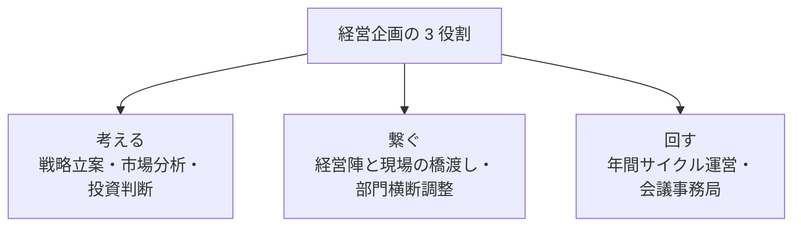
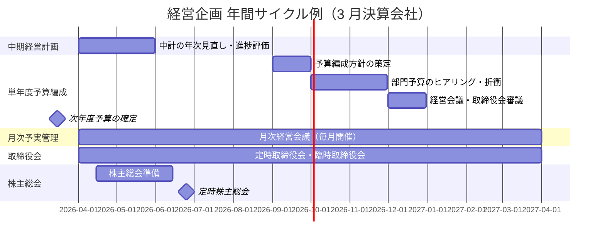
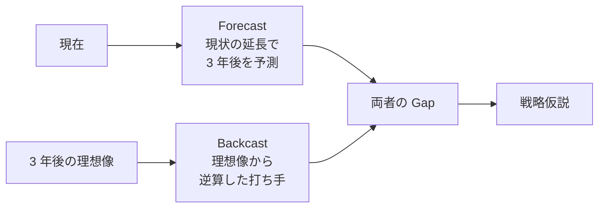
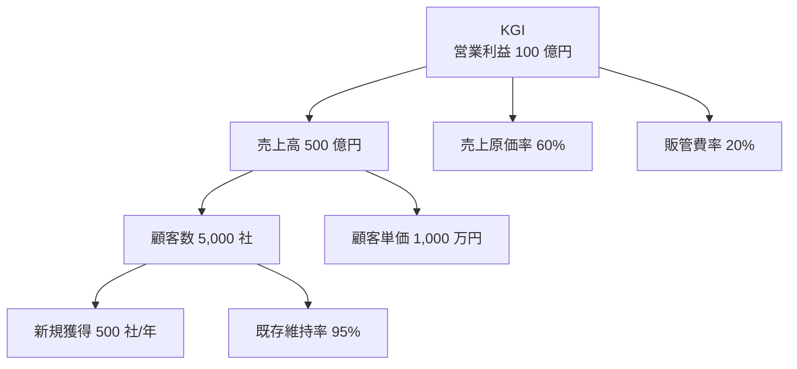
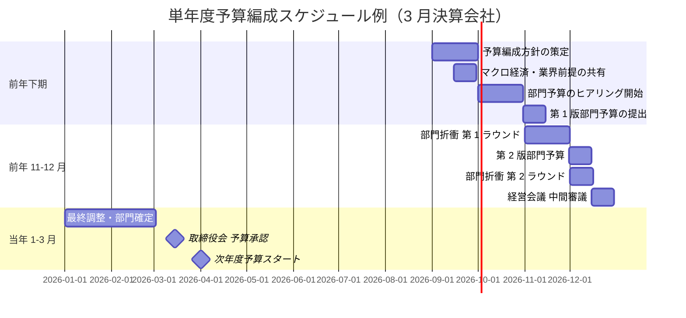
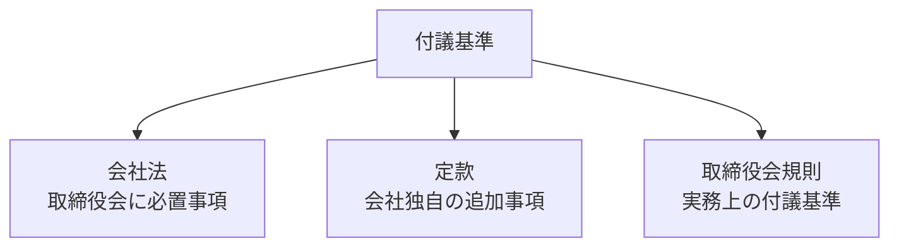
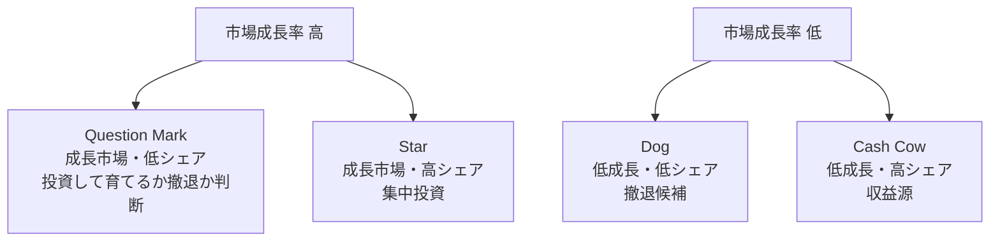

# 経営企画実務入門

「考える・繋ぐ・回す」の 3 役割で読み解く経営企画——中期経営計画・全社 KPI・予算編成・取締役会運営を 2026 年 7 月時点の実務で体系化

| 項目 | 内容 |
|---|---|
| カテゴリー | 経営企画・新規事業開発 |
| 難易度 | 中級 |
| 所要時間 | 約200分（全8レッスン） |
| 公開日 | 2026-07-16 |
| 最終更新日 | 2026-07-16 |
| コースURL | https://skillup.college/courses/corporate-planning/corporate-planning-basics/ |

## 対象者

経営企画 1〜3 年目、事業部から異動配属された非経理・非コンサル出身者、経営企画室のマネジャー、事業部で中計・予算に絡む企画担当、CFO・COO 候補。

## 前提知識

三表の基本（P/L・B/S の主要科目）を耳にしたことがある、MECE・ロジックツリーなどの思考フレームに触れたことがある程度。

## 学習目標

- 経営企画の 3 つの役割（考える・繋ぐ・回す）と年間サイクルを俯瞰できる
- 中期経営計画の策定プロセスと Forecast × Backcast の往復を理解できる
- 全社 KGI から部門 KPI への分解と BSC 4 視点・OKR 設計を組み立てられる
- 単年度予算編成の年間スケジュールと部門折衝の作法を持ち帰れる
- 月次予実管理と経営会議運営の型を回せる
- 取締役会運営（付議基準・議事進行・議事録・社外取締役対応）の基本を扱える
- 事業ポートフォリオ管理と新規事業・M&A の入口の判断軸を持てる
- 経営企画のキャリアパスと修了後の学び方を持ち帰れる

## コース概要

経営企画は、会社の年間サイクル（中期経営計画→単年度予算→月次予実→取締役会）を回す職種です。ただし、その実務は華やかさより地味な作業の積み重ねであり、中期経営計画のドラフトを何十版と作り直し、部門長との予算折衝で意見を擦り合わせ、取締役会の議事録を一言一句直します。本コースは、事業部から異動配属された非経理・非コンサル出身者、経営企画室で 1〜3 年目のマネジャー、CFO・COO 候補を対象に、経営企画の 3 役割・年間サイクル・中期経営計画・全社 KPI・予算編成・取締役会運営・新規事業と M&A の入口までを 8 レッスンで体系化します。既刊の思考フレーム・三表読解・スタートアップ資金調達などは前提として重複を避け、「事業会社の経営企画担当者が年間サイクルを回す実務」に軸足を置きます。

## 学習の流れ

前半 3 レッスンで経営企画の全体像と長期戦略を扱います。レッスン 1 で経営企画の 3 役割と年間サイクル、レッスン 2 で中期経営計画の策定、レッスン 3 で全社 KPI・OKR 設計を扱います。中盤のレッスン 4 で単年度予算編成、レッスン 5 で月次予実管理と経営会議運営を扱い、日常業務のリズムを組み立てます。後半のレッスン 6 で取締役会の運営、レッスン 7 で新規事業・M&A の入口、レッスン 8 で経営企画のキャリアと修了後の学び方までを扱います。全 8 レッスン・約 200 分の構成です。

## レッスン一覧

| No. | タイトル | 概要 | 所要時間 |
|---|---|---|---|
| 1 | 経営企画とは何か——3 つの役割と年間サイクル | 経営企画の 3 役割（考える・繋ぐ・回す）、年間サイクル（中計→単年度予算→月次予実→取締役会）、コース守備範囲・境界明示（三表読解・M&A 財務・企画書 8 要素は既刊譲り）を学ぶ | 25分 |
| 2 | 中期経営計画の策定 | 中計の 3 目的（方向性・資源配分・約束）、Forecast × Backcast の往復、環境分析（PEST・5F）→ 内部分析（VRIO・バリューチェーン）→ SWOT の使い方、戦略仮説の構造化、経営陣ワークショップの型を学ぶ | 25分 |
| 3 | 全社 KPI・OKR 設計 | KGI → KPI ツリー、BSC の 4 視点（財務・顧客・業務プロセス・学習と成長）、KPI 選定の 5 基準、OKR の四半期運用、部門への分解と対話を学ぶ | 25分 |
| 4 | 単年度予算編成の実務 | 年間スケジュール（前年 9〜3 月）、トップダウン vs ボトムアップ、部門折衝の 4 論点、予算編成会議の型、修正予算のタイミングを学ぶ | 25分 |
| 5 | 月次予実管理と経営会議運営 | 月次予実レビューの 5 ステップ、差異分析（要因分解）、経営会議のアジェンダ設計、事務局の 5 役割、議事録の書き方を学ぶ | 25分 |
| 6 | 取締役会の運営 | 取締役会と経営会議の役割分担、付議基準（会社法・定款・取締役会規則）、招集手続・議案の組み方、議事録（会社法 369 条 3 項）、社外取締役対応、モニタリング型ボードを学ぶ | 25分 |
| 7 | 新規事業・M&A の入口 | 事業ポートフォリオ管理（PPM・9 セル）、新規事業評価の 3 段階（アイデア→事業計画→投資判断）、投資判断稟議の型、M&A の入口（DD の 4 領域・PMI の 4 論点）、詳細は今後の別コースへを学ぶ | 25分 |
| 8 | 経営企画のキャリアと修了後の学び方 | 経営企画のキャリアパス（CFO・COO・事業部長・社外取締役・独立）、6 か月・1 年・3 年の学習ロードマップ、修了後の情報源（有価証券報告書・統合報告書・週刊経営財務）を学ぶ | 25分 |

---

## レッスン1：経営企画とは何か——3 つの役割と年間サイクル

（所要時間：25分）

### このレッスンで学ぶこと

- 本コースの守備範囲（年間サイクルを回す経営企画担当者の視点）と扱わない範囲を区別できる
- 経営企画の 3 つの役割（考える・繋ぐ・回す）と役割比重が会社の成熟度で変わる理由を語れる
- 経営企画の年間サイクル（中計→単年度予算→月次予実→取締役会）の全体像を追える
- 経営企画がゼネラリストとして「翻訳と接続」で価値を出す構造を理解できる
- 本コースの中核メッセージ 6 個を持ち帰れる

---

経営企画は「経営陣の右腕」と呼ばれます。ただし実務は華やかさより地味な作業の積み重ねで、中期経営計画のドラフトを何十版と作り直し、部門長との予算折衝で意見を擦り合わせ、取締役会の議事録を一言一句直します。しかし、その積み重ねが経営陣の意思決定の質を左右し、会社の 3〜5 年後の姿を作ります。本レッスンでは、経営企画そのものの位置づけと役割を整理し、本コース全 8 レッスンでどこを重点的に学ぶかの見取り図を提示します。

### 本コースの位置づけ——「年間サイクルを回す経営企画担当者」の視点

本コースは経営企画を「年間サイクルを回す担当者」の視点で扱います。MECE・ロジックツリー・仮説思考の思考フレーム、三表読解・M&A 財務分析、企画書・稟議書の作法、部門マネジャーの目標管理、スタートアップ文脈の資金調達は、それぞれ関連する入門コースを参照してください。本コースはそれらを前提として、「事業会社の経営企画担当者が中計→予算→月次予実→取締役会の年間サイクルを回す実務」に軸足を置きます。

> **💡 ポイント**
> 経営企画は「思考の型」を学ぶ職種ではなく、「思考の型を使って年間サイクルを回す」職種です。MECE やロジックツリーそのものは既刊の思考系入門コースで扱われますが、本コースはそれらを「中期経営計画のどこで、予算編成のどこで、経営会議のどこで、どう使うか」というリズムの中で位置づけます。

#### 対象読者の 3 つの視点

本コースは 3 つの視点を意識的に交錯させます。第 1 は、経営企画担当者本人の視点です。日々の作業とアウトプット。第 2 は、経営企画室長・部長の視点です。チーム運営・経営陣との対話。第 3 は、事業部側の視点です。経営企画から降りてくる中計・予算・KPI に対する事業部の反応。3 つの視点を持ち帰って、はじめて経営企画室が組織として機能します。

### 経営企画の 3 つの役割

経営企画の業務を大きく分けると、3 つの役割に整理できます。役割ごとに時間配分と必要スキルが異なります。

#### 役割 1：考える

経営陣が判断すべき戦略的な選択肢を、事実とロジックで提示する役割です。

- 中期経営計画の策定（3〜5 年先の方向性）
- 市場・競合分析（PEST・5F・SWOT など）
- 投資判断（新規事業・M&A・大型設備投資）
- ポートフォリオ管理（事業別の重点度）

「考える」の役割は成果物が形として残ります。中期経営計画書、投資判断稟議書、市場分析レポートといった書類が、経営陣の意思決定の土台になります。

#### 役割 2：繋ぐ

経営陣と現場、事業部と事業部、会社と株主といった立場の違いを橋渡しする役割です。

- 経営陣の意思を現場に翻訳
- 現場の実態を経営陣に翻訳
- 部門横断のプロジェクト調整
- 株主・投資家との IR 対話（IR 部門と連携）

「繋ぐ」の役割はコミュニケーション力とドメイン知識の両方が問われます。経営言語と現場言語の両方を扱えることが経営企画担当者の武器です。

#### 役割 3：回す

会社の年間サイクル（中計→予算→月次予実→取締役会）を運営する役割です。

- 中期経営計画の年次改訂
- 単年度予算の編成
- 月次予実管理・経営会議の運営
- 取締役会の事務局

「回す」の役割は目立ちませんが、これが崩れると会社の意思決定が止まります。カレンダーとタスクの管理、資料作成のリズムを持つことが求められます。

#### 役割の時間配分

経営企画担当者の理想的な時間配分は、会社の成熟度と経営陣の要求で変わります。

| 会社の成熟度 | 考える | 繋ぐ | 回す |
|---|---|---|---|
| 拡大期（IPO 前後、成長投資中心） | 45% | 25% | 30% |
| 安定期（既存事業中心、コーポレートガバナンス強化） | 30% | 30% | 40% |
| 転換期（新規事業立ち上げ、事業再編中心） | 40% | 35% | 25% |

拡大期は「考える」が多く、安定期は「回す」が多くなります。転換期は「繋ぐ」の比重が上がります。自社がどの局面にあるかを認識し、時間配分を調整することが経営企画室長の重要な仕事です。

### 経営企画の年間サイクル

経営企画の業務には、年次で回ってくる定期業務があります。3 月決算会社を想定した典型例を示します。

#### 主要業務の要点

- **中期経営計画**：3〜5 年ごとに大改訂、その間は年次で見直しと進捗評価
- **単年度予算編成**：前年 9 月に方針、10〜11 月に部門折衝、12 月に経営会議、3 月末までに確定
- **月次予実管理**：毎月開催の月次経営会議で予実対比、要因分析、アクション決定
- **取締役会**：月 1〜2 回の定時取締役会と、必要に応じて臨時取締役会
- **株主総会**：定時株主総会は決算後 3 か月以内（6 月開催が典型）

> **📝 補足**
> 会社によって取締役会の頻度・開催時期は異なります。上場企業は月次開催が多いですが、非上場企業では四半期開催のケースもあります。まずは自社の年間カレンダーを可視化することが経営企画業務の第一歩です。

### ゼネラリストとしての経営企画

経営企画は特定分野の専門家ではなく、ゼネラリストの職種です。経理・法務・営業・技術・人事といった各領域の専門家が持つ知見を、経営陣が意思決定できる形に「翻訳と接続」することが本質です。

#### 「翻訳」の例

- 経理の三表数字を「事業の実力」に翻訳（財務諸表を読み手として活用）
- 法務の会社法・金商法・独禁法の論点を「経営上の制約」に翻訳
- 営業・技術の現場実態を「戦略への含意」に翻訳
- 人事の組織課題を「戦略実行の障害」に翻訳

#### 「接続」の例

- 中期経営計画（考える）と単年度予算（回す）を接続
- 単年度予算（回す）と部門 KPI（繋ぐ）を接続
- 月次予実（回す）と経営会議（繋ぐ）を接続
- 経営会議の決定と取締役会付議（繋ぐ）を接続

翻訳と接続で価値を出す職種であるため、深い専門知識より「複数分野を跨いで正確に理解し、統合する能力」が問われます。

### 中核メッセージ 6 個の再掲

本コース全体を通じて、6 個のメッセージを繰り返します。

1. **経営企画は「考える・繋ぐ・回す」の 3 役割——比重は会社の成熟度で変わる**
2. **中期経営計画は「Forecast × Backcast」の往復——数字と物語を両方作る**
3. **全社 KPI は経営会議の共通言語——選んだ数字が組織の行動を決める**
4. **予算編成は「配分」ではなく「合意形成」——数字より前に前提を揃える**
5. **取締役会は意思決定の場、経営会議は執行の場——2 つを混同しない**
6. **経営企画はゼネラリスト——専門性より「翻訳と接続」で価値を出す**

このレッスンで扱うのはメッセージ 1「経営企画は 3 役割——比重は会社の成熟度で変わる」とメッセージ 6「経営企画はゼネラリスト——翻訳と接続で価値を出す」です。3 役割を意識せずに漠然と回そうとすると、目の前のタスクに追われて戦略的な役割が後回しになります。

### 次のレッスンで扱うこと

次のレッスン 2 では、経営企画の「考える」役割の中核である中期経営計画の策定に踏み込みます。中計の 3 目的（方向性・資源配分・約束）、Forecast × Backcast の往復、環境分析→内部分析→SWOT の使い方、戦略仮説の構造化、経営陣ワークショップの型を扱います。経営企画担当者が中期経営計画を作り上げるまでのプロセスを、実務の順序で追いかけます。

### 確認クイズ

このレッスンで学んだ内容を確認しましょう。

#### Q1. 経営企画の 3 つの役割として、本レッスンで挙げているものはどれか。

- [x] 考える・繋ぐ・回す
- [ ] 売る・作る・運ぶ
- [ ] 開発する・設計する・実装する
- [ ] 監督する・指導する・評価する

> **解説**
> 経営企画の 3 役割は「考える（戦略立案）」「繋ぐ（経営陣と現場の橋渡し）」「回す（年間サイクル運営）」です。役割ごとに時間配分と必要スキルが異なり、会社の成熟度で比重が変わります。

#### Q2. 「考える」の役割に含まれる業務として、本レッスンで挙げられているものはどれか。

- [ ] 月次経営会議の議事録作成
- [x] 中期経営計画の策定、市場・競合分析、投資判断、ポートフォリオ管理
- [ ] 取締役会の招集手続
- [ ] 部門予算のヒアリング・折衝

> **解説**
> 「考える」の役割には中期経営計画の策定、市場・競合分析、投資判断、ポートフォリオ管理が含まれます。議事録作成・招集手続・部門折衝は「回す」または「繋ぐ」の役割です。役割の境界を明確に持つことが時間配分の起点になります。

#### Q3. 経営企画担当者の時間配分について、本レッスンで示された成熟度別の傾向として適切なものはどれか。

- [ ] 拡大期ほど「回す」比率が高まる
- [ ] 安定期ほど「考える」比率が高まる
- [x] 拡大期は「考える」が中心、安定期は「回す」が中心、転換期は「繋ぐ」の比重が上がる
- [ ] 会社の成熟度と時間配分は無関係

> **解説**
> 拡大期は「考える」（戦略立案が中心）、安定期は「回す」（年間サイクル運営が中心）、転換期は「繋ぐ」（部門横断調整が中心）の比重が上がります。自社がどの局面にあるかを認識し、時間配分を調整することが経営企画室長の重要な仕事です。

#### Q4. 経営企画がゼネラリストとして「翻訳と接続」で価値を出す構造として、本レッスンで挙げていない例はどれか。

- [ ] 経理の三表数字を「事業の実力」に翻訳
- [ ] 法務の会社法・金商法の論点を「経営上の制約」に翻訳
- [ ] 中期経営計画と単年度予算を接続
- [x] 個別従業員の勤怠管理を経営陣に報告

> **解説**
> 経営企画の「翻訳と接続」の例は、経理・法務・営業・技術・人事といった各領域の知見を経営陣が意思決定できる形にすることです。個別従業員の勤怠管理は人事・労務の担当領域で、経営企画の業務ではありません。境界を明確に持つことが「翻訳と接続」の質を高めます。

---

## レッスン2：中期経営計画の策定

（所要時間：25分）

### このレッスンで学ぶこと

- 中期経営計画の 3 つの目的（方向性・資源配分・約束）を語れる
- Forecast × Backcast の往復で戦略を組み立てられる
- PEST・5F の環境分析と VRIO・バリューチェーンの内部分析の使い分けを判断できる
- SWOT を「戦略の起点」として使う型を持てる
- 経営陣ワークショップの型で戦略仮説を絞り込める

---

前レッスンでは経営企画の 3 役割と年間サイクルを整理しました。本レッスンでは、経営企画の「考える」役割の中核である中期経営計画の策定に踏み込みます。中核メッセージ 2「中期経営計画は Forecast × Backcast の往復——数字と物語を両方作る」の実装編です。

### 中期経営計画の 3 つの目的

中期経営計画（中計）は 3〜5 年先の会社の姿を示す文書です。ただし「文書を作ること」自体が目的ではなく、次の 3 つの目的を果たすための道具です。

#### 目的 1：方向性を示す

「この会社は 3〜5 年後にどうなりたいか」を全社員・株主・顧客・パートナーに示します。方向性が定まらないと、日々の意思決定がバラバラになり、リソースが分散します。中計は「Yes と言うこと・No と言うこと」を明確にする文書です。

#### 目的 2：資源配分を決める

限られた人材・資金・時間を、どの事業・どの機能に集中投下するかを決めます。「あれもこれも」ではなく、「これに集中する」を宣言することが中計の力です。事業ポートフォリオの選択と集中がここで決まります。

#### 目的 3：株主・投資家への約束

上場企業では、中計は「株主・投資家との約束」です。売上・営業利益・ROE などの財務目標を掲げ、その達成に向けて経営陣がコミットします。株主総会・IR 資料での中心的な発信内容になります。

### Forecast × Backcast の往復

中期経営計画の策定には、2 つの発想を往復させる方法が実務の標準です。

#### Forecast（予測）

- 現在の事業構造・市場環境の延長線上で、3〜5 年後の姿を予測
- 「何もしなければどうなるか」の Baseline
- 現在の成長率・シェア・市場成長率から機械的に計算できる

#### Backcast（逆算）

- 3〜5 年後の理想像を先に定義
- 「そこに至るために今何をすべきか」を逆算
- 経営陣・株主の期待から降ろす目標

#### 両者の Gap こそ戦略の焦点

Forecast だけだと現状追認、Backcast だけだと絵に描いた餅になります。両者を並べ、その Gap をどう埋めるかを議論することが、戦略仮説の起点です。「Forecast は既存事業のポテンシャル、Backcast は新規投資と構造改革の必要性」を明らかにします。

> **💡 ポイント**
> 数字だけの中計は経営陣の心を動かしません。「なぜこの目標を掲げるのか」「なぜこの方向に進むのか」の物語（Narrative）を、数字とセットで作ることが実務の型です。中計は「経営陣・従業員・株主が同じ物語を共有するための道具」でもあります。

### 環境分析——PEST と 5F

外部環境を把握する 2 つの代表的なフレームです。既刊の思考系入門コースでも触れられていますが、本コースでは「中計策定のどこで使うか」の視点で扱います。

#### PEST 分析（マクロ環境）

- **Political（政治）**：法規制、政策、税制、貿易政策
- **Economic（経済）**：GDP、金利、為替、消費者物価、資源価格
- **Social（社会）**：人口動態、価値観、ライフスタイル、労働環境
- **Technological（技術）**：AI、DX、脱炭素、量子、バイオ

中計策定では、3〜5 年後の PEST 環境変化を想定し、「変化に強い戦略」を組む視点で使います。

#### 5 フォース分析（業界構造）

Michael Porter が 1979 年に提唱した業界構造分析。5 つの競争要因を分析します。

- 業界内の競合（既存プレイヤーの競争激しさ）
- 新規参入の脅威
- 代替品の脅威
- 買い手の交渉力
- 供給業者の交渉力

中計策定では、業界構造が今後 3〜5 年でどう変わるかを予測し、自社の立ち位置を組み立てる視点で使います。

### 内部分析——VRIO とバリューチェーン

自社の強み・弱みを把握する 2 つの代表的なフレームです。

#### VRIO 分析

Jay Barney が 1991 年に提唱した内部資源分析。4 つの問いで自社資源の競争優位性を評価します。

- **Value（価値）**：この資源は顧客価値を生むか？
- **Rarity（希少性）**：他社が持っていない資源か？
- **Imitability（模倣困難性）**：他社が真似できないか？
- **Organization（組織）**：それを活用する組織があるか？

4 つを満たす資源が「持続的競争優位」の源泉です。

#### バリューチェーン分析

Michael Porter が 1985 年に提唱した業務活動分析。主活動（購買物流→製造→出荷物流→販売・マーケ→サービス）と支援活動（人事・技術・調達・全般管理）に分けて、どこで価値を生んでいるかを分析します。

中計策定では、「自社のどこが差別化の源か」「どこが業界内で弱いか」を明らかにする視点で使います。

### SWOT——戦略の起点として使う

外部分析（PEST・5F）と内部分析（VRIO・バリューチェーン）の結果を統合するのが SWOT 分析です。

|  | 内部 |  |
|---|---|---|
| **外部** | Strength（強み） | Weakness（弱み） |
| Opportunity（機会） | SO：強みを活かして機会を掴む | WO：弱みを克服して機会を掴む |
| Threat（脅威） | ST：強みで脅威に対抗する | WT：弱みと脅威の両方への防御 |

#### SWOT を「戦略の起点」として使う

- SO：既存強みを新市場に展開（グローバル展開、新セグメント）
- WO：弱みを補完する提携・買収（M&A、資本提携）
- ST：強みで守り（既存事業の防衛、コスト削減）
- WT：撤退・縮小（不採算事業の売却、事業縮小）

SWOT は「洗い出し」だけではなく、4 象限それぞれで戦略仮説を出すことで、初めて中期経営計画の骨格になります。

### 経営陣ワークショップの型

戦略仮説を絞り込むには、経営陣とのワークショップが不可欠です。経営企画担当者が事務局として運営する場面です。

#### ワークショップの 3 ステップ

1. **事前準備**：分析結果と戦略仮説の候補を経営企画がドラフト、事前配布
2. **当日議論**：経営陣が候補を評価、追加・削除・修正を議論
3. **事後まとめ**：議論結果を反映した第 2 版を経営企画が作成、次回に持ち込み

3〜5 回のサイクルで、戦略仮説が絞り込まれ、中期経営計画のドラフトが固まります。

#### 事務局の役割

- ファシリテーション（議論を活性化・脱線を戻す）
- 時間管理（議題ごとの時間配分）
- 記録（議事録・アクションアイテム）
- 資料作成（次回に向けた更新）

経営陣は各自の視点で戦略を語りますが、事務局が「どの論点で意見が割れているか」を可視化しないと、議論が散らばります。

### 確認クイズ

このレッスンで学んだ内容を確認しましょう。

#### Q1. 中期経営計画の 3 つの目的として、本レッスンで挙げているものはどれか。

- [x] 方向性を示す・資源配分を決める・株主／投資家への約束
- [ ] 従業員教育・広告予算配分・株主総会準備
- [ ] 給与規程改定・組織改編・人員採用計画
- [ ] 生産計画・在庫管理・調達スケジュール

> **解説**
> 中期経営計画の 3 目的は「方向性を示す」「資源配分を決める」「株主・投資家への約束」です。従業員教育や広告予算配分は個別施策で、生産計画や在庫管理はオペレーション領域です。中計は経営全体の方向性を示す道具として位置づけられます。

#### Q2. Forecast × Backcast の往復について、本レッスンで挙げている記述はどれか。

- [ ] Forecast は理想像から逆算、Backcast は現状延長
- [x] Forecast は現状の延長で 3 年後を予測、Backcast は理想像から逆算した打ち手、両者の Gap が戦略仮説の起点
- [ ] Forecast と Backcast は同じ意味で使い分けは不要
- [ ] Backcast は非上場企業だけが使うフレームワーク

> **解説**
> Forecast は「現状の延長で 3〜5 年後を予測」、Backcast は「理想像から逆算した打ち手」で、両者を並べて Gap を議論することが戦略仮説の起点です。Forecast だけでは現状追認、Backcast だけでは絵に描いた餅になります。

#### Q3. VRIO 分析の 4 つの問いに含まれない項目はどれか。

- [ ] Value（価値）
- [ ] Rarity（希少性）
- [x] Investment（投資額）
- [ ] Organization（組織）

> **解説**
> VRIO 分析の 4 つの問いは「Value（価値）」「Rarity（希少性）」「Imitability（模倣困難性）」「Organization（組織）」です。「Investment（投資額）」は含まれません。4 つを満たす資源が「持続的競争優位」の源泉になります。

#### Q4. 中期経営計画策定における経営陣ワークショップの事務局の役割として、本レッスンで挙げていないものはどれか。

- [ ] ファシリテーション（議論を活性化・脱線を戻す）
- [ ] 時間管理（議題ごとの時間配分）
- [ ] 記録（議事録・アクションアイテム）
- [x] 経営陣個人の勤務評価

> **解説**
> 事務局の役割は「ファシリテーション」「時間管理」「記録」「資料作成」の 4 つです。経営陣個人の勤務評価は取締役会や指名委員会の役割で、経営企画事務局の業務ではありません。境界を明確に持つことがワークショップの質を高めます。

---

## レッスン3：全社 KPI・OKR 設計

（所要時間：25分）

### このレッスンで学ぶこと

- KGI から KPI ツリーを組み立てる 3 ステップを語れる
- BSC の 4 視点（財務・顧客・業務プロセス・学習と成長）を全社バランスの物差しとして使える
- KPI 選定の 5 基準で候補を絞り込める
- OKR の四半期運用の型を持てる
- 全社 KPI を部門 KPI へ分解する対話の要点を挙げられる

---

前レッスンでは中期経営計画を策定しました。本レッスンでは、中計で示した方向性を「日々の行動」に落とし込む道具である全社 KPI・OKR の設計に踏み込みます。中核メッセージ 3「全社 KPI は経営会議の共通言語——選んだ数字が組織の行動を決める」の実装編です。

### KGI・KPI・KPI ツリーの整理

まず基本用語を整理します。

- **KGI（Key Goal Indicator）**：最終目標。3〜5 年後の姿を数字で示す（例：営業利益 100 億円、ROE 10%、ARR 50 億円）
- **KPI（Key Performance Indicator）**：KGI 達成の途中経過を測る中間指標
- **KPI ツリー**：KGI を頂点に、KPI を階層的に分解した構造図

#### KPI ツリーの 3 ステップ

1. **頂点に KGI を置く**：中期経営計画の主要目標を頂点に配置
2. **論理的に分解**：足し算・掛け算・引き算で KPI を分解（売上 = 顧客数 × 顧客単価、営業利益 = 売上 - 売上原価 - 販管費）
3. **アクション可能な粒度まで下ろす**：部門長・チームリーダーが自分の意思決定でコントロールできる粒度に

### BSC の 4 視点

KPI ツリーだけだと、財務指標（P/L・B/S）に偏りがちです。BSC（Balanced Scorecard）は Kaplan & Norton が 1992 年に HBR で提唱した枠組みで、4 つの視点からバランスよく KPI を選ぶ発想を提供します。

#### 4 視点の内容

- **財務の視点**：売上高、営業利益、ROE、CCC、ARR
- **顧客の視点**：顧客数、顧客満足度、NPS、リピート率
- **業務プロセスの視点**：生産性、リードタイム、品質不良率、稼働率
- **学習と成長の視点**：従業員エンゲージメント、資格保有率、離職率、研修投資

#### 4 視点の因果関係

- 学習と成長 → 業務プロセス改善 → 顧客満足向上 → 財務結果向上

「学習と成長」への投資が「業務プロセス」を改善し、「顧客」の満足度を高め、最終的に「財務」の成果につながる、という因果関係を可視化するのが BSC の思想です。

### KPI 選定の 5 基準

KPI ツリーで候補を並べても、経営会議で追いかけるべき KPI は絞り込みが必要です。5 基準で判断します。

#### 基準 1：戦略適合

中期経営計画の重点戦略に直結する KPI か。「あれば良い」ではなく「これがなければ戦略が語れない」ものに絞る。

#### 基準 2：測定可能性

数値で客観的に測れるか。「顧客満足度が上がった気がする」ではなく「NPS が 20 → 30 に向上」といった定量化。

#### 基準 3：影響力

数値の変化が事業成果に大きな影響を与えるか。統計的な誤差レベルの変化しか測れない KPI は避ける。

#### 基準 4：アクション可能性

その KPI を追いかけている人が、自分の意思決定でコントロールできるか。「為替レート」といったコントロール不能な指標を KPI に置くのは不適切。

#### 基準 5：シンプルさ

複雑な計算式・複数指標の合成が必要な KPI より、シンプルで直感的な KPI の方が組織で共通言語になりやすい。

> **⚠️ 注意**
> KPI の数が多すぎると、追いかける対象が散らばり、どれも中途半端になります。全社経営会議で追いかける KPI は 10〜15 個程度に絞るのが実務の目安です。多すぎる KPI は「KPI があるだけで実質何も見ていない」状態を生みます。

### OKR の四半期運用

OKR（Objectives and Key Results）は Intel の Andy Grove が 1970 年代に生み出し、Google が 1999 年に John Doerr の導入で採用した目標管理の型です。近年、日本の中堅企業でも採用が広がっています。

#### OKR の基本構造

- **Objective**：定性的で野心的な目標（1 つの部門・チームで 3〜5 個）
- **Key Results**：Objective の達成度を測る 2〜5 個の定量指標

例：
- Objective：市場での圧倒的なリーダーポジションを確立する
- KR 1：シェアを 20% → 30% に拡大
- KR 2：業界メディアでの言及回数を月 50 件 → 100 件
- KR 3：主要顧客 100 社での取引拡大率を平均 30%

#### 四半期運用の型

- **Q 初め**：Objectives と Key Results を設定、経営陣と部門長で合意
- **月次**：進捗レビュー、必要なら軌道修正
- **Q 終わり**：達成度スコアリング（0.0〜1.0 の 5 段階など）、次 Q の学びに反映

#### KPI と OKR の使い分け

- **KPI**：継続的にモニタリングする定常指標（毎月・毎年比較）
- **OKR**：四半期ごとの野心的な挑戦を設定する道具

両者は競合ではなく補完関係です。KPI で会社の健康状態を毎月追いかけ、OKR で四半期ごとに次の一歩を挑む——という使い分けが実務の型です。

### 全社 KPI を部門 KPI へ分解する

全社の KPI を、事業部・機能部門の KPI に分解する作業が、経営企画の「繋ぐ」役割の中核です。

#### 分解の 2 パターン

- **積み上げ型**：全社売上 500 億円 → 事業部 A 200 億円 + 事業部 B 200 億円 + 事業部 C 100 億円
- **貢献度型**：全社の顧客満足度向上に、事業部 A の解約率削減が寄与

積み上げ型は数字が明確ですが、部門間の依存関係（横断プロジェクトなど）を捉えにくいという弱みがあります。貢献度型はその弱みを補完しますが、責任の所在があいまいになりがちです。両者を組み合わせるのが実務の型です。

#### 部門との対話

部門 KPI を経営企画から一方的に「割り当てる」形にすると、部門長の当事者意識が育ちません。次の対話ステップが必要です。

1. **全社 KPI と方針を先に共有**：中期経営計画の重点と全社 KPI を部門長に説明
2. **部門から KPI 案を出してもらう**：「全社目標に対して自部門で何ができるか」を部門長がドラフト
3. **経営企画と部門で調整**：足し算が全社目標に届くか、部門間で重複や漏れがないかを議論
4. **経営陣で承認**：最終的な部門 KPI を経営会議で決定

「決められた KPI を追いかける」より「自分たちで作った KPI を追いかける」方が、実行力が格段に上がります。

### 中核メッセージ 6 個の再掲

本コース全体を通じて、6 個のメッセージを繰り返します。

1. **経営企画は「考える・繋ぐ・回す」の 3 役割——比重は会社の成熟度で変わる**
2. **中期経営計画は「Forecast × Backcast」の往復——数字と物語を両方作る**
3. **全社 KPI は経営会議の共通言語——選んだ数字が組織の行動を決める**
4. **予算編成は「配分」ではなく「合意形成」——数字より前に前提を揃える**
5. **取締役会は意思決定の場、経営会議は執行の場——2 つを混同しない**
6. **経営企画はゼネラリスト——専門性より「翻訳と接続」で価値を出す**

このレッスンで扱うのはメッセージ 3「全社 KPI は経営会議の共通言語——選んだ数字が組織の行動を決める」です。KPI ツリー・BSC・OKR を組み合わせ、部門との対話を通じて、経営と現場が同じ数字を見ながら日々を動かす状態を作ることが目標です。

### 次のレッスンで扱うこと

次のレッスン 4 では、全社 KPI と中計の方向性を、単年度の予算に落とし込む作業を扱います。年間スケジュール（前年 9〜3 月）、トップダウン vs ボトムアップ、部門折衝の 4 論点、予算編成会議の型、修正予算のタイミングまで整理します。中核メッセージ 4「予算編成は配分ではなく合意形成」の実装編です。

### 確認クイズ

このレッスンで学んだ内容を確認しましょう。

#### Q1. KGI と KPI の関係として、適切な記述はどれか。

- [x] KGI は最終目標、KPI は KGI 達成の途中経過を測る中間指標
- [ ] KGI と KPI は同じ意味で使い分けは不要
- [ ] KPI は KGI の下位概念ではなく、独立した指標
- [ ] KGI は部門ごとに設定、KPI は全社で 1 つだけ設定

> **解説**
> KGI（Key Goal Indicator）は 3〜5 年後の姿を数字で示す最終目標で、KPI（Key Performance Indicator）は KGI 達成の途中経過を測る中間指標です。KPI ツリーは KGI を頂点に KPI を階層的に分解した構造図で、部門長・チームリーダーがアクションできる粒度まで下ろします。

#### Q2. BSC（Balanced Scorecard）の 4 視点として、本レッスンで挙げているものはどれか。

- [ ] 短期・中期・長期・超長期
- [x] 財務・顧客・業務プロセス・学習と成長
- [ ] 経営・現場・株主・従業員
- [ ] 売上・原価・利益・キャッシュフロー

> **解説**
> BSC の 4 視点は「財務」「顧客」「業務プロセス」「学習と成長」です。Kaplan & Norton が 1992 年に HBR で提唱した枠組みで、「学習と成長 → 業務プロセス → 顧客満足 → 財務結果」の因果関係を可視化する思想です。財務偏重を避けバランスよく KPI を選ぶための道具です。

#### Q3. KPI 選定の 5 基準として、本レッスンで挙げていない項目はどれか。

- [ ] 戦略適合
- [ ] 測定可能性
- [x] メディア注目度
- [ ] アクション可能性

> **解説**
> KPI 選定の 5 基準は「戦略適合」「測定可能性」「影響力」「アクション可能性」「シンプルさ」です。メディア注目度は経営指標としては使いません。5 基準で候補を絞り込み、全社経営会議で追いかける KPI は 10〜15 個程度に留めるのが実務の目安です。

#### Q4. OKR について、本レッスンで挙げている記述はどれか。

- [ ] OKR は日本の中堅企業だけが使う目標管理法
- [ ] OKR と KPI は競合関係で、どちらか一方だけを使う
- [ ] Objective は必ず定量指標にする
- [x] Intel の Andy Grove が 1970 年代に生み出し、Google が 1999 年に John Doerr の導入で採用した目標管理の型

> **解説**
> OKR は Intel の Andy Grove が 1970 年代に生み出し、Google が 1999 年に John Doerr の導入で採用した目標管理の型です。Objective は「定性的で野心的な目標」、Key Results は「達成度を測る 2〜5 個の定量指標」です。KPI（継続モニタリング）と OKR（四半期ごとの挑戦）は補完関係にあります。

---

## レッスン4：単年度予算編成の実務

（所要時間：25分）

### このレッスンで学ぶこと

- 単年度予算編成の年間スケジュール（前年 9〜3 月）を組める
- トップダウン予算とボトムアップ予算の使い分けを判断できる
- 部門折衝の 4 論点（数字・前提・優先順位・打ち手）で議論を整理できる
- 予算編成会議の進行の型を持てる
- 修正予算のタイミングと判断基準を持ち帰れる

---

前レッスンでは全社 KPI・OKR 設計を扱いました。本レッスンでは、それらを単年度の予算に落とし込む実務に踏み込みます。中核メッセージ 4「予算編成は『配分』ではなく『合意形成』——数字より前に前提を揃える」の実装編です。

### 年間スケジュール——前年 9 月〜3 月

3 月決算会社を想定した単年度予算編成の典型的スケジュールを示します。

#### 各段階の要点

- **9 月：予算編成方針**：中期経営計画をふまえ、次年度予算の方針（成長投資領域、コスト削減領域、KPI 目標）を経営陣と経営企画で策定
- **9〜10 月：前提共有**：マクロ経済（GDP・為替・金利）、業界動向、顧客動向を全社共有
- **10〜11 月：部門ヒアリングと第 1 版**：各部門長にヒアリング、第 1 版の部門予算を作成
- **11〜12 月：折衝の 2 ラウンド**：部門予算の総和が全社目標に届くまで、経営企画と部門長で折衝
- **12 月：経営会議中間審議**：経営陣で予算案を審議、追加要求・調整
- **1〜3 月：最終調整**：全社予算を確定、取締役会で承認
- **4 月：次年度予算スタート**：新年度の月次予実管理が始まる

### トップダウン vs ボトムアップ

予算編成のアプローチは 2 パターンに大別されます。

#### トップダウン予算

経営陣が「全社の目標」を先に定め、部門に配分する方式。

- 利点：全社目標との整合が取りやすい、意思決定が早い
- 欠点：現場の実態が反映されにくい、部門長の当事者意識が育たない

#### ボトムアップ予算

各部門が「自部門の予算」を先に作り、それを積み上げて全社予算を作る方式。

- 利点：現場の実態が反映される、部門長の当事者意識が育つ
- 欠点：積み上げが全社目標に届かない可能性、予算調整の期間が長くなる

#### 実務は「トップダウン方針 + ボトムアップ数字」

多くの中堅企業では、①経営陣が予算編成方針をトップダウンで示し、②各部門がその方針の中でボトムアップ数字を積み上げ、③経営企画が全社目標との Gap を折衝で埋める——という 3 段構成が実務の型です。

> **💡 ポイント**
> トップダウンだけだと現場が納得せず実行力が下がり、ボトムアップだけだと全社目標に届きません。「方針はトップダウン、数字はボトムアップ、Gap は対話で埋める」の 3 段構成が現実的です。

### 部門折衝の 4 論点

部門予算の折衝で経営企画と部門長が議論するのは、主に次の 4 論点です。

#### 論点 1：数字

- 売上目標は妥当か
- 原価率・販管費率は現実的か
- 投資額（設備・人件費・広告）は適切か

#### 論点 2：前提

- 市場成長率の前提は妥当か
- 顧客動向の想定は現実的か
- 為替・金利の前提は共通か

#### 論点 3：優先順位

- どの事業に集中するか
- どの機能を強化するか
- どの費用を削るか

#### 論点 4：打ち手

- 目標達成のための具体的な施策は
- 施策の責任者と期限は
- 施策が失敗した場合の代替案は

#### 折衝の順序

「数字」だけを議論すると、経営企画と部門長で「もっと下げろ」「これ以上下げられない」の押し問答になります。まず「前提」を揃え、次に「優先順位」を合意し、最後に「打ち手」の実効性を確認する——この順序で議論すると、数字は自ずと合意点に近づきます。

### 予算編成会議の進行の型

予算編成会議は、全社の予算方針を経営陣と経営企画で議論する場です。次の型で運営します。

#### 会議の 4 パート

1. **前提の確認（10 分）**：マクロ経済・業界動向・中期経営計画の確認
2. **部門予算の概要説明（20 分）**：各部門予算の第 2 版を経営企画が要約説明
3. **論点別ディスカッション（40 分）**：全社目標との Gap、部門間のリソース配分、投資判断
4. **決定事項のまとめ（10 分）**：追加調整項目・責任者・期限

#### 事務局の役割

- 事前準備：資料配布、論点整理、時間配分の設計
- 当日進行：ファシリテーション、脱線を戻す、決定事項の記録
- 事後まとめ：議事録・アクションアイテムの配布、翌回に向けた資料更新

### 修正予算のタイミングと判断基準

期中に環境が大きく変わった場合、期中で予算を修正することがあります。修正予算のタイミングと判断基準を整理します。

#### 修正予算を検討するタイミング

- 第 1 四半期終了時（6 月末が典型）
- 第 2 四半期終了時（9 月末）
- 大きな環境変化があった直後（M&A、大型災害、規制変更）

#### 判断基準

- 通年予算からの乖離が 10% 超（売上・営業利益いずれかで）
- 環境変化が構造的（一時要因ではなく継続要因）
- 経営会議・取締役会での戦略再議論が必要

#### 修正予算の意義

修正予算を作ることは「元の予算が甘かった」ことを認めることでもあり、経営陣・部門長にとって心理的抵抗があります。ただし、環境が大きく変わったのに元の予算のまま月次予実管理を続けても、意味のある議論はできません。「実態に合った予算に更新する」ことで、月次予実管理の質を取り戻せます。

> **⚠️ 注意**
> 修正予算を頻繁に出すと、予算そのものの信頼性が失われます。原則は「年 1 回の予算編成で年間を通す」ことで、修正予算は「相当な環境変化があった場合の例外措置」と位置付けることが望ましい運用です。

### 中核メッセージ 6 個の再掲

本コース全体を通じて、6 個のメッセージを繰り返します。

1. **経営企画は「考える・繋ぐ・回す」の 3 役割——比重は会社の成熟度で変わる**
2. **中期経営計画は「Forecast × Backcast」の往復——数字と物語を両方作る**
3. **全社 KPI は経営会議の共通言語——選んだ数字が組織の行動を決める**
4. **予算編成は「配分」ではなく「合意形成」——数字より前に前提を揃える**
5. **取締役会は意思決定の場、経営会議は執行の場——2 つを混同しない**
6. **経営企画はゼネラリスト——専門性より「翻訳と接続」で価値を出す**

このレッスンで扱うのはメッセージ 4「予算編成は『配分』ではなく『合意形成』」です。数字の押し引きではなく、前提と優先順位と打ち手の合意を通じて、部門長の当事者意識と経営陣の意思統一を両立することが、予算編成の本質です。

### 次のレッスンで扱うこと

次のレッスン 5 では、単年度予算が始まった後の月次サイクルを扱います。月次予実レビューの 5 ステップ、差異分析（要因分解）、経営会議のアジェンダ設計、事務局の 5 役割、議事録の書き方までを整理します。予算編成で作った目標が、月次で機能するための実務です。

### 確認クイズ

このレッスンで学んだ内容を確認しましょう。

#### Q1. 単年度予算編成のアプローチとして、本レッスンで挙げている実務の型はどれか。

- [x] 方針はトップダウン、数字はボトムアップ、Gap は対話で埋める 3 段構成
- [ ] 完全トップダウン（経営陣が全て決める）
- [ ] 完全ボトムアップ（部門が全て決める）
- [ ] 前年数字の 10% 増を機械的に適用

> **解説**
> 実務では「経営陣が予算編成方針をトップダウンで示し」「各部門がその方針の中でボトムアップ数字を積み上げ」「経営企画が全社目標との Gap を折衝で埋める」の 3 段構成が典型です。完全トップダウンだと現場が納得せず、完全ボトムアップだと全社目標に届きません。

#### Q2. 部門折衝の 4 論点として、本レッスンで挙げていない項目はどれか。

- [ ] 数字
- [x] 部門長個人の評価
- [ ] 前提
- [ ] 優先順位、打ち手

> **解説**
> 部門折衝の 4 論点は「数字」「前提」「優先順位」「打ち手」です。部門長個人の評価は人事評価の領域で、予算折衝で扱う論点ではありません。折衝は「前提を揃え、優先順位を合意し、打ち手の実効性を確認する」順序で進めるのが実務の型です。

#### Q3. 予算編成会議の進行の 4 パートとして、本レッスンで挙げている構成はどれか。

- [ ] オープニング・自己紹介・懇親・クロージング
- [ ] プレゼン・質疑応答・投票・決議
- [x] 前提の確認・部門予算の概要説明・論点別ディスカッション・決定事項のまとめ
- [ ] 挨拶・報告・議論・散会

> **解説**
> 予算編成会議の 4 パートは「前提の確認（10 分）」「部門予算の概要説明（20 分）」「論点別ディスカッション（40 分）」「決定事項のまとめ（10 分）」です。事務局は事前準備・当日進行・事後まとめの 3 段で運営します。

#### Q4. 修正予算について、本レッスンで挙げている判断基準はどれか。

- [ ] 経営陣の気分次第で頻繁に修正する
- [ ] 月次で毎月修正する
- [ ] 予算からの乖離が 1% でも即修正する
- [x] 通年予算からの乖離が 10% 超、環境変化が構造的、戦略再議論が必要——3 つの条件で判断

> **解説**
> 修正予算の判断基準は「通年予算からの乖離が 10% 超（売上・営業利益いずれかで）」「環境変化が構造的（一時要因ではなく継続要因）」「経営会議・取締役会での戦略再議論が必要」の 3 つです。頻繁な修正は予算そのものの信頼性を失わせるため、例外措置と位置付けます。

---

## レッスン5：月次予実管理と経営会議運営

（所要時間：25分）

### このレッスンで学ぶこと

- 月次予実レビューの 5 ステップを組める
- 差異分析の要因分解（数量差・単価差・時間差）を実務で使える
- 経営会議のアジェンダ設計の型を持てる
- 事務局の 5 役割（企画・準備・進行・記録・フォロー）を回せる
- 議事録の書き方（決定事項・アクションアイテム・意思決定の経緯）を語れる

---

前レッスンでは単年度予算編成の実務を扱いました。本レッスンでは、その予算が始まった後の月次サイクルに踏み込みます。中核メッセージ 3「全社 KPI は経営会議の共通言語」の日常運用編です。

### 月次予実レビューの 5 ステップ

月次予実レビューは、経営陣・部門長・経営企画が集まって、前月の実績と予算を対比し、次のアクションを決める場です。次の 5 ステップで運営します。

#### ステップ 1：数字を並べる

- 予算・実績・差異・差異率・累計を一覧化
- 全社と事業部別・機能部門別で並列表示
- 前月比・前年同月比も並べる

#### ステップ 2：異常値を捕捉

- 差異率 ±10% 超、金額 ±100 万円超などの閾値で自動フラグ
- 特に営業利益に影響する項目に注目

#### ステップ 3：要因を分解

- 差異を「数量差 × 単価差 × 時間差」の 3 要素で説明
- 「売上マイナス 500 万円」ではなく「販売数量マイナス 300 万・単価マイナス 200 万」と分解

#### ステップ 4：アクション決定

- 要因に応じた打ち手を決める
- 責任者と期限を明示
- 経営会議で経営陣の合意を取る

#### ステップ 5：翌月フォロー

- 打ち手の効果を翌月の月次で検証
- 想定通りの効果が出ない場合、追加打ち手を検討

### 差異分析——数量差・単価差・時間差

売上・費用の差異は、多くの場合「数量差 × 単価差 × 時間差」の 3 要素で説明できます。既刊の経理系入門コースで扱う内容ですが、経営企画の視点でも重要な道具です。

#### 例：売上が予算 1,000 万円、実績 850 万円で 150 万円マイナスの場合

- 予算：100 個 × 平均単価 10 万円 = 1,000 万円
- 実績：90 個 × 平均単価 9.4 万円 = 846 万円

**要因分解**：
- **数量差**：10 個減少 × 予算単価 10 万円 = 100 万円マイナス
- **単価差**：実績数量 90 個 × 単価差 0.6 万円 = 54 万円マイナス
- **時間差**：大型受注 1 件が翌月へズレ = 4 万円マイナス（合計調整）

#### 分解の意義

「販売数量」「単価」「時間」に分けて示すことで、打ち手が具体化します。

- 数量差 → 営業活動強化、顧客獲得
- 単価差 → 値付け見直し、上位モデル販売強化
- 時間差 → 受注管理改善、翌月には戻る

「なぜ悪いか」より「何をどう変えるか」に議論の焦点を絞ることが、月次予実レビューを機能させます。

### 経営会議のアジェンダ設計

経営会議は、経営陣が執行判断を集中的に行う場です。月 1〜2 回の開催が典型的で、アジェンダの設計が会議の質を決めます。

#### アジェンダの 5 ブロック

1. **前月月次予実レビュー**（30 分）：全社と主要事業の予実、差異要因、対応状況
2. **戦略テーマ議論**（60 分）：中期経営計画の進捗、新規事業、投資判断
3. **各種報告**（20 分）：人事、コンプライアンス、リスク管理などの定型報告
4. **決議事項**（10 分）：形式的な意思決定（正式承認が必要な事項）
5. **その他**（10 分）：追加議題、次回予告

#### アジェンダ設計の原則

- **議題は絞る**：1 回の経営会議で議論できる戦略テーマは 1〜2 個
- **時間配分を明示**：ダラダラ議論を防ぐため、議題ごとに時間を割り振る
- **事前資料の共有**：会議当日に資料を配ると読む時間で議論時間が奪われる、原則 2〜3 日前に配布

### 事務局の 5 役割

経営企画が経営会議の事務局を担うのが多くの企業の運用です。事務局の役割は 5 つあります。

#### 役割 1：企画

- アジェンダの立案（経営陣・部門長との事前調整）
- 議題の優先順位付け
- 時間配分の設計

#### 役割 2：準備

- 資料作成・依頼・取りまとめ
- 事前配布
- 会議室・オンライン環境の準備

#### 役割 3：進行

- ファシリテーション
- 時間管理
- 脱線を戻す

#### 役割 4：記録

- 議事録の作成
- 決定事項・アクションアイテムの明確化
- 決定に至った経緯の記録

#### 役割 5：フォロー

- 決定事項の実行状況追跡
- アクションアイテムの進捗確認
- 次回会議での報告依頼

事務局は「議論の運営者」であり、経営会議の質を後方から支えます。

### 議事録の書き方

議事録は経営会議の成果物です。次の 3 要素を必ず含めます。

#### 要素 1：決定事項

「何が決まったか」を明確に書く。

- 決定内容
- 決定日
- 責任者
- 期限

#### 要素 2：アクションアイテム

「誰が、いつまでに、何をやるか」のタスクリスト。

- タスク内容
- 担当者
- 期限
- 完了条件

#### 要素 3：意思決定の経緯

「なぜこの判断に至ったか」の議論の記録。

- 提示された選択肢
- 賛否の意見と根拠
- 最終判断の理由

#### 意思決定の経緯を残す意義

決定事項とアクションだけでは、後から「なぜこの判断に至ったか」がわかりません。1 年後・3 年後に振り返って学ぶための土台として、議論の経緯を残すことが経営企画事務局の重要な仕事です。特に大型投資判断・組織変更・戦略転換では、経緯の記録が会社の意思決定の質を高める資産になります。

> **📝 補足**
> 議事録は「あった発言をすべて記録する」ものではなく、「意思決定の質を高める記録」です。個別発言の再現より、論点・選択肢・判断の 3 要素を整理して書くことが重要です。

### 中核メッセージ 6 個の再掲

本コース全体を通じて、6 個のメッセージを繰り返します。

1. **経営企画は「考える・繋ぐ・回す」の 3 役割——比重は会社の成熟度で変わる**
2. **中期経営計画は「Forecast × Backcast」の往復——数字と物語を両方作る**
3. **全社 KPI は経営会議の共通言語——選んだ数字が組織の行動を決める**
4. **予算編成は「配分」ではなく「合意形成」——数字より前に前提を揃える**
5. **取締役会は意思決定の場、経営会議は執行の場——2 つを混同しない**
6. **経営企画はゼネラリスト——専門性より「翻訳と接続」で価値を出す**

このレッスンで扱うのはメッセージ 3「全社 KPI は経営会議の共通言語」の運用実装と、メッセージ 5「経営会議は執行の場」の運営実務です。月次予実レビュー・経営会議アジェンダ・議事録の 3 点セットを回すことが、経営企画の「回す」役割の中核業務です。

### 次のレッスンで扱うこと

次のレッスン 6 では、経営会議の上位機関である取締役会の運営を扱います。取締役会と経営会議の役割分担、付議基準（会社法・定款・取締役会規則）、招集手続・議案の組み方、議事録（会社法 369 条 3 項）、社外取締役対応、モニタリング型ボードまで整理します。中核メッセージ 5「取締役会は意思決定の場、経営会議は執行の場——2 つを混同しない」の実装編です。

### 確認クイズ

このレッスンで学んだ内容を確認しましょう。

#### Q1. 月次予実レビューの 5 ステップの正しい順序はどれか。

- [x] 数字を並べる → 異常値を捕捉 → 要因を分解 → アクション決定 → 翌月フォロー
- [ ] アクション決定 → 数字を並べる → 異常値を捕捉 → 要因を分解 → 翌月フォロー
- [ ] 翌月フォロー → アクション決定 → 要因を分解 → 数字を並べる → 異常値を捕捉
- [ ] 数字を並べる → アクション決定 → 要因を分解 → 異常値を捕捉 → 翌月フォロー

> **解説**
> 月次予実レビューは「数字を並べる → 異常値を捕捉 → 要因を分解 → アクション決定 → 翌月フォロー」の 5 ステップで進めます。順序を入れ替えると論理的に成立しません。特に「翌月フォロー」を毎月確実に回すことで、月次レビューが組織学習の場になります。

#### Q2. 差異分析の「数量差・単価差・時間差」への分解の目的として、本レッスンで挙げているものはどれか。

- [ ] 経営会議の資料を厚く見せるため
- [x] 差異の要因を特定して打ち手を具体化するため
- [ ] 事業部長の責任を追及するため
- [ ] 予算をゆるくして達成しやすくするため

> **解説**
> 差異分析の目的は「差異の要因を特定して打ち手を具体化するため」です。数量差なら営業強化、単価差なら値付け見直し、時間差なら受注管理改善、といった具合に、要因に応じたアクションが取れるようになります。「なぜ悪いか」より「何をどう変えるか」に議論の重心を置くのが実務の型です。

#### Q3. 経営会議のアジェンダ設計の原則として、本レッスンで挙げていないものはどれか。

- [ ] 議題は絞る（1 回の経営会議で議論できる戦略テーマは 1〜2 個）
- [ ] 時間配分を明示（ダラダラ議論を防ぐため）
- [x] 議事録は経営陣の一人一言まで再現する
- [ ] 事前資料の共有（会議当日ではなく 2〜3 日前に配布）

> **解説**
> アジェンダ設計の原則は「議題は絞る」「時間配分を明示」「事前資料の共有」です。議事録は「意思決定の質を高める記録」で、個別発言の再現より論点・選択肢・判断の 3 要素の整理が重要です。一人一言の再現は目的ではありません。

#### Q4. 議事録に必ず含める 3 要素として、本レッスンで挙げているものはどれか。

- [ ] 出席者・欠席者・会場
- [ ] 開始時刻・終了時刻・休憩時間
- [ ] 資料の版番号・改訂履歴・配布リスト
- [x] 決定事項・アクションアイテム・意思決定の経緯

> **解説**
> 議事録の 3 要素は「決定事項（何が決まったか）」「アクションアイテム（誰が、いつまでに、何をやるか）」「意思決定の経緯（なぜこの判断に至ったか）」です。決定事項とアクションだけでは 1 年後・3 年後に振り返って学べません。経緯の記録が会社の意思決定の質を高める資産になります。

---

## レッスン6：取締役会の運営

（所要時間：25分）

### このレッスンで学ぶこと

- 取締役会と経営会議の役割分担を語れる
- 付議基準（会社法・定款・取締役会規則）で議案を選別できる
- 招集手続と議案の組み方の基本を持てる
- 会社法 369 条 3 項に沿った議事録の書き方を扱える
- 社外取締役対応とモニタリング型ボードの視点を持ち帰れる

---

前レッスンでは経営会議の運営を扱いました。本レッスンでは、経営会議の上位機関である取締役会の運営に踏み込みます。中核メッセージ 5「取締役会は意思決定の場、経営会議は執行の場——2 つを混同しない」の実装編です。

### 取締役会と経営会議の役割分担

取締役会と経営会議は、しばしば混同されがちですが、法的な位置づけと役割が明確に異なります。

#### 取締役会

- **法的根拠**：会社法 362 条に基づき、取締役会設置会社に設置
- **構成員**：株主総会で選任された取締役（社内 + 社外）
- **主な役割**：会社の基本方針決定、業務執行の監督、代表取締役の選任・解職
- **法的な意思決定機関**：定款や取締役会規則で定められた事項の決議

#### 経営会議

- **法的根拠**：法的な設置義務はない、任意の会議体
- **構成員**：業務執行取締役、執行役員、経営幹部
- **主な役割**：業務執行の意思決定、部門横断調整、日常運営
- **執行の場**：取締役会で決めた方針を、具体的な施策に落とし込む

#### 混同するとどうなるか

- 経営会議で決めるべき執行事項を取締役会に上げると、取締役会が細部の議論に埋もれて基本方針の議論ができなくなる
- 取締役会で決めるべき基本事項を経営会議で決めてしまうと、法的な有効性が問われる（会社法違反のリスク）

「取締役会は意思決定の場、経営会議は執行の場」を明確に分けることが、両者を機能させる鍵です。

### 付議基準

「何を取締役会に付議し、何を経営会議で処理するか」の判断基準を明確にするのが付議基準です。3 つの根拠で組み立てます。

#### 根拠 1：会社法（取締役会に必置事項）

会社法 362 条 4 項で、取締役会が決定しなければならない事項が定められています。

- 重要な財産の処分・譲受け
- 多額の借財
- 支配人その他の重要な使用人の選任・解任
- 支店その他の重要な組織の設置・変更・廃止
- 社債の発行に関する重要事項
- 内部統制システムの整備

これらは経営会議で決めてはならず、必ず取締役会で決議します。

#### 根拠 2：定款

会社ごとに、取締役会に付議する事項を追加できます。上場企業では、株主・投資家への説明責任のため、通常より厳しい基準を設けるケースがあります。

#### 根拠 3：取締役会規則

会社法・定款で定められない実務上の基準を、取締役会規則で細かく設定します。

- 一定金額以上の投資判断（例：5 億円以上）
- 中期経営計画の策定・改訂
- 組織再編（子会社設立・合併・分割）
- 重要な人事（執行役員以上の選任）

金額基準や実務基準は会社の規模に応じて設定します。中堅企業では 1〜5 億円、大企業では 10〜50 億円が付議金額の目安になります。

### 招集手続と議案の組み方

取締役会の開催には、法的に定められた招集手続があります。

#### 招集手続

- **通常招集**：会社法 368 条 1 項に基づき、開催日の 1 週間前までに各取締役・監査役に通知（定款で短縮可能）
- **議題の事前配布**：多くの上場企業では、資料を 3〜7 日前に配布
- **緊急招集**：重大な事情がある場合、全取締役の同意で招集期間を省略可能

#### 議案の組み方の 4 分類

1. **決議事項**：取締役会で正式に議決する事項（会社法・定款・取締役会規則に基づく）
2. **報告事項**：業務執行報告、内部統制状況報告、監査役報告
3. **審議事項**：議決前の議論、方向性の確認
4. **情報提供事項**：参考情報の共有

各議案について、決議事項なら「議決票（賛成・反対）」、報告事項なら「質疑応答」、審議事項なら「議論と方向性合意」といった形で運営を分けます。

### 議事録の書き方——会社法 369 条 3 項

取締役会議事録は、会社法 369 条 3 項で 10 年間の保存義務が定められています。書き方の原則があります。

#### 必要記載事項

- 開催日時・場所
- 出席取締役・監査役の氏名
- 議事の経過の要領
- 各議案の決議結果（賛成・反対の数）
- 議長の氏名

#### 議事の経過の要領

「議事の経過の要領」とは、議論の主要な論点と結論を要約する部分です。ここでも「意思決定の経緯」を残すことが重要です。

- 提示された選択肢
- 賛否の意見と根拠
- 最終判断の理由

社外取締役が「賛成しかねる意見」を述べた場合、その内容と根拠は必ず議事録に記載します。後日、監査法人や監督官庁から質問があった場合の重要な証跡になります。

#### 記名・押印

取締役会議事録には、原則として出席した取締役全員が記名・押印（または電子署名）します。監査役設置会社では監査役も同様です。

### 社外取締役対応

コーポレートガバナンス・コード（2015 年 6 月制定、2018 年 6 月・2021 年 6 月改訂）に基づき、上場企業では社外取締役の複数選任が事実上の標準になりました。

#### 社外取締役対応の 3 原則

1. **情報の非対称性の解消**：業務執行取締役に比べて社内情報が少ないため、事前資料の充実と口頭説明の丁寧さが必要
2. **異なる視点の尊重**：業界外・専門家（弁護士・会計士・学識経験者）の視点を、意思決定の質向上に活用
3. **モニタリング機能の受容**：業務執行の監督が社外取締役の重要な役割、批判的な視点を歓迎する姿勢

#### 経営企画事務局としての対応

- 事前ブリーフィング：取締役会前日または当日朝に、議案の背景・論点・想定質問を社外取締役に説明
- 資料の充実：業界動向・競合状況・法規制など、社内情報だけでは判断が難しい情報を補完
- 質問への即応：会議中の追加質問に、事務局が事実確認して回答

### モニタリング型ボード

取締役会の運営スタイルには「マネジメント型」と「モニタリング型」の 2 つがあります。近年は日本でもモニタリング型への移行が進んでいます。

#### マネジメント型ボード

- 業務執行の細部まで取締役会で議論・決議
- 業務執行取締役中心の構成
- 社外取締役は少数

#### モニタリング型ボード

- 業務執行の詳細は経営会議に委ね、取締役会は監督に集中
- 社外取締役の役割を重視
- 基本方針・重要投資・執行体制の監督が中心

#### モニタリング型への移行の背景

- 2015 年 6 月 コーポレートガバナンス・コード制定
- 2018 年 経産省 CGS ガイドライン改訂（モニタリング型ボードの推奨）
- 2019 年 法務省 会社法研究会報告
- 2021 年 6 月 コーポレートガバナンス・コード再改訂（社外取締役の役割強化）

これらの流れで、日本の上場企業でもモニタリング型が主流になりつつあります。経営企画事務局は、この流れに対応する取締役会運営を組み立てる役割を担います。

### 確認クイズ

このレッスンで学んだ内容を確認しましょう。

#### Q1. 取締役会と経営会議の役割分担として、本コースの内容と一致するものはどれか。

- [x] 取締役会は意思決定の場（基本方針・業務執行監督）、経営会議は執行の場（業務執行判断・部門調整）
- [ ] 取締役会と経営会議は同じ役割で違いはない
- [ ] 経営会議で業務執行を決め、取締役会は形式的な承認だけを行う
- [ ] 取締役会は月次実績を細かく議論する場

> **解説**
> 取締役会は会社法 362 条に基づく法的な意思決定機関で、基本方針決定・業務執行の監督が役割です。経営会議は法的設置義務のない任意の会議体で、業務執行の意思決定と部門横断調整を担います。両者を混同すると法的リスクや議論の質の低下が起きます。

#### Q2. 会社法 362 条 4 項で「取締役会に必置事項」として定められているものはどれか。

- [ ] 個別従業員の給与改定
- [x] 重要な財産の処分・譲受け、多額の借財、支配人その他の重要な使用人の選任・解任
- [ ] 社員向けイベントの実施計画
- [ ] 部門の日常業務の細部

> **解説**
> 会社法 362 条 4 項で取締役会必置事項として「重要な財産の処分・譲受け」「多額の借財」「支配人その他の重要な使用人の選任・解任」「支店その他の重要な組織の設置・変更・廃止」「社債の発行に関する重要事項」「内部統制システムの整備」が定められています。これらは経営会議で決めることはできません。

#### Q3. 取締役会議事録の保存義務について、会社法上の定めとして正しいものはどれか。

- [ ] 保存義務はない
- [ ] 1 年間の保存義務
- [x] 会社法 369 条 3 項で 10 年間の保存義務
- [ ] 30 年間の保存義務

> **解説**
> 取締役会議事録は会社法 369 条 3 項で 10 年間の保存義務が定められています。書面または電子データで保存します。議事録は「議事の経過の要領」を記載し、意思決定の経緯を残すことで、後日の監査対応や振り返りの資産になります。

#### Q4. モニタリング型ボードの特徴として、本レッスンで挙げているものはどれか。

- [ ] 業務執行の細部まで取締役会で議論・決議する
- [ ] 業務執行取締役中心の構成
- [ ] 社外取締役は少数で、形式的な役割
- [x] 業務執行の詳細は経営会議に委ね、取締役会は監督に集中、社外取締役の役割を重視

> **解説**
> モニタリング型ボードは「業務執行の詳細は経営会議に委ね、取締役会は監督に集中、社外取締役の役割を重視、基本方針・重要投資・執行体制の監督が中心」のスタイルです。マネジメント型（細部まで議論、社外取締役少数）と対比されます。2015 年のコーポレートガバナンス・コード以降、日本でもモニタリング型が主流になりつつあります。

---

## レッスン7：新規事業・M&A の入口

（所要時間：25分）

### このレッスンで学ぶこと

- 事業ポートフォリオ管理（PPM・9 セル）で自社事業を俯瞰できる
- 新規事業評価の 3 段階（アイデア→事業計画→投資判断）を理解できる
- 投資判断稟議の型（4 要素）を扱える
- M&A の入口として DD の 4 領域を語れる
- PMI の 4 論点で買収後の統合を組み立てる視点を持てる

---

前レッスンでは取締役会の運営を扱いました。本レッスンでは、経営企画の「考える」役割の一部として、新規事業と M&A の入口に踏み込みます。深い専門知識は別のカテゴリの入門コースで詳述しますが、経営企画担当者が最初に持つべき視座を整理します。

### 事業ポートフォリオ管理

複数事業を持つ会社では、「どの事業に集中し、どの事業から撤退するか」の判断が経営の中核です。事業ポートフォリオ管理の枠組みが役立ちます。

#### PPM（プロダクト・ポートフォリオ・マネジメント）

BCG が 1970 年頃に提唱した枠組みで、市場成長率と市場シェアの 2 軸で事業を 4 象限に分類します。

- **Star（花形）**：成長市場で高シェア、集中投資して次の Cash Cow へ
- **Cash Cow（金のなる木）**：安定市場で高シェア、Star への投資原資として活用
- **Question Mark（問題児）**：成長市場で低シェア、集中投資で Star に育てるか撤退するかの判断
- **Dog（負け犬）**：低成長・低シェア、原則撤退・売却

#### 9 セル分析

PPM の 4 象限を、より細かい 9 セル（3 × 3）に拡張したのが GE と McKinsey が提唱した 9 セル分析です。市場魅力度・自社競争力の 2 軸をそれぞれ 3 段階に分けます。

- 市場魅力度：市場成長率、収益性、競争激しさなどを総合評価
- 自社競争力：市場シェア、技術力、コスト競争力、ブランド力などを総合評価

9 セルで事業を配置し、投資・維持・撤退の判断軸を細分化します。

### 新規事業評価の 3 段階

新規事業の評価は、段階的に投資を判断するのが一般的です。「一気に大型投資」ではなく、「小さく試し、成果が見えたら投資を増やす」のがリスク管理の型です。

#### 段階 1：アイデア

- 事業アイデアのブレスト
- 顧客ニーズの一次リサーチ
- 市場規模の概算
- 初期投資：数百万〜数千万円

この段階では「事業として成立する可能性があるか」の判断が中心です。多くのアイデアはここで却下されます。

#### 段階 2：事業計画

- 詳細な事業計画（マーケット分析、競合分析、事業モデル、財務予測）
- PoC（Proof of Concept）実施
- 顧客ヒアリングと初期プロトタイプ
- 初期投資：数千万〜数億円

事業計画の妥当性が経営会議・取締役会で議論されます。

#### 段階 3：投資判断

- 大規模な事業立ち上げ（人員採用、設備投資、マーケティング投資）
- 財務目標のコミット
- 責任者の任命
- 大規模投資：数億〜数十億円

この段階で本格的な事業として立ち上がります。目標未達の場合の撤退基準もセットで決めておくのが実務の型です。

### 投資判断稟議の型

新規事業・M&A・大型設備投資などの投資判断は、稟議書（取締役会・経営会議への付議資料）で議論されます。稟議書の 4 要素を整理します。

#### 要素 1：投資の背景と戦略適合

- なぜこの投資が必要か
- 中期経営計画のどの重点と整合するか
- 投資しない場合のリスク

#### 要素 2：投資の内容と規模

- 投資額（初期投資、5 年間の累計）
- 投資対象（事業、資産、企業）
- 資金調達方法（自己資金、借入、株式発行）

#### 要素 3：期待効果と財務予測

- 5 年間の売上・利益予測
- IRR（内部収益率）、NPV（正味現在価値）
- Payback Period（投資回収期間）

#### 要素 4：リスクと撤退基準

- 想定される主要リスク（市場、競合、実行、規制）
- リスク顕在化時の対応
- 撤退基準（目標未達が続く場合の判断基準）

#### 撤退基準の意義

多くの企業で、投資判断の稟議書に「撤退基準」を明記する運用が広まっています。「3 年間で目標売上の 50% に達しない場合は撤退を再検討」といった明確な基準を、投資判断時に事前合意しておきます。事後に「撤退すべきかどうか」の議論を始めると、既に投資してしまったサンクコストへの心理的抵抗で判断が遅れがちです。

### M&A の入口——DD の 4 領域

M&A（Merger and Acquisition、企業の合併・買収）は経営企画の重要な守備範囲ですが、詳細は別のカテゴリの入門コースで扱います。本コースでは入口としての DD（Due Diligence、デューデリジェンス）の 4 領域を整理します。

#### DD の 4 領域

| 領域 | 内容 | 主な担当 |
|---|---|---|
| ビジネス DD | 事業モデル・市場・競合の分析 | 経営企画・戦略コンサル |
| 財務 DD | 財務諸表の実態確認・簿外債務調査 | 会計士・監査法人 |
| 法務 DD | 契約・訴訟・許認可・知財の確認 | 弁護士 |
| 人事 DD | 組織・処遇・カルチャーの分析 | 人事コンサル |

#### 経営企画担当者の役割

- DD 全体のプロジェクトマネジメント
- 外部専門家（会計士・弁護士・コンサル）の起用と管理
- 経営陣への進捗報告と意思決定支援
- 取締役会付議資料の準備

### PMI の 4 論点

PMI（Post Merger Integration、買収後統合）は、M&A の成否を決める本番です。DD で見えた課題を、統合後にどう解決するかを事前に計画しておきます。

#### 論点 1：ガバナンス統合

- 取締役会・経営会議の設計
- 意思決定プロセスの統一
- レポーティングラインの再定義

#### 論点 2：財務統合

- 会計方針の統一
- 決算プロセスの統合
- 資金管理の一元化

#### 論点 3：業務プロセス統合

- IT システム統合
- 業務フロー統一
- 拠点統合の判断

#### 論点 4：組織・カルチャー統合

- 組織設計の再構築
- 人事制度の統一
- カルチャーギャップへの対応

#### 100 日プラン

M&A クロージング後の 100 日間で、PMI の初動を集中的に進める「100 日プラン」が実務の標準です。経営企画がプロジェクトマネジメントを担い、各機能部門と連携して進めます。

> **📝 補足**
> M&A・PMI の詳細は、経営企画・新規事業開発カテゴリの別コース（今後の展開予定）で扱います。本レッスンは「経営企画担当者としての入口の視座」に絞っています。実務経験を積みながら、より深い専門知識を段階的に身につけていくのが典型的なキャリアパスです。

### 中核メッセージ 6 個の再掲

本コース全体を通じて、6 個のメッセージを繰り返します。

1. **経営企画は「考える・繋ぐ・回す」の 3 役割——比重は会社の成熟度で変わる**
2. **中期経営計画は「Forecast × Backcast」の往復——数字と物語を両方作る**
3. **全社 KPI は経営会議の共通言語——選んだ数字が組織の行動を決める**
4. **予算編成は「配分」ではなく「合意形成」——数字より前に前提を揃える**
5. **取締役会は意思決定の場、経営会議は執行の場——2 つを混同しない**
6. **経営企画はゼネラリスト——専門性より「翻訳と接続」で価値を出す**

このレッスンで扱うのは主にメッセージ 6「経営企画はゼネラリスト——翻訳と接続で価値を出す」の実装場面です。新規事業・M&A は、経営陣・現場・外部専門家という多様な立場を繋ぎ、事業戦略・財務・法務・人事という異なる領域を統合する仕事の代表例です。

### 次のレッスンで扱うこと

次のレッスン 8 では、本コースの締めとして、経営企画のキャリアパスと修了後の学び方を扱います。CFO・COO・事業部長・社外取締役・独立といった経営企画からのキャリア展開、6 か月・1 年・3 年の学習ロードマップ、修了後の情報源（有価証券報告書・統合報告書・週刊経営財務など）までを整理します。

### 確認クイズ

このレッスンで学んだ内容を確認しましょう。

#### Q1. PPM（プロダクト・ポートフォリオ・マネジメント）の 4 象限として、本レッスンで挙げているものはどれか。

- [x] Star・Cash Cow・Question Mark・Dog
- [ ] Grow・Hold・Divest・Ignore
- [ ] Alpha・Beta・Gamma・Delta
- [ ] 短期・中期・長期・超長期

> **解説**
> PPM の 4 象限は「Star（花形、成長市場・高シェア）」「Cash Cow（金のなる木、安定市場・高シェア）」「Question Mark（問題児、成長市場・低シェア）」「Dog（負け犬、低成長・低シェア）」です。BCG が 1970 年頃に提唱し、事業ポートフォリオ管理の古典的枠組みとなっています。

#### Q2. 新規事業評価の 3 段階として、本レッスンで挙げている順序はどれか。

- [ ] 事業計画 → アイデア → 投資判断
- [x] アイデア → 事業計画 → 投資判断
- [ ] 投資判断 → 事業計画 → アイデア
- [ ] アイデア → 投資判断 → 事業計画

> **解説**
> 新規事業評価は「アイデア（初期リサーチ、数百万〜数千万円）」→「事業計画（PoC 実施、数千万〜数億円）」→「投資判断（大規模立ち上げ、数億〜数十億円）」の 3 段階で進めます。段階的に投資を増やし、成果が見えたらスケールするのがリスク管理の型です。

#### Q3. 投資判断稟議の 4 要素として、本レッスンで挙げていないものはどれか。

- [ ] 投資の背景と戦略適合
- [ ] 投資の内容と規模
- [x] 経営陣の個人年収の妥当性
- [ ] 期待効果と財務予測、リスクと撤退基準

> **解説**
> 投資判断稟議の 4 要素は「投資の背景と戦略適合」「投資の内容と規模」「期待効果と財務予測」「リスクと撤退基準」です。経営陣個人の年収は人事・報酬委員会の議論領域で、投資判断稟議で扱う要素ではありません。境界を明確にすることで稟議の質が高まります。

#### Q4. M&A の DD（デューデリジェンス）の 4 領域として、本レッスンで挙げていないものはどれか。

- [ ] ビジネス DD
- [ ] 財務 DD
- [ ] 法務 DD
- [x] 広告 DD

> **解説**
> DD の 4 領域は「ビジネス DD（事業モデル・市場・競合）」「財務 DD（財務諸表実態・簿外債務）」「法務 DD（契約・訴訟・許認可・知財）」「人事 DD（組織・処遇・カルチャー）」です。広告 DD という区分は存在せず、マーケティング関連はビジネス DD で扱います。

---

## レッスン8：経営企画のキャリアと修了後の学び方

（所要時間：25分）

### このレッスンで学ぶこと

- 経営企画のキャリアパス（CFO・COO・事業部長・社外取締役・独立）を語れる
- 6 か月・1 年・3 年の学習ロードマップを組める
- 修了後の情報源（有価証券報告書・統合報告書・週刊経営財務など）を持ち帰れる
- 経営企画担当者としての専門性を持続的に高める道筋を持つ
- 本コース全体で扱った 6 中核メッセージを整理し直せる

---

前レッスンまでで、経営企画の年間サイクル（中計→予算→月次予実→取締役会）と、新規事業・M&A の入口を扱いました。本レッスンでは、経営企画担当者のキャリア展望と修了後の学び方をまとめて、本コースの締めとします。

### 経営企画のキャリアパス

経営企画は「経営陣候補の登竜門」と呼ばれる職種で、5 つの方向にキャリアが展開します。

#### 方向 1：CFO（最高財務責任者）

財務・経理・IR・資金調達を統括する経営陣の一員。経営企画から財務系へシフトする典型的なキャリアです。

- 中期経営計画の財務目標設定
- 資本政策・資金調達・株主対話
- M&A の財務・PMI 統括
- 取締役会での財務戦略提示

#### 方向 2：COO（最高執行責任者）

事業執行を統括する経営陣の一員。経営企画から事業運営へシフトするキャリアです。

- 全社の業務執行統括
- 事業部長・機能部門長のマネジメント
- 中期経営計画の実行責任
- CEO の右腕として日常運営

#### 方向 3：事業部長

特定事業の責任者。経営企画で全社視点を学んだ後、事業部で執行力を身につけるキャリアです。

- 事業部の P/L 責任
- 事業戦略の実行
- 事業部組織のマネジメント
- 将来の COO・CEO 候補

#### 方向 4：社外取締役

複数社の取締役として、それぞれの経営陣にモニタリング機能を提供する役割。40 代後半〜50 代からのキャリアとして広がっています。

- 業界横断の視点
- コーポレートガバナンス・監督機能
- 経営陣への助言

#### 方向 5：独立コンサルタント

経営企画・経営コンサル・社外役員・投資家として独立する道。40 代後半以降のキャリアの選択肢です。

- 中堅企業への経営企画支援
- スタートアップの経営アドバイザリー
- PE ファンド・投資家との連携

### 6 か月・1 年・3 年の学習ロードマップ

経営企画は継続学習が必須の職種です。修了後の学びを 3 段階に分けて示します。

#### 6 か月目標：本コースで扱った基本を実務で回す

- 月次予実管理サイクル・経営会議事務局を独力で回す
- 単年度予算編成の一部を主体的に担当
- 取締役会事務局の実務を経験

#### 1 年目標：中期経営計画策定の中核メンバーになる

- 環境分析（PEST・5F）と内部分析（VRIO・バリューチェーン）を独力で組み立て
- 経営陣ワークショップの事務局を担当
- 中期経営計画のドラフトを執筆
- 部門折衝を主体的にリード

#### 3 年目標：経営企画室長・部長候補として立ち位置を確立

- 事業ポートフォリオ管理を主体的に提案
- 新規事業・M&A の入口業務を経験
- 経営陣・取締役会に対する提案を独力で構築
- 社外専門家（弁護士・会計士・コンサル）との連携をリード

### 修了後の情報源

経営企画の情報源は幅広く、日常的な情報収集の習慣が実力を左右します。

#### 情報源 1：一次情報（有価証券報告書・統合報告書）

- **有価証券報告書（上場企業の年次開示書類）**：EDINET で無料閲覧
- **統合報告書**：各社 IR サイトで公開
- 自社と競合企業・業界リーダー企業の報告書を年 1 回精読する習慣

#### 情報源 2：業界メディア

- **日本経済新聞**：日々のニュース、企業動向
- **週刊経営財務**（税務経理協会）：会計・税務・IR の実務論点
- **週刊ダイヤモンド／週刊東洋経済／日経ビジネス**：業界特集、経営者インタビュー
- **Nikkei Business Daily**：企業ニュースの詳報

#### 情報源 3：公的機関・団体

- **金融庁・東証**：コーポレートガバナンス・コード、開示規制
- **経産省**：CGS ガイドライン、企業経営関連の政策動向
- **日本取締役協会**：取締役会運営、社外取締役研修
- **Kaplan & Norton『The Balanced Scorecard』（1996）**：BSC の古典
- **John Doerr『Measure What Matters』（2018）**：OKR の実践書

#### 情報源 4：コミュニティ・研修

- **経営企画実務者コミュニティ**：同業他社の経営企画担当者との情報交換
- **社外取締役研修**：日本取締役協会、日本コーポレート・ガバナンス・ネットワーク
- **ビジネススクール MBA**：戦略・財務・組織の体系学習

#### 情報源 5：外部専門家との対話

- 監査法人のパートナー
- 大手法律事務所の弁護士
- 戦略コンサルティングファームのシニアメンバー
- IR 代行会社・PR 代行会社

外部専門家との日常的な対話が、社内では得られない知見の源になります。

### 中核メッセージ 6 個の総括

本コース全体を通じて、6 個のメッセージを繰り返してきました。

1. **経営企画は「考える・繋ぐ・回す」の 3 役割——比重は会社の成熟度で変わる**
2. **中期経営計画は「Forecast × Backcast」の往復——数字と物語を両方作る**
3. **全社 KPI は経営会議の共通言語——選んだ数字が組織の行動を決める**
4. **予算編成は「配分」ではなく「合意形成」——数字より前に前提を揃える**
5. **取締役会は意思決定の場、経営会議は執行の場——2 つを混同しない**
6. **経営企画はゼネラリスト——専門性より「翻訳と接続」で価値を出す**

これらは、経営企画担当者として日々の業務を回すためだけでなく、経営陣・事業部・株主・社外専門家との関係を長期的に築くための思想でもあります。技術・制度の変化は速いですが、この 6 つの視点は変わりません。

### 次のステップ

本コース修了後は、まず総復習テストで理解度を確認してください。そのうえで、自社の経営企画業務を「考える・繋ぐ・回す」の 3 分類で棚卸ししてみてください。「今、時間をどこに使っているか」「どこが不足しているか」を可視化することが、業務改善の第一歩です。

経営企画は「経営陣の右腕」と呼ばれる、責任と裁量の大きい職種です。中期経営計画のドラフトを何十版と作り直し、部門長との予算折衝で意見を擦り合わせ、取締役会の議事録を一言一句直す——地味な作業の積み重ねが、経営陣の意思決定の質を左右し、会社の 3〜5 年後の姿を作ります。誇りを持って続けてください。

### 確認クイズ

このレッスンで学んだ内容を確認しましょう。

#### Q1. 経営企画のキャリアパスとして、本レッスンで挙げていない方向はどれか。

- [ ] CFO（最高財務責任者）
- [x] CTO（最高技術責任者）
- [ ] COO（最高執行責任者）
- [ ] 事業部長

> **解説**
> 経営企画のキャリアパスの 5 方向は「CFO」「COO」「事業部長」「社外取締役」「独立コンサルタント」です。CTO は技術系のキャリアパスで、経営企画からの一般的な次のキャリアではありません。経営企画は特定分野の専門家ではなくゼネラリストの職種であるため、財務・執行・事業運営・監督といったゼネラリスト方向のキャリアが典型的です。

#### Q2. 修了後の一次情報として、本レッスンで挙げているものはどれか。

- [x] 有価証券報告書（EDINET で無料閲覧）・統合報告書（各社 IR サイト）
- [ ] 経営陣個人の SNS
- [ ] 業界ゴシップサイト
- [ ] 個別従業員の勤怠記録

> **解説**
> 一次情報として本レッスンで挙げているのは「有価証券報告書（EDINET で無料閲覧）」「統合報告書（各社 IR サイト）」です。自社と競合企業・業界リーダー企業の報告書を年 1 回精読する習慣が、業界と自社を客観視する土台になります。

#### Q3. 修了後の学習ロードマップとして、本レッスンで挙げている 3 年目標はどれか。

- [ ] 月次予実管理サイクルを独力で回す
- [ ] 単年度予算編成の一部を主体的に担当
- [x] 経営企画室長・部長候補として立ち位置を確立し、事業ポートフォリオ管理・新規事業・M&A の入口を経験
- [ ] 中期経営計画のドラフトを執筆

> **解説**
> 学習ロードマップの 3 年目標は「経営企画室長・部長候補として立ち位置を確立、事業ポートフォリオ管理・新規事業・M&A の入口業務、経営陣・取締役会への提案、社外専門家との連携」です。月次予実管理は 6 か月目標、中期経営計画ドラフト執筆は 1 年目標に相当します。

#### Q4. 本コースの中核メッセージ 6 個として、本レッスンで挙げていないものはどれか。

- [ ] 経営企画は「考える・繋ぐ・回す」の 3 役割
- [ ] 中期経営計画は「Forecast × Backcast」の往復
- [ ] 取締役会は意思決定の場、経営会議は執行の場
- [x] マーケティングは 4P で組み立てる

> **解説**
> 本コースの中核メッセージ 6 個は「経営企画は 3 役割」「中計は Forecast × Backcast」「全社 KPI は経営会議の共通言語」「予算編成は合意形成」「取締役会は意思決定・経営会議は執行」「経営企画はゼネラリスト」です。マーケティングの 4P は別コースの主題で、本コースの中核メッセージには含まれません。

---

## 総復習テスト

これまで学んできた内容の理解度をチェックする、コース全体の総復習テストです。全 20 問、80% 以上の正解でコース修了とします。

### Q1. 経営企画の 3 つの役割として本コースの内容と一致するものはどれですか？【レッスン1】

- [x] 考える・繋ぐ・回す
- [ ] 売る・作る・運ぶ
- [ ] 開発する・設計する・実装する
- [ ] 監督する・指導する・評価する

> **解説**
> 経営企画の 3 役割は「考える（戦略立案）」「繋ぐ（経営陣と現場の橋渡し）」「回す（年間サイクル運営）」です。役割ごとに時間配分と必要スキルが異なり、会社の成熟度で比重が変わります。

### Q2. 経営企画担当者の時間配分について本レッスンで示された成熟度別の傾向として一致するものはどれですか？【レッスン1】

- [ ] 拡大期ほど「回す」比率が高まる
- [x] 拡大期は「考える」が中心、安定期は「回す」が中心、転換期は「繋ぐ」の比重が上がる
- [ ] 安定期ほど「考える」比率が高まる
- [ ] 会社の成熟度と時間配分は無関係

> **解説**
> 拡大期は「考える」（戦略立案が中心）、安定期は「回す」（年間サイクル運営が中心）、転換期は「繋ぐ」（部門横断調整が中心）の比重が上がります。自社がどの局面にあるかを認識し、時間配分を調整するのが経営企画室長の重要な仕事です。

### Q3. 経営企画がゼネラリストとして「翻訳と接続」で価値を出す構造として本コースの内容と一致するものはどれですか？【レッスン1】

- [ ] 個別従業員の勤怠管理を経営陣に報告する
- [ ] 特定分野の専門知識を深く追求する
- [x] 経理・法務・営業・技術・人事の各領域の知見を経営陣が意思決定できる形に翻訳し、中計・予算・KPI・取締役会をつなぐ
- [ ] マーケティングや広告の実務に特化する

> **解説**
> 経営企画はゼネラリストの職種で、各領域の専門家の知見を経営陣が意思決定できる形に「翻訳」し、中期経営計画・単年度予算・月次予実・取締役会を「接続」する役割です。深い専門知識より「複数分野を跨いで理解し統合する能力」が問われます。

### Q4. 中期経営計画の 3 つの目的として本コースの内容と一致するものはどれですか？【レッスン2】

- [ ] 従業員教育・広告予算配分・株主総会準備
- [ ] 給与規程改定・組織改編・人員採用計画
- [ ] 生産計画・在庫管理・調達スケジュール
- [x] 方向性を示す・資源配分を決める・株主／投資家への約束

> **解説**
> 中期経営計画の 3 目的は「方向性を示す」「資源配分を決める」「株主・投資家への約束」です。文書を作ること自体が目的ではなく、これら 3 目的を果たすための道具として位置付けます。

### Q5. Forecast × Backcast の往復について本コースの内容と一致するものはどれですか？【レッスン2】

- [x] Forecast は現状の延長で 3 年後を予測、Backcast は理想像から逆算した打ち手、両者の Gap が戦略仮説の起点
- [ ] Forecast は理想像から逆算、Backcast は現状延長
- [ ] Forecast と Backcast は同じ意味で使い分けは不要
- [ ] Backcast は非上場企業だけが使うフレームワーク

> **解説**
> Forecast は「現状の延長で 3〜5 年後を予測」、Backcast は「理想像から逆算した打ち手」で、両者を並べて Gap を議論することが戦略仮説の起点です。Forecast だけでは現状追認、Backcast だけでは絵に描いた餅になります。

### Q6. VRIO 分析の 4 つの問いに含まれない項目はどれですか？【レッスン2】

- [ ] Value（価値）
- [x] Investment（投資額）
- [ ] Rarity（希少性）、Imitability（模倣困難性）
- [ ] Organization（組織）

> **解説**
> VRIO 分析の 4 つの問いは「Value（価値）」「Rarity（希少性）」「Imitability（模倣困難性）」「Organization（組織）」です。「Investment（投資額）」は含まれません。4 つを満たす資源が「持続的競争優位」の源泉になります。

### Q7. KGI と KPI の関係として本コースの内容と一致するものはどれですか？【レッスン3】

- [ ] KGI と KPI は同じ意味で使い分けは不要
- [ ] KPI は KGI の下位概念ではなく独立した指標
- [x] KGI は最終目標（3〜5 年後の姿）、KPI は KGI 達成の途中経過を測る中間指標
- [ ] KGI は部門ごとに設定、KPI は全社で 1 つだけ設定

> **解説**
> KGI は 3〜5 年後の姿を数字で示す最終目標、KPI は KGI 達成の途中経過を測る中間指標です。KPI ツリーは KGI を頂点に KPI を階層的に分解した構造図で、部門長・チームリーダーがアクションできる粒度まで下ろします。

### Q8. BSC（Balanced Scorecard）の 4 視点として本コースの内容と一致するものはどれですか？【レッスン3】

- [ ] 短期・中期・長期・超長期
- [ ] 経営・現場・株主・従業員
- [ ] 売上・原価・利益・キャッシュフロー
- [x] 財務・顧客・業務プロセス・学習と成長

> **解説**
> BSC の 4 視点は「財務」「顧客」「業務プロセス」「学習と成長」です。Kaplan & Norton が 1992 年に HBR で提唱し、「学習と成長 → 業務プロセス → 顧客満足 → 財務結果」の因果関係を可視化する思想です。

### Q9. 単年度予算編成の実務の型として本コースの内容と一致するものはどれですか？【レッスン4】

- [x] 方針はトップダウン、数字はボトムアップ、Gap は対話で埋める 3 段構成
- [ ] 完全トップダウン（経営陣が全て決める）
- [ ] 完全ボトムアップ（部門が全て決める）
- [ ] 前年数字の 10% 増を機械的に適用

> **解説**
> 実務では「経営陣が予算編成方針をトップダウンで示し」「各部門がその方針の中でボトムアップ数字を積み上げ」「経営企画が全社目標との Gap を折衝で埋める」の 3 段構成が典型です。

### Q10. 部門折衝の 4 論点として本コースの内容と一致するものはどれですか？【レッスン4】

- [ ] 部門長個人の評価・部門長の年収・部門長の勤続年数・部門長の学歴
- [x] 数字・前提・優先順位・打ち手
- [ ] 会場・時間・出席者・議事録
- [ ] 業界動向・競合分析・顧客要求・法規制

> **解説**
> 部門折衝の 4 論点は「数字」「前提」「優先順位」「打ち手」です。折衝は「前提を揃え、優先順位を合意し、打ち手の実効性を確認する」順序で進めるのが実務の型です。数字だけを議論すると押し問答になります。

### Q11. 月次予実レビューの 5 ステップの正しい順序はどれですか？【レッスン5】

- [ ] アクション決定 → 数字を並べる → 異常値を捕捉 → 要因を分解 → 翌月フォロー
- [ ] 翌月フォロー → アクション決定 → 要因を分解 → 数字を並べる → 異常値を捕捉
- [x] 数字を並べる → 異常値を捕捉 → 要因を分解 → アクション決定 → 翌月フォロー
- [ ] 数字を並べる → アクション決定 → 要因を分解 → 異常値を捕捉 → 翌月フォロー

> **解説**
> 月次予実レビューは「数字を並べる → 異常値を捕捉 → 要因を分解 → アクション決定 → 翌月フォロー」の 5 ステップで進めます。特に「翌月フォロー」を毎月確実に回すことで、月次レビューが組織学習の場になります。

### Q12. 議事録に必ず含める 3 要素として本コースの内容と一致するものはどれですか？【レッスン5】

- [ ] 出席者・欠席者・会場
- [ ] 開始時刻・終了時刻・休憩時間
- [ ] 資料の版番号・改訂履歴・配布リスト
- [x] 決定事項・アクションアイテム・意思決定の経緯

> **解説**
> 議事録の 3 要素は「決定事項（何が決まったか）」「アクションアイテム（誰が、いつまでに、何をやるか）」「意思決定の経緯（なぜこの判断に至ったか）」です。経緯の記録が会社の意思決定の質を高める資産になります。

### Q13. 取締役会と経営会議の役割分担として本コースの内容と一致するものはどれですか？【レッスン6】

- [x] 取締役会は意思決定の場（基本方針・業務執行監督）、経営会議は執行の場（業務執行判断・部門調整）
- [ ] 取締役会と経営会議は同じ役割で違いはない
- [ ] 経営会議で業務執行を決め、取締役会は形式的な承認だけを行う
- [ ] 取締役会は月次実績を細かく議論する場

> **解説**
> 取締役会は会社法 362 条に基づく法的な意思決定機関で、基本方針決定・業務執行の監督が役割です。経営会議は法的設置義務のない任意の会議体で、業務執行の意思決定と部門横断調整を担います。両者の混同は法的リスクや議論の質低下を招きます。

### Q14. 取締役会議事録の保存義務について、会社法上の定めとして本コースの内容と一致するものはどれですか？【レッスン6】

- [ ] 保存義務はない
- [x] 会社法 369 条 3 項で 10 年間の保存義務
- [ ] 1 年間の保存義務
- [ ] 30 年間の保存義務

> **解説**
> 取締役会議事録は会社法 369 条 3 項で 10 年間の保存義務が定められています。書面または電子データで保存し、「議事の経過の要領」を記載します。意思決定の経緯を残すことで、後日の監査対応や振り返りの資産になります。

### Q15. モニタリング型ボードの特徴として本コースの内容と一致するものはどれですか？【レッスン6】

- [ ] 業務執行の細部まで取締役会で議論・決議する
- [ ] 業務執行取締役中心の構成
- [x] 業務執行の詳細は経営会議に委ね、取締役会は監督に集中、社外取締役の役割を重視
- [ ] 社外取締役は少数で、形式的な役割

> **解説**
> モニタリング型ボードは「業務執行の詳細は経営会議に委ね、取締役会は監督に集中、社外取締役の役割を重視、基本方針・重要投資・執行体制の監督が中心」のスタイルです。2015 年 6 月のコーポレートガバナンス・コード制定以降、日本でもモニタリング型が主流になりつつあります。

### Q16. PPM（プロダクト・ポートフォリオ・マネジメント）の 4 象限として本コースの内容と一致するものはどれですか？【レッスン7】

- [ ] Grow・Hold・Divest・Ignore
- [ ] Alpha・Beta・Gamma・Delta
- [ ] 短期・中期・長期・超長期
- [x] Star・Cash Cow・Question Mark・Dog

> **解説**
> PPM の 4 象限は「Star（花形、成長市場・高シェア）」「Cash Cow（金のなる木、安定市場・高シェア）」「Question Mark（問題児、成長市場・低シェア）」「Dog（負け犬、低成長・低シェア）」です。BCG が 1970 年頃に提唱し、事業ポートフォリオ管理の古典的枠組みとなっています。

### Q17. 投資判断稟議の 4 要素として本コースの内容と一致するものはどれですか？【レッスン7】

- [x] 投資の背景と戦略適合・投資の内容と規模・期待効果と財務予測・リスクと撤退基準
- [ ] 経営陣の個人年収の妥当性・広告予算・従業員向けイベント計画・株価連動
- [ ] メディア注目度・SNS 拡散予測・ブランドイメージ・広告賞獲得可能性
- [ ] 開発言語・ホスティング先・API の多さ・UI デザイン

> **解説**
> 投資判断稟議の 4 要素は「投資の背景と戦略適合」「投資の内容と規模」「期待効果と財務予測」「リスクと撤退基準」です。特に「撤退基準」を投資判断時に事前合意しておくことで、事後のサンクコストによる判断遅延を防げます。

### Q18. M&A の DD（デューデリジェンス）の 4 領域として本コースの内容と一致するものはどれですか？【レッスン7】

- [ ] 広告 DD・SNS DD・ブランド DD・イベント DD
- [x] ビジネス DD・財務 DD・法務 DD・人事 DD
- [ ] 短期 DD・中期 DD・長期 DD・超長期 DD
- [ ] IT DD・セキュリティ DD・データ DD・AI DD

> **解説**
> DD の 4 領域は「ビジネス DD（事業モデル・市場・競合）」「財務 DD（財務諸表実態・簿外債務）」「法務 DD（契約・訴訟・許認可・知財）」「人事 DD（組織・処遇・カルチャー）」です。経営企画担当者は DD 全体のプロジェクトマネジメントを担います。

### Q19. 経営企画のキャリアパスとして本コースで挙げていない方向はどれですか？【レッスン8】

- [ ] CFO（最高財務責任者）
- [ ] COO（最高執行責任者）
- [x] CTO（最高技術責任者）
- [ ] 事業部長、社外取締役、独立コンサルタント

> **解説**
> 経営企画のキャリアパス 5 方向は「CFO」「COO」「事業部長」「社外取締役」「独立コンサルタント」です。CTO は技術系のキャリアパスで、経営企画からの一般的な次のキャリアではありません。経営企画は特定分野の専門家ではなくゼネラリストの職種であるため、財務・執行・事業運営・監督といったゼネラリスト方向のキャリアが典型的です。

### Q20. 本コースの中核メッセージ 6 個として本レッスンで挙げていないものはどれですか？【レッスン8】

- [ ] 経営企画は「考える・繋ぐ・回す」の 3 役割
- [ ] 中期経営計画は「Forecast × Backcast」の往復
- [ ] 取締役会は意思決定の場、経営会議は執行の場
- [x] マーケティングは 4P で組み立てる

> **解説**
> 本コースの中核メッセージ 6 個は「経営企画は 3 役割」「中計は Forecast × Backcast」「全社 KPI は経営会議の共通言語」「予算編成は合意形成」「取締役会は意思決定・経営会議は執行」「経営企画はゼネラリスト」です。マーケティングの 4P は別コースの主題で、本コースの中核メッセージには含まれません。

---

## 用語集

本コースで扱った主要な用語を、五十音順（あ〜わ）、続いて A-Z の順で整理しています。

### 五十音順

**意思決定の経緯（いしけっていのけいい）**：議事録に必ず含めるべき 3 要素の 1 つ。提示された選択肢・賛否の意見と根拠・最終判断の理由を記録し、1 年後・3 年後に振り返って学ぶための資産とする。 → レッスン 5

**一次情報（いちじじょうほう）**：経営企画が日常的に精読すべき情報源。有価証券報告書（EDINET）・統合報告書（各社 IR サイト）などの企業自身が公開する開示書類。 → レッスン 8

**稟議書（りんぎしょ）**：投資判断・組織変更・大型契約などの意思決定を、書面で経営陣に諮る文書。既刊ビジネス文書コースが基本の 5 要素を扱う。本コースでは投資判断稟議の 4 要素（背景／内容／効果／リスク）を扱う。 → レッスン 7

**環境分析（かんきょうぶんせき）**：中期経営計画策定における外部環境の把握。PEST（マクロ）と 5 フォース（業界構造）が代表的なフレーム。 → レッスン 2

**監督機能（かんとくきのう）**：取締役会の主要な役割の 1 つ。業務執行が中期経営計画に沿って行われているか、コンプライアンスは守られているかをチェックする機能。社外取締役が担う中心的役割。 → レッスン 6

**議案（ぎあん）**：取締役会・経営会議で議論・決議する項目。決議事項・報告事項・審議事項・情報提供事項の 4 分類で組み立てる。 → レッスン 6

**議事録（ぎじろく）**：会議の記録文書。取締役会議事録は会社法 369 条 3 項で 10 年間の保存義務。決定事項・アクションアイテム・意思決定の経緯の 3 要素を含める。 → レッスン 5

**経営会議（けいえいかいぎ）**：業務執行を意思決定する任意の会議体。法的設置義務はない。経営陣が月 1〜2 回集まり、月次予実・戦略テーマ・各種報告・決議事項を議論する。 → レッスン 5

**経営企画（けいえいきかく）**：経営陣の右腕として、中期経営計画・単年度予算・月次予実・取締役会の年間サイクルを回す職種。3 役割は考える・繋ぐ・回す。 → レッスン 1

**決議事項（けつぎじこう）**：取締役会で正式に議決する事項。会社法・定款・取締役会規則で定められた事項が該当する。 → レッスン 6

**経営陣ワークショップ（けいえいじんわーくしょっぷ）**：中期経営計画策定で、経営陣と経営企画が集まって戦略仮説を絞り込む場。3〜5 回のサイクルで戦略仮説が固まる。 → レッスン 2

**経営企画事務局（けいえいきかくじむきょく）**：経営会議・取締役会の運営を裏方で支える役割。企画・準備・進行・記録・フォローの 5 機能を担う。 → レッスン 5

**決算短信（けっさんたんしん）**：上場企業が四半期ごとに公表する決算速報。有価証券報告書より速報性が高く、投資家が最初に見る資料。 → レッスン 8

**コーポレートガバナンス・コード（こーぽれーとがばなんす こーど）**：上場企業のコーポレートガバナンスの原則を示す規範。2015 年 6 月制定、2018 年 6 月・2021 年 6 月改訂。 → レッスン 6

**資源配分（しげんはいぶん）**：中期経営計画の 3 目的の 1 つ。限られた人材・資金・時間を、どの事業・どの機能に集中投下するかを決める。 → レッスン 2

**事業ポートフォリオ管理（じぎょうぽーとふぉりおかんり）**：複数事業の重点度・投資度を決める枠組み。PPM（BCG）・9 セル（GE と McKinsey）が代表的。 → レッスン 7

**事業計画（じぎょうけいかく）**：新規事業評価の 3 段階の第 2 段階。マーケット分析・競合分析・事業モデル・財務予測を含む詳細計画。PoC 実施もこの段階。 → レッスン 7

**事務局（じむきょく）**：経営会議・取締役会の運営を担う役割。経営企画が担うのが多くの企業の運用。 → レッスン 5

**社外取締役（しゃがいとりしまりやく）**：業務執行に関与しない外部の取締役。業界外・専門家の視点で経営陣を監督する。上場企業では複数選任が事実上の標準。 → レッスン 6

**招集手続（しょうしゅうてつづき）**：取締役会の開催通知に関する手続。会社法 368 条 1 項で、開催日の 1 週間前までに各取締役・監査役に通知（定款で短縮可能）。 → レッスン 6

**数量差（すうりょうさ）**：差異分析の要因分解の 1 つ。販売数量・活動量の予算実績差による差異。単価差・時間差と並ぶ 3 大要因の 1 つ。 → レッスン 5

**戦略仮説（せんりゃくかせつ）**：中期経営計画策定における「これが我が社の 3〜5 年後の勝ち筋である」という仮説。SWOT の 4 象限それぞれで組み立て、経営陣ワークショップで絞り込む。 → レッスン 2

**総合報告書（そうごうほうこくしょ）**：統合報告書と同義。財務情報と非財務情報を統合的に開示する年次報告書。IIRC フレームワークが土台。 → レッスン 8

**単価差（たんかさ）**：差異分析の要因分解の 1 つ。販売単価・仕入単価の予算実績差による差異。数量差・時間差と並ぶ 3 大要因の 1 つ。 → レッスン 5

**単年度予算（たんねんどよさん）**：1 会計年度の売上・費用・利益・投資の計画。中期経営計画を土台に、前年 9〜3 月の期間で編成する。 → レッスン 4

**中期経営計画（ちゅうきけいえいけいかく）**：3〜5 年先の会社の姿を示す計画。中計と略される。方向性・資源配分・株主投資家への約束の 3 目的を果たす。 → レッスン 2

**撤退基準（てったいきじゅん）**：投資判断稟議に含める要素の 1 つ。目標未達が続く場合の撤退判断基準を、投資判断時に事前合意することでサンクコストの罠を防ぐ。 → レッスン 7

**統合報告書（とうごうほうこくしょ）**：財務情報と非財務情報（人的資本・知的資本・自然資本・社会資本など）を統合的に開示する年次報告書。IIRC フレームワーク（現 ISSB）が土台で、日本の上場企業で発行が広がっている。 → レッスン 8

**取締役会（とりしまりやくかい）**：会社法 362 条に基づく法的な意思決定機関。基本方針決定・業務執行の監督・代表取締役の選任解職が役割。 → レッスン 6

**取締役会規則（とりしまりやくかいきそく）**：会社法・定款で定められない実務上の付議基準を定める社内規則。金額基準や実務基準を細かく設定する。 → レッスン 6

**内部分析（ないぶぶんせき）**：中期経営計画策定における自社の強み・弱み把握。VRIO（Barney 1991）とバリューチェーン（Porter 1985）が代表的なフレーム。 → レッスン 2

**認可（にんか）**：新規事業や大型契約の実行にあたり、経営陣・取締役会の承認を得るプロセス。稟議書で議論される。 → レッスン 7

**年間サイクル（ねんかんさいくる）**：経営企画の業務のリズム。中期経営計画→単年度予算→月次予実→取締役会の 4 段階で回る。 → レッスン 1

**配賦（はいふ）**：共通費を事業部・機能部門に按分計上する運用。人員数基準・売上高基準・面積基準などが代表的。詳細は既刊経理コースが扱う。 → レッスン 3

**反対意見（はんたいいけん）**：取締役会・経営会議で示された賛成しかねる意見。社外取締役が示した場合、内容と根拠は必ず議事録に記載する。 → レッスン 6

**判断根拠（はんだんこんきょ）**：意思決定の経緯を残す際に議事録に含める要素。「なぜこの判断に至ったか」の理由を明確化する。 → レッスン 5

**付議基準（ふぎきじゅん）**：取締役会に何を付議するかの判断基準。会社法・定款・取締役会規則の 3 根拠で組み立てる。 → レッスン 6

**部門折衝（ぶもんせっしょう）**：予算編成における経営企画と部門長の議論。数字・前提・優先順位・打ち手の 4 論点で進める。 → レッスン 4

**報告事項（ほうこくじこう）**：取締役会で決議ではなく報告として扱う事項。業務執行報告・内部統制状況報告・監査役報告などが該当する。 → レッスン 6

**翻訳と接続（ほんやくとせつぞく）**：経営企画がゼネラリストとして価値を出す構造。経理・法務・営業・技術・人事の各領域の知見を経営陣が意思決定できる形に翻訳し、中計・予算・KPI・取締役会を接続する。 → レッスン 1

**前提（ぜんてい）**：予算編成の部門折衝の 4 論点の 1 つ。市場成長率・顧客動向・為替金利などの計画前提を揃えることで、数字の議論を建設的にする。 → レッスン 4

**モニタリング型ボード（もにたりんぐがた ぼーど）**：取締役会の運営スタイルの 1 つ。業務執行の詳細は経営会議に委ね、取締役会は監督に集中、社外取締役の役割を重視する。2015 年以降、日本でも主流に。 → レッスン 6

**予算実績管理（よさんじっせきかんり）**：予算と実績を月次で対比し、差異分析と打ち手を回す管理サイクル。予実管理とも呼ぶ。 → レッスン 5

**100 日プラン（ひゃくにちぷらん）**：M&A クロージング後の 100 日間で PMI の初動を集中的に進める運用。経営企画がプロジェクトマネジメントを担う。 → レッスン 7

**ロードマップ（ろーどまっぷ）**：中期経営計画の実行スケジュール。3〜5 年の期間で、いつ何を実行するかを示す。 → レッスン 2

### A-Z

**Backcast（ばっくきゃすと）**：3〜5 年後の理想像を先に定義し、そこに至るために今何をすべきかを逆算する発想。Forecast との往復で戦略仮説を組み立てる。 → レッスン 2

**BSC（びーえすしー）**：Balanced Scorecard。Kaplan & Norton が 1992 年に HBR で提唱した目標管理枠組み。財務・顧客・業務プロセス・学習と成長の 4 視点でバランスよく KPI を選ぶ。 → レッスン 3

**CEO（しーいーおー）**：Chief Executive Officer。最高経営責任者。経営陣のトップとして戦略決定と業務執行を統括する。 → レッスン 8

**CFO（しーえふおー）**：Chief Financial Officer。最高財務責任者。経営企画から財務系へシフトする典型的なキャリア。 → レッスン 8

**COO（しーおーおー）**：Chief Operating Officer。最高執行責任者。経営企画から事業運営へシフトする典型的なキャリア。 → レッスン 8

**CGS ガイドライン（しーじーえす がいどらいん）**：経済産業省「コーポレート・ガバナンス・システム（CGS）ガイドライン」。2018 年 9 月改訂でモニタリング型ボードの推奨。2022 年 7 月にさらに改訂。 → レッスン 6

**DD（でぃーでぃー）**：Due Diligence。M&A における対象企業の詳細調査。ビジネス・財務・法務・人事の 4 領域で実施。 → レッスン 7

**EDINET（えでぃねっと）**：金融庁が運営する電子開示システム。上場企業の有価証券報告書・四半期報告書などが無料閲覧できる。 → レッスン 8

**Forecast（ふぉーきゃすと）**：現在の事業構造・市場環境の延長線上で 3〜5 年後の姿を予測する発想。Backcast との往復で戦略仮説を組み立てる。 → レッスン 2

**IR（あいあーる）**：Investor Relations。投資家向け広報。上場企業では経営企画・IR 部門が連携して株主対話を担う。 → レッスン 8

**IRR（あいあーるあーる）**：Internal Rate of Return。内部収益率。投資判断で使う財務指標の 1 つで、投資の期待収益率を計算する。 → レッスン 7

**KGI（けーじーあい）**：Key Goal Indicator。最終目標を数字で示す指標。3〜5 年後の姿（営業利益、ROE、ARR など）を掲げる。 → レッスン 3

**KPI（けーぴーあい）**：Key Performance Indicator。KGI 達成の途中経過を測る中間指標。KPI ツリーで階層的に分解する。 → レッスン 3

**KPI ツリー（けーぴーあい つりー）**：KGI を頂点に KPI を階層的に分解した構造図。足し算・掛け算・引き算で KPI を分解し、部門長がアクションできる粒度まで下ろす。 → レッスン 3

**MBO（えむびーおー）**：Management By Objectives。目標管理制度。個人・組織の目標を設定し、達成度を評価する仕組み。既刊マネジメントコースが基本を扱う。 → レッスン 3

**NPV（えぬぴーぶい）**：Net Present Value。正味現在価値。投資判断で使う財務指標の 1 つで、将来キャッシュフローを割引率で現在価値化した合計。 → レッスン 7

**OKR（おーけーあーる）**：Objectives and Key Results。Intel の Andy Grove が 1970 年代に生み出し、Google が 1999 年に John Doerr の導入で採用した目標管理の型。四半期運用が典型。 → レッスン 3

**Payback Period（ぺいばっく ぴりおど）**：投資回収期間。投資額を営業キャッシュフローで割った回収年数。投資判断の目安の 1 つ。 → レッスン 7

**PEST 分析（ぺすとぶんせき）**：外部環境分析のマクロ視点。Political（政治）・Economic（経済）・Social（社会）・Technological（技術）の 4 要素で分析。 → レッスン 2

**PMI（ぴーえむあい）**：Post Merger Integration。買収後統合。ガバナンス・財務・業務プロセス・組織カルチャーの 4 論点で計画する。 → レッスン 7

**PoC（ぴーおーしー）**：Proof of Concept。新規事業の事業計画段階で行う検証。実業務での試験運用で仮説を確認する。 → レッスン 7

**PPM（ぴーぴーえむ）**：Product Portfolio Management。BCG が 1970 年頃に提唱した事業ポートフォリオ管理枠組み。市場成長率と市場シェアの 2 軸で 4 象限に分類。 → レッスン 7

**ROE（あーるおーいー）**：Return on Equity。自己資本利益率。株主資本に対する当期純利益の比率。中期経営計画でよく使う KGI。 → レッスン 3

**SWOT 分析（すうぉっとぶんせき）**：外部分析（機会 O・脅威 T）と内部分析（強み S・弱み W）を統合するフレーム。SO・WO・ST・WT の 4 象限で戦略仮説を組み立てる。 → レッスン 2

**VRIO 分析（ぶりおぶんせき）**：Jay Barney が 1991 年に提唱した内部資源分析。Value（価値）・Rarity（希少性）・Imitability（模倣困難性）・Organization（組織）の 4 つの問いで持続的競争優位を評価する。 → レッスン 2

**9 セル分析（きゅうせるぶんせき）**：GE と McKinsey が提唱した事業ポートフォリオ管理の 3×3 マトリクス。市場魅力度・自社競争力の 2 軸を 3 段階に分ける。 → レッスン 7

**5 フォース分析（ふぁいぶふぉーすぶんせき）**：Michael Porter が 1979 年に提唱した業界構造分析。業界内競合・新規参入・代替品・買い手・供給業者の 5 つの競争要因を分析。 → レッスン 2

---

## 参考資料

本コースの執筆にあたって参照した資料を、書籍・技術記事／公式ドキュメント／論文・公的資料の 3 セクションに分けて整理しています。修了後の学びの起点として活用してください。

### 書籍・技術記事

- Robert S. Kaplan & David P. Norton『The Balanced Scorecard: Translating Strategy into Action』（Harvard Business Review Press、1996）——BSC の古典的教科書
- John Doerr『Measure What Matters』（Portfolio、2018）——OKR の実践書、Andy Grove、Google での導入事例
- Michael E. Porter『Competitive Strategy』（Free Press、1980）——5 フォース分析の原典
- Michael E. Porter『Competitive Advantage』（Free Press、1985）——バリューチェーン分析の原典
- Jay B. Barney "Firm Resources and Sustained Competitive Advantage"（Journal of Management、1991）——VRIO 分析の原論文
- 三品和広『経営戦略を問いなおす』（ちくま新書）——経営戦略論の日本語解説
- 「週刊経営財務」（税務経理協会）——会計・税務・IR の実務論点をカバーする週刊誌
- 「週刊ダイヤモンド／週刊東洋経済／日経ビジネス」——企業経営・業界特集

### 公式ドキュメント

- 東京証券取引所「コーポレートガバナンス・コード」（2021 年 6 月改訂）——https://www.jpx.co.jp/
- 東京証券取引所「スチュワードシップ・コード」——https://www.jpx.co.jp/
- 経済産業省「CGS ガイドライン」（2022 年 7 月改訂）——https://www.meti.go.jp/
- 経済産業省「価値協創ガイダンス」——統合報告書の日本の指針
- 金融庁「有価証券報告書の記載事項」——https://www.fsa.go.jp/
- EDINET（電子開示システム）——https://disclosure.edinet-fsa.go.jp/ 有価証券報告書の無料閲覧
- 日本取締役協会「取締役会の実効性評価に関する指針」——https://www.jacd.jp/
- Balanced Scorecard Institute——https://balancedscorecard.org/
- Porter 5 Forces Framework（Harvard Business School）——https://www.isc.hbs.edu/

### 論文・公的資料

- 会社法（平成 17 年法律第 86 号、2006 年 5 月 1 日施行）——https://elaws.e-gov.go.jp/
- 会社法施行規則——取締役会運営の詳細規定
- 会社法 362 条（取締役会の権限）——https://elaws.e-gov.go.jp/
- 会社法 368 条（招集手続）——https://elaws.e-gov.go.jp/
- 会社法 369 条 3 項（議事録の作成・保存 10 年）——https://elaws.e-gov.go.jp/
- 法務省「会社法制部会」議事録——https://www.moj.go.jp/
- 経済産業省「モニタリング型ボードへの移行に関する研究会報告書」——https://www.meti.go.jp/
- Kaplan, R.S. & Norton, D.P. "The Balanced Scorecard—Measures That Drive Performance"（Harvard Business Review、1992 年 1〜2 月号）——BSC の原論文
- Peter Drucker『Management: Tasks, Responsibilities, Practices』（1973）——MBO の古典

（すべてのオンライン資料の最終閲覧日：2026 年 7 月 16 日）

---

## 利用規約・二次創作ルール・著作権

- **コース掲載元**: [スキルアップカレッジ](https://skillup.college/)
- **このコースのURL**: https://skillup.college/courses/corporate-planning/corporate-planning-basics/
- **利用規約・二次創作ルール**: https://skillup.college/terms
- **著作権**: © 2026 株式会社エレファンキューブ. All rights reserved.

本コースは [スキルアップカレッジ](https://skillup.college/)（運営：株式会社エレファンキューブ）で公開されている学習コンテンツの原稿です。コース本体は上記URLでオンライン受講できます（確認クイズの即時採点、用語集の自動リンクなど、Webならではの学習体験を提供しています）。
