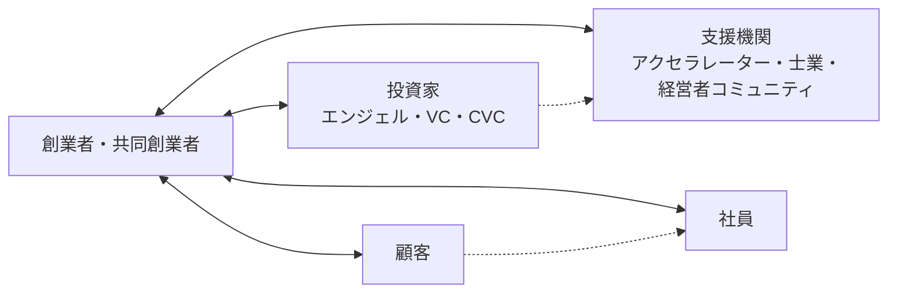
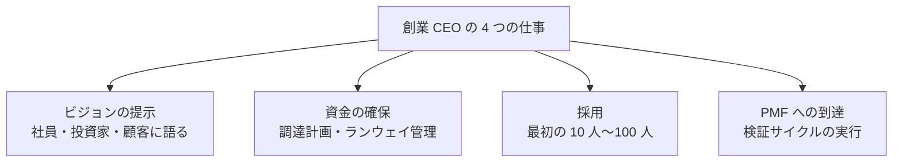
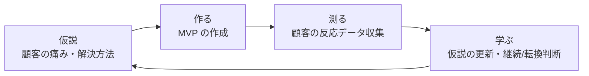
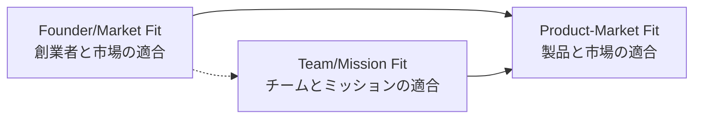
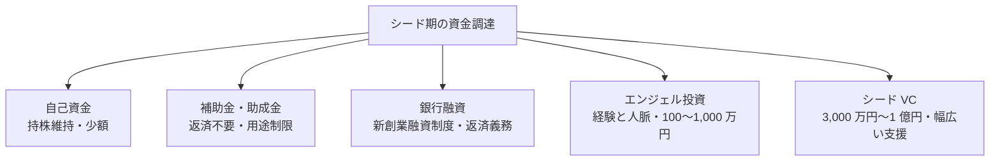
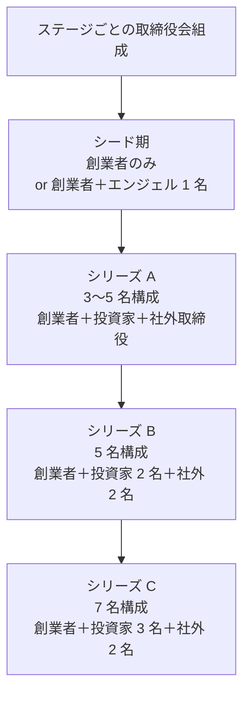
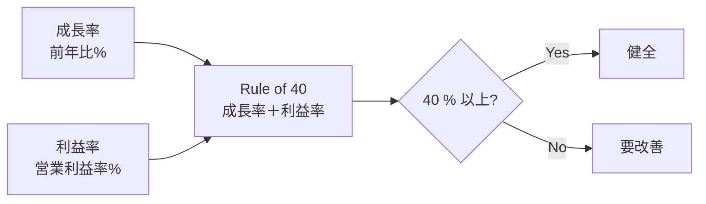

# スタートアップ起業入門

アイデア検証・法人設立・初期チーム・資金調達・KPI 管理——創業前〜創業 1 年目で迷う論点を 8 レッスンで体系化

| 項目 | 内容 |
|---|---|
| カテゴリー | 経営者・起業家 |
| 難易度 | 中級 |
| 所要時間 | 約200分（全8レッスン） |
| 公開日 | 2026-06-27 |
| 最終更新日 | 2026-06-27 |
| コースURL | https://skillup.college/courses/founder/startup-basics/ |

## 対象者

「これから創業する」または「創業して 1 年以内」の創業者・予定者を主軸とする。事業会社で起業を検討中の方、副業から本格起業を見据えている方、共同創業を考えている方、すでに法人を設立して立ち上げ初期の方、社内起業家として将来の独立を視野に入れる方を含む。業種を問わず、テクノロジー系・サービス系・モノ作り系のいずれの創業者にも有効。経営企画やコーポレート部門で創業者を支える立場の方が、創業者の景色を理解する目的でも受講できる。

## 前提知識

ビジネスパーソンとしての基礎経験（社会人 3 年以上を想定）。会計の基本（売上・利益・キャッシュフローの違いがわかる程度）と契約書の存在意義への理解があれば理解が早いが、これらの土台は本コース内で必要範囲を解説する。法律や税務の専門知識は不要で、創業者として「誰に何をいつ相談するか」の判断軸を身につける構成。

## 学習目標

- スタートアップとスモールビジネスの違いを理解し、自分の事業がどちらに当たるかを判断できる
- Lean Startup と PMF の原理に沿って、アイデアを顧客検証のサイクルに乗せられる
- 株式会社と合同会社の違い、創業者間契約とベスティングの意味を理解し、創業の手続きを進められる
- 共同創業者と初期社員 10 人をどう選び、どう報いるかの判断軸を持てる
- シード期の資金調達手段を選び、SAFE・J-KISS・優先株式・タームシートの主要条項を読める
- シリーズ A 以降のガバナンスと主要な投資家保護条項を理解し、投資家と対等に話せる
- バーンレート・ランウェイ・ユニット・エコノミクス・Rule of 40 など、スタートアップの数字を管理できる
- 出口戦略（IPO・M&A・継続経営）、ピボットと撤退の判断軸、創業者の孤独と継続のための仕組みを設計できる

## コース概要

スタートアップ起業は、特別な人だけのものではありません。一方で、会社員の働き方や中小企業の経営とは「別の生き物」として、独自の判断軸と仕組みを必要とします。本コースは、これから創業する方、創業して 1 年以内の方、副業から本格起業を見据えている方を主軸に、スタートアップ起業の入口に立つために必要な 8 レッスンを構成しました。スタートアップの定義と全体像、アイデア検証と PMF、法人設立と創業者間契約、初期チームの作り方、シード〜シリーズ A 以降の資金調達とガバナンス、バーンレートと KPI 管理、出口戦略とピボット・撤退、創業者の継続学習までを扱います。

## 学習の流れ

レッスン 1 でスタートアップとスモールビジネスの違い、エコシステムの全体地図、創業者の役割を整理します。レッスン 2 で「事業の前」の検証を扱い、Lean Startup と PMF の原理を学びます。レッスン 3 では「事業の入口」として法人設立と創業者間契約、ベスティングを扱います。レッスン 4 で初期チームの作り方を扱い、共同創業者と最初の 10 人をどう選びどう報いるかの判断軸を作ります。レッスン 5・6 で資金調達を 2 段階に分け、シード期の選択肢と SAFE・J-KISS・タームシート、シリーズ A 以降のガバナンスと投資家保護条項を順に学びます。レッスン 7 でバーンレートとランウェイ、ユニット・エコノミクス、Rule of 40 などスタートアップの数字管理を扱います。レッスン 8 で出口戦略とピボット・撤退、創業者の孤独と継続学習を扱い、創業の長距離走を続けるための土台を作ります。完成形の経営者を目指すコースではなく、最初の数年を生き延びるための判断軸を作るコースとして設計しています。

## レッスン一覧

| No. | タイトル | 概要 | 所要時間 |
|---|---|---|---|
| 1 | スタートアップとは何か——本コースの守備範囲と「会社員から創業者になる」とき | スタートアップとスモールビジネスの違い（成長前提・PMF・出口）、スタートアップ・エコシステムの全体地図（創業者・投資家・支援機関・顧客・社員）、日本のスタートアップ・エコシステムの現在地（2026 年 6 月時点、スタートアップ育成 5 か年計画、IPO 件数、資金調達総額）、創業者の役割（CEO の 4 つの仕事：ビジョン・資金・採用・PMF）、本コースの守備範囲と前提、スタートアップ起業に求められる 5 つの覚悟を学ぶ | 25分 |
| 2 | アイデアの検証と PMF——Lean Startup の原理 | 良いアイデアの 3 条件（深い顧客の痛み・解ける問題・大きな市場）、TAM/SAM/SOM の見積もり方、Lean Startup（Eric Ries 2011）と Build-Measure-Learn、MVP（Minimum Viable Product）の設計、Customer Discovery（Steve Blank 2003）と顧客インタビュー、Jobs to be Done（Clayton Christensen 2003）、PMF（Product-Market Fit、Marc Andreessen 2007）の判断指標、ピボットの 10 パターン（Ries）を学ぶ | 25分 |
| 3 | 創業の手続きと法人設立——会社員から「法人代表」になる | 個人事業と法人の違い、株式会社と合同会社の選択、定款・登記の流れ（公証人役場・法務局・電子定款）、資本金の決め方（資本金 100 万円問題と消費税免税）、株式の発行と種類株式（普通株式・優先株式）、創業時の株主構成と共同創業者間の持株比率、創業者間契約（Founders' Agreement）の重要性、ベスティング（Vesting）と Cliff、会社設立後の届出（税務署・年金事務所・労基署・自治体）を学ぶ | 25分 |
| 4 | 初期チーム作り——共同創業者と最初の 10 人 | 共同創業者の選び方（Why の共有・スキル補完・性格相性・関係性の歴史）、Reid Hoffman の Tribe 発想、共同創業者間のすれ違いと解消（Y Combinator の創業者問題データ）、初期採用（Hiring）の鉄則、初期社員にどう報いるか（ストックオプション、税制適格 SO の 2024 年改正）、1 号社員・5 号社員・10 号社員の質的違い、カルチャー設計の初期投資、Founder/Market Fit と Team/Mission Fit を学ぶ | 25分 |
| 5 | 資金調達①——シード期の選択肢とエクイティの基礎 | 自己資金（ブートストラップ）・補助金・銀行融資・エンジェル・VC の使い分け、日本政策金融公庫の新創業融資制度、エンジェル投資家とアクセラレーター（Y Combinator・Plug and Play・Open Network Lab・Onlab・ANRI・サイバーエージェント・キャピタル・MIRAISE）、シード VC のプロセスと期待値、バリュエーション（プレマネー・ポストマネー）、株式希薄化（ダイリューション）の考え方、種類株式・優先株式の基礎、J-KISS と SAFE（Simple Agreement for Future Equity）の違い、タームシート（Term Sheet）の主要項目を学ぶ | 25分 |
| 6 | 資金調達②——シリーズ A 以降とガバナンス | シリーズ A・B・C 以降の特徴と期待、リード投資家とフォロワー投資家、バリュエーションの作り方（DCF・コンプス・PSR・ARR 倍率）、主要な投資契約条項（優先分配権 Liquidation Preference・希薄化防止 Anti-dilution の Full Ratchet と Weighted Average・Drag Along・Tag Along・Pre-emptive Right・Information Rights）、取締役会の組成（社内取締役・投資家取締役・社外取締役）、株主間契約（Shareholders Agreement）の主要項目、ガバナンス・コードと上場準備、ベンチャーキャピタルとの付き合い方の 5 原則を学ぶ | 25分 |
| 7 | バーンレート・ランウェイ・KPI——スタートアップの数字管理 | バーンレート（Burn Rate）と Net Burn の違い、ランウェイ（Runway）の計算、ユニット・エコノミクス（CAC・LTV・LTV/CAC・Payback Period）、SaaS 系の KPI（MRR・ARR・NRR・GRR・Churn・Logo Churn）、Rule of 40（Growth + Profit Margin = 40%）、月次取締役会の進行と KPI ダッシュボード、計画と実績のギャップ管理、Pre-mortem（事前検視）による撤退ラインの設定を学ぶ | 25分 |
| 8 | 出口戦略・ピボット・創業者の継続学習 | 出口の選択肢（IPO・M&A・MBO・継続経営・廃業）、日本の IPO の最近の動向（東証グロース・プライム）と上場準備（J-SOX・内部統制・監査法人）、M&A の流れ（DD・バリュエーション・PMI）と最近の事例傾向、ピボットと撤退の判断基準（Pre-mortem の継続実行）、創業者の孤独とメンタル（YPO・EO・経営者コミュニティ・コーチング・配偶者・家族）、創業者交代（CEO→Chairman）のタイミング、第二創業・連続起業家としての成長、修了後の学習方向を学ぶ | 25分 |

---

## レッスン1：スタートアップとは何か——本コースの守備範囲と「会社員から創業者になる」とき

（所要時間：25分）

### このレッスンで学ぶこと

- スタートアップとスモールビジネスの違いと、自分の事業がどちらに当たるかの判断軸
- スタートアップ・エコシステムの全体地図（創業者・投資家・支援機関・顧客・社員）
- 日本のスタートアップ・エコシステムの現在地と「スタートアップ育成 5 か年計画」の影響
- 創業者の役割としての CEO の 4 つの仕事（ビジョン・資金・採用・PMF）
- 本コースの守備範囲と、スタートアップ起業に求められる 5 つの覚悟

---

### スタートアップとスモールビジネスは「別の生き物」である

「会社を作る」「事業を立ち上げる」という言葉でひとくくりにされますが、スタートアップとスモールビジネスは、設計の前提から目指す姿まで「別の生き物」です。両者の違いを最初に整理しないまま走り出すと、後から立ち止まることになります。

スモールビジネスは、創業者の生活と裁量を守るための事業形態です。地域の飲食店、街の士業事務所、小規模のコンサルティング会社、個人の制作スタジオなど、創業者の手の届く範囲で長期にわたって安定的に営まれる事業を指します。短期間で 10 倍、100 倍の規模を目指すことは前提とせず、創業者が現役のあいだ事業を続け、引退や承継で次の世代に渡すか閉じるかを選びます。資金は自己資金と銀行融資が中心で、株式の外部調達は通常行いません。

スタートアップは、これとはまったく異なる前提で設計される事業形態です。短期間（3〜10 年）で急成長することを目指し、エクイティ（株式）で外部資本を調達し、最終的に IPO（Initial Public Offering、新規株式公開）か M&A（合併・買収）といった「出口」で投資家にリターンを返すことを前提に設計されます。創業者は会社の創業時に大半の株式を保有しますが、資金調達のたびに自分の持株比率が薄まる（ダイリューションする）ことを受け入れます。

> **💡 ポイント**
> スタートアップは「大企業の縮小版」でも「拡大したスモールビジネス」でもありません。短期間の急成長と、エクイティ・ファイナンスと、出口前提の設計を 3 点セットで持つ事業形態です。

ポール・グレアム（Paul Graham、Y Combinator の創業者）は 2012 年の論考「Startup = Growth」で、スタートアップを「急成長するように設計された会社」と定義しました。「テクノロジーを使うこと」も「VC から出資を受けること」も「出口を目指すこと」も結果に過ぎず、本質は「急成長」だと述べています。グレアムの定義に従えば、急成長を前提に設計されていない事業はスタートアップではありません。

自分の事業がスタートアップとスモールビジネスのどちらに向くかは、以下の問いで仮判定できます。3 つ以上「はい」が並べば、スタートアップ寄りに設計する余地があります。

- 自分の事業は、3〜10 年で 10 倍以上の規模を目指せる市場機会があるか
- 1 人の顧客あたりに大きな投資ができ、規模拡大とともに 1 人あたりコストが下がる構造があるか
- 顧客を獲得するたびに事業の競争優位（データ、ネットワーク、ブランド、技術蓄積）が積み上がるか
- 外部資本を入れ、自分の持株比率を下げてでも、より大きな会社を作りたいか
- 5 〜 10 年後の出口（IPO や M&A）を想定して逆算した設計に違和感がないか

「いいえ」が 3 つ以上並ぶなら、スモールビジネスとして設計するほうが自然です。スモールビジネスの設計には、スタートアップとは異なる教科書（自己資本での成長、利益重視、地域マーケティング、後継者育成など）があります。本コースは「スタートアップとして設計する場合」に向けた教材であり、スモールビジネスの設計を否定するものではありません。

> **📝 補足**
> スモールビジネスからスタートアップへの移行は理論上可能ですが、初期の株主構成や設計思想が異なるため、後から軌道修正するコストが高くなります。創業時点でどちらを目指すかを意識的に選ぶことが、最初の重要な意思決定です。

---

### スタートアップ・エコシステムの全体地図

スタートアップは創業者 1 人で完結しません。創業者を取り巻く 5 つのプレーヤーが、それぞれ役割と動機を持って関わります。最初に全体地図を頭に入れておくと、後のレッスンで個別のプレーヤーを扱う際の理解が早まります。

第 1 のプレーヤーは創業者自身です。創業者は事業の意思決定をする責任を負い、後のレッスンで扱うように CEO の 4 つの仕事を担います。共同創業者（Co-founder）が複数いる場合は、創業時から持株比率と役割分担を明文化することが土台になります。これはレッスン 3・4 で詳しく扱います。

第 2 のプレーヤーは投資家です。投資家は事業の将来価値を見込んで資金を提供し、株式（または株式に転換できる証券）を受け取ります。投資家には、創業者の友人・親族・知人として個人で資金を入れる「エンジェル投資家」、複数の出資者から集めた資金を運用する「ベンチャーキャピタル（VC）」、自社の事業戦略の一環として投資する「事業会社の CVC（Corporate Venture Capital）」、政府系の「公的ファンド」など、複数の種類があります。これはレッスン 5・6 で扱います。

第 3 のプレーヤーは支援機関です。アクセラレーター（Y Combinator、Plug and Play、Open Network Lab、Onlab、サイバーエージェント・キャピタルなど）は、短期集中プログラムで創業期の事業設計と投資家ネットワークへの接続を支援します。インキュベーターはより長期に伴走します。ほかに、ベンチャー支援を専門にする弁護士・司法書士・公認会計士・税理士、メンタリングを行う YPO（Young Presidents' Organization）や EO（Entrepreneurs' Organization）といった経営者コミュニティも、ここに含まれます。

第 4 のプレーヤーは顧客です。スタートアップは「投資家のためにある会社」と誤解されがちですが、本質的には「顧客の痛みを解く会社」です。顧客の支払いと継続的な利用なしには、スタートアップは存続できません。レッスン 2 で扱う Customer Discovery と PMF は、創業者と顧客の関係を構造化する技術です。

第 5 のプレーヤーは社員です。創業者の 1 人だけで実行できる規模を超えた瞬間に、社員の採用が始まります。最初の数人は「採用される側がリスクを取る」関係であり、後の数十人とは質的に異なります。これはレッスン 4 で扱います。

図1：スタートアップ・エコシステムの全体地図。創業者を中心に、投資家・支援機関・顧客・社員の 4 つのプレーヤーが関わる

「投資家とどう向き合うか」と「顧客とどう向き合うか」は、創業者にとって異なる種類の難しさを持ちます。投資家との関係は数年単位の長期戦であり、顧客との関係は日次・週次の高速サイクルです。両方を同時に扱う体力が、創業者には求められます。

---

### 日本のスタートアップ・エコシステムの現在地

日本のスタートアップ環境は、2020 年代に大きく変化しました。創業前の方が「日本でスタートアップは難しい」というかつての言説のまま判断しないために、現在地を整理します。

INITIAL の「Japan Startup Finance」によれば、国内スタートアップの年間資金調達総額は、2013 年の約 800 億円規模から増加を続け、2022 年に約 9,500 億円規模でピークを記録し、2024 年は約 7,800 億円規模で推移しました（出典：[INITIAL「Japan Startup Finance 2024」](https://initial.inc/articles/japan-startup-finance-2024)）。リーマンショック後の沈滞期と比べると、市場は質的に異なる段階に入りました。

政策面では、政府が 2022 年 11 月に「スタートアップ育成 5 か年計画」を決定しました。同計画は、2027 年度までに国内スタートアップへの投資額を 10 兆円規模に引き上げ、ユニコーン（評価額 10 億ドル以上の未公開企業）を 100 社創出することを目標に掲げています（出典：[内閣官房「スタートアップ育成 5 か年計画」](https://www.cas.go.jp/jp/seisaku/atarashii_sihonsyugi/pdf/sjssyuyo.pdf)）。エンジェル税制の拡充、ストックオプション税制の改正、海外人材呼び込み、大企業との連携支援などが順次実施されています。

IPO 市場では、東京証券取引所が 2022 年 4 月に再編され、新興企業向け市場は「グロース市場」となりました。グロース市場への新規上場は年間 60〜80 社規模で推移しており、創業 7〜10 年での上場が標準的な道筋の一つです。一方で、近年は M&A による出口も増えており、買収側が大手事業会社や PE ファンド、海外企業など多様化しています。

> **📝 補足**
> 「ユニコーン」という言葉は 2013 年にベンチャーキャピタリストの Aileen Lee が造語したもので、評価額 10 億ドル以上の未公開企業を指します。日本では 2026 年 6 月時点で 10 社前後がユニコーンに該当しますが、評価額は変動するため厳密な数は時期によって変わります。

ただし、量的拡大は質的成功を保証しません。資金調達ラッシュの裏側で、シリーズ A の壁を超えられないスタートアップ、PMF 到達前にバーンレートが膨らんだスタートアップ、共同創業者間の対立で停滞するスタートアップは、毎年一定数発生します。本コースの目的は、創業者がこうした「定番の落とし穴」を回避する判断軸を持つことです。

---

### 創業者の役割——CEO の 4 つの仕事

スタートアップの創業者は、創業から数年間、CEO（Chief Executive Officer、最高経営責任者）として会社全体に責任を負います。チームが小さい初期は、創業者がプロダクト・営業・採用・経理まですべてに関わりますが、組織が成長すると徐々に役割を絞っていきます。

VC 業界では、創業 CEO の仕事を「4 つに絞れ」と言われます。Sequoia Capital のパートナーがよく語る整理に近く、私自身も投資先と話すときに 4 つに絞って議論します。

第 1 はビジョンの提示です。会社が何を実現しようとしているか、なぜそれが社会に必要か、5 年後・10 年後の景色はどうあるべきかを、社員・投資家・顧客に対して何度も語ります。ビジョンは初期メンバーが「給与だけでは説明できない理由」で参加し続ける根拠であり、投資家が「数字だけでは説明できない期待」を抱く根拠です。

第 2 は資金の確保です。スタートアップは、利益が出る前に支出が先行する事業形態であるため、資金調達は CEO の固有の仕事です。次のラウンドの調達計画、現在のランウェイ（残りの資金で運営できる期間）、緊急時のブリッジ調達の選択肢を、CEO は常に把握しておく必要があります。資金調達は CFO（Chief Financial Officer、最高財務責任者）を採用しても委ねきれず、最終的な投資家との対話は CEO 自身が担います。

第 3 は採用です。とくに最初の 10 人、シリーズ A 時点の 30 人、シリーズ B 時点の 100 人といった主要マイルストーンでは、創業者が候補者一人ひとりと直接対話し、口説きの場に立ちます。採用の質はカルチャーの質を決め、カルチャーの質はその後のすべてに波及します。これはレッスン 4 で詳しく扱います。

第 4 は PMF（Product-Market Fit、製品市場適合）への到達です。PMF は「顧客が事業を強く必要としている状態」を指し、達成までは「いつまで続くかわからない試行錯誤の期間」になります。CEO は、自社が PMF に到達したかをデータで判断し、未達なら検証サイクルを回し続けます。これはレッスン 2 で扱います。

図2：創業 CEO の 4 つの仕事。創業初期はこの 4 つに時間の 80 % 以上を割く設計が標準

「4 つ以外の仕事」は、できる限り共同創業者、初期社員、外部パートナー（弁護士・司法書士・公認会計士・税理士）に渡します。営業の最前線、プロダクト開発の現場、社内の HR 業務、経理の運用、広報のオペレーションまで CEO が抱え込むと、4 つの本業のどれかが破綻します。

> **⚠️ 注意**
> 「自分でやったほうが早い」は、創業初期に通用する一方で、組織が 10 人を超えると致命的な思考になります。CEO の時間は「4 つの仕事に投じる資源」と再定義し、その他はチームに渡す意識的な訓練が必要です。

---

### 本コースの守備範囲と前提

本コースは、創業前〜創業 1 年目を主軸に、スタートアップ起業の入口で迷う論点を 8 レッスンで扱います。具体的には次の 7 つの領域です。

- 事業の前提：スタートアップとスモールビジネスの違い、エコシステム、CEO の 4 つの仕事
- 事業の検証：Lean Startup、MVP、Customer Discovery、Jobs to be Done、PMF
- 法人の設立：株式会社と合同会社の選択、定款、登記、創業者間契約、ベスティング
- 初期チーム：共同創業者の選び方、最初の 10 人、ストックオプション、カルチャー
- 資金調達①：シード期の選択肢、SAFE・J-KISS・タームシート
- 資金調達②：シリーズ A 以降、主要な投資契約条項、ガバナンス
- 数字管理：バーンレート、ランウェイ、ユニット・エコノミクス、Rule of 40
- 出口戦略と継続：IPO・M&A・MBO・継続経営、ピボット・撤退、創業者の孤独

一方、本コースは以下の領域には踏み込みません。

- 業種特有の市場戦略（SaaS、ヘルスケア、フィンテック、ハードウェアなどの業種別ノウハウは、それぞれの業種専門の教材に譲ります）
- 個別の税務・法務の代理判断（税務・登記・契約書の最終判断は税理士・司法書士・弁護士の独占業務であり、本コースは「誰に何をいつ相談するか」の判断軸を作るに留めます）
- ピッチデックの具体的なスライド設計や個別の VC との交渉戦術（基本構造は触れますが、テンプレートの提供は行いません）
- スタートアップ M&A の DD（デューデリジェンス）実務や PMI（買収後統合）の詳細
- 上場準備の実務（J-SOX、IFRS、監査法人対応など）の細部

これらは、創業者として一定の段階に到達してから、当該分野の専門書や専門家、コミュニティで深掘りする領域です。本コースは「入口の地図」として位置づけ、必要に応じて専門家への接続を案内します。

> **🔰 初学者の方へ**
> 「スタートアップは難しそう、自分にできるだろうか」と感じる方もいらっしゃると思います。しかし、創業者の多くは、最初は素人です。私自身、1 社目を共同創業したとき、定款の意味も種類株式の意味も知らないままスタートしました。本コースで扱う知識は「あれば早く立ち上がれる」というもので、知らないからといって創業できないわけではありません。学びながら走り、走りながら学ぶ姿勢で読み進めてください。

---

### スタートアップ起業に求められる 5 つの覚悟

最後に、創業前に確認しておきたい 5 つの覚悟について述べます。これは精神論ではなく、創業後に立ち止まる場面を減らすための事前の意思決定です。

第 1 は、長期戦の覚悟です。スタートアップは平均して、創業から出口（IPO や M&A）まで 7〜10 年かかります。途中で何度もピボット、共同創業者の離脱、主要メンバーの退職、資金枯渇の危機、市場環境の急変が起こります。3 年や 5 年で結果が出ないことを「失敗」と感じない時間軸の設計が必要です。

第 2 は、所得低下の覚悟です。創業初期の数年間、創業者の給与は前職の半分から 3 分の 1 程度に下がることが一般的です。会社員時代の生活水準を維持しようとすると、創業者の貯蓄が早期に枯渇し、私生活のストレスが事業に波及します。家族と合意した上で、生活水準を意識的に下げる準備が現実的に必要です。

第 3 は、ダイリューションの覚悟です。創業時に 100 % 保有していた株式は、シード調達で 80 % 前後、シリーズ A で 65 % 前後、シリーズ B で 50 % 前後、IPO 時には 20〜30 % 程度に薄まるのが一般的です（事業のステージや調達額により大きく変動します）。「自分の会社」という所有感覚と、現実の持株比率はずれていきます。これを受け入れられないと、資金調達のたびに葛藤します。

第 4 は、孤独の覚悟です。創業者は、意思決定の最終責任を負う立場にあるため、社員にも投資家にも家族にも完全には共有できない悩みを抱えます。創業者の孤独は健康問題に直結するため、後のレッスン 8 で扱う仕組み化（経営者コミュニティ、コーチング、メンター）が不可欠です。

第 5 は、失敗の覚悟です。スタートアップの失敗確率は、ステージや定義によって異なりますが、シード調達後に IPO までたどり着く企業の比率は 5〜10 % 程度というのが業界の共有認識です。失敗は前提として設計し、失敗時の生活防衛、社員への責任、投資家への説明をどう設計するかを、創業前に考えておきます。

> **💡 ポイント**
> 5 つの覚悟は「成功する人だけの特性」ではなく、「事前に意識化することで困難に備える項目」です。覚悟ができていないから創業すべきでない、という話ではなく、覚悟を意識的に持つことで困難の最中に立ち止まれるという話です。

---

### まとめ

このレッスンでは、以下のことを学びました。

- スタートアップとスモールビジネスは別の生き物で、急成長・エクイティ・出口の 3 点セットで区別される
- スタートアップ・エコシステムは創業者・投資家・支援機関・顧客・社員の 5 つのプレーヤーで成り立つ
- 日本のスタートアップ環境は 2020 年代に大きく変化し、政府の「スタートアップ育成 5 か年計画」が後押ししている
- 創業 CEO の仕事は「ビジョン・資金・採用・PMF」の 4 つに絞られる
- 本コースは創業前〜創業 1 年目を主軸に、入口で迷う 7 つの領域を扱う
- スタートアップ起業には 5 つの覚悟（長期戦・所得低下・ダイリューション・孤独・失敗）が必要

次のレッスンでは、創業の最初の関門である「アイデアの検証」を扱います。Lean Startup の原理、MVP、Customer Discovery、Jobs to be Done、PMF の判断指標、ピボットの 10 パターンを順に学びます。

---

### 確認クイズ

このレッスンの理解度をチェックしましょう。

#### Q1. スタートアップとスモールビジネスの違いについて、最も適切な説明はどれですか？

- [x] スタートアップは短期間の急成長とエクイティ・ファイナンスと出口前提を 3 点セットで持つ事業形態
- [ ] スタートアップは IT を使う会社、スモールビジネスは IT を使わない会社
- [ ] スタートアップは社員 10 人以上、スモールビジネスは社員 10 人未満の会社
- [ ] スタートアップは赤字でも続ける会社、スモールビジネスは黒字を必須とする会社

> **解説**
> スタートアップは「急成長を前提に設計される事業形態」であり、エクイティでの外部資本調達と IPO や M&A での出口を前提とします。テクノロジーの利用や社員数、赤字／黒字は本質的な区別ではありません。Paul Graham は 2012 年の論考で「Startup = Growth」と定義しています。

#### Q2. スタートアップ・エコシステムの 5 つのプレーヤーとして、本レッスンで挙げたものはどれですか？

- [ ] 創業者・株主・国家・顧客・社員
- [x] 創業者・投資家・支援機関・顧客・社員
- [ ] 創業者・CFO・社外取締役・顧客・社員
- [ ] 創業者・親族・銀行・顧客・社員

> **解説**
> 本レッスンでは、創業者を中心に投資家（エンジェル・VC・CVC）、支援機関（アクセラレーター・士業・経営者コミュニティ）、顧客、社員の 5 つを挙げました。投資家と顧客はどちらも創業者の時間を取る存在ですが、関係の時間軸（投資家は数年単位、顧客は日次・週次）が異なります。

#### Q3. 「スタートアップ育成 5 か年計画」について、本レッスンの説明と合致するものはどれですか？

- [x] 2022 年 11 月に政府が決定し、2027 年度までに投資額 10 兆円規模とユニコーン 100 社創出を目標にした計画
- [ ] 2015 年に経済産業省が単独で決定したベンチャー支援策
- [ ] 上場済みスタートアップを対象に税制優遇を行う制度
- [ ] スタートアップに対する銀行融資を国が肩代わりする保証制度

> **解説**
> スタートアップ育成 5 か年計画は、2022 年 11 月に政府（内閣官房）が決定したもので、2027 年度までに投資額 10 兆円規模、ユニコーン 100 社創出が主要目標です。エンジェル税制の拡充やストックオプション税制の改正など、複数の施策が順次実施されています。

#### Q4. 創業 CEO の「4 つの仕事」として本レッスンで挙げたものはどれですか？

- [ ] 営業・マーケティング・採用・経理
- [ ] プロダクト開発・営業・顧客対応・採用
- [x] ビジョンの提示・資金の確保・採用・PMF への到達
- [ ] 取締役会対応・株主対応・社員対応・顧客対応

> **解説**
> 創業 CEO の 4 つの仕事は、ビジョンの提示、資金の確保、採用、PMF への到達です。「4 つ以外の仕事」は、共同創業者、初期社員、外部パートナーに渡すのが原則です。これらは Sequoia Capital など主要 VC で共有される整理の一つです。

#### Q5. 本コースの守備範囲として、本レッスンで「踏み込まない」と明示した領域はどれですか？

- [ ] スタートアップとスモールビジネスの違い
- [ ] 株式会社と合同会社の選択
- [ ] 出口戦略の選択肢（IPO・M&A・MBO・継続経営）
- [x] 業種特有の市場戦略（SaaS、ヘルスケア、フィンテックなど業種別ノウハウ）

> **解説**
> 本コースは「入口の地図」として位置づけ、業種特有の市場戦略は扱いません。ほかに、個別の税務・法務の代理判断、ピッチデックの具体設計、M&A の DD/PMI 実務、上場準備の細部も扱いません。これらは創業者として一定の段階に到達してから、専門書・専門家・コミュニティで深掘りする領域です。

#### Q6. 「スタートアップ起業に求められる 5 つの覚悟」のうち、本レッスンで挙げたものはどれですか？

- [ ] 長期戦・利益重視・株式集中・孤独・成功
- [ ] 短期決戦・所得維持・株式集中・社員ファースト・失敗
- [x] 長期戦・所得低下・ダイリューション・孤独・失敗
- [ ] 中期戦・所得維持・ダイリューション・透明性・改善

> **解説**
> 5 つの覚悟は、長期戦（出口まで 7〜10 年）、所得低下（給与は前職の半分〜3 分の 1 程度）、ダイリューション（持株比率の低下）、孤独（最終意思決定者の重さ）、失敗（IPO 到達率は 5〜10 % 程度）です。これらは精神論ではなく、創業後に立ち止まる場面を減らすための事前の意思決定として位置づけられます。

---

## レッスン2：アイデアの検証と PMF——Lean Startup の原理

（所要時間：25分）

### このレッスンで学ぶこと

- 良いスタートアップ・アイデアの 3 条件と、TAM/SAM/SOM の見積もり方
- Lean Startup の Build-Measure-Learn サイクルと MVP の設計
- Customer Discovery と顧客インタビューの作法
- Jobs to be Done が示す「顧客が雇うのは製品でなく仕事」の発想
- PMF（Product-Market Fit）の判断指標とピボットの 10 パターン

---

前回のレッスンでは、スタートアップとスモールビジネスの違い、エコシステム、創業 CEO の 4 つの仕事を扱いました。今回は CEO の 4 つの仕事のうち「PMF への到達」に焦点を当て、創業初期に最も時間を割く活動である「アイデアの検証」を扱います。

### 良いアイデアの 3 条件

スタートアップのアイデアは「思いつくこと」と「事業として成立すること」のあいだに大きな谷があります。私が VC として年間 200〜300 件のピッチを受ける中で、アイデアそのものの新規性で勝負を決めるピッチは少なく、むしろ「条件をいくつ満たすか」で議論が深まるピッチが残ります。良いアイデアには 3 つの条件があります。

第 1 の条件は、深い顧客の痛みがあることです。誰の、どんな場面の、どれくらい強い痛みを解こうとしているのか。痛みが浅いと、顧客は「あったらいいけど、なくても困らない」と感じ、購入の意思決定に至りません。「Nice to have」と「Must have」の境目は、顧客の痛みの深さによって決まります。Y Combinator の創業者 Paul Graham は、「自分が欲しいものを作れ（Make something people want）」をスタートアップの最初の原則として掲げ続けてきました。

第 2 の条件は、解ける問題であることです。市場に大きな痛みがあっても、技術的・法規制的・経済的に解けない問題は、スタートアップの土俵ではありません。「いつかは解ける」では資金が尽きます。「今、自分の手元のリソースで、3〜5 年以内に解ける見通しがある」ことが、起業のスタート地点になります。

第 3 の条件は、大きな市場があることです。痛みが深く、解ける問題でも、その問題を抱える顧客の総数や支出可能額が小さいと、スタートアップとしての急成長に乗りません。一方、巨大すぎる市場（既存大手が支配的なシェアを持つ領域）は、競争で消耗します。「ニッチに見えて、隣接領域に拡張できる市場」が、スタートアップに向く市場です。

> **💡 ポイント**
> アイデアの新規性だけでは事業は成立しません。深い痛み、解ける問題、大きな市場の 3 条件を同時に満たしているかが、創業前に確認すべき問いです。

3 条件は単独で満たすだけでは不十分で、3 つすべてが揃って初めて事業の入口に立てます。例えば、痛みが深くて市場が大きくても、現在の技術では解けない問題は、研究テーマでありスタートアップではありません。逆に、解ける問題で市場も大きくても、痛みが浅ければ顧客は支払いません。

---

### TAM/SAM/SOM——市場規模の見積もり方

市場の大きさは「TAM・SAM・SOM」という 3 つの層で整理されます。投資家とのピッチでは必ず聞かれる項目で、創業前に自分の事業の市場を分解できる力が必要です。

TAM（Total Addressable Market、総獲得可能市場）は、自社の製品やサービスが解決する問題を抱える、世界全体の顧客の総数と支出額です。理論上の最大値で、実現可能性は問いません。

SAM（Serviceable Available Market、サービス提供可能市場）は、TAM のうち、自社の事業モデル・地理・言語・規制で実際に対応できる範囲です。例えば、日本国内向けにサービス展開するなら、TAM が世界 100 億ドルでも SAM は日本市場の 5 億ドルといった具合に絞られます。

SOM（Serviceable Obtainable Market、獲得可能市場）は、SAM のうち、自社が短期（3〜5 年）で現実的に獲得できるシェアを掛けたものです。「シェア 10 % を取れる」と言うなら、その根拠（販路、競合の状況、自社の優位性）を投資家に説明できる必要があります。

> **📝 補足**
> TAM/SAM/SOM の数字は、Bottom-up（顧客数 × 単価）と Top-down（市場全体の調査レポート）の 2 通りで見積もり、両方を提示すると説得力が増します。投資家は「数字の妥当性」よりも「数字をどう作ったか」を見ています。

新規市場（誰も解いていない問題）の場合、TAM の見積もりは難しくなります。代替手段（既存の不便な解決法、人手による解決法）の市場規模から推計するか、類似市場の規模から逆算する方法が一般的です。「市場規模は推計が難しいが、顧客の痛みは深い」というケースは、市場規模を控えめに見積もり、痛みの深さで補強する説明が現実的です。

---

### Lean Startup と Build-Measure-Learn サイクル

「アイデアを思いついたら、まず作ってリリースし、顧客の反応を見て改善する」という発想は、2010 年代に一般化しました。中心にある考え方が、Eric Ries が 2011 年に発表した『The Lean Startup』（邦題『リーン・スタートアップ』）です。

Lean Startup の中核は、Build-Measure-Learn（作る・測る・学ぶ）の循環サイクルです。創業者は、不確実な仮説を最小限のコストで検証するために、製品の小さな版を作り（Build）、顧客の反応を測り（Measure）、結果から学んで仮説を更新する（Learn）。サイクルを高速で回すほど、限られた資金で多くの検証を回せます。

図1：Build-Measure-Learn サイクル。仮説の更新が次のサイクルの起点になる

このサイクルが従来の事業計画と異なるのは、「最初に書いた計画通りに進めない」ことを前提にしている点です。Lean Startup 以前の事業開発は、市場調査と事業計画を 3 〜 6 ヶ月かけて作り、計画通りに開発・販売することを良しとしていました。しかし、創業前に書ける計画は、創業後に集まる現実の顧客の反応によって、ほぼ確実に書き直されます。Ries は「計画は仮説の集合体で、検証されるべきものだ」という発想に転換しました。

サイクルを早く回す技術が、MVP の設計です。

---

### MVP——最小限で価値を試す製品

MVP（Minimum Viable Product、実用最小限の製品）は、Lean Startup の中核概念です。「顧客の検証に必要な最小限の機能だけを持った製品」を指し、完成品ではありません。

MVP の目的は 1 つです。「顧客が、自分の痛みを解くために、対価を払ってくれるか」を確かめること。この問いに答えるのに不要な機能は、すべて MVP から削ぎ落とします。

MVP の代表的な形式は次の 4 つです。

- ランディングページ MVP：製品の説明と購入ボタン（実際の機能はまだ存在しない）を 1 ページのウェブサイトに掲載し、訪問者の反応とサインアップ率を測る
- コンシェルジュ MVP：自動化された製品の代わりに、創業者自身が手動で顧客の依頼を処理する。「製品が動いているように見せる」が、裏側は人手
- Wizard of Oz MVP：顧客側からは自動化された製品に見えるが、裏側で人が動かしている。Zappos の創業初期がこの形式で知られる
- 単機能 MVP：複数機能を持つ製品の構想のうち、最も価値の中核と仮説したい 1 機能だけを実装

「機能が少なくて恥ずかしい」と感じる創業者は多いですが、MVP は完成品ではなく検証ツールです。Ries は「MVP は、それを見た顧客のうち最も早い少数（アーリーアダプター）が使ってくれる最小限の機能セット」と定義しました。アーリーアダプターは、不完全な製品に対しても価値を見いだす顧客層であり、創業期の協力者として位置づけます。

> **⚠️ 注意**
> MVP は「品質が低い製品」ではなく「機能が最小限の製品」です。少ない機能を、検証に必要な品質で実装します。MVP の名のもとに低品質な製品を出すと、顧客の不信を招き、本来検証したかった仮説の判断ができなくなります。

---

### Customer Discovery と顧客インタビュー

MVP を作る前に、創業者が必ず行うべき活動が顧客インタビューです。Steve Blank が 2003 年に体系化した「Customer Discovery（顧客発見）」プロセスは、創業者自身が想定顧客と直接対話して、痛みの存在と深さを確かめる手法です。Blank は『The Four Steps to the Epiphany』（2003 年）で、製品開発に先立つ顧客発見の重要性を説きました。

Customer Discovery の中核は「Get out of the building（建物の外に出ろ）」というスローガンです。創業者は、オフィスの中で資料を読み続けるのではなく、想定顧客の現場に出向き、顧客の言葉で痛みを聞く必要があります。

顧客インタビューには作法があります。次の 4 点を守ると、創業者バイアスの影響を抑えられます。

- 製品を売り込まない：インタビューは販売の場ではなく、学習の場です。製品の説明は最後まで控え、顧客の現在の課題と行動を聞きます
- 現在と過去を聞き、未来は聞かない：「これがあったら買いますか」は答えにならない問いです。「過去 30 日で同じ課題に遭遇しましたか」「そのとき、どう対処しましたか」と聞きます
- オープン・クエスチョンを使う：「はい／いいえ」で終わる問いではなく、「どんな状況で」「なぜそうしたか」「次に何をしたか」と展開できる問いを設計します
- 沈黙を許す：相手が考える時間を奪わない。質問のあと、答えが来るまで 5 秒待つ訓練が、深い回答を引き出します

Rob Fitzpatrick は『The Mom Test』（2013 年）で、「自分の母親に聞いても本当の評価がもらえない問いを避けよう」と提案しました。具体的には、「この商品どう思う？」のような抽象的な問いではなく、「最後に同じ問題で困ったのはいつ？」のような事実ベースの問いを設計します。

顧客インタビューは、創業前から創業後 1 年程度まで、最低 30〜50 件は実施するのが目安です。私が VC として投資判断するときも、「何人の顧客と直接話したか」を必ず聞きます。30 件未満の段階でアイデアの確信を持てる創業者は、ほとんどいません。

---

### Jobs to be Done——顧客が雇うのは製品でなく仕事

Customer Discovery と並んで、創業者が早期に身につけたい発想が Jobs to be Done（JTBD、ジョブ理論）です。ハーバード・ビジネス・スクールの Clayton Christensen が 2003 年に発表し、2016 年の『Competing Against Luck』（邦題『ジョブ理論』）で体系化しました。

JTBD の中核命題は、「顧客は製品を買うのではなく、自分のジョブ（やりたいこと、なし遂げたい進歩）を達成するために製品を雇う」というものです。Christensen は、ミルクシェイクの事例で広く知られる説明をしました。マクドナルドがミルクシェイクの売上を伸ばそうと顧客調査を重ねたが効果が出なかった。実際に売り場に立って観察すると、朝の時間帯のミルクシェイク購入者は「車での通勤時間に、片手で持てて、お腹がもち、退屈しのぎになるもの」を求めていた。同じ顧客が午後に同じ店に来ても、ミルクシェイクは買わない。ジョブが違うからだ——という発想です。

JTBD の発想で創業者が変えるべきは、市場の定義の仕方です。「飲料市場」ではなく「朝の通勤時のジョブ市場」、「ノートアプリ市場」ではなく「会議の意思決定を後から思い出すジョブ市場」と定義します。すると、競合は同じカテゴリの製品ではなく、同じジョブを別の方法で果たしている代替手段（コーヒー、エナジーバー、コンビニのおにぎり、紙のメモ）になります。

> **💡 ポイント**
> 顧客は製品を買うのではなく、ジョブを達成するために製品を雇います。競合は「同じカテゴリの製品」ではなく「同じジョブを果たす代替手段」です。

JTBD の発想は、顧客インタビューの設計にも影響します。「あなたはこの製品をどう使いますか」ではなく、「あなたが達成したいジョブは何ですか、今はどう果たしていますか、何が不満ですか」と聞くようになります。

---

### PMF——Product-Market Fit の判断指標

スタートアップが「PMF に達した」とは、何を持って判断するのか。これは創業者が直面する難問の一つです。PMF の概念は、Netscape 創業者で Andreessen Horowitz 共同創業者の Marc Andreessen が、2007 年のブログ記事「The only thing that matters」で提示しました。Andreessen は「PMF は、いい市場にいて、いい市場を満足させる製品が揃っていることだ」と簡潔に定義し、「PMF 前のスタートアップはあらゆることが失敗に見え、PMF 後はあらゆることがうまく回り始める」という観察を加えました。

PMF の判断は、数値ではなく「体感」だ、という見方もあります。Andreessen は「顧客が押し寄せ、サーバーが落ち、採用が追いつかない状態」を PMF の兆候として挙げました。しかし、体感だけに頼ると判断を誤るため、補助的な指標がいくつか提案されています。

最も広く参照されるのが、Sean Ellis が提唱した「Sean Ellis Test」です。顧客に「もしこの製品が今後使えなくなったら、どう感じますか」と尋ね、「非常に残念」と答える顧客が 40 % 以上なら PMF の目安、と Ellis は提示しました。Ellis 自身は Dropbox や LogMeIn の成長を支えた実務家で、40 % という閾値も実地の経験から出てきた数字です。

SaaS（Software as a Service、ソフトウェア・アズ・ア・サービス、定期課金型ソフトウェア）のスタートアップでは、ほかにも次の指標が PMF の参考になります。

- ネット・リテンション（NRR、Net Revenue Retention、既存顧客の継続収益）が 120 % を超える
- 解約率（Churn）が月次 5 % 未満（年次で 60 % 未満）
- オーガニックな新規流入（口コミ、紹介）が新規顧客の 30 % 以上を占める
- 営業活動を止めても新規問い合わせが続く

これらの数字は事業モデルや顧客層によって妥当な水準が変わるため、絶対の基準にはなりません。複数指標を並べて、トレンドが上向きかを継続的に観察するのが現実的です。

> **📝 補足**
> PMF は到達したら終わりではなく、市場や競合の変化で失われることがあります。PMF を保ち続けるための継続的な検証が、PMF 後の事業のテーマになります。

---

### ピボットの 10 パターン

検証を続けても PMF が見えないとき、創業者は「ピボット（事業の軸足転換）」を検討します。ピボットは「失敗」ではなく、Lean Startup の発想では「学習の結果として方向を変える正当な選択」です。Eric Ries は『The Lean Startup』で、ピボットを 10 のパターンに整理しました。

- ズームイン・ピボット：1 つの機能を全体の製品に拡大する
- ズームアウト・ピボット：製品全体を 1 つの機能として、より大きな製品に組み込む
- 顧客セグメント・ピボット：製品はそのまま、ターゲット顧客を変更する
- 顧客ニーズ・ピボット：同じ顧客の異なる痛みを解く製品に変更する
- プラットフォーム・ピボット：アプリケーションからプラットフォームに（またはその逆）変更する
- ビジネス・アーキテクチャ・ピボット：B2B から B2C へ（またはその逆）変更する
- 価値の獲得方法・ピボット：収益モデル（サブスク、買い切り、広告、フリーミアム）を変更する
- 成長エンジン・ピボット：成長の源泉（ウイルス、有料広告、定着）を変更する
- チャネル・ピボット：販売経路（直販、代理店、SaaS、店頭）を変更する
- 技術ピボット：同じ問題を異なる技術で解く

ピボットの判断基準は、「現在の方向で 3〜6 ヶ月間検証を続けても、PMF の兆候が見えないとき」が一つの目安です。一方、ピボットを繰り返しすぎると、創業者・社員・投資家の信頼が消耗するため、「次のピボットがあと何回打てるか」を意識して使います。私の経験では、シード期に 1〜2 回、シリーズ A 前に 0〜1 回が現実的な範囲です。

---

### まとめ

このレッスンでは、以下のことを学びました。

- 良いアイデアの 3 条件は、深い顧客の痛み・解ける問題・大きな市場
- TAM/SAM/SOM の 3 層で市場規模を分解し、Bottom-up と Top-down の両面で見積もる
- Lean Startup の Build-Measure-Learn サイクルが、検証の高速回転を支える
- MVP は完成品ではなく検証ツールで、ランディングページ・コンシェルジュ・Wizard of Oz・単機能の 4 形式がある
- Customer Discovery では「Get out of the building」を実践し、現在と過去を聞く
- Jobs to be Done の発想で、顧客は製品でなくジョブを雇うと捉える
- PMF は Sean Ellis Test の 40 % が一つの目安で、SaaS では NRR・Churn・オーガニック流入も参考になる
- ピボットには 10 のパターンがあり、シード期に 1〜2 回が現実的な範囲

次のレッスンでは、アイデアの検証と並行して進む「法人設立と創業者間契約」を扱います。株式会社と合同会社の選択、定款・登記の流れ、創業者間の持株比率、ベスティングなど、創業初期の意思決定を順に学びます。

---

### 確認クイズ

このレッスンの理解度をチェックしましょう。

#### Q1. 良いスタートアップ・アイデアの 3 条件として、本レッスンで挙げたものはどれですか？

- [ ] 新規性が高い・競合がいない・流行に乗っている
- [ ] 創業者が好きである・自己資金で始められる・3 年で黒字化できる
- [x] 深い顧客の痛みがある・解ける問題である・大きな市場がある
- [ ] テクノロジーを使う・SaaS モデルで提供できる・グローバル展開が可能

> **解説**
> 3 条件は、深い顧客の痛み・解ける問題・大きな市場です。新規性や流行は本質的な条件ではなく、3 条件を満たした上で「いま参入する理由」を補強する要素です。Paul Graham は「自分が欲しいものを作れ」を一貫して説いています。

#### Q2. TAM/SAM/SOM のうち、SAM の説明として正しいものはどれですか？

- [ ] 自社の製品が解決する問題を抱える、世界全体の顧客の総数と支出額
- [x] TAM のうち、自社の事業モデル・地理・言語・規制で実際に対応できる範囲
- [ ] SAM のうち、自社が短期で現実的に獲得できるシェアを掛けたもの
- [ ] 競合の売上を合算した数字

> **解説**
> TAM が「理論上の最大値」、SAM が「自社が事業モデル・地理などで対応できる範囲」、SOM が「短期で獲得できる現実値」です。例えば日本国内向けサービスなら、TAM が世界 100 億ドルでも SAM は日本市場の 5 億ドルといった具合に絞られます。

#### Q3. Lean Startup の Build-Measure-Learn サイクルの順序として正しいものはどれですか？

- [ ] 学ぶ → 測る → 作る
- [ ] 測る → 作る → 学ぶ
- [ ] 作る → 学ぶ → 測る
- [x] 作る → 測る → 学ぶ → （仮説更新）→ 作る

> **解説**
> Build-Measure-Learn は「作る・測る・学ぶ」の循環で、学びの結果が仮説を更新し、次のサイクルの起点になります。Eric Ries が 2011 年の『The Lean Startup』で体系化した中核概念です。

#### Q4. MVP の代表的な形式として、本レッスンで挙げたものはどれですか？

- [ ] ベータ版 MVP・正式版 MVP・サポート版 MVP・廉価版 MVP
- [ ] 機能完全 MVP・機能拡張 MVP・機能特化 MVP・機能融合 MVP
- [x] ランディングページ MVP・コンシェルジュ MVP・Wizard of Oz MVP・単機能 MVP
- [ ] 試作 MVP・量産 MVP・改良 MVP・最終 MVP

> **解説**
> 代表的な 4 形式は、ランディングページ MVP、コンシェルジュ MVP（手動処理）、Wizard of Oz MVP（顧客には自動に見えるが裏側は人手）、単機能 MVP です。MVP は「品質が低い製品」ではなく「機能が最小限の製品」で、検証に必要な品質は確保します。

#### Q5. Customer Discovery における顧客インタビューの作法として、本レッスンで「避けるべき」と挙げたものはどれですか？

- [x] 「これがあったら買いますか」のような未来の意思決定を聞く
- [ ] 「過去 30 日で同じ課題に遭遇しましたか」と過去の事実を聞く
- [ ] 「そのとき、どう対処しましたか」と行動を聞く
- [ ] オープン・クエスチョンで現在の課題と行動を引き出す

> **解説**
> 「これがあったら買いますか」は答えにならない問いです。顧客は未来の意思決定を正確に予測できないため、現在と過去の事実ベースの問いを使います。Rob Fitzpatrick の『The Mom Test』が同じ発想を体系化しています。

#### Q6. PMF の判断指標として、本レッスンで挙げた Sean Ellis Test の目安はどれですか？

- [ ] 顧客の月次解約率が 10 % 未満
- [x] 「もし使えなくなったら非常に残念」と答える顧客が 40 % 以上
- [ ] NRR が 100 % を超える
- [ ] 月次の有料顧客数が 50 件を超える

> **解説**
> Sean Ellis Test は、顧客に「もしこの製品が今後使えなくなったら、どう感じますか」と尋ね、「非常に残念」が 40 % 以上を PMF の目安とします。絶対の基準ではなく、複数指標と組み合わせて継続観察するのが現実的です。

---

## レッスン3：創業の手続きと法人設立——会社員から「法人代表」になる

（所要時間：25分）

### このレッスンで学ぶこと

- 個人事業と法人の違いと、スタートアップが法人を選ぶ理由
- 株式会社と合同会社の違いと選択の基準
- 定款・登記の流れと、創業時の資本金の決め方
- 創業時の株式・株主構成と、創業者間契約・ベスティングの意味
- 会社設立後に必要な届出（税務署・年金事務所・労基署・自治体）

---

前回のレッスンでは、アイデアの検証と PMF を扱いました。今回は、検証と並行して進める「法人設立」を扱います。会社員から「法人代表」になるための手続きと、後戻りが効きにくい初期の意思決定を順に学びます。

### 個人事業と法人の違い

事業を始めるとき、最初に選ぶのが「個人事業として始めるか、法人を設立するか」です。スタートアップは原則として法人で始めるのが標準的ですが、なぜそうなのかを理解しておくと、後の判断軸が安定します。

個人事業は、開業届を税務署に提出するだけで始められ、設立費用がほぼかかりません。会計処理もシンプルで、運営の柔軟性も高い形態です。一方で、事業の負債は無限責任で個人にかかり、株式を発行できないため外部からのエクイティ・ファイナンスは原則できません。スモールビジネスとして始めて利益を出すには向きますが、スタートアップとしての外部資本調達には適しません。

法人は、株式や持分の発行により所有と経営を分離できる組織形態です。設立に費用と手続きがかかり、会計処理も複式簿記が必須で運営の負担が増えますが、有限責任となり、エクイティ・ファイナンスが可能で、対外信用も得やすくなります。スタートアップが外部資本を調達して急成長を目指すなら、法人格は前提条件です。

> **💡 ポイント**
> スタートアップは法人を選びます。理由は、有限責任、エクイティ・ファイナンス、対外信用、ストックオプションの発行、出口戦略（IPO や M&A）への接続のすべてが法人を前提にしているためです。

副業として小さく始めて反応を見たいなら、最初は個人事業で 1〜2 年やり、本格化のタイミングで法人化（法人成り）する道もあります。ただし、株主との関係や創業者間契約を後付けで整える手間が増えるため、共同創業者がいる場合や 1 年以内に外部資本調達を見込む場合は、最初から法人を選ぶのが現実的です。

---

### 株式会社と合同会社の選択

法人を選ぶと決めたあと、次の選択肢が「株式会社」と「合同会社」です。日本の会社法は 2006 年の改正で合同会社を導入し、以来、設立コストの低さから合同会社を選ぶスタートアップも増えました。両者の違いを整理します。

株式会社は、株式を発行して資金を集め、株主が出資者として所有し、取締役が経営を担う形態です。所有と経営の分離が制度的に確立しており、外部からの資金調達、ストックオプションの発行、株式の譲渡が標準的にできます。設立費用は登録免許税 15 万円（資本金の 1,000 分の 7 が 15 万円を超える場合はその額）、定款認証費用 3〜5 万円（資本金額により段階制）、収入印紙 4 万円（電子定款の場合は不要）など、おおむね 25 万円前後が必要です。

合同会社は、出資者が経営も担う形態（出資者＝社員）で、株式を発行しません。設立費用は登録免許税 6 万円、定款認証は不要、収入印紙 4 万円（電子定款の場合は不要）で、おおむね 10 万円前後とコストが低くなります。一方で、株式発行ができないため VC からのエクイティ調達ができず、ストックオプション制度も使えません。

スタートアップで VC 調達を視野に入れるなら、最初から株式会社を選ぶのが原則です。「最初は合同会社で始めて、後から株式会社に変更する」という選択もできますが、組織変更登記の手続きと費用、定款の作り直しが必要になり、創業時に株式会社で始めるよりも累計コストが高くなることが多いです。

> **📝 補足**
> 合同会社は、外部資本を入れず家族や少人数で運営するスモールビジネスや、海外の親会社の日本法人として置く場合に向いています。アマゾンジャパン合同会社、グーグル合同会社など、外資系企業の日本法人で広く使われている形態でもあります。

合同会社にもメリットがあり、設立コストの低さに加え、定款変更や利益配分が柔軟、決算公告義務がない、役員任期がないなどの特徴があります。スモールビジネスとして長期に営むなら、合同会社が合理的な選択になる場合があります。本コースの対象はスタートアップであるため、以降の章は株式会社を前提に進めます。

---

### 定款・登記の流れ

株式会社の設立は、定款の作成、定款の認証、出資の払込み、登記申請の 4 ステップで進みます。

第 1 ステップは、定款（ていかん）の作成です。定款は会社の根本規則を定めた文書で、商号（会社名）、本店所在地、事業目的、発行可能株式総数、設立時発行株式数、資本金額、機関設計（取締役会の有無など）、株式の譲渡制限の有無、決算期などを記載します。スタートアップで VC 調達を見込む場合は、種類株式の発行枠（優先株式の発行枠）、譲渡制限、機関設計（取締役会設置会社か否か）を将来の調達計画に合わせて設計する必要があります。

第 2 ステップは、定款の認証です。公証人役場で認証を受けます。電子定款を選ぶと収入印紙代 4 万円が不要になるため、現在の創業ではほぼ電子定款が標準です。司法書士に依頼すると電子定款の作成と認証手続きを代行してもらえます。手数料は司法書士事務所により異なりますが、おおむね 5〜10 万円が相場です。

第 3 ステップは、出資の払込みです。発起人が個人の銀行口座に資本金を払い込み、払込証明書を作成します。法人口座は登記完了後に開設するため、設立段階では発起人の個人口座を使います。

第 4 ステップは、登記申請です。法務局に登記申請書、定款、払込証明書、印鑑届書などを提出します。登記完了までは申請から 1〜2 週間程度です。登記完了日が「会社設立日」となり、登記事項証明書（登記簿謄本）が取得できるようになります。

> **⚠️ 注意**
> 創業者が定款と登記をすべて自力でやる必要はありません。VC 調達を見込むスタートアップなら、ベンチャー支援に慣れた司法書士や弁護士に依頼するのが標準です。スタートアップ向け司法書士の手数料は 10〜20 万円程度で、定款の設計ミスによる将来の手戻りコストを考えると安価な投資です。

---

### 資本金の決め方

資本金は、会社設立時の出資総額です。会社法上は 1 円から株式会社を作れますが、スタートアップで創業時に 1 円とすることは現実的でなく、資本金の決め方にはいくつかの考慮点があります。

第 1 の考慮点は、運転資金です。最初の数ヶ月〜半年の運転資金（オフィス、人件費、システム費、外注費）を、創業者の自己資金として資本金に投入する場合、その金額が資本金になります。シード調達まで 3〜6 ヶ月かかると想定し、その期間の月次バーンレートに見合った資本金を準備します。

第 2 の考慮点は、消費税の免税要件です。資本金 1,000 万円未満で設立すると、原則として設立から 2 年間（第 1 期と第 2 期）は消費税の納税義務が免除されます。1,000 万円以上で設立すると初年度から納税義務が生じます。創業初期は売上が少ないため、1,000 万円未満で設立して免税期間を活用するのが一般的です。

ただし、2023 年 10 月のインボイス制度開始以降、免税事業者でいると取引先の課税事業者から仕入税額控除を受けられなくなるため、適格請求書発行事業者として登録することが多くなっています。登録すると免税の恩恵は失われますが、取引先との関係を維持する選択として現実的です。

第 3 の考慮点は、対外信用です。資本金が極端に少ない（数万円や数十万円）と、銀行口座の開設、オフィスの賃貸、取引先との契約などで対外信用上のハードルが生じます。100 万円〜500 万円程度が、対外信用と免税枠の両立の現実的な範囲です。

第 4 の考慮点は、法人住民税の均等割です。法人住民税の均等割は資本金の規模によって変わります。資本金 1,000 万円以下なら均等割額は最も低い水準に収まります（自治体により 7 万円前後）。1,000 万円超になると均等割額が上がります。

> **💡 ポイント**
> 創業初期の資本金は、運転資金と免税要件と対外信用と均等割を総合して、おおむね 100 万円〜500 万円が現実的な範囲です。シード調達のタイミングで資本金は増えていきます。

---

### 株式の発行と種類株式

会社設立時には、定款で「発行可能株式総数」と「設立時発行株式数」を定めます。発行可能株式総数は将来発行できる上限で、後の調達で増やせます。設立時発行株式数は、設立時点で実際に発行する株式数です。

スタートアップの実務では、創業時の発行株式数を 1 株単位ではなく、10,000 株や 100,000 株といったまとまった単位で設計します。理由は、将来のストックオプション付与や種類株式の発行を細かい比率で行えるようにするためです。例えば、設立時に 100,000 株を発行しておくと、ストックオプションを「100 株単位」で柔軟に配分できます。1,000 株しか発行していないと、ストックオプションが粗い単位でしか配れません。

種類株式（しゅるいかぶしき）は、普通株式とは異なる権利を持つ株式です。会社法は議決権、配当、残余財産分配などについて、種類ごとに異なる定めを許容しています。スタートアップの世界で「優先株式」と呼ばれるものは、種類株式の一種で、主に投資家保護を目的に設計されます。優先株式の代表的な権利は次のとおりです。

- 優先分配権：会社が清算や売却される際に、普通株主より先に投資額を回収する権利
- 残余財産分配の優先権：清算時に、残余財産を普通株主より先に受け取る権利
- 議決権制限または特別議決事項：特定の意思決定に対して優先株主の同意を要する

創業時に発行するのは普通株式が一般的で、優先株式はシード以降の投資ラウンドで投資家向けに発行します。優先株式の詳細はレッスン 6 で扱います。

> **📝 補足**
> 創業時に「発行可能株式総数」を設立時発行株式数の 10 倍程度に設定しておくのが、将来の調達と SO 付与に備えた一般的な設計です。例えば設立時 100,000 株なら、発行可能株式総数を 1,000,000 株にしておきます。

---

### 創業時の株主構成と共同創業者間の持株比率

設立時の株主が複数いる場合、最初に決めなければならないのが「持株比率」です。創業者間の持株比率は、後の意思決定の質を左右する重要な設計事項です。

均等分割（2 人で 50:50、3 人で 1/3 ずつ）は、平等主義として一見望ましく見えますが、意思決定の硬直化のリスクを抱えます。50:50 の場合、2 人の意見が割れたときに決まらず、創業初期の高速な意思決定が止まります。3 人で 1/3 ずつの場合は多数決ができますが、創業者間の力関係が変動したときに調整が難しくなります。

VC 業界で広く参照される設計は、「貢献度・責任の重さ・初期投入リソースの差を反映した非均等比率」を、創業時に意識的に選ぶことです。Y Combinator のパートナーや有名 VC のパートナーが繰り返し述べているのは、「持株比率は、創業から数年後の貢献度を予測した上で、長期的に納得できる比率に設計せよ」という発想です。

ただし、非均等比率の作り方には注意が必要です。「アイデアを出した人が多めに持つ」「資金を出した人が多めに持つ」といった単純なロジックは、創業後の貢献度と乖離しやすく、後の不満の温床になります。むしろ、「コミットの厚さ（フルタイムか副業か、家族の協力度合いか）」「機会費用（参加するために失うものの大きさ）」「役割の重要性（CEO か CTO か COO か）」を総合して、長期で納得できる比率を作るのが現実的です。

代表的なパターンとして、2 人創業なら 60:40 や 65:35、3 人創業なら 50:30:20 や 45:30:25 が、ピボットや離脱が起きても破綻しにくい比率の一つとされます。CEO がほかの創業者より少し多めを持ち、最終意思決定の責任を明確化する設計です。

> **⚠️ 注意**
> 「とりあえず均等にしておいて、後で調整しよう」は、最も避けるべき設計です。後からの調整は税務上の問題（株式の譲渡は譲渡所得課税の対象、贈与は贈与税の対象）と感情の問題を同時に引き起こします。創業時に「将来の調整しなくて済む比率」を作ることが、後の自分を救います。

---

### 創業者間契約（Founders' Agreement）

持株比率を決めると同時に、創業者間契約（Founders' Agreement、創業株主間契約とも呼ぶ）を結びます。創業者間契約は、創業者同士の関係と株式の扱いを明文化した契約で、創業時に必ず作るべき文書です。

創業者間契約の主要項目は次の 5 つです。

- 役割と責任の分担：CEO・CTO・COO など、各創業者の役割と意思決定の範囲を明確化する
- 株式の譲渡制限：創業者が会社を離れたとき、株式を第三者に売却しないようにする制限
- ベスティング（後述）：創業者の株式が時間とともに帰属していく仕組み
- 競業避止：在任中および離任後の競業行為の制限
- 紛争解決：意見が割れた際の解決メカニズム（社外メンターの介在、第三者の調停、最終的な仲裁条項など）

これらを「信頼関係があるから書かなくてよい」と判断する創業者は、毎年一定数います。しかし、創業 3〜5 年で創業者間に予想外の事態が起きたとき、契約がないと事業全体が停止します。私が VC として観察してきた範囲では、創業者間契約のない会社は、シリーズ A の段階で必ず作り直しを求められ、その時点で創業者間に温度差があると合意が取れず、調達自体が頓挫することがあります。

創業者間契約は、ベンチャーに慣れた弁護士に依頼するのが標準で、費用は 30〜50 万円程度が相場です。テンプレートをそのまま使うのではなく、自社の状況（共同創業者の人数、役割、初期コミット度合い）に合わせてカスタマイズします。

---

### ベスティング（Vesting）と Cliff

ベスティングは、創業者の株式が「時間とともに本人に帰属していく」仕組みです。創業時に株式を全量受け取るのではなく、一定期間勤続することで段階的に「自由に処分できる権利」が確定していきます。

代表的な設計は「4 年ベスティング、1 年 Cliff」です。これは Silicon Valley のスタートアップで広く使われ、日本でも標準的に採用されています。仕組みは次のとおりです。

- 4 年ベスティング：4 年かけて全株式の権利が確定する
- 1 年 Cliff（クリフ）：最初の 1 年間は、1 株も権利確定しない
- 1 年経過時：全体の 25 % が一括で権利確定する
- 以降：残り 75 % が毎月（または 3 ヶ月ごと）に均等に権利確定し、4 年で 100 % に到達

例えば、1 人の創業者が 30,000 株を保有する場合、入社後 1 年未満で離脱すると 0 株、1 年経過時に 7,500 株、2 年で 15,000 株、3 年で 22,500 株、4 年で 30,000 株が帰属します。途中で離脱した場合、未確定分は会社が買い戻すか、ほかの創業者・社員に再配分されます。

> **💡 ポイント**
> ベスティングは「共同創業者を信用していないから」ではなく、「短期離脱のリスクを将来のメンバーから守る」ためのものです。共同創業者が 6 ヶ月で離脱したのに、全株式を持ったまま離れていったら、残された創業者と将来の社員にとって不公平です。

ベスティングは、創業者間で「短期で離脱した共同創業者に過大な株式を渡さない」仕組みであると同時に、投資家が VC 調達時にほぼ必ず要求する条項でもあります。創業者間契約と同時に設定するのが標準で、ベンチャーに慣れた弁護士が起案します。

Cliff の意味は、「最初の 1 年で本気でコミットするかを確認する期間」です。共同創業者として参加して 3 ヶ月で離脱した場合、その期間の働きに対しては給与で報い、株式は帰属させないという発想です。Cliff の期間は、米国・日本ともに 1 年が標準です。

> **📝 補足**
> ベスティングは創業者だけでなく、初期社員にストックオプションを付与する際にも標準的に設定します。社員向けの SO は通常「4 年ベスティング、1 年 Cliff」で設計され、創業者ベスティングとパラレルになります。これはレッスン 4 で扱います。

---

### 会社設立後の届出

登記が完了したら、会社設立後の各種届出を行います。提出先と期限を整理します。

税務署への届出は次の 5 つが主要です。

- 法人設立届出書（設立日から 2 ヶ月以内）
- 給与支払事務所等の開設届出書（開設から 1 ヶ月以内）
- 源泉所得税の納期の特例の承認に関する申請書（任意、社員 10 人未満の場合）
- 青色申告の承認申請書（設立後 3 ヶ月以内または最初の事業年度終了日のうち早い日まで）
- 消費税課税事業者選択届出書または適格請求書発行事業者の登録申請書（インボイス制度関連）

都道府県税事務所と市町村役場には、それぞれ法人設立届出書を提出します（自治体により書式と期限が異なるため、自治体の HP で確認します）。

社員を雇用する場合は、年金事務所と労働基準監督署、ハローワークへの届出も必要です。

- 年金事務所：健康保険・厚生年金保険新規適用届（雇用開始から 5 日以内）
- 労働基準監督署：労働保険関係成立届（雇用開始の翌日から 10 日以内）、就業規則届（社員 10 人以上の場合）
- ハローワーク：雇用保険適用事業所設置届（雇用開始の翌日から 10 日以内）

これらの届出は、提出が遅れると罰則や追徴の対象になるものがあります。創業時に司法書士・税理士・社労士のいずれかに相談し、スケジュールを整理しておくと安心です。

> **🔰 初学者の方へ**
> 創業の手続きは多岐にわたり、初めての方には負担が大きく感じられるかもしれません。私自身、1 社目で「自分で全部やる」と意気込んで定款を書き、登記を申請しましたが、半年後に種類株式の設計ミスが発覚して書き直すコストを払いました。創業に集中するためにも、ベンチャー支援に慣れた士業（司法書士・税理士・弁護士）を初期から起用するのが、結果的には時間とお金の節約になります。

---

### まとめ

このレッスンでは、以下のことを学びました。

- スタートアップは法人を選び、その中でも株式会社が外部資本調達に整合する
- 株式会社の設立は、定款作成・認証・払込み・登記の 4 ステップで進む
- 資本金は運転資金・消費税免税要件・対外信用・住民税均等割を総合して 100 万円〜500 万円が現実的
- 創業時の発行株式数は 10,000 株〜100,000 株単位で設計し、将来の SO 付与に備える
- 持株比率は均等分割を避け、貢献度・コミット・役割を総合して 60:40 や 50:30:20 が現実的なパターン
- 創業者間契約は役割・譲渡制限・ベスティング・競業避止・紛争解決の 5 項目を明文化する
- ベスティングは「4 年・1 年 Cliff」が標準で、創業者を守り社員を守る仕組み
- 設立後の届出は税務署・自治体・年金事務所・労基署・ハローワークに段階的に行う

次のレッスンでは、法人設立と並んで創業初期の重大な意思決定である「初期チーム作り」を扱います。共同創業者の選び方、最初の 10 人の採用、ストックオプションによる報酬設計、カルチャー設計を順に学びます。

---

### 確認クイズ

このレッスンの理解度をチェックしましょう。

#### Q1. スタートアップが法人を選ぶ理由として、本レッスンで挙げたものはどれですか？

- [ ] 個人事業より税率が低いから
- [ ] 個人事業より会計処理が簡単だから
- [x] 有限責任・エクイティ・ファイナンス・対外信用・SO 発行・出口戦略への接続のため
- [ ] 設立費用が個人事業より安いから

> **解説**
> 法人を選ぶ理由は、有限責任、エクイティ・ファイナンス、対外信用、ストックオプションの発行、出口戦略（IPO や M&A）への接続のすべてが法人を前提にしているためです。設立費用や会計処理の簡便性は個人事業のほうが上ですが、スタートアップとしての要件は法人を必要とします。

#### Q2. 株式会社と合同会社の違いについて、本レッスンの説明と合致するものはどれですか？

- [x] 合同会社は株式を発行しないため、VC からのエクイティ調達ができない
- [ ] 合同会社は設立費用が高く、株式会社のほうが安い
- [ ] 株式会社は決算公告義務がなく、合同会社にはある
- [ ] 株式会社は役員任期がなく、合同会社にはある

> **解説**
> 合同会社は株式を発行しないため、VC からのエクイティ調達やストックオプションの発行ができません。設立費用は合同会社のほうが安く、決算公告義務がないのも合同会社、役員任期がないのも合同会社です。スタートアップで VC 調達を視野に入れるなら株式会社が原則です。

#### Q3. 資本金の決め方について、本レッスンで挙げた「消費税免税要件」の説明として正しいものはどれですか？

- [ ] 資本金 1,000 万円以上で設立すると、設立から 2 年間消費税が免税される
- [x] 資本金 1,000 万円未満で設立すると、原則として設立から 2 年間消費税が免税される
- [ ] 資本金額にかかわらず、設立から 3 年間は消費税が免税される
- [ ] 資本金 500 万円未満で設立すると、永久に消費税が免税される

> **解説**
> 資本金 1,000 万円未満で設立すると、原則として設立から 2 年間（第 1 期と第 2 期）は消費税の納税義務が免除されます。ただし 2023 年 10 月のインボイス制度開始以降、取引先との関係維持のため適格請求書発行事業者として登録するケースも増えています。

#### Q4. 創業時の発行株式数の設計について、本レッスンで推奨されたものはどれですか？

- [ ] 1 株単位で設計し、コンパクトにする
- [ ] 100 株から 1,000 株程度の少ない単位で設計する
- [ ] 1,000,000 株以上の大きな単位で設計する
- [x] 10,000 株〜100,000 株程度の単位で設計し、将来の SO 付与の柔軟性を確保する

> **解説**
> 創業時の発行株式数を 10,000 株〜100,000 株単位で設計しておくと、将来のストックオプション付与や種類株式の発行を細かい比率で行えます。1,000 株しか発行していないと SO が粗い単位でしか配れず、柔軟性が失われます。

#### Q5. 創業者間の持株比率の設計について、本レッスンで推奨されたパターンはどれですか？

- [x] 貢献度・コミット・役割を総合して 60:40 や 50:30:20 など非均等比率にする
- [ ] 平等を重視して 2 人なら 50:50、3 人なら 1/3 ずつにする
- [ ] 創業者全員の持株比率を 10 % 以下に抑え、CEO に 70 % 以上を集中させる
- [ ] 創業時は 100 % を CEO 1 人が持ち、後から共同創業者に分配する

> **解説**
> 持株比率は均等分割を避け、コミットの厚さ・機会費用・役割の重要性を総合して非均等に設計します。2 人創業なら 60:40 や 65:35、3 人創業なら 50:30:20 や 45:30:25 が、ピボットや離脱が起きても破綻しにくい設計の一つです。「とりあえず均等」は最も避けるべき選択です。

#### Q6. ベスティングの標準的な設計として、本レッスンで紹介されたものはどれですか？

- [ ] 5 年ベスティング、2 年 Cliff
- [x] 4 年ベスティング、1 年 Cliff
- [ ] 3 年ベスティング、Cliff なし
- [ ] 2 年ベスティング、6 ヶ月 Cliff

> **解説**
> 標準的なベスティング設計は「4 年ベスティング、1 年 Cliff」です。最初の 1 年間は 1 株も権利確定せず、1 年経過時に 25 % が一括で確定、残り 75 % が毎月（または 3 ヶ月ごと）に均等確定して 4 年で 100 % に到達します。共同創業者を守り、将来の社員を守るための仕組みです。

---

## レッスン4：初期チーム作り——共同創業者と最初の 10 人

（所要時間：25分）

### このレッスンで学ぶこと

- 共同創業者の選び方の 4 つの軸と、Tribe（同志）という発想
- 共同創業者間のすれ違いの原因と、未然に防ぐための仕組み
- 初期社員の採用の鉄則と、1 号社員・5 号社員・10 号社員の質的違い
- ストックオプションの基本と、2024 年改正の税制適格 SO
- Founder/Market Fit と Team/Mission Fit の発想

---

前回のレッスンでは、法人設立、創業者間契約、ベスティングを扱いました。今回は、創業者の周りに集まる「人」をどう選び、どう報いるかの判断軸を作ります。

### 共同創業者の選び方——4 つの軸

スタートアップを 1 人で始める単独創業（ソロ・ファウンダー）も成立しますが、Y Combinator や a16z（Andreessen Horowitz）など主要 VC のデータでは、2〜3 人の共同創業者で始めるチームのほうが、その後の生存率と成長率が高い傾向が知られています。例えば Noam Wasserman の『The Founder's Dilemmas』（2012 年）は、米国の創業 9,900 件超を分析し、共同創業者がいるチームの優位を示しました。

ただし、共同創業者を選ぶことは、結婚相手を選ぶより難しいといわれます。事業に集中している時間は配偶者よりも長く、共有する責任は重く、退出のコストは大きいためです。共同創業者の選び方には、4 つの軸があります。

第 1 の軸は、Why の共有です。「なぜこの事業をやるのか」「5 年後・10 年後にどんな景色を作りたいか」が一致していることです。Why が一致していないと、戦略の意思決定で価値観の対立が生じます。「とにかく早く出口に出たい」と「業界の構造を変えるまで時間をかけたい」が同居すると、3 年目以降に必ず衝突します。

第 2 の軸は、スキルの補完性です。1 人で全領域をカバーできる創業者はまれで、CEO（事業全体・資金・対外）、CTO（プロダクト・技術）、COO（オペレーション・組織）の役割を、共同創業者間で分担するのが標準的なパターンです。「同じスキルを持つ 3 人」では、責任の所在が曖昧になり、互いに踏み込めない領域が生まれます。

第 3 の軸は、性格相性です。意思決定のスタイル（直感型と分析型）、リスク許容度、コミュニケーションの好み、ストレス対処の方法などが、共同創業者間で大きく違うと、緊急時に衝突します。性格相性は事前に完全には測れませんが、いっしょに短期プロジェクトを試すことで一定程度は確認できます。

第 4 の軸は、関係性の歴史です。創業前にすでに関係性があるか、いっしょに困難な仕事をした経験があるか。関係性の歴史がない共同創業者（出会って 3 ヶ月で創業を決めるなど）は、創業 1 年目の困難で破綻するリスクが高いとされます。Y Combinator は応募時に「いつから知り合いか」「いっしょに何の仕事をしたか」を必ず聞きます。

> **💡 ポイント**
> 共同創業者の選択は、Why の共有、スキルの補完性、性格相性、関係性の歴史の 4 軸で評価します。4 つすべてが揃わなくても創業はできますが、欠けた軸ほど後で問題化します。

---

### Reid Hoffman の「Tribe」の発想

LinkedIn の共同創業者 Reid Hoffman は、自著『The Start-Up of You』（2012 年）で、創業者は「Tribe（同志、共同体）」を持つべきだと述べています。Tribe とは、創業者が困難に直面したときに支えになる、生涯にわたる関係性のことです。共同創業者はその一部にすぎず、ほかにメンター、過去の同僚、業界の友人、家族など、複数の輪が重なります。

Hoffman は、Tribe の意味を「Networked Intelligence（網状の知性）」と表現します。1 人の創業者が知り得る情報は限定的ですが、Tribe を通じて広がる情報・人脈・支援は、創業者個人を超えた規模になります。スタートアップは情報の非対称性を活かす事業であり、Tribe の質と量は、その情報優位性を支えます。

Tribe の作り方の原則は、「Give First（先に与える）」です。自分が誰かに助けてもらいたいときだけ連絡する関係は、Tribe になりません。日常的に、自分の知識・紹介・時間を相手に提供する習慣が、Tribe を作ります。創業期は時間が貴重ですが、月に数時間でもほかの創業者やメンターに「お返し」する時間を組み込むのが、長期で見ると最も投資効率の高い時間の使い方です。

> **📝 補足**
> Tribe は意図的に作るものです。創業者は「事業の話だけする関係」に閉じこもりがちですが、Tribe には事業外の関係も含まれるべきだと Hoffman は強調しています。家族、配偶者、長年の友人を Tribe の中核に置くことが、孤独に対する最大の防御になります。

---

### 共同創業者間のすれ違い——Y Combinator のデータが示すもの

Y Combinator は、過去に投資した数千社のデータを公開セッションで共有してきました。スタートアップの失敗原因として繰り返し上位に挙がるのが、「共同創業者間の衝突」です。具体的には、Y Combinator のパートナーが何度も語っているように、「失敗したスタートアップの 60 % 以上に、共同創業者間の重大な衝突がある」という観察があります（出典：[CB Insights「The Top 12 Reasons Startups Fail」](https://www.cbinsights.com/research/report/startup-failure-reasons-top/)）。

衝突の典型パターンは次の 4 つです。

- 持株比率と貢献度の不均衡：時間が経つにつれて、創業者間で「私のほうがコミットしている」「あなたの貢献は思っていたほどでない」という感覚のずれが生まれる
- 戦略方針の対立：ピボットすべきか、調達すべきか、採用方針はどうするかで、根本的な意見対立が長期化する
- 役割の重複と空白：誰が何の責任を負うかが曖昧で、重複（同じ仕事を 2 人がやる）と空白（誰もやらない仕事が放置される）が同時に起きる
- ライフイベントの変化：結婚、子育て、家族の介護、本人の健康問題などで、コミット度合いが変化する

これらの衝突を未然に防ぐには、創業時の意識的な仕組み化が効きます。次の 4 つが代表的です。

- 創業者間契約とベスティング（前回のレッスンで扱いました）
- 役割と意思決定権限の明文化：CEO が最終決定権を持つ領域、合議制で決める領域を分けます
- 月次の創業者間 1on1：定期的に「いま不満に思うこと」「次に頼みたいこと」を交換する時間を持ちます
- 外部メンター・コーチの起用：創業者間の対話だけで解決しない場面で、第三者の介在を仕組み化します

私が VC として伴走した 60 社超のうち、共同創業者問題で停滞した会社は約 4 割あり、そのうち未然防止できたケースは「月次 1on1 と外部メンターの 2 点を仕組み化していた会社」でした。

---

### 初期採用の鉄則

共同創業者が決まり、事業の検証が始まると、創業者の手だけでは回らなくなります。最初の社員採用が始まる場面です。

初期採用には、後の採用と質的に異なる難しさがあります。社員側にとってのリスクが大きいためです。給与は会社員時代より低く、有給休暇や福利厚生は整っておらず、会社が 1 年後に存続している保証もありません。それでも参加してくれる方は、「給与だけでは説明できない理由」で来ている方です。

初期採用の 5 つの鉄則を整理します。

第 1 は、自分のネットワークから始めることです。創業者の元同僚、大学時代の友人、業界知人、Tribe のメンバーの中から、「今やっていることに惹かれて参加できるか」を探します。エージェント経由や転職サイトでの採用は、シリーズ A 以降に本格化します。創業初期の数名は、創業者の信頼で集める段階です。

第 2 は、カルチャー・フィットを最優先することです。スキルの高さよりも、Why への共感と性格相性を重視します。スキルは入社後に学べますが、価値観は変えられません。Brian Chesky（Airbnb 創業者）は、初期 7 人の採用に各 1 時間以上面接した話で知られ、「将来 100 人になったときの会社のカルチャーは、最初の 10 人が決める」と語っています。

第 3 は、フルタイムを原則とすることです。副業ベースの参加は、創業初期にはコミットが浅すぎて成立しません。本人の生活リスクを伴うフルタイムの覚悟があるかを、事前に確認します。

第 4 は、リファラル（紹介）の連鎖を意識することです。初期社員 1 人が、過去の同僚や友人を 1〜2 人連れてきてくれるルートは、初期チームの拡大の主軸です。優秀な方を 1 人採れば、その方の信頼ネットワークから次の 1 人が来ます。

第 5 は、報酬設計をストックオプションで補完することです。給与の不足を埋めるのが SO で、SO の意味と価値を本人が理解しているかを確認します。SO の詳細は次節で扱います。

---

### ストックオプション——初期社員にどう報いるか

ストックオプション（Stock Option、SO）は、社員が将来の時点で自社の株式を、あらかじめ決めた価格（権利行使価額）で取得できる権利です。会社の株式価値が上がっても、SO 保有者は安い権利行使価額で株式を取得でき、上場や M&A の際に売却益を得られます。

スタートアップで SO が標準化している理由は、給与で報いられない部分を「成功時の上振れ」で補えるためです。初期社員は給与が市場水準より低い分、SO で会社の成長から利益を受け取る設計です。

SO の主要な設計要素は次の 5 つです。

- 付与株数：何株分の SO を付与するか。会社全体の発行済株式数の何 % に当たるかで規模感が決まる
- 権利行使価額：将来 SO を行使して株式を取得する際の 1 株あたりの価格。原則として付与時点の株式時価
- 権利確定期間（ベスティング）：SO を実際に行使できるようになるまでの期間。標準は 4 年・1 年 Cliff
- 行使期限：SO の権利を行使できる最終期限（通常は付与から 10 年）
- 退職時の扱い：社員が退職した際の SO の扱い（権利確定済み分は維持か失効か）

SO の付与規模は、ステージと役割に依存します。例えば、シード期に CTO 候補として最初に参加する社員には、発行済株式の 2〜5 %、ジュニアレベルの初期社員には 0.1〜0.5 % が一般的なレンジです。シリーズ A 以降は、新規採用者の SO は徐々に小さくなります。

> **💡 ポイント**
> SO はゼロサムではありません。会社が大きく成長すれば、全員が大きな価値を得ます。創業者の持株比率が薄まることを過度に恐れず、初期社員に十分な SO を割り当てることが、結果として全員の利益になります。

---

### 税制適格 SO と 2024 年改正

日本の SO には「税制適格 SO」と「税制非適格 SO」があります。税制適格 SO は、租税特別措置法第 29 条の 2 の要件を満たすことで、行使時の課税が繰り延べられ、株式売却時に「譲渡所得（約 20 %）」として課税される制度です。税制非適格 SO は、行使時に「給与所得（最大 55 %）」として課税され、社員の税負担が重くなります。

スタートアップが社員に SO を付与する場合、税制適格 SO の要件を満たす設計が標準です。要件には、付与対象者の制限（取締役・使用人など）、権利行使価額（時価以上）、年間行使価額の上限、保管委託、付与から 2 年経過後 10 年以内の行使などが含まれます。

2024 年の税制改正で、税制適格 SO の年間行使価額の上限が大幅に引き上げられました（設立から一定期間内のスタートアップは、年間 2,400 万円〜3,600 万円まで）。同時に、信託型 SO に関する税務上の議論を経て、株主総会決議による SO の活用が広がっています。最新の要件は税理士・弁護士に必ず確認しますが、創業者は「税制適格 SO が標準である」「2024 年改正で枠が大きく広がった」「設計は専門家に依頼する」という 3 点を押さえておけば、初期判断は十分です。

> **📝 補足**
> 信託型 SO は、信託会社が SO を保有し、後から付与対象者を決められる柔軟な仕組みでしたが、国税庁の見解変更（2023 年）で給与所得課税の解釈が示され、現在は新規での導入が限定的です。創業期の SO は税制適格 SO を中心に設計するのが現実的です。

---

### 1 号社員・5 号社員・10 号社員の質的違い

初期社員には、入社順による質的な違いがあります。同じ「初期社員」でも、創業者が期待する役割と、本人が引き受けるリスクの大きさが異なります。

1 号社員（最初の社員）は、創業者と最も近い距離で働く社員です。プロダクト、営業、採用、対外対応など、創業者と一緒にあらゆる場面に関わります。給与・SO ともに最も手厚く、創業者に準じた立場で扱われます。1 号社員は、創業者から見れば「もう 1 人の共同創業者」に近く、本人にとっては「失敗時のリスクが大きい」役割です。

5 号社員ごろになると、機能の分担が始まります。プロダクト担当、営業担当、コーポレート担当など、役割が明確になっていきます。5 号社員はまだ高リスク・高 SO の段階で、創業者から直接フィードバックを受ける距離にいます。

10 号社員になると、組織の形が見え始めます。チーム間のコミュニケーションが必要になり、入社時のオンボーディング、評価制度、人事制度の設計が問われるようになります。10 号社員以降は、シリーズ A の前後で組織として整え始める段階です。

> **⚠️ 注意**
> 1〜10 号社員のあいだに、創業者がカルチャーを意図的に設計しないと、無意識のうちにできあがったカルチャーが固定化します。Brian Chesky の「最初の 10 人が会社のカルチャーを決める」という発言は、この事実を端的に表しています。

---

### Founder/Market Fit と Team/Mission Fit

PMF（Product-Market Fit）と並んで、創業者と事業を語るときに使われる概念が、Founder/Market Fit と Team/Mission Fit です。

Founder/Market Fit は、Andy Rachleff（Benchmark Capital 共同創業者）が提唱した発想で、「創業者がその市場に対して、深い知識・関係性・情熱を持っているか」を問うものです。同じ事業アイデアでも、創業者が当該市場の知見を持っていれば顧客の痛みの理解が深く、Customer Discovery が高速で回り、PMF への到達が早くなります。「あの市場をやりたい」ではなく、「自分はあの市場のことを誰よりも知っている」と言える状態が、Founder/Market Fit が高い状態です。

Team/Mission Fit は、共同創業者と初期社員のチーム全体が、会社のミッションに対してフィットしているかを問うものです。1 人の創業者の Founder/Market Fit が高くても、共同創業者と初期社員のチーム全体としてのフィットが低いと、戦略実行が止まります。例えば、CEO は深い情熱を持つが、CTO は技術的興味だけで参加している場合、緊急時に CTO が早期に離脱するリスクが高まります。

図1：3 つの Fit の関係。Founder/Market Fit と Team/Mission Fit が、Product-Market Fit に先行する

3 つの Fit を意識すると、創業時のチーム作りで何を優先するかが変わります。事業ピボットを覚悟するなら、Team/Mission Fit の高さが救いになります。市場の選び直しが必要になったとき、ミッションへの共感で結ばれたチームは、新しい市場に一緒に向かえるためです。

---

### まとめ

このレッスンでは、以下のことを学びました。

- 共同創業者は Why の共有・スキルの補完性・性格相性・関係性の歴史の 4 軸で選ぶ
- Reid Hoffman の Tribe は、生涯にわたる支援関係で、Give First の原則で作る
- 共同創業者間の衝突は失敗原因の上位で、月次 1on1 と外部メンターが未然防止に効く
- 初期採用はネットワーク採用、カルチャー・フィット優先、フルタイム原則、リファラル連鎖、SO 補完の 5 鉄則
- ストックオプションは付与株数・行使価額・ベスティング・行使期限・退職時扱いの 5 要素で設計する
- 税制適格 SO は 2024 年改正で年間行使価額の上限が大幅に引き上げられた
- 1 号社員・5 号社員・10 号社員には質的違いがあり、最初の 10 人がカルチャーを決める
- Founder/Market Fit と Team/Mission Fit が PMF への到達に先行する

次のレッスンでは、創業初期の重大な意思決定の一つである「資金調達」のシード期を扱います。自己資金・補助金・銀行融資・エンジェル・VC の選択肢、SAFE・J-KISS・タームシートを順に学びます。

---

### 確認クイズ

このレッスンの理解度をチェックしましょう。

#### Q1. 共同創業者の選び方の 4 つの軸として、本レッスンで挙げたものはどれですか？

- [x] Why の共有・スキルの補完性・性格相性・関係性の歴史
- [ ] 出身大学・年齢・年収・国籍
- [ ] 過去の起業経験・保有資金・人脈数・専門資格
- [ ] 家族構成・居住地・趣味の一致・宗教観

> **解説**
> 4 軸は、Why の共有、スキルの補完性、性格相性、関係性の歴史です。Y Combinator が応募時に「いつから知り合いか」「いっしょに何の仕事をしたか」を必ず聞くのは、関係性の歴史を評価するためです。

#### Q2. Reid Hoffman が『The Start-Up of You』で示した「Tribe」の発想として、本レッスンの説明と合致するものはどれですか？

- [ ] 創業者は共同創業者だけに集中し、ほかの関係性は切るべきだ
- [x] 創業者は共同創業者を含む生涯の支援関係（Tribe）を持ち、Give First の原則で育てる
- [ ] 創業者は資金力のある投資家だけと深い関係を結ぶべきだ
- [ ] 創業者は事業の話を共有できる相手だけと付き合うべきだ

> **解説**
> Tribe は、共同創業者を含む生涯の支援関係で、Give First（先に与える）の原則で育てます。事業外の関係（家族、配偶者、長年の友人）も Tribe の中核に置くことが、孤独に対する最大の防御になります。

#### Q3. 初期採用の鉄則として、本レッスンで挙げたものはどれですか？

- [ ] エージェント経由を最優先、転職サイト最大活用、副業可、報酬は給与最大化
- [ ] 採用基準は経歴とスキルのみで判定、カルチャー・フィットは入社後に評価
- [ ] 大量応募を集めるための求人広告投資、社員紹介は禁止、SO 付与なし
- [x] 自分のネットワーク優先、カルチャー・フィット優先、フルタイム原則、リファラル連鎖、SO 補完

> **解説**
> 初期採用の 5 鉄則は、自分のネットワークから始める、カルチャー・フィットを最優先する、フルタイムを原則とする、リファラル連鎖を意識する、ストックオプションで報酬を補完する、です。エージェント経由や転職サイトの活用はシリーズ A 以降に本格化します。

#### Q4. 税制適格 SO と税制非適格 SO の違いについて、本レッスンの説明と合致するものはどれですか？

- [ ] 税制適格 SO は行使時に給与所得課税、税制非適格 SO は売却時に譲渡所得課税
- [x] 税制適格 SO は売却時に譲渡所得課税（約 20 %）、税制非適格 SO は行使時に給与所得課税（最大 55 %）
- [ ] 税制適格 SO と税制非適格 SO の課税タイミングは同じで、税率だけが異なる
- [ ] 税制適格 SO は法人税の対象、税制非適格 SO は所得税の対象

> **解説**
> 税制適格 SO は租税特別措置法の要件を満たすことで、行使時の課税が繰り延べられ、株式売却時に譲渡所得（約 20 %）として課税されます。税制非適格 SO は行使時に給与所得（最大 55 %）として課税されます。スタートアップの SO は税制適格を標準として設計します。

#### Q5. 1 号社員・5 号社員・10 号社員の質的違いについて、本レッスンの説明と合致するものはどれですか？

- [ ] 入社順による違いはなく、すべて同じ条件で扱うべきだ
- [ ] 10 号社員までは全員、創業者と完全に同じ報酬体系にすべきだ
- [x] 1 号社員は共同創業者に近く高 SO、5 号社員ごろから機能分担、10 号社員から組織の形が見え始める
- [ ] 1 号社員から 10 号社員までは、入社時に SO を付与しないのが標準

> **解説**
> 1 号社員は共同創業者に近い距離で高 SO、5 号社員ごろから機能の分担が始まり、10 号社員になると組織の形が見え始めます。Brian Chesky の「最初の 10 人がカルチャーを決める」が示すように、入社時期の違いは質的な違いを生みます。

#### Q6. Founder/Market Fit と Team/Mission Fit の関係について、本レッスンの説明と合致するものはどれですか？

- [ ] Product-Market Fit に到達すれば、Founder/Market Fit と Team/Mission Fit は不要になる
- [ ] Founder/Market Fit さえ高ければ、Team/Mission Fit は問わない
- [ ] Team/Mission Fit さえ高ければ、Founder/Market Fit は問わない
- [x] Founder/Market Fit と Team/Mission Fit の両方が、Product-Market Fit に先行する

> **解説**
> Founder/Market Fit（創業者と市場の適合）と Team/Mission Fit（チームとミッションの適合）は、Product-Market Fit に先行する 2 つの土台です。事業ピボットを覚悟するなら、Team/Mission Fit の高さが救いになります。ミッションへの共感で結ばれたチームは、新しい市場に一緒に向かえます。

---

## レッスン5：資金調達①——シード期の選択肢とエクイティの基礎

（所要時間：25分）

### このレッスンで学ぶこと

- シード期の 5 つの資金調達手段（自己資金・補助金・銀行融資・エンジェル・VC）の使い分け
- エンジェル投資家とアクセラレーターの役割と日本の代表的なプレーヤー
- バリュエーション（プレマネー・ポストマネー）と株式希薄化の考え方
- J-KISS・SAFE などコンバーティブル証券の仕組み
- タームシートの主要項目と読み方

---

前回のレッスンでは、初期チーム作りと SO を扱いました。今回は、創業者が直面する最初の大きな関門の一つである「シード期の資金調達」を扱います。

### シード期の 5 つの選択肢

スタートアップが最初に資金を集める時期を「シード期」と呼びます。シード期の定義は曖昧ですが、おおむね「創業から最初の本格的な資金調達（シリーズ A）までの 1 〜 2 年」を指します。シード期に取り得る資金調達手段は、大きく 5 つに分類できます。

第 1 は、自己資金（ブートストラップ）です。創業者自身の貯蓄や、家族・友人からの少額借入で運転資金をまかなう方法です。株式を発行しないため、創業者の持株比率を維持できます。一方で、調達できる金額は数百万円〜数千万円が現実的な上限で、本格的な事業拡大には足りません。事業の検証段階で「外部資本を入れる前に、自分でできるところまでやる」期間として機能します。

第 2 は、補助金・助成金です。経済産業省、中小企業庁、地方自治体などが、特定の事業領域や創業段階に向けて支給する資金です。代表的なものに、IT 導入補助金、ものづくり補助金、事業再構築補助金、地方自治体の創業助成金があります。返済不要で持株比率も維持できますが、申請から採択、支給までに数ヶ月かかり、用途の制限と報告義務が伴います。事業の主資金にはなりにくく、補助的な位置づけです。

第 3 は、銀行融資です。日本政策金融公庫の「新創業融資制度」が、スタートアップ・個人事業主に向けた代表的な選択肢です。原則として担保・保証人なしで、最大 3,000 万円（うち運転資金 1,500 万円まで）の融資が受けられ、金利は時期により変動しますが 2026 年現在で年 1〜3 % 程度の範囲です。返済義務がありますが、株式の希薄化は起きません。創業計画書の作成と面談が必要で、過去の経歴や事業計画の妥当性が審査されます。

> **📝 補足**
> 銀行融資の最大の利点は、株式希薄化が起きない点です。ただし、創業初期の赤字フェーズでは返済負担が事業に重くのしかかるため、エクイティ・ファイナンスと組み合わせるのが現実的です。

第 4 は、エンジェル投資家です。エンジェル投資家は、個人の資産を直接スタートアップに投資する個人投資家で、過去に創業経験のある経営者や、大企業の元役員、富裕層が中心です。1 件あたり 100 万円〜 1,000 万円程度の投資が一般的で、経験と人脈を提供してくれる点が VC との大きな違いです。エンジェル税制（個人投資家がスタートアップに投資した際の税制優遇）が 2023 年に拡充され、利用が広がっています。

第 5 は、ベンチャーキャピタル（VC）です。複数の出資者（LP、Limited Partner、有限責任組合員）から集めた資金をファンドとして運用し、スタートアップにエクイティで投資する組織です。シード期の VC は「シード VC」と呼ばれ、1 件あたり 3,000 万円〜 1 億円程度の投資を行います。シード VC は経験豊富で、フォロー投資家の紹介、人材紹介、戦略相談まで広い支援を提供します。

これら 5 つの選択肢は排他的ではなく、組み合わせて使われます。例えば、自己資金 500 万円＋日本政策金融公庫の融資 1,000 万円＋エンジェル投資 1,000 万円＋シード VC 5,000 万円という組み合わせで、創業 1 年目の運転資金を確保するパターンが、よく見られます。

図1：シード期の 5 つの資金調達手段。組み合わせて使うのが標準

---

### エンジェル投資家とアクセラレーター

エンジェル投資家と並んで、シード期の創業者が出会う重要な存在が、アクセラレーターです。アクセラレーターは、3 〜 6 ヶ月の短期集中プログラムで、創業期のスタートアップに少額投資（数百万円〜 1,000 万円程度）と引き換えに、メンタリング、ネットワーク提供、卒業時のデモデーでの投資家紹介を行います。

世界的に有名なアクセラレーターは Y Combinator（YC、2005 年創業）で、Airbnb、Stripe、Dropbox、Twitch などを輩出しました。YC は約 7 % のエクイティと引き換えに 50 万ドル（2025 年現在）を投資し、3 ヶ月のプログラムを提供します。YC 卒業生は VC からの調達確率が大きく上がる点で、業界で確立した信頼があります。

日本のアクセラレーターは、複数のプレーヤーが運営しています。Onlab（Open Network Lab、デジタルガレージが 2010 年に開設、日本最古のアクセラレーターの一つ）、サイバーエージェント・キャピタル（CA 系列、シード VC とアクセラレーターを兼ねる）、Plug and Play Japan（米国 Plug and Play の日本拠点、大企業との連携が特色）、ANRI（独立系シード VC、アクセラレーター機能を持つ）、MIRAISE（佐藤裕介氏らによるシード VC・エンジェル）、Spiral Capital、東京大学エッジキャピタル（UTEC、東大発スタートアップ向け）などがあります。

アクセラレーター選びの判断軸は、過去の卒業生のラインアップ、メンターの質、出資条件（株式の比率と金額）、卒業後のサポート、業界フォーカスの 5 点です。アクセラレーターは「メンタリングのために株式を放出する」決断であり、自社の事業領域に専門知識を持つアクセラレーターを選ぶことが、後のリターンを左右します。

> **💡 ポイント**
> エンジェル投資家とアクセラレーターは、お金よりも「経験・人脈・信頼」を提供する存在です。金額の大小ではなく、誰から受けるかで創業初期の事業の景色が変わります。

---

### バリュエーション——プレマネーとポストマネー

エクイティ・ファイナンスを行うとき、最初に決まる数字が「会社の評価額（バリュエーション）」です。バリュエーションには「プレマネー（Pre-money、出資前評価額）」と「ポストマネー（Post-money、出資後評価額）」の 2 種類があり、両者は単純な足し算の関係にあります。

- ポストマネー＝プレマネー＋出資額

例えば、プレマネー 4 億円の会社に 1 億円の投資が行われると、ポストマネーは 5 億円になります。投資後の株式比率は次のように計算されます。

- 投資家の出資後比率＝出資額／ポストマネー＝ 1 億円／ 5 億円＝ 20 %
- 創業者の出資後比率＝（プレマネー／ポストマネー）×（投資前の創業者比率）＝（4 億円／ 5 億円）× 100 %＝ 80 %

プレマネー 4 億円の会社に 1 億円が投資されると、創業者の比率は 100 % から 80 % に低下します。この低下が「株式希薄化（ダイリューション、Dilution）」です。

> **⚠️ 注意**
> 創業者とのバリュエーション交渉で、「プレマネー 5 億円で 1 億円調達」と「ポストマネー 5 億円で 1 億円調達」は、別の意味になります。前者は投資家比率が 1/6 = 16.7 %、後者は 1/5 = 20 % です。タームシートでどちらの基準で表現されているか、必ず確認します。

シード期のバリュエーションは、収益が小さい段階で決めるため、DCF（割引キャッシュフロー法）のような厳密な計算は使いません。比較対象のシード調達事例、創業者の経歴、市場規模、プロダクトの進捗、競合状況などを総合した「相場観」で決まります。日本のシード期のプレマネーは、おおむね 1〜5 億円のレンジが一般的で、創業者の経歴や事業領域により上下します。

---

### 株式希薄化（ダイリューション）の長期的な見通し

希薄化は 1 回の調達で終わるものではなく、調達ラウンドごとに繰り返されます。創業者は、シードからシリーズ A、B、C、IPO に至るまでの希薄化の見通しを、創業時点で持っておく必要があります。

代表的なケースとして、創業時 100 %、シード 80 %、シリーズ A 60 %、シリーズ B 45 %、シリーズ C 35 %、IPO 20 〜 30 %、というパターンが業界の標準的な数字とされます。各ラウンドで 15〜25 % 程度の希薄化が起きるイメージです。共同創業者がいる場合、各創業者の比率はさらに分割されます。

数字の意味するところは重く、IPO の段階で創業者の持株比率が 20 % を切ることは普通にあります。創業者が「自分の会社」という所有感覚を持ち続けると、調達のたびに葛藤が生じます。一方で、希薄化を恐れて調達を抑えると、競合に後れを取る場面があります。「100 % の小さな会社」と「20 % の大きな会社」のどちらを目指すか、創業初期の戦略判断になります。

> **📝 補足**
> Jeff Bezos は創業時に Amazon の持株 100 % を保有していましたが、IPO 時点で約 41 %、近年は 10 % 程度です。Mark Zuckerberg は Facebook 創業時 65 % で、現在は議決権付き種類株式を活用しつつ持株は十数 % 台です。創業者の持株比率は時間とともに下がるのが原則です。

---

### J-KISS と SAFE——コンバーティブル証券の仕組み

シード期に、「正式な株式発行（優先株式の発行）」を行わずに、より簡素な手続きで資金調達を行うための仕組みが、コンバーティブル証券です。代表的なものに、米国発の SAFE（Simple Agreement for Future Equity）と、日本発の J-KISS（Keep It Simple Security の日本版）があります。

SAFE は、Y Combinator が 2013 年に発表した枠組みで、投資家が出資した時点では株式を発行せず、後の本格的な調達ラウンド（シリーズ A など）で、出資額を株式に転換する仕組みです。バリュエーションを今決めずに、後のラウンドの条件に連動させることで、シード期の交渉コストを削減できます。

J-KISS は、Coral Capital（旧 500 Startups Japan）が 2016 年に発表した日本版で、SAFE の発想を日本の会社法に適合させた契約書テンプレートです。日本のシード期のスタートアップで広く使われています。J-KISS や SAFE の主要な要素は次の 3 つです。

- 評価額上限（Valuation Cap、バリュエーション・キャップ）：転換時のバリュエーションの上限。これより低い場合は実バリュエーション、これより高い場合は上限値で転換
- ディスカウント（Discount Rate）：転換時のバリュエーションから割引される率（通常 10〜20 %）。早期に投資したリスクへの対価
- 転換タイミング：シリーズ A など、所定の調達ラウンドが起きた時点で自動転換

例えば、J-KISS で「Cap 5 億円、Discount 20 %、Cap 5 億円で 2,000 万円調達」のケースを考えます。1 年後にシリーズ A でプレマネー 10 億円の調達が起きたとすると、J-KISS は「Cap 5 億円」のほうが「Discount 20 % のシリーズ A 評価額（8 億円）」より低いため、Cap の 5 億円で転換されます。投資家は 2,000 万円÷ 5 億円＝ 0.4 % の株式（普通株式または優先株式、契約により規定）を取得します。

J-KISS と SAFE のメリットは、契約書の標準化と交渉コストの低減です。優先株式の発行は契約書が複雑（200 ページを超えることがある）で、創業者と投資家の双方の弁護士費用が大きくなります。J-KISS の標準テンプレートは数十ページで、変動条項が少ないため、シード調達の標準として定着しています。

> **🔰 初学者の方へ**
> J-KISS と SAFE は「契約書のテンプレート」ですが、Cap や Discount の数字は交渉で決まります。創業者は数字の意味を理解した上で交渉に臨む必要があります。初回の J-KISS 締結時に、ベンチャーに慣れた弁護士のレビューを受けるのが必須です。

---

### タームシート（Term Sheet）の主要項目

正式な株式発行による調達を行うとき、契約書を結ぶ前に「タームシート」を作成します。タームシートは、投資の主要条件を 2〜10 ページにまとめた合意覚書で、法的拘束力は限定的ですが、後の正式契約の土台になります。

タームシートの主要項目を整理します。詳細条項はレッスン 6 で扱いますが、シード期の創業者が最低限理解しておくべき項目は次のとおりです。

第 1 は、調達額とバリュエーションです。プレマネー、ポストマネー、調達総額、リード投資家とフォロー投資家の出資割合を明記します。

第 2 は、株式の種類です。普通株式か、優先株式か。シード期で J-KISS を使うなら株式発行は後送り、シード期で正式調達するなら通常は「シード優先株式」を発行します。

第 3 は、優先分配権（Liquidation Preference）です。会社の売却・清算時に、優先株主が普通株主より先に出資額を回収する権利。「1x ノンパーティシペーティング（1 倍非参加型）」がシード期の標準です。

第 4 は、希薄化防止条項（Anti-dilution）です。後のラウンドが現ラウンドより低いバリュエーションになった（ダウンラウンド）場合、優先株主の比率を一定程度守るための条項。「Weighted Average（広範囲加重平均）」が標準です。

第 5 は、取締役会の組成です。投資後の取締役会の構成（社内取締役、投資家取締役、社外取締役の人数）と、投資家が取締役を派遣するかを規定します。シード期は投資家取締役を置かない、または社外取締役を置くケースが一般的です。

第 6 は、創業者ベスティングです。前回のレッスンで扱った創業者株のベスティングを、投資家がほぼ必ず要求します。「4 年・1 年 Cliff」が標準です。

第 7 は、競業避止と専念義務です。創業者がほかの事業に関与しないことを契約上規定します。

第 8 は、優先引受権（Pre-emptive Right）と情報請求権（Information Rights）です。優先引受権は、次回ラウンドで投資家が現比率を維持する目的で出資する権利。情報請求権は、月次・四半期・年次の財務情報や事業情報を投資家が請求できる権利です。

タームシートはシード期で 5〜10 ページが標準で、優先株式の正式契約書（投資契約・株主間契約）になると 100 ページを超えます。タームシートの段階で重要な条件を握っておくと、正式契約の交渉が簡素化されます。

---

### シード VC のプロセスと期待値

シード VC へのアプローチから資金着金までの標準的なプロセスを整理します。

第 1 段階は、初回接触です。創業者が直接連絡するルート、共通の知人からの紹介、アクセラレーターからの紹介、ピッチコンテストでの出会いなど、複数のルートがあります。VC へのコールドメール（紹介なしの直接連絡）も成立しますが、紹介経由のほうが高確率です。

第 2 段階は、初回面談です。ピッチデック（10〜20 ページの事業説明資料）を持参し、30〜60 分の面談で事業概要、市場、チーム、資金使途を説明します。VC 側は初回面談で「次の議論に進む価値があるか」を判断します。

第 3 段階は、追加面談と DD（デューデリジェンス、Due Diligence、適正評価手続き）です。複数回の面談を経て、VC は事業計画の精査、顧客インタビュー、技術評価、創業者の経歴確認、競合分析、財務モデルレビューなどを行います。シード期の DD は 1 〜 3 ヶ月かかり、創業者側の対応負荷が高い時期です。

第 4 段階は、投資委員会と意思決定です。VC 内部の投資委員会で投資可否が議論されます。リード投資家が決まれば、その投資家がフォロー投資家を集めて全体の調達ラウンドを組成します。

第 5 段階は、契約交渉と着金です。タームシートが合意され、正式な投資契約・株主間契約の交渉が行われます。法務 DD と契約交渉に 1 〜 2 ヶ月かかり、最終的に資金が着金します。

初回接触から着金までは、シード期で 3 〜 6 ヶ月が標準です。創業者は「資金が必要になる 6 ヶ月前から動き始める」のが原則です。資金が枯渇してから VC を回るのは、最も交渉力の弱い状態で行う調達で、不利な条件を飲まざるを得なくなります。

> **⚠️ 注意**
> シード VC の投資判断は、創業者の経歴・市場・チーム・PMF への接近度を総合して決まります。事業計画書の精緻さよりも、創業者の人間性とビジョン、市場の深さ、チームの実行力が重視されます。完璧な計画書を作るより、創業者として「自分が何者か」「なぜこれをやるか」を語れるほうが効きます。

---

### まとめ

このレッスンでは、以下のことを学びました。

- シード期の資金調達手段は自己資金・補助金・銀行融資・エンジェル・VC の 5 つで、組み合わせて使うのが標準
- アクセラレーター（Y Combinator、Onlab、サイバーエージェント・キャピタル、Plug and Play、ANRI など）は、メンタリングと投資家紹介を提供する短期集中プログラム
- バリュエーションはプレマネー＋出資額＝ポストマネーで、ポストマネー÷出資額で投資家の比率が決まる
- 株式希薄化は調達ラウンドごとに繰り返され、IPO 時には創業者持株は 20〜30 % が一般的
- J-KISS と SAFE は、バリュエーションを後送りにできるコンバーティブル証券で、シード期の標準
- タームシートはバリュエーション、株式種類、優先分配権、希薄化防止、取締役会、ベスティング、競業避止、優先引受権、情報請求権の主要項目を含む
- シード VC のプロセスは初回接触から着金まで 3 〜 6 ヶ月、創業者は資金枯渇前に動き始める

次のレッスンでは、シリーズ A 以降の本格的な資金調達とガバナンスを扱います。優先分配権、希薄化防止、Drag Along/Tag Along、取締役会の組成、株主間契約の主要項目を順に学びます。

---

### 確認クイズ

このレッスンの理解度をチェックしましょう。

#### Q1. シード期の 5 つの資金調達手段として、本レッスンで挙げたものはどれですか？

- [ ] 自己資金・補助金・社債発行・上場・IPO
- [ ] 自己資金・補助金・銀行融資・社債発行・M&A
- [x] 自己資金・補助金/助成金・銀行融資・エンジェル投資家・ベンチャーキャピタル
- [ ] 自己資金・補助金・銀行融資・株式市場・M&A

> **解説**
> シード期の 5 つの選択肢は、自己資金（ブートストラップ）、補助金/助成金、銀行融資、エンジェル投資家、ベンチャーキャピタルです。社債発行・上場・IPO は、シード期には現実的な選択肢ではありません。

#### Q2. 日本政策金融公庫の「新創業融資制度」について、本レッスンの説明と合致するものはどれですか？

- [ ] 担保・保証人が必要で、最大 1 億円までの融資が可能
- [ ] 株式と引き換えに資金を提供する制度
- [x] 原則として担保・保証人なしで、最大 3,000 万円（うち運転資金 1,500 万円まで）の融資が可能
- [ ] 創業から 5 年以上経過したスタートアップ向けの融資制度

> **解説**
> 日本政策金融公庫の新創業融資制度は、原則として担保・保証人なしで最大 3,000 万円（うち運転資金 1,500 万円まで）の融資が受けられ、金利は時期により変動しますが 2026 年現在で年 1〜3 % 程度の範囲です。創業計画書の作成と面談が必要です。

#### Q3. プレマネー 4 億円の会社に 1 億円の投資が行われた場合、投資家の出資後比率は何 % ですか？

- [ ] 25 %
- [x] 20 %
- [ ] 16.7 %
- [ ] 10 %

> **解説**
> ポストマネー＝プレマネー＋出資額＝ 4 億円＋ 1 億円＝ 5 億円。投資家の出資後比率＝出資額÷ポストマネー＝ 1 億円÷ 5 億円＝ 20 % です。創業者の比率は 100 % から 80 % に低下し、これが希薄化です。

#### Q4. J-KISS について、本レッスンの説明と合致するものはどれですか？

- [ ] 米国 Y Combinator が 2013 年に発表した SAFE そのもの
- [ ] J-KISS は出資時点で即座に普通株式を発行する仕組み
- [ ] 銀行融資の一種で、利息のかわりに株式の譲渡権を提供する
- [x] Coral Capital が 2016 年に発表した SAFE の日本版で、シリーズ A など所定の調達ラウンドで自動転換する

> **解説**
> J-KISS は、Coral Capital が 2016 年に発表した日本版コンバーティブル証券で、SAFE の発想を日本の会社法に適合させたものです。投資家が出資した時点では株式を発行せず、シリーズ A などの所定の調達ラウンドが起きた時点で自動転換します。

#### Q5. J-KISS や SAFE の主要要素として、本レッスンで挙げたものはどれですか？

- [x] 評価額上限（Valuation Cap）・ディスカウント・転換タイミング
- [ ] 金利・返済期間・担保
- [ ] 配当率・優先順位・議決権制限
- [ ] 行使価額・行使期限・退職時の扱い

> **解説**
> J-KISS や SAFE の主要 3 要素は、評価額上限（Valuation Cap）、ディスカウント（10〜20 %）、転換タイミング（所定の調達ラウンドで自動転換）です。金利や返済期間は銀行融資、配当率や議決権は優先株式、行使価額や行使期限はストックオプションの要素です。

#### Q6. シード VC のプロセスと期待値について、本レッスンの説明と合致するものはどれですか？

- [ ] 初回接触から着金まで通常 1 ヶ月で完了する
- [x] 初回接触から着金まで 3 〜 6 ヶ月かかるため、資金枯渇前から動き始める
- [ ] シード VC の DD は完璧な事業計画書だけで判断され、創業者の経歴は問わない
- [ ] シード VC への接触はコールドメールが最も成功率が高く、紹介ルートは不要

> **解説**
> シード VC のプロセスは初回接触から着金まで 3 〜 6 ヶ月が標準です。創業者は資金が必要になる 6 ヶ月前から動き始めるのが原則で、資金枯渇後の調達は最も交渉力の弱い状態になります。紹介経由のほうがコールドメールより高確率で、DD では事業計画書の精緻さよりも創業者・市場・チームが重視されます。

---

## レッスン6：資金調達②——シリーズ A 以降とガバナンス

（所要時間：25分）

### このレッスンで学ぶこと

- シリーズ A・B・C 以降の特徴と、リード投資家・フォロワー投資家の役割
- バリュエーションの作り方（DCF・コンプス・PSR・ARR 倍率）
- 主要な投資契約条項（優先分配権・希薄化防止・Drag/Tag Along・優先引受権）
- 取締役会の組成と株主間契約の主要項目
- ベンチャーキャピタルとの付き合い方の 5 原則

---

前回のレッスンでは、シード期の資金調達の選択肢と J-KISS・SAFE・タームシートの基礎を扱いました。今回は、シリーズ A 以降の本格的な調達ラウンドで、創業者が向き合う条項とガバナンス設計を順に学びます。

### シリーズ A・B・C 以降の特徴

シード期を超えると、スタートアップは「シリーズ」と呼ばれる調達ラウンドに進みます。シリーズはアルファベット順に進み、A、B、C、D、E と続いていきます。各ラウンドには、目安となる事業ステージと調達規模があります。

シリーズ A は、PMF への接近が確認され、本格的な事業拡大に向かう段階の調達です。日本では調達総額 3 億円〜 15 億円、評価額 10 億円〜 50 億円が一般的なレンジです。リード投資家は本格的な VC が務め、シードで関わった投資家も追加出資（Follow-on）するケースが多いです。シリーズ A は「最初のシリアス・ラウンド」として、創業者にとって重大な分岐点になります。

シリーズ B は、PMF が確立され、市場拡大と組織拡大を加速する段階です。日本では調達総額 10 億円〜 50 億円、評価額 50 億円〜 200 億円が標準で、海外 VC や PE ファンドの参加も増えます。シリーズ B 以降は、上場準備や M&A 出口を視野に入れた経営に切り替わります。

シリーズ C 以降は、上場直前または M&A 直前の最終調達ラウンドです。レイトステージの大型 VC、海外ファンド、CVC、PE ファンドが参加し、調達総額は数十億〜数百億円になります。シリーズ C 以降のラウンドでは、創業者の持株比率はおおむね 30 % 前後まで低下します。

各シリーズの定義は厳密ではなく、市況や業種により変動します。重要なのは、ラウンドの呼称ではなく、「各ラウンドで会社が達成すべきマイルストーン」が何かを意識することです。

> **💡 ポイント**
> シリーズ A は「PMF への到達」、シリーズ B は「市場拡大の加速」、シリーズ C は「上場・売却準備」が中心テーマです。創業者は次のラウンドのテーマから逆算して、現在のラウンドで何を達成するかを設計します。

---

### リード投資家とフォロワー投資家

シリーズ A 以降の調達は、複数の投資家が同一ラウンドに参加する「シンジケート」形式が標準です。シンジケートには「リード（Lead）投資家」と「フォロワー（Follower）投資家」の 2 種類があります。

リード投資家は、ラウンドのバリュエーションと主要条件を交渉し、出資額の半分以上を担う投資家です。タームシートの提示、DD の主導、契約書交渉のリードを担います。リード投資家は、創業者にとって「最も深く関わる」投資家で、取締役を派遣することが多いです。

フォロワー投資家は、リード投資家が決めた条件に乗って参加する投資家です。リードが提示したタームシートに合意し、出資額の残りを担います。フォロワーは取締役を派遣しないことが多く、創業者との接点は四半期報告会程度になります。

リード投資家の選択は、創業者にとって長期的なパートナー選びです。同じ金額の出資でも、リード VC によってその後の事業の景色が変わります。リード VC の評価軸として、過去の投資先のラインアップ、業界知見の深さ、ポートフォリオ内のシナジー、創業者支援の姿勢、次のラウンドでのフォロー意思、ブランド力の 6 点を、創業者は意識的に評価する必要があります。

> **📝 補足**
> 「最も評価額の高い VC」と「最も自社に合うリード VC」は同じとは限りません。Andreessen Horowitz、Sequoia Capital、Greylock などの一流 VC が日本市場に出資する事例も増えていますが、海外 VC は深いハンズオン支援を期待しにくい場合もあり、日本国内のリード VC との組み合わせを選ぶ創業者もいます。

---

### バリュエーションの作り方

シリーズ A 以降のバリュエーションは、シード期より複雑な計算で決まります。代表的な手法は 4 つあります。

第 1 は、DCF（Discounted Cash Flow、割引キャッシュフロー法）です。将来生み出すキャッシュフローを現在価値に割り引いて合計する手法で、ファイナンス理論の標準です。ただし、スタートアップは将来予測の不確実性が高いため、DCF を主要指標として使うのはレイトステージ（シリーズ C 以降）が中心です。

第 2 は、コンプス（Comparable、類似企業比較）です。同業他社の上場企業の時価総額や、近年の M&A 事例のバリュエーションを参考に、自社を「相対評価」する手法です。SaaS なら ARR 倍率、コマースなら GMV 倍率、メディアなら DAU・MAU 単価といった指標で比較します。

第 3 は、PSR（Price to Sales Ratio、株価売上倍率）です。時価総額÷年間売上で計算され、スタートアップが赤字の時期に PER（Price to Earnings Ratio、株価収益率）が使えないときに代替的に使われます。SaaS の業界平均は時期や金利環境により変動しますが、2026 年現在で 5〜15 倍程度のレンジが一般的です。

第 4 は、ARR 倍率（Annual Recurring Revenue Multiple、年間継続収益倍率）です。SaaS スタートアップで広く使われる指標で、時価総額÷ ARR で計算します。成長率の高い SaaS では 10〜30 倍が一般的で、Rule of 40 を満たす SaaS はより高い倍率がつくことがあります。

実務では、これら 4 つを単独で使うのではなく、複数の指標で算出した結果を並べて、創業者と投資家が交渉する「相場観」を作ります。シード期のバリュエーションが「相場観」だけで決まったのに対し、シリーズ A 以降は「相場観＋数値モデル」の組み合わせになります。

---

### 優先分配権（Liquidation Preference）

シリーズ A 以降の投資契約で、創業者が必ず理解しておくべき条項の筆頭が「優先分配権」です。優先分配権は、会社が売却（M&A）または清算された際に、優先株主が普通株主より先に出資額を回収する権利です。

優先分配権には 2 つの軸があります。第 1 の軸は「倍率」で、1x（1 倍、出資額と同額を優先回収）、2x（2 倍、出資額の 2 倍を優先回収）、3x（3 倍、出資額の 3 倍を優先回収）などのバリエーションがあります。1x が現在の業界標準です。

第 2 の軸は「参加権」の有無です。「ノンパーティシペーティング（非参加型）」と「パーティシペーティング（参加型）」の 2 種類があります。

ノンパーティシペーティングは、優先株主が「優先分配額の回収」か「普通株式に転換して残余を全株主で分ける」のどちらか有利なほうを選ぶ仕組みです。例えば、シリーズ A で 5 億円出資して 20 % を取得した投資家がいるとします。会社が 50 億円で売却された場合、投資家は「優先回収 5 億円」より「20 % の分配 10 億円」のほうが有利なので、後者を選びます。

パーティシペーティングは、優先分配額の回収に加えて、残余分配にも参加する仕組みです。同じ例で、投資家は「5 億円を優先回収」した上で、残り 45 億円のうち 20 %（9 億円）を追加で受け取り、合計 14 億円を得ます。創業者を含む普通株主の取り分は、その分減ります。

> **⚠️ 注意**
> パーティシペーティングは、ノンパーティシペーティングよりも投資家有利の条項です。シリーズ A の標準は 1x ノンパーティシペーティングですが、ダウンサイドリスクを意識した投資家がパーティシペーティングを要求する場合があります。出口における創業者の取り分への影響が大きいため、必ず確認します。

---

### 希薄化防止条項（Anti-dilution Provisions）

希薄化防止条項は、後のラウンドが現ラウンドより低いバリュエーション（ダウンラウンド）になった場合に、優先株主の比率を一定程度守る条項です。これも創業者の希薄化に大きく影響するため、設計を理解しておく必要があります。

主要な 3 方式があります。

第 1 は、Full Ratchet（フル・ラチェット）方式です。後ラウンドのバリュエーションに合わせて、優先株主の取得株式数を遡及的に増やす最も投資家有利の方式です。創業者の希薄化が極端に大きくなるため、現在の業界では使われないのが標準です。

第 2 は、Broad-based Weighted Average（広範囲加重平均）方式です。後ラウンドのバリュエーション、出資額、既発行株式数（ストックオプションも含めた広い範囲）の加重平均で、優先株主の保護を一定程度行う方式です。創業者への影響は限定的で、シリーズ A の業界標準です。

第 3 は、Narrow-based Weighted Average（狭範囲加重平均）方式です。ストックオプションを除いた狭い範囲の既発行株式数で計算する方式で、Broad-based より投資家有利です。

タームシートで「Anti-dilution: Weighted Average, Broad-based」と書かれていれば、業界標準です。「Full Ratchet」や「Narrow-based」と書かれている場合は、創業者にとって不利な可能性があり、交渉の余地があります。

> **📝 補足**
> 希薄化防止条項は、ダウンラウンドが起きないと発動しません。多くのスタートアップは順調にアップラウンドで進むため、この条項を意識せずに済みますが、市況が悪化した時期や事業が停滞した時期に効いてきます。タームシート段階で「最悪のケース」を想定して条項を確認するのが、長期の創業者保護になります。

---

### Drag Along / Tag Along

シリーズ A 以降のタームシートには、株式の譲渡に関する 2 つの条項が含まれます。Drag Along（強制売却権）と Tag Along（共同売却権）です。

Drag Along は、多数株主（通常は過半数の優先株主）が会社の売却（M&A）を決めたとき、少数株主（普通株主の創業者や少数の投資家）を売却に強制参加させる権利です。買い手は「全株を取得したい」と望むため、少数株主の反対で M&A が成立しないリスクを排除するために、Drag Along が設定されます。

Tag Along は、多数株主が株式を第三者に売却する場合、少数株主も同条件で売却に参加できる権利です。創業者や少数投資家が、多数株主による独自売却から不利益を受けないように設定されます。

両者はセットで設定されるのが標準で、シリーズ A の業界標準的な条項です。創業者は、Drag Along が「過半数の優先株主」で発動するのか、「優先株主＋普通株主の過半数」で発動するのかなど、発動条件を確認しておく必要があります。

---

### 優先引受権（Pre-emptive Right）と情報請求権（Information Rights）

優先引受権は、次回ラウンドで投資家が自分の現比率を維持する目的で、新規発行株式の引き受けに参加できる権利です。Pro-rata Right とも呼ばれます。例えば、シリーズ A で 20 % を取得した投資家は、シリーズ B のラウンドでも 20 % を維持するために、シリーズ B の調達総額の 20 % 相当を出資する権利を持ちます。

優先引受権は、投資家が次のラウンドで希薄化されることを防ぐ仕組みで、シリーズ A の業界標準条項です。創業者にとっては、次のラウンドで「フォロー投資家として既存投資家が参加する」前提で計画を立てられる利点があります。

情報請求権は、投資家が会社の財務情報（月次・四半期・年次の財務諸表）や事業情報（KPI、戦略計画、人事計画など）を定期的に請求できる権利です。シリーズ A 以降の投資家は、自社のリミテッド・パートナー（LP）に対する報告義務があるため、被投資先からの情報取得が必須です。

これらの権利は、創業者にとって「投資家との情報共有を仕組み化する」きっかけにもなります。月次の取締役会で財務指標を共有し、四半期で戦略レビューを行う運用が、シリーズ A 以降の標準的なリズムです。

---

### 取締役会の組成

シリーズ A 以降は、取締役会が法的・実質的に重要な意思決定機関になります。取締役会の組成は、創業者の経営への影響力に直結するため、タームシート段階で設計を握っておく必要があります。

シリーズ A 直後の取締役会は、典型的に 3 〜 5 名で構成されます。一般的な組成は次の 2 パターンです。

- 3 名構成：創業者 1 名＋投資家 1 名＋社外取締役 1 名
- 5 名構成：創業者 2 名＋投資家 1〜2 名＋社外取締役 1〜2 名

社外取締役は、業界経験や経営経験を持つ第三者で、創業者と投資家の中立的なバランスを保ちます。シリーズ A 以降は、社外取締役の招聘が標準的な実務です。

シリーズ B 以降は取締役会の規模が拡大し、創業者の影響力は徐々に低下します。シリーズ C で 7 名構成（創業者 1〜2 名＋投資家 3〜4 名＋社外取締役 2 名）といった組成が、上場準備期に向けた標準パターンです。

図1：ステージごとの取締役会組成の典型パターン。創業者の影響力は徐々に低下する

---

### 株主間契約（Shareholders Agreement）

シリーズ A 以降の調達では、投資契約書とは別に「株主間契約」を結びます。株主間契約は、株主同士の関係と権利義務を定めた契約で、創業者・既存投資家・新規投資家の全員が当事者になります。主要項目は次の 6 つです。

- 取締役の選任権：誰が何人の取締役を選任するか
- 重要事項の同意権（拒否権）：特定の重要決定（年度予算、追加調達、M&A、事業計画、CEO 解任など）に対する優先株主の同意を要する規定
- 譲渡制限：株主が株式を第三者に譲渡する際の制限と先買権
- Drag Along / Tag Along：前述
- 優先引受権：前述
- 情報請求権：前述

重要事項の同意権（Reserved Matters とも呼ぶ）は、創業者の経営自由度に最も影響する条項の一つです。シリーズ A の標準的な Reserved Matters には、年度予算の承認、追加調達、M&A、事業計画の重大変更、CEO・主要役員の選解任、株式分割・併合、ストックオプション枠の拡大などが含まれます。これらを優先株主の事前同意なしに決められないため、創業者は重要決定の場面で必ず投資家と協議することになります。

> **💡 ポイント**
> 株主間契約は「投資家に経営権の一部を渡す」契約です。創業者は「拒否権を持つ投資家を 1 人増やす」ことの長期的な意味を、シリーズ A の段階で理解しておく必要があります。タームシート段階で、Reserved Matters の範囲と発動条件を交渉します。

---

### ガバナンス・コードと上場準備

シリーズ B・C と進むと、上場準備が現実的な議論になります。日本では、東京証券取引所のグロース市場が新興企業の主たる上場先で、上場後はプライム市場・スタンダード市場への市場変更を目指す経路が一般的です。

上場準備のための主要なガバナンス整備は次のとおりです。

- コーポレートガバナンス・コード：東京証券取引所が定める上場会社の行動指針。プライム市場は厳格、グロース市場は緩やか
- 内部統制（J-SOX）：金融商品取引法に基づく財務報告の信頼性確保のための内部統制
- 監査法人の選定：公認会計士による会計監査。上場前 2 〜 3 期の監査が必要
- 社外取締役と監査役の招聘：複数の社外取締役、監査役会または監査等委員会の設置
- 内部監査機能の構築：独立した内部監査部門の設置
- 反社チェック・コンプライアンス体制：上場会社として求められる体制整備

これらの整備は、上場 2 〜 3 年前から段階的に進める長期作業です。シリーズ B 以降の調達のタイミングで、上場準備を見据えたガバナンス整備に着手するのが標準的なリズムです。

---

### ベンチャーキャピタルとの付き合い方の 5 原則

私自身が VC 側に 13 年いて、創業者との関係から学んだ「VC との付き合い方」の原則を 5 つ整理します。

第 1 は、定期コミュニケーションの仕組み化です。月次の取締役会、月次の財務レポート、四半期の戦略レビューを定例化します。VC は「サプライズを嫌う」生き物で、悪いニュースを早めに共有してくれる創業者を高く評価します。

第 2 は、悪いニュースほど早く伝えることです。バーンレートが計画を超えた、主要顧客との契約が破談になった、共同創業者の離脱が見えてきた、競合の動きが想定を超えた——これらを「次の取締役会まで黙っておこう」と判断すると、投資家との信頼が崩れます。早めに共有することで、対処のための支援を受けられます。

第 3 は、依頼を具体化することです。「アドバイスください」ではなく、「3 つの選択肢のうちどれを選ぶべきか、判断軸を教えてください」「○○業界の知人を紹介してください」と具体的に依頼します。VC の時間は限られており、具体的な依頼ほど高い質の支援を引き出せます。

第 4 は、契約条項の理解を深めることです。タームシートと正式契約書を「弁護士任せ」にせず、創業者自身が主要条項を理解した上で交渉に臨みます。本レッスンで扱った優先分配権、希薄化防止、Reserved Matters、Drag Along は、創業者が読めるレベルまで理解しておく必要があります。

第 5 は、退出時の備えです。投資家は「ファンドの期限内に投資を回収する」前提で動いており、創業者の意向だけで「永遠に未上場のままでいい」を貫けません。シリーズ A の段階で、5 〜 7 年後の出口（IPO・M&A）の想定を投資家と擦り合わせ、現実的な期待値を共有しておきます。

> **📝 補足**
> VC ファンドの存続期間は通常 10 年（延長可能で 12 年まで）で、投資後 5 〜 7 年で回収するのが標準です。投資家側のこの時間軸を理解しないと、シリーズ A 後の数年で「VC からの出口プレッシャー」に戸惑うことになります。

---

### まとめ

このレッスンでは、以下のことを学びました。

- シリーズ A は「PMF への到達」、B は「市場拡大の加速」、C は「上場・売却準備」が中心テーマ
- リード投資家がラウンドの主要条件を決め、フォロワー投資家が条件に乗って参加する
- バリュエーションは DCF・コンプス・PSR・ARR 倍率の複数手法で算出し、相場観と組み合わせる
- 優先分配権は「1x ノンパーティシペーティング」が業界標準で、倍率と参加権の有無を確認する
- 希薄化防止条項は「Broad-based Weighted Average」が業界標準で、Full Ratchet は要交渉
- Drag Along は M&A の強制売却権、Tag Along は共同売却権でセット運用が標準
- 取締役会はステージごとに規模が拡大し、創業者の影響力は徐々に低下する
- 株主間契約の Reserved Matters は、創業者の経営自由度を制約する重要条項
- VC との付き合い方は、定期コミュニケーション、悪いニュースを早く、依頼を具体化、契約理解、退出時の備えの 5 原則

次のレッスンでは、調達した資金を「どう使うか」「どう数字で管理するか」を扱います。バーンレートとランウェイ、ユニット・エコノミクス、Rule of 40、Pre-mortem による撤退ラインの設定を順に学びます。

---

### 確認クイズ

このレッスンの理解度をチェックしましょう。

#### Q1. シリーズ A の中心テーマとして、本レッスンで挙げたものはどれですか？

- [x] PMF への到達と本格的な事業拡大の起点
- [ ] 上場・売却準備
- [ ] アイデアの検証
- [ ] 会社の解散

> **解説**
> シリーズ A は、PMF への接近が確認され、本格的な事業拡大に向かう段階の調達です。日本では調達総額 3 億円〜 15 億円、評価額 10 億円〜 50 億円が一般的レンジで、創業者にとって最初のシリアス・ラウンドです。シリーズ B は市場拡大の加速、シリーズ C は上場・売却準備が中心テーマです。

#### Q2. リード投資家とフォロワー投資家の役割について、本レッスンの説明と合致するものはどれですか？

- [ ] リードとフォロワーは出資額が同じで、役割も同じ
- [x] リードは出資額の半分以上を担いタームシートと DD をリードし、取締役を派遣することが多い
- [ ] フォロワーが主要条件を決め、リードはそれに従う
- [ ] リードは取締役を絶対に派遣せず、すべてフォロワーが派遣する

> **解説**
> リード投資家は、ラウンドのバリュエーションと主要条件を交渉し、出資額の半分以上を担い、タームシートと DD を主導します。取締役派遣も多いです。フォロワーはリードが決めた条件に乗って参加し、出資額の残りを担います。

#### Q3. 優先分配権の「1x ノンパーティシペーティング」について、本レッスンの説明と合致するものはどれですか？

- [ ] 投資家は出資額の 1 倍を優先回収し、加えて残余分配にも参加する
- [ ] 投資家は出資額の 1 倍を優先回収するが、残余分配には参加できず、残余分配の比率を維持できない
- [x] 投資家は「出資額の 1 倍の優先回収」か「普通株式に転換して残余を分ける」のどちらか有利なほうを選ぶ
- [ ] 投資家は出資額の 2 倍を優先回収する

> **解説**
> 1x ノンパーティシペーティングは、投資家が「優先分配額（出資額の 1 倍）の回収」か「普通株式に転換して残余を全株主で分ける」のどちらか有利なほうを選ぶ仕組みです。シリーズ A の業界標準で、2x や 3x、参加型は投資家有利の条項として注意が必要です。

#### Q4. 希薄化防止条項について、本レッスンの説明と合致するものはどれですか？

- [x] Broad-based Weighted Average が業界標準で、創業者への影響は限定的
- [ ] Full Ratchet が現在の業界標準で、創業者にとって有利
- [ ] Narrow-based Weighted Average が業界標準で、創業者にとって最も有利
- [ ] 希薄化防止条項は使われない

> **解説**
> 希薄化防止条項の業界標準は Broad-based Weighted Average（広範囲加重平均）で、創業者への影響は限定的です。Full Ratchet は投資家有利すぎて現在は使われないのが標準、Narrow-based は Broad-based よりやや投資家有利です。タームシートで「Full Ratchet」と書かれていれば交渉の余地があります。

#### Q5. Drag Along と Tag Along の違いについて、本レッスンの説明と合致するものはどれですか？

- [ ] Drag Along は少数株主が大株主を売却に強制する権利、Tag Along は反対の権利
- [ ] Drag Along と Tag Along は同じ意味で、別の呼び方をしているだけ
- [x] Drag Along は多数株主が少数株主を売却に強制する権利、Tag Along は少数株主が同条件で売却参加できる権利
- [ ] Drag Along は配当に関する権利、Tag Along は議決権に関する権利

> **解説**
> Drag Along は、多数株主が会社売却を決めたとき、少数株主を売却に強制参加させる権利で、買い手が「全株取得」を望む M&A 成立のために設定されます。Tag Along は、多数株主が株式を第三者に売却する場合、少数株主が同条件で売却参加できる権利で、少数株主保護のために設定されます。両者はセット運用が標準です。

#### Q6. ベンチャーキャピタルとの付き合い方の 5 原則として、本レッスンで挙げたものはどれですか？

- [ ] 良いニュースだけを伝える・情報を絞る・依頼を抽象化する・契約は弁護士任せ・退出は考えない
- [ ] 接触は最小化・コミュニケーション頻度を年 1 回に・拒否権を交渉しない・依頼しない
- [ ] 取締役会への参加を拒否・経営情報を出さない・全意思決定を独断・契約を読まない・出口を否定
- [x] 定期コミュニケーション・悪いニュースを早く・依頼を具体化・契約条項の理解・退出時の備え

> **解説**
> VC との付き合い方の 5 原則は、定期コミュニケーションの仕組み化、悪いニュースほど早く伝える、依頼を具体化する、契約条項の理解を深める、退出時（出口）の備えです。とくに「悪いニュースほど早く」は、信頼関係維持の最重要原則です。

---

## レッスン7：バーンレート・ランウェイ・KPI——スタートアップの数字管理

（所要時間：25分）

### このレッスンで学ぶこと

- バーンレート（Burn Rate）と Net Burn の違い、ランウェイの計算方法
- ユニット・エコノミクス（CAC・LTV・LTV/CAC・Payback Period）の基礎
- SaaS の主要 KPI（MRR・ARR・NRR・GRR・Churn・Logo Churn）
- Rule of 40 と SaaS 評価の指標
- 月次取締役会の進行と Pre-mortem による撤退ラインの設定

---

前回のレッスンでは、シリーズ A 以降の資金調達とガバナンスを扱いました。今回は、調達した資金を「どう使うか」「どう数字で管理するか」というスタートアップの数字管理の土台を学びます。

### バーンレート（Burn Rate）と Net Burn

バーンレートは、スタートアップが月単位で失う現金の額を指す数字です。「燃やすレート」という直訳のとおり、創業期の赤字フェーズで毎月どれだけ現金が減るかを表します。

バーンレートには 2 種類あります。

- グロスバーン（Gross Burn）：月間の全支出額（人件費、オフィス、システム費、外注、広告など）の合計
- ネットバーン（Net Burn）：月間支出から月間売上を差し引いた、実際の現金減少額

PMF 前のスタートアップは売上がほぼゼロのため、グロスバーンとネットバーンが等しくなります。PMF 後で売上が立ち始めると、ネットバーンがグロスバーンより小さくなっていきます。

例えば、月間支出 800 万円・月間売上 200 万円なら、グロスバーン 800 万円、ネットバーン 600 万円です。投資家は「今月 600 万円を燃やしている」と表現し、これを基準にランウェイを計算します。

> **💡 ポイント**
> バーンレートは、創業者が毎月把握しておくべき最重要の数字です。ネットバーンの変動を月次で追うことで、事業の健全性と資金枯渇までの猶予が見えます。

---

### ランウェイ（Runway）の計算

ランウェイは、現在の手元現金が、現在のネットバーンで何ヶ月続くかを示す数字です。文字通り「滑走路の長さ」で、次の調達までの時間的余裕を表します。

- ランウェイ＝手元現金÷ネットバーン

例えば、手元現金 1 億 8,000 万円、ネットバーン 600 万円/月なら、ランウェイは 1 億 8,000 万円÷ 600 万円＝ 30 ヶ月（2 年半）です。

ランウェイの目安は、スタートアップのステージにより異なります。シード期は 12 〜 18 ヶ月、シリーズ A 以降は 18 〜 24 ヶ月が、調達ラウンドの後の「安心して走れる」目安です。ランウェイが 6 ヶ月を切ると、次の調達活動を開始するタイミングです。3 ヶ月を切ると、ダウンサイドの選択肢（リストラ、ピボット、ブリッジ調達、事業中断）を真剣に検討する段階です。

> **⚠️ 注意**
> ランウェイは「今のまま走り続けたら何ヶ月持つか」を示す数字で、将来の支出増（採用、広告投入、ピボット）や売上増を織り込まない静的な指標です。創業者は、ランウェイの数字と並行して、6 ヶ月・12 ヶ月・18 ヶ月後の予測ランウェイも管理する必要があります。

シリーズ A の調達後、典型的には 18 〜 24 ヶ月のランウェイを確保し、その期間内にシリーズ B の調達準備を完了させます。次のラウンドの調達活動は、ランウェイが残り 6 〜 9 ヶ月の段階で開始するのが標準です。

---

### ユニット・エコノミクス——CAC・LTV・Payback Period

スタートアップの事業健全性を判断する核心指標が「ユニット・エコノミクス（Unit Economics、単位経済性）」です。顧客 1 人あたりの経済性が黒字か赤字か、長期で見て元が取れるかを示します。主要指標は次の 4 つです。

第 1 は、CAC（Customer Acquisition Cost、顧客獲得コスト）です。新規顧客 1 件を獲得するためにかかった費用です。

- CAC＝当月の総獲得費用（広告・営業人件費・マーケティング費）÷当月の新規獲得顧客数

例えば、広告費 200 万円＋営業人件費 300 万円＝ 500 万円を使って 50 件の新規顧客を獲得したなら、CAC は 10 万円/件です。

第 2 は、LTV（Lifetime Value、顧客生涯価値）です。1 人の顧客が、契約期間を通じて支払う収益の合計です。SaaS の場合、次のように計算されます。

- LTV＝（月額売上単価×粗利率）÷月次解約率

例えば、月額 1 万円、粗利率 80 %、月次解約率 2 %なら、LTV ＝ 1 万円× 0.8 ÷ 0.02 ＝ 40 万円です。

第 3 は、LTV/CAC 比率です。LTV を CAC で割った比率で、ユニット・エコノミクスの健全性の核心指標です。

- LTV/CAC ＝ 40 万円÷ 10 万円＝ 4.0 倍

SaaS 業界では、LTV/CAC が「3 倍以上」が健全の目安、「1 倍未満」だと顧客獲得すればするほど赤字、というのが業界標準の感覚です。LTV/CAC が 3 倍を下回ると、事業モデルの再設計が必要なサインです。

第 4 は、Payback Period（投資回収期間）です。獲得した 1 顧客が CAC を回収するまでの月数です。

- Payback Period ＝ CAC ÷（月額売上×粗利率）

同じ例で、Payback Period ＝ 10 万円÷（1 万円× 0.8）＝ 12.5 ヶ月。SaaS では 12 〜 18 ヶ月が健全な目安、24 ヶ月超は厳しい数字とされます。

> **💡 ポイント**
> CAC・LTV・LTV/CAC・Payback Period の 4 指標は、SaaS 事業の健全性を語る「共通言語」です。投資家とのコミュニケーションでもこれらの数字で議論が進むため、創業者は自社の数字を月次で言えるようにしておきます。

---

### SaaS の主要 KPI——MRR・ARR・NRR・GRR・Churn

SaaS（Software as a Service、定期課金型ソフトウェア）スタートアップは、収益が継続的に積み上がる特性から、独自の KPI 体系を持ちます。主要な 6 指標を順に整理します。

第 1 は、MRR（Monthly Recurring Revenue、月次経常収益）です。毎月継続的に発生する売上の合計で、月額契約の SaaS であれば「全契約の月額の合計」が MRR です。

第 2 は、ARR（Annual Recurring Revenue、年次経常収益）です。MRR を 12 倍した数字で、年間ベースの継続収益を示します。SaaS のバリュエーションは ARR を基準に語られることが多く、シリーズ A は ARR 1 億円、シリーズ B は ARR 5 億円といった目安が業界の共有認識です。

第 3 は、Churn Rate（解約率）です。一定期間に解約した顧客の比率です。

- Customer Churn Rate ＝月間解約顧客数÷月間期初顧客数
- Revenue Churn Rate ＝月間解約による喪失 MRR ÷月間期初 MRR

SaaS の月次 Customer Churn の業界目安は、SMB（中小企業）向けで 3 〜 5 %、エンタープライズ向けで 1 % 未満が健全の目安です。

第 4 は、NRR（Net Revenue Retention、既存顧客純収益保持率）です。既存顧客からの収益が、解約とアップセル・クロスセルを含めてどの程度維持されたかを示します。

- NRR ＝（期初 MRR ＋アップセル MRR −解約 MRR −ダウングレード MRR）÷期初 MRR

NRR が 100 % を超えると、既存顧客だけで売上が増えている状態で、PMF 後の SaaS では NRR 120 % 以上が高く評価されます。シリーズ A 以降の投資家は NRR を最重要指標として見ます。

第 5 は、GRR（Gross Revenue Retention、既存顧客総収益保持率）です。アップセルを除いた、純粋な維持率です。

- GRR ＝（期初 MRR −解約 MRR −ダウングレード MRR）÷期初 MRR

GRR は 100 % が上限で、解約があるほど低下します。GRR と NRR の差が、アップセル・クロスセルの貢献度を示します。

第 6 は、Logo Churn と Revenue Churn の区別です。Logo Churn は「顧客数ベースの解約率」、Revenue Churn は「収益ベースの解約率」です。エンタープライズ SaaS では大口顧客の Logo Churn 1 件が Revenue Churn の大半を占めることがあり、両指標を別個に追う必要があります。

> **📝 補足**
> SaaS の KPI は数が多く、初めての創業者には複雑に見えますが、月次取締役会で「MRR、Churn、NRR、CAC、LTV/CAC、Payback Period」の 6 指標をダッシュボード化しておけば、投資家との議論に必要な土台が整います。

---

### Rule of 40——成長と利益のバランス指標

Rule of 40 は、SaaS スタートアップの健全性を 1 つの数字で評価する指標です。考案者は明確ではありませんが、Brad Feld（Foundry Group）らが 2015 年頃から広めたとされます。

- Rule of 40 ＝成長率（前年比）＋利益率（営業利益率や EBITDA 利益率）

成長率と利益率の合計が 40 % を超えれば健全、未満なら改善が必要という発想です。例えば、成長率 60 %、利益率 −20 % なら合計 40 % で合格、成長率 100 % で利益率 −80 % なら合計 20 % で不合格です。

Rule of 40 の意義は、「成長と利益のトレードオフを定量化する」点にあります。高成長を維持するためには大きな先行投資（広告、採用、開発）が必要で、短期的には利益率が低下します。一方、利益を重視するなら成長を犠牲にせざるを得ません。Rule of 40 は、「両方の合計でバランスを取る」という発想で、極端なバランスを避けます。

図1：Rule of 40 の計算と評価。成長率と利益率のバランスで健全性を判断する

Rule of 40 を超える SaaS は、株式市場でも高い評価を受けやすく、上場後の PSR・ARR 倍率の上位に位置します。シリーズ B 以降の投資家とのコミュニケーションでも、Rule of 40 を意識した経営が標準的な感覚です。

---

### 月次取締役会の進行と KPI ダッシュボード

シリーズ A 以降の月次取締役会では、KPI ダッシュボードを中心に進行が組み立てられます。一般的なアジェンダ構成は次の 6 ブロックです。

第 1 ブロックは、財務サマリーです。当月の MRR、ARR、現金残高、ネットバーン、ランウェイを 1 ページで示します。

第 2 ブロックは、ユニット・エコノミクスです。CAC、LTV、LTV/CAC、Payback Period の月次トレンドを示します。

第 3 ブロックは、SaaS 主要 KPI です。Churn、NRR、GRR、新規獲得、アップセル、ダウングレード、解約の内訳を示します。

第 4 ブロックは、戦略トピックです。当月の重要なトピック（採用計画、製品ロードマップ、マーケティング戦略、競合動向、人事課題など）を 2 〜 4 件議論します。

第 5 ブロックは、Reserved Matters の決議です。年度予算の承認、追加調達の決定、ストックオプション枠の拡大など、株主間契約で取締役会の決議が必要な事項を扱います。

第 6 ブロックは、リスクと Pre-mortem です。事業の主要リスク、撤退ラインへの距離、Pre-mortem の更新を議論します。

> **💡 ポイント**
> 月次取締役会の質は、ダッシュボードの質に大きく依存します。「数字を集めて準備する」のではなく、「常に最新の数字が見える状態」を作る運用設計が、創業者の時間効率を高めます。

KPI ダッシュボードは、Notion、Google Sheets、Tableau、Looker Studio、Domo、Klipfolio などのツールで構築するのが一般的です。シリーズ A 直後は Google Sheets ベースで運用し、シリーズ B 以降に BI ツールに移行するパターンが多いです。

---

### 計画と実績のギャップ管理

スタートアップは「計画通りに進まない」のが原則で、計画と実績のギャップをどう扱うかが、創業者の判断の質を左右します。

ギャップ管理の基本は、次の 3 ステップです。

第 1 ステップは、月次で計画値と実績値を並べることです。MRR、新規獲得、Churn、採用人数、開発進捗などの主要 KPI について、月初の計画値と月末の実績値を並べて差分を可視化します。

第 2 ステップは、ギャップの原因を分析することです。「計画より売上が低かった」の理由を、新規獲得不足、Churn 増、アップセル不足、契約単価低下、季節変動など、要素に分解します。一段深く掘ると「新規獲得不足」の理由は、リード不足、商談化率低下、クロージング率低下、サイクル長期化のどれか、と分解できます。

第 3 ステップは、対処の意思決定です。「ピボットか、改善か、放置か」を判断します。ギャップが構造的（事業モデルや市場の問題）なら、ピボットを検討します。一時的（季節変動、特定の出来事）なら、改善策を打って継続します。許容範囲内なら、計画修正にとどめます。

ギャップ管理は「事後分析」だけでなく、「事前予測」と組み合わせます。次月・次四半期の計画値を、現在のトレンドから線形に予測して、計画値との乖離を月初に見ます。乖離が大きい場合は、月途中で対処を始めます。

---

### Pre-mortem——撤退ラインの設定

Pre-mortem（プリ・モルテム、事前検視）は、心理学者 Gary Klein が提唱した発想で、「事業が失敗したと仮定して、なぜ失敗したかを逆算で考える」演習です。スタートアップでは、事業の撤退ラインを事前に設定する文脈で使われます。

Pre-mortem の手順は次のとおりです。

- 仮定：「12 ヶ月後の現在、事業を中断することになった」と仮定する
- 逆算：「なぜそうなったか」の理由を、創業者・経営チーム・取締役会で挙げる
- 確率評価：それぞれの理由について「起こる確率」を評価する
- 撤退ラインの設定：どの数字がどこまで悪化したら、撤退（または大ピボット）を決断するかを事前に定める

例えば、「MRR が 6 ヶ月連続で前月比マイナスになったら、ピボットを検討する」「NRR が 80 % を切ったら、リテンション戦略を全面再設計する」「ランウェイが 3 ヶ月を切ったら、リストラまたは事業中断を準備する」など、具体的な数字と意思決定をセットで決めます。

Pre-mortem の効果は、「絶頂期に撤退ラインを決める」点にあります。事業が好調なときは、撤退ラインを冷静に議論できます。事業が悪化したときには、感情が判断を曇らせ、撤退ラインを上方修正してしまいがちです。シリーズ A 直後の好調期に、月次取締役会で Pre-mortem を実施し、撤退ラインを文書化しておくのが標準的な実務です。

> **📝 補足**
> 撤退ラインは「絶対に撤退する基準」ではなく、「明示的な意思決定を強制するトリガー」です。撤退ラインに達したからといって自動的に撤退するわけではなく、その時点で取締役会で改めて議論します。事前に決めておくことで、悪化局面での議論を冷静に進められます。

---

### まとめ

このレッスンでは、以下のことを学びました。

- バーンレートはグロスバーン（全支出）とネットバーン（支出−売上）の 2 種類で、創業者は月次で把握する
- ランウェイ＝手元現金÷ネットバーンで、シード期 12 〜 18 ヶ月、シリーズ A 以降 18 〜 24 ヶ月が目安
- ユニット・エコノミクスは CAC、LTV、LTV/CAC、Payback Period の 4 指標で、SaaS は LTV/CAC 3 倍以上が健全
- SaaS の主要 KPI は MRR、ARR、Churn、NRR、GRR、Logo Churn と Revenue Churn の区別で構成される
- Rule of 40 は成長率＋利益率＝ 40 % 以上を健全の目安とする SaaS 評価指標
- 月次取締役会は財務、ユニット・エコノミクス、SaaS KPI、戦略、Reserved Matters、リスクと Pre-mortem の 6 ブロック
- 計画と実績のギャップ管理は、可視化・原因分析・対処判断の 3 ステップで進める
- Pre-mortem は絶頂期に撤退ラインを文書化し、悪化局面での冷静な意思決定を可能にする

次のレッスンでは、創業から数年後に必ず訪れる「出口の選択肢」と、ピボット・撤退の判断、創業者の孤独と継続のための仕組みを扱い、本コースの締めくくりとします。

---

### 確認クイズ

このレッスンの理解度をチェックしましょう。

#### Q1. バーンレートのグロスバーンとネットバーンの違いについて、本レッスンの説明と合致するものはどれですか？

- [x] グロスバーンは月間の全支出額、ネットバーンは月間支出から月間売上を差し引いた額
- [ ] グロスバーンは月間売上、ネットバーンは月間粗利
- [ ] グロスバーンは年間支出、ネットバーンは月間支出
- [ ] グロスバーンとネットバーンは同じ意味で、別の呼び方をしているだけ

> **解説**
> グロスバーンは月間の全支出額（人件費・オフィス・システム費・外注など）の合計、ネットバーンは月間支出から月間売上を差し引いた、実際の現金減少額です。PMF 前は売上ゼロのため両者が等しくなり、PMF 後はネットバーンがグロスバーンより小さくなります。

#### Q2. 手元現金 1 億 8,000 万円、ネットバーン 600 万円/月のとき、ランウェイは何ヶ月ですか？

- [ ] 18 ヶ月
- [ ] 24 ヶ月
- [x] 30 ヶ月
- [ ] 36 ヶ月

> **解説**
> ランウェイ＝手元現金÷ネットバーン＝ 1 億 8,000 万円÷ 600 万円＝ 30 ヶ月（2 年半）です。シリーズ A 後のランウェイは 18 〜 24 ヶ月が標準的な目安で、それより長いとリスクヘッジに余裕があり、短いと次の調達準備を急ぐ必要があります。

#### Q3. SaaS の LTV/CAC 比率について、本レッスンの説明と合致するものはどれですか？

- [ ] LTV/CAC が 1 倍であれば健全で、3 倍を超えると過剰投資のサイン
- [x] LTV/CAC が 3 倍以上が健全の目安、1 倍未満だと顧客獲得すればするほど赤字
- [ ] LTV/CAC は SaaS では使われず、コマースでのみ使う指標
- [ ] LTV/CAC は売上総額に対する CAC の比率を示す

> **解説**
> LTV/CAC は、顧客生涯価値を顧客獲得コストで割った比率で、ユニット・エコノミクスの健全性の核心指標です。SaaS 業界では、LTV/CAC が 3 倍以上が健全の目安、1 倍未満だと顧客獲得が赤字を増やすサインです。3 倍を下回ると事業モデルの再設計が必要なシグナルになります。

#### Q4. NRR（Net Revenue Retention）について、本レッスンの説明と合致するものはどれですか？

- [ ] 新規獲得を含む全顧客からの収益保持率
- [x] 既存顧客からの収益が、解約とアップセル・クロスセルを含めてどの程度維持されたかを示す指標
- [ ] アップセルを含まない、純粋な維持率
- [ ] 顧客数ベースの解約率

> **解説**
> NRR は、（期初 MRR ＋アップセル MRR −解約 MRR −ダウングレード MRR）÷期初 MRR で計算し、既存顧客からの収益保持率を示します。100 % を超えると既存顧客だけで売上が増えており、PMF 後の SaaS では 120 % 以上が高評価です。GRR がアップセルを除いた指標で、両者の差がアップセル貢献度を示します。

#### Q5. Rule of 40 の計算について、本レッスンの説明と合致するものはどれですか？

- [ ] 売上÷利益＝ 40 倍が健全の目安
- [ ] 顧客数÷従業員数＝ 40 倍が健全の目安
- [x] 成長率（前年比）＋利益率（営業利益率や EBITDA 利益率）＝ 40 % 以上が健全の目安
- [ ] LTV ÷ CAC ＝ 40 倍が健全の目安

> **解説**
> Rule of 40 は、成長率と利益率の合計が 40 % を超えれば健全、未満なら改善が必要という SaaS 評価指標です。Brad Feld らが 2015 年頃から広めたとされ、成長と利益のトレードオフを 1 つの数字で評価できる利点があります。

#### Q6. Pre-mortem について、本レッスンの説明と合致するものはどれですか？

- [ ] 事業が好調になった理由を分析する事後の振り返り
- [ ] 投資家との関係を終了する手続き
- [ ] 取締役会の前に行う事前準備の打ち合わせ
- [x] 「事業が失敗したと仮定して、なぜ失敗したかを逆算で考える」演習で、絶頂期に撤退ラインを文書化する

> **解説**
> Pre-mortem は、心理学者 Gary Klein が提唱した発想で、「12 ヶ月後の現在、事業を中断することになった」と仮定して、なぜそうなったかを逆算で考える演習です。絶頂期に撤退ラインを文書化することで、悪化局面での冷静な意思決定が可能になります。

---

## レッスン8：出口戦略・ピボット・創業者の継続学習

（所要時間：25分）

### このレッスンで学ぶこと

- 出口の選択肢（IPO・M&A・MBO・継続経営・廃業）の特徴
- 日本の IPO 市場の動向と上場準備の主要論点
- ピボットと撤退の判断基準、Pre-mortem の継続実行
- 創業者の孤独とメンタルヘルス、経営者コミュニティの活用
- 創業者交代のタイミングと第二創業、修了後の継続学習の方向

---

前回のレッスンでは、バーンレート・ランウェイ・KPI など、スタートアップの数字管理を扱いました。最終回となる本レッスンでは、創業から数年後に必ず訪れる「出口」の選択肢と、ピボット・撤退の判断、創業者の継続のための仕組みを扱います。

### 出口の 5 つの選択肢

スタートアップが「出口（Exit）」を迎えるとき、創業者と投資家には 5 つの選択肢があります。投資家は出資した資金を回収するため、創業から 7 〜 10 年で何らかの形での出口が前提です。

第 1 は、IPO（Initial Public Offering、新規株式公開）です。株式を証券取引所に上場し、一般投資家に売却できるようにします。創業者と既存株主は、上場時の売出しと、上場後の市場での売却で資金を回収できます。創業者と社員にとっては「会社が独立を保ったまま大きくなる」道筋で、長期での企業価値の追求と整合します。

第 2 は、M&A（合併・買収）です。会社を他社（事業会社、PE ファンド、海外企業など）に売却します。創業者は売却対価を受け取り、買収後の経営に参加するか退任するかを選びます。日本のスタートアップでは、IPO と M&A の比率は、近年 M&A が増えていますが、まだ IPO 中心の傾向が残ります。米国は M&A が圧倒的多数で、日本でも今後この比率に近づくと予測する VC は多いです。

第 3 は、MBO（Management Buyout、経営陣による買収）です。創業者や経営陣が、投資家から株式を買い戻して、独立した経営に戻る選択肢です。本格的な急成長は終え、安定した中堅企業として運営する判断と整合します。スタートアップとしての MBO は少数派ですが、投資家との時間軸が合わなくなったときの選択肢として残ります。

第 4 は、継続経営（出口の延期）です。投資家との合意のもと、当面の出口を見送り、長期で経営を続ける選択肢です。投資家にとってはファンドの償還期限内に出口が必要なため、セカンダリー（既存投資家から別の投資家への株式譲渡）を組み合わせるケースが多いです。

第 5 は、廃業・解散です。事業の継続が不可能と判断した場合、株主総会の決議で会社を解散し、清算手続きを行います。スタートアップの厳しい現実として、シード期からシリーズ A までに半数程度が失敗するとされ、創業者は廃業の手続きも知識として持っておく必要があります。

> **💡 ポイント**
> 創業時点で「出口は IPO」と決め打ちする創業者は多いですが、現実は複数の選択肢を持っておくほうが現実的です。シリーズ B 以降、市場環境やライバル状況、経営チームの体力に応じて、IPO と M&A のどちらに比重を置くかは柔軟に判断します。

---

### 日本の IPO 市場と上場準備

日本の IPO 市場は、東京証券取引所のグロース市場（新興企業向け）、スタンダード市場、プライム市場（最上位）の 3 階層で構成されます。スタートアップの初回上場は、ほぼすべてグロース市場で行われます。グロース市場の新規上場件数は、年 60 〜 80 社規模で推移しており、スタートアップの主たる上場先として機能しています（出典：[日本取引所グループ「上場会社情報」](https://www.jpx.co.jp/listing/index.html)）。

上場準備は、上場予定の 2 〜 3 年前から本格化します。主要な準備項目は次のとおりです。

- 監査法人の選定と監査契約：上場前 2 〜 3 期分の監査報告書が必要
- 内部統制（J-SOX）の整備：金融商品取引法に基づく財務報告の信頼性確保
- コーポレートガバナンス・コードへの対応：社外取締役、独立役員、報酬委員会、指名委員会など
- 反社チェック・コンプライアンス体制：上場会社として求められる体制整備
- 主幹事証券会社の選定：上場までの伴走と、上場時の引受
- 上場審査資料の作成：有価証券届出書、目論見書、内部統制報告書など

これらの整備には、専門人材の採用（CFO、内部監査、IR 担当）と、外部専門家（監査法人、弁護士、証券会社）の起用が必要です。上場準備のコストは、累計で 1 億円〜数億円規模になります。

> **📝 補足**
> 上場後は、四半期ごとの決算開示、適時開示、株主総会対応、IR、コーポレートガバナンス報告書など、上場会社としての義務が継続的に発生します。創業者は「上場はゴールではなくスタート」と認識しておく必要があります。

---

### M&A の流れと最近の動向

M&A による出口は、買い手側のニーズと売り手側の事業価値が合致したときに成立します。スタートアップの M&A の典型的な流れは次の 5 段階です。

第 1 段階は、買い手候補の特定です。事業会社（同業大手、隣接業界の大手）、PE ファンド、海外企業のうち、自社の事業価値を評価できる買い手をリストアップします。多くは、シリーズ B・C 以降に M&A アドバイザー（投資銀行、ブティック型 M&A 専門会社）の支援を受けます。

第 2 段階は、初期接触と関心表明です。買い手候補と NDA（守秘義務契約）を結び、IM（Information Memorandum、案件概要書）を共有して、初期的な関心を確認します。複数の買い手を並行で進めるオークション方式と、単一買い手と独占交渉する方式があります。

第 3 段階は、デューデリジェンス（DD）と交渉です。買い手による財務 DD、法務 DD、ビジネス DD、技術 DD、人事 DD などが、数ヶ月かけて実施されます。DD と並行して、買収価格、株式譲渡対価、創業者・経営陣の処遇、表明保証、誓約事項などの主要条件を交渉します。

第 4 段階は、契約締結とクロージングです。株式譲渡契約（SPA、Stock Purchase Agreement）を締結し、必要な規制当局の承認（独占禁止法、外国為替法など）を経て、対価の支払いと株式の譲渡が実行されます。

第 5 段階は、PMI（Post-Merger Integration、買収後統合）です。買収後の組織統合、システム統合、人事統合、文化統合を進めます。創業者と経営陣が買収後も残る場合、PMI 期間（通常 2 〜 3 年）はアーンアウト（業績連動の追加支払い）の対象になることがあります。

近年の日本市場では、スタートアップ M&A の件数が増加傾向にあり、買い手の多様化（事業会社、PE、海外企業）も進んでいます。一方で、評価額は買い手の戦略的価値で大きく変動し、IPO と単純比較できない領域です。

---

### ピボットと撤退の判断基準

スタートアップは「計画通りに進まない」のが原則で、ピボット（事業の方向転換）と撤退（事業の終了）の判断が、創業者の重要な仕事になります。前回のレッスンで扱った Pre-mortem の継続実行が、判断の土台になります。

ピボットの判断基準は、おおむね次の 4 つです。

- 現在の方向で 3 〜 6 ヶ月間の検証を続けても、PMF の兆候が見えない
- ユニット・エコノミクスが構造的に不健全（LTV/CAC が 1 倍を切り、改善見込みが薄い）
- 市場環境の急変（規制、競合の動き、技術トレンドの変化）で、想定が無効化された
- 創業チームの主要メンバーが、現在の方向に確信を失った

ピボットは「失敗」ではなく「学習の結果としての方向転換」と位置づけられますが、繰り返しすぎると創業者・社員・投資家の信頼が消耗します。シード期に 1 〜 2 回、シリーズ A 前に 0 〜 1 回が現実的な範囲です。シリーズ A 後のピボットは「製品ピボット」を中心とし、ビジネスモデルや市場の根本的な転換は避けるのが一般的です。

撤退の判断基準は、ピボットの選択肢を尽くした上で次の 3 つに該当するときです。

- ランウェイが 3 ヶ月を切り、追加調達の見通しが立たない
- 主要顧客の離脱や訴訟リスクなど、事業継続に重大な障害が発生した
- 創業者または共同創業者の健康問題、家族問題など、継続が困難な個人的事情

撤退の判断は、創業者にとって最も難しい意思決定の一つです。長年の努力と関係者への責任を背負っており、「あと半年続ければ何かが変わるかもしれない」という希望が判断を曇らせます。事前に Pre-mortem で撤退ラインを文書化していれば、悪化局面で冷静に議論できます。

> **⚠️ 注意**
> 撤退の判断が遅れると、創業者と社員と投資家が共倒れになります。早めの判断は、資金の残存、社員の転職機会、投資家への返済（または最低限の返済）の可能性を残します。「撤退の意思決定の質」は、創業者の責任の質の一部です。

---

### 撤退時の実務——社員・顧客・取引先への対応

撤退を決断したら、関係者への対応を段階的に進めます。主要な対応先は次の 5 つです。

第 1 は、社員です。法律上の解雇予告（30 日前または 30 日分の予告手当）、未払い賃金の支払い、退職金、転職支援などを準備します。社員の生活がかかっており、創業者の最大の責任です。

第 2 は、顧客です。サービスの継続可否、データの移行、契約の終了手続き、未払い債権の処理を進めます。顧客への誠実な対応は、創業者の評判（次の創業や転職に影響する）に直結します。

第 3 は、取引先です。継続中の契約の整理、未払い債務の支払いまたは交渉、債務超過の場合は法的整理（破産、民事再生、特別清算）の手続きを進めます。

第 4 は、投資家です。投資家への状況説明、株式の処理、優先分配権の発動、可能な範囲での残余分配を進めます。誠実な情報共有が、将来の再起業時の関係維持に効きます。

第 5 は、自身と家族です。撤退の心理的・経済的影響は大きく、しばらくの療養期間（数ヶ月〜半年）を確保することが、健康と次のキャリアにとって重要です。

撤退の手続きは、ベンチャー支援に慣れた弁護士のサポートが不可欠です。法的整理（破産、民事再生）が必要な場合、専門の弁護士に早期に相談します。

---

### 創業者の孤独とメンタルヘルス

創業者は「意思決定の最終責任を負う」立場にあるため、孤独が構造的に組み込まれています。社員にも投資家にも家族にも完全には共有できない悩みを抱え、長期にわたって走り続けることが求められます。

創業者の孤独とメンタルヘルスの問題は、近年 VC 業界でも認識が広がっています。Michael A. Freeman（カリフォルニア大学サンフランシスコ校）らの 2015 年の研究では、創業者の 49 % が何らかのメンタルヘルスの不調を経験し、特にうつ病、不安障害、ADHD、依存症の発生率が一般人口より高いことが報告されました（出典：[Michael A. Freeman et al. "Are Entrepreneurs 'Touched with Fire'?" 2015](https://www.michaelafreemanmd.com/Research_files/Are%20Entrepreneurs%20Touched%20with%20Fire%20%28pre-pub%20n%29%204-17-15.pdf)）。

孤独とメンタルへの対処は「仕組み化」が原則です。創業者個人の意志に頼らず、構造として支援関係を組み込みます。代表的な仕組みは次の 5 つです。

第 1 は、経営者コミュニティへの参加です。YPO（Young Presidents' Organization、若手経営者組織）、EO（Entrepreneurs' Organization、起業家組織）、その他業界別のコミュニティに参加し、月次の定例会、フォーラム、メンタリングセッションに参加します。経営者同士が秘密保持下で個人的な悩みを共有できる場は、外部に持ちにくい貴重な空間です。

第 2 は、社外メンターの起用です。過去に同じステージを経験した先輩創業者を、月次の対話相手として持ちます。エンジェル投資家、過去の上司、業界のシニアな経営者などが、メンター候補になります。

第 3 は、エグゼクティブ・コーチングです。プロのコーチによる定期的な対話セッションです。事業の話題よりも、創業者個人の判断軸、意思決定の質、価値観、リーダーシップに焦点を当てます。月 1 〜 2 回、1 時間程度のセッションが一般的です。

第 4 は、配偶者・家族との対話の仕組み化です。日常的な業務報告ではなく、創業者個人の感情・健康・将来像について、定期的に対話する時間を確保します。配偶者との関係は、創業者の長期的な健康を支える土台です。

第 5 は、医療・専門家へのアクセスです。メンタル不調の兆候があれば、産業医、心療内科、精神科の専門家に早期にアクセスします。「自分はまだ大丈夫」という判断が遅れを生むため、定期的なメンタルヘルス・チェックを仕組み化することが現実的です。

> **💡 ポイント**
> 創業者の孤独は健康問題です。「孤独に強い人だけが創業する」のではなく、「孤独に対処する仕組みを持つ人が長く続く」のが、観察される事実です。仕組みは創業の初期から組み込みます。

---

### 創業者交代——CEO から Chairman へ

創業者が CEO のままで会社を成長させる選択もあれば、ある段階で CEO を後任に譲り、自身は Chairman（会長）や Founder として残る選択もあります。創業者交代のタイミングは、創業者本人の判断、取締役会の判断、投資家の判断が交差する領域です。

創業者交代が議論される典型的なタイミングは次の 3 つです。

第 1 は、シリーズ B・C 以降で組織が 100 〜 300 人を超えるタイミングです。創業者の強みは「ゼロから 1 」を作る局面で、「1 を 10 や 100 にする」局面では別のスキルが求められることがあります。創業者自身が「自分は組織管理は向かない」と認識した場合、自発的に CEO を譲る判断が現実的です。

第 2 は、上場準備や PMI 期間など、特定の専門スキルが必要な局面です。上場準備で求められる IR スキルや、M&A 後の PMI で求められる組織統合スキルは、創業者が持っていないことが多い領域です。

第 3 は、創業者の健康問題、家族の事情、または投資家との戦略的合意で、創業者が一線を退くタイミングです。やむを得ない場合と、戦略的に望ましい場合の両方があります。

創業者交代は、創業者個人の意思決定に見えますが、実際には取締役会の意思決定です。CEO の選解任は Reserved Matters の一つで、投資家の同意が必要です。創業者と投資家のあいだで「交代の時期と条件」を事前に擦り合わせる対話が、お互いの信頼を保つ土台です。

Steve Jobs が Apple を一度追われ、後に復帰した事例、Larry Page が Google で CEO を譲った後に復帰した事例、Jack Dorsey が Twitter で 2 度 CEO に就いた事例など、海外には創業者交代の複雑な歴史があります。日本でも、リクルートの江副浩正氏、メルカリの山田進太郎氏、ZOZO の前澤友作氏など、創業者の役割変遷は多様です。

---

### 第二創業と連続起業家

スタートアップの出口を迎えた創業者、または事業の撤退を経験した創業者は、「次に何をするか」を考えるタイミングを迎えます。選択肢は大きく 3 つです。

第 1 は、第二創業です。新しい事業で、再び創業者として走ります。1 社目で得た知見、人脈、資金を活かして、より大きな事業を目指すパターンです。連続起業家（Serial Entrepreneur）として、業界で広く知られる選択肢です。

第 2 は、エンジェル投資家・VC への転身です。自分が創業者として走るのではなく、次世代の創業者を投資家として支える立場に回ります。自身の創業経験が、投資判断と支援の質を高めます。

第 3 は、企業経営者・取締役・コンサルタントへの転身です。事業会社の経営陣、上場会社の社外取締役、独立コンサルタントとして、複数の企業に関与する立場です。

連続起業家としての成長は、1 社目の経験を意識的に体系化することから始まります。「何がうまくいったか、何が失敗したか、次にどう変えるか」を文書化し、メンターや過去の共同創業者と振り返る場を持つことで、次の事業に活かせる知見になります。

> **📝 補足**
> 連続起業家の優位性は、データ的にも示されています。Paul Gompers らの 2010 年の研究では、過去に成功した創業者の次の事業の成功確率は、初回創業者より高いことが示されました（出典：[Gompers, Kovner, Lerner, Scharfstein "Performance Persistence in Entrepreneurship" 2010](https://www.hbs.edu/ris/Publication%20Files/10-022_5e5a59b1-d5ad-44ba-9c7c-8b1c63cf1097.pdf)）。一方、過去に失敗した創業者も、平均的な初回創業者と同等以上の成功確率を持つことが示されており、「失敗から学ぶ」効果が確認されています。

---

### 修了後の継続学習

本コースで扱った内容は、スタートアップ起業の入口の地図です。実際の創業は、本コースの範囲を超えた学習を継続的に必要とします。修了後の継続学習の方向を、3 つに整理します。

第 1 は、書籍による深掘りです。本コースで参照した『The Lean Startup』『The Founder's Dilemmas』『The Mom Test』『Competing Against Luck』『The Start-Up of You』などの主要書籍は、それぞれ独立して深く読む価値があります。最新の動向については、ベンチャーキャピタリストや創業者のブログ、ポッドキャストも有用です。

第 2 は、コミュニティへの参加です。創業者同士、創業者と投資家、業界別のコミュニティは、書籍では得られない実践知の共有の場です。YPO、EO、業界カンファレンス、地域のスタートアップエコシステム（東京、福岡、京都、札幌など）への参加が、長期で大きな効果を生みます。

第 3 は、メンタリングとコーチングの継続です。創業者は走り続ける限り「相談相手」を必要とします。社外メンター、エグゼクティブ・コーチ、過去の創業者仲間との対話を、月次・四半期の習慣として組み込みます。

スタートアップ起業は、知識だけでなく、判断と関係性で進む旅です。本コースが「最初の数年を生き延びる」助けになることを願いつつ、その先の長い旅は、創業者一人ひとりの選択と継続的な学習に委ねます。

> **💡 ポイント**
> 「学び終えたら起業する」のではなく、「起業しながら学び続ける」のが、スタートアップ創業者の現実的な姿です。本コースは出発点であり、ゴールではありません。

---

### まとめ

このレッスンでは、以下のことを学びました。

- 出口の選択肢は IPO・M&A・MBO・継続経営・廃業の 5 つで、創業時点で複数を視野に入れる
- 日本の IPO はグロース市場が主たる上場先で、年 60 〜 80 社規模、上場準備は 2 〜 3 年前から本格化
- M&A は買い手特定・接触・DD・契約締結・PMI の 5 段階で、近年の日本市場で件数が増えている
- ピボットの判断基準は PMF 未達・ユニット・エコノミクス不健全・市場環境急変・チーム確信喪失の 4 つ
- 撤退の判断基準はランウェイ枯渇・継続障害発生・個人的事情の 3 つ、Pre-mortem で事前に文書化する
- 創業者の孤独はメンタルヘルスの問題で、経営者コミュニティ・社外メンター・コーチング・配偶者・医療の 5 仕組みで対処する
- 創業者交代は組織拡大・専門スキル要求・健康／戦略事情の 3 つのタイミングで議論される
- 第二創業・VC 転身・経営者転身が、出口後の主な選択肢で、連続起業家の優位性はデータで示されている
- 修了後の継続学習は、書籍・コミュニティ・メンタリングの 3 軸で組み立てる

本コースを通じて、創業前〜創業 1 年目で立ち止まる論点を 8 レッスンで扱いました。スタートアップ起業は、知識だけで成功する事業ではなく、判断と関係性と継続的な学習で進む旅です。本コースが、最初の数年を生き延びるための土台になり、その先の長い創業の道のりを支える 1 つの地図となれば幸いです。

---

### 確認クイズ

このレッスンの理解度をチェックしましょう。

#### Q1. スタートアップの出口の 5 つの選択肢として、本レッスンで挙げたものはどれですか？

- [x] IPO・M&A・MBO・継続経営・廃業
- [ ] IPO・分社化・株式交換・株式譲渡・倒産
- [ ] IPO・M&A・公開買付・株式売却・上場廃止
- [ ] IPO・M&A・MBO・LBO・TOB

> **解説**
> 出口の 5 つの選択肢は、IPO（新規株式公開）、M&A（合併・買収）、MBO（経営陣による買収）、継続経営（出口の延期）、廃業・解散です。創業時点で「IPO 一択」と決め打ちせず、複数の選択肢を視野に入れるのが現実的です。

#### Q2. 日本のスタートアップの主たる上場先として、本レッスンで挙げたものはどれですか？

- [ ] 東京証券取引所プライム市場
- [x] 東京証券取引所グロース市場
- [ ] 東京証券取引所スタンダード市場
- [ ] 海外の証券取引所（NASDAQ、香港証券取引所など）

> **解説**
> 日本のスタートアップは、ほぼすべてグロース市場で初回上場します。グロース市場の新規上場件数は年 60 〜 80 社規模で推移しており、スタートアップの主たる上場先として機能しています。上場後にスタンダード市場・プライム市場への市場変更を目指す経路が一般的です。

#### Q3. ピボットの判断基準として、本レッスンで挙げたものはどれですか？

- [ ] 創業者が飽きたら即ピボット
- [ ] 競合が新製品をリリースしたら即ピボット
- [ ] 投資家が要請したら即ピボット
- [x] PMF の兆候が見えない・ユニット・エコノミクス不健全・市場環境急変・チームの確信喪失

> **解説**
> ピボットの判断基準は、現在の方向で 3 〜 6 ヶ月検証しても PMF の兆候が見えない、ユニット・エコノミクスが構造的に不健全、市場環境の急変、創業チームの確信喪失の 4 つです。創業者の飽きや競合の動きだけで判断するのは適切ではなく、複数の基準を総合します。

#### Q4. 創業者の孤独とメンタルヘルスへの対処として、本レッスンで挙げた仕組みはどれですか？

- [ ] 創業者個人の意志で乗り越える
- [x] 経営者コミュニティ・社外メンター・コーチング・配偶者対話・医療アクセスの 5 仕組み
- [ ] SNS への発信を増やす
- [ ] 仕事を増やして気を紛らわせる

> **解説**
> 創業者の孤独はメンタルヘルスの問題で、仕組み化で対処します。5 つの仕組みは、経営者コミュニティ（YPO・EO など）、社外メンター、エグゼクティブ・コーチング、配偶者・家族との対話の仕組み化、医療・専門家へのアクセスです。Michael A. Freeman らの 2015 年の研究では、創業者の 49 % が何らかのメンタル不調を経験することが報告されています。

#### Q5. 撤退時の関係者対応として、本レッスンで挙げた主要 5 対応先はどれですか？

- [ ] 創業者のみ
- [ ] 創業者と投資家のみ
- [ ] 創業者と投資家と社員のみ
- [x] 社員・顧客・取引先・投資家・自身と家族の 5 対応先

> **解説**
> 撤退時の関係者対応は、社員（解雇予告・退職金・転職支援）、顧客（サービス継続可否・データ移行・契約終了）、取引先（契約整理・債務支払い）、投資家（状況説明・株式処理・残余分配）、自身と家族（療養期間の確保）の 5 対応先です。社員への対応が最大の責任で、自身と家族のケアも忘れてはいけません。

#### Q6. 連続起業家の優位性について、本レッスンの説明と合致するものはどれですか？

- [ ] 過去に失敗した創業者は、次の事業も必ず失敗する
- [ ] 1 社目の成功者だけが次も成功し、失敗者の成功率はゼロ
- [x] 過去の成功者の次の事業の成功率は初回より高く、過去の失敗者も平均的な初回創業者と同等以上
- [ ] 連続起業は法律で禁止されている

> **解説**
> Paul Gompers らの 2010 年の研究では、過去に成功した創業者の次の事業の成功確率は初回より高く、過去に失敗した創業者も平均的な初回創業者と同等以上の成功確率を持つことが示されています。「失敗から学ぶ」効果が確認されており、創業の失敗は次の創業への投資と位置づけられます。

---

## 総復習テスト

このテストでは、コース全体の理解度を確認します。各レッスンから出題されますので、自信がない問題があれば該当レッスンに戻って復習しましょう。

---

### Q1. スタートアップとスモールビジネスの違いの本質として、本コースで強調されたものはどれですか？【レッスン1】

- [ ] 業種の違い（テクノロジー系かそれ以外か）
- [ ] 創業者の年齢（若手か中堅か）
- [x] 急成長・エクイティ・出口の 3 点セットを前提とするかどうか
- [ ] 社員数の違い（10 人以上か未満か）

> **解説**
> スタートアップは、急成長、エクイティ・ファイナンス、出口（IPO や M&A）前提の 3 点セットで設計される事業形態です。Paul Graham が「Startup = Growth」で示したように、本質は「急成長を前提に設計されているか」にあります。詳しくはレッスン 1 を参照してください。

### Q2. 創業 CEO の「4 つの仕事」として本コースで挙げたものはどれですか？【レッスン1】

- [x] ビジョン提示・資金確保・採用・PMF への到達
- [ ] 営業・マーケティング・採用・経理
- [ ] プロダクト開発・営業・顧客対応・経理
- [ ] 取締役会対応・株主対応・社員対応・顧客対応

> **解説**
> 創業 CEO の 4 つの仕事は、ビジョンの提示、資金の確保、採用、PMF への到達です。「4 つ以外の仕事」は、共同創業者、初期社員、外部パートナーに渡すのが原則で、CEO の時間を主業に集中させる発想です。

### Q3. 良いスタートアップ・アイデアの 3 条件として、本コースで挙げたものはどれですか？【レッスン2】

- [ ] 新規性・競合不在・流行への合致
- [ ] テクノロジー利用・SaaS モデル・グローバル展開
- [ ] 創業者の好み・自己資金で開始可能・短期黒字化
- [x] 深い顧客の痛み・解ける問題・大きな市場

> **解説**
> 3 条件は、深い顧客の痛み、解ける問題、大きな市場です。3 つすべてが揃って初めて事業の入口に立てます。痛みが深くても解けない問題は研究テーマ、市場が小さければスタートアップとしての急成長に乗りません。

### Q4. PMF の判断指標として広く参照される「Sean Ellis Test」の閾値はどれですか？【レッスン2】

- [ ] 顧客の月次解約率が 5 % 未満
- [ ] NRR が 100 % を超える
- [x] 「もし使えなくなったら非常に残念」と答える顧客が 40 % 以上
- [ ] 顧客数が 100 件を超える

> **解説**
> Sean Ellis Test は、顧客に「もしこの製品が今後使えなくなったら、どう感じますか」と尋ね、「非常に残念」が 40 % 以上を PMF の目安とします。絶対の基準ではなく、複数指標と組み合わせて継続観察するのが現実的です。

### Q5. Customer Discovery における顧客インタビューの作法として、本コースで「避けるべき」と述べたものはどれですか？【レッスン2】

- [ ] オープン・クエスチョンで現在の課題と行動を引き出す
- [x] 「これがあったら買いますか」と未来の意思決定を聞く
- [ ] 「過去 30 日で同じ課題に遭遇しましたか」と過去の事実を聞く
- [ ] 「そのとき、どう対処しましたか」と行動を聞く

> **解説**
> 「これがあったら買いますか」は答えにならない問いです。顧客は未来の意思決定を正確に予測できないため、現在と過去の事実ベースの問いを使います。Rob Fitzpatrick の『The Mom Test』が同じ発想を体系化しています。

### Q6. スタートアップが法人を選ぶ理由として、本コースで挙げたものはどれですか？【レッスン3】

- [ ] 個人事業より税率が低いため
- [ ] 個人事業より設立費用が安いため
- [ ] 個人事業より会計処理が簡単なため
- [x] 有限責任・エクイティ・対外信用・SO 発行・出口戦略への接続のため

> **解説**
> 法人を選ぶ理由は、有限責任、エクイティ・ファイナンス、対外信用、ストックオプションの発行、出口戦略への接続のすべてが法人を前提にしているためです。設立費用や会計の簡便性は個人事業のほうが上ですが、スタートアップの要件は法人を必要とします。

### Q7. 創業時の発行株式数の設計について、本コースで推奨されたものはどれですか？【レッスン3】

- [x] 10,000 株〜100,000 株の単位で設計し、将来の SO 付与の柔軟性を確保する
- [ ] 1 株単位で設計し、コンパクトにする
- [ ] 100 株から 1,000 株程度の少ない単位で設計する
- [ ] 1,000,000 株以上の大きな単位で設計する

> **解説**
> 創業時の発行株式数を 10,000 株〜100,000 株単位で設計しておくと、将来のストックオプション付与や種類株式の発行を細かい比率で行えます。1,000 株しか発行していないと SO が粗い単位でしか配れず、柔軟性が失われます。

### Q8. ベスティングの標準的な設計として、本コースで紹介されたものはどれですか？【レッスン3】

- [ ] 5 年ベスティング、2 年 Cliff
- [x] 4 年ベスティング、1 年 Cliff
- [ ] 3 年ベスティング、Cliff なし
- [ ] 2 年ベスティング、6 ヶ月 Cliff

> **解説**
> 標準的なベスティング設計は「4 年ベスティング、1 年 Cliff」です。最初の 1 年間は 1 株も権利確定せず、1 年経過時に 25 % が一括で確定、残り 75 % が均等確定して 4 年で 100 % に到達します。共同創業者を守り、将来の社員を守るための仕組みです。

### Q9. 共同創業者の選び方の 4 つの軸として、本コースで挙げたものはどれですか？【レッスン4】

- [ ] 出身大学・年齢・年収・国籍
- [ ] 過去の起業経験・保有資金・人脈数・専門資格
- [x] Why の共有・スキルの補完性・性格相性・関係性の歴史
- [ ] 家族構成・居住地・趣味の一致・宗教観

> **解説**
> 4 軸は、Why の共有、スキルの補完性、性格相性、関係性の歴史です。4 つすべてが揃わなくても創業はできますが、欠けた軸ほど後で問題化します。Y Combinator が「いつから知り合いか」を必ず聞くのは、関係性の歴史を評価するためです。

### Q10. 税制適格 SO と税制非適格 SO の違いについて、本コースの説明と合致するものはどれですか？【レッスン4】

- [ ] 税制適格 SO は行使時に給与所得課税、税制非適格 SO は売却時に譲渡所得課税
- [x] 税制適格 SO は売却時に譲渡所得課税（約 20 %）、税制非適格 SO は行使時に給与所得課税（最大 55 %）
- [ ] 税制適格 SO と税制非適格 SO の課税タイミングは同じで、税率だけが異なる
- [ ] 税制適格 SO は法人税の対象、税制非適格 SO は所得税の対象

> **解説**
> 税制適格 SO は租税特別措置法の要件を満たすことで、行使時の課税が繰り延べられ、株式売却時に譲渡所得（約 20 %）として課税されます。税制非適格 SO は行使時に給与所得（最大 55 %）として課税されます。2024 年改正で年間行使価額の上限が大幅に引き上げられました。

### Q11. プレマネー 4 億円の会社に 1 億円の投資が行われた場合、投資家の出資後比率は何 % ですか？【レッスン5】

- [ ] 25 %
- [x] 20 %
- [ ] 16.7 %
- [ ] 10 %

> **解説**
> ポストマネー＝プレマネー＋出資額＝ 4 億円＋ 1 億円＝ 5 億円。投資家の出資後比率＝出資額÷ポストマネー＝ 1 億円÷ 5 億円＝ 20 % です。創業者の比率は 100 % から 80 % に低下し、これが希薄化（ダイリューション）です。

### Q12. J-KISS について、本コースの説明と合致するものはどれですか？【レッスン5】

- [ ] 米国 Y Combinator が 2013 年に発表した SAFE そのもの
- [ ] 出資時点で即座に普通株式を発行する仕組み
- [x] Coral Capital が 2016 年に発表した SAFE の日本版で、シリーズ A など所定の調達ラウンドで自動転換する
- [ ] 銀行融資の一種で、利息のかわりに株式の譲渡権を提供する

> **解説**
> J-KISS は、Coral Capital が 2016 年に発表した日本版コンバーティブル証券で、SAFE の発想を日本の会社法に適合させたものです。投資家が出資した時点では株式を発行せず、シリーズ A などの所定の調達ラウンドが起きた時点で自動転換します。

### Q13. シード VC のプロセスについて、本コースの説明と合致するものはどれですか？【レッスン5】

- [ ] 初回接触から着金まで通常 1 ヶ月で完了する
- [ ] シード VC の DD は完璧な事業計画書だけで判断され、創業者の経歴は問わない
- [ ] シード VC への接触はコールドメールが最も成功率が高く、紹介ルートは不要
- [x] 初回接触から着金まで 3 〜 6 ヶ月かかるため、資金枯渇前から動き始める

> **解説**
> シード VC のプロセスは初回接触から着金まで 3 〜 6 ヶ月が標準です。創業者は資金が必要になる 6 ヶ月前から動き始めるのが原則で、資金枯渇後の調達は最も交渉力の弱い状態になります。紹介経由のほうがコールドメールより高確率で、DD では創業者・市場・チームが重視されます。

### Q14. 優先分配権の「1x ノンパーティシペーティング」について、本コースの説明と合致するものはどれですか？【レッスン6】

- [x] 投資家は「出資額の 1 倍の優先回収」か「普通株式に転換して残余を分ける」のどちらか有利なほうを選ぶ
- [ ] 投資家は出資額の 1 倍を優先回収し、加えて残余分配にも参加する
- [ ] 投資家は出資額の 2 倍を優先回収する
- [ ] 優先分配権は会社が清算しても発動しない

> **解説**
> 1x ノンパーティシペーティングは、投資家が「優先分配額（出資額の 1 倍）の回収」か「普通株式に転換して残余を全株主で分ける」のどちらか有利なほうを選ぶ仕組みです。シリーズ A の業界標準で、2x や 3x、参加型は投資家有利の条項として注意が必要です。

### Q15. ベンチャーキャピタルとの付き合い方の 5 原則として、本コースで挙げたものはどれですか？【レッスン6】

- [ ] 良いニュースだけを伝える・情報を絞る・依頼を抽象化する・契約は弁護士任せ・退出は考えない
- [ ] 接触は最小化・コミュニケーション頻度を年 1 回に・拒否権を交渉しない・契約は読まない
- [ ] 取締役会への参加を拒否・経営情報を出さない・全意思決定を独断・契約を読まない・出口を否定
- [x] 定期コミュニケーション・悪いニュースを早く・依頼を具体化・契約条項の理解・退出時の備え

> **解説**
> VC との付き合い方の 5 原則は、定期コミュニケーションの仕組み化、悪いニュースほど早く伝える、依頼を具体化する、契約条項の理解を深める、退出時（出口）の備えです。「悪いニュースほど早く」は、信頼関係維持の最重要原則です。

### Q16. 手元現金 1 億 8,000 万円、ネットバーン 600 万円/月のとき、ランウェイは何ヶ月ですか？【レッスン7】

- [ ] 18 ヶ月
- [ ] 24 ヶ月
- [x] 30 ヶ月
- [ ] 36 ヶ月

> **解説**
> ランウェイ＝手元現金÷ネットバーン＝ 1 億 8,000 万円÷ 600 万円＝ 30 ヶ月（2 年半）です。シリーズ A 後のランウェイは 18 〜 24 ヶ月が標準的な目安で、それより長いとリスクヘッジに余裕があります。

### Q17. SaaS の LTV/CAC 比率について、本コースの説明と合致するものはどれですか？【レッスン7】

- [ ] LTV/CAC が 1 倍であれば健全で、3 倍を超えると過剰投資のサイン
- [ ] LTV/CAC は SaaS では使われず、コマースでのみ使う指標
- [ ] LTV/CAC は売上総額に対する CAC の比率を示す
- [x] LTV/CAC が 3 倍以上が健全の目安、1 倍未満だと顧客獲得すればするほど赤字

> **解説**
> LTV/CAC は、顧客生涯価値を顧客獲得コストで割った比率で、ユニット・エコノミクスの健全性の核心指標です。SaaS 業界では、LTV/CAC が 3 倍以上が健全の目安、1 倍未満だと顧客獲得が赤字を増やすサインです。

### Q18. Pre-mortem について、本コースの説明と合致するものはどれですか？【レッスン7】

- [x] 「事業が失敗したと仮定して、なぜ失敗したかを逆算で考える」演習で、絶頂期に撤退ラインを文書化する
- [ ] 事業が好調になった理由を分析する事後の振り返り
- [ ] 投資家との関係を終了する手続き
- [ ] 取締役会の前に行う事前準備の打ち合わせ

> **解説**
> Pre-mortem は、心理学者 Gary Klein が提唱した発想で、「12 ヶ月後の現在、事業を中断することになった」と仮定して、なぜそうなったかを逆算で考える演習です。絶頂期に撤退ラインを文書化することで、悪化局面での冷静な意思決定が可能になります。

### Q19. 創業者の孤独とメンタルヘルスへの対処として、本コースで挙げた仕組みはどれですか？【レッスン8】

- [ ] 創業者個人の意志で乗り越える
- [x] 経営者コミュニティ・社外メンター・コーチング・配偶者対話・医療アクセスの 5 仕組み
- [ ] SNS への発信を増やす
- [ ] 仕事を増やして気を紛らわせる

> **解説**
> 創業者の孤独はメンタルヘルスの問題で、仕組み化で対処します。5 つの仕組みは、経営者コミュニティ（YPO・EO など）、社外メンター、エグゼクティブ・コーチング、配偶者・家族との対話の仕組み化、医療・専門家へのアクセスです。Michael A. Freeman らの 2015 年の研究では、創業者の 49 % が何らかのメンタル不調を経験することが報告されています。

### Q20. 連続起業家の優位性について、本コースの説明と合致するものはどれですか？【レッスン8】

- [x] 過去の成功者の次の事業の成功率は初回より高く、過去の失敗者も平均的な初回創業者と同等以上
- [ ] 過去に失敗した創業者は、次の事業も必ず失敗する
- [ ] 1 社目の成功者だけが次も成功し、失敗者の成功率はゼロ
- [ ] 連続起業は法律で禁止されている

> **解説**
> Paul Gompers らの 2010 年の研究では、過去に成功した創業者の次の事業の成功確率は初回より高く、過去に失敗した創業者も平均的な初回創業者と同等以上の成功確率を持つことが示されています。「失敗から学ぶ」効果が確認されており、創業の失敗は次の創業への投資と位置づけられます。

---

## 用語集

このコースで使われる主要な用語をまとめています。本文中の用語をクリックすると、この用語集の該当箇所が表示されます。

---

### あ行

**アクセラレーター（あくせられーたー）**：3 〜 6 ヶ月の短期集中プログラムで、創業期のスタートアップに少額投資と引き換えにメンタリング、ネットワーク提供、デモデーでの投資家紹介を行う組織。Y Combinator、Onlab、サイバーエージェント・キャピタル、Plug and Play などが代表的。（レッスン5）

**アップセル（あっぷせる）**：既存顧客に対して、より高単価のプランや追加機能を販売して契約額を上げる活動。NRR を 100 % 以上に押し上げる原動力。（レッスン7）

**アーンアウト（あーんあうと）**：M&A 後の業績連動の追加支払い。買収後 2 〜 3 年の業績達成に応じて、追加対価が売り手に支払われる仕組み。（レッスン8）

**イグジット（いぐじっと）**：スタートアップにおける「出口」。投資家が出資した資金を回収する場面で、IPO、M&A、MBO、継続経営、廃業の 5 つの選択肢がある。（レッスン8）

**エクイティ（えくいてぃ）**：株式または株式に類する出資のこと。エクイティ・ファイナンスは、株式の発行により資金を集める手法。返済義務はないが、株式希薄化が生じる。（レッスン5）

**エンジェル投資家（えんじぇるとうしか）**：個人の資産を直接スタートアップに投資する個人投資家。過去に創業経験のある経営者、大企業の元役員、富裕層が中心。1 件あたり 100 万円〜 1,000 万円規模が一般的。（レッスン5）

**オークション方式（おーくしょんほうしき）**：M&A で複数の買い手候補を並行で進め、最良条件の買い手を選定する方式。単一買い手と独占交渉する方式の対概念。（レッスン8）

---

### か行

**株主間契約（かぶぬしかんけいやく）**：株主同士の関係と権利義務を定めた契約。投資契約書とは別に結ばれ、取締役選任権、Reserved Matters、Drag Along、Tag Along、優先引受権、情報請求権などを規定する。（レッスン6）

**監査法人（かんさほうじん）**：公認会計士による会計監査を行う法人組織。上場準備では、上場前 2 〜 3 期分の監査契約が必要。（レッスン8）

**キャップ（きゃっぷ）**：バリュエーション・キャップ（Valuation Cap）の略。J-KISS や SAFE で、転換時のバリュエーションの上限を定める数字。（レッスン5）

**共同創業者（きょうどうそうぎょうしゃ）**：創業者として複数で会社を立ち上げる場合の、各創業者のこと。Why の共有、スキルの補完性、性格相性、関係性の歴史の 4 軸で選ぶ。（レッスン4）

**グロスバーン（ぐろすばーん）**：月間の全支出額の合計。Gross Burn の日本語表記。人件費、オフィス、システム費、外注費などの合計で、ネットバーンと区別される。（レッスン7）

**グロース市場（ぐろーすしじょう）**：東京証券取引所の新興企業向け市場。スタートアップの初回上場先として年 60 〜 80 社規模で機能。2022 年 4 月の市場再編で誕生。（レッスン6）

**経営者コミュニティ（けいえいしゃこみゅにてぃ）**：YPO（Young Presidents' Organization）、EO（Entrepreneurs' Organization）など、創業者・経営者が集う組織。創業者の孤独への対処の中核的な仕組み。（レッスン8）

**コンバーティブル証券（こんばーてぃぶるしょうけん）**：出資時点では株式を発行せず、後の調達ラウンドで株式に転換する仕組みの証券。SAFE、J-KISS、コンバーティブルノートなどがある。（レッスン5）

---

### さ行

**残余財産分配（ざんよざいさんぶんぱい）**：会社の清算時に、債務返済後の残余財産を株主に分配すること。優先株主が普通株主より先に分配を受ける優先権を持つ場合がある。（レッスン3）

**資本金（しほんきん）**：会社設立時の出資総額。1 円から株式会社を作れるが、運転資金、消費税免税要件、対外信用、住民税均等割を総合して 100 万円〜500 万円が現実的な範囲。（レッスン3）

**シード期（しーどき）**：スタートアップが最初に資金を集める時期。創業から最初の本格的な資金調達（シリーズ A）までの 1 〜 2 年を指す。（レッスン5）

**シリーズ A（しりーず えー）**：PMF への接近が確認され、本格的な事業拡大に向かう段階の調達。日本では調達総額 3 億円〜 15 億円、評価額 10 億円〜 50 億円が一般的レンジ。（レッスン6）

**シリーズ B（しりーず びー）**：PMF が確立され、市場拡大と組織拡大を加速する段階の調達。日本では調達総額 10 億円〜 50 億円、評価額 50 億円〜 200 億円が標準。（レッスン6）

**シリーズ C（しりーず しー）**：上場直前または M&A 直前の最終調達ラウンド。レイトステージの大型 VC、海外ファンド、CVC、PE ファンドが参加。（レッスン6）

**種類株式（しゅるいかぶしき）**：普通株式とは異なる権利を持つ株式。優先分配権、配当の優先権、議決権制限などを設計でき、スタートアップの優先株式は投資家保護を目的とする。（レッスン3）

**スタートアップ（すたーとあっぷ）**：急成長を前提に設計された会社。エクイティ・ファイナンスと出口（IPO や M&A）を前提とする事業形態で、スモールビジネスと区別される。Paul Graham は「Startup = Growth」と定義。（レッスン1）

**スモールビジネス（すもーるびじねす）**：創業者の生活と裁量を守るための事業形態。短期間の急成長を前提とせず、自己資金と銀行融資が中心で、株式の外部調達は通常行わない。（レッスン1）

**ストックオプション（すとっくおぷしょん）**：社員が将来の時点で自社の株式を、あらかじめ決めた価格（権利行使価額）で取得できる権利。スタートアップで標準的な報酬補完手段。（レッスン4）

**税制適格 SO（ぜいせいてきかく えすおー）**：租税特別措置法第 29 条の 2 の要件を満たすストックオプション。行使時の課税が繰り延べられ、株式売却時に譲渡所得（約 20 %）として課税される。2024 年改正で年間行使価額上限が大幅引き上げ。（レッスン4）

**創業者間契約（そうぎょうしゃかんけいやく）**：創業者同士の関係と株式の扱いを明文化した契約。役割と責任、株式の譲渡制限、ベスティング、競業避止、紛争解決の 5 項目を規定する。（レッスン3）

**創業者交代（そうぎょうしゃこうたい）**：創業者が CEO のままで会社を成長させる選択もあれば、ある段階で CEO を後任に譲り、Chairman や Founder として残る選択もある。組織拡大、専門スキル要求、健康/戦略事情の 3 つのタイミングで議論される。（レッスン8）

---

### た行

**タームシート（たーむしーと）**：投資の主要条件を 2 〜 10 ページにまとめた合意覚書。法的拘束力は限定的だが、後の正式契約の土台になる。（レッスン5）

**ダイリューション（だいりゅーしょん）**：株式希薄化。新規株式の発行により、既存株主の持株比率が低下する現象。Dilution の日本語表記。創業者の比率は調達ラウンドごとに低下し、IPO 時には 20〜30 % が一般的。（レッスン5）

**ダウンラウンド（だうんらうんど）**：前回ラウンドより低い評価額で資金調達を行うこと。希薄化防止条項が発動するトリガー。（レッスン6）

**単独創業（たんどくそうぎょう）**：共同創業者を持たず、1 人で創業すること。Solo Founder と呼ばれる。Y Combinator のデータでは、共同創業者がいるチームのほうが生存率と成長率が高い傾向がある。（レッスン4）

**定款（ていかん）**：会社の根本規則を定めた文書。商号、本店所在地、事業目的、発行可能株式総数、設立時発行株式数、資本金額、機関設計、譲渡制限の有無、決算期などを記載する。（レッスン3）

**デューデリジェンス（でゅーでりじぇんす）**：適正評価手続き。投資や M&A の前に、財務、法務、ビジネス、技術、人事などの観点で詳細調査を行うこと。DD と略される。シード期で 1 〜 3 ヶ月、M&A で数ヶ月かかる。（レッスン5）

**電子定款（でんしていかん）**：電子データで作成・認証される定款。紙の定款と異なり、収入印紙代 4 万円が不要。創業時の標準的な選択肢。（レッスン3）

**取締役会（とりしまりやくかい）**：会社の業務執行の意思決定機関。シリーズ A 直後は 3 〜 5 名、シリーズ B 以降で 5 〜 7 名と拡大。投資家取締役、社外取締役の招聘が標準化する。（レッスン6）

---

### な行

**ネットバーン（ねっとばーん）**：月間支出から月間売上を差し引いた、実際の現金減少額。Net Burn の日本語表記。PMF 後はネットバーンがグロスバーンより小さくなる。（レッスン7）

**年間行使価額（ねんかんこうしかがく）**：税制適格 SO で、社員が 1 年間に行使できる SO の権利行使価額の合計の上限。2024 年改正で、設立から一定期間内のスタートアップは年間 2,400 万円〜 3,600 万円まで引き上げ。（レッスン4）

---

### は行

**バリュエーション（ばりゅえーしょん）**：会社の評価額。プレマネー（出資前評価額）とポストマネー（出資後評価額）の 2 種類があり、ポストマネー＝プレマネー＋出資額。（レッスン5）

**バーンレート（ばーんれーと）**：スタートアップが月単位で失う現金の額。「燃やすレート」の直訳で、創業期の赤字フェーズで毎月どれだけ現金が減るかを表す。グロスバーンとネットバーンの 2 種類がある。（レッスン7）

**廃業（はいぎょう）**：事業の継続が不可能と判断した場合の、株主総会の決議による会社解散と清算手続き。出口の選択肢の一つ。（レッスン8）

**発行可能株式総数（はっこうかのうかぶしきそうすう）**：定款で定める、将来発行できる株式の上限。後の調達で増やせる。設立時発行株式数の 10 倍程度に設定するのが一般的。（レッスン3）

**ピボット（ぴぼっと）**：事業の方向転換。Lean Startup の発想では「失敗」ではなく「学習の結果としての方向転換」と位置づけられる。Eric Ries は 10 のパターンに整理した。（レッスン2）

**評価額上限（ひょうかがくじょうげん）**：J-KISS や SAFE の主要要素で、転換時のバリュエーションの上限。Valuation Cap と呼ばれる。（レッスン5）

**普通株式（ふつうかぶしき）**：特別な優先権を持たない、標準的な株式。創業時は普通株式が一般的で、優先株式はシード以降の投資ラウンドで発行される。（レッスン3）

**プレマネー（ぷれまねー）**：出資前評価額。Pre-money の日本語表記。投資前の会社の評価額で、ポストマネー＝プレマネー＋出資額。（レッスン5）

**プロダクト・マーケット・フィット（ぷろだくと まーけっと ふぃっと）**：PMF の正式名称。製品と市場の適合状態を指し、Marc Andreessen が 2007 年に概念化した。Sean Ellis Test の 40 % が判断指標の一つ。（レッスン2）

**ベスティング（べすてぃんぐ）**：創業者や社員の株式・SO が、時間とともに本人に帰属していく仕組み。標準は「4 年ベスティング、1 年 Cliff」。（レッスン3）

**ベンチャーキャピタル（べんちゃーきゃぴたる）**：複数の出資者（LP）から集めた資金をファンドとして運用し、スタートアップにエクイティで投資する組織。VC と略される。（レッスン5）

**ポストマネー（ぽすとまねー）**：出資後評価額。Post-money の日本語表記。ポストマネー＝プレマネー＋出資額で、投資家の出資後比率＝出資額÷ポストマネーで計算される。（レッスン5）

**補助金・助成金（ほじょきん・じょせいきん）**：経済産業省、中小企業庁、地方自治体などが特定の事業領域や創業段階に向けて支給する資金。返済不要だが用途制限と報告義務が伴う。（レッスン5）

**ボードメンバー（ぼーどめんばー）**：取締役会のメンバー。創業者、投資家代表、社外取締役で構成される。シリーズ A 直後は 3 〜 5 名が標準。（レッスン6）

---

### ま行

**マネジメント・バイアウト（まねじめんとばいあうと）**：MBO の正式名称。創業者や経営陣が、投資家から株式を買い戻して独立した経営に戻る選択肢。出口の選択肢の一つ。（レッスン8）

**メンタリング（めんたりんぐ）**：経験豊富な先輩経営者・アドバイザーが、創業者と定期的に対話して支援する仕組み。社外メンターの起用が創業者の孤独対策の中核。（レッスン4）

---

### や行

**ユニコーン（ゆにこーん）**：評価額 10 億ドル以上の未公開企業。2013 年に Aileen Lee が造語。日本では 2026 年 6 月時点で 10 社前後が該当。（レッスン1）

**ユニット・エコノミクス（ゆにっと えこのみくす）**：顧客 1 人あたりの経済性を示す指標群。CAC、LTV、LTV/CAC、Payback Period の 4 指標で、SaaS の事業健全性を判断する。（レッスン7）

**優先株式（ゆうせんかぶしき）**：普通株式に対して優先的な権利を持つ種類株式。優先分配権、残余財産分配の優先権、特別議決事項などを持ち、スタートアップの投資家向けに発行される。（レッスン3）

**優先引受権（ゆうせんひきうけけん）**：次回ラウンドで投資家が現比率を維持するため、新規発行株式の引き受けに参加できる権利。Pre-emptive Right または Pro-rata Right。（レッスン6）

**優先分配権（ゆうせんぶんぱいけん）**：会社の売却・清算時に、優先株主が普通株主より先に出資額を回収する権利。Liquidation Preference の日本語表記。「1x ノンパーティシペーティング」が業界標準。（レッスン6）

---

### ら行

**ランウェイ（らんうぇい）**：現在の手元現金が、現在のネットバーンで何ヶ月続くかを示す数字。「滑走路の長さ」の意で、次の調達までの時間的余裕を表す。シード期 12 〜 18 ヶ月、シリーズ A 以降 18 〜 24 ヶ月が標準。（レッスン7）

**リード投資家（りーどとうしか）**：ラウンドのバリュエーションと主要条件を交渉し、出資額の半分以上を担う投資家。タームシートの提示、DD の主導、契約交渉のリードを担う。（レッスン6）

**リーンスタートアップ（りーんすたーとあっぷ）**：Eric Ries が 2011 年に体系化した、仮説検証ベースの事業開発手法。Build-Measure-Learn のサイクルが中核で、MVP による高速検証を行う。（レッスン2）

**連続起業家（れんぞくきぎょうか）**：複数の会社を順に創業する起業家。Serial Entrepreneur の日本語表記。Paul Gompers らの 2010 年の研究で、過去の成功者の次の事業の成功率は初回より高く、失敗者も初回創業者と同等以上の成功率を持つことが示された。（レッスン8）

---

### A-Z

**ADKAR**：Jeff Hiatt が 2003 年に提唱した変革管理モデル。Awareness（認識）、Desire（願望）、Knowledge（知識）、Ability（能力）、Reinforcement（強化）の 5 段階。本コースでは創業初期の組織変革の文脈で参照。（レッスン4）

**ARR**：Annual Recurring Revenue（年次経常収益）。MRR を 12 倍した数字で、年間ベースの継続収益。SaaS のバリュエーションは ARR を基準に語られることが多い。（レッスン7）

**Anti-dilution**：希薄化防止条項。後のラウンドが現ラウンドより低いバリュエーションになった場合、優先株主の比率を一定程度守る条項。Broad-based Weighted Average が業界標準。（レッスン6）

**Build-Measure-Learn**：Lean Startup の中核となる検証サイクル。仮説を最小限のコストで検証するために、製品の小さな版を作り（Build）、顧客の反応を測り（Measure）、結果から学んで仮説を更新する（Learn）。（レッスン2）

**CAC**：Customer Acquisition Cost（顧客獲得コスト）。新規顧客 1 件を獲得するためにかかった費用。広告、営業人件費、マーケティング費の合計÷新規獲得顧客数で計算する。（レッスン7）

**Cliff**：ベスティングで、最初の権利確定までの待機期間。1 年 Cliff が標準で、入社後 1 年経過時に全体の 25 % が一括で権利確定する。（レッスン3）

**Customer Discovery**：Steve Blank が 2003 年に体系化した顧客発見プロセス。創業者自身が想定顧客と直接対話して、痛みの存在と深さを確かめる手法。「Get out of the building」がスローガン。（レッスン2）

**Churn Rate**：解約率。一定期間に解約した顧客の比率。Customer Churn（顧客数ベース）と Revenue Churn（収益ベース）に区分される。（レッスン7）

**DCF**：Discounted Cash Flow（割引キャッシュフロー法）。将来生み出すキャッシュフローを現在価値に割り引いて合計するバリュエーション手法。スタートアップではレイトステージ中心。（レッスン6）

**Drag Along**：強制売却権。多数株主（通常は過半数の優先株主）が会社の売却を決めたとき、少数株主を売却に強制参加させる権利。M&A 成立の確実性を担保する。（レッスン6）

**Eric Ries**：『The Lean Startup』（2011 年）の著者。Build-Measure-Learn サイクルと MVP の発想を体系化し、リーン・スタートアップ運動を起こした。（レッスン2）

**Founder/Market Fit**：Andy Rachleff が提唱した、創業者と市場の適合性の概念。「あの市場をやりたい」ではなく「自分はあの市場のことを誰よりも知っている」と言える状態。（レッスン4）

**Founders' Agreement**：創業者間契約。創業株主間契約とも呼ばれる。創業者同士の関係と株式の扱いを明文化した契約。（レッスン3）

**Full Ratchet**：希薄化防止条項の一方式。後ラウンドのバリュエーションに合わせて、優先株主の取得株式数を遡及的に増やす最も投資家有利の方式。現在は使われないのが標準。（レッスン6）

**GRR**：Gross Revenue Retention（既存顧客総収益保持率）。アップセルを除いた純粋な維持率で、100 % が上限。NRR との差がアップセル・クロスセルの貢献度を示す。（レッスン7）

**IPO**：Initial Public Offering（新規株式公開）。株式を証券取引所に上場し、一般投資家に売却できるようにすること。日本のスタートアップはほぼ全てグロース市場で初回上場。（レッスン8）

**J-KISS**：Coral Capital が 2016 年に発表した、SAFE の日本版コンバーティブル証券のテンプレート。シリーズ A など所定の調達ラウンドで自動転換する。日本のシード期で広く使われる。（レッスン5）

**J-SOX**：金融商品取引法に基づく財務報告の信頼性確保のための内部統制。上場準備の主要項目の一つ。（レッスン8）

**Jobs to be Done**：Clayton Christensen が 2003 年に発表し、2016 年の『Competing Against Luck』で体系化したフレームワーク。「顧客は製品を買うのではなく、自分のジョブを達成するために製品を雇う」という中核命題。（レッスン2）

**LTV**：Lifetime Value（顧客生涯価値）。1 人の顧客が、契約期間を通じて支払う収益の合計。SaaS では（月額×粗利率）÷月次解約率で計算。（レッスン7）

**LTV/CAC**：LTV を CAC で割った比率。ユニット・エコノミクスの健全性の核心指標で、SaaS では 3 倍以上が健全の目安。（レッスン7）

**Lean Startup**：Eric Ries の同名書籍（2011 年）で体系化された事業開発手法。仮説検証ベースで、Build-Measure-Learn サイクルが中核。（レッスン2）

**Liquidation Preference**：優先分配権。会社の売却・清算時に、優先株主が普通株主より先に出資額を回収する権利。「1x ノンパーティシペーティング」が業界標準。（レッスン6）

**M&A**：Mergers and Acquisitions（合併・買収）。スタートアップの出口の選択肢の一つで、買い手は事業会社、PE ファンド、海外企業など多様。（レッスン8）

**Marc Andreessen**：Netscape 創業者で Andreessen Horowitz（a16z）共同創業者。2007 年のブログ「The only thing that matters」で PMF の概念を提示。（レッスン2）

**MBO**：Management Buyout（経営陣による買収）。創業者や経営陣が投資家から株式を買い戻して独立経営に戻る選択肢。スタートアップの出口の一つ。（レッスン8）

**MRR**：Monthly Recurring Revenue（月次経常収益）。毎月継続的に発生する売上の合計。SaaS の主要 KPI。（レッスン7）

**MVP**：Minimum Viable Product（実用最小限の製品）。顧客の検証に必要な最小限の機能だけを持った製品で、Lean Startup の中核概念。ランディングページ、コンシェルジュ、Wizard of Oz、単機能の 4 形式が代表的。（レッスン2）

**NRR**：Net Revenue Retention（既存顧客純収益保持率）。既存顧客からの収益が、解約とアップセル・クロスセルを含めてどの程度維持されたかを示す。PMF 後の SaaS では 120 % 以上が高評価。（レッスン7）

**Paul Graham**：Y Combinator の共同創業者。2012 年のエッセイ「Startup = Growth」で、スタートアップを「急成長するように設計された会社」と定義した。（レッスン1）

**Payback Period**：投資回収期間。獲得した 1 顧客が CAC を回収するまでの月数。SaaS では 12 〜 18 ヶ月が健全な目安。（レッスン7）

**PE ファンド（ぴーいーふぁんど）**：Private Equity Fund（プライベート・エクイティ・ファンド）。未上場の成熟企業を主たる投資対象とするファンド。スタートアップ M&A の買い手の一形態。（レッスン8）

**PMF**：Product-Market Fit（製品市場適合）。「いい市場にいて、いい市場を満足させる製品が揃っている」状態。Marc Andreessen が 2007 年に概念化。（レッスン2）

**PMI**：Post-Merger Integration（買収後統合）。M&A 後の組織統合、システム統合、人事統合、文化統合のプロセス。通常 2 〜 3 年。（レッスン8）

**Pre-emptive Right**：優先引受権。次回ラウンドで投資家が現比率を維持するため、新規発行株式の引き受けに参加できる権利。Pro-rata Right とも。（レッスン6）

**Pre-mortem**：心理学者 Gary Klein が提唱した発想。「事業が失敗したと仮定して、なぜ失敗したかを逆算で考える」演習で、絶頂期に撤退ラインを文書化する。（レッスン7）

**PSR**：Price to Sales Ratio（株価売上倍率）。時価総額÷年間売上で計算され、スタートアップが赤字の時期に PER の代替として使われる。（レッスン6）

**Reid Hoffman**：LinkedIn の共同創業者。『The Start-Up of You』（2012 年）で「Tribe」と「Networked Intelligence」の発想を提示。（レッスン4）

**Reserved Matters**：重要事項の同意権。特定の重要決定（年度予算、追加調達、M&A、CEO 解任など）に対して、優先株主の事前同意を要する規定。創業者の経営自由度に最も影響する条項。（レッスン6）

**Rule of 40**：SaaS スタートアップの健全性を 1 つの数字で評価する指標。成長率（前年比）＋利益率（営業利益率や EBITDA 利益率）が 40 % を超えれば健全。Brad Feld らが 2015 年頃から広めた。（レッスン7）

**Runway**：ランウェイ。手元現金÷ネットバーンで計算する、次の調達までの時間的余裕。（レッスン7）

**SAFE**：Simple Agreement for Future Equity。Y Combinator が 2013 年に発表したコンバーティブル証券の枠組み。バリュエーションを後送りにし、シード期の交渉コストを削減できる。（レッスン5）

**SaaS**：Software as a Service（定期課金型ソフトウェア）。スタートアップで広く採用されるビジネスモデル。MRR、ARR、NRR、Churn などの独自 KPI 体系を持つ。（レッスン7）

**Sean Ellis Test**：PMF の判断指標の一つ。顧客に「もしこの製品が今後使えなくなったら、どう感じますか」と尋ね、「非常に残念」が 40 % 以上を PMF の目安とする。（レッスン2）

**Series A / B / C**：スタートアップの調達ラウンドの呼称。シリーズ A は PMF への到達、B は市場拡大の加速、C は上場・売却準備が中心テーマ。（レッスン6）

**SO**：Stock Option（ストックオプション）の略。（レッスン4）

**Steve Blank**：Customer Discovery プロセスを 2003 年の『The Four Steps to the Epiphany』で体系化した。「Get out of the building」のスローガンで知られる。（レッスン2）

**Tag Along**：共同売却権。多数株主が株式を第三者に売却する場合、少数株主も同条件で売却に参加できる権利。Drag Along とセットで設定されるのが標準。（レッスン6）

**TAM/SAM/SOM**：市場規模を整理する 3 つの層。TAM（Total Addressable Market、総獲得可能市場）、SAM（Serviceable Available Market、サービス提供可能市場）、SOM（Serviceable Obtainable Market、獲得可能市場）。（レッスン2）

**Team/Mission Fit**：共同創業者と初期社員のチーム全体が、会社のミッションに対してフィットしているかを問う概念。Founder/Market Fit と並んで PMF に先行する 2 つの土台。（レッスン4）

**Tribe**：Reid Hoffman が『The Start-Up of You』で提示した、創業者を支える生涯にわたる関係性。共同創業者を含み、メンター、過去の同僚、業界の友人、家族などが重なる輪。（レッスン4）

**VC**：Venture Capital（ベンチャーキャピタル）の略。（レッスン5）

**Weighted Average**：希薄化防止条項の一方式。後ラウンドのバリュエーション、出資額、既発行株式数の加重平均で優先株主の保護を行う。Broad-based（広範囲、業界標準）と Narrow-based（狭範囲）の 2 種類。（レッスン6）

**Y Combinator**：2005 年にポール・グレアムらが創業した米国アクセラレーター。Airbnb、Stripe、Dropbox、Twitch などを輩出。SAFE の枠組みを 2013 年に発表した。（レッスン5）

**YPO**：Young Presidents' Organization（若手経営者組織）。経営者同士が秘密保持下で個人的な悩みを共有できるグローバルコミュニティ。（レッスン8）

---

## 参考資料

このコースの作成にあたり、以下の資料を参考にしました。

### 書籍

#### スタートアップ全般

- Eric Ries『The Lean Startup』Crown Business、2011 年（邦訳『リーン・スタートアップ』日経 BP、2012 年）
- Steve Blank『The Four Steps to the Epiphany』K&S Ranch、2003 年
- Steve Blank、Bob Dorf『The Startup Owner's Manual』K&S Ranch、2012 年
- Paul Graham『Hackers & Painters』O'Reilly Media、2004 年（邦訳『ハッカーと画家』オーム社、2005 年）
- Ben Horowitz『The Hard Thing About Hard Things』HarperBusiness、2014 年（邦訳『HARD THINGS』日経 BP、2015 年）
- Reid Hoffman、Ben Casnocha『The Start-Up of You』Crown Business、2012 年（邦訳『スタートアップ！』日経 BP、2012 年）
- Reid Hoffman、Chris Yeh『Blitzscaling』Currency、2018 年（邦訳『ブリッツスケーリング』日経 BP、2020 年）
- Peter Thiel、Blake Masters『Zero to One』Crown Business、2014 年（邦訳『ゼロ・トゥ・ワン』NHK 出版、2014 年）

#### 顧客検証・PMF

- Rob Fitzpatrick『The Mom Test』2013 年
- Clayton M. Christensen 他『Competing Against Luck』HarperBusiness、2016 年（邦訳『ジョブ理論』ハーパーコリンズ、2017 年）
- Sean Ellis、Morgan Brown『Hacking Growth』Crown Business、2017 年（邦訳『Hacking Growth グロースハック完全読本』日経 BP、2018 年）
- Geoffrey Moore『Crossing the Chasm』HarperBusiness、初版 1991 年（邦訳『キャズム』翔泳社、初版 2002 年）

#### 共同創業者・チーム

- Noam Wasserman『The Founder's Dilemmas』Princeton University Press、2012 年
- Ben Casnocha、Reid Hoffman『The Alliance』Harvard Business Review Press、2014 年
- Patty McCord『Powerful』Silicon Guild、2018 年（邦訳『NETFLIXの最強人事戦略』光文社、2018 年）

#### 資金調達・ファイナンス

- Brad Feld、Jason Mendelson『Venture Deals』Wiley、第 4 版 2019 年
- Scott Kupor『Secrets of Sand Hill Road』Portfolio、2019 年（邦訳『VC の教科書』東洋経済新報社、2020 年）
- 磯崎哲也『起業のファイナンス』日本実業出版社、増補改訂版 2015 年
- 磯崎哲也『起業のエクイティ・ファイナンス』ダイヤモンド社、2014 年

#### 経営・組織

- Andrew S. Grove『High Output Management』Random House、初版 1983 年（邦訳『HIGH OUTPUT MANAGEMENT』日経 BP、新版 2017 年）
- John Doerr『Measure What Matters』Portfolio、2018 年（邦訳『Measure What Matters』日本経済新聞出版、2018 年）
- Daniel Pink『Drive』Riverhead Books、2009 年（邦訳『モチベーション 3.0』講談社、2010 年）

### Webサイト・記事

- Paul Graham「Startup = Growth」Paul Graham Essays、[https://paulgraham.com/growth.html](https://paulgraham.com/growth.html)（最終閲覧日：2026 年 6 月 27 日）
- Paul Graham「How to Get Startup Ideas」Paul Graham Essays、[https://paulgraham.com/startupideas.html](https://paulgraham.com/startupideas.html)（最終閲覧日：2026 年 6 月 27 日）
- Marc Andreessen「The Pmarca Guide to Startups - Part 4: The only thing that matters」pmarchive、2007 年、[https://pmarchive.com/guide_to_startups_part4.html](https://pmarchive.com/guide_to_startups_part4.html)（最終閲覧日：2026 年 6 月 27 日）
- Aileen Lee「Welcome To The Unicorn Club」TechCrunch、2013 年、[https://techcrunch.com/2013/11/02/welcome-to-the-unicorn-club/](https://techcrunch.com/2013/11/02/welcome-to-the-unicorn-club/)（最終閲覧日：2026 年 6 月 27 日）
- Y Combinator「Startup Library」[https://www.ycombinator.com/library](https://www.ycombinator.com/library)（最終閲覧日：2026 年 6 月 27 日）
- Y Combinator「Safe (Simple Agreement for Future Equity)」[https://www.ycombinator.com/documents](https://www.ycombinator.com/documents)（最終閲覧日：2026 年 6 月 27 日）
- CB Insights「The Top 12 Reasons Startups Fail」[https://www.cbinsights.com/research/report/startup-failure-reasons-top/](https://www.cbinsights.com/research/report/startup-failure-reasons-top/)（最終閲覧日：2026 年 6 月 27 日）
- First Round Capital「The Founder's Dilemmas」First Round Review、[https://review.firstround.com/](https://review.firstround.com/)（最終閲覧日：2026 年 6 月 27 日）
- a16z「a16z Library」Andreessen Horowitz、[https://a16z.com/library/](https://a16z.com/library/)（最終閲覧日：2026 年 6 月 27 日）
- Sequoia Capital「Build」Sequoia Capital、[https://articles.sequoiacap.com/](https://articles.sequoiacap.com/)（最終閲覧日：2026 年 6 月 27 日）
- Coral Capital「J-KISS（Coral Capital）」[https://coralcap.co/j-kiss/](https://coralcap.co/j-kiss/)（最終閲覧日：2026 年 6 月 27 日）
- INITIAL「Japan Startup Finance 2024」[https://initial.inc/articles/japan-startup-finance-2024](https://initial.inc/articles/japan-startup-finance-2024)（最終閲覧日：2026 年 6 月 27 日）
- INITIAL「日本国内スタートアップ調達情報」[https://initial.inc/](https://initial.inc/)（最終閲覧日：2026 年 6 月 27 日）
- Brad Feld「The Rule of 40 % For a Healthy SaaS Company」Feld Thoughts、[https://feld.com/archives/2015/02/rule-40-healthy-saas-company.html](https://feld.com/archives/2015/02/rule-40-healthy-saas-company.html)（最終閲覧日：2026 年 6 月 27 日）

### 公的資料・論文

- 内閣官房「スタートアップ育成 5 か年計画」2022 年 11 月、[https://www.cas.go.jp/jp/seisaku/atarashii_sihonsyugi/pdf/sjssyuyo.pdf](https://www.cas.go.jp/jp/seisaku/atarashii_sihonsyugi/pdf/sjssyuyo.pdf)（最終閲覧日：2026 年 6 月 27 日）
- 経済産業省「スタートアップ支援」[https://www.meti.go.jp/policy/newbusiness/index.html](https://www.meti.go.jp/policy/newbusiness/index.html)（最終閲覧日：2026 年 6 月 27 日）
- 中小企業庁「創業・起業支援」[https://www.chusho.meti.go.jp/keiei/sogyo/](https://www.chusho.meti.go.jp/keiei/sogyo/)（最終閲覧日：2026 年 6 月 27 日）
- 日本政策金融公庫「新創業融資制度」[https://www.jfc.go.jp/n/finance/search/02_shinsogyo_m.html](https://www.jfc.go.jp/n/finance/search/02_shinsogyo_m.html)（最終閲覧日：2026 年 6 月 27 日）
- 国税庁「ストックオプションに対する課税（Q&A）」[https://www.nta.go.jp/publication/pamph/hojin/stock_option/index.htm](https://www.nta.go.jp/publication/pamph/hojin/stock_option/index.htm)（最終閲覧日：2026 年 6 月 27 日）
- 国税庁「適格請求書発行事業者公表サイト・インボイス制度特設サイト」[https://www.nta.go.jp/taxes/shiraberu/zeimokubetsu/shohi/keigenzeiritsu/invoice.htm](https://www.nta.go.jp/taxes/shiraberu/zeimokubetsu/shohi/keigenzeiritsu/invoice.htm)（最終閲覧日：2026 年 6 月 27 日）
- 法務省「会社の設立手続」[https://www.moj.go.jp/MINJI/minji06_00060.html](https://www.moj.go.jp/MINJI/minji06_00060.html)（最終閲覧日：2026 年 6 月 27 日）
- 日本取引所グループ「グロース市場の概要」[https://www.jpx.co.jp/equities/market-restructure/market-segments/index.html](https://www.jpx.co.jp/equities/market-restructure/market-segments/index.html)（最終閲覧日：2026 年 6 月 27 日）
- 日本取引所グループ「上場会社情報」[https://www.jpx.co.jp/listing/index.html](https://www.jpx.co.jp/listing/index.html)（最終閲覧日：2026 年 6 月 27 日）
- Michael A. Freeman et al.「Are Entrepreneurs 'Touched with Fire'?」2015 年、[https://www.michaelafreemanmd.com/Research_files/Are%20Entrepreneurs%20Touched%20with%20Fire%20%28pre-pub%20n%29%204-17-15.pdf](https://www.michaelafreemanmd.com/Research_files/Are%20Entrepreneurs%20Touched%20with%20Fire%20%28pre-pub%20n%29%204-17-15.pdf)（最終閲覧日：2026 年 6 月 27 日）
- Paul Gompers、Anna Kovner、Josh Lerner、David Scharfstein「Performance Persistence in Entrepreneurship」Journal of Financial Economics、2010 年、[https://www.hbs.edu/ris/Publication%20Files/10-022_5e5a59b1-d5ad-44ba-9c7c-8b1c63cf1097.pdf](https://www.hbs.edu/ris/Publication%20Files/10-022_5e5a59b1-d5ad-44ba-9c7c-8b1c63cf1097.pdf)（最終閲覧日：2026 年 6 月 27 日）
- Gary Klein「Performing a Project Premortem」Harvard Business Review、2007 年 9 月号

### コミュニティ・組織

- YPO（Young Presidents' Organization）[https://www.ypo.org/](https://www.ypo.org/)（最終閲覧日：2026 年 6 月 27 日）
- EO（Entrepreneurs' Organization）[https://hub.eonetwork.org/](https://hub.eonetwork.org/)（最終閲覧日：2026 年 6 月 27 日）
- 日本ベンチャーキャピタル協会（JVCA）[https://jvca.jp/](https://jvca.jp/)（最終閲覧日：2026 年 6 月 27 日）

### 注記

本コースの記述内容は、2026 年 6 月時点の情報に基づいています。税制、法制度、市場規模、各社の動向などは時期により変動するため、実際の経営判断にあたっては、最新の公的資料、専門家（税理士、弁護士、司法書士、社労士、公認会計士）への相談、各組織の公式情報の確認を行ってください。

本コースで紹介した数値（CAC、LTV、Rule of 40、解約率、ランウェイなど）は業界の一般的な目安であり、業種、地域、市場環境により大きく変動します。自社の状況に当てはめる際は、複数の参考情報と照らし合わせ、必要に応じて投資家・アドバイザーとの議論を経て判断してください。

講師「矢野 慎一郎」は本コースの教材として設定された架空の人物です。同名の実在の人物・経歴とは関係ありません。

---

## 利用規約・二次創作ルール・著作権

- **コース掲載元**: [スキルアップカレッジ](https://skillup.college/)
- **このコースのURL**: https://skillup.college/courses/founder/startup-basics/
- **利用規約・二次創作ルール**: https://skillup.college/terms
- **著作権**: © 2026 株式会社エレファンキューブ. All rights reserved.

本コースは [スキルアップカレッジ](https://skillup.college/)（運営：株式会社エレファンキューブ）で公開されている学習コンテンツの原稿です。コース本体は上記URLでオンライン受講できます（確認クイズの即時採点、用語集の自動リンクなど、Webならではの学習体験を提供しています）。
