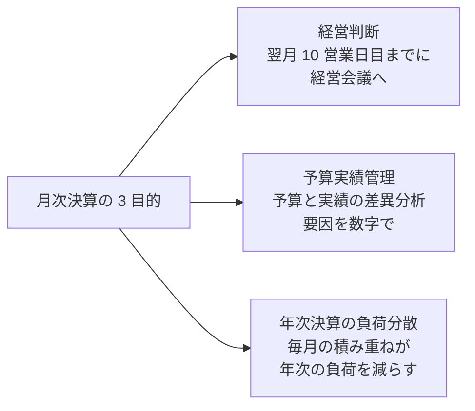
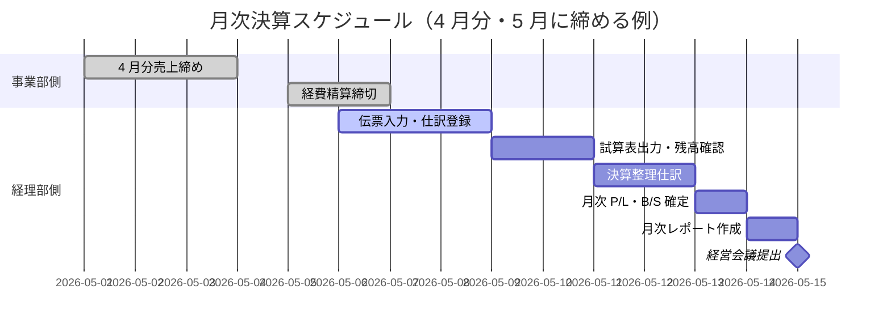
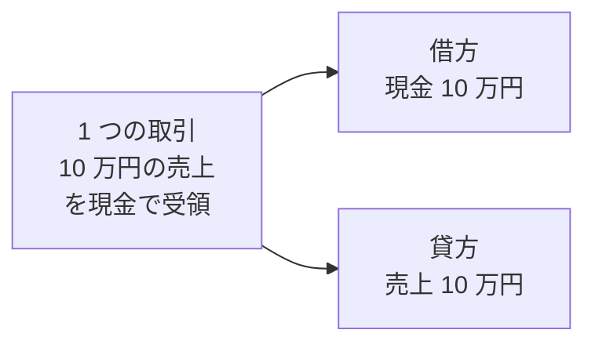
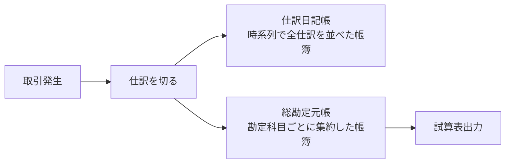
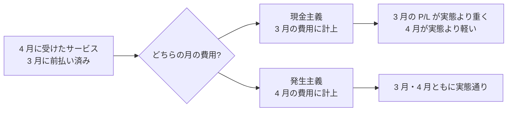
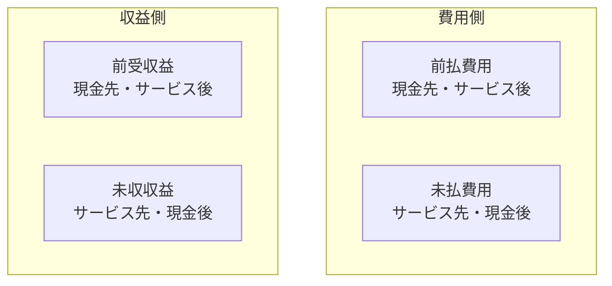
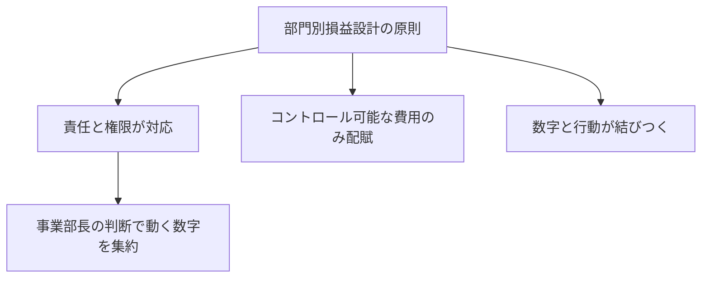
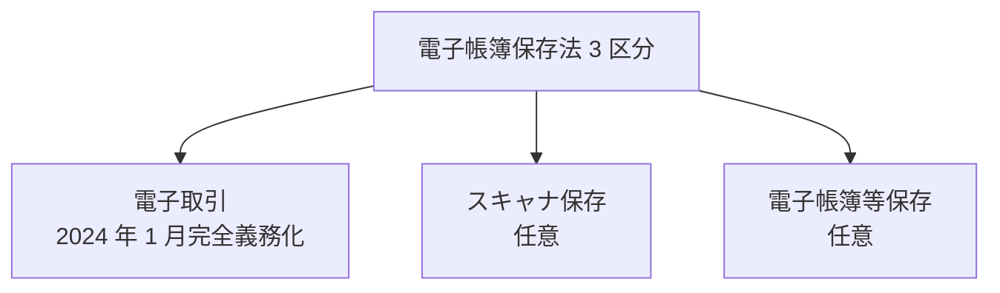
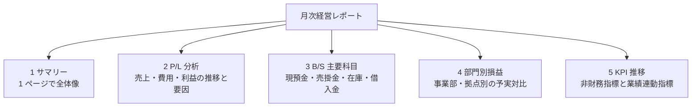
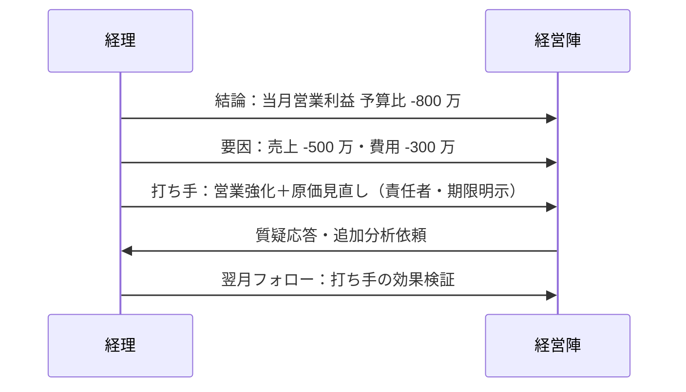

# 月次決算実務

月次決算は経営会議の羅針盤——試算表・決算整理・部門別損益・経理 DX まで、中堅企業経理担当者の月次サイクルを 2026 年 7 月時点の制度で体系化

| 項目 | 内容 |
|---|---|
| カテゴリー | 経理・財務実務 |
| 難易度 | 中級 |
| 所要時間 | 約200分（全8レッスン） |
| 公開日 | 2026-07-14 |
| 最終更新日 | 2026-07-14 |
| コースURL | https://skillup.college/courses/finance/monthly-closing-basics/ |

## 対象者

中堅企業（従業員 100〜1,000 名規模）の経理担当者 1〜3 年目、経理未経験で異動配属された方、経理チームのマネジャー、事業部で経理数字を読む必要のある企画担当・営業マネジャー。

## 前提知識

会計の基本用語（売上・売上原価・営業利益）を耳にしたことがある程度。簿記の資格は不要（本コースは資格対策ではなく実務）。

## 学習目標

- 月次決算の目的と年次決算との違いを説明できる
- 試算表→決算整理→月次 P/L・B/S→月次レポートの全体フローを追える
- 企業経理視点の仕訳の基本と勘定科目体系を実務で扱える
- 前払・未払・前受・未収の経過勘定を月次で計上できる
- 減価償却・引当金の月次計上仕訳を組み立てられる
- 部門別損益と共通費配賦、月次予実レビューの型を回せる
- 電子帳簿保存法・インボイス制度の月次運用と経理 DX の実装ポイントを判断できる
- 月次経営レポートの型と経営会議での説明の作法を持ち帰れる

## コース概要

月次決算は、経営者が経営判断を行うための羅針盤です。年次決算が「株主・税務当局向けの制度対応」であるのに対し、月次決算は「経営者と現場向けの意思決定支援」であり、翌月 10 営業日目までに正確な数字を出せるかどうかが経営スピードを直接左右します。本コースは、簿記の資格を持たずに経理へ異動配属された方や、経理 1〜3 年目で「なぜこの仕訳を切るのか」を上司に説明できるようになりたい方に向けて、月次決算の全体フロー、仕訳の判断軸、経過勘定と引当金の月次計上、部門別損益と予算実績管理、電子帳簿保存法とインボイス制度の月次運用、月次経営レポートの型と経営会議への説明までを 8 レッスンで体系化します。「月次決算は早く・正しく・意味を持って——3 つのバランスを取る仕事」を背骨に、翌月 10 営業日目に胸を張って月次を締められる状態を目指します。

## 学習の流れ

前半 3 レッスンで「土台」を固めます。レッスン 1 で月次決算の目的と年次決算との違い、レッスン 2 で月次決算の全体フロー、レッスン 3 で企業経理視点の仕訳の基本を扱います。中盤のレッスン 4 で経過勘定と月次計上仕訳、レッスン 5 で減価償却・引当金の月次計上を扱い、月次で必ず走らせる仕訳の型を身につけます。後半のレッスン 6 で部門別損益と予算実績管理、レッスン 7 で電子帳簿保存法・インボイス制度の月次運用と経理 DX、レッスン 8 で月次経営レポートの型と経営会議への説明・キャリア展望までを扱います。全 8 レッスン・約 200 分の構成です。

## レッスン一覧

| No. | タイトル | 概要 | 所要時間 |
|---|---|---|---|
| 1 | 月次決算とは何か——年次決算との違いと目的 | 月次決算の 3 目的（経営判断・予実管理・年次決算の負荷分散）、月次と年次の違い、決算日程（月末締め・翌 10 営業日目標）、コース守備範囲・境界明示（簿記・原価計算・在庫評価は既刊譲り）を学ぶ | 25分 |
| 2 | 月次決算の全体フロー——試算表から月次レポートまで | 月次決算の 6 ステップ（伝票入力→試算表→残高確認→決算整理→月次 P/L・B/S→月次レポート）、Excel と会計ソフトの役割分担、5〜10 営業日目標のスケジュール例、締め日と経理部の月間サイクルを学ぶ | 25分 |
| 3 | 仕訳の基礎——企業経理視点の複式簿記と勘定科目 | 複式簿記の思想、借方・貸方の原則、勘定科目体系（貸借対照表科目／損益計算書科目）、仕訳日記帳・総勘定元帳、会計ソフトへの入力実務、承認フローと内部統制の入口を学ぶ | 25分 |
| 4 | 期間帰属の実務——経過勘定と月次計上仕訳 | 発生主義と現金主義の違い、前払費用・未払費用・前受収益・未収収益の月次計上、賞与引当金の月割、家賃・保険料・保守費用の実例仕訳、月末に必ず走らせる 10 の仕訳を学ぶ | 25分 |
| 5 | 引当金・減価償却の月次計上 | 減価償却の月割計算（定額法・定率法）、貸倒引当金の 3 区分（一般債権・貸倒懸念債権・破産更生債権等）、賞与引当金・退職給付引当金の月次繰入、税効果会計の入口を学ぶ | 25分 |
| 6 | 部門別損益と予算実績管理 | 部門コード設計、共通費配賦（人員数基準・売上高基準・面積基準）、月次予実レビューの型、差異分析（数量差・単価差・時間差）、責任会計の原則、経営会議への上げ方を学ぶ | 25分 |
| 7 | 経理 DX と制度対応の実践——電帳法・インボイス・クラウド会計 | 電子帳簿保存法（2024 年 1 月完全義務化）の 3 区分（電子取引・スキャナ保存・電子帳簿）と月次運用、インボイス制度（2023 年 10 月開始）受取側実務・2 割特例、freee／マネーフォワード／弥生の使い分けと AI 仕訳、RPA・AI-OCR の実装ポイントを学ぶ | 25分 |
| 8 | 月次レポートの型と経営会議への説明・修了後の学び方 | 月次経営レポートの 5 ブロック（サマリー・PL・BS 主要科目・部門別・KPI）、経営会議での説明の型（結論ファースト・差異は要因分解）、経理担当者のキャリア（管理会計・連結・IR・CFO）、修了後の学び方（週刊経営財務・旬刊経理情報・実務家コミュニティ）を学ぶ | 25分 |

---

## レッスン1：月次決算とは何か——年次決算との違いと目的

（所要時間：25分）

### このレッスンで学ぶこと

- 本コースの守備範囲（中堅企業経理担当者の月次サイクル）と、扱わない範囲を区別できる
- 月次決算の 3 つの目的（経営判断・予実管理・年次決算の負荷分散）を語れる
- 月次決算と年次決算の性質の違いを 4 つの軸で説明できる
- 翌月 10 営業日目という決算日程の意味と、経理部の月間サイクルを理解できる
- 本コースの中核メッセージ 6 個を持ち帰れる

---

月次決算は、経営者が「今どこにいるのか」を知るための羅針盤です。年に 1 度の年次決算だけでは、経営はハンドルを持たずに航海するようなものです。しかし、月次決算を「早く・正しく・意味を持って」出すには、経理担当者の毎月の綱渡りが必要になります。本レッスンでは、まず月次決算そのものの位置づけを整理し、本コース全 8 レッスンでどこを重点的に学ぶかの見取り図を提示します。

### 本コースの位置づけ——「中堅企業経理担当者の月次サイクル」の視点

本コースは月次決算実務を「中堅企業経理担当者の月次サイクル」の視点で扱います。三表を「読み手」として理解するスキル、原価計算体系、在庫評価 3 方式、フリーランス視点のインボイス／電帳法は、それぞれ財務・業種別・キャリア別の入門コースを参照してください。本コースはそれらを前提としたうえで、「月次で経営会議に間に合う数字を、意味のある形で作り上げる作り手の技術」に軸足を置きます。

> **💡 ポイント**
> 本コースは簿記の資格試験対策ではありません。日商簿記 2 級・3 級で問われる仕訳暗記や検定問題の解き方は扱いません。代わりに、企業経理の現場で「なぜこの科目を選ぶのか」「なぜこのタイミングで計上するのか」を上司や監査法人に説明できる状態を目指します。

#### 対象読者の 3 つの視点

本コースは 3 つの視点を意識的に交錯させます。第 1 は、経理担当者本人の視点です。翌月 10 営業日目までに月次を締める作業手順。第 2 は、経理マネジャーの視点です。チームで回すための分業と品質管理。第 3 は、事業部の視点です。経理数字を意思決定に使う企画担当・営業マネジャーが、経理からのアウトプットをどう読むか。3 つの視点を持ち帰って、はじめて社内での月次サイクルが回ります。

### 月次決算の 3 つの目的

月次決算は「なぜ毎月やるのか」という問いに対して、明確な 3 つの答えがあります。

#### 目的 1：経営判断のための最新数字を出す

経営者は毎月、事業の進捗を数字で確認します。売上は伸びているか、粗利率は維持できているか、販管費は膨らんでいないか、現預金は足りているか——これらを直近の実績で把握できなければ、意思決定は勘に頼るしかなくなります。月次決算は、翌月 10 営業日目までに前月の実績を「経営会議で使える形」に整えて提出することが役割です。

#### 目的 2：予算実績管理を回す

年度初めに立てた予算（売上・費用・利益の計画）と、月次の実績を比較して、差異を分析します。売上が予算比マイナスなら、それは受注減か価格下落か、それとも計上遅れか。費用が予算比プラスなら、それは想定外の支出か、期ズレか、業績連動の増加か。月次決算が出て初めて、この予実対比が可能になります。

#### 目的 3：年次決算の負荷を分散する

年に 1 度の本決算だけを目指す会社は、決算月に膨大な作業が集中し、ミスと過労と監査法人からの指摘が同時多発します。月次決算を毎月きっちり回している会社は、年次決算で追加的に発生する作業（年次固有の税務調整・監査対応・注記作成）だけに集中でき、決算期の負荷が桁違いに軽くなります。月次決算は、年次決算の「先取り」でもあるのです。

### 月次決算と年次決算の 4 つの違い

「月次と年次は何が違うのか」を、4 つの軸で整理します。

| 軸 | 月次決算 | 年次決算 |
|---|---|---|
| 目的 | 経営判断・予実管理 | 株主・税務当局への報告 |
| スピード | 翌月 10 営業日目目標 | 決算期後 2〜3 か月 |
| 精度 | ある程度の概算許容 | 100% の正確性が必要 |
| 対象書類 | 月次 P/L・B/S・月次レポート | 決算書・税務申告書・有価証券報告書 |

#### 目的の違い

年次決算は「制度対応」であり、株主総会・金融庁・税務署・監査法人という外部ステークホルダーに提出することが第一の目的です。月次決算は「経営支援」であり、経営者と事業部という内部ステークホルダーが翌月の意思決定に使うための情報提供が第一の目的です。両者は同じ会計基準に沿いますが、優先する読み手が違うため、力の入れどころも違います。

#### スピードの違い

年次決算は決算期末（3 月末が多い日本の 3 月決算会社の場合）から 2〜3 か月後の株主総会（6 月末が多い）に間に合わせるのが典型的なスケジュールです。月次決算は「翌月 10 営業日目」が中堅企業のベンチマークで、業績のよい上場企業では「翌月 5 営業日目」まで短縮している例もあります。1 か月あった時間が 10 営業日、さらに 5 営業日と縮む中で、正確さを維持する仕組みが問われます。

#### 精度の違い

年次決算は監査法人の監査を経て、100% の正確性が求められます。誤りは修正申告・訂正報告・監査意見の不表明といった重大な結果につながります。月次決算は「経営判断に十分な精度」があれば許容範囲で、例えば売上の一部が翌月に計上ズレしても、要因が説明できていれば経営会議は成立します。ただし精度を軽く見ると年次に響くため、「月次で概算、年次で精算」の思想が実務の柱になります。

#### 対象書類の違い

年次決算では、決算書（P/L・B/S・株主資本等変動計算書・キャッシュ・フロー計算書・注記）・法人税申告書・消費税申告書・地方税申告書・有価証券報告書（上場会社の場合）・監査報告書・株主総会招集通知添付書類など、大量の書類を作ります。月次決算では、月次 P/L・月次 B/S・部門別損益・月次経営レポートに絞り込みます。作る書類の種類が違うため、作業の中身も違います。

### 決算日程——翌月 10 営業日目という基準線

中堅企業（従業員 100〜1,000 名規模）の月次決算スケジュールの典型例を示します。3 月決算会社が 4 月の月次決算を締める場合、次のような日程になります。

#### 各段階の要点

- **1〜3 営業日目**：事業部から売上・経費・購買データを回収し、会計ソフトへ入力します。営業部門・購買部門・経費精算システムからのデータ取り込みが集中する期間です。
- **4〜5 営業日目**：試算表を出力し、各勘定科目の残高を前月比・予算比で異常値がないか確認します。金額の桁違い、勘定科目間違い、消込漏れなどをここで捕捉します。
- **6〜7 営業日目**：決算整理仕訳（減価償却、経過勘定、引当金繰入、為替評価替えなど）を計上します。本コースのレッスン 4〜5 で詳しく扱う領域です。
- **8〜9 営業日目**：月次 P/L・B/S を確定させ、部門別損益を集計します。予実対比の分析も並行します。
- **10 営業日目**：月次経営レポートを作成し、経営会議に提出します。

> **📝 補足**
> 「営業日」は土日祝を除いた稼働日を指します。5 月のゴールデンウィークや年末年始のように休日が続く月は、実日数では 2 週間以上かかります。祝日の多い月は締めが遅れやすいため、事前に事業部と経理部でスケジュールをすり合わせることが実務上の要点です。

### 中核メッセージ 6 個の再掲

本コース全体を通じて、6 個のメッセージを繰り返します。

1. **月次決算は「早く・正しく・意味を持って」——3 つのバランスを取る仕事**
2. **仕訳は結果ではなく判断の記録——なぜその科目を選んだかを説明できる状態にする**
3. **経過勘定は「期間帰属」の思想を守る道具——月をまたぐ取引を歪めない**
4. **引当金・減価償却は「未来の負担」を月々に分ける仕組み**
5. **部門別損益は責任会計——数字が動く場所と動かす人を対応させる**
6. **経理 DX は仕訳を減らす技術——電帳法・インボイスは制度対応ではなく業務再設計の起点**

このレッスンで扱うのはメッセージ 1「月次決算は早く・正しく・意味を持って」です。3 つの要素はどれかを優先すればどれかが犠牲になる関係にあり、経理担当者はこのトライアドを毎月調整し続けます。

### 次のレッスンで扱うこと

次のレッスン 2 では、月次決算の全体フローを 6 ステップ（伝票入力→試算表→残高確認→決算整理→月次 P/L・B/S→月次レポート）で分解し、Excel と会計ソフトの役割分担、5〜10 営業日目標のスケジュール例を扱います。本レッスンで示した「翌月 10 営業日目」の中身を、実際の作業単位に落とし込みます。

### 確認クイズ

このレッスンで学んだ内容を確認しましょう。

#### Q1. 月次決算の 3 つの目的として、本レッスンで挙げていない項目はどれか。

- [x] 株主総会での配当決議に使う
- [ ] 経営判断のための最新数字を出す
- [ ] 予算実績管理を回す
- [ ] 年次決算の負荷を分散する

> **解説**
> 株主総会での配当決議は年次決算（本決算）の目的です。月次決算は経営判断・予実管理・年次負荷分散の 3 つを目的とします。株主向けの制度対応と、経営者向けの内部意思決定は分けて考えるのが月次決算の思想です。

#### Q2. 月次決算と年次決算の違いに関する記述として、適切なものはどれか。

- [ ] 月次決算は 100% の正確性が求められる
- [x] 月次決算は経営判断に十分な精度があれば許容範囲
- [ ] 月次決算は監査法人の監査を経る
- [ ] 年次決算は翌月 10 営業日目までに完了させる

> **解説**
> 月次決算は「経営判断に十分な精度」があれば許容範囲で、要因が説明できていれば経営会議は成立します。100% の正確性・監査法人の監査は年次決算の要件で、翌月 10 営業日目は月次決算の目標です。「月次で概算、年次で精算」の思想が経理実務の柱です。

#### Q3. 中堅企業（従業員 100〜1,000 名規模）の月次決算スケジュールで、決算整理仕訳（減価償却・経過勘定・引当金繰入）を計上する典型的なタイミングはいつか。

- [ ] 1〜3 営業日目
- [ ] 4〜5 営業日目
- [x] 6〜7 営業日目
- [ ] 10 営業日目

> **解説**
> 決算整理仕訳は 6〜7 営業日目に集中します。1〜3 営業日目は事業部データの回収と伝票入力、4〜5 営業日目は試算表出力と残高確認、10 営業日目は月次レポート作成と経営会議提出のタイミングです。各段階の役割を分けて把握するのが月次サイクルの型です。

#### Q4. 本コースが扱う範囲として、正しいものはどれか。

- [ ] 日商簿記 2 級・3 級の検定対策
- [ ] フリーランス個人事業主の確定申告
- [ ] 製造原価計算体系の詳細
- [x] 中堅企業経理担当者の月次サイクル

> **解説**
> 本コースは「中堅企業経理担当者の月次サイクル」を軸に、月次決算の全体フロー・仕訳の判断軸・経過勘定・引当金・部門別損益・経理 DX・月次レポートまでを扱います。簿記検定・フリーランス確定申告・原価計算体系はそれぞれ別の入門コースの守備範囲です。境界を明確にすることで、本コースの主担当領域に力を注ぎます。

---

## レッスン2：月次決算の全体フロー——試算表から月次レポートまで

（所要時間：25分）

### このレッスンで学ぶこと

- 月次決算の 6 ステップ（伝票入力→試算表→残高確認→決算整理→月次 P/L・B/S→月次レポート）を追える
- 各ステップで経理担当者が何をして、どこで詰まりやすいかを把握できる
- Excel と会計ソフトの役割分担を整理できる
- 事業部データの回収スケジュールと経理部の処理スケジュールの依存関係を理解できる
- 月次決算をチームで分業するときの区切り方をイメージできる

---

前レッスンでは月次決算の目的と年次決算との違い、翌月 10 営業日目の意味を整理しました。本レッスンでは、その 10 営業日をどう使うかを、6 ステップに分解して追いかけます。ここが月次決算の背骨です。

### 月次決算 6 ステップの全体像

月次決算は、ざっくり次の 6 ステップで進みます。会社の規模や業種で細部は変わりますが、骨格はどこも同じです。

前半 3 ステップ（伝票入力→試算表→残高確認）が「入力と確認」の工程、後半 3 ステップ（決算整理→月次 P/L・B/S→月次レポート）が「整理と提出」の工程です。前半で数字を集め、後半で意味を持たせる、と整理すると全体像が掴みやすくなります。

### ステップ 1：伝票入力

月次決算は「毎日の伝票入力の積み重ね」から始まります。月末になってから 1 か月分をまとめて入力する会社は、翌月 10 営業日目に月次を締めることは物理的に困難です。日次で回っていることが前提です。

#### 伝票入力の主なソース

- **売上伝票**：販売管理システム・EC カート・受発注システムから会計ソフトへ連携
- **仕入伝票**：購買管理システム・請求書 OCR から会計ソフトへ連携
- **経費伝票**：経費精算システム（楽楽精算・Concur・freee 経費など）から会計ソフトへ連携
- **給与伝票**：給与計算システム（弥生給与・freee 人事労務・SmartHR など）から会計ソフトへ連携
- **銀行取引**：Bank Data の API 連携で会計ソフトへ自動取り込み

これらを都度、正しい勘定科目・部門・補助科目を付けて入力していきます。

> **💡 ポイント**
> 「伝票入力」と一言で言っても、実務では「システム間連携で自動入力」される部分と、「経理担当者が手動で判断して入力」する部分の 2 種類が混在します。自動連携の比率を高めることが経理 DX の中心テーマで、本コースのレッスン 7 で詳しく扱います。

#### 月次締めまでに入れきる工夫

事業部側からデータが上がってこないと、経理は入力できません。営業部門・購買部門・経費精算締切のスケジュールを事業部と合意しておくことが月次スピードの鍵です。

- 売上：翌月第 1 営業日までに前月分の請求書発行を完了
- 仕入：翌月第 3 営業日までに前月分の請求書受領・検収を完了
- 経費：翌月第 5 営業日までに前月分の経費精算を締切

この 3 つの締切が守られれば、経理は 6 営業日目から後半の作業に入れます。

### ステップ 2：試算表出力

すべての伝票が入力されたら、会計ソフトから試算表（合計残高試算表、TB: Trial Balance）を出力します。試算表とは、勘定科目ごとに借方・貸方の合計額と残高を一覧で示した表です。

#### 試算表の 2 つの形式

- **合計試算表**：各勘定科目の借方・貸方の合計金額のみ
- **残高試算表**：各勘定科目の残高（借方残高または貸方残高）のみ
- **合計残高試算表**：両方を並べた形式（実務ではこれが標準）

月次決算では、合計残高試算表を出して、期首残高＋当月発生＝当月末残高が正しく積み上がっているかを確認します。

#### 試算表が合わないときの原因

複式簿記では借方合計と貸方合計は必ず一致します（貸借平均の原則）。会計ソフトを使っていれば強制的に一致するため、「試算表が合わない」ことはほぼありません。ただし、次のようなケースで違和感が出ることがあります。

- ある勘定科目の残高が「マイナス」で表示される（貸借逆の入力）
- 現預金残高が銀行残高と一致しない（未取込取引や誤入力）
- 売掛金残高が売上補助元帳と一致しない（消込漏れ）

これらは次のステップ「残高確認」で捕捉します。

### ステップ 3：残高確認

試算表を出したら、主要科目の残高を「実物」または「別システム」と突合します。この工程を怠ると、月次決算は「数字が並んでいるだけで意味を持たない書類」になってしまいます。

#### 主要科目の突合先

| 勘定科目 | 突合先 |
|---|---|
| 現金 | 現金実査結果（金種表） |
| 預金 | 銀行残高証明書・通帳・ネットバンキング残高 |
| 売掛金 | 販売管理システムの売掛金元帳・年齢別残高 |
| 買掛金 | 購買管理システムの買掛金元帳 |
| 棚卸資産 | 在庫管理システム・実地棚卸（原価計算体系の詳細は業種別の入門コースを参照） |
| 貸付金・借入金 | 契約書・返済スケジュール表 |
| 有形固定資産 | 固定資産管理システム・固定資産台帳 |

#### 差異が出たときの対処

差異が出た場合は、①差異の金額、②差異の発生時期、③差異の性質（時ズレか誤入力か）を分けて分析します。多くの場合、時ズレ（未取込・未計上）が原因で、翌月の入金や仕訳で解消します。誤入力の場合は当月内に修正仕訳を切ります。

> **⚠️ 注意**
> 「差異が小さいから放置」は年次決算で大きな問題になります。数百円の残高不一致が長期に放置されると、原因追及が難しくなり、監査対応でも指摘の対象になります。月次のうちに解消するのが原則です。

### ステップ 4：決算整理仕訳

伝票入力と残高確認が終わっても、まだ月次決算は完了しません。「月次で本来認識すべき費用・収益」を追加で計上する必要があります。これが決算整理仕訳です。本コースのレッスン 4・5 で詳しく扱いますが、代表的なものを先に列挙します。

- 減価償却費の月次計上
- 経過勘定（前払費用・未払費用・前受収益・未収収益）の月次計上
- 賞与引当金の月次繰入
- 貸倒引当金の見直し
- 外貨建て資産・負債の為替評価替え（外貨建取引がある場合）
- 棚卸資産の実地棚卸調整（月次で実地しない場合は概算）

これらを月次で計上することで、月次 P/L・B/S が「経営判断に使える精度」に達します。

### ステップ 5：月次 P/L・B/S 確定

決算整理まで済んだら、会計ソフトから月次 P/L（損益計算書）・月次 B/S（貸借対照表）を出力します。同時に部門別損益も集計します（本コースのレッスン 6 で詳述）。

#### 月次 P/L の要点

- 売上高、売上原価、売上総利益（粗利）、販管費、営業利益、経常利益、税引前利益
- 前月比・前年同月比・予算比の 3 つの並列表示
- 主要科目の異常値（前月比 ±30% 超など）にコメントを付ける

#### 月次 B/S の要点

- 流動資産・固定資産・繰延資産、流動負債・固定負債、純資産
- 前月末との差異、主要科目（現預金・売掛金・在庫・買掛金・借入金）の推移
- 運転資本（売掛金＋在庫−買掛金）と CCC の月次推移

### ステップ 6：月次レポート提出

最終的に、月次 P/L・B/S・部門別損益・KPI 推移をまとめた「月次経営レポート」を作成し、経営会議に提出します。本コースのレッスン 8 で詳しく扱いますが、要点は「結論ファースト・差異は要因分解」の型を守ることです。

### Excel と会計ソフトの役割分担

月次決算の実務では、Excel と会計ソフトを併用します。両者の役割を明確に分けることが、効率と正確性の両立に効きます。

| 領域 | 会計ソフトの役割 | Excel の役割 |
|---|---|---|
| 伝票入力・仕訳登録 | ◎（正本） | ×（原則使わない） |
| 試算表・元帳出力 | ◎（正本） | ×（コピペ運用は禁物） |
| 経過勘定の計算 | △（テンプレ機能あり） | ◎（計算表として） |
| 部門別損益の集計 | ◎（部門機能） | ○（集計後の分析） |
| 予算実績対比 | △（機能差あり） | ◎（柔軟に組める） |
| 月次経営レポート | △（テンプレ機能あり） | ◎（可視化・コメント記述） |

> **📝 補足**
> Excel での作業結果を会計ソフトに戻すときは、必ず「Excel の計算根拠を残す」ことが重要です。Excel 上で数字だけを作り、会計ソフトへは結果だけ入力すると、後で「なぜこの数字になったか」が追えなくなります。Excel の計算シートを月次で残す運用が実務の標準です。

### チームで分業するときの区切り方

中堅企業の経理チーム（3〜10 名規模）では、月次決算を分業して回します。典型的な区切り方は次の 3 通りです。

#### 分業パターン 1：勘定科目別

売掛金担当・買掛金担当・固定資産担当・給与担当のように、担当科目で分ける方式。深い専門性が身につく一方、担当が休むと業務が止まるリスクがあります。

#### 分業パターン 2：事業部別

事業部 A・事業部 B・事業部 C のように、事業ごとに担当を割り当てる方式。事業部側とのコミュニケーションがスムーズになる一方、経理内の作業の統一感が失われがちです。

#### 分業パターン 3：工程別

伝票入力担当・残高確認担当・決算整理担当のように、月次決算の工程で分ける方式。工程内でのスループットが高まる一方、全体を通した視点を持つ担当者が不足しがちです。

現実には 3 パターンを組み合わせるハイブリッド型が多く、経理マネジャーは各メンバーの成長段階に応じて役割を回転させます。

### 中核メッセージ 6 個の再掲

本コース全体を通じて、6 個のメッセージを繰り返します。

1. **月次決算は「早く・正しく・意味を持って」——3 つのバランスを取る仕事**
2. **仕訳は結果ではなく判断の記録——なぜその科目を選んだかを説明できる状態にする**
3. **経過勘定は「期間帰属」の思想を守る道具——月をまたぐ取引を歪めない**
4. **引当金・減価償却は「未来の負担」を月々に分ける仕組み**
5. **部門別損益は責任会計——数字が動く場所と動かす人を対応させる**
6. **経理 DX は仕訳を減らす技術——電帳法・インボイスは制度対応ではなく業務再設計の起点**

このレッスンで扱うのは主にメッセージ 1「早く・正しく・意味を持って」の「早く」の側面です。6 ステップを分解し、事業部との締切合意と工程分業で「翌月 10 営業日目」を実現する枠組みを扱いました。

### 次のレッスンで扱うこと

次のレッスン 3 では、月次決算の中身である「仕訳」の基礎を、企業経理視点で扱います。複式簿記の思想、借方・貸方の原則、勘定科目体系、仕訳日記帳と総勘定元帳、会計ソフトへの入力実務、そして承認フローと内部統制の入口まで、経理担当者が毎日向き合う仕訳の判断軸を整理します。

### 確認クイズ

このレッスンで学んだ内容を確認しましょう。

#### Q1. 月次決算 6 ステップのうち、正しい順序はどれか。

- [x] 伝票入力→試算表出力→残高確認→決算整理→月次 P/L・B/S 確定→月次レポート提出
- [ ] 試算表出力→伝票入力→残高確認→決算整理→月次 P/L・B/S 確定→月次レポート提出
- [ ] 伝票入力→残高確認→試算表出力→月次 P/L・B/S 確定→決算整理→月次レポート提出
- [ ] 月次レポート提出→伝票入力→試算表出力→残高確認→決算整理→月次 P/L・B/S 確定

> **解説**
> 月次決算は「伝票入力→試算表出力→残高確認→決算整理→月次 P/L・B/S 確定→月次レポート提出」の順で進みます。前半 3 ステップが「入力と確認」、後半 3 ステップが「整理と提出」の工程です。順序を入れ替えると論理的に成立しません。

#### Q2. 試算表について、適切な記述はどれか。

- [ ] 試算表は年次決算だけで作成する
- [x] 合計残高試算表は各勘定科目の合計と残高を並べた形式
- [ ] 会計ソフトを使えば試算表は不要
- [ ] 試算表は経営会議にそのまま提出する書類

> **解説**
> 合計残高試算表は、各勘定科目の借方・貸方合計と残高を並べた形式で、実務では標準として使われます。試算表は月次でも作成し、残高確認の起点として不可欠です。会計ソフトが自動生成しても中身の確認は必要で、経営会議には試算表そのままではなく月次経営レポートとして加工したものを提出します。

#### Q3. 残高確認で「差異が小さいから放置」を選ぶことのリスクはどれか。

- [ ] 会計ソフトが自動で修正するので問題ない
- [ ] 年次決算までに差異が自動的に消える
- [x] 原因追及が難しくなり、監査対応で指摘の対象になる
- [ ] 経理チームの評価が下がるだけで実害はない

> **解説**
> 月次で放置された差異は、時間が経つほど原因追及が難しくなり、年次決算での監査対応で指摘の対象になります。数百円の残高不一致でも、長期に放置されれば重大な問題に発展します。月次のうちに解消する運用が原則です。

#### Q4. Excel と会計ソフトの役割分担として、適切な記述はどれか。

- [ ] 伝票入力・仕訳登録は Excel で行う方が柔軟性がある
- [ ] 試算表・元帳は Excel で管理するのが標準
- [ ] 会計ソフトだけを使い、Excel は使わないほうがよい
- [x] 経過勘定の計算・予算実績対比・月次レポートは Excel の柔軟性が活きる

> **解説**
> 伝票入力・仕訳登録・試算表・元帳は会計ソフトが正本を管理し、Excel でのコピペ運用は禁物です。一方、経過勘定の計算・予算実績対比・月次経営レポートは Excel の柔軟性が活きる領域で、両者を役割分担して使うのが実務の標準です。Excel の計算結果を会計ソフトに戻すときは計算根拠を必ず残します。

---

## レッスン3：仕訳の基礎——企業経理視点の複式簿記と勘定科目

（所要時間：25分）

### このレッスンで学ぶこと

- 複式簿記の思想と、単式簿記との違いを説明できる
- 借方・貸方の 5 グループのルールを覚えて実務で使える
- 勘定科目体系（貸借対照表科目・損益計算書科目）の全体像を把握できる
- 仕訳日記帳と総勘定元帳の関係を理解できる
- 会計ソフトへの入力実務と、承認フローの意義を語れる

---

前レッスンでは月次決算の全体フローを 6 ステップで整理しました。本レッスンでは、そのフローの中で毎日発生する「仕訳」に踏み込みます。仕訳は経理の共通言語であり、なぜその科目を選んだかを説明できることが経理担当者の第一歩です。

### 複式簿記の思想——1 つの取引を 2 面から見る

複式簿記は「1 つの取引を 2 面から記録する」という発想です。500 年以上前にイタリアで体系化され、現在まで世界中の企業会計の土台になっています。

#### 単式簿記との違い

- **単式簿記**：現金の出入りだけを家計簿のように記録
- **複式簿記**：現金の出入りだけでなく、「なぜ入ったか」「なぜ出たか」も同時に記録

例えば「10 万円の売上を現金で受け取った」場合、単式簿記なら「収入 10 万円」と一行だけ。複式簿記なら「現金が 10 万円増えた（借方）」と「売上が 10 万円計上された（貸方）」の 2 行を対で記録します。

#### なぜ 2 面から見るのか

- 資産・負債・純資産のバランスが常に取れる（B/S の整合性）
- 損益と資金の動きが別々に追える（P/L と C/F の分離）
- 記帳漏れや誤りが「試算表が合わない」形で検出できる
- 外部への説明責任（監査・税務・投資家）に耐える帳簿になる

これらは中堅企業が成長するに従って必須になる要件で、複式簿記でしか実現できません。

### 借方・貸方の 5 グループルール

複式簿記の中核は「借方と貸方をどう使い分けるか」です。5 つの勘定科目グループそれぞれで、増加と減少がどちらに来るかが決まっています。

| グループ | 増加 | 減少 |
|---|---|---|
| 資産 | 借方 | 貸方 |
| 負債 | 貸方 | 借方 |
| 純資産（資本） | 貸方 | 借方 |
| 収益 | 貸方 | 借方 |
| 費用 | 借方 | 貸方 |

#### 覚え方のコツ

- **資産と費用は借方に増える**（現金・売掛金・在庫・建物、給与・家賃・水道光熱費）
- **負債・純資産・収益は貸方に増える**（借入金・買掛金・資本金、売上・受取利息）

「借方・貸方」という日本語には方向の意味はなく、単に「左・右」の意味です。この点を最初に飲み込むと、あとは 5 グループのルールを機械的に当てはめられます。

> **💡 ポイント**
> 会計ソフトを使えば、多くの取引はテンプレートから選ぶだけで仕訳が完成します。しかし、テンプレートにない取引や、判断が必要な取引に出会ったとき、5 グループルールを自分の頭で組み立てられることが経理担当者の実力の見せどころになります。

#### よく使う仕訳例

**例 1：商品を 5 万円で仕入れて現金で払った**
- 借方：仕入 50,000 円（費用の増加）
- 貸方：現金 50,000 円（資産の減少）

**例 2：商品を 8 万円で売って掛けにした**
- 借方：売掛金 80,000 円（資産の増加）
- 貸方：売上 80,000 円（収益の増加）

**例 3：銀行から 100 万円を借り入れて預金口座に入った**
- 借方：預金 1,000,000 円（資産の増加）
- 貸方：借入金 1,000,000 円（負債の増加）

**例 4：4 月分の家賃 20 万円を口座振替で支払った**
- 借方：地代家賃 200,000 円（費用の増加）
- 貸方：預金 200,000 円（資産の減少）

### 勘定科目体系——貸借対照表科目と損益計算書科目

勘定科目は、大きく B/S 科目（貸借対照表科目）と P/L 科目（損益計算書科目）の 2 つに大別されます。中堅企業で使う主な科目を整理します。

#### B/S 科目（資産・負債・純資産）

**流動資産**：現金・預金・受取手形・売掛金・電子記録債権・棚卸資産（商品・製品・仕掛品・原材料）・前払費用・未収収益・立替金・仮払金

**固定資産（有形）**：建物・建物附属設備・構築物・機械装置・車両運搬具・工具器具備品・土地・リース資産・建設仮勘定

**固定資産（無形）**：ソフトウェア・のれん・特許権・商標権・ソフトウェア仮勘定

**投資その他の資産**：投資有価証券・関係会社株式・長期貸付金・繰延税金資産・敷金・保証金

**流動負債**：支払手形・買掛金・電子記録債務・短期借入金・未払金・未払費用・未払法人税等・未払消費税等・前受金・前受収益・預り金・賞与引当金

**固定負債**：長期借入金・社債・長期未払金・退職給付引当金・繰延税金負債・リース債務

**純資産**：資本金・資本剰余金・利益剰余金・自己株式・その他有価証券評価差額金・繰延ヘッジ損益

#### P/L 科目（収益・費用）

**売上高**：売上高（業種によって商品売上高・サービス売上高・工事売上高などに細分）

**売上原価**：期首棚卸高・当期仕入高・期末棚卸高・製造原価（製造業）

**販管費**：役員報酬・給与手当・賞与・法定福利費・福利厚生費・退職給付費用・地代家賃・水道光熱費・通信費・旅費交通費・接待交際費・広告宣伝費・支払手数料・支払報酬・減価償却費・貸倒引当金繰入額・研究開発費・消耗品費・租税公課・雑費

**営業外収益**：受取利息・受取配当金・為替差益・雑収入

**営業外費用**：支払利息・社債利息・為替差損・雑損失

**特別利益**：固定資産売却益・投資有価証券売却益・保険差益

**特別損失**：固定資産売却損・固定資産除却損・災害損失・減損損失

**税金**：法人税、住民税及び事業税・法人税等調整額

> **📝 補足**
> 勘定科目の細かい区分は会社ごとにカスタマイズされます。同じ「消耗品費」でも、A 社では文具・雑貨・IT アクセサリを含むが、B 社では IT アクセサリを別勘定に切っている、といった違いはよくあります。自社の勘定科目体系表（勘定科目辞書）を最初に読み込むことが新任経理の必須作業です。

### 仕訳日記帳と総勘定元帳の関係

仕訳を切ったら、2 種類の帳簿に自動的に転記されます。会計ソフトを使えば自動処理ですが、両者の役割を知っておくことは残高確認や監査対応で必要になります。

#### 仕訳日記帳

すべての仕訳を発生順に並べた帳簿です。「4 月 5 日に何があったか」を時系列で追いかけるときに使います。監査法人が「特定日の取引を全部見せてほしい」と要請したときも、仕訳日記帳から抽出します。

#### 総勘定元帳

勘定科目ごとに全取引を集約した帳簿です。「4 月の売掛金の動きを追いたい」ときは、売掛金の総勘定元帳を見れば、期首残高・当月増加・当月減少・当月末残高がすべて追えます。残高確認の主な作業場所は総勘定元帳です。

#### 補助元帳

売掛金・買掛金・固定資産などは、取引先別・資産別にさらに細かく管理する「補助元帳」が併設されます。売掛金の総勘定元帳は「全売掛金残高：3,000 万円」と表示しますが、補助元帳では「A 社：500 万円、B 社：800 万円、…」と個別に把握できます。

### 会計ソフトへの入力実務

会計ソフトへの入力は、大きく 3 パターンあります。

#### パターン 1：手動入力

伝票を見ながら経理担当者が 1 件ずつ入力する方式。少額の雑費・単発の取引で使います。

#### パターン 2：システム連携（API/CSV 取り込み）

販売管理・購買管理・給与・経費精算などのシステムから、API 経由で自動連携する方式。中堅企業では月次 1,000 件以上の伝票を扱うため、システム連携なしには月次スピードが出ません。

#### パターン 3：AI-OCR + AI 仕訳

紙の請求書・レシートを OCR で読み取り、AI が勘定科目を推論する方式。近年急速に精度が上がっており、freee・マネーフォワード・弥生いずれも標準機能として提供しています。詳細はレッスン 7 で扱います。

### 承認フローと内部統制の入口

経理担当者が入力した仕訳は、そのまま帳簿に反映されるのではなく、上司（経理課長・経理部長）の承認を経て確定するのが中堅企業以上の標準です。この承認フローは内部統制の一部です。

#### 承認フローの目的

- 誤入力の早期発見（他者の目でチェック）
- 不正の抑止（1 人だけで完結させない）
- 責任所在の明確化（誰が承認したか記録）
- 監査対応（承認記録が監査証跡になる）

> **⚠️ 注意**
> 承認フローを形骸化させると、「承認された仕訳だから正しいはず」と誰も内容を見なくなり、監査法人の指摘や不正の温床になります。承認者は必ず内容を確認し、疑問があれば入力者に差戻す運用が原則です。

### 中核メッセージ 6 個の再掲

本コース全体を通じて、6 個のメッセージを繰り返します。

1. **月次決算は「早く・正しく・意味を持って」——3 つのバランスを取る仕事**
2. **仕訳は結果ではなく判断の記録——なぜその科目を選んだかを説明できる状態にする**
3. **経過勘定は「期間帰属」の思想を守る道具——月をまたぐ取引を歪めない**
4. **引当金・減価償却は「未来の負担」を月々に分ける仕組み**
5. **部門別損益は責任会計——数字が動く場所と動かす人を対応させる**
6. **経理 DX は仕訳を減らす技術——電帳法・インボイスは制度対応ではなく業務再設計の起点**

このレッスンで扱うのはメッセージ 2「仕訳は結果ではなく判断の記録」です。5 グループルールを覚えるだけでなく、なぜその勘定科目を選んだかを説明できる状態が、経理担当者の本質的な実力です。

### 次のレッスンで扱うこと

次のレッスン 4 では、月次決算で毎月必ず走らせる「経過勘定」の実務を扱います。前払費用・未払費用・前受収益・未収収益の 4 タイプそれぞれの月次計上仕訳、家賃・保険料・保守費用の実例、月末に必ず走らせる 10 の仕訳を紹介します。仕訳の基本を使って「期間帰属」という会計の思想を守る具体的な作業です。

### 確認クイズ

このレッスンで学んだ内容を確認しましょう。

#### Q1. 複式簿記と単式簿記の違いとして、適切な記述はどれか。

- [ ] 単式簿記は現金と預金の 2 面から記録する
- [x] 複式簿記は 1 つの取引を借方・貸方の 2 面から記録する
- [ ] 複式簿記は個人事業主にしか使えない
- [ ] 単式簿記は監査法人の監査に耐える

> **解説**
> 複式簿記は「1 つの取引を借方・貸方の 2 面から記録する」思想で、資産・負債・純資産のバランスが常に取れ、外部説明責任に耐える帳簿になります。単式簿記は家計簿のような現金の出入りのみを記録する方式で、企業会計では複式簿記が標準です。

#### Q2. 借方・貸方の 5 グループルールで、「増加が貸方」に来る組み合わせはどれか。

- [x] 負債・純資産・収益
- [ ] 資産・費用
- [ ] 資産・負債・純資産
- [ ] 費用・収益

> **解説**
> 負債・純資産・収益は「増加が貸方」に来ます。資産と費用は「増加が借方」に来ます。この 5 グループルールが仕訳の基本で、テンプレートにない取引に出会ったときに自分の頭で仕訳を組み立てるための土台です。

#### Q3. 「銀行から 100 万円を借り入れて預金口座に入った」場合の仕訳として、適切なものはどれか。

- [ ] 借方：借入金 100 万円／貸方：預金 100 万円
- [ ] 借方：現金 100 万円／貸方：預金 100 万円
- [x] 借方：預金 100 万円／貸方：借入金 100 万円
- [ ] 借方：預金 100 万円／貸方：受取利息 100 万円

> **解説**
> 銀行からの借入は「預金という資産が増える（借方）」と「借入金という負債が増える（貸方）」の 2 面から記録します。資産の増加は借方、負債の増加は貸方の 5 グループルールに沿った仕訳です。受取利息は営業外収益で借入とは別の科目です。

#### Q4. 仕訳日記帳と総勘定元帳の関係について、適切な記述はどれか。

- [ ] 仕訳日記帳は勘定科目ごとに集約した帳簿
- [ ] 総勘定元帳は取引を発生順に並べた帳簿
- [x] 総勘定元帳は勘定科目ごとに集約した帳簿で、残高確認の主な作業場所
- [ ] 会計ソフトを使えば両者は必要ない

> **解説**
> 仕訳日記帳は取引を発生順に並べた帳簿、総勘定元帳は勘定科目ごとに集約した帳簿です。残高確認の主な作業場所は総勘定元帳で、売掛金・買掛金など補助元帳が併設される科目もあります。会計ソフトが自動転記しても、両帳簿の役割を理解することは監査対応や残高確認で必須です。

---

## レッスン4：期間帰属の実務——経過勘定と月次計上仕訳

（所要時間：25分）

### このレッスンで学ぶこと

- 発生主義と現金主義の違いを説明でき、なぜ月次決算では発生主義が必要か語れる
- 経過勘定 4 タイプ（前払費用・未払費用・前受収益・未収収益）の使い分けを判断できる
- 家賃・保険料・保守費用の具体的な月次計上仕訳を組み立てられる
- 月末に必ず走らせる 10 の仕訳を持ち帰れる
- 経過勘定が月次決算の品質を決める理由を語れる

---

前レッスンでは仕訳の基本を扱いました。本レッスンでは、月次決算で経理担当者が最も時間をかける「経過勘定」に踏み込みます。経過勘定を月次で正しく計上できるかどうかで、月次 P/L の意味が大きく変わります。

### 発生主義と現金主義——なぜ月次決算では発生主義か

会計には「いつ費用・収益を認識するか」の 2 つの立場があります。

#### 現金主義

現金の入出金があった時点で、費用・収益を認識する方式。家計簿と同じ発想。

#### 発生主義

サービスの提供・受領があった時点で、費用・収益を認識する方式。現金の動きとは切り離す。

#### 実現主義（発生主義の一部）

収益については「サービスを提供し、対価が実現した時点」で認識する原則。売上計上のタイミングを厳格に規律する考え方。

企業会計は発生主義（収益は実現主義）が原則です。理由は、「月次で会社の実力を測る」ためには、現金が動いた月ではなくサービスが動いた月に紐づけるのが正しいからです。

#### なぜ月次決算で発生主義が必須か

月次決算の目的は「経営判断」です。「4 月に何が起きたか」を数字で示すには、4 月のサービスは 4 月に、5 月のサービスは 5 月に紐づけないと、経営者は正しく実力を読めません。ここで登場するのが経過勘定です。

### 経過勘定 4 タイプの整理

経過勘定は「サービスの動きと現金の動きがズレる」ときに橋渡しをする科目です。ズレのパターンで 4 タイプに区分されます。

| タイプ | サービス | 現金 | 例 |
|---|---|---|---|
| 前払費用 | まだ | 支払済み | 4 月に払った 4〜9 月分の保険料の 5 月以降分 |
| 未払費用 | 受領済み | まだ | 4 月分の水道光熱費で 5 月に請求される分 |
| 前受収益 | まだ | 受領済み | 4 月に受け取った 4〜9 月分のサービス料の 5 月以降分 |
| 未収収益 | 提供済み | まだ | 4 月に貸した金銭の 4 月分利息で 6 月に受け取る分 |

#### 4 タイプを見分けるコツ

- **前○○**：現金が先に動く（自分が払った／もらった）
- **未○○**：現金がまだ動いていない（自分が払う予定／もらう予定）
- **○○費用**：費用側（自分が受けるサービス）
- **○○収益**：収益側（自分が提供するサービス）

この 2 軸で 4 分類が完成します。

### 具体的な仕訳例——家賃・保険料・保守費用

理論だけでは実務に落とせません。代表的な 3 つのパターンで仕訳を組んでみます。

#### 例 1：家賃（前払費用）

4 月に、4 月分の家賃 20 万円を口座振替で支払った——この場合は、支払い月とサービス月が一致するので、経過勘定は登場しません。単純に次の仕訳です。

- 借方：地代家賃 200,000 円
- 貸方：預金 200,000 円

一方、家賃を「3 月末に翌 4 月分 20 万円を前払い」する契約の場合、3 月の支払時点では 4 月のサービスをまだ受けていないので、3 月の費用にはできません。

**3 月末の支払時（3 月の仕訳）**
- 借方：前払費用 200,000 円
- 貸方：預金 200,000 円

**4 月末の月次締め時（4 月の仕訳）**
- 借方：地代家賃 200,000 円
- 貸方：前払費用 200,000 円

こうすることで、費用は 4 月に正しく計上され、3 月の B/S には「前払費用」という資産が一時的に載る形になります。

#### 例 2：年払い保険料（前払費用）

4 月に、4 月から翌年 3 月までの年間保険料 120 万円を一括で支払った——この場合、120 万円は 12 か月分なので、月あたり 10 万円ずつ費用計上します。

**4 月支払時**
- 借方：前払費用 1,200,000 円
- 貸方：預金 1,200,000 円

**4 月末の月次締め時**
- 借方：保険料 100,000 円
- 貸方：前払費用 100,000 円

**5〜翌 3 月末の月次締め時（毎月同じ仕訳）**
- 借方：保険料 100,000 円
- 貸方：前払費用 100,000 円

年度が終わる翌 3 月末には、前払費用の残高が 0 円になっているのが正常です。もし残高が残っていたら、どこかで計上漏れがあります。

#### 例 3：後払いの保守費用（未払費用）

4 月分のシステム保守費用 30 万円が、5 月 15 日にベンダーから請求され、5 月 25 日に振込——この場合、4 月にサービスは受け終わっているので、4 月の費用として計上する必要があります。

**4 月末の月次締め時**
- 借方：保守費用 300,000 円
- 貸方：未払費用 300,000 円

**5 月 15 日の請求書受領時（振替）**
- 借方：未払費用 300,000 円
- 貸方：未払金 300,000 円

**5 月 25 日の支払時**
- 借方：未払金 300,000 円
- 貸方：預金 300,000 円

未払費用は「まだ請求書が来ていないが、サービスは受けている」段階で使い、請求書が来たら未払金に振り替えるのが実務の型です。

> **📝 補足**
> 「未払費用」と「未払金」は初学者が混乱しやすい科目です。厳密には、未払費用が「継続的なサービスの経過的な負債」、未払金が「単発の契約に基づく確定した負債」と使い分けます。会社によって運用ルールが違うため、自社の勘定科目辞書を先に確認するのが安全です。

### 月末に必ず走らせる 10 の仕訳

中堅企業の経理では、月末になると「決算整理仕訳のチェックリスト」を回して、経過勘定を漏れなく計上します。典型的な 10 項目を紹介します。

1. 当月分の家賃（前払家賃の取崩）
2. 当月分の保険料（前払保険料の取崩）
3. 当月分の保守費用（未払費用または前払費用の調整）
4. 当月分の水道光熱費（未払費用計上）
5. 当月分のリース料（前払リース料の取崩）
6. 当月分の SaaS 利用料（前払費用または未払費用の調整）
7. 賞与引当金の月次繰入（次レッスンで詳述）
8. 減価償却費の月次計上（次レッスンで詳述）
9. 貸倒引当金の見直し（次レッスンで詳述）
10. 外貨建て資産・負債の月末評価替え（外貨建取引がある場合）

このチェックリストを毎月確実に回すことが月次決算の品質を担保します。

### 確認クイズ

このレッスンで学んだ内容を確認しましょう。

#### Q1. 発生主義について、適切な記述はどれか。

- [x] サービスの提供・受領があった時点で費用・収益を認識する
- [ ] 現金の入出金があった時点で費用・収益を認識する
- [ ] 期末に一括で費用・収益を計上する
- [ ] 家計簿と同じ発想で会計処理を行う

> **解説**
> 発生主義はサービスの提供・受領があった時点で費用・収益を認識する立場で、企業会計の原則です。現金主義は現金の入出金時点で認識する立場で家計簿と同じ発想、企業会計では月次の実力を測るために発生主義が必須になります。

#### Q2. 「4 月に翌 5 月分の家賃 20 万円を前払い」した場合、4 月支払時の仕訳として適切なものはどれか。

- [ ] 借方：地代家賃 20 万円／貸方：預金 20 万円
- [x] 借方：前払費用 20 万円／貸方：預金 20 万円
- [ ] 借方：未払費用 20 万円／貸方：預金 20 万円
- [ ] 借方：預金 20 万円／貸方：前払費用 20 万円

> **解説**
> 4 月に払った家賃はサービス（5 月分）をまだ受けていないため、4 月の費用にはできません。前払費用として一時的に資産計上し、翌 5 月の月次締め時に「借方：地代家賃 20 万円／貸方：前払費用 20 万円」の振替仕訳で費用に振り替えます。期間帰属を守るための典型的な処理です。

#### Q3. 経過勘定 4 タイプの見分け方として、適切な記述はどれか。

- [ ] 前○○は現金がまだ動いていない、未○○は現金が動いた
- [ ] ○○費用は収益側、○○収益は費用側
- [x] 前○○は現金が先に動く、未○○は現金がまだ動いていない
- [ ] 4 タイプはすべて資産科目である

> **解説**
> 「前○○」は現金が先に動く（自分が払った／もらった）、「未○○」は現金がまだ動いていない（自分が払う予定／もらう予定）で見分けます。「○○費用」は費用側（自分が受けるサービス）、「○○収益」は収益側（自分が提供するサービス）です。前払費用・未収収益は資産、未払費用・前受収益は負債の科目です。

#### Q4. 月末に必ず走らせる決算整理仕訳のチェックリストに含まれない項目はどれか。

- [ ] 当月分の家賃（前払家賃の取崩）
- [ ] 当月分の水道光熱費（未払費用計上）
- [ ] 減価償却費の月次計上
- [x] 翌月分の売上見込みの仮計上

> **解説**
> 翌月分の売上見込みを仮計上することは月次決算では行いません（発生主義と実現主義に反します）。家賃・水道光熱費・減価償却費・賞与引当金・貸倒引当金・外貨評価替えなどは月次で必ず走らせる典型的な決算整理仕訳です。売上は「実現主義」に沿って、サービスを提供し対価が実現した月にのみ計上します。

---

## レッスン5：引当金・減価償却の月次計上

（所要時間：25分）

### このレッスンで学ぶこと

- 減価償却の月割計算（定額法・定率法）を組み立てられる
- 貸倒引当金の 3 区分（一般債権・貸倒懸念債権・破産更生債権等）を判別できる
- 賞与引当金・退職給付引当金の月次繰入の考え方を語れる
- 引当金の 4 要件を確認して、計上可否を判断できる
- 税効果会計の入口（一時差異と繰延税金）をイメージできる

---

前レッスンでは経過勘定で「サービスと現金のズレ」を月次で調整しました。本レッスンでは、「未来の負担を月々に分ける」もう 1 つの決算整理仕訳、引当金と減価償却を扱います。

### 減価償却の月次計上

減価償却は、建物・機械・車両・ソフトウェアなど、複数年にわたって使う資産の取得費用を、使用期間に按分して費用計上する処理です。中核メッセージ 4「引当金・減価償却は『未来の負担』を月々に分ける仕組み」の代表例です。

#### なぜ減価償却するのか

例えば 1,000 万円の機械を買って 10 年使う場合、購入した月に 1,000 万円全額を費用にしてしまうと、その月だけ大赤字になり、翌月以降は「機械のコストがゼロ」に見えます。実際には 10 年間使い続けているのに、費用が 1 か月に集中してしまい、経営判断に使えません。減価償却は、この費用を 10 年間に按分することで、機械を使っている期間の実力を正しく示す道具です。

#### 定額法と定率法

主な計算方法は 2 つです。

**定額法**：耐用年数の間、毎年同じ金額を費用計上
- 年間償却額 = 取得価額 ÷ 耐用年数
- 建物・ソフトウェアなど、比較的緩やかに価値が減る資産に使う

**定率法**：残存簿価に一定の率をかけて費用計上（初年度が多く、年々減る）
- 年間償却額 = 期首簿価 × 償却率
- 機械・車両など、初期に価値が大きく落ちる資産に使う

#### 月次への月割

年間償却額が計算できたら、12 か月で割って月次計上します。

**例：1,000 万円の機械、耐用年数 10 年、定額法**
- 年間償却額 = 10,000,000 ÷ 10 = 1,000,000 円
- 月次償却額 = 1,000,000 ÷ 12 = 約 83,333 円

**月次仕訳**
- 借方：減価償却費 83,333 円
- 貸方：減価償却累計額 83,333 円（間接法）
- 【または】貸方：機械装置 83,333 円（直接法）

> **💡 ポイント**
> 月次計上は年次決算のときにまとめて計上する会社もありますが、月次経営レポートで正しい営業利益を出すためには、月次計上が必須です。月次計上を怠ると、決算月だけ費用が急増して赤字になり、経営判断が歪みます。

#### 期中取得資産の扱い

年度の途中で買った資産は、月割で按分します。10 月に 1,200 万円の機械（耐用年数 10 年、定額法）を買った場合、当年度は 10 月〜3 月の 6 か月分だけ計上します。

- 年間償却額 = 12,000,000 ÷ 10 = 1,200,000 円
- 月次償却額 = 1,200,000 ÷ 12 = 100,000 円
- 10 月〜3 月の当年度計上額 = 100,000 × 6 = 600,000 円

### 貸倒引当金の月次計上

売掛金・受取手形・貸付金など「相手から回収する予定の債権」は、相手企業が倒産すれば回収不能になります。この将来の損失に備えて、あらかじめ費用計上しておくのが貸倒引当金です。

#### 貸倒引当金 3 区分

金融商品会計基準では、債権を 3 つに区分して、それぞれ異なる方法で貸倒引当金を計算します。

| 区分 | 対象 | 計算方法 |
|---|---|---|
| 一般債権 | 正常な取引先 | 過去の貸倒実績率で一括計算 |
| 貸倒懸念債権 | 経営困難な取引先 | 個別に回収可能額を評価 |
| 破産更生債権等 | 倒産・再生手続中の取引先 | 個別に回収可能額を評価（原則ほぼ全額引当） |

#### 一般債権の貸倒実績率法

過去 3 年間の実績で「売掛金のうち何％が回収不能になったか」を計算し、当期末の売掛金残高に掛けて引当額を算定します。

**例**
- 過去 3 年の貸倒率平均：0.5%
- 当期末売掛金残高：500,000,000 円
- 貸倒引当金：500,000,000 × 0.005 = 2,500,000 円

前月末の引当金残高との差額を月次で繰入・戻入します。

**月次仕訳（繰入の場合）**
- 借方：貸倒引当金繰入額 100,000 円
- 貸方：貸倒引当金 100,000 円

#### 貸倒懸念債権・破産更生債権等

特定の取引先について、経営情報（開示情報・取引継続性・支払状況）で懸念が生じた場合、個別に「回収可能額」を評価して引当てます。破産手続開始・民事再生手続開始などが公になった場合は、破産更生債権等として原則ほぼ全額を引当てます。

> **⚠️ 注意**
> 貸倒懸念の判断は財務諸表監査で最も指摘を受けやすい領域の 1 つです。「大丈夫だと思う」で引当を後回しにすると、実際に貸倒が発生したときに「知っていたのに引当てなかった」という重大な指摘につながります。判断根拠は必ず書面で残すのが実務の型です。

### 賞与引当金の月次繰入

賞与は「支給時に費用にする」のではなく、「支給対象期間に按分して費用にする」のが発生主義の原則です。

#### 賞与引当金の考え方

例えば、6 月支給の夏季賞与（支給対象期間：前年 12 月〜当年 5 月の 6 か月）が総額 6,000 万円の見込みなら、12 月から 5 月まで毎月 1,000 万円ずつ引当計上します。

**月次仕訳（12 月〜5 月まで毎月）**
- 借方：賞与引当金繰入額 10,000,000 円
- 貸方：賞与引当金 10,000,000 円

**6 月支給時**
- 借方：賞与引当金 60,000,000 円
- 貸方：預金 48,000,000 円（源泉徴収後）
- 貸方：預り金 12,000,000 円（源泉所得税・社会保険料の従業員負担分）

こうすることで、6 月だけ大きな費用が計上されるのではなく、対象期間に費用が按分され、月次 P/L が実態を映します。

#### 支給見込額の算定

賞与引当金の計算には、支給見込額の予想が必要です。実務では、①賞与規定に基づく標準支給倍率、②業績連動係数、③人員数、を掛け合わせて毎月末に更新します。予想と実績にズレがあれば、翌月以降で調整します。

### 退職給付引当金の月次繰入

退職金・退職年金は、従業員が退職したときにまとめて支払いますが、費用の実質は「毎月の労務提供に対応」しています。したがって発生主義では、退職時に費用にするのではなく、勤務期間に按分して費用にするのが原則です。

#### 中堅企業の実務

退職給付引当金の計算は、退職給付債務（PBO）・年金資産・数理計算上の差異など、精算的な計算が必要になり、外部の年金数理コンサルタントに依頼するのが一般的です。中堅企業の経理担当者は、年 1〜2 回の数理計算結果を受け取って、月次では 12 分の 1 ずつ繰入する運用が多く見られます。

**月次仕訳**
- 借方：退職給付費用 500,000 円
- 貸方：退職給付引当金 500,000 円

#### 中小企業の特例

従業員 300 人未満の中小企業では、簡便法（自己都合要支給額方式）が使えます。この場合、期末に「もし全員が今月末で自己都合退職したらいくら払う必要があるか」を計算し、前期末との差額を費用計上します。

### 引当金計上の 4 要件

引当金は「未来の費用を先に計上する」ため、恣意的に計上すると利益操作の温床になります。企業会計原則では、引当金の計上は 4 要件を満たす場合に限られます。

1. 将来の特定の費用または損失であること
2. 発生が当期以前の事象に起因すること
3. 発生の可能性が高いこと
4. 金額を合理的に見積もれること

この 4 要件を満たさない「将来かもしれない費用」を引当計上すると、企業会計原則違反になります。判断に迷う場合は、監査法人・税理士に確認するのが安全です。

### 税効果会計の入口——一時差異と繰延税金

引当金・減価償却で「会計上の費用計上」と「税務上の損金算入」がズレると、税効果会計の対象になります。

#### 例：賞与引当金の一時差異

会計上は 12 月〜5 月まで毎月 1,000 万円ずつ賞与引当金を繰り入れて費用計上しますが、税務上は「引当金は原則損金にならず、支給時に損金算入」です。したがって、会計と税務で費用計上のタイミングがズレます。このズレを「一時差異」と呼び、将来の税金の減額効果（繰延税金資産）または増額効果（繰延税金負債）として B/S に計上します。

**月次仕訳（繰延税金資産の増加）**
- 借方：繰延税金資産 3,000,000 円
- 貸方：法人税等調整額 3,000,000 円（実効税率 30% で計算）

> **📖 もっと詳しく**
> 税効果会計の詳細は、日本公認会計士協会「会計制度委員会報告第 10 号 個別財務諸表における税効果会計に関する実務指針」に体系的に整理されています。中堅企業経理担当者としては「会計と税務は違う、そのズレを B/S で調整する」という概念の理解が第一歩で、細かい計算は年次で税理士と組んで整理する運用が一般的です。

### 中核メッセージ 6 個の再掲

本コース全体を通じて、6 個のメッセージを繰り返します。

1. **月次決算は「早く・正しく・意味を持って」——3 つのバランスを取る仕事**
2. **仕訳は結果ではなく判断の記録——なぜその科目を選んだかを説明できる状態にする**
3. **経過勘定は「期間帰属」の思想を守る道具——月をまたぐ取引を歪めない**
4. **引当金・減価償却は「未来の負担」を月々に分ける仕組み**
5. **部門別損益は責任会計——数字が動く場所と動かす人を対応させる**
6. **経理 DX は仕訳を減らす技術——電帳法・インボイスは制度対応ではなく業務再設計の起点**

このレッスンで扱うのはメッセージ 4「引当金・減価償却は未来の負担を月々に分ける仕組み」です。減価償却で複数年の投資を、賞与引当金で 6 か月の労務対価を、退職給付引当金で数十年の勤務期間を、月々の費用に按分することで、月次 P/L が実力を反映するようになります。

### 次のレッスンで扱うこと

次のレッスン 6 では、月次で作った数字を「部門別」に切り分ける実務を扱います。部門コードの設計、共通費配賦、月次予実レビュー、差異分析、責任会計の原則までを整理します。全社の月次数字を、事業部単位・拠点単位の意思決定に使える形にするための工程です。

### 確認クイズ

このレッスンで学んだ内容を確認しましょう。

#### Q1. 定額法による減価償却について、適切な記述はどれか。

- [ ] 残存簿価に一定率をかけて計算する
- [x] 耐用年数の間、毎年同じ金額を費用計上する
- [ ] 初期に大きく費用計上し、年々減っていく
- [ ] 使用月数に関係なく期末に一括計上する

> **解説**
> 定額法は「取得価額 ÷ 耐用年数」で年間償却額を算出し、耐用年数の間、毎年同じ金額を費用計上します。残存簿価に率をかけるのは定率法で、初期に費用が大きく年々減る特徴があります。建物・ソフトウェアには定額法、機械・車両には定率法が多く使われます。

#### Q2. 貸倒引当金の 3 区分に含まれない項目はどれか。

- [ ] 一般債権
- [ ] 貸倒懸念債権
- [x] 一時仮払債権
- [ ] 破産更生債権等

> **解説**
> 金融商品会計基準の貸倒引当金 3 区分は、一般債権（正常な取引先）・貸倒懸念債権（経営困難な取引先）・破産更生債権等（倒産・再生手続中の取引先）です。「一時仮払債権」という区分は存在しません。それぞれ計算方法が異なり、監査で最も指摘を受けやすい領域の 1 つです。

#### Q3. 賞与引当金について、適切な記述はどれか。

- [ ] 賞与は支給時に一括で費用計上する
- [ ] 賞与引当金は税務上も損金算入される
- [ ] 賞与引当金は上場企業だけが計上する
- [x] 賞与は支給対象期間に按分して月次で費用計上する

> **解説**
> 賞与は「支給対象期間に按分して費用にする」のが発生主義の原則です。例えば 6 月支給・対象期間前年 12 月〜当年 5 月なら、12 月〜5 月まで毎月引当計上します。税務上は原則損金不算入で、税効果会計の対象になります。中堅企業以上では賞与引当金は必須です。

#### Q4. 引当金計上の 4 要件に含まれない項目はどれか。

- [x] 発生確率が 50% を超えていること
- [ ] 将来の特定の費用または損失であること
- [ ] 発生が当期以前の事象に起因すること
- [ ] 金額を合理的に見積もれること

> **解説**
> 引当金計上の 4 要件は「将来の特定の費用または損失」「発生が当期以前の事象に起因」「発生の可能性が高い」「金額を合理的に見積もれる」です。「発生確率が 50% を超える」といった機械的な数字ではなく、「発生の可能性が高い」という質的な判断基準が使われます。恣意的な引当計上を防ぐための企業会計原則の規律です。

---

## レッスン6：部門別損益と予算実績管理

（所要時間：25分）

### このレッスンで学ぶこと

- 部門別損益を作る目的と、責任会計の原則を語れる
- 部門コード設計の 4 つの軸を判断できる
- 共通費配賦の 3 基準（人員数・売上高・面積）を使い分けられる
- 月次予実レビューの型と、差異分析（数量差・単価差・時間差）を扱える
- 部門別損益を経営会議へ上げるときの構成を組める

---

前レッスンまでで、月次決算の全社レベルの数字ができました。本レッスンでは、その数字を「事業部単位・拠点単位」に切り分けて、責任者ごとの意思決定に使える形にする実務を扱います。

### なぜ部門別損益を作るのか

全社の売上・営業利益だけを追いかけていても、経営はどこを伸ばし、どこを見直せばよいか判断できません。事業ごと・拠点ごとに損益を切り出すことで、はじめて「事業 A は好調、事業 B は苦戦、事業 C は撤退検討」といった意思決定が可能になります。

#### 責任会計の原則

部門別損益の設計原則は「責任と権限が対応する数字だけを、その責任者の評価対象にする」ことです。例えば、事業部長が自分でコントロールできない全社共通費（本社人件費・システム費用など）を事業部長の営業利益に配賦してしまうと、努力とは無関係に赤字に見えることがあり、責任者のモチベーションが下がります。

### 部門コード設計の 4 つの軸

会計ソフトの「部門」機能は多くの企業で使われますが、部門コードの設計を誤ると後戻りが大変になります。設計時の 4 つの軸を整理します。

#### 軸 1：組織階層

会社の組織図に沿って部門コードを設計する方式。事業部 → 部 → 課 → 係のように階層構造を持たせ、集計単位を柔軟に変えられるようにします。

**例**
- 10000：営業本部
  - 11000：東日本営業部
    - 11100：東京営業課
    - 11200：仙台営業課
  - 12000：西日本営業部
- 20000：開発本部
- 30000：管理本部

#### 軸 2：事業セグメント

有価証券報告書のセグメント情報や、社内での事業単位で分ける方式。組織階層と交錯することが多く、事業横断のマトリクス構造が必要になる場合もあります。

#### 軸 3：拠点

本社・支店・工場・営業所などの拠点単位で分ける方式。複数拠点で同じ事業を展開する場合、拠点別の収益性を追える利点があります。

#### 軸 4：プロジェクト

大型案件・受注案件を単位に分ける方式。建設業・システム開発業などで多用され、案件終了時に赤字か黒字かを検証できます。

#### 4 軸の組み合わせ

現実には「事業セグメント × 拠点」「組織階層 × プロジェクト」といった 2 軸を掛け合わせるのが一般的です。会計ソフトによって「部門コード + 補助コード」の 2 階層で持てるものと、部門コードだけで表現するものがあり、システム選定時に確認が必要です。

> **💡 ポイント**
> 部門コードは一度決めると後戻りが大変です。会社の組織変更・事業ポートフォリオ変更に耐えるよう、初期設計では「拡張の余地」を残すのが実務の型です。10000/20000 のように 5 桁で 1 万番ずつ空けておくと、後から中間階層を追加できます。

### 共通費配賦の 3 基準

事業部に直接紐づかない費用（本社人件費・IT インフラ費・地代家賃・保険料など）を、事業部ごとに割り振る作業が「共通費配賦」です。配賦基準の主なパターンは 3 つです。

| 基準 | 対象 | 特徴 |
|---|---|---|
| 人員数基準 | 人事・総務・経理などの本社スタッフ費 | 部門人員数の比率で按分 |
| 売上高基準 | 全社広告宣伝費・全社イベント費 | 部門売上高の比率で按分 |
| 面積基準 | 本社ビル賃料・共益費 | 部門占有面積の比率で按分 |

#### 配賦計算の例

**本社人件費 1 億 2,000 万円を人員数基準で配賦**
- 事業部 A：50 名 → 5,000 万円
- 事業部 B：30 名 → 3,000 万円
- 事業部 C：40 名 → 4,000 万円
- 合計 120 名 → 1 億 2,000 万円

#### 配賦の是非

配賦は「事業部別損益を綺麗に見せる」ためには必要ですが、「事業部長の責任範囲を測る」目的には慎重さが必要です。配賦後の営業利益（フル配賦利益）と、配賦前の営業利益（貢献利益）を並列で見せて、両者の意味を区別する運用が推奨されます。

- **貢献利益**：直接費だけを差し引いた、事業部の実力に近い数字
- **フル配賦利益**：共通費を配賦した後の、全社視点での事業部別利益

> **📝 補足**
> 米国では貢献利益（Contribution Margin）を重視する運用が一般的です。日本の中堅企業では、フル配賦利益を主指標にしつつ、貢献利益を補助的に見せる二重管理が多く見られます。事業部長の評価は貢献利益で、経営判断はフル配賦利益で、という使い分けが実務の落としどころです。

### 月次予実レビューの型

部門別損益ができたら、次は予算との対比です。月次予実レビューは、経営会議・事業部会議の中心議題になります。

#### レビューの 5 ステップ

1. **数字を並べる**：予算・実績・差異・差異率・累計を一覧化
2. **異常値を捕捉する**：差異率 ±10% 超、金額 ±100 万円超などの閾値で自動フラグ
3. **要因を分解する**：差異が「数量差 × 単価差 × 時間差」のどこから来たか特定
4. **アクションを決める**：要因に応じて、営業強化・原価見直し・費用抑制などの打ち手を選択
5. **翌月フォロー**：打ち手の効果を翌月の月次で検証

#### 差異分析の 3 要因

売上や費用の差異は、多くの場合「数量差 × 単価差 × 時間差」の 3 要素で説明できます。

**例：売上が予算 1,000 万円、実績 850 万円で 150 万円のマイナスの場合**
- 数量差：予算 100 個 × 平均単価 10 万円 → 実績 90 個 × 平均単価 10 万円 = 100 万円マイナス
- 単価差：実績 90 個 × 平均単価 9.4 万円 → 予算単価 10 万円との差で 54 万円マイナス
- 時間差：予定していた大型受注が翌月へズレて 4 万円マイナス

「数量差」「単価差」「時間差」に分けて示すことで、「なぜ売上が減ったのか」を経営会議で議論できるようになります。

### 経営会議への上げ方

月次予実レビュー結果を経営会議に上げるときの構成例を示します。

#### レビュー資料の 5 ページ構成

1. **サマリー**：全社と事業部別の予算・実績・差異（1 ページ）
2. **売上分析**：事業別・製品別・地域別の売上要因分析（1 ページ）
3. **費用分析**：科目別・部門別の費用要因分析（1 ページ）
4. **KPI 推移**：受注残・顧客数・単価・稼働率などの重要指標（1 ページ）
5. **アクションプラン**：差異への対応策と責任者・期限（1 ページ）

#### 説明の型

- **結論ファースト**：まず全社の営業利益がどうなったかを 1 行で
- **要因は分解**：数量・単価・時間の 3 要素で説明
- **打ち手は具体的に**：誰が、いつまでに、何をやるかを明示

> **⚠️ 注意**
> 月次予実レビューが「悪い数字への説明会」になると、事業部側は数字を隠したり操作したり後回しにしたりします。「なぜ悪いか」より「何をどう変えるか」に議論の重心を置く運営が、月次レビューを組織学習の場に変える鍵です。

### 中核メッセージ 6 個の再掲

本コース全体を通じて、6 個のメッセージを繰り返します。

1. **月次決算は「早く・正しく・意味を持って」——3 つのバランスを取る仕事**
2. **仕訳は結果ではなく判断の記録——なぜその科目を選んだかを説明できる状態にする**
3. **経過勘定は「期間帰属」の思想を守る道具——月をまたぐ取引を歪めない**
4. **引当金・減価償却は「未来の負担」を月々に分ける仕組み**
5. **部門別損益は責任会計——数字が動く場所と動かす人を対応させる**
6. **経理 DX は仕訳を減らす技術——電帳法・インボイスは制度対応ではなく業務再設計の起点**

このレッスンで扱うのはメッセージ 5「部門別損益は責任会計」です。数字と行動が結びつく単位で切り出し、責任者の意思決定に使える形にすることが、部門別損益の目的です。

### 次のレッスンで扱うこと

次のレッスン 7 では、経理 DX と制度対応の実践を扱います。電子帳簿保存法（2024 年 1 月完全義務化）の 3 区分と月次運用、インボイス制度（2023 年 10 月開始）受取側の実務・2 割特例、freee／マネーフォワード／弥生の使い分けと AI 仕訳、RPA・AI-OCR の実装ポイントまで整理します。制度対応を「業務再設計の起点」に変える視点を扱います。

### 確認クイズ

このレッスンで学んだ内容を確認しましょう。

#### Q1. 責任会計の原則として、適切な記述はどれか。

- [x] 責任と権限が対応する数字だけを責任者の評価対象にする
- [ ] 全社共通費はすべて事業部に配賦するべき
- [ ] 事業部長の評価には全社利益を使うべき
- [ ] 部門別損益は経理担当者の自由裁量で作る

> **解説**
> 責任会計の原則は「責任と権限が対応する数字だけを、その責任者の評価対象にする」ことです。事業部長がコントロールできない全社共通費を評価対象にすると、努力と関係なく赤字に見えます。数字と行動が結びつく単位で切り出すのが部門別損益の目的です。

#### Q2. 共通費配賦の基準として、本レッスンで挙げられている 3 つに含まれない項目はどれか。

- [ ] 人員数基準
- [x] 勤続年数基準
- [ ] 売上高基準
- [ ] 面積基準

> **解説**
> 本レッスンでは共通費配賦の 3 基準として「人員数基準」「売上高基準」「面積基準」を挙げました。勤続年数基準は配賦の基準としては使いません。人員数は本社スタッフ費、売上高は全社広告費、面積は本社賃料など、共通費の性質に合った基準を選ぶのが実務の型です。

#### Q3. 貢献利益とフル配賦利益の使い分けとして、適切な記述はどれか。

- [ ] 貢献利益とフル配賦利益は同じ数字である
- [ ] 事業部長の評価はフル配賦利益で行うのが原則
- [x] 事業部長の評価は貢献利益、経営判断はフル配賦利益で使い分ける
- [ ] 貢献利益は米国だけで使う概念

> **解説**
> 貢献利益（直接費だけを差し引いた事業部の実力に近い数字）とフル配賦利益（共通費を配賦した後の全社視点での事業部別利益）を並列で見せ、事業部長の評価は貢献利益、経営判断はフル配賦利益、という使い分けが実務の落としどころです。日本の中堅企業でも二重管理が広く使われています。

#### Q4. 売上差異を「数量差 × 単価差 × 時間差」に分解する目的として、適切な記述はどれか。

- [ ] 経営会議の資料を厚く見せるため
- [ ] 事業部長の責任を追及するため
- [ ] 予算をゆるくして達成しやすくするため
- [x] 差異の要因を特定して打ち手を決めるため

> **解説**
> 差異分析の目的は「なぜ差異が発生したかを特定し、打ち手を決めるため」です。数量差なら営業強化、単価差なら値付け見直し、時間差なら受注管理の改善、といった具合に、要因に応じたアクションが取れます。差異の要因分解は「悪い数字への説明会」ではなく組織学習の入口として機能します。

---

## レッスン7：経理 DX と制度対応の実践——電帳法・インボイス・クラウド会計

（所要時間：25分）

### このレッスンで学ぶこと

- 電子帳簿保存法の 3 区分（電子取引・スキャナ保存・電子帳簿等保存）と月次運用を語れる
- インボイス制度（2023 年 10 月開始）受取側の実務と 2 割特例の期限を整理できる
- freee／マネーフォワード／弥生の使い分けの視点を持てる
- AI-OCR・RPA・AI 仕訳の導入判断の軸を挙げられる
- 経理 DX を「業務再設計の起点」に変える発想を持ち帰れる

---

前レッスンまでで、月次決算の実務全体を扱いました。本レッスンでは、その業務効率と品質を大きく左右する「経理 DX と制度対応」を整理します。2024 年 1 月の電帳法完全義務化、2023 年 10 月のインボイス制度開始、そしてクラウド会計・AI 仕訳の急速な進化——2026 年 7 月時点で、経理担当者は制度対応と業務変革を同時に走らせています。

### 電子帳簿保存法の 3 区分

電子帳簿保存法（電帳法）は 1998 年に制定され、その後何度も改正が重ねられました。2022 年 1 月改正・2024 年 1 月完全義務化（電子取引データ保存）を経て、現在の 3 区分体制になっています。

#### 区分 1：電子取引データ保存（2024 年 1 月完全義務化）

メール添付の PDF 請求書、EDI 取引、Web ダウンロードの請求書など「電子で授受した取引データ」を電子のまま保存することが 2024 年 1 月から完全義務化されました。紙に印刷して保管する運用は認められません。

**保存要件**
- 真実性の確保：改ざん防止のためタイムスタンプ付与、または訂正削除の履歴が残るシステムでの保存、または訂正削除防止に関する事務処理規程の備付け
- 可視性の確保：ディスプレイ・プリンタでの検索・表示ができること、日付・金額・取引先での検索機能

#### 区分 2：スキャナ保存（任意）

紙で受け取った請求書・領収書をスキャナ（スマホ含む）で読み取って電子保存する制度。原本の紙を廃棄できるため、書類の物理保管が減る利点があります。

**保存要件（2022 年改正で緩和）**
- 200dpi 以上、カラー画像（グレースケール可の例外あり）
- スキャン後に速やかにタイムスタンプ付与
- 訂正削除の履歴確認
- 事務処理規程の備付け

#### 区分 3：電子帳簿等保存（任意）

会計ソフトで作成した仕訳帳・総勘定元帳・補助元帳を、紙に印刷せず電子データのまま保存する制度。「優良な電子帳簿」の要件を満たすと、過少申告加算税の軽減特例が受けられます。

#### 月次運用のポイント

電帳法対応は「制度に対応した」で終わらせず、月次業務の一部として回すことが重要です。

- 電子取引の受領月内に検索用属性（日付・金額・取引先）を付与
- スキャナ保存は月末までに当月受領分を一括処理
- 事務処理規程を作成し、内部監査で年 1 回運用状況をチェック

### インボイス制度——受取側実務と 2 割特例

インボイス制度（適格請求書等保存方式）は 2023 年 10 月 1 日に開始されました。売り手側は適格請求書発行事業者として登録し、適格請求書（インボイス）を発行します。受取側（買い手側）は、仕入税額控除を受けるためにインボイスを保存する必要があります。

#### 受取側の月次業務

1. **請求書受領時**：インボイス発行事業者登録番号（T + 13 桁）が記載されているかを確認
2. **免税事業者取引の識別**：登録番号がない請求書は免税事業者からの取引として区分
3. **仕入税額控除の計算**：適格請求書の税額を集計、免税事業者取引は経過措置に沿って一定割合のみ控除
4. **保存**：インボイスは 7 年間保存（電子受領は電帳法に沿って電子保存）

#### 免税事業者取引の経過措置

免税事業者からの取引でも、以下の期間は一定割合の仕入税額控除が可能です。

| 期間 | 控除可能割合 |
|---|---|
| 2023 年 10 月〜 2026 年 9 月 | 仕入税額相当額の 80% |
| 2026 年 10 月〜 2029 年 9 月 | 仕入税額相当額の 50% |
| 2029 年 10 月以降 | 控除不可 |

2026 年 7 月時点では 80% 控除の期間中で、2026 年 10 月に 50% へ変わる直前です。

#### 2 割特例（売り手側の負担軽減）

インボイス制度開始で免税事業者から課税事業者になった事業者（フリーランスなど）向けに、消費税額を売上税額の 2 割にできる経過措置です。

- 対象期間：2023 年 10 月 1 日〜 2026 年 9 月 30 日を含む課税期間
- 適用対象：インボイス制度を機に免税から課税になった事業者
- 効果：本則課税・簡易課税より税負担が軽くなる場合が多い

> **⚠️ 注意**
> 2 割特例は 2026 年 9 月末までの経過措置で、その後は本則課税か簡易課税を選択する必要があります。取引先が免税事業者から課税事業者に切り替わったばかりの場合、2026 年 10 月以降の税額計算が大きく変わる可能性があるため、事業者側・取引先側双方に影響が及びます。

### クラウド会計 3 社の使い分け

日本の中堅企業経理で使われる主要クラウド会計は 3 社に集約されつつあります。それぞれの特徴を整理します。

| 特徴 | freee | マネーフォワード クラウド | 弥生 |
|---|---|---|---|
| 得意な規模 | 個人〜中小企業 | 中小〜中堅企業 | 個人〜中小企業（歴史的地盤） |
| 強み | UI/UX、ワンストップ HR/経費統合 | 会計＋周辺サービス統合、大企業対応 | 会計基盤の安定、税理士連携 |
| API 連携 | 豊富 | 豊富 | 中程度 |
| 会計事務所との連携 | 増加中 | 強い | 最強 |

#### 選定の 3 軸

- **既存業務との親和性**：現在の税理士・会計事務所が推奨するソフト
- **周辺システム連携**：販売管理・給与・経費精算などとの API 連携
- **将来の拡張性**：連結・IFRS・M&A などへの対応

いずれも数か月間隔で機能追加があるため、機能一覧の細部を比較するより「業界での立ち位置」「税理士との相性」で選ぶのが実務的です。

### AI-OCR・RPA・AI 仕訳の実装ポイント

経理 DX のもう 1 つの柱が、AI と RPA の活用です。2026 年時点で、以下の 3 領域が中堅企業で実装可能な水準に達しています。

#### AI-OCR

紙・PDF の請求書・領収書を読み取って構造化データにする技術。手動入力を大幅に削減できます。実装ポイント：
- 高頻度取引先（同じフォーマットの請求書が繰り返し来る）から導入すると効果大
- 読み取り精度は 95% を超えるものの、100% ではないため人間チェック工程は残す
- スキャナ保存要件を満たすためのタイムスタンプ付与機能を確認

#### RPA（Robotic Process Automation）

複数システム間の定型作業を自動化する技術。経理では次の用途が典型的です：
- 銀行明細のダウンロード → 会計ソフト取り込み
- 販売管理からの売上データ → 会計ソフト連携
- 会計ソフトから経営レポートテンプレへの数字転記

#### AI 仕訳

AI が過去の仕訳履歴を学習し、新しい取引の勘定科目を推論する機能。freee・マネーフォワード・弥生いずれも標準機能として搭載しています。実装ポイント：
- 導入初期は「候補提示 → 人間確認」の運用で精度を上げる
- 稀な取引（年 1 回の設備投資、特別損失など）は AI では判断しない
- AI 仕訳結果でも監査対応の仕訳根拠は経理担当者が説明する

> **📝 補足**
> AI 仕訳は「勘定科目の 80% は毎月同じ」という経理業務の特性に強い技術です。しかし残る 20% の判断が必要な仕訳こそ、経理担当者の価値の源です。「AI に任せる 80%」と「人間が判断する 20%」を分ける発想が、経理 DX を成功させます。

### 確認クイズ

このレッスンで学んだ内容を確認しましょう。

#### Q1. 電子帳簿保存法の 3 区分のうち、2024 年 1 月に完全義務化された区分はどれか。

- [x] 電子取引データ保存
- [ ] スキャナ保存
- [ ] 電子帳簿等保存
- [ ] 会計仕訳データ保存

> **解説**
> 2024 年 1 月に完全義務化されたのは「電子取引データ保存」の区分です。メール添付の PDF 請求書、EDI 取引、Web ダウンロードの請求書などを電子のまま保存することが義務になりました。スキャナ保存と電子帳簿等保存は任意で、「会計仕訳データ保存」という区分名は存在しません。

#### Q2. インボイス制度における免税事業者取引の経過措置について、2026 年 7 月時点で適用されている控除可能割合はどれか。

- [ ] 100%
- [x] 80%
- [ ] 50%
- [ ] 控除不可

> **解説**
> 2023 年 10 月〜 2026 年 9 月の期間は仕入税額相当額の 80% が控除可能です。2026 年 10 月〜 2029 年 9 月は 50% に減り、2029 年 10 月以降は控除不可となります。取引先が免税事業者の場合、この経過措置のタイミングを踏まえて発注計画を組む必要があります。

#### Q3. 「2 割特例」について、適切な記述はどれか。

- [ ] 電子帳簿保存法の緩和措置
- [ ] クラウド会計ソフト各社の割引キャンペーン
- [ ] AI 仕訳の推論精度目標
- [x] インボイス制度で免税から課税事業者になった事業者向けの消費税額軽減措置

> **解説**
> 2 割特例は、インボイス制度を機に免税事業者から課税事業者になった事業者向けの消費税額軽減措置で、消費税額を売上税額の 2 割にできます。対象期間は 2023 年 10 月〜 2026 年 9 月を含む課税期間で、2026 年 10 月以降は本則課税か簡易課税を選択する必要があります。

#### Q4. AI 仕訳の実装ポイントとして、適切な記述はどれか。

- [ ] AI 仕訳を導入すれば経理担当者は不要になる
- [ ] AI 仕訳の結果はそのまま最終仕訳として確定する
- [x] 「AI に任せる 80%」と「人間が判断する 20%」を分ける発想が重要
- [ ] AI 仕訳は稀な取引ほど精度が高い

> **解説**
> AI 仕訳は「勘定科目の 80% は毎月同じ」という経理業務の特性に強い技術ですが、残る 20% の判断が必要な仕訳（稀な設備投資、特別損失、初めての契約など）は AI では判断しにくく、経理担当者の判断が必要です。「AI に任せる 80% と人間が判断する 20% を分ける」発想が経理 DX を成功させます。

---

## レッスン8：月次レポートの型と経営会議への説明・修了後の学び方

（所要時間：25分）

### このレッスンで学ぶこと

- 月次経営レポートの 5 ブロック構成を組める
- 経営会議での説明の型（結論ファースト・差異は要因分解）を持ち帰れる
- 経理担当者のキャリア展望（管理会計・連結・IR・CFO）を語れる
- 月次決算実務のスキルを継続的に高めるための学び方を判断できる
- 本コース全体で扱った 6 中核メッセージを整理し直せる

---

前レッスンまでで、月次決算の全工程を扱いました。本レッスンでは、月次決算の最終成果物「月次経営レポート」の型と、経営会議での説明の作法、そして経理担当者のキャリア展望と修了後の学び方までを扱って、本コースの締めとします。

### 月次経営レポートの 5 ブロック構成

月次経営レポートは、経理部が経営陣・部門長に対して提供する「今月何が起きたか、来月何を打つべきか」の文書です。膨大な数字を並べるだけでは意思決定に使えません。5 ブロック構成の型を紹介します。

#### ブロック 1：サマリー（1 ページ）

全体像を 1 ページで示します。この 1 ページだけでも意思決定できることを目指します。

- 当月の営業利益（予算比・前年同月比）
- 3 大トピック（好調な事業、苦戦している事業、特別要因）
- 来月に向けたアクション（責任者・期限を明示）

#### ブロック 2：P/L 分析（1〜2 ページ）

売上・売上原価・販管費・営業利益を、以下の 3 つの比較軸で示します。

- 予算比：予算に対して実績がどうか
- 前年同月比：季節性を除いた実力の推移
- 累計：期初からの累計値と予算比

差異が大きい科目は、レッスン 6 の要因分解（数量差・単価差・時間差）で説明します。

#### ブロック 3：B/S 主要科目（1 ページ）

貸借対照表全体ではなく、経営者が気にする主要科目に絞ります。

- 現預金残高：資金繰り上の余裕度
- 売掛金：回収サイトの延び／短縮
- 在庫：適正在庫からの乖離
- 買掛金：支払サイトの推移
- 借入金：期末までの返済スケジュールと残高
- 運転資本（売掛金 + 在庫 - 買掛金）と CCC の推移

#### ブロック 4：部門別損益（1〜2 ページ）

事業部別・拠点別の予実対比を示します。レッスン 6 で扱った貢献利益とフル配賦利益を並列で見せる運用が推奨されます。共通費配賦の基準変更があった場合は必ず注記します。

#### ブロック 5：KPI 推移（1 ページ）

財務数字だけでは見えない実態を、KPI で補完します。業種によって選ぶ KPI は異なりますが、代表例を挙げます。

- 受注残（B2B の場合）
- 顧客数・解約率（サブスクリプションビジネスの場合）
- 平均客単価（小売・飲食の場合）
- 稼働率（サービス業の場合）

### 経営会議での説明の型

月次経営レポートを経営会議で説明するときの型を、3 つの原則で整理します。

#### 原則 1：結論ファースト

「先月の営業利益は予算比マイナス 800 万円、前年同月比プラス 300 万円でした」といった 1 文で始めます。数字の説明から始めず、結論を先に置くことで、経営陣は続く議論の焦点を絞れます。

#### 原則 2：差異は要因分解

差異が発生した場合、単に「予算比マイナス」と伝えるのではなく、「予算比マイナス 800 万円のうち、売上要因が 500 万円マイナス（数量差 300・単価差 200）、費用要因が 300 万円マイナス（原価率悪化 200・販管費増 100）」といった分解を示します。

#### 原則 3：打ち手はセットで

「悪い数字」だけを報告する会議は、事業部側から数字を隠す動機を生みます。必ず「来月に向けた打ち手」をセットで示し、責任者と期限を明示します。

#### やってはいけない 3 パターン

- **数字だけ並べて説明放棄**：「見ればわかりますよね」で終わらせない
- **説明が長い**：1 ブロックあたり 3 分以内で結論に達する
- **打ち手なし**：報告だけで議論を生まない会議になる

### 経理担当者のキャリア展望

月次決算実務を身につけた後、経理担当者が伸びていく方向は主に 4 つあります。

#### 方向 1：管理会計・経営企画

月次予実管理から一歩進んで、事業部の予算策定支援・投資判断分析・中期経営計画数値化に踏み込む方向です。数字を「作る側」から「使う側の意思決定を支える側」に軸足を移します。

#### 方向 2：連結決算・IFRS

複数子会社を持つ企業では、月次連結決算・IFRS 対応が必要になります。子会社との連携、内部取引の消去、外貨換算、のれん償却など、単体決算とは違う難易度の実務です。

#### 方向 3：IR・ディスクロージャー

上場企業では、決算短信・有価証券報告書・統合報告書・IR プレゼンテーションが重要な業務になります。経理数字を投資家向けに翻訳する仕事で、財務の深い理解と対外コミュニケーション能力の両輪が問われます。

#### 方向 4：経理部長・CFO

経理チームのマネジメント、対金融機関交渉、監査法人対応、取締役会報告など、経理・財務・経営を横断する役割へ進みます。CFO（最高財務責任者）は経営陣の一員として、資金調達・M&A・IR まで守備範囲が広がります。

> **💡 ポイント**
> 4 方向いずれに進むにも、月次決算実務の基本は共通の土台になります。「月次を締められる」は経理としての最低ラインで、その上に管理会計・連結・IR・マネジメントが積み上がります。本コースは、その土台を確実に作ることが目標でした。

### 修了後の学び方

経理・財務の実務は制度改正・技術進化が続く分野で、継続学習が必須です。修了後の学び方を 4 つ紹介します。

#### 情報源 1：週刊経営財務・旬刊経理情報

税務経理協会・中央経済社が発行する専門誌で、会計基準の改正・税制改正・実務論点を継続的にカバーします。中堅企業の経理担当者にとって、実務論点のキャッチアップとしては最も費用対効果が高い定期購読物です。

#### 情報源 2：国税庁・金融庁の公式サイト

電子帳簿保存法・インボイス制度・法人税法・会社法の一次情報を確認する習慣。二次的な解説記事は、必ず原典に当たって精度を確認するのが実務の基本です。

#### 情報源 3：クラウド会計各社のセミナー・ユーザーコミュニティ

freee・マネーフォワード・弥生は、それぞれ定期セミナーとユーザーコミュニティを運営しています。同業他社の経理担当者との交流は、社内では得られない気づきの源になります。

#### 情報源 4：日本公認会計士協会・日本税理士会連合会の実務指針

会計監査・税務実務の細部を確認する一次情報。会社の会計方針を判断する場面で、監査法人・税理士と対話するための共通言語になります。

#### 6 か月・1 年・3 年のロードマップ

- **6 か月目標**：月次決算を独力で締められる（本コースの目標）
- **1 年目標**：決算整理仕訳の判断根拠を上司に説明できる
- **3 年目標**：年次決算・税務申告・監査対応まで一通り経験する

### 中核メッセージ 6 個の総括

本コース全体を通じて、6 個のメッセージを繰り返してきました。

1. **月次決算は「早く・正しく・意味を持って」——3 つのバランスを取る仕事**
2. **仕訳は結果ではなく判断の記録——なぜその科目を選んだかを説明できる状態にする**
3. **経過勘定は「期間帰属」の思想を守る道具——月をまたぐ取引を歪めない**
4. **引当金・減価償却は「未来の負担」を月々に分ける仕組み**
5. **部門別損益は責任会計——数字が動く場所と動かす人を対応させる**
6. **経理 DX は仕訳を減らす技術——電帳法・インボイスは制度対応ではなく業務再設計の起点**

これらは、日商簿記の教科書には書かれない、実務で役立つ考え方です。技術的な仕訳の知識に加えて、6 つの思想を持って月次決算に向き合うことで、経理担当者の仕事は「作業」から「経営の羅針盤を作る仕事」に変わります。

### 次のステップ

本コース修了後は、まず総復習テストで理解度を確認してください。そのうえで、実務での月次サイクルに戻り、日々の仕訳・月末の決算整理仕訳・月次レポートを、本コースで学んだ視点で見直してみてください。1 か月・3 か月・6 か月と回を重ねるうちに、数字への向き合い方が確実に変わります。

長い旅路になりますが、月次決算は経営の羅針盤であり、経理担当者はその作り手です。誇りを持って続けてください。

### 確認クイズ

このレッスンで学んだ内容を確認しましょう。

#### Q1. 月次経営レポートの 5 ブロック構成に含まれない項目はどれか。

- [ ] サマリー
- [ ] P/L 分析
- [ ] 部門別損益
- [x] 個別従業員の勤怠状況

> **解説**
> 月次経営レポートの 5 ブロックはサマリー・P/L 分析・B/S 主要科目・部門別損益・KPI 推移です。個別従業員の勤怠状況は経理レポートの範囲外で、人事レポートで扱う内容です。境界を明確にすることで、経営会議で必要な情報だけを提供できます。

#### Q2. 経営会議での説明の 3 原則に含まれない項目はどれか。

- [x] 責任者を追及する
- [ ] 結論ファースト
- [ ] 差異は要因分解
- [ ] 打ち手はセットで

> **解説**
> 経営会議での説明の 3 原則は「結論ファースト」「差異は要因分解」「打ち手はセットで」です。責任者を追及する会議は事業部側から数字を隠す動機を生み、月次レビューが機能しなくなります。「なぜ悪いか」より「何をどう変えるか」に議論の重心を置く運営が原則です。

#### Q3. 経理担当者のキャリア展望として、本レッスンで挙げられていない方向はどれか。

- [ ] 管理会計・経営企画
- [x] マーケティング・営業
- [ ] 連結決算・IFRS
- [ ] IR・ディスクロージャー

> **解説**
> 本レッスンで挙げた 4 方向は「管理会計・経営企画」「連結決算・IFRS」「IR・ディスクロージャー」「経理部長・CFO」です。マーケティング・営業は経理からの一般的な次のキャリア展望としては挙げていません。4 方向いずれに進むにも月次決算実務の基本は共通土台になります。

#### Q4. 差異分析での説明の型として、適切な記述はどれか。

- [ ] 「予算比マイナス」とだけ伝える
- [ ] 差異の金額を大まかに丸めて示す
- [x] 差異金額の内訳を売上要因・費用要因に分解して示す
- [ ] 差異は経営会議には報告しない

> **解説**
> 差異が発生した場合は「予算比マイナス 800 万円のうち、売上要因が 500 万円マイナス（数量差 300・単価差 200）、費用要因が 300 万円マイナス」といった要因分解が説明の型です。単に「マイナス」と伝えるだけでは意思決定できず、要因分解が打ち手を決めるための共通言語になります。

---

## 総復習テスト

これまで学んできた内容の理解度をチェックする、コース全体の総復習テストです。全 20 問、80% 以上の正解でコース修了とします。

### Q1. 月次決算の 3 つの目的として本コースの内容と一致するものはどれですか？【レッスン1】

- [x] 経営判断・予算実績管理・年次決算の負荷分散
- [ ] 株主総会・税務申告・監査対応
- [ ] 資金調達・IR・投資家対応
- [ ] 監査意見・監査法人選定・監査報告

> **解説**
> 月次決算の 3 つの目的は「経営判断のための最新数字」「予算実績管理」「年次決算の負荷分散」です。株主総会・税務申告・監査対応は年次決算（本決算）の目的で、月次と年次を混同しないことが重要です。

### Q2. 月次決算と年次決算の違いに関する本コースの整理として一致するものはどれですか？【レッスン1】

- [ ] 月次決算は 100% の正確性が求められる
- [x] 月次決算は経営判断に十分な精度があれば許容範囲で、年次決算は 100% の正確性が求められる
- [ ] 年次決算は翌月 10 営業日目までに完了させる
- [ ] 月次決算は監査法人の監査を経る

> **解説**
> 月次決算は「経営判断に十分な精度があれば許容範囲」で、年次決算は監査を経て 100% の正確性が求められます。「月次で概算、年次で精算」の思想が実務の柱で、翌月 10 営業日目は月次決算の目標日程です。

### Q3. 中堅企業の月次決算スケジュールで、決算整理仕訳を計上する典型的なタイミングとして本コースの内容と一致するものはどれですか？【レッスン1】

- [ ] 1〜3 営業日目
- [ ] 4〜5 営業日目
- [x] 6〜7 営業日目
- [ ] 10 営業日目以降

> **解説**
> 決算整理仕訳（減価償却・経過勘定・引当金繰入）は 6〜7 営業日目に集中します。1〜3 営業日目は事業部データの回収と伝票入力、4〜5 営業日目は試算表出力と残高確認、10 営業日目は月次レポート作成と経営会議提出のタイミングです。

### Q4. 月次決算 6 ステップの正しい順序として本コースの内容と一致するものはどれですか？【レッスン2】

- [ ] 決算整理→伝票入力→試算表出力→残高確認→月次 P/L・B/S 確定→月次レポート提出
- [ ] 試算表出力→伝票入力→残高確認→決算整理→月次 P/L・B/S 確定→月次レポート提出
- [ ] 伝票入力→残高確認→試算表出力→月次 P/L・B/S 確定→決算整理→月次レポート提出
- [x] 伝票入力→試算表出力→残高確認→決算整理→月次 P/L・B/S 確定→月次レポート提出

> **解説**
> 月次決算は「伝票入力→試算表出力→残高確認→決算整理→月次 P/L・B/S 確定→月次レポート提出」の 6 ステップで進みます。前半 3 ステップが「入力と確認」、後半 3 ステップが「整理と提出」の工程です。

### Q5. 残高確認で「差異が小さいから放置」を選んだ場合のリスクとして本コースの内容と一致するものはどれですか？【レッスン2】

- [x] 年次決算までに原因追及が難しくなり、監査対応で指摘の対象になる
- [ ] 会計ソフトが自動で修正する
- [ ] 翌月に自動的に差異が消える
- [ ] 経理チームの評価が下がるだけ

> **解説**
> 月次で放置された差異は、時間が経つほど原因追及が難しくなり、年次決算での監査対応で指摘の対象になります。数百円の残高不一致でも長期に放置すれば重大な問題に発展するため、月次のうちに解消する運用が原則です。

### Q6. Excel と会計ソフトの役割分担として本コースの内容と一致するものはどれですか？【レッスン2】

- [ ] 伝票入力・仕訳登録は Excel で行う方が柔軟性がある
- [x] 会計ソフトは伝票入力・試算表の正本、Excel は経過勘定計算・予実対比・月次レポートの柔軟性で使い分ける
- [ ] 会計ソフトだけを使い、Excel は使わない
- [ ] Excel と会計ソフトは完全に独立に運用する

> **解説**
> 会計ソフトは伝票入力・仕訳登録・試算表・元帳の正本を管理し、Excel は経過勘定の計算・予算実績対比・月次経営レポートの柔軟性が活きる領域で使い分けるのが実務の標準です。Excel の計算結果を会計ソフトに戻すときは計算根拠を必ず残します。

### Q7. 複式簿記の思想として本コースの内容と一致するものはどれですか？【レッスン3】

- [ ] 現金の出入りだけを記録する家計簿と同じ発想
- [ ] 収益と費用を別々の帳簿で管理する
- [x] 1 つの取引を借方・貸方の 2 面から記録し、資産・負債・純資産のバランスを常に取る
- [ ] 個人事業主だけが使用する簡易記帳法

> **解説**
> 複式簿記は「1 つの取引を借方・貸方の 2 面から記録する」思想です。資産・負債・純資産のバランスが常に取れ、外部説明責任に耐える帳簿になります。単式簿記は家計簿のような現金の出入りのみの方式で、企業会計では複式簿記が標準です。

### Q8. 借方・貸方の 5 グループルールで「増加が借方に来る」組み合わせとして本コースの内容と一致するものはどれですか？【レッスン3】

- [ ] 負債・純資産
- [ ] 収益・負債
- [ ] 純資産・収益
- [x] 資産・費用

> **解説**
> 資産と費用は「増加が借方」に来ます。負債・純資産・収益は「増加が貸方」に来ます。この 5 グループルールが仕訳の基本で、テンプレートにない取引に出会ったときに自分の頭で仕訳を組み立てるための土台になります。

### Q9. 総勘定元帳の役割として本コースの内容と一致するものはどれですか？【レッスン3】

- [x] 勘定科目ごとに全取引を集約した帳簿で、残高確認の主な作業場所
- [ ] 取引を発生順に並べた帳簿
- [ ] 個別取引先ごとに取引を記録した帳簿
- [ ] 会計ソフトを使えば不要となる帳簿

> **解説**
> 総勘定元帳は勘定科目ごとに全取引を集約した帳簿で、残高確認の主な作業場所です。取引を発生順に並べた帳簿は仕訳日記帳、個別取引先ごとに集約するのは補助元帳です。会計ソフトが自動転記しても両帳簿の役割を理解することが監査対応で必須になります。

### Q10. 発生主義について本コースの内容と一致するものはどれですか？【レッスン4】

- [ ] 現金の入出金があった時点で費用・収益を認識する
- [x] サービスの提供・受領があった時点で費用・収益を認識する
- [ ] 期末に一括で費用・収益を計上する
- [ ] 支払いが確定した時点で費用を認識する

> **解説**
> 発生主義は「サービスの提供・受領があった時点で費用・収益を認識する」立場で、企業会計の原則です。現金主義は現金の入出金時点で認識する立場ですが、月次で会社の実力を測るには発生主義が必須です。

### Q11. 経過勘定 4 タイプの見分け方として本コースの内容と一致するものはどれですか？【レッスン4】

- [ ] 前○○は現金がまだ動いていない、未○○は現金が動いた
- [ ] ○○費用は収益側、○○収益は費用側
- [x] 前○○は現金が先に動く、未○○は現金がまだ動いていない
- [ ] 前○○と未○○はすべて資産科目である

> **解説**
> 「前○○」は現金が先に動く、「未○○」は現金がまだ動いていない、で見分けます。「○○費用」は費用側、「○○収益」は収益側です。前払費用・未収収益は資産、未払費用・前受収益は負債になります。

### Q12. 「年払い保険料 120 万円（4 月〜翌 3 月分）を 4 月に前払い」した場合、4 月末の月次締めで計上される費用として本コースの内容と一致するものはどれですか？【レッスン4】

- [ ] 120 万円全額を保険料として費用計上
- [ ] 費用計上せず、翌年 3 月末にまとめて計上
- [ ] 60 万円（半年分）を保険料として費用計上
- [x] 10 万円（1 か月分）を保険料として費用計上し、前払費用を 10 万円取崩

> **解説**
> 年払いした 120 万円は 12 か月分（月あたり 10 万円）ずつ費用計上します。4 月支払時に「借方：前払費用 120 万円／貸方：預金 120 万円」を切り、4 月末に「借方：保険料 10 万円／貸方：前払費用 10 万円」で 1 か月分を費用に振り替えるのが期間帰属の考え方です。

### Q13. 定額法による減価償却について本コースの内容と一致するものはどれですか？【レッスン5】

- [x] 耐用年数の間、毎年同じ金額を費用計上する（年間償却額 = 取得価額 ÷ 耐用年数）
- [ ] 残存簿価に一定率をかけて計算する
- [ ] 初期に大きく費用計上し、年々減っていく
- [ ] 使用月数に関係なく期末に一括計上する

> **解説**
> 定額法は「取得価額 ÷ 耐用年数」で年間償却額を算出し、耐用年数の間毎年同じ金額を費用計上します。残存簿価に率をかけて初期に多く後期に少なく計上するのは定率法です。建物・ソフトウェアには定額法、機械・車両には定率法が多く使われます。

### Q14. 貸倒引当金の 3 区分に含まれるものとして本コースの内容と一致するものはどれですか？【レッスン5】

- [ ] 上流債権・中流債権・下流債権
- [x] 一般債権・貸倒懸念債権・破産更生債権等
- [ ] 短期債権・中期債権・長期債権
- [ ] 通常債権・要注意債権・破綻債権

> **解説**
> 金融商品会計基準の貸倒引当金 3 区分は「一般債権（正常な取引先）」「貸倒懸念債権（経営困難な取引先）」「破産更生債権等（倒産・再生手続中の取引先）」です。それぞれ計算方法が異なり、監査で最も指摘を受けやすい領域の 1 つです。

### Q15. 責任会計の原則として本コースの内容と一致するものはどれですか？【レッスン6】

- [ ] 全社共通費はすべて事業部に配賦するべき
- [ ] 事業部長の評価には全社利益を使うべき
- [x] 責任と権限が対応する数字だけを責任者の評価対象にする
- [ ] 部門別損益は経理担当者の自由裁量で作る

> **解説**
> 責任会計の原則は「責任と権限が対応する数字だけを、その責任者の評価対象にする」ことです。事業部長がコントロールできない全社共通費を評価対象にすると努力と関係なく赤字に見えます。数字と行動が結びつく単位で切り出すのが部門別損益の目的です。

### Q16. 差異分析における「数量差・単価差・時間差」への分解の目的として本コースの内容と一致するものはどれですか？【レッスン6】

- [ ] 経営会議の資料を厚く見せるため
- [ ] 事業部長の責任を追及するため
- [ ] 予算をゆるくして達成しやすくするため
- [x] 差異の要因を特定して打ち手を決めるため

> **解説**
> 差異分析の目的は「なぜ差異が発生したかを特定し、打ち手を決めるため」です。数量差なら営業強化、単価差なら値付け見直し、時間差なら受注管理改善、といった要因に応じたアクションが取れるようになります。責任追及ではなく組織学習の入口として機能します。

### Q17. 電子帳簿保存法の 3 区分のうち、2024 年 1 月に完全義務化された区分として本コースの内容と一致するものはどれですか？【レッスン7】

- [x] 電子取引データ保存
- [ ] スキャナ保存
- [ ] 電子帳簿等保存
- [ ] 会計仕訳データ保存

> **解説**
> 2024 年 1 月に完全義務化されたのは「電子取引データ保存」の区分です。メール添付の PDF 請求書、EDI 取引、Web ダウンロードの請求書などを電子のまま保存することが義務になりました。スキャナ保存と電子帳簿等保存は任意で、「会計仕訳データ保存」という区分名は存在しません。

### Q18. インボイス制度における免税事業者取引の経過措置について、2026 年 7 月時点で適用されている控除可能割合として本コースの内容と一致するものはどれですか？【レッスン7】

- [ ] 100%
- [x] 80%
- [ ] 50%
- [ ] 控除不可

> **解説**
> 2023 年 10 月〜 2026 年 9 月の期間は仕入税額相当額の 80% が控除可能です。2026 年 10 月〜 2029 年 9 月は 50% に減り、2029 年 10 月以降は控除不可となります。経過措置のタイミングを踏まえて発注計画を組むのが実務の型です。

### Q19. 月次経営レポートの 5 ブロック構成に含まれる項目として本コースの内容と一致するものはどれですか？【レッスン8】

- [ ] サマリー・P/L 分析・従業員勤怠・部門別損益・営業日報
- [ ] P/L 分析・B/S 主要科目・KPI 推移・株価推移・広告予算
- [x] サマリー・P/L 分析・B/S 主要科目・部門別損益・KPI 推移
- [ ] B/S 主要科目・貸借対照表全項目・仕訳日記帳全件・監査結果・広報予算

> **解説**
> 月次経営レポートの 5 ブロックは「サマリー」「P/L 分析」「B/S 主要科目」「部門別損益」「KPI 推移」です。1 ページのサマリーで意思決定できることを目指し、以降で詳細を補完する構成が経営会議での意思決定に向いています。

### Q20. 経営会議での説明の 3 原則として本コースの内容と一致するものはどれですか？【レッスン8】

- [ ] 責任者追及・数字だけ列挙・打ち手なし
- [ ] 数字を大まかに丸めて示す・報告のみ
- [ ] 長時間の細部説明・議論の放棄
- [x] 結論ファースト・差異は要因分解・打ち手はセットで

> **解説**
> 経営会議での説明の 3 原則は「結論ファースト」「差異は要因分解」「打ち手はセットで」です。数字を並べるだけでは意思決定できず、「なぜ悪いか」より「何をどう変えるか」に議論の重心を置く運営が、月次レビューを組織学習の場に変える鍵です。

---

## 用語集

本コースで扱った主要な用語を、五十音順（あ〜わ）、続いて A-Z の順で整理しています。

### 五十音順

**一般債権（いっぱんさいけん）**：金融商品会計基準の貸倒引当金 3 区分のうち、経営状態に重大な問題が生じていない取引先の債権。過去 3 年程度の貸倒実績率で一括して貸倒引当金を計算する。 → レッスン 5

**印刷保管（いんさつほかん）**：電子で授受した取引データを紙に印刷して保管する運用。電子帳簿保存法 2024 年 1 月完全義務化により、電子取引データについては原則として認められない。 → レッスン 7

**インボイス制度（いんぼいすせいど）**：適格請求書等保存方式。2023 年 10 月 1 日開始。売り手側は適格請求書発行事業者として登録し、買い手側は仕入税額控除のためインボイスの保存が必要になる。 → レッスン 7

**売上原価（うりあげげんか）**：商品・サービスの原価。期首棚卸高＋当期仕入高−期末棚卸高で計算される。売上高から売上原価を差し引いた金額が売上総利益（粗利）。 → レッスン 3

**売掛金（うりかけきん）**：掛け売りで発生した、顧客から受け取る予定の代金。流動資産の代表科目で、月次で回収サイトの延び・短縮を追いかける主要指標の 1 つ。 → レッスン 3

**AI 仕訳（えーあいしわけ）**：AI が過去の仕訳履歴を学習し、新しい取引の勘定科目を推論する機能。freee・マネーフォワード・弥生いずれも標準機能として搭載。「AI に任せる 80% と人間が判断する 20% を分ける」発想が実装の鍵。 → レッスン 7

**買掛金（かいかけきん）**：掛け仕入で発生した、仕入先に支払う予定の代金。流動負債の代表科目で、支払サイトの推移が資金繰りに影響する。 → レッスン 3

**貸方（かしかた）**：複式簿記における仕訳の右側。負債・純資産・収益の増加、資産・費用の減少を記録する。「借方」「貸方」に方向の意味はなく、単に左・右の意味。 → レッスン 3

**貸倒懸念債権（かしだおれけねんさいけん）**：金融商品会計基準の貸倒引当金 3 区分のうち、経営に問題が発生している取引先の債権。個別に回収可能額を評価して貸倒引当金を計算する。 → レッスン 5

**貸倒引当金（かしだおれひきあてきん）**：売掛金・受取手形・貸付金など回収予定の債権について、将来の貸倒れに備えて計上する引当金。3 区分に分けて計算する。 → レッスン 5

**借方（かりかた）**：複式簿記における仕訳の左側。資産・費用の増加、負債・純資産・収益の減少を記録する。 → レッスン 3

**期間帰属（きかんきぞく）**：費用・収益をどの月に紐づけるかの判断。発生主義では、現金の動きではなくサービスの動きに合わせて帰属月を決める。経過勘定はこの原則を守るための道具。 → レッスン 4

**決算整理仕訳（けっさんせいりしわけ）**：月次または年次の決算にあたり、発生主義に沿った期間帰属を実現するために計上する仕訳。減価償却・経過勘定・引当金繰入・為替評価替えなどが典型。 → レッスン 2

**現金主義（げんきんしゅぎ）**：現金の入出金があった時点で費用・収益を認識する立場。家計簿と同じ発想で、企業会計では原則として使わない。 → レッスン 4

**減価償却（げんかしょうきゃく）**：建物・機械・車両・ソフトウェアなど、複数年にわたって使う資産の取得費用を、使用期間に按分して費用計上する処理。定額法と定率法の 2 方式が主流。 → レッスン 5

**減価償却累計額（げんかしょうきゃくるいけいがく）**：減価償却の累計額を表す B/S の科目。取得価額から控除する形で貸借対照表に表示する（間接法）。 → レッスン 5

**合計残高試算表（ごうけいざんだかしさんひょう）**：各勘定科目の借方・貸方合計と残高を並べた試算表の形式。実務では合計試算表・残高試算表と並ぶ標準的な様式で、月次決算の残高確認の起点として使う。 → レッスン 2

**差異分析（さいぶんせき）**：予算と実績の差異を、要因ごとに分解して説明する分析。「数量差 × 単価差 × 時間差」の 3 要素に分解するのが実務の型。 → レッスン 6

**財務会計（ざいむかいけい）**：外部ステークホルダー（株主・投資家・税務当局・監査法人）向けの会計。制度会計とも呼ばれ、会計基準・税法・会社法などの規律に従う。 → レッスン 1

**3 表（さんぴょう）**：損益計算書（P/L）・貸借対照表（B/S）・キャッシュ・フロー計算書（C/F）の 3 つの財務諸表。企業の実力を多角的に示す共通言語。 → レッスン 3

**仕入税額控除（しいれぜいがくこうじょ）**：消費税の申告で、売上に係る消費税額から仕入に係る消費税額を控除する仕組み。インボイス制度により、適格請求書の保存が仕入税額控除の要件になった。 → レッスン 7

**試算表（しさんひょう）**：勘定科目ごとに借方・貸方の合計額と残高を一覧で示した表。会計ソフトから出力し、月次決算の残高確認の起点として使う。 → レッスン 2

**実現主義（じつげんしゅぎ）**：発生主義の一部で、収益については「サービスを提供し、対価が実現した時点」で認識する原則。売上計上のタイミングを規律する。 → レッスン 4

**資本金（しほんきん）**：株主が出資した金額。純資産の代表科目で、増資・減資は株主総会の特別決議が必要となる。 → レッスン 3

**承認フロー（しょうにんふろー）**：経理担当者が入力した仕訳を、上司（経理課長・経理部長）が承認する仕組み。誤入力の早期発見・不正の抑止・監査対応の証跡として機能する。 → レッスン 3

**賞与引当金（しょうよひきあてきん）**：支給予定の賞与について、支給対象期間に按分して費用計上するために積み上げる引当金。発生主義の原則に沿った月次繰入が必要。 → レッスン 5

**消耗品費（しょうもうひんひ）**：文具・雑貨・IT アクセサリなどの少額消耗品の費用科目。使う勘定科目の範囲は会社ごとにカスタマイズされるため、勘定科目辞書での確認が必要。 → レッスン 3

**仕訳（しわけ）**：1 つの取引を借方・貸方の 2 面から記録する会計処理の最小単位。会計ソフトへの入力・承認・帳簿転記のスタート地点。 → レッスン 3

**仕訳日記帳（しわけにっきちょう）**：すべての仕訳を発生順に並べた帳簿。「特定日の取引を全部見せてほしい」といった監査対応で抽出のもととなる。 → レッスン 3

**数量差（すうりょうさ）**：予算と実績の差異を要因分解したときの「販売数量・活動量の差」による差異。単価差・時間差と並ぶ 3 大要因の 1 つ。 → レッスン 6

**責任会計（せきにんかいけい）**：「責任と権限が対応する数字だけを責任者の評価対象にする」考え方。部門別損益の設計原則で、事業部長がコントロールできない共通費を評価対象にすると弊害が出る。 → レッスン 6

**前受収益（ぜんじゅしゅうえき）**：サービスをまだ提供していないが現金は受け取った状態の負債科目。経過勘定 4 タイプの 1 つで、収益は月次で振替仕訳を通して実現する。 → レッスン 4

**前払費用（ぜんばらいひよう）**：サービスをまだ受けていないが現金は支払った状態の資産科目。経過勘定 4 タイプの 1 つで、費用は月次で振替仕訳を通して認識する。 → レッスン 4

**総勘定元帳（そうかんじょうもとちょう）**：勘定科目ごとに全取引を集約した帳簿。残高確認の主な作業場所で、期首残高・当月増加・当月減少・当月末残高がすべて追える。 → レッスン 3

**損益計算書（そんえきけいさんしょ）**：Profit & Loss Statement。P/L と略される。売上・費用・利益を一定期間の流れとして示す財務諸表。月次で毎月作成する。 → レッスン 2

**貸借対照表（たいしゃくたいしょうひょう）**：Balance Sheet。B/S と略される。資産・負債・純資産を特定時点の残高として示す財務諸表。月末時点の残高で月次を作成する。 → レッスン 2

**単価差（たんかさ）**：予算と実績の差異を要因分解したときの「販売単価・仕入単価の差」による差異。数量差・時間差と並ぶ 3 大要因の 1 つ。 → レッスン 6

**単式簿記（たんしきぼき）**：現金の出入りだけを記録する方式。家計簿と同じ発想で、企業会計では複式簿記が標準。 → レッスン 3

**中堅企業（ちゅうけんきぎょう）**：本コースでは主に従業員 100〜1,000 名規模の企業を指す。経理担当者 3〜10 名程度で月次決算を分業して回すのが典型。 → レッスン 1

**直接法（減価償却の）（ちょくせつほう）**：減価償却で、資産勘定を直接減額する処理方法。減価償却累計額を使わず、B/S の資産残高が償却後の簿価となる。無形固定資産では直接法が一般的。 → レッスン 5

**定額法（ていがくほう）**：減価償却で、耐用年数の間、毎年同じ金額を費用計上する方法。建物・ソフトウェアに多く使われる。 → レッスン 5

**定率法（ていりつほう）**：減価償却で、残存簿価に一定率をかけて費用計上する方法。初期に費用が大きく、年々減少する。機械・車両に多く使われる。 → レッスン 5

**適格請求書（てきかくせいきゅうしょ）**：インボイス制度で認められる形式の請求書。売り手側の登録番号（T + 13 桁）・税率別の税額区分・登録情報を記載する必要がある。 → レッスン 7

**電子取引（でんしとりひき）**：電子帳簿保存法 3 区分のうち、メール添付の PDF 請求書、EDI 取引、Web ダウンロードの請求書など「電子で授受した取引データ」の区分。2024 年 1 月完全義務化。 → レッスン 7

**電子帳簿保存法（でんしちょうぼほぞんほう）**：1998 年制定、2022 年 1 月改正、2024 年 1 月電子取引データ保存の完全義務化。3 区分（電子取引・スキャナ保存・電子帳簿等保存）で電子データの保存要件を定める。 → レッスン 7

**内部統制（ないぶとうせい）**：業務の有効性・財務報告の信頼性・法令遵守・資産保全を目的とした社内の仕組み。承認フロー・職務分離・監査証跡がその一部を構成する。 → レッスン 3

**2 割特例（にわりとくれい）**：インボイス制度を機に免税事業者から課税事業者になった事業者向けの消費税額軽減措置。消費税額を売上税額の 2 割にできる。2023 年 10 月〜 2026 年 9 月の経過措置。 → レッスン 7

**年次決算（ねんじけっさん）**：決算期末（多くの日本企業は 3 月末）から 2〜3 か月後に確定させる本決算。株主総会・税務申告・監査対応が主目的。月次決算とは目的・スピード・精度・対象書類が異なる。 → レッスン 1

**破産更生債権等（はさんこうせいさいけんとう）**：金融商品会計基準の貸倒引当金 3 区分のうち、破産手続開始・民事再生手続開始などが公になった取引先の債権。原則としてほぼ全額を貸倒引当金として引当てる。 → レッスン 5

**発生主義（はっせいしゅぎ）**：サービスの提供・受領があった時点で費用・収益を認識する立場。企業会計の原則で、月次で会社の実力を測るために必須。 → レッスン 4

**販売費及び一般管理費（はんばいひおよびいっぱんかんりひ）**：販管費とも呼ぶ。役員報酬・給与手当・地代家賃・水道光熱費・広告宣伝費・減価償却費など、売上原価以外の営業活動費用。 → レッスン 3

**費用（ひよう）**：企業活動で消費した経済的価値。P/L の借方に計上され、収益から差し引かれて利益が算定される。 → レッスン 3

**複式簿記（ふくしきぼき）**：1 つの取引を借方・貸方の 2 面から記録する方式。500 年以上前にイタリアで体系化され、現在の企業会計の土台となっている。 → レッスン 3

**部門コード（ぶもんこーど）**：会計ソフトで部門別損益を集計するためのコード体系。組織階層・事業セグメント・拠点・プロジェクトの 4 軸で設計する。 → レッスン 6

**部門別損益（ぶもんべつそんえき）**：事業部・拠点などの単位で切り出した P/L。全社の月次数字を、責任者ごとの意思決定に使える形にする道具。 → レッスン 6

**補助元帳（ほじょもとちょう）**：売掛金・買掛金・固定資産などについて、取引先別・資産別にさらに細かく管理する帳簿。総勘定元帳の内訳を補完する。 → レッスン 3

**前受金（まえうけきん）**：契約成立前や商品引渡前に受け取った代金。前受収益とは異なり、時間経過ではなく契約履行によって解消する。 → レッスン 4

**未収収益（みしゅうしゅうえき）**：サービスは提供済みだが、現金がまだ入っていない状態の資産科目。経過勘定 4 タイプの 1 つ。 → レッスン 4

**未払金（みばらいきん）**：物品購入や役務提供の対価として支払義務が確定した金額。未払費用と混同されやすいが、契約の確定度で使い分ける。 → レッスン 4

**未払費用（みばらいひよう）**：サービスは受け終わっているが、まだ請求書が来ておらず現金を払っていない状態の負債科目。経過勘定 4 タイプの 1 つ。 → レッスン 4

**免税事業者（めんぜいじぎょうしゃ）**：消費税の納税義務が免除される事業者。基準期間の課税売上高が 1,000 万円以下などの要件で該当する。インボイス制度により取引先との関係で経過措置が用意されている。 → レッスン 7

**予算実績管理（よさんじっせきかんり）**：予実管理とも呼ぶ。予算と月次実績を対比して差異を分析し、翌月以降のアクションにつなげる管理サイクル。月次決算の目的の 1 つ。 → レッスン 1

**予実レビュー（よじつれびゅー）**：予算実績管理の運用実務。数字を並べる→異常値を捕捉→要因を分解→アクションを決める→翌月フォローの 5 ステップで回す。 → レッスン 6

**リース資産（りーすしさん）**：リース契約に基づいて借用している資産のうち、会計上は自社資産に準じる扱いを受けるもの。ファイナンス・リースが該当。 → レッスン 3

**連結決算（れんけつけっさん）**：親会社と子会社を合わせた企業グループ全体の決算。単体決算とは違う難易度の実務で、月次連結・IFRS 対応は経理担当者のキャリアの方向性の 1 つ。 → レッスン 8

### A-Z

**AI-OCR（えーあいおーしーあーる）**：紙・PDF の請求書・領収書を読み取って構造化データにする技術。手動入力を大幅に削減できる。精度は 95% を超えるが 100% ではないため人間チェック工程は残す。 → レッスン 7

**API 連携（えーぴーあいれんけい）**：販売管理・購買管理・給与・経費精算などのシステムから、API 経由で会計ソフトへ自動連携する仕組み。中堅企業では月次スピードに直結する。 → レッスン 2

**B/S（びーえす）**：Balance Sheet の略。貸借対照表を指す。資産・負債・純資産を特定時点の残高として示す。 → レッスン 2

**CCC（しーしーしー）**：Cash Conversion Cycle。売上債権回転日数＋棚卸資産回転日数−仕入債務回転日数で計算する運転資本の効率指標。 → レッスン 8

**CFO（しーえふおー）**：Chief Financial Officer。最高財務責任者。経理・財務・経営を横断する役割で、資金調達・M&A・IR まで守備範囲が広がる。 → レッスン 8

**C/F（しーえふ）**：Cash Flow Statement。キャッシュ・フロー計算書の略。営業活動・投資活動・財務活動の 3 区分でキャッシュの動きを示す。 → レッスン 3

**freee（ふりー）**：クラウド会計ソフトの主要 3 社の 1 つ。2012 年設立。UI/UX とワンストップの HR・経費統合が強み。 → レッスン 7

**IFRS（あいえふあーるえす）**：International Financial Reporting Standards。国際会計基準。連結決算・海外子会社連結で対応が必要になる場合がある。 → レッスン 8

**IFRS 15（あいえふあーるえす15）**：収益認識に関する国際会計基準。2018 年 1 月発効。日本の「収益認識に関する会計基準」も 2021 年 4 月に適用開始。 → レッスン 4

**IR（あいあーる）**：Investor Relations。投資家向け広報。決算短信・有価証券報告書・統合報告書・IR プレゼンテーションが主な業務で、経理担当者のキャリア方向の 1 つ。 → レッスン 8

**KPI（けーぴーあい）**：Key Performance Indicator。重要業績評価指標。財務数字だけでは見えない実態を、月次で追いかけるための非財務・業績連動指標。 → レッスン 8

**P/L（ぴーえる）**：Profit & Loss Statement。損益計算書の略。売上・費用・利益を一定期間の流れとして示す。 → レッスン 2

**RPA（あーるぴーえー）**：Robotic Process Automation。複数システム間の定型作業を自動化する技術。銀行明細取込・データ連携・レポート転記などで使われる。 → レッスン 7

---

## 参考資料

本コースの執筆にあたって参照した資料を、書籍・技術記事／公式ドキュメント／論文・公的資料の 3 セクションに分けて整理しています。修了後の学びの起点として活用してください。

### 書籍・技術記事

- 桜井久勝『財務会計講義』（中央経済社）——財務会計の体系的教科書、企業会計の全体像を確認する定番
- 田中弘『新財務会計入門』（税務経理協会）——実務家向けに書かれた財務会計の入門書
- 岡本清『原価計算』（国元書房）——原価計算の古典的教科書、月次原価計算の考え方
- 「週刊経営財務」（税務経理協会）——会計基準改正・実務論点を継続的にカバーする専門週刊誌
- 「旬刊経理情報」（中央経済社）——経理実務の詳細解説と最新論点
- 「企業会計」（中央経済社）——会計基準の解釈・実務指針の月刊誌
- 「税務通信」（税務研究会）——税務実務の最新情報

### 公式ドキュメント

- freee ヘルプセンター——https://support.freee.co.jp/
- マネーフォワード クラウド会計 サポートサイト——https://biz.moneyforward.com/
- 弥生会計 サポート情報——https://www.yayoi-kk.co.jp/
- 国税庁「電子帳簿保存法一問一答」——https://www.nta.go.jp/law/joho-zeikaishaku/sonota/jirei/
- 国税庁「インボイス制度に関する Q&A」——https://www.nta.go.jp/taxes/shiraberu/zeimokubetsu/shohi/keigenzeiritsu/invoice_qa.htm
- 中小企業庁「中小企業の会計に関する基本要領」——https://www.chusho.meti.go.jp/
- 日本公認会計士協会 実務指針——https://jicpa.or.jp/
- 日本税理士会連合会 相談窓口——https://www.nichizeiren.or.jp/

### 論文・公的資料

- 企業会計原則（大蔵省 企業会計審議会、1949 年制定・以降改正）
- 金融商品会計基準（企業会計審議会）——貸倒引当金 3 区分の根拠
- 収益認識に関する会計基準（企業会計基準委員会、2018 年公表、2021 年 4 月適用開始）
- 電子帳簿保存法（1998 年制定、2022 年 1 月改正、2024 年 1 月完全義務化）
- 消費税法（インボイス制度導入は 2023 年 10 月 1 日）
- 「電子取引に係る電磁的記録の保存等に関する留意事項」（国税庁）
- 「サイバーセキュリティ経営ガイドライン Ver 3.0」（経産省、2023 年 3 月）——経理システムのセキュリティ確保にも参考
- 日本経済新聞「会計・税務」欄——制度改正の速報として
- 経済産業省「デジタルガバナンス・コード 2.0」——経理 DX の政策的枠組み
- IFRS Foundation（IASB）公式サイト——https://www.ifrs.org/ IFRS 15 収益認識・IFRS 16 リース会計の最新版

（すべてのオンライン資料の最終閲覧日：2026 年 7 月 14 日）

---

## 利用規約・二次創作ルール・著作権

- **コース掲載元**: [スキルアップカレッジ](https://skillup.college/)
- **このコースのURL**: https://skillup.college/courses/finance/monthly-closing-basics/
- **利用規約・二次創作ルール**: https://skillup.college/terms
- **著作権**: © 2026 株式会社エレファンキューブ. All rights reserved.

本コースは [スキルアップカレッジ](https://skillup.college/)（運営：株式会社エレファンキューブ）で公開されている学習コンテンツの原稿です。コース本体は上記URLでオンライン受講できます（確認クイズの即時採点、用語集の自動リンクなど、Webならではの学習体験を提供しています）。
