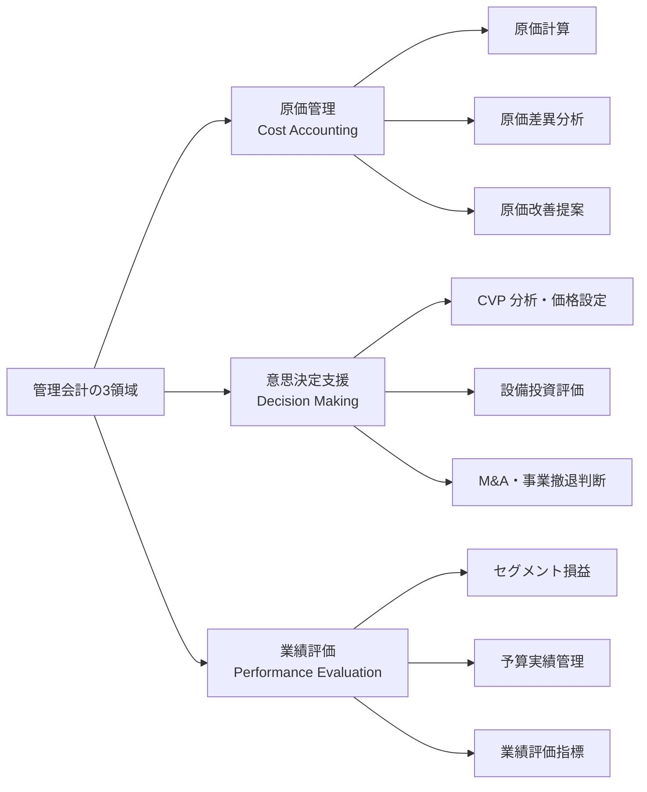
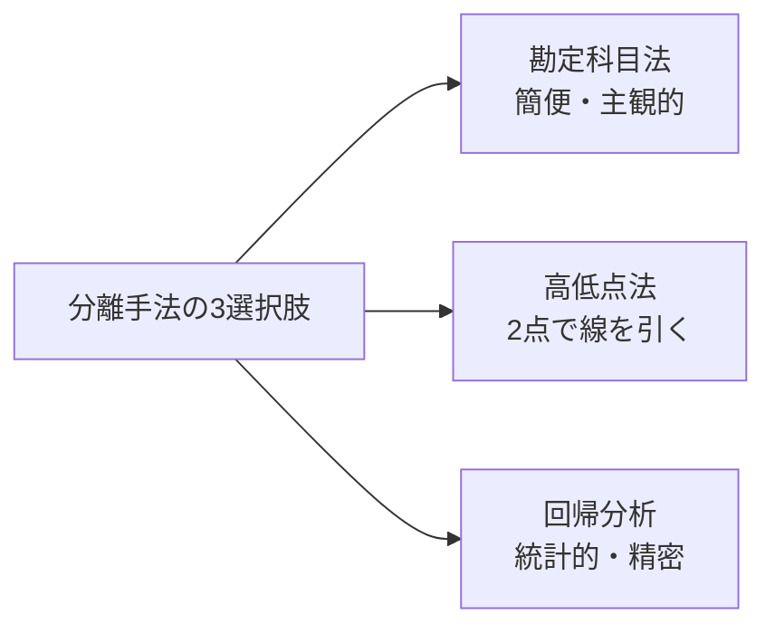
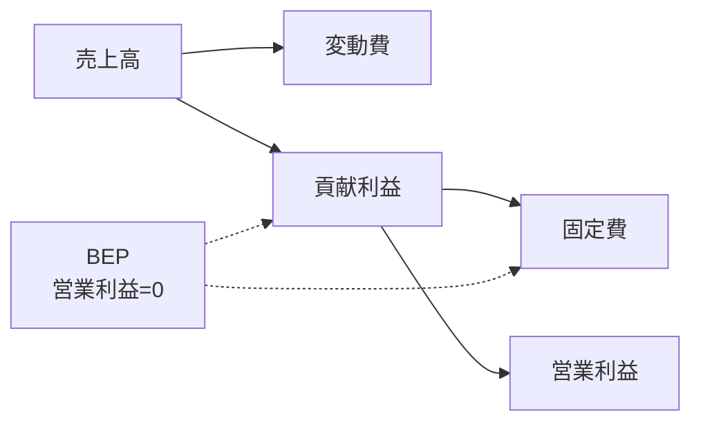
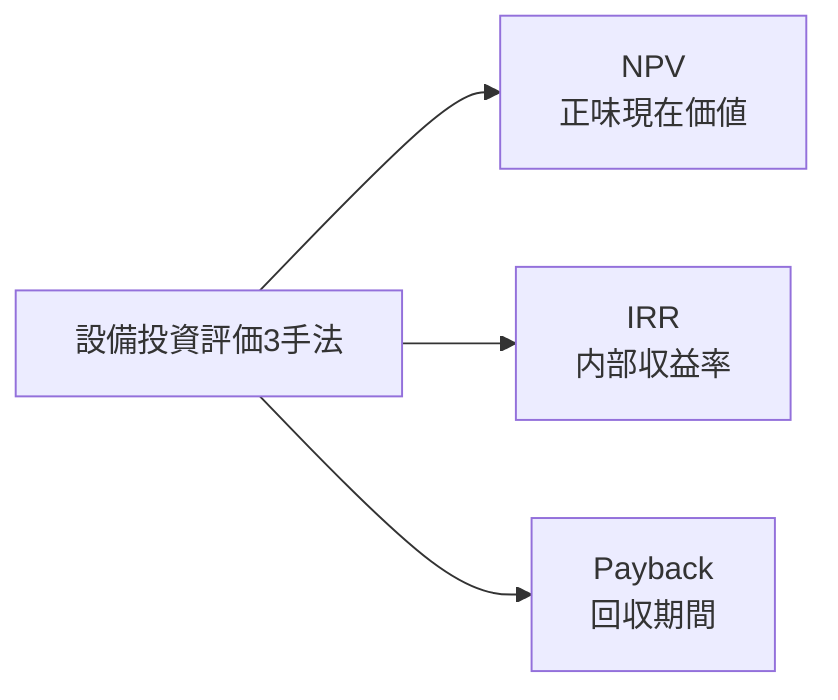
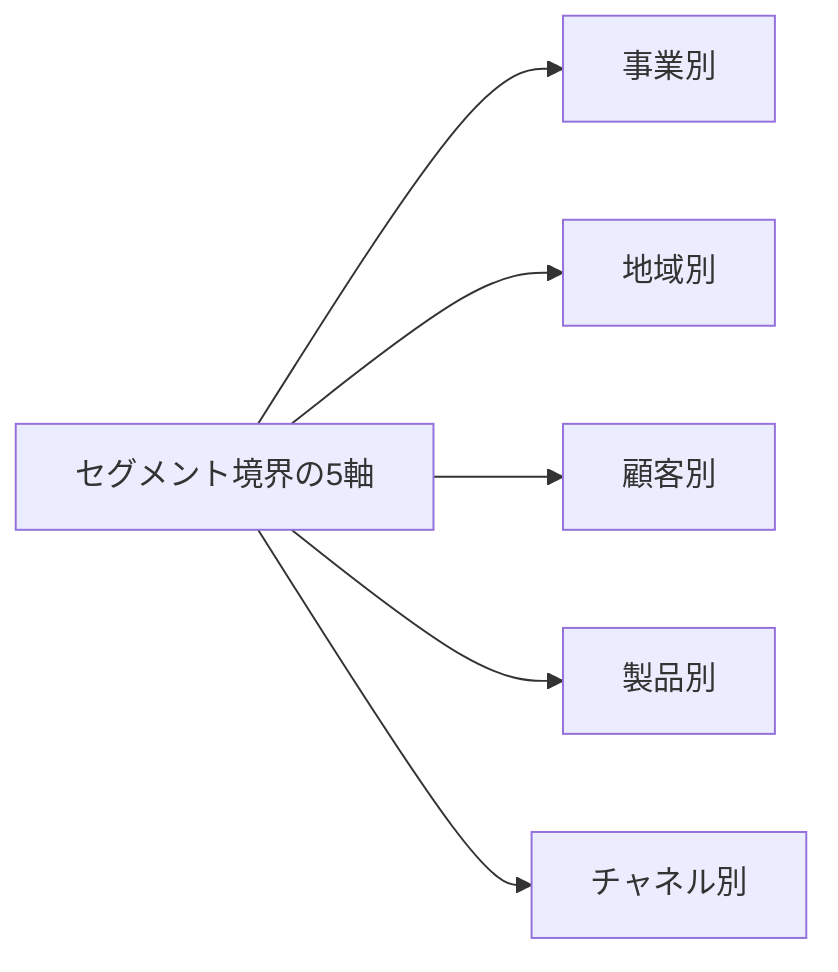
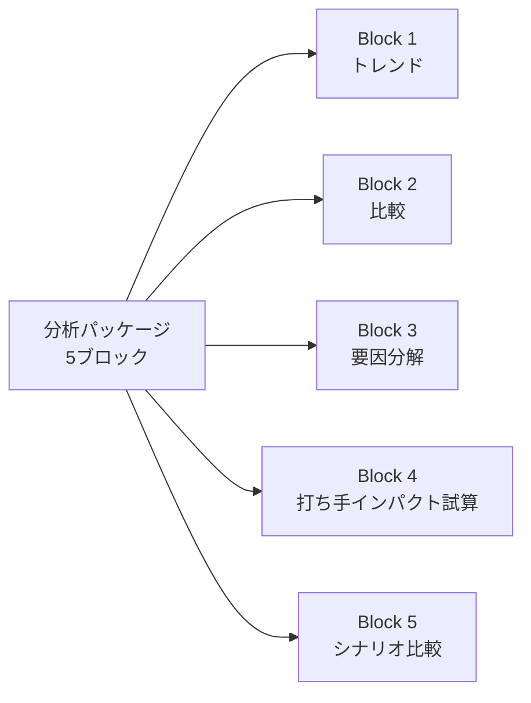

# 管理会計実践

「意思決定に使う数字を作る」——CVP 分析・原価計算・設備投資評価・セグメント損益・分析パッケージまで、中堅企業の管理会計担当者の成果物を 2026 年 7 月時点の実務で体系化

| 項目 | 内容 |
|---|---|
| カテゴリー | 経理・財務実務 |
| 難易度 | 中級 |
| 所要時間 | 約200分（全8レッスン） |
| 公開日 | 2026-07-18 |
| 最終更新日 | 2026-07-18 |
| コースURL | https://skillup.college/courses/finance/management-accounting-practical/ |

## 対象者

中堅企業（従業員 100〜1,000 名規模）の経理担当 3 年目以降・管理会計担当者・経理マネジャー・経営企画で数字を作る立場・事業部で予算/実績を扱う企画担当・CFO 候補。

## 前提知識

月次決算実務または財務諸表の読み方の内容を理解している程度。P/L・B/S の主要科目・部門別損益の基本を耳にしたことがある。

## 学習目標

- 管理会計と財務会計の対比、管理会計の 3 領域を俯瞰できる
- 変動費と固定費を分離し、貢献利益・限界利益で意思決定を支援できる
- CVP 分析と損益分岐点で価格・数量・費用構造の変化をシミュレーションできる
- 設備投資評価の NPV・IRR・Payback を計算し、稟議書に落とし込める
- セグメント損益を設計し、共通費配賦アルゴリズムと内部振替価格を扱える
- 予算編成の「作り手」として売上・販管費・人件費・CapEx の積算モデルを組み立てられる
- 経営会議のための月次分析パッケージ 5 ブロックを作成できる
- 管理会計担当者のキャリアと修了後の学び方を持ち帰れる

## コース概要

管理会計は、財務会計とは目的も基準も違う仕事です。財務会計が利害関係者に説明するための「制度に従った数字」を作るのに対し、管理会計は経営陣が意思決定するための「意思決定に使える数字」を作ります。本コースは、中堅企業（従業員 100〜1,000 名規模）の経理担当 3 年目以降、管理会計担当者、経理マネジャーを対象に、管理会計の 3 領域・原価計算・CVP 分析・設備投資評価・セグメント損益設計・予算編成の作り手実装・経営会議のための分析パッケージまでを 8 レッスンで体系化します。財務諸表の読み方・月次決算の締め・予算編成の折衝と月次予実は既刊の入門コースに譲り、本コースは「意思決定に使う数字を作る担当者」の視点に軸足を置きます。

## 学習の流れ

前半 3 レッスンで管理会計の全体像と原価・CVP の中核を扱います。レッスン 1 で管理会計と財務会計の対比と 3 領域、レッスン 2 で変動費と固定費の分離と貢献利益、レッスン 3 で CVP 分析と損益分岐点を扱います。中盤のレッスン 4 で設備投資評価、レッスン 5 でセグメント損益設計、レッスン 6 で予算編成の作り手実装を扱い、意思決定支援の作法を組み立てます。後半のレッスン 7 で経営会議のための分析パッケージ、レッスン 8 で管理会計担当のキャリアと修了後の学び方までを扱います。全 8 レッスン・約 200 分の構成です。

## レッスン一覧

| No. | タイトル | 概要 | 所要時間 |
|---|---|---|---|
| 1 | 管理会計とは何か——財務会計との対比と 3 領域 | 財務会計との対比（利害関係者向け vs 経営陣向け・法律基準 vs 内部基準）、管理会計の 3 領域（原価・意思決定・業績評価）、コース守備範囲・境界明示を学ぶ | 25分 |
| 2 | 原価計算の実務——変動費と固定費・貢献利益 | 変動費と固定費の分離手法（勘定科目法・高低点法・回帰分析）、直接原価計算 vs 全部原価計算の在庫評価差・営業利益差、貢献利益と限界利益、製造業と非製造業（サービス業の標準工数）を学ぶ | 25分 |
| 3 | CVP 分析と損益分岐点 | CVP の公式、BEP 数量・BEP 売上高、安全余裕率、価格弾力性、複数製品の加重平均貢献利益率、感度分析を学ぶ | 25分 |
| 4 | 設備投資評価 | 時間価値と割引率、NPV（正味現在価値）、IRR（内部収益率）、Payback（回収期間）、DCF、割引率設定（WACC の入口）、感度分析、投資判断稟議の型を学ぶ | 25分 |
| 5 | セグメント損益設計 | セグメント境界の切り方（事業・地域・顧客・製品・チャネル）、共通費配賦の 4 アルゴリズム、内部振替価格、ABC の導入手順、責任会計の実装を学ぶ | 25分 |
| 6 | 予算編成の「作り手」実装 | 売上予算の積算式（Volume × Mix × Price）、販売費予算のドライバー式、人件費予算と要員計画の連動、設備投資予算と CapEx 連携、勘定科目ブレイクダウン、予算モデルの構築を学ぶ | 25分 |
| 7 | 経営会議のための分析パッケージ | 月次分析パッケージの 5 ブロック（トレンド・比較・要因分解・打ち手インパクト試算・シナリオ比較）、要因ツリーによる差異分析の高度化、KPI 連鎖診断、経営陣への提示の型を学ぶ | 25分 |
| 8 | 管理会計担当のキャリアと修了後の学び方 | 管理会計担当のキャリア（経理マネジャー・FP&A・CFO・独立コンサル）、管理会計基盤（BI・DWH・SAP CO・Oracle EPM）の選定と運用、6 か月・1 年・3 年の学習ロードマップ、修了後の情報源を学ぶ | 25分 |

---

## レッスン1：管理会計とは何か——財務会計との対比と 3 領域

（所要時間：25分）

### このレッスンで学ぶこと

- 財務会計と管理会計の目的・利用者・基準・時間軸の違いを俯瞰できる
- 管理会計の 3 領域（原価管理・意思決定支援・業績評価）とそれぞれの成果物を語れる
- 管理会計担当者と経理・経営企画・事業部との役割分担を持てる
- 本コースの守備範囲と、既刊の財務・経理・経営企画の入門コースとの境界を持ち帰れる

---

管理会計と聞くと、多くの方は「経理の仕事の一部」「原価計算の難しい話」を思い浮かべます。しかし、実際の管理会計担当者が毎日していることは、事業部の意思決定を支援するために、原価を分解し、価格変更のインパクトを試算し、設備投資の稟議を評価し、月次経営会議の分析パッケージを作ることです。本レッスンでは、財務会計と管理会計の対比、管理会計の 3 領域、担当者の位置づけ、そして本コース全体で扱う範囲と扱わない範囲を整理します。

### 財務会計と管理会計の対比

管理会計を理解する最短距離は、財務会計との対比です。両者は目的も利用者も基準も違います。

| 観点 | 財務会計 | 管理会計 |
|---|---|---|
| 主な利用者 | 株主・投資家・債権者・監督官庁 | 経営陣・事業部長・部門マネジャー |
| 目的 | 過去の業績の説明責任 | 未来の意思決定支援 |
| 基準 | 会計基準（日本基準・IFRS・US GAAP）・会社法・金商法 | 内部基準（会社ごとに設計） |
| 時間軸 | 過去（年次・四半期・半期） | 過去・現在・未来（月次・週次・案件別） |
| 単位 | 法人・連結グループ全体 | 部門・製品・顧客・地域・チャネル |
| 監査 | 監査法人による外部監査 | 内部監査・自己統制 |
| 公表 | 有価証券報告書・決算短信・招集通知 | 社内限定 |

財務会計は制度会計とも呼ばれ、会計基準に従って作成する義務があります。管理会計はこの制度から解放されており、経営陣が意思決定に必要な形で数字を作る自由があります。

> **💡 ポイント**
> 財務会計は「利害関係者に説明する数字」、管理会計は「意思決定に使う数字」。両者は同じ会社の数字でも、切り方も見せ方も違います。管理会計担当者の付加価値は、この「意思決定に使える形」を作れるかどうかで決まります。

### 管理会計の 3 領域

管理会計は次の 3 領域で整理するのが古典的な枠組みです。

#### 領域 1：原価管理（Cost Accounting）

製品・サービス 1 単位の原価を計算し、原価改善の余地を提示する領域です。

- 原価計算（製造原価・サービス原価）
- 原価差異分析（標準原価との差の要因分解）
- 原価改善提案（ABC 分析・共通費見直し・アウトソース判断）

#### 領域 2：意思決定支援（Decision Making）

経営陣の意思決定を、数字の裏付けで支援する領域です。

- CVP 分析・価格設定支援
- 設備投資評価（NPV・IRR・Payback）
- M&A・事業撤退・製品ラインナップ見直しの財務評価
- シナリオ分析・感度分析

#### 領域 3：業績評価（Performance Evaluation）

事業部・部門・製品ラインの業績を可視化し、責任会計の実装を担う領域です。

- セグメント損益（事業・地域・顧客・製品別）
- 予算実績管理と差異分析
- 業績評価指標（KPI）の設計と運用

### 管理会計担当者の位置づけ

管理会計担当者は、経理・経営企画・事業部の 3 者の中間に立ちます。それぞれとの役割分担は次のとおりです。

#### 経理（月次決算・年次決算）との関係

- 経理は「制度に従った数字」を作る。管理会計は「意思決定に使う数字」を作る
- 月次決算のデータは管理会計の入力データになる
- 経理担当者と管理会計担当者を兼務する会社もあれば、独立部門になる会社もある

#### 経営企画（中計・予算・取締役会）との関係

- 経営企画は「戦略と資源配分の合意形成」を担う。管理会計は「意思決定に使える数字」を提供する
- 予算編成では、経営企画が折衝の場を運営し、管理会計が積算モデルを提供する
- 月次予実の場で、経営企画が議事進行し、管理会計が要因分解の裏付けを出す

#### 事業部（現場）との関係

- 事業部は「事業を動かす」役割。管理会計は「事業部の判断を数字で支援する」
- 新製品の価格設定、設備投資稟議、事業撤退判断で、事業部から相談を受ける立場
- 事業部の要望を鵜呑みにせず、独立した数字の視点を持つことが求められる

### コースの守備範囲と境界

本コースは管理会計を「意思決定に使う数字を作る担当者」の視点で扱います。既刊コースや関連する専門領域と明確に区別して学ぶ必要があります。

**本コースで扱う領域**：管理会計と財務会計の対比・3 領域・変動費と固定費の分離・CVP 分析と損益分岐点・設備投資評価（NPV/IRR/Payback）・セグメント損益設計・共通費配賦・内部振替価格・ABC・予算編成の作り手実装（積算モデル）・経営会議のための分析パッケージ・管理会計担当のキャリア

**本コースで扱わない領域**（別の入門コースや専門教材で扱う）：

- 三表を「読み手」として理解するスキル（P/L・B/S・C/F の科目・財務指標）は、財務諸表の読み方の入門コースを参照してください
- 月次決算の締め方（試算表・仕訳・経過勘定・引当金・部門別損益の基本）は、経理担当者向けの入門コースを参照してください
- 予算編成の年間スケジュール・部門折衝・月次予実レビューの進め方・経営会議アジェンダは、経営企画担当者向けの入門コースを参照してください
- 製造業の原価計算体系（材料費・労務費・経費・標準原価・原価差異 4 種・FIFO/移動平均/総平均）は、製造業のビジネス基礎コースを参照してください
- 簿記の資格取得は本コースの目的ではありません（本コースは資格対策ではなく実務）

> **⚠️ 注意**
> 本コースは資格試験対策コースではありません。簿記検定・公認会計士・税理士・USCPA・CMA の合格を目的とする方は、それぞれの資格専門の予備校教材を参照してください。本コースは資格ではなく、実務で使える意思決定支援の技術に集中します。

### 中堅企業における管理会計担当者の 1 年

イメージを持ちやすくするため、3 月期決算・従業員 500 名規模の会社での管理会計担当者の年間業務を示します。

- **4 月**：新年度予算の初月モニタリング、部門長への予算説明会実施
- **5〜6 月**：新製品の価格設定支援、投資稟議の評価
- **7〜9 月**：中間決算に向けた予測、上半期業績のセグメント分析
- **10〜11 月**：翌年度予算編成の積算モデル準備、中計中間見直しの数字提供
- **12〜1 月**：翌年度予算の積算・調整・取締役会付議資料作成
- **2〜3 月**：年度末業績確定、翌年度予算の最終化、次期の月次分析パッケージ設計
- **通年**：月次経営会議のための分析パッケージ作成（毎月 5 営業日前後で完成）、事業部からの意思決定支援相談

### 次のステップ

本レッスンでは管理会計と財務会計の対比・3 領域・担当者の位置づけを俯瞰しました。次のレッスンでは、原価計算の実務として、変動費と固定費の分離手法、貢献利益の考え方を扱います。CVP 分析と設備投資評価の土台となる、管理会計の中核概念です。

### 確認クイズ

このレッスンで学んだ内容を確認しましょう。

#### Q1. 財務会計と管理会計の対比として、本レッスンで示している内容として正しいものはどれか。

- [x] 財務会計は利害関係者向けで会計基準に従う義務があり、管理会計は経営陣向けで内部基準を会社ごとに設計する
- [ ] 財務会計は未来志向、管理会計は過去志向
- [ ] 財務会計は月次、管理会計は年次で作成する
- [ ] 財務会計と管理会計は同じ会計基準に従う

> **解説**
> 財務会計は利害関係者（株主・投資家・債権者・監督官庁）向けで、会計基準（日本基準・IFRS・US GAAP）・会社法・金商法に従う義務があります。管理会計は経営陣・事業部長・部門マネジャー向けで、内部基準を会社ごとに設計します。時間軸も、財務会計が過去（年次・四半期・半期）中心なのに対し、管理会計は過去・現在・未来（月次・週次・案件別）を扱います。

#### Q2. 管理会計の 3 領域として、本レッスンで挙げているものはどれか。

- [ ] 原価管理・税務・監査
- [x] 原価管理・意思決定支援・業績評価
- [ ] 原価管理・資金調達・IR
- [ ] 意思決定支援・M&A・ガバナンス

> **解説**
> 管理会計の 3 領域は「原価管理（Cost Accounting）」「意思決定支援（Decision Making）」「業績評価（Performance Evaluation）」です。原価管理は原価計算・差異分析・原価改善提案、意思決定支援は CVP 分析・設備投資評価・M&A 判断、業績評価はセグメント損益・予算実績管理・業績指標が中心となります。税務や監査は財務会計・税務会計の領域、資金調達や IR は財務・IR 部門の領域で、管理会計とは別の職務です。

#### Q3. 管理会計担当者と経営企画担当者との役割分担について、本レッスンで示している考え方はどれか。

- [ ] 管理会計担当者が経営企画担当者の業務も全て担う
- [ ] 経営企画担当者が管理会計担当者の業務も全て担う
- [x] 経営企画は「戦略と資源配分の合意形成」を担い、管理会計は「意思決定に使える数字」を提供する。予算編成では経営企画が折衝の場を運営し、管理会計が積算モデルを提供する
- [ ] 両者は完全に独立していて協働しない

> **解説**
> 経営企画は戦略立案・部門折衝・取締役会事務局といった「合意形成」を担い、管理会計は「意思決定に使える数字」を提供する役割分担が実務では標準的です。予算編成では経営企画が折衝の場を運営し、管理会計が積算モデルを提供する形が典型で、月次予実の場でも経営企画が議事進行し、管理会計が要因分解の裏付けを出します。両者は独立した役割を持ちつつ密接に協働する関係にあります。

#### Q4. 本コースの守備範囲として、扱わない領域はどれか。

- [ ] CVP 分析と損益分岐点
- [ ] 設備投資評価（NPV/IRR/Payback）
- [ ] セグメント損益設計と共通費配賦
- [x] 三表を「読み手」として理解するスキル・月次決算の締め方・予算編成の年間スケジュールと部門折衝

> **解説**
> 本コースは管理会計を「意思決定に使う数字を作る担当者」の視点で扱います。三表を「読み手」として理解するスキルは財務諸表の読み方の入門コース、月次決算の締め方は経理担当者向けの入門コース、予算編成の年間スケジュール・部門折衝・月次予実レビューの進め方は経営企画担当者向けの入門コースに譲ります。本コースの中核は、CVP 分析・設備投資評価・セグメント損益設計・予算編成の作り手実装・経営会議のための分析パッケージという「数字の作り方」に振り切っています。

---

## レッスン2：原価計算の実務——変動費と固定費・貢献利益

（所要時間：25分）

### このレッスンで学ぶこと

- 変動費と固定費を分離する 3 手法（勘定科目法・高低点法・回帰分析）を持てる
- 直接原価計算と全部原価計算の違い（在庫評価差・営業利益差）を持てる
- 貢献利益と限界利益で意思決定を支援する枠組みを持てる
- 製造業だけでなくサービス業への原価計算応用（標準工数）を扱える

---

前レッスンでは管理会計と財務会計の対比・3 領域を俯瞰しました。本レッスンでは、管理会計の中核概念である「変動費と固定費の分離」「貢献利益」を扱います。この分離ができるかどうかが、CVP 分析（レッスン 3）、設備投資評価（レッスン 4）、セグメント損益（レッスン 5）、予算編成（レッスン 6）すべての土台になります。

### なぜ変動費と固定費の分離が必要か

財務会計の損益計算書では、費用は「売上原価」「販売費および一般管理費」「営業外費用」に分類されます。しかし、この分類のままでは意思決定に使えません。例えば「売上が 10 %増えたら利益はいくら増えるか」という問いに答えるには、費用のうち「売上に連動する部分（変動費）」と「連動しない部分（固定費）」を分離する必要があります。

- **変動費（Variable Cost）**：売上や生産量に連動して増減する費用（原材料費・外注加工費・販売手数料・運送費）
- **固定費（Fixed Cost）**：売上や生産量に関係なく発生する費用（人件費の一部・地代家賃・減価償却費・保険料）
- **準変動費（Semi-variable Cost）**：基本料金部分は固定、使用量部分は変動する費用（電気料金・水道料金）

この分離は管理会計担当者が「毎回自分の判断で」行う作業です。会計基準は分離方法を定めていません。

### 変動費と固定費の分離手法

分離手法は主に 3 つあります。会社の規模と精度要求で使い分けます。

#### 手法 1：勘定科目法（Account Analysis Method）

勘定科目ごとに「これは変動費」「これは固定費」と分類する手法です。中堅企業で最も広く使われています。

- 手順：総勘定元帳の勘定科目ごとに、実務経験から変動 or 固定を判断
- 長所：短時間・簡便・部門との会話がしやすい
- 短所：主観的、準変動費の扱いが難しい

#### 手法 2：高低点法（High-Low Method）

過去データの最高点と最低点の 2 点で直線を引き、変動費率と固定費を算出する手法です。

- 手順：過去 12〜24 か月の「操業度（生産量・売上高）」と「費用」の 2 点（最高操業度・最低操業度）を取り、直線式を作る
- 変動費率 =（最高費用 − 最低費用）÷（最高操業度 − 最低操業度）
- 固定費 = 最高費用 − 変動費率 × 最高操業度
- 長所：計算が簡単、Excel で数分
- 短所：2 点だけに依存するため異常値に弱い

#### 手法 3：回帰分析（Regression Analysis）

過去データ全体に対して最小二乗法で回帰直線を引く手法です。

- 手順：Excel の SLOPE・INTERCEPT 関数、または LINEST 関数で計算
- 変動費率 = 回帰直線の傾き
- 固定費 = 回帰直線の切片
- 長所：全データを使うため統計的に信頼性が高い、R² で当てはまり度も評価できる
- 短所：異常値の判断・除外に統計知識が必要、非線形の費用挙動には対応しにくい

> **📝 補足**
> 中堅企業では勘定科目法から始め、精度向上のニーズが出た段階で高低点法・回帰分析に進むのが一般的です。全てを回帰分析で行うと運用負荷が高く、勘定科目法で 80 % の精度を出せば実務では十分なことが多いです。

### 直接原価計算と全部原価計算

原価計算には 2 つの方式があります。財務会計は全部原価計算を用いますが、管理会計では直接原価計算のほうが意思決定に適しています。

#### 直接原価計算（Direct Costing / Variable Costing）

変動費のみを製品原価として集計し、固定費は期間費用として一括処理する方式です。

- 製品原価 = 変動費のみ
- 固定費 = 発生期間の費用
- 損益計算書の構造：売上高 − 変動費 = 貢献利益 − 固定費 = 営業利益

#### 全部原価計算（Full Costing / Absorption Costing）

変動費と固定製造原価の両方を製品原価に含める方式です。財務会計（会計基準）では原則としてこちらを使います。

- 製品原価 = 変動費 + 固定製造原価
- 損益計算書の構造：売上高 − 売上原価 = 売上総利益 − 販管費 = 営業利益

#### 2 方式の在庫評価差・営業利益差

生産量と販売量が一致する場合、両方式の営業利益は一致します。しかし、生産量 > 販売量（在庫増加）の場合、全部原価計算は固定製造原価の一部を在庫に繰り延べるため、直接原価計算より営業利益が高く出ます。逆に生産量 < 販売量（在庫減少）の場合、直接原価計算より営業利益が低く出ます。

管理会計では、この在庫による利益変動を排除するため、直接原価計算のほうが期間業績評価に適するとされます。

### 貢献利益と限界利益

管理会計の意思決定支援で最も使う指標が貢献利益です。

- **貢献利益（Contribution Margin）** = 売上高 − 変動費
- **貢献利益率** = 貢献利益 ÷ 売上高
- **限界利益（Marginal Profit）** = 追加 1 単位を売った時の利益の増加

貢献利益は固定費の回収と営業利益の源泉となる金額を意味します。「この製品は貢献利益がいくらか」「価格を 5 %下げても数量が 20 %増えれば貢献利益は改善するか」といった意思決定の中核指標として機能します。

#### 貢献利益の応用例

- **製品の撤退判断**：貢献利益がプラスの製品は、撤退すると固定費の回収先が減るため慎重に判断する
- **価格変更のシミュレーション**：価格弾力性と組み合わせて「価格 −5 % ／数量 +15 %」といった変化の総影響を試算
- **新規受注の価格設定**：既存の固定費が回収済みなら、追加受注は変動費以上の価格で受注すれば貢献利益がプラス

### 製造業とサービス業の原価計算

原価計算というと製造業をイメージしがちですが、サービス業にも同じ枠組みが適用できます。ただし、原価の中心が違います。

#### 製造業の原価構造

- 材料費（原材料・部品）
- 労務費（製造ラインの人件費）
- 経費（水道光熱費・減価償却費・外注加工費）
- 標準原価計算（材料標準・時間標準・レート標準）が体系化されている

#### サービス業の原価構造

- 労務費が原価の 60〜80 %を占める
- 材料費は少ない（例：コンサル・IT サービス）
- **標準工数管理**が中核（案件別の想定工数と実績工数の差を管理）
- 直接時間の生産性と間接時間の管理が業績を左右

サービス業の管理会計では、「人時（にんじ）」または「人日」を単位として、案件別のコストを積み上げます。この考え方は IT SaaS・コンサル・広告・法律事務所・会計事務所・建築設計事務所などで広く使われています。

> **📖 もっと詳しく**
> 製造業の詳細な原価計算体系（材料費・労務費・経費の 3 区分、標準原価計算の 4 種の差異分析、FIFO/移動平均/総平均の在庫評価）は本コースでは概念紹介に留めます。詳細は業種別実務の入門コースを参照してください。本コースは「非製造業にも応用できる管理会計の共通枠組み」に集中します。

### 確認クイズ

このレッスンで学んだ内容を確認しましょう。

#### Q1. 変動費と固定費の分離手法として、本レッスンで挙げていないものはどれか。

- [x] 感覚推定法——担当者の直感で分類する
- [ ] 勘定科目法——勘定科目ごとに実務経験から変動 or 固定を判断
- [ ] 高低点法——過去データの最高点と最低点の 2 点で直線を引く
- [ ] 回帰分析——最小二乗法で回帰直線を引き、傾きと切片を求める

> **解説**
> 本レッスンで挙げている 3 手法は「勘定科目法」「高低点法」「回帰分析」です。感覚推定法という用語は管理会計で標準的に用いられる分類手法ではなく、実務でも根拠が薄いため使いません。中堅企業では勘定科目法から始め、精度向上のニーズが出た段階で高低点法・回帰分析に進むのが一般的です。

#### Q2. 直接原価計算と全部原価計算の違いについて、本レッスンで示している内容として正しいものはどれか。

- [ ] 直接原価計算は固定費と変動費の両方を製品原価に含める
- [x] 直接原価計算は変動費のみを製品原価とし、固定費は期間費用として一括処理する。全部原価計算は変動費と固定製造原価の両方を製品原価に含める
- [ ] 全部原価計算は在庫評価を行わない
- [ ] 両方式は同じ計算結果になる

> **解説**
> 直接原価計算は変動費のみを製品原価とし、固定費は期間費用として一括処理する方式です。全部原価計算は変動費と固定製造原価の両方を製品原価に含める方式で、財務会計（会計基準）では原則としてこちらを使います。生産量と販売量が一致する場合、両方式の営業利益は一致しますが、生産量 > 販売量（在庫増加）の場合、全部原価計算は固定製造原価の一部を在庫に繰り延べるため、直接原価計算より営業利益が高く出ます。

#### Q3. 貢献利益の意思決定応用として、本レッスンで示している考え方はどれか。

- [ ] 貢献利益がマイナスの製品は必ず即撤退する
- [ ] 貢献利益は財務諸表の主要指標として株主に開示する
- [x] 貢献利益がプラスの製品は、撤退すると固定費の回収先が減るため慎重に判断する。価格変更や新規受注の意思決定でも貢献利益で試算する
- [ ] 貢献利益は税務申告に使用する

> **解説**
> 貢献利益（売上高 − 変動費）は固定費の回収と営業利益の源泉となる金額です。貢献利益がプラスの製品は、撤退すると固定費の回収先が減るため慎重に判断する必要があります。逆に価格変更のシミュレーション（価格 −5 % ／数量 +15 % など）や、既存固定費が回収済みでの新規追加受注の判断でも、貢献利益が中核指標として機能します。財務諸表の主要指標や税務申告には使用せず、管理会計の内部利用です。

#### Q4. サービス業の原価計算について、本レッスンで示している中核はどれか。

- [ ] 材料費が原価の 60〜80 % を占める
- [ ] 標準原価計算（材料標準・時間標準・レート標準）が中心
- [ ] 在庫評価（FIFO・移動平均・総平均）が業績を左右する
- [x] 労務費が原価の 60〜80 % を占め、標準工数管理（案件別の想定工数と実績工数の差を管理）が中核

> **解説**
> サービス業の原価構造は労務費が 60〜80 % を占め、材料費は少ない特徴があります。管理の中核は「標準工数管理」で、案件別の想定工数と実績工数の差を管理します。IT SaaS・コンサル・広告・法律事務所・会計事務所・建築設計事務所などで広く使われる枠組みです。材料費中心の在庫評価は製造業の話で、サービス業の中核ではありません。

---

## レッスン3：CVP 分析と損益分岐点

（所要時間：25分）

### このレッスンで学ぶこと

- CVP 分析の公式（利益 = 貢献利益単価 × 数量 − 固定費）を扱える
- 損益分岐点（BEP）を数量ベース・売上高ベースで算出できる
- 安全余裕率・価格弾力性・複数製品の加重平均貢献利益率を持てる
- 感度分析で価格・数量・費用構造の変化の影響を試算できる

---

前レッスンでは変動費と固定費の分離、貢献利益の考え方を扱いました。本レッスンでは、貢献利益を土台とする CVP 分析（Cost-Volume-Profit Analysis）と損益分岐点（Break-Even Point：BEP）を扱います。CVP は管理会計の中で最も応用範囲が広い意思決定支援ツールで、価格設定・数量計画・費用構造見直しのシミュレーションに毎日使う枠組みです。

### CVP 分析とは

CVP 分析は、費用（Cost）・数量（Volume）・利益（Profit）の 3 要素の関係を数式化し、いずれか 1 つを動かした時のほかの 2 つへの影響を試算する枠組みです。管理会計担当者が経営陣に「価格を 5 % 下げたらどうなるか」「数量が 20 % 増えたらどうなるか」といった問いに答える基礎となります。

#### CVP の基本公式

- 売上高 = 単価 × 数量
- 変動費 = 変動費単価 × 数量
- 貢献利益 = 売上高 − 変動費 = （単価 − 変動費単価）× 数量 = 貢献利益単価 × 数量
- 営業利益 = 貢献利益 − 固定費 = 貢献利益単価 × 数量 − 固定費

例：単価 1,000 円、変動費単価 600 円、固定費 400 万円の製品
- 貢献利益単価 = 1,000 − 600 = 400 円
- 数量 10,000 個の営業利益 = 400 × 10,000 − 4,000,000 = 0 円
- 数量 12,000 個の営業利益 = 400 × 12,000 − 4,000,000 = 800,000 円

### 損益分岐点（BEP）の算出

損益分岐点は、営業利益がちょうどゼロになる数量・売上高です。「最低限これだけ売らないと赤字」の水準を示します。

#### BEP 数量

- BEP 数量 = 固定費 ÷ 貢献利益単価
- 上の例：4,000,000 ÷ 400 = 10,000 個

#### BEP 売上高

- BEP 売上高 = 固定費 ÷ 貢献利益率
- 貢献利益率 = 貢献利益単価 ÷ 単価 = 400 ÷ 1,000 = 40 %
- BEP 売上高 = 4,000,000 ÷ 0.4 = 10,000,000 円

### 安全余裕率

BEP からどれだけ売上に余裕があるかを示す指標です。

- 安全余裕率 =（実際売上高 − BEP 売上高）÷ 実際売上高

安全余裕率が高いほど、売上減少への耐性が高い会社です。業種の目安として、製造業で 20 %、小売業で 15 %、SaaS で 30 % 以上あれば健全とされます。

### 価格弾力性と CVP の組み合わせ

CVP 分析の応用で最も頻繁に問われるのが「価格を下げたら数量はどう変わり、利益はどうなるか」というシミュレーションです。ここで登場するのが価格弾力性です。

- 価格弾力性 = 数量変化率 ÷ 価格変化率（絶対値）
- 弾力性 > 1：価格に敏感（下げれば数量が大きく増える）
- 弾力性 = 1：価格変化率と数量変化率が等しい
- 弾力性 < 1：価格に鈍感（下げても数量はあまり増えない）

#### シミュレーション例

前述の例（単価 1,000 円、変動費単価 600 円、固定費 400 万円、現在数量 12,000 個、営業利益 80 万円）で、価格を 5 % 下げた場合の 2 シナリオ：

**弾力性 = 1.5 の場合（数量 +7.5 %）**
- 新単価 950 円、新数量 12,900 個
- 貢献利益単価 = 950 − 600 = 350 円
- 営業利益 = 350 × 12,900 − 4,000,000 = 515,000 円
- → 従来 80 万円から 51.5 万円に減少（悪化）

**弾力性 = 3 の場合（数量 +15 %）**
- 新単価 950 円、新数量 13,800 個
- 営業利益 = 350 × 13,800 − 4,000,000 = 830,000 円
- → 従来 80 万円から 83 万円に微増（改善）

弾力性が読めない場合は、この 2 パターンを並べて経営陣に判断材料として提示します。

### 複数製品の加重平均貢献利益率

現実には 1 製品ではなく複数製品を扱います。複数製品の CVP 分析では、加重平均貢献利益率で全社の BEP を算出します。

#### 加重平均貢献利益率の算出

売上構成比で加重した貢献利益率です。

例：
- 製品 A：売上構成比 40 %、貢献利益率 50 %
- 製品 B：売上構成比 35 %、貢献利益率 30 %
- 製品 C：売上構成比 25 %、貢献利益率 20 %

加重平均貢献利益率 = 0.4 × 0.5 + 0.35 × 0.3 + 0.25 × 0.2 = 0.2 + 0.105 + 0.05 = 35.5 %

固定費 3,000 万円の場合、BEP 売上高 = 30,000,000 ÷ 0.355 ≒ 84,507,000 円

売上構成比が変わると加重平均貢献利益率も変わるため、製品ミックスの変化がどう利益に効くかを試算するときにも使います。

### 感度分析（Sensitivity Analysis）

CVP 分析の真骨頂は感度分析です。単価・変動費単価・数量・固定費の 4 つの入力それぞれに変化を与え、営業利益がどう動くかを表にします。

| 変化させる要素 | −10 % | 現状 | +10 % |
|---|---|---|---|
| 単価 | 営業利益 X 万円 | 営業利益 Y 万円 | 営業利益 Z 万円 |
| 変動費単価 | 営業利益 X 万円 | 営業利益 Y 万円 | 営業利益 Z 万円 |
| 数量 | 営業利益 X 万円 | 営業利益 Y 万円 | 営業利益 Z 万円 |
| 固定費 | 営業利益 X 万円 | 営業利益 Y 万円 | 営業利益 Z 万円 |

Excel のデータ・シミュレーション機能（「What-If 分析」→「データテーブル」）を使うと、この表を数分で作れます。感度分析の表を見ることで、経営陣は「どの要素が利益に最も効くか」を直感的に理解できます。

> **💡 ポイント**
> CVP 分析の答えは「1 つの数字」ではなく「感度分析の表」です。経営陣に単一の予測値を出すと外れた時に信頼を失いますが、感度分析の表を出せば「前提が変わったらどうなるか」を経営陣自身が判断できます。管理会計担当者の付加価値は、答えを出すことではなく判断材料を出すことにあります。

### 次のステップ

本レッスンでは CVP 分析と損益分岐点、感度分析を扱いました。次のレッスンでは、より長期の意思決定として設備投資評価（NPV・IRR・Payback）を扱います。時間軸が数年に伸びると割引率と時間価値の概念が加わりますが、根っこにあるのは同じ「意思決定に使う数字を作る」という発想です。

### 確認クイズ

このレッスンで学んだ内容を確認しましょう。

#### Q1. CVP 分析の基本公式として、本レッスンで示しているものはどれか。

- [x] 営業利益 = 貢献利益単価 × 数量 − 固定費、貢献利益 = 売上高 − 変動費
- [ ] 営業利益 = 売上高 × 貢献利益率
- [ ] 営業利益 = 単価 × 数量 − 固定費
- [ ] 営業利益 = 貢献利益 + 固定費

> **解説**
> CVP 分析の基本公式は「営業利益 = 貢献利益単価 × 数量 − 固定費」で、貢献利益は「売上高 − 変動費」です。この式を使えば、単価・変動費単価・数量・固定費のいずれかを動かした時の営業利益への影響を試算できます。営業利益 = 単価 × 数量 − 固定費（変動費を無視）や、営業利益 = 貢献利益 + 固定費（固定費の符号が逆）は誤りです。

#### Q2. 損益分岐点（BEP）売上高の算出式として、本レッスンで示しているものはどれか。

- [ ] BEP 売上高 = 固定費 × 貢献利益率
- [x] BEP 売上高 = 固定費 ÷ 貢献利益率
- [ ] BEP 売上高 = 変動費 ÷ 貢献利益率
- [ ] BEP 売上高 = 固定費 + 変動費

> **解説**
> BEP 売上高は「固定費 ÷ 貢献利益率」で算出します。貢献利益率は「貢献利益単価 ÷ 単価」で、固定費を貢献利益率で割ることで、営業利益がゼロになる売上高を得ます。数量ベースでは「BEP 数量 = 固定費 ÷ 貢献利益単価」となります。BEP 数量に単価を掛けても同じ BEP 売上高が得られます。

#### Q3. 価格弾力性の考え方について、本レッスンで示している内容として正しいものはどれか。

- [ ] 弾力性の値は常に 1 未満である
- [ ] 弾力性が低いほど価格に敏感である
- [x] 弾力性 > 1 は価格に敏感（下げれば数量が大きく増える）、弾力性 < 1 は価格に鈍感（下げても数量はあまり増えない）
- [ ] 弾力性は貢献利益とは無関係な指標である

> **解説**
> 価格弾力性は「数量変化率 ÷ 価格変化率（絶対値）」で、弾力性 > 1 は価格に敏感（下げれば数量が大きく増える）、弾力性 < 1 は価格に鈍感（下げても数量はあまり増えない）を意味します。実務では弾力性を正確に読むのは難しいため、複数のシナリオ（弾力性 1.5 / 3 など）で CVP を計算し、経営陣に判断材料として提示します。

#### Q4. 感度分析について、本レッスンで示している考え方はどれか。

- [ ] 感度分析は不要で、単一の予測値を経営陣に提示する
- [ ] 感度分析は変動費のみに対して行う
- [ ] 感度分析は年 1 回、決算後にまとめて行う
- [x] 単価・変動費単価・数量・固定費の 4 つの入力それぞれに変化を与え、営業利益への影響を表にする。Excel のデータテーブルで作成できる

> **解説**
> 感度分析は CVP 分析の真骨頂で、単価・変動費単価・数量・固定費の 4 つの入力それぞれに ±10 % などの変化を与え、営業利益がどう動くかを表にします。Excel のデータテーブル機能を使うと数分で作成できます。経営陣に単一の予測値を出すと外れた時に信頼を失いますが、感度分析の表を出せば「前提が変わったらどうなるか」を経営陣自身が判断できます。管理会計担当者の付加価値は、答えを出すことではなく判断材料を出すことにあります。

---

## レッスン4：設備投資評価

（所要時間：25分）

### このレッスンで学ぶこと

- 時間価値と割引率の考え方を持てる
- NPV（正味現在価値）・IRR（内部収益率）・Payback（回収期間）の 3 手法を計算できる
- 割引率設定（WACC の入口）と感度分析の作法を持ち帰れる
- 投資判断稟議に落とし込むための構成要素を扱える

---

前レッスンでは CVP 分析と損益分岐点を扱いました。本レッスンでは、CVP と並ぶ管理会計の意思決定支援ツールである設備投資評価を扱います。設備投資は数千万円〜数十億円の資金を数年〜十数年にわたって拘束する重要な意思決定で、管理会計担当者が経営陣・取締役会に判断材料を提供する場面の代表格です。

### なぜ時間価値が必要か

「今日の 100 万円」と「10 年後の 100 万円」は、金額が同じでも価値は違います。今日の 100 万円は、投資すれば 10 年後に増えているはずだからです。この考え方を「時間価値」と呼び、将来のキャッシュフローを現在の価値に引き戻す（割り引く）ことを「割引計算」と呼びます。

- 現在価値（Present Value：PV）＝ 将来キャッシュフロー ÷ （1 + 割引率）^ n年
- 例：割引率 5 %、10 年後の 100 万円の現在価値 = 1,000,000 ÷ 1.05^10 ≒ 613,913 円

設備投資評価では、将来数年〜十数年に渡って発生するキャッシュフローを、割引計算で現在価値に引き戻し、投資額と比較します。

### 設備投資評価の 3 手法

主要な評価手法は 3 つあります。

#### 手法 1：NPV（Net Present Value：正味現在価値）

投資による将来キャッシュフロー全ての現在価値の合計から、投資額を差し引いた金額です。

- NPV = Σ（各年のキャッシュフロー ÷ （1 + 割引率）^ n） − 初期投資額
- NPV > 0：投資すべき（価値創造）
- NPV = 0：判断は他要素で
- NPV < 0：投資すべきでない（価値棄損）

**計算例**：初期投資 1,000 万円、5 年間で毎年 300 万円のキャッシュフロー、割引率 8 %

| 年 | キャッシュフロー | 割引率係数 | 現在価値 |
|---|---|---|---|
| 0 | -10,000,000 | 1.000 | -10,000,000 |
| 1 | 3,000,000 | 0.926 | 2,777,778 |
| 2 | 3,000,000 | 0.857 | 2,572,016 |
| 3 | 3,000,000 | 0.794 | 2,381,496 |
| 4 | 3,000,000 | 0.735 | 2,205,089 |
| 5 | 3,000,000 | 0.681 | 2,041,749 |

NPV = -10,000,000 + 11,978,128 = 1,978,128 円 → 投資すべき

Excel では NPV 関数（=NPV(割引率, 1年目CF, 2年目CF, ...) - 初期投資額）で計算できます。

#### 手法 2：IRR（Internal Rate of Return：内部収益率）

NPV がゼロになる割引率です。「この投資が生み出す利回り」を意味します。

- IRR > 目標収益率（ハードルレート）：投資すべき
- IRR < 目標収益率：投資すべきでない

上の例では、IRR = 15.24 %。目標収益率が 8 % なので投資すべき、と判断できます。

Excel では IRR 関数（=IRR(キャッシュフロー範囲)）で計算できます。

#### 手法 3：Payback（Payback Period：回収期間）

初期投資が回収されるまでの年数です。割引を考慮しない単純 Payback と、割引を考慮した割引 Payback があります。

- 単純 Payback = 初期投資 ÷ 年間キャッシュフロー（キャッシュフローが一定の場合）
- 上の例では 10,000,000 ÷ 3,000,000 ≒ 3.33 年

Payback の長所は直感的で説明しやすいこと。短所は Payback 後のキャッシュフローを無視するため、長期的な価値創造を評価しづらいことです。実務では NPV・IRR と併用します。

### 割引率の設定——WACC の入口

割引率をいくらに設定するかで NPV も IRR の判定も変わります。実務では割引率として「WACC（Weighted Average Cost of Capital：加重平均資本コスト）」を用いるのが標準です。

- WACC = 負債コスト × 負債比率 × (1 − 実効税率) + 自己資本コスト × 自己資本比率
- 負債コスト = 借入金の平均金利
- 自己資本コスト = リスクフリーレート + β × リスクプレミアム（CAPM）

**中堅企業での実務目安**：
- 上場企業：WACC 5〜10 %
- 非上場中堅企業：8〜15 %（借入金利＋リスクプレミアム）
- スタートアップ：20〜30 %

WACC の正確な計算は財務理論の領域ですが、管理会計担当者としては「会社の資本コスト水準」を把握し、稟議での割引率設定の根拠を持つことが求められます。

> **📖 もっと詳しく**
> WACC の詳細な計算（CAPM・β 値の算出・リスクプレミアム設定）は本コースでは概念紹介に留めます。詳細はコーポレートファイナンス専門書または財務・M&A の実務書を参照してください。本コースは「WACC を割引率として使うために必要な入口」に集中します。

### 感度分析——設備投資でも「シナリオの表」

CVP 分析と同じく、設備投資評価でも単一の NPV 値ではなく感度分析で経営陣に提示するのが実務です。

**設備投資の感度分析軸**：
- 初期投資額（±10 %）
- 年間キャッシュフロー（±20 %）
- 事業継続年数（3 年 / 5 年 / 10 年）
- 割引率（5 % / 8 % / 12 %）

これらを組み合わせて NPV の表を作り、「最悪ケースでも NPV プラスか」「最良ケースでどれだけの価値創造か」を示します。

### 投資判断稟議の型

管理会計担当者が投資判断稟議書に落とし込む場合、次の 6 要素で構成します。

#### 要素 1：投資の背景と戦略適合

- なぜこの投資が必要か（事業戦略との整合）
- 投資しない場合のリスク（機会損失）

#### 要素 2：投資額と資金調達

- 初期投資額の内訳（設備・人件費・IT・その他）
- 資金調達方法（自己資金・借入・リース）

#### 要素 3：期待キャッシュフロー

- 収益向上効果（売上増・単価向上）
- コスト削減効果（人件費・材料費・エネルギー費）
- キャッシュアウト（追加運転資金・保守費用）
- ネットキャッシュフロー（税引き後）の年次推移

#### 要素 4：財務評価

- NPV（3 割引率シナリオ）
- IRR
- Payback（単純・割引）
- 感度分析の表

#### 要素 5：定量的リスク

- 市場リスク（需要変動・価格変動）
- 事業リスク（技術陳腐化・競合参入）
- 撤退基準（何年間 NPV 目標未達なら撤退か）

#### 要素 6：定性的評価

- 戦略的意義（市場ポジション・ケイパビリティ蓄積）
- ステークホルダーへの影響（従業員・顧客・地域社会）

この 6 要素が揃った稟議書は、取締役会での議論を高い次元に持ち上げます。管理会計担当者は「NPV を計算する人」ではなく、「投資判断の材料を整える人」として価値を発揮します。

### 次のステップ

本レッスンでは設備投資評価の 3 手法（NPV・IRR・Payback）と割引率設定、感度分析、投資判断稟議の型を扱いました。次のレッスンでは、業績評価の中核であるセグメント損益設計を扱います。事業・地域・顧客・製品などの単位で損益を可視化し、経営陣の意思決定に繋げる技術です。

### 確認クイズ

このレッスンで学んだ内容を確認しましょう。

#### Q1. 時間価値の考え方について、本レッスンで示している内容として正しいものはどれか。

- [x] 将来キャッシュフローを現在の価値に引き戻す（割り引く）計算を割引計算と呼び、現在価値 = 将来キャッシュフロー ÷ （1 + 割引率）^ n で算出する
- [ ] 将来キャッシュフローと現在キャッシュフローは同じ価値
- [ ] 割引率は常に 1 %に設定する
- [ ] 割引計算は税務申告に用いる

> **解説**
> 時間価値の考え方は、今日の 100 万円と 10 年後の 100 万円では価値が違う（今日の 100 万円は投資すれば増える）というものです。将来キャッシュフローを現在価値に引き戻す計算式は「現在価値 = 将来キャッシュフロー ÷ （1 + 割引率）^ n年」です。割引率は会社の資本コスト（WACC）を用いるのが実務標準で、上場企業で 5〜10 %、非上場中堅で 8〜15 % が目安です。

#### Q2. NPV（正味現在価値）について、本レッスンで示している判定基準はどれか。

- [ ] NPV > 100 万円なら投資すべき
- [x] NPV > 0 なら投資すべき（価値創造）、NPV < 0 なら投資すべきでない（価値棄損）
- [ ] NPV は投資判断とは無関係
- [ ] NPV は Payback と一致する

> **解説**
> NPV は「投資による将来キャッシュフロー全ての現在価値の合計から、投資額を差し引いた金額」で、判定基準は「NPV > 0：投資すべき（価値創造）」「NPV = 0：判断は他要素で」「NPV < 0：投資すべきでない（価値棄損）」です。特定の金額の閾値ではなくゼロを基準に判断します。IRR や Payback とは別の指標で、実務では 3 手法を併用します。

#### Q3. 割引率として実務で用いる WACC について、本レッスンで示している考え方はどれか。

- [ ] WACC は借入金利のみで計算する
- [ ] WACC は上場企業でのみ計算できる
- [x] WACC = 負債コスト × 負債比率 × (1 − 実効税率) + 自己資本コスト × 自己資本比率。上場企業で 5〜10 %、非上場中堅企業で 8〜15 %、スタートアップで 20〜30 % が目安
- [ ] WACC は 1 % に固定する

> **解説**
> WACC（加重平均資本コスト）は「負債コスト × 負債比率 × (1 − 実効税率) + 自己資本コスト × 自己資本比率」で計算します。借入金利のみでなく、自己資本コスト（リスクフリーレート + β × リスクプレミアム）も加重平均に含めます。実務目安として、上場企業で 5〜10 %、非上場中堅企業で 8〜15 %（借入金利＋リスクプレミアム）、スタートアップで 20〜30 % 程度です。管理会計担当者としては、正確な CAPM 計算より「自社の資本コスト水準」を把握し、稟議での割引率設定の根拠を持つことが求められます。

#### Q4. 投資判断稟議書の 6 要素として、本レッスンで挙げていないものはどれか。

- [ ] 投資の背景と戦略適合
- [ ] 期待キャッシュフロー
- [ ] 財務評価（NPV・IRR・Payback・感度分析）
- [x] 従業員の TOEIC スコアと英語研修計画

> **解説**
> 本レッスンで挙げている投資判断稟議書の 6 要素は「投資の背景と戦略適合／投資額と資金調達／期待キャッシュフロー／財務評価／定量的リスク／定性的評価」です。従業員の TOEIC スコアや英語研修計画は投資判断稟議の要素ではなく、人材開発の領域です。管理会計担当者は「NPV を計算する人」ではなく、「投資判断の材料を整える人」として、この 6 要素を揃えることで価値を発揮します。

---

## レッスン5：セグメント損益設計

（所要時間：25分）

### このレッスンで学ぶこと

- セグメント境界の 5 軸（事業・地域・顧客・製品・チャネル）を設計できる
- 共通費配賦の 4 アルゴリズムを使い分けられる
- 内部振替価格の設定と ABC の導入手順を持ち帰れる
- 責任会計の実装に落とし込める

---

前レッスンでは設備投資評価を扱いました。本レッスンでは、業績評価領域の中核であるセグメント損益設計を扱います。「どの単位で損益を切るか」「共通費をどう配賦するか」「事業間の内部取引をどう振り替えるか」——設計次第で経営陣の意思決定が変わる、管理会計担当者の腕の見せ所です。

### セグメント境界の 5 軸

セグメント損益をどの単位で切るかは、経営陣が「何の意思決定をしたいか」で決まります。代表的な 5 軸は次のとおりです。

#### 軸 1：事業別

事業ポートフォリオ管理の基本軸です。有価証券報告書のセグメント情報も原則としてこの軸で開示されます。

- 用途：事業拡大 / 撤退 / M&A の意思決定
- 例：主力事業・新規事業・関連事業

#### 軸 2：地域別

グローバル企業や多拠点展開の会社で必須の軸です。

- 用途：地域投資判断・拠点戦略・為替影響の把握
- 例：国内・北米・欧州・アジア・その他

#### 軸 3：顧客別

BtoB ビジネスや大口顧客依存度が高い会社で重要な軸です。

- 用途：営業リソース配分・大口顧客の収益性検証・与信管理
- 例：戦略顧客・中堅顧客・その他

#### 軸 4：製品別

製品ラインナップの見直しや価格戦略の意思決定で使う軸です。

- 用途：製品撤退判断・新製品優先順位・価格改定
- 例：製品カテゴリ A / B / C、旧型 / 新型

#### 軸 5：チャネル別

複数の販売チャネルを持つ会社で使う軸です。

- 用途：チャネル別収益性・チャネル戦略・DTC 移行判断
- 例：直販・代理店・EC・卸

多くの中堅企業では 2〜 3 軸を組み合わせて管理します（例：「事業 × 地域」「顧客 × 製品」）。軸が増えるほど設計と運用の負荷が上がるため、経営陣が本当に見たい切り口に絞ることが重要です。

### 共通費配賦の 4 アルゴリズム

セグメント損益を作る上で最も判断が対立するのが共通費（本社費・共通管理費・IT インフラ費など）の配賦方法です。

#### アルゴリズム 1：売上高基準

- 各セグメントの売上高比率で共通費を配賦
- 長所：シンプル、業界標準
- 短所：売上高が大きい事業に配賦が偏り、収益性の低い大型事業を過小評価してしまう

#### アルゴリズム 2：人員数基準

- 各セグメントの人員数比率で配賦
- 長所：人件費由来の共通費（総務・人事・給与計算）に理論適合
- 短所：人員数と実際の共通費消費が一致しないケースが多い

#### アルゴリズム 3：面積基準

- 各セグメントの占有面積比率で配賦
- 長所：地代家賃・光熱費に理論適合
- 短所：フリーアドレス化の会社では意味を失う

#### アルゴリズム 4：ドライバー基準（活動基準）

- 共通費を消費している「活動」を特定し、その活動の消費量で配賦
- 長所：因果関係が明確、意思決定に使いやすい
- 短所：設計と運用に工数がかかる（ABC の導入が必要）

**実務の推奨**：中堅企業では、共通費の種類ごとに 3 〜 4 種類の基準を使い分けます。「人件費系は人員数」「オフィス系は面積」「IT インフラは端末数」「営業支援は営業人員数」など、共通費の性質に合った基準を選びます。

> **⚠️ 注意**
> 共通費配賦の方式は「絶対的な正解」がありません。方式が変わるとセグメント損益も変わり、事業部長の業績評価も変わるため、社内政治の火種になりやすい領域です。管理会計担当者は「配賦方式の設計根拠」を明確に文書化し、変更時は事業部長に事前説明することが不可欠です。

### 内部振替価格（Transfer Price）

同じ会社内で事業間・拠点間で商品・サービスをやりとりする場合、その取引価格を「内部振替価格」と呼びます。

#### 内部振替価格の 4 設定方式

- **市場価格基準**：外部市場価格を参考にする（外部市場が存在する場合）
- **原価基準**：原価に一定利益率を上乗せする（コストプラス方式）
- **交渉基準**：事業部間の交渉で決定する
- **二重価格方式**：売り手側と買い手側で異なる価格を用いる

内部振替価格は各事業の業績評価に直結します。極端に言えば、振替価格を上げれば売り手側の利益が上がり、買い手側の利益が下がるため、事業部長のインセンティブが歪みます。

**海外拠点との内部取引の場合**は、税務上の移転価格税制も絡みます。国税庁と OECD が定める独立企業間価格の原則（Arm's Length Principle）に従う必要があり、税務調査の重点項目でもあります。

### ABC（Activity-Based Costing：活動基準原価計算）

ABC は共通費配賦を精緻化する手法として、Robert Kaplan と Robin Cooper が 1980 年代後半に体系化しました。

#### ABC の基本発想

従来の共通費配賦（売上高基準・人員数基準など）は、実際の共通費消費と因果関係が薄いという問題があります。ABC は次の 3 段階で配賦を精緻化します。

1. 共通費を活動（Activity）ごとに集計（例：受注処理・出荷業務・請求業務）
2. 各活動のドライバー（活動の消費量を測る指標）を特定（例：受注件数・出荷件数・請求書枚数）
3. ドライバー消費量に応じて各セグメントに配賦

#### ABC の導入手順（部分導入含む）

- Step 1：主要な共通費項目を洗い出す（10〜20 項目）
- Step 2：それぞれの共通費の「活動」と「ドライバー」を特定
- Step 3：ドライバー実績データの収集可否を検証（データがない活動は導入対象外に）
- Step 4：試算：従来配賦と ABC 配賦のセグメント損益差を比較
- Step 5：経営陣に試算結果を提示、部分導入 or 全面導入を判断
- Step 6：運用開始、四半期ごとにドライバー実績を集計

**部分導入の勧め**：中堅企業では全共通費に ABC を適用すると運用負荷が高すぎるため、「金額が大きい共通費 5 〜 10 項目」に絞って導入するのが実務的です。

### 責任会計の実装

セグメント損益設計の目的は、単に数字を可視化することではなく、事業部長・部門長に「業績責任」を持たせることです。この考え方を責任会計（Responsibility Accounting）と呼びます。

#### 責任会計の 3 責任センター

- **コストセンター**：コスト管理の責任のみ持つ（管理部門・共通機能部門）
- **プロフィットセンター**：売上とコストの両方に責任を持つ（事業部・営業部）
- **インベストメントセンター**：売上・コスト・投資判断まで責任を持つ（子会社社長・カンパニー長）

責任センターごとに評価指標も変わります。コストセンターは予算比実績、プロフィットセンターは営業利益、インベストメントセンターは ROIC（投下資本利益率）や EVA（経済的付加価値）で評価するのが一般的です。

### 次のステップ

本レッスンではセグメント損益設計と共通費配賦、内部振替価格、ABC、責任会計を扱いました。次のレッスンでは、これまでの原価・CVP・投資評価・セグメントの土台の上に、予算編成の「作り手」実装として、売上・販管費・人件費・CapEx の積算モデルを扱います。

### 確認クイズ

このレッスンで学んだ内容を確認しましょう。

#### Q1. セグメント境界の 5 軸として、本レッスンで挙げていないものはどれか。

- [x] 従業員の年齢別
- [ ] 事業別
- [ ] 地域別
- [ ] 顧客別

> **解説**
> 本レッスンで挙げているセグメント境界の 5 軸は「事業別／地域別／顧客別／製品別／チャネル別」です。従業員の年齢別はセグメント損益ではなく、人事分析の領域です。多くの中堅企業では 2〜 3 軸を組み合わせて管理し（例：事業 × 地域、顧客 × 製品）、経営陣が本当に見たい切り口に絞ることが重要です。

#### Q2. 共通費配賦の 4 アルゴリズムのうち、共通費を消費している「活動」を特定し、その活動の消費量で配賦する方式はどれか。

- [ ] 売上高基準
- [x] ドライバー基準（活動基準）
- [ ] 人員数基準
- [ ] 面積基準

> **解説**
> ドライバー基準（活動基準）は、共通費を消費している「活動」を特定し、その活動の消費量で配賦する方式です。因果関係が明確で意思決定に使いやすい長所がある一方、設計と運用に工数がかかるため ABC の導入が必要です。ほかの 3 方式（売上高基準・人員数基準・面積基準）は簡便ですが、共通費消費との因果関係が弱くなる場合があります。実務では共通費の種類ごとに 3〜 4 種類の基準を使い分けます。

#### Q3. 内部振替価格の 4 設定方式のうち、外部市場価格を参考にする方式はどれか。

- [ ] 原価基準
- [ ] 交渉基準
- [x] 市場価格基準
- [ ] 二重価格方式

> **解説**
> 内部振替価格の 4 設定方式のうち、外部市場価格を参考にする方式は「市場価格基準」です。ほかに原価基準（原価に一定利益率を上乗せするコストプラス方式）、交渉基準（事業部間の交渉で決定）、二重価格方式（売り手側と買い手側で異なる価格）があります。海外拠点との内部取引では、税務上の移転価格税制も絡み、OECD の独立企業間価格の原則（Arm's Length Principle）に従う必要があります。

#### Q4. 責任会計の 3 責任センターとして、本レッスンで示している内容として正しいものはどれか。

- [ ] 監査センター・営業センター・製造センターの 3 分類
- [ ] 全て同じ評価指標（営業利益）で評価する
- [ ] コストセンターは売上責任も持つ
- [x] コストセンター（コスト管理のみ）・プロフィットセンター（売上とコストの両方）・インベストメントセンター（売上・コスト・投資判断まで）の 3 分類で、それぞれ評価指標が異なる

> **解説**
> 責任会計の 3 責任センターは「コストセンター（管理部門・共通機能部門でコスト管理のみ）」「プロフィットセンター（事業部・営業部で売上とコストの両方）」「インベストメントセンター（子会社社長・カンパニー長で売上・コスト・投資判断まで）」です。評価指標も、コストセンターは予算比実績、プロフィットセンターは営業利益、インベストメントセンターは ROIC や EVA と、責任範囲に応じて異なります。監査センター・営業センター・製造センターという分類は責任会計では標準的な用語ではありません。

---

## レッスン6：予算編成の「作り手」実装

（所要時間：25分）

### このレッスンで学ぶこと

- 売上予算の積算式（Volume × Mix × Price）を組み立てられる
- 販売費・人件費・設備投資予算のドライバー式で積算できる
- 予算モデルを勘定科目単位でブレイクダウンできる
- 経営企画との役割分担で「作り手」に軸足を置く型を持ち帰れる

---

前レッスンではセグメント損益設計を扱いました。本レッスンでは、管理会計担当者の年間業務で最大の負荷を占める予算編成の「作り手」実装を扱います。予算編成の年間スケジュール・部門折衝の作法は経営企画担当者向けの入門コースに譲り、本コースでは管理会計担当者が積算モデルとしての予算を組み立てる技術に振り切ります。

### 予算編成の 3 視点——経営企画・管理会計・事業部

予算編成では 3 者の役割分担が実務上重要です。

- **経営企画**：全社の予算方針決定・部門折衝の場の運営・取締役会付議
- **管理会計**：積算モデルの構築・過去実績の分析・部門予算のロジックチェック
- **事業部**：自部門の予算策定・数字の根拠説明

管理会計担当者は「積算モデル」を通じて事業部の予算に骨格を与えます。骨格がないと、事業部は「前年比 +5 %」といった単純線形の予算を出しがちで、経営陣の期待とギャップが生じます。

### 売上予算の積算式——Volume × Mix × Price

売上予算は次の 3 要素の掛け算で組み立てます。

- **Volume（数量）**：販売数量・契約件数・利用回数
- **Mix（構成比）**：製品ミックス・顧客ミックス・チャネルミックス
- **Price（単価）**：製品単価・顧客別単価・チャネル別単価

#### 積算例：中堅 SaaS 企業の売上予算

**製品ミックス**：エンタープライズ版・スタンダード版・エントリー版の 3 種

| 製品 | 現在契約社数 | 平均単価/月 | 現在 MRR |
|---|---|---|---|
| エンタープライズ版 | 20 社 | 500,000 円 | 10,000,000 |
| スタンダード版 | 100 社 | 100,000 円 | 10,000,000 |
| エントリー版 | 300 社 | 20,000 円 | 6,000,000 |

**翌年度の積算**：
- エンタープライズ版：+8 社（マーケ経由 5 社 + 営業紹介 3 社）、単価維持
- スタンダード版：+30 社（マーケ経由）、単価 5 % 値上げ
- エントリー版：+80 社（インサイドセールス）、単価維持

各セグメントで Volume と Price を変数化することで、経営陣から「マーケの案件数が想定より 20 %少なかった場合の予算修正は」といった質問にも即座に応えられます。

#### 積算モデルの構築 4 原則

- Volume・Mix・Price を分離し、それぞれ別のセルで入力
- 過去 12 か月実績からの成長率を必ず並置
- 前提が変わったときにワンタッチで再計算できる Excel シート構造
- シートの入力欄・計算欄・出力欄を色分けする

### 販売費予算のドライバー式

販売費（広告宣伝費・販売手数料・運送費・出張費）は、売上に連動する項目とそうでない項目に分けて予算化します。

#### 変動的販売費のドライバー例

- 広告宣伝費：目標 CPA × 目標リード数
- 販売手数料：売上高 × 手数料率
- 運送費：出荷件数 × 平均運送単価
- 決済手数料：EC 売上高 × 決済手数料率

#### 固定的販売費

- 営業所家賃・営業用車両リース料・営業事務システム費：契約単位で年間額を確定

ドライバー式にすることで、「売上目標が 10 % 増えたら販売費はどう増えるか」を機械的に試算できます。

### 人件費予算と要員計画の連動

人件費予算は、要員計画（Headcount Plan）と単価（給与テーブル・賞与テーブル）の掛け算で組み立てます。

#### 積算式

- 人件費 = Σ（役職別人員数 × 平均給与）+ 賞与 + 法定福利費 + 退職給付費用 + 教育研修費

#### 要員計画の要素

- 現在人員数
- 退職予定（定年・自己都合）
- 新規採用計画（新卒・中途）
- 内部異動
- 昇格昇進計画

要員計画は人事部と連携して作ります。管理会計担当者は「要員計画の数字を人件費予算に翻訳する」役割です。

**注意点**：中途採用の入社月がずれると人件費予算も月ずれで影響が出るため、月単位のタイムラインで積算する必要があります。年額で一括して積むと、上期実績が予算未達に見える現象が発生します。

### 設備投資予算と CapEx 連携

設備投資予算（CapEx：Capital Expenditure）は、事業計画・生産計画・IT 計画に基づいて積算します。

#### CapEx の 3 分類

- **維持投資**：既存設備の更新・修繕（減価償却費見合いが目安）
- **成長投資**：新規事業・生産能力拡張・海外進出
- **戦略投資**：DX 化・R&D・M&A

#### 積算のポイント

- 案件単位で稟議番号と紐付ける
- 支払時期（発注 → 検収 → 支払）を月次で見積もる
- 減価償却費への影響を翌年以降まで反映する
- 会計基準（税務・IFRS・US GAAP）による資産計上区分に注意

### 予算モデルの勘定科目ブレイクダウン

積算モデルは最終的に「勘定科目単位」の月次予算表に落とし込みます。経理システムに登録し、月次予実比較を機械化するためです。

#### ブレイクダウンの流れ

- Step 1：Volume・Mix・Price → 売上高（各セグメント × 各月）
- Step 2：売上高 × 変動費率 → 変動費（勘定科目別）
- Step 3：人件費テーブル → 人件費（給料・賞与・法定福利費）
- Step 4：ドライバー式 → 販管費（勘定科目別）
- Step 5：CapEx → 減価償却費（勘定科目別）
- Step 6：全て統合 → 月次 P/L 予算

この一連の流れが自動化できると、予算前提の変更（例：売上前提を 5 % 修正）に対して、全 P/L 項目が再計算される「動く予算モデル」ができます。中堅企業では Excel + Power Query で構築するのが実務標準ですが、Anaplan・Workday Adaptive Planning・Oracle EPM Cloud などの専用予算ツールを導入する会社も増えています。

### 確認クイズ

このレッスンで学んだ内容を確認しましょう。

#### Q1. 売上予算の積算式として、本レッスンで示している 3 要素はどれか。

- [x] Volume（数量）× Mix（構成比）× Price（単価）
- [ ] 前年実績 × 1.05（前年比 5 % 増）
- [ ] 目標売上 ÷ 貢献利益率
- [ ] Volume + Mix + Price の合計

> **解説**
> 売上予算の積算式は「Volume（数量）× Mix（構成比）× Price（単価）」の 3 要素の掛け算で組み立てます。前年比一律の単純線形（前年実績 × 1.05）では経営陣の期待とギャップが生じます。各セグメントで Volume と Price を変数化することで、「マーケの案件数が想定より 20 % 少なかった場合の予算修正」といったシナリオ分析も可能になります。

#### Q2. 販売費予算のドライバー式として、本レッスンで示している例はどれか。

- [ ] 全て売上高の 10 % で一律配賦する
- [x] 広告宣伝費 = 目標 CPA × 目標リード数、販売手数料 = 売上高 × 手数料率、運送費 = 出荷件数 × 平均運送単価
- [ ] 前年同額を予算とする
- [ ] 販売費は予算化しない

> **解説**
> 販売費予算は変動的販売費と固定的販売費に分けて予算化します。変動的販売費のドライバー式の例として、広告宣伝費 = 目標 CPA × 目標リード数、販売手数料 = 売上高 × 手数料率、運送費 = 出荷件数 × 平均運送単価、決済手数料 = EC 売上高 × 決済手数料率などがあります。固定的販売費は営業所家賃・営業用車両リース料など、契約単位で年間額を確定します。

#### Q3. 人件費予算の積算で、要員計画との連動について本レッスンで示している注意点はどれか。

- [ ] 年額で一括して積めば十分
- [ ] 要員計画は人件費予算とは関係ない
- [x] 中途採用の入社月がずれると人件費予算も月ずれで影響が出るため、月単位のタイムラインで積算する必要がある
- [ ] 退職予定は人件費予算に含めない

> **解説**
> 中途採用の入社月がずれると人件費予算も月ずれで影響が出るため、月単位のタイムラインで積算する必要があります。年額で一括して積むと、上期実績が予算未達に見える現象が発生します。要員計画は人事部と連携し、退職予定（定年・自己都合）・新規採用計画・内部異動・昇格昇進計画までを含めて作ります。管理会計担当者は「要員計画の数字を人件費予算に翻訳する」役割です。

#### Q4. 予算モデルの技術選定について、本レッスンで示している判断基準はどれか。

- [ ] 常に Anaplan を導入すべき
- [ ] 常に Excel で完結させるべき
- [ ] 予算モデルはツール選定に関係なく機能が同じ
- [x] 予算修正の頻度・シナリオ分析の頻度・事業部数と勘定科目数の掛け算で判断する。運用継続性が最重要

> **解説**
> 予算モデルの技術選定は「機能ではなく運用継続性」で決まります。Anaplan・Workday Adaptive Planning・Oracle EPM Cloud のような専用ツールが必要な会社もあれば、Excel + Power Query で十分な会社もあります。判断基準は「予算修正の頻度」「シナリオ分析の頻度」「事業部数と勘定科目数の掛け算」で決めるのが実務的です。導入初年度は運用定着に相当な工数がかかることも織り込む必要があります。

---

## レッスン7：経営会議のための分析パッケージ

（所要時間：25分）

### このレッスンで学ぶこと

- 月次分析パッケージの 5 ブロック（トレンド・比較・要因分解・打ち手インパクト試算・シナリオ比較）を扱える
- 要因ツリーによる差異分析の高度化を持てる
- KPI 連鎖診断で数字と現場を繋げられる
- 経営陣への提示の型（結論ファースト・選択肢提示・アクション明示）を持ち帰れる

---

前レッスンでは予算編成の「作り手」実装を扱いました。本レッスンでは、月次で作る意思決定支援資料として「経営会議のための分析パッケージ」を扱います。管理会計担当者の月次業務のハイライトであり、経営陣が意思決定に使う数字の見せ方が問われる場面です。

### 分析パッケージとは何か——経理レポートとの違い

月次経営レポート（経理担当者が作る）と月次分析パッケージ（管理会計担当者が作る）は、目的も構造も違います。

| 観点 | 月次経営レポート（経理） | 月次分析パッケージ（管理会計） |
|---|---|---|
| 目的 | 実績を正確に伝える | 意思決定を支援する |
| 中心 | 実績の P/L・B/S | 予実比較・要因分解・打ち手 |
| 時制 | 過去 | 過去 + 現在 + 未来（予測） |
| ページ数 | 5 〜 10 ページ | 20 〜 40 ページ |
| 使用場面 | 月次締め後の社内共有 | 月次経営会議での議論資料 |

経営陣は分析パッケージを見て意思決定するため、単に数字を並べるのではなく、「見た瞬間に論点が浮かぶ」構造にすることが重要です。

### 分析パッケージの 5 ブロック

分析パッケージは次の 5 ブロック構造で組み立てます。

#### Block 1：トレンド

過去 12 〜 24 か月の主要指標の推移をグラフで見せます。

- 売上高（連結・セグメント別）
- 営業利益・営業利益率
- 主要 KPI（顧客数・ARR・在庫回転日数など、業種別）

トレンドは「直近月の異常値」を発見しやすくする役割を持ちます。

#### Block 2：比較

当月実績を複数の基準と比較します。

- 予算比（当月・累計）
- 前年同月比・前年同期累計比
- 前月比
- 直近 3 か月平均比

比較軸を複数出すことで、経営陣は「予算未達だが前年比では成長している」など多面的な判断ができます。

#### Block 3：要因分解

差異（予算比・前年比）の要因を分解します。要因ツリーの技術は分析パッケージの中核です。

**要因ツリーの例（売上差異分解）**：

- 売上差異 = Volume 差 × Mix 差 × Price 差
- Volume 差 = 数量 × 単価（想定）
- Mix 差 = 数量ミックスの変化 × 単価差
- Price 差 = 単価変化 × 数量

さらに、Volume 差を「案件数 × 平均案件金額」に分解、案件数を「マーケリード × 商談化率 × 受注率」に分解、と階層を深めていきます。要因の階層が深くなるほど、経営陣は「どこにテコを入れるか」を判断しやすくなります。

#### Block 4：打ち手インパクト試算

現在直面している課題に対して、「打ち手 A を実行したら業績はどうなるか」を試算します。

- 現状トレンドが続いた場合の年度着地予測
- 打ち手 A を実行した場合の着地予測差
- 打ち手 B を実行した場合の着地予測差
- 打ち手を組み合わせた場合の着地予測差

CVP 分析（レッスン 3）と設備投資評価（レッスン 4）の技術がここで生きます。

#### Block 5：シナリオ比較

不確実性の高い前提について、複数シナリオで年度着地を提示します。

- 楽観シナリオ・標準シナリオ・悲観シナリオ
- 為替 105 円・110 円・115 円のシナリオ
- 主要顧客 X が失注した場合のシナリオ

経営陣は「悲観シナリオでも赤字にならないか」「楽観シナリオならどれだけの投資余力が生まれるか」を判断できます。

### 要因ツリーによる差異分析の高度化

要因ツリーは、差異を「何が起きたか」の階層で分解する技法です。

#### 標準的な要因分解の例

**売上差異**を数量差 × 単価差 × ミックス差の 3 要素に分解：

- 数量差 = （実績数量 − 予算数量） × 予算単価 × 予算ミックス比率
- 単価差 = 実績数量 × （実績単価 − 予算単価） × 予算ミックス比率
- ミックス差 = 実績数量 × 実績単価 × （実績ミックス比率 − 予算ミックス比率）

**費用差異**を消費量差 × 価格差の 2 要素に分解：

- 消費量差 = （実績消費量 − 予算消費量） × 予算単価
- 価格差 = 実績消費量 × （実績単価 − 予算単価）

このように差異を要素分解すると、「価格が上がったが数量が減った」「消費量が想定通りだが単価が上がった」といった因果が見えます。

### KPI 連鎖診断

要因分解に KPI ツリーを組み合わせるのが KPI 連鎖診断です。財務の結果（売上・利益）から現場の行動（活動量・生産性）まで数字を繋げます。

**例：B2B SaaS の KPI 連鎖**：

- ARR ← 新規 ARR + Expansion ARR − Churn ARR
- 新規 ARR ← 新規契約数 × ACV（平均契約金額）
- 新規契約数 ← SQL 数 × 受注率
- SQL 数 ← MQL 数 × MQL 到 SQL 転換率
- MQL 数 ← リード獲得数 × MQL 化率

この連鎖の中で「MQL 化率が悪化している」「受注率が落ちている」といった現場指標の変化を捉えれば、財務結果の説明ができ、打ち手も具体化できます。

### 経営陣への提示の型——結論ファースト・選択肢・アクション

分析パッケージを経営会議で説明する時の型は次の 3 ブロック構造です。

#### ブロック 1：結論ファースト

- 「当月営業利益は予算比 +12 %、前年比 +8 %。主因は法人向け Aプロダクトの新規受注が想定を上回ったこと」
- 「一方で B プロダクトが継続的にチャーンしており、Q4 で対策必要」
- 経営陣が意思決定に必要な結論を最初の 1 分で示す

#### ブロック 2：選択肢

- 「B プロダクトの対策として次の 3 選択肢があります」
- 選択肢 A：値下げして継続契約を促す（NPV +50 万円、ダウンサイド あり）
- 選択肢 B：機能追加投資で他社優位性を回復する（NPV +200 万円、投資額 3,000 万円）
- 選択肢 C：撤退し他プロダクトに資源集中（NPV +300 万円、既存顧客対応必要）

#### ブロック 3：法務・財務の推奨と次のアクション

- 「管理会計としては選択肢 B を推奨。理由は……」
- 経営陣に判断してほしい事項の明示
- 次のアクション（誰が・いつまでに・何をする）

> **💡 ポイント**
> 分析パッケージの表紙は「今月の 3 論点」で始めます。経営陣は忙しく、40 ページを頭から読む時間はありません。表紙で 3 論点を提示し、「詳しく議論したいのはどれか」を選んでもらうことで、会議時間を有効活用できます。

### 次のステップ

本レッスンでは経営会議のための分析パッケージを扱いました。次の最終レッスンでは、管理会計担当のキャリアパスと管理会計基盤（BI・DWH・SAP CO・Oracle EPM）の選定、修了後の学び方をまとめて本コースの締めとします。

### 確認クイズ

このレッスンで学んだ内容を確認しましょう。

#### Q1. 月次経営レポートと月次分析パッケージの違いについて、本レッスンで示している内容として正しいものはどれか。

- [x] 月次経営レポートは実績を正確に伝える経理視点で 5〜10 ページ、月次分析パッケージは意思決定を支援する管理会計視点で 20〜40 ページ
- [ ] 両者は同じ資料で名称違い
- [ ] 月次分析パッケージは過去のみを扱う
- [ ] 月次経営レポートは経営会議で使わない

> **解説**
> 月次経営レポート（経理担当者が作る）と月次分析パッケージ（管理会計担当者が作る）は、目的も構造も違います。月次経営レポートは実績を正確に伝える経理視点で 5〜10 ページ、月次分析パッケージは意思決定を支援する管理会計視点で 20〜40 ページ規模です。分析パッケージは過去 + 現在 + 未来（予測）を扱い、月次経営会議での議論資料として機能します。

#### Q2. 分析パッケージの 5 ブロックとして、本レッスンで挙げている内容はどれか。

- [ ] 目次・本文・付録・出典・索引
- [x] トレンド・比較・要因分解・打ち手インパクト試算・シナリオ比較
- [ ] 売上・原価・販管費・営業外損益・特別損益
- [ ] BSC 4 視点・KPI ツリー・OKR・MBO・KGI

> **解説**
> 分析パッケージの 5 ブロックは「トレンド（過去 12〜24 か月の推移）／比較（予算比・前年比・前月比）／要因分解（差異の因果を階層化）／打ち手インパクト試算（打ち手 A・B・C の効果試算）／シナリオ比較（楽観・標準・悲観の年度着地）」です。この構造で組み立てることで、経営陣が「見た瞬間に論点が浮かぶ」資料になります。

#### Q3. 要因ツリーによる売上差異分解として、本レッスンで示している 3 要素はどれか。

- [ ] 売上差 × 原価差 × 販管費差
- [ ] 上期差 × 下期差 × 通期差
- [x] 数量差 × 単価差 × ミックス差の 3 要素分解
- [ ] 為替差 × 物価差 × 賃金差

> **解説**
> 売上差異は「数量差 × 単価差 × ミックス差」の 3 要素に分解します。数量差 =（実績数量 − 予算数量）× 予算単価 × 予算ミックス比率、単価差 = 実績数量 ×（実績単価 − 予算単価）× 予算ミックス比率、ミックス差 = 実績数量 × 実績単価 ×（実績ミックス比率 − 予算ミックス比率）となります。この分解により「価格が上がったが数量が減った」など因果が見え、打ち手を具体化できます。

#### Q4. 経営陣への提示の型として、本レッスンで示しているブロック 1 はどれか。

- [ ] 過去の類似案件を並べる
- [ ] 難解な数式で説明する
- [ ] 選択肢を出さず結論だけ伝える
- [x] 結論ファースト——「当月営業利益は予算比 +12 %、主因は……」など、経営陣が意思決定に必要な結論を最初の 1 分で示す

> **解説**
> 経営陣への提示の型はブロック 1「結論ファースト」・ブロック 2「選択肢」・ブロック 3「管理会計の推奨と次のアクション」の 3 ブロック構造です。ブロック 1 は「当月営業利益は予算比 +12 %、前年比 +8 %。主因は法人向け A プロダクトの新規受注が想定を上回ったこと」など、経営陣が意思決定に必要な結論を最初の 1 分で示します。その後にブロック 2 で選択肢を並べ、ブロック 3 で管理会計としての推奨と次のアクション（誰が・いつまでに・何を）を提示します。

---

## レッスン8：管理会計担当のキャリアと修了後の学び方

（所要時間：25分）

### このレッスンで学ぶこと

- 管理会計担当のキャリアパス 5 方向（経理マネジャー・FP&A・CFO・独立コンサル・事業会社経理役員）を語れる
- 管理会計基盤（BI・DWH・SAP CO・Oracle EPM・Anaplan）の選定軸を持てる
- 6 か月・1 年・3 年の学習ロードマップを組める
- 修了後の情報源と本コース全体の中核メッセージ 6 個を持ち帰れる

---

前レッスンまでで、管理会計と財務会計の対比・原価計算・CVP 分析・設備投資評価・セグメント損益・予算編成・分析パッケージまでを扱いました。本レッスンでは、管理会計担当者のキャリア展望と管理会計基盤の選定、修了後の学び方をまとめて本コースの締めとします。

### 管理会計担当者のキャリアパス

管理会計担当者のキャリアは、次の 5 方向に展開します。

#### 方向 1：経理マネジャー・経理部長

経理部門内で管理会計と月次決算・年次決算を横断的に統括するキャリアです。中堅企業では最も一般的なキャリアパスです。

- 経理部門のマネジメント
- 経理業務全般の統括（管理会計・月次決算・年次決算・税務・監査対応）
- 経営会議・取締役会への数字報告
- 経理人材の育成

#### 方向 2：FP&A（Financial Planning & Analysis）

外資系企業を中心に、財務計画と分析に特化した専門職として設置されるキャリアです。

- 予算編成・予測（Rolling Forecast）
- 事業部との数字対話・意思決定支援
- 経営陣向け分析レポート
- 中期経営計画への数字インプット

#### 方向 3：CFO（最高財務責任者）

経理・財務・IR・資金調達を統括する経営陣の一員として、管理会計担当から昇格するキャリアです。

- 全社の財務戦略
- 資本政策・資金調達・株主対応
- M&A の財務評価・PMI 統括
- 取締役会での財務戦略提示

#### 方向 4：独立コンサルタント

40 代後半以降、中堅企業向けの管理会計コンサルタントとして独立するキャリアです。

- 中堅企業の管理会計体制構築支援
- FP&A の外部リソースとしての伴走
- 予算モデル・分析パッケージの導入支援
- CFO 代行・社外役員兼務

#### 方向 5：事業会社経理役員・カンパニー CFO

事業部門の経理責任者として、事業部長の右腕になるキャリアです。

- 事業部の P/L 責任
- 事業戦略の数字裏付け
- 事業部予算の統括
- 事業部長の右腕として日常運営

### 管理会計基盤の選定

管理会計担当者にとって、業務効率を大きく左右するのが管理会計基盤（IT 基盤）です。基盤選定の考え方を整理します。

#### 基盤の 3 レイヤー

- **データレイヤー**：DWH（データウェアハウス）／データマート／会計 ERP からのデータ集約
- **分析レイヤー**：BI ツール（Tableau・Power BI・Looker Studio）／Excel + Power Query
- **予算・予測レイヤー**：予算専用ツール（Anaplan・Workday Adaptive Planning・Oracle EPM Cloud）／Excel

#### 主要選択肢の位置づけ

- **SAP CO**：SAP ERP の管理会計モジュール。大企業の中核基盤として長年利用。1993 年からの歴史を持つ
- **Oracle EPM Cloud**：旧 Hyperion を再ブランド化（2019 年）。予算・予測・連結・開示までカバー
- **Anaplan**：2006 年設立の予算専用クラウドツール。2018 年 NYSE 上場、2022 年に Thoma Bravo が非上場化
- **Workday Adaptive Planning**：中堅企業に人気の予算・予測ツール
- **Board**：欧州発の統合 EPM プラットフォーム
- **Excel + Power Query + BI**：中堅企業で最も広く使われる組み合わせ。導入コストが低く柔軟

#### 選定の 4 軸

- 予算修正の頻度（多いほど専用ツールが有利）
- シナリオ分析の頻度（多いほど専用ツールが有利）
- 事業部数 × 勘定科目数（多いほど専用ツールが有利）
- 運用継続性（社内 IT スキルと定着させる工数）

Excel から専用ツールへの移行は数年がかりのプロジェクトになるため、段階的な導入計画が必須です。

> **📖 もっと詳しく**
> 個別ベンダーの料金体系・機能仕様・SKU は変動が激しく、本コースでは選定の概念的枠組みに留めます。詳細は各ベンダーの公式ドキュメント・パートナー会社の比較資料・Gartner Magic Quadrant の最新版などを参照してください。

### 6 か月・1 年・3 年の学習ロードマップ

管理会計は継続学習が必須の職種です。修了後の学びを 3 段階に分けて示します。

#### 6 か月目標：本コースで扱った基本を実務で回す

- 変動費と固定費の分離を勘定科目法で実施できる
- CVP 分析で価格変更のシミュレーションを作れる
- 月次分析パッケージの 5 ブロックの雛形を作れる
- セグメント損益を 1 軸（事業別 or 地域別）で運用できる

#### 1 年目標：中核業務を独力で担う

- 設備投資評価（NPV・IRR）を Excel で完了、稟議書を独力で起案
- 予算編成の積算モデル（Volume × Mix × Price）を独力で構築
- ABC を主要共通費 3〜 5 項目に部分導入
- 経営会議での分析パッケージ説明を主担当として実施

#### 3 年目標：管理会計チームの中核として立ち位置を確立

- 中期経営計画の数字インプットをリード
- M&A の財務評価に主体的に関与
- 若手管理会計担当者の育成
- 管理会計基盤（BI・DWH・専用ツール）の導入をリード

### 修了後の情報源

管理会計の情報源は幅広く、日常的な情報収集が実力を左右します。

#### 情報源 1：書籍

- 岡本清『原価計算』（国元書房）——原価計算の古典
- 櫻井通晴『管理会計』（同文舘）——管理会計の体系書
- 谷武幸『エッセンシャル管理会計』（中央経済社）
- Kaplan & Cooper『Cost & Effect』（Harvard Business School Press, 1998）——ABC の古典
- Anthony & Govindarajan『Management Control Systems』（McGraw-Hill）——管理統制の体系
- 日本管理会計学会『管理会計研究』——学会誌

#### 情報源 2：実務誌

- 週刊経営財務（税務経理協会）——会計・税務・IR の実務論点
- 旬刊経理情報（中央経済社）——月 3 回発行、経理実務者向け
- 企業会計（中央経済社）——月刊、会計理論と実務

#### 情報源 3：業界コミュニティ

- 日本管理会計学会
- 日本 CFO 協会——CFO・経理財務役員のコミュニティ
- FP&A Trends Group（グローバル）
- 経営財務研究会・管理会計研究会

#### 情報源 4：外部専門家との対話

- 監査法人のパートナー
- 経営コンサルティングファームの管理会計チーム
- 予算ツールベンダー（Anaplan・Workday・Oracle）のプリセールス
- 同業他社の管理会計担当者との情報交換

### 中核メッセージ 6 個の総括

本コース全体を通じて、6 個のメッセージを繰り返してきました。

1. **管理会計は「意思決定に使う数字を作る」——財務会計は「利害関係者に説明する数字を作る」**
2. **原価は「作られ方」で決まる——同じ製品でも計算方法で違う原価が出る**
3. **CVP は「価格・数量・費用構造」の 3 変数——1 つ動かせば連鎖する**
4. **投資判断は「割引率」で決まる——キャッシュフローの時間価値を軽視しない**
5. **セグメント設計は「境界とドライバー」——設計次第で意思決定が変わる**
6. **分析パッケージは経営陣の意思決定支援装置——数字の背後の物語を作る**

これらは、管理会計担当者として日々の業務を回すためだけでなく、経営陣・事業部・外部専門家との関係を長期的に築くための思想でもあります。技術・ツールは変化しますが、この 6 つの視点は変わりません。

### 次のステップ

本コース修了後は、まず総復習テストで理解度を確認してください。そのうえで、自社の管理会計業務を「原価・意思決定・業績評価」の 3 分類で棚卸ししてみてください。「今、時間をどこに使っているか」「どこが不足しているか」を可視化することが、業務改善の第一歩です。

管理会計担当者は、事業部の意思決定を支援し、経営会議のための分析パッケージを作り、投資判断稟議を評価する——数字と現場を繋げる仕事です。地味な作業の積み重ねが、経営陣の意思決定の質と会社の未来を作ります。誇りを持って続けてください。

### 確認クイズ

このレッスンで学んだ内容を確認しましょう。

#### Q1. 管理会計担当のキャリアパス 5 方向として、本レッスンで挙げていないものはどれか。

- [x] CTO（最高技術責任者）
- [ ] 経理マネジャー・経理部長
- [ ] FP&A
- [ ] CFO

> **解説**
> 管理会計担当のキャリアパス 5 方向は「経理マネジャー・経理部長／FP&A／CFO／独立コンサルタント／事業会社経理役員・カンパニー CFO」です。CTO は技術系のキャリアパスで、管理会計担当からの一般的な次のキャリアではありません。管理会計担当は数字・意思決定支援を主軸とするため、財務・経営陣・独立の方向が典型的です。

#### Q2. 管理会計基盤の主要選択肢について、本レッスンで示している内容として正しいものはどれか。

- [ ] Anaplan は 2006 年に東京証券取引所に上場した
- [x] Anaplan は 2006 年設立の予算専用クラウドツールで、2018 年 NYSE 上場、2022 年に Thoma Bravo が非上場化した
- [ ] SAP CO は 2020 年以降にリリースされた新しいモジュールである
- [ ] Oracle EPM Cloud は旧 Adobe Analytics を再ブランドしたものである

> **解説**
> Anaplan は 2006 年設立の予算専用クラウドツールで、2018 年 NYSE 上場、2022 年に Thoma Bravo が非上場化しました。SAP CO は SAP ERP の管理会計モジュールとして 1993 年からの歴史を持ちます。Oracle EPM Cloud は旧 Hyperion を再ブランド化したもので、2019 年から現名称です。中堅企業では Anaplan と Workday Adaptive Planning が人気で、Excel + Power Query + BI ツール（Tableau・Power BI・Looker Studio）の組み合わせも広く使われます。

#### Q3. 修了後の学習ロードマップとして、本レッスンで挙げている 3 年目標はどれか。

- [ ] 変動費と固定費の分離を勘定科目法で実施できる
- [ ] 設備投資評価（NPV・IRR）を Excel で完了、稟議書を独力で起案
- [x] 中期経営計画の数字インプットをリード、M&A の財務評価に主体的に関与、若手管理会計担当者の育成、管理会計基盤の導入をリード
- [ ] 月次分析パッケージの 5 ブロックの雛形を作れる

> **解説**
> 学習ロードマップの 3 年目標は「中期経営計画の数字インプットをリード／M&A の財務評価に主体的に関与／若手管理会計担当者の育成・OJT／管理会計基盤（BI・DWH・専用ツール）の導入をリード」です。変動費と固定費の分離や分析パッケージの雛形は 6 か月目標、設備投資評価と予算積算モデルは 1 年目標に相当します。段階的にレベルを上げていくことで、管理会計担当者として持続的な成長ができます。

#### Q4. 本コースの中核メッセージ 6 個として、本レッスンで挙げていないものはどれか。

- [ ] 管理会計は「意思決定に使う数字を作る」——財務会計は「利害関係者に説明する数字を作る」
- [ ] CVP は「価格・数量・費用構造」の 3 変数——1 つ動かせば連鎖する
- [ ] 分析パッケージは経営陣の意思決定支援装置——数字の背後の物語を作る
- [x] マーケティングは 4P で組み立てる

> **解説**
> 本コースの中核メッセージ 6 個は「管理会計は意思決定に使う数字を作る」「原価は作られ方で決まる」「CVP は 3 変数」「投資判断は割引率で決まる」「セグメント設計は境界とドライバー」「分析パッケージは意思決定支援装置」です。マーケティングの 4P は別コースの主題で、本コースの中核メッセージには含まれません。中核メッセージは、技術・ツールが変化しても変わらない、管理会計担当者としての思想の柱となります。

---

## 総復習テスト

本コース全 8 レッスンで学んだ内容の理解度を確認するテストです。全 20 問、80 点以上で合格です。各問題の末尾には該当レッスンを明記しているので、間違えた問題は該当レッスンに戻って復習してください。

### Q1. 財務会計と管理会計の対比として、本コースで示している内容として正しいものはどれか。【レッスン 1】

- [x] 財務会計は利害関係者向けで会計基準に従う義務があり、管理会計は経営陣向けで内部基準を会社ごとに設計する
- [ ] 財務会計は未来志向、管理会計は過去志向
- [ ] 財務会計は月次、管理会計は年次で作成する
- [ ] 財務会計と管理会計は同じ会計基準に従う

> **解説**
> 財務会計は利害関係者（株主・投資家・債権者・監督官庁）向けで、会計基準・会社法・金商法に従う義務があります。管理会計は経営陣・事業部長・部門マネジャー向けで、内部基準を会社ごとに設計します。時間軸も、財務会計が過去中心なのに対し、管理会計は過去・現在・未来を扱います。

### Q2. 管理会計の 3 領域として、本コースで挙げているものはどれか。【レッスン 1】

- [ ] 原価管理・税務・監査
- [x] 原価管理・意思決定支援・業績評価
- [ ] 原価管理・資金調達・IR
- [ ] 意思決定支援・M&A・ガバナンス

> **解説**
> 管理会計の 3 領域は「原価管理」「意思決定支援」「業績評価」です。原価管理は原価計算・差異分析、意思決定支援は CVP・設備投資評価、業績評価はセグメント損益・予算実績管理が中心となります。税務や監査は財務会計・税務会計の領域、資金調達や IR は財務・IR 部門の領域です。

### Q3. 本コースが扱わない領域として、本コースで示されているものはどれか。【レッスン 1】

- [ ] CVP 分析と損益分岐点
- [ ] 設備投資評価（NPV/IRR/Payback）
- [x] 三表を「読み手」として理解するスキル・月次決算の締め方・予算編成の年間スケジュール
- [ ] セグメント損益設計

> **解説**
> 本コースは管理会計を「意思決定に使う数字を作る担当者」の視点で扱います。三表を「読み手」として理解するスキル、月次決算の締め方、予算編成の年間スケジュール・部門折衝・月次予実レビューの進め方は、財務・経理・経営企画の入門コースに譲ります。

### Q4. 変動費と固定費の分離手法として、本コースで挙げていないものはどれか。【レッスン 2】

- [ ] 勘定科目法
- [ ] 高低点法
- [ ] 回帰分析
- [x] 感覚推定法

> **解説**
> 本コースで挙げている 3 手法は「勘定科目法」「高低点法」「回帰分析」です。感覚推定法は管理会計で標準的に用いられる分類手法ではありません。中堅企業では勘定科目法から始め、精度向上のニーズが出た段階で高低点法・回帰分析に進むのが一般的です。

### Q5. 貢献利益の意思決定応用として、本コースで示している考え方はどれか。【レッスン 2】

- [x] 貢献利益がプラスの製品は、撤退すると固定費の回収先が減るため慎重に判断する
- [ ] 貢献利益がマイナスの製品は必ず即撤退する
- [ ] 貢献利益は財務諸表の主要指標として株主に開示する
- [ ] 貢献利益は税務申告に使用する

> **解説**
> 貢献利益（売上高 − 変動費）は固定費の回収と営業利益の源泉です。貢献利益がプラスの製品は、撤退すると固定費の回収先が減るため慎重に判断する必要があります。財務諸表の主要指標や税務申告には使用せず、管理会計の内部利用です。

### Q6. サービス業の原価計算の中核として、本コースで示している内容はどれか。【レッスン 2】

- [ ] 材料費が原価の 60〜80 % を占める
- [x] 労務費が原価の 60〜80 % を占め、標準工数管理（案件別の想定工数と実績工数の差）が中核
- [ ] 標準原価計算（材料標準・時間標準・レート標準）が中心
- [ ] 在庫評価（FIFO・移動平均・総平均）が業績を左右する

> **解説**
> サービス業の原価構造は労務費が 60〜80 % を占め、標準工数管理が中核です。IT SaaS・コンサル・広告・法律事務所・会計事務所・建築設計事務所などで広く使われる枠組みです。材料費中心の在庫評価は製造業の話です。

### Q7. CVP 分析の基本公式として、本コースで示しているものはどれか。【レッスン 3】

- [ ] 営業利益 = 売上高 × 貢献利益率
- [ ] 営業利益 = 単価 × 数量 − 固定費
- [x] 営業利益 = 貢献利益単価 × 数量 − 固定費、貢献利益 = 売上高 − 変動費
- [ ] 営業利益 = 貢献利益 + 固定費

> **解説**
> CVP 分析の基本公式は「営業利益 = 貢献利益単価 × 数量 − 固定費」で、貢献利益は「売上高 − 変動費」です。この式を使えば、単価・変動費単価・数量・固定費のいずれかを動かした時の営業利益への影響を試算できます。

### Q8. 感度分析について、本コースで示している考え方はどれか。【レッスン 3】

- [ ] 感度分析は不要で、単一の予測値を経営陣に提示する
- [ ] 感度分析は変動費のみに対して行う
- [ ] 感度分析は年 1 回、決算後にまとめて行う
- [x] 単価・変動費単価・数量・固定費の 4 つの入力それぞれに変化を与え、営業利益への影響を表にする。Excel のデータテーブルで作成できる

> **解説**
> 感度分析は CVP 分析の真骨頂で、単価・変動費単価・数量・固定費の 4 つの入力それぞれに ±10 % などの変化を与え、営業利益がどう動くかを表にします。経営陣に単一の予測値ではなく感度分析の表を出せば、「前提が変わったらどうなるか」を経営陣自身が判断できます。

### Q9. NPV の判定基準として、本コースで示しているものはどれか。【レッスン 4】

- [x] NPV > 0 なら投資すべき（価値創造）、NPV < 0 なら投資すべきでない（価値棄損）
- [ ] NPV > 100 万円なら投資すべき
- [ ] NPV は投資判断とは無関係
- [ ] NPV は Payback と一致する

> **解説**
> NPV は「投資による将来キャッシュフロー全ての現在価値の合計から、投資額を差し引いた金額」で、判定基準は「NPV > 0：投資すべき（価値創造）」「NPV = 0：判断は他要素で」「NPV < 0：投資すべきでない（価値棄損）」です。特定の金額の閾値ではなくゼロを基準に判断します。

### Q10. WACC について、本コースで示している内容はどれか。【レッスン 4】

- [ ] WACC は借入金利のみで計算する
- [x] WACC = 負債コスト × 負債比率 × (1 − 実効税率) + 自己資本コスト × 自己資本比率。上場企業 5〜10 %、非上場中堅 8〜15 %、スタートアップ 20〜30 %が目安
- [ ] WACC は上場企業でのみ計算できる
- [ ] WACC は 1 % に固定する

> **解説**
> WACC は「負債コスト × 負債比率 × (1 − 実効税率) + 自己資本コスト × 自己資本比率」で計算します。上場企業で 5〜10 %、非上場中堅企業で 8〜15 %、スタートアップで 20〜30 % 程度が目安です。管理会計担当者としては自社の資本コスト水準を把握し、稟議での割引率設定の根拠を持つことが求められます。

### Q11. 投資判断稟議書の 6 要素として、本コースで挙げていないものはどれか。【レッスン 4】

- [ ] 投資の背景と戦略適合
- [ ] 期待キャッシュフロー
- [x] 従業員の TOEIC スコアと英語研修計画
- [ ] 定量的リスクと定性的評価

> **解説**
> 投資判断稟議書の 6 要素は「投資の背景と戦略適合／投資額と資金調達／期待キャッシュフロー／財務評価／定量的リスク／定性的評価」です。従業員の TOEIC スコアや英語研修計画は投資判断稟議の要素ではなく、人材開発の領域です。

### Q12. セグメント境界の 5 軸として、本コースで挙げていないものはどれか。【レッスン 5】

- [ ] 事業別
- [ ] 地域別
- [ ] 顧客別
- [x] 従業員の年齢別

> **解説**
> セグメント境界の 5 軸は「事業別／地域別／顧客別／製品別／チャネル別」です。従業員の年齢別はセグメント損益ではなく人事分析の領域です。多くの中堅企業では 2〜 3 軸を組み合わせて管理します。

### Q13. 共通費配賦のドライバー基準（活動基準）について、本コースで示している内容はどれか。【レッスン 5】

- [x] 共通費を消費している「活動」を特定し、その活動の消費量で配賦する方式。因果関係が明確で意思決定に使いやすいが、設計と運用に工数がかかる（ABC の導入が必要）
- [ ] 売上高比率で機械的に配賦する
- [ ] 面積比率で機械的に配賦する
- [ ] 全て平等に等分する

> **解説**
> ドライバー基準（活動基準）は、共通費を消費している「活動」を特定し、その活動の消費量で配賦する方式です。因果関係が明確で意思決定に使いやすい長所がある一方、設計と運用に工数がかかるため ABC の導入が必要です。売上高基準・人員数基準・面積基準は簡便ですが、共通費消費との因果関係が弱くなる場合があります。

### Q14. 責任会計の 3 責任センターとして、本コースで示している内容として正しいものはどれか。【レッスン 5】

- [ ] 監査センター・営業センター・製造センターの 3 分類
- [x] コストセンター（コスト管理のみ）・プロフィットセンター（売上とコストの両方）・インベストメントセンター（売上・コスト・投資判断まで）の 3 分類で、それぞれ評価指標が異なる
- [ ] 全て同じ評価指標（営業利益）で評価する
- [ ] コストセンターは売上責任も持つ

> **解説**
> 責任会計の 3 責任センターは「コストセンター」「プロフィットセンター」「インベストメントセンター」です。評価指標も、コストセンターは予算比実績、プロフィットセンターは営業利益、インベストメントセンターは ROIC や EVA と、責任範囲に応じて異なります。

### Q15. 売上予算の積算式として、本コースで示している 3 要素はどれか。【レッスン 6】

- [ ] 前年実績 × 1.05
- [ ] 目標売上 ÷ 貢献利益率
- [x] Volume（数量）× Mix（構成比）× Price（単価）
- [ ] Volume + Mix + Price の合計

> **解説**
> 売上予算の積算式は「Volume（数量）× Mix（構成比）× Price（単価）」の 3 要素の掛け算で組み立てます。前年比一律の単純線形では経営陣の期待とギャップが生じます。各セグメントで Volume と Price を変数化することで、シナリオ分析も可能になります。

### Q16. 人件費予算と要員計画の連動について、本コースで示している注意点はどれか。【レッスン 6】

- [ ] 年額で一括して積めば十分
- [ ] 要員計画は人件費予算とは関係ない
- [ ] 退職予定は人件費予算に含めない
- [x] 中途採用の入社月がずれると人件費予算も月ずれで影響が出るため、月単位のタイムラインで積算する必要がある

> **解説**
> 中途採用の入社月がずれると人件費予算も月ずれで影響が出るため、月単位のタイムラインで積算する必要があります。年額で一括して積むと、上期実績が予算未達に見える現象が発生します。要員計画は人事部と連携し、退職予定・新規採用計画・内部異動・昇格昇進計画を含めて作ります。

### Q17. 月次分析パッケージと月次経営レポートの違いについて、本コースで示している内容はどれか。【レッスン 7】

- [x] 月次経営レポートは実績を正確に伝える経理視点で 5〜10 ページ、月次分析パッケージは意思決定を支援する管理会計視点で 20〜40 ページ
- [ ] 両者は同じ資料で名称違い
- [ ] 月次分析パッケージは過去のみを扱う
- [ ] 月次経営レポートは経営会議で使わない

> **解説**
> 月次経営レポート（経理担当者が作る）と月次分析パッケージ（管理会計担当者が作る）は、目的も構造も違います。分析パッケージは 20〜40 ページ規模で、過去・現在・未来（予測）を扱い、月次経営会議での議論資料として機能します。

### Q18. 分析パッケージの 5 ブロックとして、本コースで挙げている内容はどれか。【レッスン 7】

- [ ] 目次・本文・付録・出典・索引
- [x] トレンド・比較・要因分解・打ち手インパクト試算・シナリオ比較
- [ ] 売上・原価・販管費・営業外損益・特別損益
- [ ] BSC 4 視点・KPI ツリー・OKR・MBO・KGI

> **解説**
> 分析パッケージの 5 ブロックは「トレンド／比較／要因分解／打ち手インパクト試算／シナリオ比較」です。この構造で組み立てることで、経営陣が「見た瞬間に論点が浮かぶ」資料になります。

### Q19. 管理会計基盤 Anaplan について、本コースで示している内容として正しいものはどれか。【レッスン 8】

- [ ] Anaplan は 1993 年に SAP から独立した
- [ ] Anaplan は 2006 年に東京証券取引所に上場した
- [x] Anaplan は 2006 年設立の予算専用クラウドツールで、2018 年 NYSE 上場、2022 年に Thoma Bravo が非上場化した
- [ ] Anaplan は 2019 年に Oracle が買収した

> **解説**
> Anaplan は 2006 年設立の予算専用クラウドツールで、2018 年 NYSE 上場、2022 年に Thoma Bravo が非上場化しました。SAP CO は SAP ERP の管理会計モジュールとして 1993 年からの歴史を持ちます。Oracle EPM Cloud は旧 Hyperion を再ブランド化したもので、2019 年から現名称です。

### Q20. 本コースの中核メッセージ 6 個として、本コースで挙げていないものはどれか。【レッスン 8】

- [ ] 管理会計は「意思決定に使う数字を作る」——財務会計は「利害関係者に説明する数字を作る」
- [ ] CVP は「価格・数量・費用構造」の 3 変数——1 つ動かせば連鎖する
- [ ] 分析パッケージは経営陣の意思決定支援装置——数字の背後の物語を作る
- [x] マーケティングは 4P で組み立てる

> **解説**
> 本コースの中核メッセージ 6 個は「管理会計は意思決定に使う数字を作る」「原価は作られ方で決まる」「CVP は 3 変数」「投資判断は割引率で決まる」「セグメント設計は境界とドライバー」「分析パッケージは意思決定支援装置」です。マーケティングの 4P は別コースの主題で、本コースの中核メッセージには含まれません。

## 総復習テストを終えて

お疲れさまでした。80 点以上で合格ですが、点数以上に「間違えた問題がどのレッスンに紐づいているか」を確認し、該当レッスンに戻って復習することが重要です。管理会計担当者としての日々の業務は、単一の正解を出すことではなく、複数のシナリオで判断材料を提供することにあります。本コースで得た型を、明日からの業務でぜひ試してみてください。

---

## 用語集

本コースで扱った管理会計・原価計算・意思決定支援・業績評価の用語を五十音順・A-Z 順に整理しています。各用語には該当レッスンを示していますので、詳細はそちらを参照してください。

### あ行

**ABC（Activity-Based Costing・活動基準原価計算）**：共通費を「活動」ごとに集計し、活動のドライバー消費量に応じて各セグメントに配賦する手法。Kaplan と Cooper が 1980 年代後半に体系化。従来の売上高基準・人員数基準より因果関係が明確な配賦を実現する。（レッスン 5）

**安全余裕率（あんぜんよゆうりつ）**：実際売上高が BEP 売上高からどれだけ余裕があるかを示す指標。安全余裕率 =（実際売上高 − BEP 売上高）÷ 実際売上高。業種目安として製造業 20 %、小売業 15 %、SaaS 30 % 以上が健全。（レッスン 3）

**一次スクリーニング（いちじすくりーにんぐ）**：（用語集の分類上、他コースで使われる語のため本コースの用語集からは除外）

**意思決定支援（いしけっていしえん・Decision Making）**：管理会計の 3 領域の 1 つ。経営陣の意思決定を、数字の裏付けで支援する領域。CVP 分析・設備投資評価・M&A 判断・シナリオ分析が中心。（レッスン 1）

**インベストメントセンター**：売上・コスト・投資判断まで責任を持つ責任センター。子会社社長・カンパニー長が典型。ROIC や EVA で評価するのが一般的。（レッスン 5）

**インセンティブ**：（本コースでは扱わないため、除外）

**内部振替価格（うちぶふりかえかかく・Transfer Price）**：同じ会社内で事業間・拠点間で商品・サービスをやりとりする際の取引価格。市場価格基準・原価基準・交渉基準・二重価格方式の 4 設定方式がある。海外拠点間では移転価格税制も絡む。（レッスン 5）

**営業利益（えいぎょうりえき）**：売上高から売上原価と販管費を差し引いた利益。管理会計では貢献利益から固定費を差し引く形で表現することも多い。（レッスン 3）

### か行

**加重平均貢献利益率（かじゅうへいきんこうけんりえきりつ）**：複数製品の売上構成比で加重した貢献利益率。全社の BEP 売上高を算出する際に用いる。加重平均貢献利益率 = Σ（各製品の売上構成比 × 各製品の貢献利益率）。（レッスン 3）

**貨物運送業（かもつうんそうぎょう）**：（除外）

**勘定科目法（かんじょうかもくほう・Account Analysis Method）**：勘定科目ごとに「これは変動費」「これは固定費」と分類する費用分離手法。中堅企業で最も広く使われる。実務経験からの判断が中心で、簡便だが主観的。（レッスン 2）

**感度分析（かんどぶんせき・Sensitivity Analysis）**：主要な入力要素（単価・変動費単価・数量・固定費など）に変化を与え、結果指標（営業利益・NPV など）への影響を表にする分析。Excel のデータテーブル機能で作成可能。（レッスン 3）

**期待キャッシュフロー（きたいきゃっしゅふろー）**：設備投資評価で、投資後に生じる将来キャッシュフローの見積もり。収益向上効果・コスト削減効果・追加運転資金・保守費用の 4 要素で構成し、税引き後ネットで見積もる。（レッスン 4）

**業績評価（ぎょうせきひょうか・Performance Evaluation）**：管理会計の 3 領域の 1 つ。事業部・部門・製品ラインの業績を可視化し、責任会計の実装を担う領域。セグメント損益・予算実績管理・業績評価指標が中心。（レッスン 1）

**共通費配賦（きょうつうひはいふ）**：本社費・共通管理費・IT インフラ費など、複数セグメントで発生する共通費を各セグメントに配分する作業。売上高基準・人員数基準・面積基準・ドライバー基準の 4 アルゴリズムがある。（レッスン 5）

**業務委託契約（ぎょうむいたくけいやく）**：（他コースの用語のため除外）

**経理マネジャー（けいりまねじゃー）**：経理部門で管理会計と月次決算・年次決算を横断的に統括するキャリア。中堅企業では最も一般的な管理会計担当のキャリアパス。（レッスン 8）

**経営会議（けいえいかいぎ）**：経営陣が定期的に開催する経営意思決定の会議。管理会計担当者は月次分析パッケージを提供し、議論の材料を整える役割を担う。（レッスン 7）

**減価償却費（げんかしょうきゃくひ）**：固定資産の取得原価を耐用年数にわたって費用配分する会計処理。CapEx（設備投資）の翌年以降の費用として計上される。（レッスン 6）

**限界利益（げんかいりえき・Marginal Profit）**：追加 1 単位を売った時の利益の増加。管理会計では貢献利益単価と同義で使うことが多い。（レッスン 2）

**高低点法（こうていてんほう・High-Low Method）**：過去データの最高点と最低点の 2 点で直線を引き、変動費率と固定費を算出する費用分離手法。Excel で数分、簡便だが 2 点だけに依存するため異常値に弱い。（レッスン 2）

**貢献利益（こうけんりえき・Contribution Margin）**：売上高から変動費を差し引いた利益。固定費の回収と営業利益の源泉となる金額。貢献利益 = 売上高 − 変動費。貢献利益率 = 貢献利益 ÷ 売上高。（レッスン 2）

**固定費（こていひ・Fixed Cost）**：売上や生産量に関係なく発生する費用。人件費の一部・地代家賃・減価償却費・保険料が代表例。（レッスン 2）

**固定的販売費（こていてきはんばいひ）**：売上に連動しない販売費。営業所家賃・営業用車両リース料・営業事務システム費など。契約単位で年間額を確定する。（レッスン 6）

**コストセンター**：コスト管理の責任のみを持つ責任センター。管理部門・共通機能部門が典型。予算比実績で評価する。（レッスン 5）

### さ行

**財務会計（ざいむかいけい）**：利害関係者（株主・投資家・債権者・監督官庁）向けに、会計基準に従って作成する会計。制度会計とも呼ばれ、有価証券報告書・決算短信・招集通知が成果物。（レッスン 1）

**CapEx（キャペックス・Capital Expenditure）**：設備投資支出。維持投資・成長投資・戦略投資の 3 分類がある。減価償却費として翌年以降の費用に反映される。（レッスン 6）

**CFO（Chief Financial Officer・最高財務責任者）**：経理・財務・IR・資金調達を統括する経営陣の一員。管理会計担当から昇格するキャリアパスの 1 つ。（レッスン 8）

**CVP 分析（Cost-Volume-Profit Analysis）**：費用（Cost）・数量（Volume）・利益（Profit）の 3 要素の関係を数式化し、いずれか 1 つを動かした時の影響を試算する枠組み。管理会計の中で最も応用範囲が広い意思決定支援ツール。（レッスン 3）

**直接原価計算（ちょくせつげんかけいさん・Direct Costing）**：変動費のみを製品原価として集計し、固定費は期間費用として一括処理する原価計算方式。管理会計で期間業績評価に用いる。（レッスン 2）

**CGS（Cost of Goods Sold・売上原価）**：（他コースの用語のため除外）

**事業別セグメント（じぎょうべつせぐめんと）**：セグメント境界の 5 軸の 1 つ。事業ポートフォリオ管理の基本軸で、有価証券報告書のセグメント情報も原則としてこの軸で開示される。（レッスン 5）

**実効税率（じっこうぜいりつ）**：法人実効税率。WACC 計算で負債コストの節税効果を反映する際に用いる。（レッスン 4）

**準変動費（じゅんへんどうひ・Semi-variable Cost）**：基本料金部分は固定、使用量部分は変動する費用。電気料金・水道料金が代表例。分離が難しく、勘定科目法・高低点法・回帰分析で扱う。（レッスン 2）

**責任会計（せきにんかいけい・Responsibility Accounting）**：事業部長・部門長に業績責任を持たせる会計思想。責任範囲でコストセンター・プロフィットセンター・インベストメントセンターの 3 分類に分ける。（レッスン 5）

**積算式（せきさんしき）**：予算編成で、実績・KPI・ドライバー等の要素を掛け合わせて予算を積み上げる式。売上予算では Volume × Mix × Price、販売費予算では各種ドライバー式を用いる。（レッスン 6）

**積算モデル（せきさんもでる）**：売上・原価・販管費・人件費・CapEx を勘定科目単位で積算する Excel シートまたは専用ツール上のモデル。予算前提の変更で再計算できる構造が理想。（レッスン 6）

**設備投資評価（せつびとうしひょうか）**：設備投資の是非を財務的に判断するプロセス。NPV・IRR・Payback の 3 手法を併用するのが標準。（レッスン 4）

**セグメント損益（せぐめんとそんえき）**：事業・地域・顧客・製品・チャネル別に切り出した損益。責任会計の実装として業績評価に用いる。（レッスン 5）

**全部原価計算（ぜんぶげんかけいさん・Full Costing / Absorption Costing）**：変動費と固定製造原価の両方を製品原価に含める原価計算方式。財務会計（会計基準）では原則としてこちらを使う。（レッスン 2）

**想定問答（そうていもんどう）**：（他コースの用語のため除外）

### た行

**ダミーコスト**：（除外）

**打ち手インパクト試算（うちてぃんぱくとしさん）**：分析パッケージの 5 ブロックの 1 つ。現在直面している課題に対し、打ち手を実行した場合の業績への影響を試算する。CVP 分析と設備投資評価の技術がここで活きる。（レッスン 7）

**DWH（データウェアハウス）**：基幹システムからデータを集約・統合するデータ基盤。管理会計基盤の 3 レイヤーのうち「データレイヤー」に位置する。（レッスン 8）

**データテーブル（Excel の機能）**：Excel のデータ・シミュレーション機能（「What-If 分析」→「データテーブル」）。CVP 分析の感度分析表を数分で作成できる。（レッスン 3）

**ドライバー式（どらいばーしき）**：販売費予算などで、業務量を測るドライバーに単価を掛けて費用を積算する式。広告宣伝費 = 目標 CPA × 目標リード数、運送費 = 出荷件数 × 平均運送単価など。（レッスン 6）

**ドライバー基準（どらいばーきじゅん）**：共通費配賦の 4 アルゴリズムの 1 つ。共通費を消費している「活動」を特定し、活動の消費量で配賦する。ABC の中核。（レッスン 5）

**トレンド（分析パッケージのブロック）**：分析パッケージの 5 ブロックの 1 つ。過去 12〜24 か月の主要指標の推移をグラフで見せる。直近月の異常値発見に役立つ。（レッスン 7）

### な行

**内部収益率（ないぶしゅうえきりつ・IRR）**：NPV がゼロになる割引率。「この投資が生み出す利回り」を意味し、目標収益率（ハードルレート）と比較して投資判断する。Excel の IRR 関数で計算可能。（レッスン 4）

**二重価格方式（にじゅうかかくほうしき）**：内部振替価格の 4 設定方式の 1 つ。売り手側と買い手側で異なる価格を用いる方式。事業部間の利益調整に用いる。（レッスン 5）

### は行

**販売費（はんばいひ）**：販売活動に伴う費用。広告宣伝費・販売手数料・運送費・出張費などが代表例。変動的販売費と固定的販売費に分けて予算化する。（レッスン 6）

**BEP（Break-Even Point・損益分岐点）**：営業利益がちょうどゼロになる数量・売上高。「最低限これだけ売らないと赤字」の水準を示す。BEP 数量 = 固定費 ÷ 貢献利益単価、BEP 売上高 = 固定費 ÷ 貢献利益率。（レッスン 3）

**標準工数管理（ひょうじゅんこうすうかんり）**：サービス業の原価管理の中核。案件別に想定工数と実績工数の差を管理する。IT SaaS・コンサル・広告・法律事務所・会計事務所などで広く使われる。（レッスン 2）

**標準原価計算（ひょうじゅんげんかけいさん）**：（他コース譲り。本コースは概念紹介のみ）（レッスン 2）

**変動費（へんどうひ・Variable Cost）**：売上や生産量に連動して増減する費用。原材料費・外注加工費・販売手数料・運送費が代表例。（レッスン 2）

**変動的販売費（へんどうてきはんばいひ）**：売上に連動する販売費。広告宣伝費（CPA 連動）・販売手数料（売上連動）・運送費（出荷件数連動）・決済手数料（EC 売上連動）など。（レッスン 6）

**分析パッケージ（ぶんせきぱっけーじ）**：管理会計担当者が月次で作成する意思決定支援資料。5 ブロック（トレンド・比較・要因分解・打ち手インパクト試算・シナリオ比較）で組み立てる。20〜40 ページ規模。（レッスン 7）

**FP&A（Financial Planning & Analysis）**：外資系企業を中心に、財務計画と分析に特化した専門職。予算編成・予測（Rolling Forecast）・事業部との数字対話・経営陣向け分析レポートを担う。（レッスン 8）

**プロフィットセンター**：売上とコストの両方に責任を持つ責任センター。事業部・営業部が典型。営業利益で評価するのが一般的。（レッスン 5）

**保守費用（ほしゅひよう）**：設備投資後に継続的に発生する費用。期待キャッシュフローのマイナス要素として設備投資評価に組み込む。（レッスン 4）

### ま行

**回帰分析（かいきぶんせき・Regression Analysis）**：過去データ全体に最小二乗法で回帰直線を引き、変動費率（傾き）と固定費（切片）を算出する費用分離手法。Excel の SLOPE・INTERCEPT・LINEST 関数で計算可能。（レッスン 2）

**Mix（構成比）**：売上予算の積算 3 要素の 1 つ。製品ミックス・顧客ミックス・チャネルミックス。構成比の変化が全社の貢献利益率に影響する。（レッスン 6）

**面積基準（めんせききじゅん）**：共通費配賦の 4 アルゴリズムの 1 つ。各セグメントの占有面積比率で共通費を配賦する。地代家賃・光熱費に理論適合するが、フリーアドレス化で意味を失う場合がある。（レッスン 5）

### や行

**要員計画（よういんけいかく・Headcount Plan）**：人員数の中期計画。現在人員数・退職予定・新規採用計画・内部異動・昇格昇進計画で構成する。人件費予算の基礎データとなる。（レッスン 6）

**予算モデル（よさんもでる）**：予算編成のための Excel シートまたは専用ツール上のモデル。Volume・Mix・Price を分離し、前提変更で再計算できる構造が理想。（レッスン 6）

**要因分解（よういんぶんかい）**：分析パッケージの 5 ブロックの 1 つ。差異（予算比・前年比）の要因を階層的に分解する。売上差異を数量差 × 単価差 × ミックス差の 3 要素に分解するのが標準。（レッスン 7）

**要因ツリー（よういんつりー）**：差異を「何が起きたか」の階層で分解する技法。売上差異・費用差異ともに、要素の階層を深くすることで「どこにテコを入れるか」を判断しやすくなる。（レッスン 7）

### ら行

**Rolling Forecast（ローリング・フォーキャスト）**：予算を年度単位で固定せず、月次・四半期で継続的に更新していく予測手法。FP&A が中心となって運用する。（レッスン 8）

### わ行

**WACC（Weighted Average Cost of Capital・加重平均資本コスト）**：負債コストと自己資本コストを、負債比率と自己資本比率で加重平均した資本コスト。設備投資評価の割引率として用いる。上場企業 5〜10 %、非上場中堅 8〜15 % が目安。（レッスン 4）

### A-Z

**Anaplan**：2006 年設立の予算専用クラウドツール。2018 年 NYSE 上場、2022 年に Thoma Bravo が非上場化。中堅・大企業の予算・予測・シナリオ分析に用いられる。（レッスン 8）

**Beyond Budgeting**：1998 年設立の Beyond Budgeting Round Table が提唱する、伝統的な予算管理の限界を超える運営思想。継続予測・分権型意思決定を重視する。（レッスン 8）

**BI ツール（ビーアイツール）**：Business Intelligence Tool。データ可視化・ダッシュボード作成のツール。Tableau・Power BI・Looker Studio が代表例。管理会計基盤の分析レイヤーに位置する。（レッスン 8）

**DCF（Discounted Cash Flow）**：将来キャッシュフローを割引現在価値に換算して企業価値・投資価値を評価する手法。NPV 計算の背後にある基本手法。（レッスン 4）

**IRR（内部収益率）→「内部収益率」を参照**：（レッスン 4）

**Kaplan & Cooper**：Robert Kaplan と Robin Cooper。1980 年代後半に ABC（活動基準原価計算）を体系化した。共著『Cost & Effect』（1998）で理論を集大成。（レッスン 5）

**KPI 連鎖診断（けいぴーあいれんさしんだん）**：要因分解に KPI ツリーを組み合わせる分析技法。財務結果（売上・利益）から現場行動（活動量・生産性）まで数字を繋げ、打ち手を具体化する。（レッスン 7）

**NPV（Net Present Value・正味現在価値）**：投資による将来キャッシュフローの現在価値の合計から、投資額を差し引いた金額。NPV > 0 で投資すべき。Excel の NPV 関数で計算可能。（レッスン 4）

**Oracle EPM Cloud**：Oracle の Enterprise Performance Management クラウド製品。旧 Hyperion を再ブランド化（2019 年）。予算・予測・連結・開示までカバー。（レッスン 8）

**Payback（Payback Period・回収期間）**：初期投資が回収されるまでの年数。単純 Payback と割引 Payback の 2 種がある。直感的で説明しやすいが、Payback 後のキャッシュフローを無視するため NPV・IRR と併用する。（レッスン 4）

**Power Query**：Excel のデータ変換・集約機能。予算モデルや分析パッケージのデータ整備で広く使われる。（レッスン 6）

**SAP CO**：SAP ERP の管理会計モジュール。Controlling の略。1993 年からの歴史を持ち、大企業の中核基盤として長年利用される。（レッスン 8）

**Volume（数量）**：売上予算の積算 3 要素の 1 つ。販売数量・契約件数・利用回数などで表現する。（レッスン 6）

**Workday Adaptive Planning**：Workday が提供する予算・予測クラウドツール。中堅企業に人気の管理会計基盤の 1 つ。（レッスン 8）

---

## 参考資料

本コースの執筆にあたって参照した資料と、修了後の継続学習のための情報源を整理しています。

### 書籍・技術記事

- 岡本清『原価計算』（国元書房、第 6 訂版、2000 年）——原価計算の古典
- 櫻井通晴『管理会計』（同文舘出版、第 8 版、2024 年）——管理会計の体系書
- 谷武幸『エッセンシャル管理会計』（中央経済社、第 4 版、2022 年）
- 加登豊・李建『管理会計入門』（日本経済新聞出版、第 3 版、2020 年）
- Robert S. Kaplan・Robin Cooper『Cost & Effect: Using Integrated Cost Systems to Drive Profitability and Performance』（Harvard Business School Press, 1998）——ABC の古典
- Robert N. Anthony・Vijay Govindarajan『Management Control Systems』（McGraw-Hill）——管理統制の体系
- Jeremy Hope・Robin Fraser『Beyond Budgeting』（Harvard Business Review Press, 2003）
- 廣本敏郎・挽文子『原価計算論』（中央経済社、第 4 版、2022 年）
- 高橋賢『テキスト原価会計』（中央経済社、第 3 版、2024 年）
- 大津広一『企業価値評価の実務』（日経 BP、2023 年）——DCF/NPV の実務
- 週刊経営財務（税務経理協会）——会計・税務・IR の実務論点
- 旬刊経理情報（中央経済社）——月 3 回発行、経理実務者向け
- 企業会計（中央経済社）——月刊、会計理論と実務
- 会計・監査ジャーナル（日本公認会計士協会）
- 経理研究会・管理会計研究会などの研究会論集

### 公式ドキュメント

- 日本管理会計学会 公式ウェブサイト——学会誌『管理会計研究』
- 日本 CFO 協会 公式ウェブサイト——CFO・経理財務役員のコミュニティ
- 経済産業省「価値協創ガイダンス」——企業価値創造の枠組み
- 中小企業庁「中小企業の会計に関する基本要領」——中小企業の会計指針
- 金融庁「コーポレートガバナンス・コード」——上場企業の統治原則
- SAP CO 公式ドキュメント（SAP 社）
- Oracle EPM Cloud 公式ドキュメント（Oracle 社）
- Anaplan 公式ドキュメント
- Workday Adaptive Planning 公式ドキュメント
- Board 公式ドキュメント
- Microsoft Power BI 公式ドキュメント
- Tableau 公式ドキュメント（Salesforce 社）
- 日本内部監査協会「内部監査基準」
- 財務会計基準機構（FASF）公表資料
- 企業会計基準委員会（ASBJ）公表基準

### 論文・公的資料

- Kaplan, R. S., & Norton, D. P. (1992). The Balanced Scorecard—Measures That Drive Performance. Harvard Business Review, 70(1), 71-79.
- Kaplan, R. S., & Cooper, R. (1988). Measure Costs Right: Make the Right Decisions. Harvard Business Review, 66(5), 96-103.
- Cooper, R., & Kaplan, R. S. (1991). Profit Priorities from Activity-Based Costing. Harvard Business Review, 69(3), 130-135.
- Simons, R. (1995). Control in an Age of Empowerment. Harvard Business Review, 73(2), 80-88.
- Ittner, C. D., & Larcker, D. F. (2003). Coming Up Short on Nonfinancial Performance Measurement. Harvard Business Review, 81(11), 88-95.
- 日本管理会計学会『管理会計研究』各号
- 経済産業省「事業再編ガイドライン」
- 経済産業省「価値創造経営ガイダンス」
- 国税庁「移転価格税制の適用に当たっての参考事例集」
- OECD「Transfer Pricing Guidelines for Multinational Enterprises and Tax Administrations」（OECD 移転価格ガイドライン）
- 日本公認会計士協会 研究報告各号
- 日本内部監査協会 研究報告各号
- 主要監査法人（EY 新日本・あずさ・トーマツ・PwC あらた）刊行の管理会計・FP&A 関連レポート各号
- 主要コンサルティングファーム（アクセンチュア・デロイト・PwC・マッキンゼー・BCG・ベイン）刊行の CFO・管理会計関連レポート各号
- Beyond Budgeting Round Table（BBRT）研究資料
- FP&A Trends Group（グローバル）研究資料

---

最終閲覧日：2026 年 7 月 18 日

---

## 利用規約・二次創作ルール・著作権

- **コース掲載元**: [スキルアップカレッジ](https://skillup.college/)
- **このコースのURL**: https://skillup.college/courses/finance/management-accounting-practical/
- **利用規約・二次創作ルール**: https://skillup.college/terms
- **著作権**: © 2026 株式会社エレファンキューブ. All rights reserved.

本コースは [スキルアップカレッジ](https://skillup.college/)（運営：株式会社エレファンキューブ）で公開されている学習コンテンツの原稿です。コース本体は上記URLでオンライン受講できます（確認クイズの即時採点、用語集の自動リンクなど、Webならではの学習体験を提供しています）。
